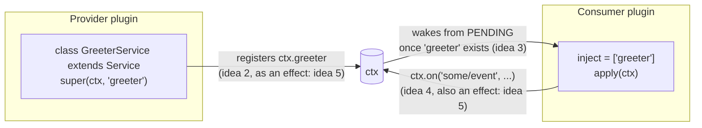

## The short version

Every package in this repository — the session log, the tool registry, the model adapter, the agent loop itself — is a Cordis plugin, and there is no privileged core: a plugin declares what it needs and what it provides, and a small runtime wires the graph together at boot. This chapter teaches the five ideas that explain how that runtime works — `Service`, `Context`, `inject`, typed events, and reversible effects — with runnable-shaped examples. A hands-on version with real commands lives in [`docs/cordis-tutorial/`](https://github.com/deepseek-ai/deepseek-harness/tree/master/docs/cordis-tutorial), which this chapter draws from directly. Hold all five and the generated service and event references in the rest of the course read as applications of one small, consistent rule set.

## The five ideas at a glance

:::concept{term="Service"}
A plugin is an object that implements `Service` — a bare function, an object with an `apply` method, or a `Service` subclass. Cordis loads all three the same way.
:::

:::concept{term="Context"}
The `ctx` passed into every plugin: a proxy that resolves Cordis's built-in services plus every service any plugin registers — `ctx.tools`, `ctx.llm`, `ctx.sessions`.
:::

:::concept{term="inject"}
A static field naming the services a plugin needs. Cordis holds the plugin `PENDING` until they all exist, so `apply` never null-checks and never hand-sequences boot.
:::

:::concept{term="Events"}
Typed pub/sub between plugins, dispatched through five modes (`emit` / `parallel` / `serial` / `bail` / `waterfall`). `waterfall` is the mode that powers interception and policy.
:::

:::concept{term="Effects"}
Every registration — service, listener, provider, timer — is a reversible effect, undone automatically when its owning plugin unloads.
:::

## Idea 1: a plugin is an object that implements Service

A Cordis plugin has three possible shapes, and all three end up loaded the same way:

```ts
// 1. Function plugin — the common case.
export function apply(ctx: Context) {}

// 2. Object plugin — an object with an `apply` method.
export const objectPlugin = {
  name: 'object-plugin',
  apply(ctx: Context) {},
}

// 3. Class plugin — a Service subclass.
export class MyService extends Service {
  constructor(ctx: Context) {
    super(ctx, 'myTutorialService')
  }
}
```

A function plugin needs no `apply` method — Cordis calls the function itself directly, and only uses its `name` for diagnostics. When a plugin is loaded — whether from a `cordis.yml` entry or from `ctx.plugin(child)` inside another plugin's code — Cordis creates a runtime handle for that instance and calls `apply(ctx)` (or the class constructor) with a context scoped to that plugin.

:::concept{term="fiber"}
The runtime handle Cordis creates for one loaded plugin instance. It is what actually moves through the lifecycle state machine below and what gets disposed when the plugin unloads.
:::

Fibers move through a small state machine:

:::timeline
- PENDING — a required service (idea 3, below) is not available yet
- LOADING — the `apply` call is running
- ACTIVE — `apply` has returned; the plugin is live
- FAILED — `apply` or config validation threw (a side branch, not a successor)
- UNLOADING — teardown is running
- DISPOSED — teardown complete
:::

A plugin whose module fails to load throws loudly — a typo'd path is one of the few failures Cordis reports through its logger instead of crashing, which is why a freshly added entry that prints nothing is usually a spelling problem, not a silent skip.

There is no meaningful ordering in a `cordis.yml` entry list — every entry starts concurrently, and *when* a plugin actually reaches `ACTIVE` is decided entirely by idea 3 (service dependencies), not by file position.

## Idea 2: a context is a repository of services

The `ctx` argument passed into every plugin is a context: a proxy object that resolves a fixed set of built-in properties plus every service any plugin has registered. Reading `ctx.events`, `ctx.logger`, `ctx.registry`, or `ctx.reflect` reaches Cordis's own bootstrap services; reading `ctx.tools`, `ctx.llm`, or `ctx.sessions` reaches harness services registered the exact same way.

The `Context` interface itself is declared as an open interface precisely so more services can be added to it:

```ts
export interface Context {
  root: this
  events: EventsService
  logger: LoggerService
  reflect: ReflectService
  registry: RegistryService
  // every harness service — ctx.tools, ctx.llm, ctx.sessions — merges in here too
}
```

A consumer names a capability by its stable key — `'tools'`, `'llm'`, `'sessions'` — rather than importing a concrete implementation module. That indirection is what lets configuration swap a provider (a different LLM adapter, a different shell backend) without touching any of its consumers. Every service occupies one flat namespace per running application, so a plugin author claiming a new name should prefix or namespace it distinctively; the harness has already claimed the plain ones.

A service is provided by extending Cordis's `Service` base class and calling `super(ctx, name)`:

```ts
export class GreeterService extends Service {
  constructor(ctx: Context) {
    super(ctx, 'greeter')
  }

  greet(who: string) {
    return `Hello, ${who}!`
  }
}
```

That `super()` call registers the instance under `'greeter'` immediately; from then on any plugin sharing that context tree reaches it as `ctx.greeter`.

> [!NOTE]
> The `super(ctx, 'greeter')` call is what makes `ctx.greeter` resolve at runtime; a separate `declare module '@deepseek-ai/cordis' { interface Context { greeter: GreeterService } }` block is TypeScript declaration merging that makes `ctx.greeter` typecheck. The merge generates no code — the service works at runtime without it — but consumers lose type safety and autocomplete without it.

A `Service` subclass is itself a plugin (the class form from idea 1), so it still gets mounted with `ctx.plugin(GreeterService)`.

## Idea 3: declare service dependency via `inject`

A plugin that needs a service names it in a static `inject` field:

```ts
export const inject = ['greeter']

export function apply(ctx: Context) {
  // guaranteed ready: Cordis held this plugin PENDING until 'greeter' existed
  console.log(ctx.greeter.greet('world'))
}
```

Cordis holds the plugin's fiber at `PENDING` until every named service exists, so by the time `apply` actually runs, `ctx.greeter` is guaranteed present — no null checks, no manual boot sequencing. This is why load order in `cordis.yml` never matters: swap two entries, and the same plugin still starts in the same relative order, because that order comes from the dependency graph, not from file position. Remove the provider entirely, and the consumer just stays `PENDING` forever, printing nothing — not a crash, not a partial run. A `PENDING` fiber doesn't even keep the process's event loop alive, so a composition with nothing else running exits cleanly.

`inject` is not a one-time boot check — it's continuously enforced. If a service's provider unloads or hot-reloads while the app is running, every plugin that injected it is unloaded too, and reloads automatically once the service comes back. That is also the mechanism that makes provider swaps in config safe: unload one `shell` provider entry, mount a different one, and every plugin injecting `'shell'` restarts cleanly against the new implementation, with no stale reference left dangling.

:::decision
`inject` is for hard requirements only — a capability the plugin cannot run without. For a capability it *can* live without, read it with `ctx.get(name)` at the point of use, which returns `undefined` instead of holding the fiber at `PENDING`. Declaring an optional capability in `inject` would needlessly block the plugin — and cascade-unload it on every provider reload — for something it could have degraded around.
:::

```ts
const greeter = ctx.get('greeter')  // undefined if nothing provides it
console.log(greeter?.greet('maybe') ?? 'no greeter available')
```

## Idea 4: typed events for communication

Services support direct calls; **events** let a plugin announce something without knowing — or caring — who is listening. A plugin declares an event's name and listener signature with the same declaration-merging trick used for services, this time on an `Events` interface:

```ts
declare module '@deepseek-ai/cordis' {
  interface Events {
    'stats/report'(name: string, count: number): void
  }
}
```

The `namespace/action` naming convention (`stats/report`, `agent/request`, `approval/request`) keeps one flat event namespace readable. Once declared, an event can be dispatched through one of five methods, and which one an event uses is part of its public contract — every harness event documents it with an `@mode` tag, checked against actual dispatch sites by the generated documentation:

| Mode | Call | Awaited? | Order | Return value? |
|---|---|---|---|---|
| `emit` | `ctx.emit(name, ...args)` | No | registration order | No |
| `parallel` | `await ctx.parallel(name, ...args)` | Yes | all listeners concurrently | No |
| `serial` | `await ctx.serial(name, ...args)` | Yes | registration order | Yes — first non-`null`/`false`/`undefined` wins |
| `bail` | `ctx.bail(name, ...args)` | No | registration order | Yes — synchronous `serial` |
| `waterfall` | `ctx.waterfall(name, ...args, next)` | No | registration order | Yes — around-middleware |

`ctx.on(event, listener)` registers a listener, and — because it is itself built on the effect mechanism from idea 5 — that listener disappears automatically when its owning plugin unloads. No manual `removeListener` bookkeeping, ever.

### Waterfall: the mode that powers interception

`waterfall` deserves its own attention because it is how the harness implements interception and policy decisions — `agent/request` lets a plugin replace the outgoing model-call config, and `approval/request` lets a policy plugin answer instead of the human user. A waterfall listener receives the dispatch arguments plus one extra trailing argument: a `next()` continuation.

```ts
declare module '@deepseek-ai/cordis' {
  interface Events {
    'demo/transform'(input: string, next: () => Promise<string>): Promise<string>
  }
}

// Listener 1: wraps whatever the rest of the chain returns.
ctx.on('demo/transform', async (input, next) => {
  const downstream = await next()
  return downstream.toUpperCase()
})

// Listener 2: owns the decision for one case, delegates for the rest.
ctx.on('demo/transform', async (input, next) => {
  if (input.includes('blocked')) return '** blocked **'
  return next()
})
```

Calling `next()` invokes the next-registered listener (and eventually the innermost default passed to `ctx.waterfall` itself); *not* calling it — returning directly — vetoes everything downstream. Dispatching `ctx.waterfall('demo/transform', 'blocked words', async () => 'blocked words')` runs listener 1 first, which calls `next()` and thereby invokes listener 2; listener 2 sees `'blocked'`, decides the outcome, and returns without calling `next()`, so the innermost default never runs; on the way back out, listener 1 uppercases whatever it received. The visible result is `** BLOCKED **` — the veto and the wrap composed around each other.

> [!PITFALL]
> **A waterfall listener that only observes or annotates must call `next()`.** A logging or telemetry listener that forgets `next()` silently swallows every downstream listener's behavior for the whole application. Short-circuiting is the *design* for a listener that legitimately owns a single-decision event — a policy answering "approve" or "deny" — but it is a bug for a listener that was only supposed to watch.

## Idea 5: registrations are reversible effects

Prompt sections, tool schemas, adapters, providers, and event listeners are all installed through `ctx.effect()` or one of the APIs built on it, and every one of those registrations is undone automatically when its owning plugin unloads — whether that unload comes from a config edit, a hot reload, an explicit disposal, or the loss of a required service from idea 3.

You rarely write `ctx.effect()` directly, because the APIs you already use are effects underneath:

- `ctx.on(event, listener)` removes the listener on unload.
- `ctx.plugin(child)` disposes the child fiber with its parent.
- Service registration (`super(ctx, name)` inside a `Service` subclass) unregisters the service.
- Harness registries — `ctx.tools.register(...)` and similar — attach their own disposers to the calling plugin, so they unwind the same way without extra code.

For a resource Cordis itself does not manage — a timer, an open connection, a filesystem watcher — you wrap the acquisition in `ctx.effect()` and return a disposer:

```ts
ctx.effect(() => {
  const timer = setInterval(() => console.log('tick'), 200)
  return () => clearInterval(timer)
})
```

The callback passed to `effect()` runs immediately; the disposer it returns runs during unload — including hot reload — and you never call that disposer yourself for a plugin-lifetime resource.

> [!PITFALL]
> Disposers start in reverse registration order, but multiple *async* disposers run concurrently with each other. If teardown steps genuinely must happen in sequence, keep them inside one disposer and `await` each step there rather than splitting them across multiple `ctx.effect()` calls.

## How the five ideas compose



A provider plugin (idea 1) registers a service on the shared context (idea 2); that registration is itself an effect (idea 5), so it vanishes if the provider unloads. A consumer plugin declares the dependency with `inject` (idea 3) and stays `PENDING` until the service is there. Once active, plugins communicate further through typed events (idea 4) — and every listener they register is, again, an effect that unwinds with them. Pull any one of the five ideas out and the rest stop making sense: services without effects would leak on unload; `inject` without the fiber state machine would have no place to wait; events without dispatch-mode contracts would give interceptors no defined way to cooperate or veto.

## Practical rules that follow

- **Encapsulate by capability, not by consumer.** A tool-pipeline event belongs to `ctx.tools`; model streaming belongs to `ctx.llm`; live agent coordination belongs to `ctx.agents`.
- **Prefer events for interception and policy; prefer service methods for direct capability calls.** If a plugin's job is to decide or observe, it listens; if its job is to do something specific on request, it calls a method.
- **Every registration should have a disposer** — either returned from `ctx.effect()` directly, or produced by a Cordis helper (`ctx.on`, `ctx.plugin`, a `Service` constructor, a harness registry's `register()`) that already returns one for you.

With these five ideas in hand, the generated service and event references on the subsystem pages — and the rest of this course, which builds the harness's actual agent loop, tool pipeline, and session log out of exactly this vocabulary — should read as applications of a small, consistent set of rules rather than a pile of framework trivia.
