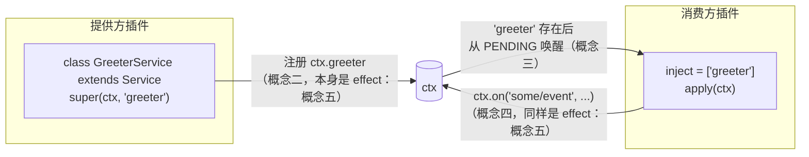

## 为什么从这里开始

这个仓库里的每一个包——session 日志、工具注册表、模型适配器，乃至 agent loop 本身——都是一个 Cordis 插件。这里没有特权核心：一个插件声明自己需要什么、提供什么，剩下的图连接工作由一个很小的运行时在启动时完成。在任何生成的服务或事件参考文档变得可读之前，你需要先掌握关于这个运行时如何工作的五个核心概念。本章用可运行的示例逐一讲解这五个概念；带真实命令的动手版本在 [`docs/cordis-tutorial/`](https://github.com/deepseek-ai/deepseek-harness/tree/master/docs/cordis-tutorial) 中，本章内容直接取材于此。

## 概念一：插件是实现 Service 的对象

一个 Cordis 插件有三种可能的形态，三者最终都会以相同方式被加载：

```ts
// 1. 函数插件——最常见的形式。
export function apply(ctx: Context) {}

// 2. 对象插件——带有 apply 方法的对象。
export const objectPlugin = {
  name: 'object-plugin',
  apply(ctx: Context) {},
}

// 3. 类插件——一个 Service 子类。
export class MyService extends Service {
  constructor(ctx: Context) {
    super(ctx, 'myTutorialService')
  }
}
```

函数插件不需要 `apply` 方法——Cordis 会直接调用这个函数本身，它的 `name` 只用于诊断信息。当一个插件被加载时——无论是来自 `cordis.yml` 中的一个条目，还是来自另一个插件代码里的 `ctx.plugin(child)`——Cordis 都会为这个实例创建一个运行时句柄，称为 **fiber**，然后用一个限定在该插件范围内的上下文调用 `apply(ctx)`（或类构造函数）。

fiber 会在一个小型状态机中流转：

```
PENDING → LOADING → ACTIVE → UNLOADING → DISPOSED
                 ↘ FAILED
```

`PENDING` 表示所需服务（见下面的概念三）尚不可用；`LOADING`/`ACTIVE` 分别对应 `apply` 正在运行和已经运行完毕；`FAILED` 表示 `apply` 或配置校验抛出了异常；`UNLOADING`/`DISPOSED` 分别对应拆除过程正在进行和已经完成。如果某个插件的模块加载失败，会明确报错——只有路径拼写错误这类情况例外，Cordis 会通过 logger 报告，而不会让进程崩溃，这也是为什么一个新增条目「看起来什么也没做」时，通常应该先检查拼写，而不是怀疑它被静默跳过了。

`cordis.yml` 中条目列表的顺序没有实质意义——所有条目都会并发启动，一个插件*何时*真正达到 `ACTIVE` 状态完全由概念三（服务依赖）决定，而不是由它在文件中的位置决定。

## 概念二：上下文是服务的容器

每个插件收到的 `ctx` 参数就是一个**上下文**：一个代理对象，它会解析一组固定的内置属性，以及任何插件已经注册的所有服务。读取 `ctx.events`、`ctx.logger`、`ctx.registry` 或 `ctx.reflect` 会访问 Cordis 自身的引导服务；读取 `ctx.tools`、`ctx.llm` 或 `ctx.sessions` 则会访问以完全相同方式注册的 harness 服务。`Context` 接口本身被声明为一个开放接口，正是为了让更多服务能被添加进去：

```ts
export interface Context {
  root: this
  events: EventsService
  logger: LoggerService
  reflect: ReflectService
  registry: RegistryService
  // 每一个 harness 服务——ctx.tools、ctx.llm、ctx.sessions——也是在这里合并进来的
}
```

消费方通过一个稳定的 key（如 `'tools'`、`'llm'`、`'sessions'`）来指定某项能力，而不是导入某个具体实现模块。正是这层间接性，让配置可以在不改动任何消费方代码的情况下替换提供方（换一个 LLM 适配器、换一个 shell 后端）。每个应用中的所有服务共用同一个扁平命名空间，因此插件作者如果要注册新的服务名，应当加上有辨识度的前缀或命名空间——普通名字已经被 harness 占用了。

服务的提供方式是继承 Cordis 的 `Service` 基类并调用 `super(ctx, name)`：

```ts
export class GreeterService extends Service {
  constructor(ctx: Context) {
    super(ctx, 'greeter')
  }

  greet(who: string) {
    return `Hello, ${who}!`
  }
}
```

这个 `super()` 调用会立即把该实例注册为 `'greeter'`；此后，共享这棵上下文树的任何插件都可以通过 `ctx.greeter` 访问它。这里有运行时和编译时两个容易混淆的部分：`super(ctx, 'greeter')` 调用才是真正让 `ctx.greeter` 在运行时可解析的原因；而另一个单独的 `declare module '@deepseek-ai/cordis' { interface Context { greeter: GreeterService } }` 代码块，是 TypeScript 的声明合并，它让 `ctx.greeter` 能够通过类型检查。声明合并不会生成任何代码——没有它服务在运行时仍然可用——但没有它消费方就会失去类型安全和自动补全。`Service` 子类本身就是一个插件（概念一中的类形态），所以它仍然要通过 `ctx.plugin(GreeterService)` 挂载。

## 概念三：通过 `inject` 声明服务依赖

一个需要某个服务的插件，会在一个静态的 `inject` 字段中声明它：

```ts
export const inject = ['greeter']

export function apply(ctx: Context) {
  // 此处可以确保已经就绪：Cordis 会让这个插件保持 PENDING，直到 'greeter' 存在
  console.log(ctx.greeter.greet('world'))
}
```

Cordis 会让插件的 fiber 保持在 `PENDING` 状态，直到列出的每个服务都存在，因此当 `apply` 真正运行时，`ctx.greeter` 一定已经就绪——不需要判空，也不需要手动编排启动顺序。这也是为什么 `cordis.yml` 中的加载顺序从不重要：交换两个条目的位置，同一个插件仍然会以相同的相对顺序启动，因为这个顺序来自依赖图，而不是文件中的位置。如果彻底移除提供方，消费方就会永远停留在 `PENDING`，不输出任何内容——既不崩溃，也不会只运行一部分。处于 `PENDING` 的 fiber 甚至不会让进程的事件循环保持活跃，因此如果整个组合中没有其他运行项，进程会干净地退出。

`inject` 不是一次性的启动检查——它会被持续地强制执行。如果应用运行期间某个服务的提供方被卸载或热替换，每个注入了该服务的插件也会随之被卸载，并在服务恢复后自动重新加载。这也正是配置中可以安全替换提供方的机制：卸载某个 `shell` 提供方条目，挂载另一个，所有注入 `'shell'` 的插件都会针对新实现干净地重启，不会留下任何悬空的旧引用。

`inject` 只用于硬性依赖。如果某项能力缺失时插件仍然可以运行，应当改用 `ctx.get(name)` 在使用处读取，它会返回 `undefined` 而不是阻塞加载：

```ts
const greeter = ctx.get('greeter')  // 没有任何提供方时为 undefined
console.log(greeter?.greet('maybe') ?? 'no greeter available')
```

## 概念四：类型化事件用于通信

服务支持直接调用；**事件**则让插件无需知道——也不必关心——有哪些插件正在监听，就能发出通知。插件使用与服务相同的声明合并技巧，只不过这次作用在 `Events` 接口上，来声明事件名称及其监听器签名：

```ts
declare module '@deepseek-ai/cordis' {
  interface Events {
    'stats/report'(name: string, count: number): void
  }
}
```

`namespace/action` 的命名约定（`stats/report`、`agent/request`、`approval/request`）让这个扁平的事件命名空间保持易读。声明之后，一个事件可以通过五种分发方法之一来触发，采用哪种方法是事件公开约定的一部分——每个 harness 事件都会用 `@mode` 标签记录，并由生成的文档与实际分发调用点做交叉校验：

| 模式 | 调用方式 | 是否 await？ | 顺序 | 是否有返回值？ |
|---|---|---|---|---|
| `emit` | `ctx.emit(name, ...args)` | 否 | 按注册顺序 | 否 |
| `parallel` | `await ctx.parallel(name, ...args)` | 是 | 所有监听器并发 | 否 |
| `serial` | `await ctx.serial(name, ...args)` | 是 | 按注册顺序 | 是——第一个非 `null`/`false`/`undefined` 返回值胜出 |
| `bail` | `ctx.bail(name, ...args)` | 否 | 按注册顺序 | 是——`serial` 的同步版本 |
| `waterfall`（瀑布式事件） | `ctx.waterfall(name, ...args, next)` | 否 | 按注册顺序 | 是——环绕中间件 |

`ctx.on(event, listener)` 用于注册监听器，并且——因为它本身构建在概念五的 effect 机制之上——这个监听器会在其所属插件卸载时自动消失，永远不需要手动维护 `removeListener`。

### waterfall：实现拦截的模式

`waterfall` 值得单独讲一讲，因为它正是 harness 用来实现拦截和策略决策的方式——`agent/request` 允许某个插件替换即将发出的模型调用配置，`approval/request` 允许策略插件代替真人用户作答。waterfall 监听器接收到的参数，比分发时传入的多一个：末尾追加的 `next()` continuation。

```ts
declare module '@deepseek-ai/cordis' {
  interface Events {
    'demo/transform'(input: string, next: () => Promise<string>): Promise<string>
  }
}

// 监听器 1：包装链条其余部分的返回值。
ctx.on('demo/transform', async (input, next) => {
  const downstream = await next()
  return downstream.toUpperCase()
})

// 监听器 2：在某种情况下自己拥有决策权，否则委托下去。
ctx.on('demo/transform', async (input, next) => {
  if (input.includes('blocked')) return '** blocked **'
  return next()
})
```

调用 `next()` 会执行下一个已注册的监听器（最终会执行传给 `ctx.waterfall` 本身的最内层默认逻辑）；*不*调用它——直接返回——就会否决它之后的一切。分发 `ctx.waterfall('demo/transform', 'blocked words', async () => 'blocked words')` 时，监听器 1 先运行，它调用了 `next()`，从而执行了监听器 2；监听器 2 看到 `'blocked'`，自行决定了结果，并且不调用 `next()` 就直接返回，因此最内层的默认逻辑从未运行；在返回的路上，监听器 1 把收到的内容转换成了大写。最终可见的结果是 `** BLOCKED **`——否决与包装相互组合的结果。

由此产生一项纪律：**只负责观察或标注的 waterfall 监听器必须调用 `next()`**。一个日志或遥测监听器如果忘了调用 `next()`，就会悄无声息地吞掉整个应用中所有下游监听器的行为。对于真正拥有单一决策权的监听器（比如一个策略插件要回答「批准」还是「拒绝」）而言，短路正是设计意图；但对于本应只是旁观的监听器来说，这就是一个 bug。

## 概念五：注册是可逆的副作用

提示词片段、工具 schema、适配器、提供方和事件监听器，全部通过 `ctx.effect()` 或建立在它之上的其他 API 安装，而每一项这样的注册都会在其所属插件卸载时自动撤销——无论这次卸载是来自配置修改、热重载、显式资源释放，还是概念三中所需服务的消失。

你很少需要亲自编写 `ctx.effect()`，因为你已经在用的那些 API 底层就是 effect：

- `ctx.on(event, listener)`：卸载时移除监听器。
- `ctx.plugin(child)`：随父插件一起释放子插件的 fiber。
- 服务注册（`Service` 子类内部的 `super(ctx, name)`）：撤销该服务。
- harness 的各类注册表——`ctx.tools.register(...)` 之类——会把自己的 disposer 附着到调用它的插件上，因此无需额外代码就能以同样方式撤销。

对于 Cordis 自身不管理的资源——定时器、打开的连接、文件系统 watcher——你需要把获取过程包装在 `ctx.effect()` 中，并返回一个 disposer：

```ts
ctx.effect(() => {
  const timer = setInterval(() => console.log('tick'), 200)
  return () => clearInterval(timer)
})
```

传给 `effect()` 的回调会立即运行；它返回的 disposer 会在卸载期间运行——热重载时也不例外——对于生命周期与插件一致的资源，你绝不需要自己调用这个 disposer。有一个顺序细节值得尽早记住：disposer 会按注册顺序的逆序启动，但多个**异步** disposer 彼此之间会并发运行。如果拆除步骤确实必须按顺序执行，应当把它们放进同一个 `ctx.effect()` 调用里，在其中依次 `await` 每一步，而不是拆分到多个 `ctx.effect()` 调用中。

## 五个概念如何组合在一起



一个提供方插件（概念一）在共享上下文（概念二）上注册一个服务；这次注册本身就是一个 effect（概念五），因此如果提供方被卸载，注册会随之消失。消费方插件通过 `inject`（概念三）声明依赖，并在服务出现之前保持 `PENDING`。一旦激活，插件之间会进一步通过类型化事件（概念四）通信——而它们注册的每一个监听器，同样是随自己一起撤销的 effect。抽掉五个概念中的任何一个，其余的都会失去意义：没有 effect 的服务会在卸载时泄漏；没有 fiber 状态机，`inject` 就无处可等；没有分发模式约定，事件也无法给拦截者提供明确的协作或否决方式。

## 由此得出的实践规则

- **按能力而非按消费方划分插件边界。** 工具流水线事件属于 `ctx.tools`；模型流式输出属于 `ctx.llm`；实时 agent（智能体）协调属于 `ctx.agents`。
- **拦截和策略优先使用事件；直接的能力调用优先使用服务方法。** 如果一个插件的职责是做决策或旁观，它应该监听；如果职责是按请求执行某个具体动作，它应该调用方法。
- **每一次注册都应该有一个 disposer**——要么直接从 `ctx.effect()` 返回，要么由某个已经替你返回 disposer 的 Cordis 辅助方法（`ctx.on`、`ctx.plugin`、`Service` 构造函数，或某个 harness 注册表的 `register()`）产生。

掌握了这五个概念之后，子系统页面上生成的服务与事件参考文档——以及本课程后续用同一套词汇构建出的 harness 真实 agent loop、工具流水线与 session 日志——读起来就会是一套小而一致的规则的具体应用，而不再是一堆零散的框架细节。
