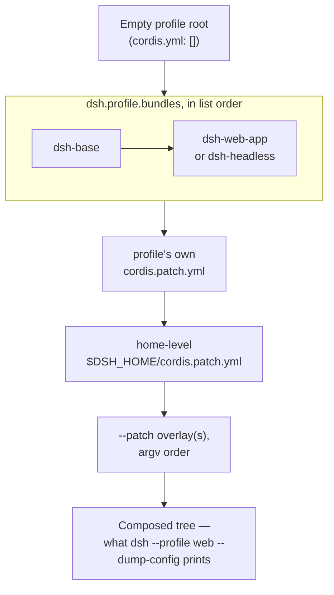

## Booting a profile is composing patch layers

`dsh --profile web` does not launch a fixed binary with a fixed feature set. It resolves a directory, `$DSH_HOME/profiles/web`, and composes a plugin tree from the layers that directory names. The same mechanism boots `dsh --profile headless "run the tests"`, and it boots any profile a person creates by hand — there is no privileged, hardcoded composition inside `apps/cli` that the shipped profiles get and a custom one does not.

A profile directory holds two files: a `package.json` carrying a `dsh.profile` field with an ordered `bundles` list (plus whatever out-of-tree plugin `dependencies` pnpm manages there), and the profile's own `cordis.patch.yml`. Bundle names in that list resolve from the `dsh` installation first, then from the profile's own `node_modules`, so shipped bundles (`@deepseek-ai/dsh-base`, `@deepseek-ai/dsh-web-app`, `@deepseek-ai/dsh-headless`) always come from the same installation as the running `dsh`, while a plugin someone `add`ed comes from pnpm.

:::concept{term="bundle"}
A bundle is not a special runtime concept — it is a distribution format. Any npm package whose manifest declares

```json
"dsh": { "bundle": { "patch": "./cordis.patch.yml" } }
```

is installable as one patch layer in a profile's `bundles` list. The two roles — `dsh.profile` for a profile's own manifest, `dsh.bundle` for a bundle's — live under distinct keys, so a `package.json` states unambiguously which one it is.
:::

## The tree composes over an empty root

Every profile's actual root config is an empty entry list. `apps/cli/src/profile-boot.ts` writes it fresh on every load:

```ts
/** The empty root entry list every profile tree patches over. */
const PROFILE_ROOT_CONFIG = `# dsh profile root — an empty entry list. The tree is composed as patches:
# each bundle in package.json's dsh.profile.bundles, then cordis.patch.yml, then any
# --patch overlays. Edit cordis.patch.yml, not this file.
[]
`
```

Nothing lives in that file by design — the whole composition is patches applied over `[]`, and the file exists only so the Loader has a real include root to anchor relative paths at the profile directory.

## The three shipped bundles

| Bundle | Role | Mounts over |
|---|---|---|
| `dsh-base` | Model adapters, tools, persistence, sandbox/approval policy, settings, credentials, telemetry — the first layer of every profile | the empty root |
| `dsh-web-app` | Browser Host rows (webserver, API gateway, workspace, projection cache, storage), the client roster, and the `web-runtime` glue plugin | `dsh-base` |
| `dsh-headless` | A direct one-shot Agent runner; no Host, HTTP server, or browser plugin at all | `dsh-base` |

`dsh-base` inserts its rows as a single block over the empty root. A short excerpt shows the shape — an ordinary Cordis `insert` list, each row an id plus a plugin name and config:

```yaml
- insert:
    - id: timer
      name: '@deepseek-ai/cordis-plugin-timer'

    - id: hmr
      name: '@deepseek-ai/cordis-plugin-hmr'
      config:
        root: ['.']

    - id: llm
      name: '@deepseek-ai/dsh-llm'
```

`dsh-headless` rides directly over `dsh-base` and demonstrates the other two patch operations — overriding a row by id, and disabling one — in 35 lines total:

```yaml
- id: system-prompt
  config:
    persona: >-
      You are a coding agent powered by the {{model}} model. Your working directory is {{cwd}}.

- id: hmr
  disabled: true

- insert:
    - id: code-runtime
      name: '@deepseek-ai/dsh-code-runtime-worker-thread'

    - id: headless-startup
      name: '@deepseek-ai/dsh-headless/startup'

    - id: headless-runner
      name: '@deepseek-ai/dsh-headless'
      inject: [headlessStartup]
      config:
        task: !!js ctx.headlessStartup.task
```

`web` and `headless` are the two shipped profile templates: `web` stacks `dsh-base` + `dsh-web-app`, `headless` stacks `dsh-base` + `dsh-headless`. Both auto-initialize on first use; any other profile name fails loud until `dsh plugin --profile <name> add <package>` creates it.

## Layering order

A patch either replaces a targeted row's whole `config` by `id`, or inserts new rows — there is no deep merge, so a profile override restates every field it wants to keep. Layers apply in one fixed order, and the same order governs both what actually boots and what `--dump-config` prints:



:::timeline
- empty profile root — the tree is composed over `[]`
- bundle layers — `dsh.profile.bundles`, in list order: `dsh-base`, then `dsh-web-app` or `dsh-headless`
- profile's own cordis.patch.yml
- home-level $DSH_HOME/cordis.patch.yml
- --patch overlay(s), in argv order — the composed tree `--dump-config` prints
:::

> [!WHY]
> The home-level file outranks the per-profile file because it holds machine-local preferences meant to apply to every profile on that machine, not just one.

`apps/cli/src/profile-boot.ts` builds exactly this sequence:

```ts
function allPatches(composed: ComposedProfile): PatchOptions[] {
  return [
    ...composed.bundlePatches,
    ...composed.profile.patches,
    ...composed.homePatches,
    ...composed.overlays,
  ]
}
```

and `composeProfile` derives each part the same way, feeding them to the include plugin's own `composeEntries` so the row index the launcher checks (for example, whether the tree has an `agent-presets` or telemetry row to patch further) can never diverge from what actually mounts:

```ts
function composeProfile(
  name: string,
  patchFiles: readonly string[],
): ComposedProfile {
  const profile = prepareProfile(name)
  const homePatches = loadOptionalPatches(NAME, homePatchPath()) ?? []
  const overlays = patchFiles.flatMap(file => loadOverlayPatches(NAME, resolve(file)))
  const bundlePatches = profile.layers.flatMap(layer => layer.patches)
  const rows = new Map<string, EntryOptions>()
  for (const row of composeEntries([bundlePatches, profile.patches, homePatches, overlays])) {
    if (typeof row.id === 'string') rows.set(row.id, row)
  }
```

Every profile boot also keeps both `cordis.patch.yml` layers live: an HMR watcher recomposes the full patch list — bundle layers fixed at the bottom, overlays fixed at the top — whenever either file changes, so editing your patch file has effect without a restart.

## Seeing the composition before it boots

```sh
dsh --profile web --dump-config
```

prints the fully composed tree with comments naming which file supplied each row, without booting anything. `--dump-default-config` prints only the bundle layers, skipping the profile's user layer, the home-level layer, and any `--patch`; `--dump-config` adds all three. Both reject an invocation that also carries app arguments, because a dump never runs the app's own command-line providers — showing a tree that implied flag-derived values it never evaluated would mislead:

```ts
if (args.length > 0) {
  program.error(`error: config dumps take no app arguments, got ${args.map(argument => JSON.stringify(argument)).join(' ')}`)
}
const defaultOnly = options.dumpDefaultConfig === true
if (defaultOnly && patches.length > 0) {
  program.error('error: --dump-default-config prints the bundle layers and takes no --patch')
}
```

The dump itself is produced by `runDumpConfig`, which loads the profile, turns each bundle layer plus (unless `--dump-default-config`) the profile patch, home patch, and each `--patch` file into labeled layers, and renders them with the include plugin's own parser and patch algorithm — the identical mechanics `boot()` uses, so the printed tree cannot drift from what a real boot mounts. Any row the dump prints is fair game for a patch of your own; a patch naming a row absent from the composed tree is a stderr warning, not a silent no-op.

## Why bundles and profiles, not a scan

The design this chapter describes replaced an earlier, more implicit scheme, and the rejected alternatives are informative:

- **Scanning `dependencies` for bundles, ordering the rest alphabetically** was the original sketch. It has two sources of truth (the scan and an implicit alphabetical tie-break) instead of one explicit, fully deterministic `dsh.profile.bundles` list. It also means a plain `pnpm add` inside a profile would risk silently activating a patch layer; under the shipped design, `pnpm add` installs a library and nothing more until you add it to `bundles`.
- **`link:` entries for in-box bundles** were rejected because pnpm cannot version, install, or update a `link:` pointed at the dsh installation, and a `link:` bakes a machine-specific path into a file a person might commit or share. The two-anchor resolution (installation first, profile directory second) plus a healed `$DSH_HOME/profiles/node_modules` symlink fallback gives the same "bundles come from the installation" guarantee without either problem.
- **Transitive bundle auto-application** — a bundle silently pulling in another bundle's patch through its own dependency graph — was rejected. Only bundles named directly in `dsh.profile.bundles` contribute a layer; a bundle that wants to re-export another bundle's rows must do so explicitly in its own patch file.

The consequence: a new composition surface — a TUI, a provider pack — ships as an ordinary npm package installable per profile, and the repository does not need a dedicated row or entry mode for every deployment shape. `apps/cli` itself shrank to argv parsing, profile-machinery consumption, and a thin pnpm forwarder.

## Installing a bundle into a profile

```sh
dsh plugin --profile tui add github:deepseek-harness/turtle-ui
dsh --profile tui
```

`dsh plugin` initializes the named profile if it does not exist yet, then forwards its remaining arguments straight to `pnpm` with the profile directory as the working directory. After every successful run it reconciles `dsh.profile.bundles` against what is actually installed: a dependency whose manifest declares a `dsh.bundle.patch` joins the layer stack, a bundle-less dependency stays a plain library, and a removed dependency drops out of the stack. Nothing about this reconciliation is model-visible or process-lifetime state — it only edits the profile's own `package.json`, which the next `dsh --profile tui` boot (or `--dump-config`) reads like any other profile.

## Recap

A running `dsh` is never one fixed program: it is a profile — an ordered bundle list plus two patch files — composed over an empty root in one fixed order (bundles, profile patch, home patch, `--patch` overlays), with `--dump-config` making that composition inspectable before anything mounts. Bundles are ordinary npm packages carrying one `cordis.patch.yml`; profiles are ordinary directories naming which bundles to stack. Nothing here is bespoke launcher logic — it is the same insert/override patch mechanism every other part of the harness uses to extend a Cordis tree, applied to the question of what a process boots with in the first place.
