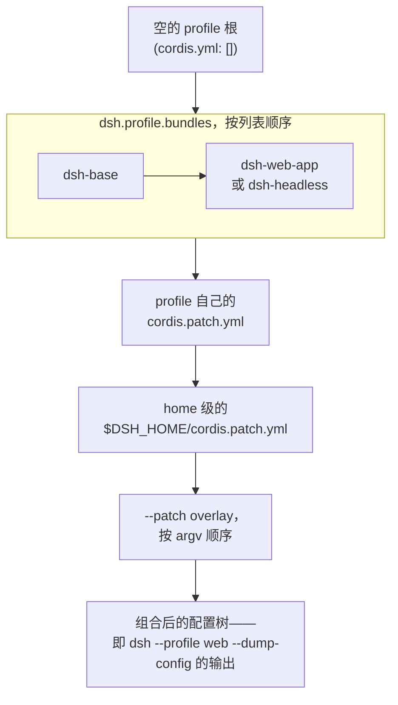

## 启动一个 profile，就是在组合 patch 层

`dsh --profile web` 并不是启动一个功能固定的二进制程序。它做的事情是：解析出一个目录 `$DSH_HOME/profiles/web`，再根据这个目录里声明的各层，组装出一棵插件树。`dsh --profile headless "run the tests"` 用的是同一套机制；任何人手工创建的自定义 profile，用的也是这同一套机制——`apps/cli` 内部没有任何特权的、硬编码的组合逻辑是随附 profile 独享、自定义 profile 享受不到的。

一个 profile 目录只有两份文件：一个带 `dsh.profile` 字段的 `package.json`，其中 `bundles` 是一份有序列表（该文件也顺带记录 pnpm 管理的树外插件 `dependencies`）；以及 profile 自己的 `cordis.patch.yml`。`bundles` 列表中的名字会先从 `dsh` 安装目录解析，再从 profile 自己的 `node_modules` 解析——因此随附组合包（`@deepseek-ai/dsh-base`、`@deepseek-ai/dsh-web-app`、`@deepseek-ai/dsh-headless`）永远来自运行中 `dsh` 所在的同一次安装，而某个人手动 `add` 进来的插件则来自 pnpm。

**组合包**（bundle）本身不是什么特殊的运行时概念，它只是一种分发格式。任何 npm 包，只要它的 manifest（元数据清单）里声明了

```json
"dsh": { "bundle": { "patch": "./cordis.patch.yml" } }
```

就可以作为一层 patch 装进某个 profile 的 `bundles` 列表。`dsh.profile`（profile 自己的 manifest）和 `dsh.bundle`（组合包的 manifest）分属两个不同的字段，所以一份 `package.json` 一眼就能看出自己扮演的是哪种角色。

## 配置树在空根之上组合而成

每个 profile 实际的根配置文件，内容都是一个空的条目列表。`apps/cli/src/profile-boot.ts` 在每次加载时都会重新写入这份文件：

```ts
/** The empty root entry list every profile tree patches over. */
const PROFILE_ROOT_CONFIG = `# dsh profile root — an empty entry list. The tree is composed as patches:
# each bundle in package.json's dsh.profile.bundles, then cordis.patch.yml, then any
# --patch overlays. Edit cordis.patch.yml, not this file.
[]
`
```

这份文件本来就不该有任何内容——整个组合过程就是在 `[]` 之上叠加各层 patch；它存在的唯一原因，是 Loader 需要一个真实的 include 根，用来把相对路径锚定到 profile 目录。

## 随附的三个组合包

| 组合包 | 职责 | 叠加在谁之上 |
|---|---|---|
| `dsh-base` | 模型适配器、工具、持久化、沙箱与审批策略、settings、凭据、遥测——每个 profile 最先应用的一层 | 空根 |
| `dsh-web-app` | 浏览器 Host 配置行（webserver、API 网关、workspace、投影缓存、存储）、浏览器插件名录，以及 `web-runtime` 粘合插件 | `dsh-base` |
| `dsh-headless` | 直接叠加的一次性 Agent runner；完全不挂载 Host、HTTP server 或浏览器插件 | `dsh-base` |

`dsh-base` 把自己的配置行作为**一整块** `insert` 插入空根之上。下面这段摘录展示了它的形态——一份普通的 Cordis `insert` 列表，每一行都是 id 加插件名和 config：

```yaml
- insert:
    - id: timer
      name: '@deepseek-ai/cordis-plugin-timer'

    - id: hmr
      name: '@deepseek-ai/cordis-plugin-hmr'
      config:
        root: ['.']

    - id: llm
      name: '@deepseek-ai/dsh-llm'
```

`dsh-headless` 直接叠加在 `dsh-base` 之上，用短短 35 行就演示了另外两种 patch 操作——按 id 覆盖某一行，以及禁用某一行：

```yaml
- id: system-prompt
  config:
    persona: >-
      You are a coding agent powered by the {{model}} model. Your working directory is {{cwd}}.

- id: hmr
  disabled: true

- insert:
    - id: code-runtime
      name: '@deepseek-ai/dsh-code-runtime-worker-thread'

    - id: headless-startup
      name: '@deepseek-ai/dsh-headless/startup'

    - id: headless-runner
      name: '@deepseek-ai/dsh-headless'
      inject: [headlessStartup]
      config:
        task: !!js ctx.headlessStartup.task
```

`web` 与 `headless` 是随附的两个 profile 模板：`web` 叠放 `dsh-base` + `dsh-web-app`，`headless` 叠放 `dsh-base` + `dsh-headless`。两者都在首次使用时自动初始化；其他任何 profile 名称在被 `dsh plugin --profile <name> add <package>` 创建之前都会明确报错。

## 分层的应用顺序

一条 patch 要么按 `id` 替换目标行的**整个** `config`，要么插入新行——不存在深度合并，因此 profile 覆盖必须重述自己想保留的每个字段。各层严格按照一个固定顺序应用，而这个顺序同时决定了「实际启动的是什么」和「`--dump-config` 打印的是什么」：



home 级文件之所以优先级高于逐 profile 的文件，是因为它承载的是「这台机器上适用于所有 profile」的机器本地偏好，而不只是某一个 profile 的偏好。`apps/cli/src/profile-boot.ts` 正是按这个顺序拼出完整的 patch 列表：

```ts
function allPatches(composed: ComposedProfile): PatchOptions[] {
  return [
    ...composed.bundlePatches,
    ...composed.profile.patches,
    ...composed.homePatches,
    ...composed.overlays,
  ]
}
```

`composeProfile` 也用同样的顺序推导各部分，并把它们喂给 include 插件自己的 `composeEntries`，这样启动器需要检查的行索引（比如配置树里是否存在 `agent-presets` 行或遥测行，从而决定要不要再叠加一层 patch）就绝不可能与实际挂载的内容产生偏离：

```ts
function composeProfile(
  name: string,
  patchFiles: readonly string[],
): ComposedProfile {
  const profile = prepareProfile(name)
  const homePatches = loadOptionalPatches(NAME, homePatchPath()) ?? []
  const overlays = patchFiles.flatMap(file => loadOverlayPatches(NAME, resolve(file)))
  const bundlePatches = profile.layers.flatMap(layer => layer.patches)
  const rows = new Map<string, EntryOptions>()
  for (const row of composeEntries([bundlePatches, profile.patches, homePatches, overlays])) {
    if (typeof row.id === 'string') rows.set(row.id, row)
  }
```

每次 profile 启动，两份 `cordis.patch.yml` 也都会保持热更新：HMR 监视器会在任意一份文件变化时重新组合完整的 patch 列表——组合包层固定在最底部、overlay 固定在最顶部——因此编辑自己的 patch 文件无需重启即可生效。

## 在启动之前先看清组合结果

```sh
dsh --profile web --dump-config
```

会打印出完整组合后的配置树，并用注释标明每一行由哪个文件提供，全程不会启动任何东西。`--dump-default-config` 只打印组合包各层，跳过 profile 的用户层、home 级层和任何 `--patch`；`--dump-config` 则把三者都加上去。两者都会拒绝携带应用参数的调用，因为 dump 从不运行应用自己的命令行参数提供方——如果打印出一棵暗示了某些 flag 取值、但那些值其实从未被求值的配置树，只会误导使用者：

```ts
if (args.length > 0) {
  program.error(`error: config dumps take no app arguments, got ${args.map(argument => JSON.stringify(argument)).join(' ')}`)
}
const defaultOnly = options.dumpDefaultConfig === true
if (defaultOnly && patches.length > 0) {
  program.error('error: --dump-default-config prints the bundle layers and takes no --patch')
}
```

真正产出这份 dump 的是 `runDumpConfig`：它加载 profile，把每个组合包层，以及（除非指定了 `--dump-default-config`）profile 的 patch、home 级 patch 和每个 `--patch` 文件，都变成带标签的层，再用 include 插件自己的解析器和 patch 算法把它们渲染出来——这与 `boot()` 用的是完全相同的机制，因此打印出的树不可能与真实启动的结果产生偏差。dump 打印出的任何一行，都可以被你自己的 patch 替换；如果某条 patch 指定的行 id 不在组合出的树中，只会得到一条 stderr 警告，而不是被静默忽略。

## 为什么是组合包与 profile，而不是扫描

本章描述的这套设计，取代了一套更隐式的早期方案，其中被否决的几个备选思路很能说明问题：

- **扫描 `dependencies` 找组合包，未列出的按字母序排列**——这是最初的草案。它有两个真源（扫描结果和一条隐式的字母序决胜规则），而不是一个；一份显式、有序的 `dsh.profile.bundles` 列表更小，也完全确定。这个方案还意味着一次普通的 `pnpm add` 有可能悄悄激活某个 patch 层；而在随附的设计下，`pnpm add` 只是安装一个库，除非你把它显式加进 `bundles`，否则不会激活任何东西。
- **内置组合包使用 `link:` 条目**——被否决，因为 pnpm 无法对指向 dsh 安装目录的 `link:` 做版本管理、安装或更新，而且 `link:` 会把一个机器专属的路径固化进一份可能被提交或分享的文件里。双锚点解析（先安装目录、后 profile 目录）加上修复过的 `$DSH_HOME/profiles/node_modules` 符号链接回退，能提供同样「组合包必然来自安装目录」的保证，却不带来这两个问题。
- **组合包的传递式自动应用**——即一个组合包通过自己的依赖图悄悄带出另一个组合包的 patch——被否决。只有直接列在 `dsh.profile.bundles` 中的组合包才会贡献一层；如果一个组合包想要重新导出另一个组合包的配置行，必须在自己的 patch 文件里显式完成。

由此带来的结果是：一种新的组合表层——一个 TUI、一个提供方扩展包——可以作为普通 npm 包发布，按 profile 安装，仓库不需要为每一种部署形态都专门留一行或专门开一种入口模式。`apps/cli` 本身也因此收缩为 argv 解析、消费 profile 机制，以及一层薄薄的 pnpm 转发器。

## 把组合包装进一个 profile

```sh
dsh plugin --profile tui add github:deepseek-harness/turtle-ui
dsh --profile tui
```

`dsh plugin` 会在指定的 profile 不存在时先初始化它，然后把剩余参数原样转发给 `pnpm`，工作目录就是该 profile 目录。每次成功运行之后，它都会把 `dsh.profile.bundles` 与实际安装状态做一次调和：如果某个依赖的 manifest 声明了 `dsh.bundle.patch`，它就会加入配置层栈；没有组合包声明的依赖仍然只是一个普通库；被移除的依赖也会从层栈中退出。这次调和不涉及任何模型可见或进程生命周期状态——它只是改写 profile 自己的 `package.json`，下一次 `dsh --profile tui` 启动（或 `--dump-config`）会像读取其他任何 profile 一样读到它。

## 小结

一个运行中的 `dsh` 从来不是一个功能固定的程序：它是一个 profile——一份有序的组合包列表加两份 patch 文件——按固定顺序（组合包、profile patch、home patch、`--patch` overlay）叠加在一个空根之上，而 `--dump-config` 能让这次组合在任何东西挂载之前就变得可检查。组合包是携带一份 `cordis.patch.yml` 的普通 npm 包；profile 是声明该叠放哪些组合包的普通目录。这里没有任何专属于启动器的特殊逻辑——它用的正是 harness 中其他所有部分用来扩展 Cordis 树的那套 insert/override patch 机制，只不过这次扩展的对象，是「一个进程一开始该带着什么启动」这个问题本身。
