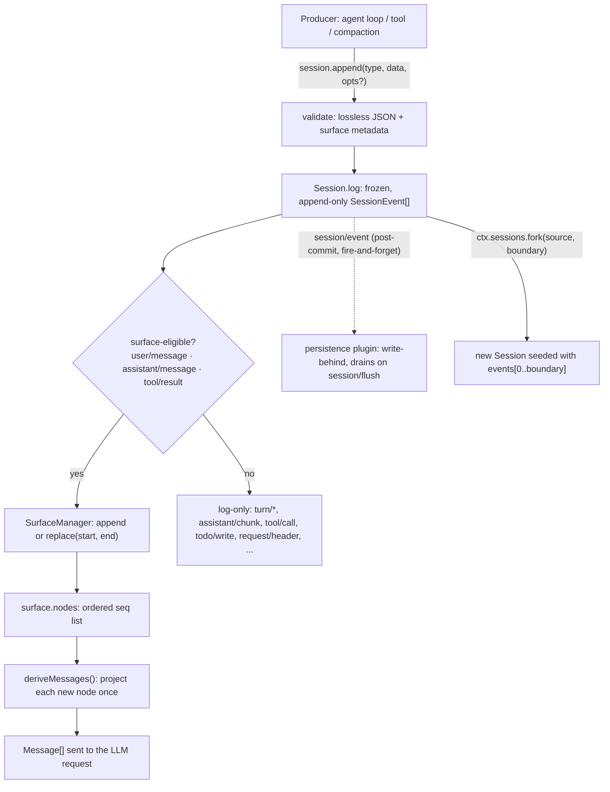

## The array you'd expect, and the log you actually get

Most agent frameworks represent a conversation as a mutable array of messages: push a user turn, push an assistant turn, splice in a tool result, and hand the array to the provider. It works until something needs to *observe* that history changing — a persistence layer, a telemetry pipeline, a replay tool, a second UI tab — and now you either poll the array or bolt a notification system onto every mutation site. The two representations (the array, and whatever your notifications said happened) can drift. A missed event, a dropped notification, a mutation that forgot to fire one, and your trace lies about what the model actually saw.

`@deepseek-ai/dsh-session` avoids that problem by not having a mutable array at all.

:::concept{term="Session"}
An **append-only log of typed `SessionEvent`s** — the single source of truth for everything that happened in an agent's interaction, from turn boundaries and raw provider stream chunks to the assembled messages themselves. There is no separate "current state" to keep in sync: the log **is** the state, and every other view — the LLM message history, the human transcript, the durable storage row — is a *projection* computed from it. Divergence between what happened and what's recorded is not a bug you have to avoid; it's structurally impossible, because there is nothing else to diverge from.
:::

## `SessionEvent`: one append-only, merge-extensible union

Every entry in the log has the same envelope, defined as a discriminated union over `type` so a `switch` narrows `data` without casts:

```ts
export type SessionEvent<T extends SessionEventType = SessionEventType> = {
  [K in SessionEventType]: {
    type: K
    /** Monotonic sequence number within the session. */
    seq: number
    /** Unix epoch milliseconds. */
    time: number
    data: SessionEventMap[K]
    ignorable?: true
  } & (K extends SurfaceEventType ? {
    sourceEventSeqs?: number[]
    surfaceOp?: SurfaceOp
  } : object)
}[T]
```

(`packages/core/session/src/types.ts:404-436`)

`SessionEventType` is `keyof SessionEventMap` — an interface that a plugin extends via TypeScript declaration merging, which is why the compaction seam can add `compaction/*` events and the hook bridges can add `hook/*` events without touching this package. The core vocabulary defined in `dsh-session` itself (`types.ts:236-333`) covers turn/step boundaries, the raw model stream, and the messages that make up a conversation:

```ts
export interface SessionEventMap {
  'turn/start': { turn: number }
  'turn/end': { turn: number; reason: TurnEndReason }
  'step/start': { turn: number; step: number }
  'step/end': { turn: number; step: number }
  'user/message': UserMessage
  'assistant/chunk': { turn: number; step: number; chunk: StreamChunk }
  'assistant/message': { turn: number; step: number; message: AssistantMessage; usage?: TokenUsage }
  'tool/call': { turn: number; step: number; callId: CallId; name: string; arguments: string }
  'tool/result': { turn: number; step: number; message: ToolResultMessage; error?: {...}; meta?: JsonValue }
  'todo/write': { todos: TodoItem[] }
  'request/header': { header: EpochHeader; reason: RequestHeaderReason }
  'request/context': RequestContext
  'session/end-seed': Record<string, never>
}
```

Two fields on the envelope do a lot of quiet work. `ignorable?: true` marks an event that a reader may safely skip when it doesn't recognize the `type` — absent means *required*, so meeting an unknown required type refuses reconstruction rather than silently resuming a gutted session (the [version-mechanism Agent Note](../../../../deepseek-harness/.agents/notes/implemented/architecture/2026-08-10-session-log-version-mechanism.md) covers why the default has to be this way round). `sourceEventSeqs`/`surfaceOp` only type-check on `SurfaceEventType` members (`user/message`, `assistant/message`, `tool/result`) — the compiler itself rejects attaching surface metadata to `turn/start` or `assistant/chunk` at the `Session.append()` call site.

The [generated persistence catalog](../../../../deepseek-harness/docs/persistence-catalog.md) enumerates every event type shipped in this repo — core and plugin-merged alike — each tagged `surface` or `log-only`, with its exact payload and declaration site. It's the reference to check when you need an exact field name; this chapter picks out the events that matter for understanding the mechanism, not the full inventory.

## `append()`: validate once, commit synchronously, notify after

`session.append(type, data, opts?)` is the only way an event enters the log:

```ts
append<T extends SessionEventType>(
  type: T,
  data: SessionEventMap[T],
  ...opts: T extends SurfaceEventType ? [opts: SurfaceIntent] : []
): SessionEvent<T> {
  ...
  const dataSnapshot = snapshotJsonValue(data)
  if (dataSnapshot === undefined) {
    throw new Error(`session event "${type}" carries non-JSON-serializable data`)
  }
  ...
  const event = deepFreeze({ type, seq: this.log.length, time: Date.now(), data: dataSnapshot, ... })
  this.surfaceManager.validateNext(event as SessionEvent)
  ...
  this.log.push(event as SessionEvent)
  ...
  invokeContainedSessionObservers(entry.emitCtx, 'session/event', entry.id, callbackArgs, callbacks)
  return event
}
```

(`packages/core/session/src/index.ts:604-655`, abridged)

A few properties are worth naming explicitly:

- **Lossless-JSON only.** `snapshotJsonValue` runs one recursive pass that validates and copies `data` (and any surface metadata) in the same step, so a stateful getter can't hand validation one value and storage a different one. BigInt, functions, symbols, `undefined`, negative zero, non-finite numbers, cycles, and exotic prototypes (`Map`, `Set`, `Date`, class instances) are all rejected at the append site — the log is the durable source of truth, so a bad event fails here, not later during a backend flush.
- **Synchronous and reentrant-safe.** The append commits before any observer runs, and a reentrant append attempted from inside another append's own notification is rejected outright (`entry.appending` guard). The hot path never blocks on I/O: `session/event` is a synchronous, fire-and-forget notification with per-listener failure containment, and a persistence plugin buffers write-behind and drains later at the awaited `session/flush` checkpoint.
- **Frozen on entry.** `deepFreeze` runs before the event enters `this.log`, so neither a cast nor ordinary JavaScript mutation can rewrite accepted history. `session.events` returns a cached, frozen snapshot array that is invalidated (not mutated) on the next append.
- **Surface metadata is required, not optional, on message-producing events.** The type signature itself forces this: `opts` is `[opts: SurfaceIntent]` when `T extends SurfaceEventType` and `[]` otherwise, so the compiler rejects both a missing `surfaceOp` on a `user/message` and a present one on a `turn/start`.

## The surface: which events actually become messages

Not every logged event turns into something the model sees. Only three types — `user/message`, `assistant/message`, `tool/result` — are `SurfaceEventType`s, eligible to join the surface. Everything else (turn/step boundaries, raw stream chunks, `todo/write`, `request/header`, `session/end-seed`, and any plugin-merged log-only event) has no surface entry at all — it exists for replay, trace, and durability, and `deriveMessages()` never looks at it directly.

:::concept{term="surface"}
An ordered projection of message-producing events maintained incrementally on top of the raw log. Each surface-eligible event declares **how** it joins the surface via `surfaceOp`:
:::

```ts
export type SurfaceOp =
  | 'append'
  | { op: 'replace'; start: number; end: number }
```

`'append'` is the normal path — a fresh user prompt, an assembled assistant message, a tool result all land at the tail. `{ op: 'replace', start, end }` shadows an existing inclusive range of surface nodes with this one event; the log entries for the shadowed range are never deleted, they're just no longer projected. This is how compaction works: `dsh-compaction-basic` appends a `user/message` that replaces a summarized range, and `dsh-compaction-tool-result-pruner` appends a content-only `tool/result` replacement — in both cases the raw log stays append-only underneath, and only the projection changes.

The per-node projection rule is a small, pure function:

```ts
export function deriveEventMessage(event: SessionEvent): Message | null {
  switch (event.type) {
    case 'user/message':
      return event.data
    case 'assistant/message':
      if (event.data.message.content.length === 0) return null
      return event.data.message
    case 'tool/result':
      return event.data.message
    default:
      return null
  }
}
```

(`packages/core/session/src/surface.ts:83-114`)

An empty-content `assistant/message` (a max-tokens step that hosts only usage accounting) intentionally derives to `null` — it must not inject a content-less assistant turn into the provider transcript.

`Session.deriveMessages()` folds that projection over the surface's ordered node list:

```ts
deriveMessages(): Message[] {
  const surface = this.surface
  const nodes = surface.nodes
  const generation = surface.replaceGeneration
  if (generation !== this.derivedGeneration) {
    this.derived = []
    this.derivedNodes = 0
    this.derivedGeneration = generation
  }
  for (const seq of nodes.slice(this.derivedNodes)) {
    const msg = this.deriveEventMessage(this.log[seq]!)
    if (msg) this.derived.push(msg)
  }
  this.derivedNodes = nodes.length
  return [...this.derived]
}
```

(`packages/core/session/src/index.ts:726-747`)

The caching strategy matters for anyone reasoning about cost: each surface node is projected **exactly once**, the first time it's seen, so a steady-state call costs O(new nodes) rather than O(log length). A `replace` operation bumps `replaceGeneration`, which invalidates the cache and forces a full rebuild — the price of compaction is paid once, at the moment it lands, not on every subsequent read. The returned array is a fresh snapshot per call (a caller's held reference never grows silently), but the `Message` objects inside it are shared and deep-frozen — they reuse the already-frozen event data, so there is no second deep clone and no way to mutate logged history through the projection.

One asymmetry is deliberate: a **human-facing transcript** must not read `session.surface` the way the model does. A landed `replace` shadows history a human reader already saw, so a transcript instead walks **append-origin** events (`isAppendSurfaceEvent`) — the events that entered the surface at their own log position and were never themselves a replacement. Model-facing consumers keep reading `session.surface`; human-facing ones read the append-origin subsequence of the raw log. Same log, two different, equally valid projections.

## Storage: the log stays the unit of truth, the encoding is free to be dense

Providers stream token-sized deltas, so a live session can log hundreds of near-identical `assistant/chunk` events whose JSON envelopes dwarf their payload — the module doc for the chunk-row codec measures this at roughly 56× on a real DeepSeek session. `chunk-rows.ts` packs each run of at least three consecutive same-block delta chunks into one storage row (`text-chunks`, `reasoning-chunks`, or `tool-call-chunks`) and expands rows back to the exact original events on read:

> Storage rows are a durable-encoding vocabulary, NOT session events: they never enter `Session.events`, have no `SessionEventMap` entry, and use bare (slash-less) type tags so a reader cannot confuse them with the event taxonomy. [...] The encoder whitelists exact shapes — anything it does not fully recognize is stored verbatim, so unknown fields or future chunk variants lose compression, never data.

(`packages/core/session/src/chunk-rows.ts:1-19`)

This is a clean illustration of the layering: the event log's shape (what a `SessionEvent` means, what it derives to) is decided entirely above this module. The codec is a pure, lossless encoding trick underneath persistence — it can pack, unpack, or one day be replaced without a single line of `deriveMessages()` or the surface fold changing.

## Reconstructing everything else the model saw

Message history isn't the only thing a request needs. `EpochHeader` — the call config, rendered system prompt, and tool schemas — is logged as a `request/header` event whenever it's set for the first time (`'initial'`), re-established after a resume (`'resume'`), or changed mid-conversation (`'change'`). Reconstructing it is a pure fold over the log's header events, taking the latest snapshot:

```ts
export function foldRequestHeader(events: readonly SessionEvent[], from?: EpochHeader): EpochHeader | undefined {
  let state = from
  for (const event of events) {
    if (event.type === 'request/header') state = canonicalHeader(event.data.header)
  }
  return state
}
```

(`packages/core/session/src/request-header.ts:56-71`)

`Session.requestHeader()` wraps this fold incrementally — each header event is folded exactly once, the first time it's seen — so a live session's per-step read costs O(new events), the same caching shape as `deriveMessages()`. The header events never add a second copy of anything to `deriveMessages()`'s output; the reconstructed system prompt and prefix are prepended outside message derivation, at request-build time.

## `fork()`: seeding a new session from a stable prefix

Because the log is the entire state, forking a session is just seeding a new one with a prefix of an existing log:

```ts
fork(source: SessionForkSource, boundary?: number, childSessionId?: SessionId): Session {
  if (childSessionId !== undefined && this.get(childSessionId) !== undefined) {
    throw new SessionForkError(`session "${childSessionId}" already exists`, 'SESSION_ALREADY_EXISTS')
  }
  const liveSource = this._resolveForkSource(source)
  const seed = this._forkSeed(liveSource, boundary)
  return this.create(childSessionId, {
    seed,
    meta: {
      ...liveSource.header.cwd !== undefined ? { cwd: liveSource.header.cwd } : {},
      parentSession: liveSource.id,
      seedLength: seed.length,
    },
  })
}
```

(`packages/core/session/src/index.ts:1081-1096`)

`boundary` is an inclusive source event `seq` (defaulting to the source's current last event); the selected prefix must end **outside an open turn** — a boundary that would land inside a `turn/start`/`turn/end` bracket is rejected with `SessionForkError('OPEN_TURN')`, because a child session seeded mid-turn would have no way to close a turn it never opened. The new session's constructor replays that prefix through the exact same validation `append()` uses (contiguous `seq`, valid surface transitions), so a fork can never produce a log state that a normal append sequence couldn't have produced. The child's `SessionHeader` records `parentSession` and `seedLength`, so resume and replay can always distinguish inherited history from the child's own live work.

## The runtime invariant: model-visible means logged

Everything above supports one architectural rule, stated directly in [`docs/architecture.md`](../../../../deepseek-harness/docs/architecture.md):

> **Model-visible means logged.** Anything that reaches a model request must be reconstructable from the log, and a runtime invariant asserts it. This is why a new model-visible input requires a new session event: extend `SessionEventMap` and render from the log.

(`docs/architecture.md:92-96`)

This is not just a style preference — it's why the package's shipped `invariant.ts` companion exists at all: loaded beside `@deepseek-ai/dsh-invariants`, it replays every session's `turn/start`/`turn/end`/`step/start`/`step/end`/`tool/call`/`tool/result` sequence and fails loud on any relational violation (a `step/start` before its expected turn, a `tool/result` with no pending `tool/call`, a `request/header` appended outside an open turn). The rule pushes a concrete design constraint onto every future feature: if you're adding something the model will see — a new kind of context injection, a new tool-adjacent signal — the only legitimate path is a new `SessionEventMap` member and a render step from the log, never a side-channel that mutates request construction without leaving a trace.

## Why event sourcing, and not a mutable array with notifications

The [event-sourced-sessions Agent Note](../../../../deepseek-harness/.agents/notes/implemented/architecture/2026-06-11-event-sourced-sessions.md) records the alternative that was considered and rejected:

> **A mutable message array with events fired as notifications** — simpler, but state and log can diverge; with event-sourcing the log IS the state, so divergence is structurally impossible.

The requirement driving the decision was blunt: the MVP needed strict event-based tracing with fully replayable sessions. A mutable array plus a notification stream can *usually* be kept in sync, but "usually" is exactly the failure mode a trace-and-replay product can't tolerate — one missed emit, one mutation that forgot to notify, and the durable record no longer matches what the model actually processed. Making the log the state, rather than a shadow of the state, removes the category of bug rather than mitigating it. The tradeoff acknowledged in the same note: derivation cost grows with log length, and the intended mitigation is compaction (`dsh-compaction`), not falling back to mutating the log itself.

## How it fits together



A tool result, a summarized range, a resumed conversation, and a forked child are all the same primitive underneath: events land in one append-only log, a projection reads back exactly what it needs, and nothing that reaches the model exists anywhere the log doesn't already record.

## Known limitations worth carrying forward

- `SESSION_FORMAT_VERSION` is pinned at `0` pre-release: `Session` accepts only current-format seeds, and a backend refuses any other version by naming the direction (newer: upgrade; older: no migration ships yet). Ordinary event-vocabulary growth doesn't bump this — the per-event `ignorable` marker covers that instead ([version-mechanism note](../../../../deepseek-harness/.agents/notes/implemented/architecture/2026-08-10-session-log-version-mechanism.md)).
- `fork()` only cuts at stable boundaries of a **live** session in the store; forking a persisted-but-unloaded session is out of scope for the current API.
- Session branching as a tree (multiple children fanning from arbitrary points, pi-style) is deferred — the shipped primitive is single-parent, boundary-based `fork()`.
