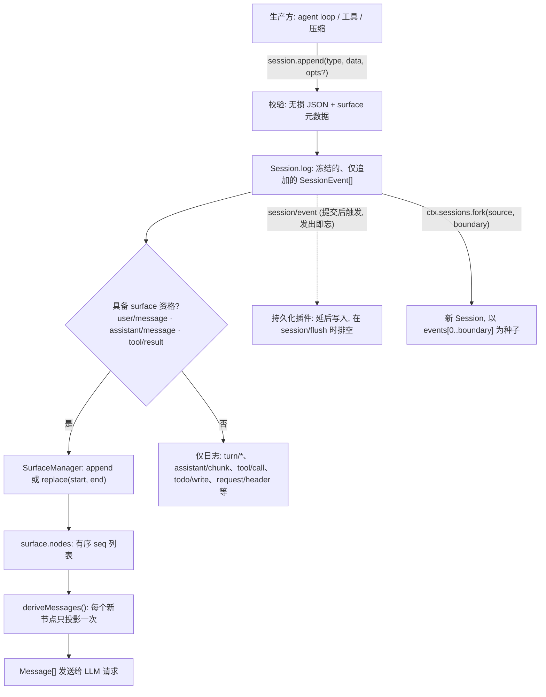

## 一句话版本

`@deepseek-ai/dsh-session` 不维护任何可变消息数组。一个 `Session` 是一份仅追加的、类型化 `SessionEvent` 日志;harness 需要的每一个视图——LLM 消息历史、面向人类的文本记录、持久化存储的行——都是从这同一份日志计算出来的*投影*。本章沿这条线走一遍:事件词汇表、`append()` 的提交路径、决定模型真正看到什么的 `surface` 投影,以及建立在同一原语之上的 `fork()` 与运行时不变量。

## 速览

:::concept{term="Session"}
一份**仅追加的、类型化 `SessionEvent` 日志**——agent 交互中发生的一切的唯一真相之源。不存在一份需要与之同步的"当前状态":日志**就是**状态,其他任何视图都是从它计算出来的投影。
:::

:::concept{term="SessionEvent"}
每条日志记录共享的同一个信封:以 `type` 为判别字段的判别式联合,携带 `seq`、`time`、`data`。插件通过 TypeScript 声明合并扩展 `SessionEventMap` 来扩展词汇,无需改动本包。
:::

:::concept{term="surface"}
在原始日志之上增量维护的、三种产生消息的事件(`user/message`、`assistant/message`、`tool/result`)的有序投影。它是 `deriveMessages()` 读取的对象;日志里的其他一切都是 log-only。
:::

:::concept{term="surfaceOp"}
一个具备 surface 资格的事件如何加入 surface:`'append'` 落在末尾,`{ op: 'replace', start, end }` 遮蔽一段既有范围。底层原始日志始终保持仅追加,变化的只是投影。
:::

## 你以为的数组,和你实际拿到的日志

多数 agent 框架把一次对话表示成一个可变的消息数组:压入一条用户回合,压入一条 assistant 回合,在中间插入一条工具结果,再把整个数组交给模型提供方。这套做法在没人需要*观察*这段历史如何变化之前都能工作——一旦出现持久化层、遥测管线、回放工具,或者第二个 UI 标签页,你就要么去轮询这个数组,要么在每个修改点上都挂一套通知系统。这两种表示(数组本身,以及通知系统所声称发生的事)会互相漂移。漏发一次通知,某处修改忘了触发事件,你的追踪记录就会撒谎——它不再反映模型真正看到过什么。

`@deepseek-ai/dsh-session` 从根源上避开了这个问题:它压根没有可变数组。"实际发生的事"与"记录下来的事"之间的分歧,不是一个需要靠小心避免的 bug,而是结构上不可能发生的事,因为压根不存在另一份可供分歧的东西。下面各节先定义词汇,再自上而下走完整个机制。

## `SessionEvent`:一份仅追加、可合并扩展的联合类型

日志中的每一条记录都共享同一个信封,以 `type` 为判别字段定义成一个判别式联合类型,因此一次 `switch` 就能在不做类型转换的情况下缩窄 `data` 的类型:

```ts
export type SessionEvent<T extends SessionEventType = SessionEventType> = {
  [K in SessionEventType]: {
    type: K
    /** 会话内部单调递增的序号。 */
    seq: number
    /** Unix 纪元毫秒时间戳。 */
    time: number
    data: SessionEventMap[K]
    ignorable?: true
  } & (K extends SurfaceEventType ? {
    sourceEventSeqs?: number[]
    surfaceOp?: SurfaceOp
  } : object)
}[T]
```

(`packages/core/session/src/types.ts:404-436`)

`SessionEventType` 是 `keyof SessionEventMap`——这是一个接口,插件通过 TypeScript 的声明合并来扩展它,这正是压缩(compaction)seam 能添加 `compaction/*` 事件、钩子桥接层能添加 `hook/*` 事件,而无需改动本包的原因。`dsh-session` 自身定义的核心词汇表(`types.ts:236-333`)覆盖了轮次/步骤边界、原始模型流,以及构成一次对话的各类消息:

```ts
export interface SessionEventMap {
  'turn/start': { turn: number }
  'turn/end': { turn: number; reason: TurnEndReason }
  'step/start': { turn: number; step: number }
  'step/end': { turn: number; step: number }
  'user/message': UserMessage
  'assistant/chunk': { turn: number; step: number; chunk: StreamChunk }
  'assistant/message': { turn: number; step: number; message: AssistantMessage; usage?: TokenUsage }
  'tool/call': { turn: number; step: number; callId: CallId; name: string; arguments: string }
  'tool/result': { turn: number; step: number; message: ToolResultMessage; error?: {...}; meta?: JsonValue }
  'todo/write': { todos: TodoItem[] }
  'request/header': { header: EpochHeader; reason: RequestHeaderReason }
  'request/context': RequestContext
  'session/end-seed': Record<string, never>
}
```

信封上有两个字段承担着不显眼却分量很重的工作。`ignorable?: true` 标记一个读取器在遇到不认识的 `type` 时可以安全跳过的事件——缺省即表示*必需*,因此遇到一个不认识的必需类型时,读取器要拒绝重建会话,而不是悄悄恢复出一个内容残缺的会话([版本机制 Agent Note](../../../../deepseek-harness/.agents/notes/implemented/architecture/2026-08-10-session-log-version-mechanism.zh.md) 说明了为什么默认值必须是这个方向)。`sourceEventSeqs`/`surfaceOp` 只在 `SurfaceEventType` 成员(`user/message`、`assistant/message`、`tool/result`)上才通过类型检查——在 `Session.append()` 的调用点上,编译器本身就会拒绝把 surface 元数据附加到 `turn/start` 或 `assistant/chunk` 上。

> [!NOTE]
> [生成的持久化目录](../../../../deepseek-harness/docs/persistence-catalog.zh.md)列举了本仓库中出现的每一种事件类型——无论是核心包定义的还是插件合并进来的——各自标注为 `surface` 或 `log-only`,并给出精确的载荷结构和声明位置。需要查某个字段的确切名称时,应该去查那份目录;本章挑选的是理解机制所必需的那部分事件,而不是完整清单。

## `append()`:一个事件的一生

`session.append(type, data, opts?)` 是事件进入日志的唯一途径。一个事件穿过它的路径是严格有序的:

:::timeline
- 校验 —— `snapshotJsonValue` 检查 `data` 是无损 JSON,并在同一趟里完成复制
- 冻结 —— 在任何观察者看到之前,先 `deepFreeze` 这个事件
- surface 校验 —— `surfaceManager.validateNext(event)` 拒绝非法的 surface 转换
- 提交 —— `this.log.push(event)`;事件从此成为持久历史
- 通知 —— `session/event` 同步触发,在提交之后,发出即忘
:::

```ts
append<T extends SessionEventType>(
  type: T,
  data: SessionEventMap[T],
  ...opts: T extends SurfaceEventType ? [opts: SurfaceIntent] : []
): SessionEvent<T> {
  ...
  const dataSnapshot = snapshotJsonValue(data)
  if (dataSnapshot === undefined) {
    throw new Error(`session event "${type}" carries non-JSON-serializable data`)
  }
  ...
  const event = deepFreeze({ type, seq: this.log.length, time: Date.now(), data: dataSnapshot, ... })
  this.surfaceManager.validateNext(event as SessionEvent)
  ...
  this.log.push(event as SessionEvent)
  ...
  invokeContainedSessionObservers(entry.emitCtx, 'session/event', entry.id, callbackArgs, callbacks)
  return event
}
```

(`packages/core/session/src/index.ts:604-655`,有删减)

有几条性质值得单独说明:

- **只接受无损 JSON。** `snapshotJsonValue` 用一趟递归就完成了对 `data`(以及任何 surface 元数据)的校验与复制,因此不可能出现一个带状态的 getter 在校验阶段和存储阶段返回不同值的情况。BigInt、函数、symbol、`undefined`、负零、非有限数值、循环引用,以及 `Map`、`Set`、`Date`、类实例等特殊原型,统统在追加点被拒绝——日志是持久化的真相之源,所以一个坏事件要在这里失败,而不是拖到后端刷盘时才暴露。
- **同步且可重入安全。** 追加操作在任何观察者运行之前就已经提交完成;如果在一次追加自身的通知回调内部再次发起追加,会被直接拒绝(靠 `entry.appending` 这个标志位把关)。热路径永远不会阻塞在 I/O 上:`session/event` 是一个同步的、发出即忘的通知,单个监听器出错互不影响;持久化插件负责缓冲延后写入,并在被等待的 `session/flush` 检查点上排空。
- **一进入日志就被冻结。** `deepFreeze` 在事件进入 `this.log` 之前就已运行,所以既不能靠类型转换也不能靠普通 JavaScript 赋值去改写已经被接受的历史。`session.events` 返回一份缓存的、冻结的快照数组,它在下一次追加时会失效(而不是被就地修改)。
- **产生消息的事件上,surface 元数据是必需的而不是可选的。** 这一点由类型签名本身强制:当 `T extends SurfaceEventType` 时 `opts` 是 `[opts: SurfaceIntent]`,否则是 `[]`,因此编译器会同时拒绝 `user/message` 缺少 `surfaceOp` 和 `turn/start` 带了 `surfaceOp` 这两种写法。

## Surface:哪些事件真正变成了消息

不是每一条记录下来的事件都会变成模型能看到的东西。只有三种类型——`user/message`、`assistant/message`、`tool/result`——属于 `SurfaceEventType`,有资格加入 surface。其他一切(轮次/步骤边界、原始流分片、`todo/write`、`request/header`、`session/end-seed`,以及任何插件合并进来的 log-only 事件)完全没有 surface 条目——它们的存在是为了回放、追踪和持久性,`deriveMessages()` 从不直接查看它们。

每个具备 surface 资格的事件都通过 `surfaceOp` 声明自己如何加入:

```ts
export type SurfaceOp =
  | 'append'
  | { op: 'replace'; start: number; end: number }
```

`'append'` 是常规路径——一条新的用户提示、一条组装好的 assistant 消息、一条工具结果,都追加在末尾。`{ op: 'replace', start, end }` 用当前这个事件遮蔽一段既有的、闭区间的 surface 节点范围;被遮蔽范围对应的日志条目并不会被删除,只是不再参与投影。压缩(compaction)正是靠这个机制实现的:`dsh-compaction-basic` 追加一条 `user/message` 来替换一段被总结的范围,`dsh-compaction-tool-result-pruner` 则追加一条只改内容的 `tool/result` 替换——这两种情况下,底层的原始日志依然保持仅追加,变化的只是投影。

逐节点的投影规则是一个很小的纯函数:

```ts
export function deriveEventMessage(event: SessionEvent): Message | null {
  switch (event.type) {
    case 'user/message':
      return event.data
    case 'assistant/message':
      if (event.data.message.content.length === 0) return null
      return event.data.message
    case 'tool/result':
      return event.data.message
    default:
      return null
  }
}
```

(`packages/core/session/src/surface.ts:83-114`)

一条内容为空的 `assistant/message`(某个达到 max-tokens 的步骤,只用来承载用量记账)会被有意投影为 `null`——绝不能把一条无内容的 assistant 回合塞进发给模型提供方的记录里。

`Session.deriveMessages()` 把这个投影规则折叠到 surface 的有序节点列表上:

```ts
deriveMessages(): Message[] {
  const surface = this.surface
  const nodes = surface.nodes
  const generation = surface.replaceGeneration
  if (generation !== this.derivedGeneration) {
    this.derived = []
    this.derivedNodes = 0
    this.derivedGeneration = generation
  }
  for (const seq of nodes.slice(this.derivedNodes)) {
    const msg = this.deriveEventMessage(this.log[seq]!)
    if (msg) this.derived.push(msg)
  }
  this.derivedNodes = nodes.length
  return [...this.derived]
}
```

(`packages/core/session/src/index.ts:726-747`)

这里的缓存策略对理解开销很关键:每个 surface 节点**只会被投影一次**,即第一次被看到的那一次,所以稳态下每次调用的开销是 O(新增节点数),而不是 O(日志长度)。一次 `replace` 操作会推进 `replaceGeneration`,这会使缓存失效并强制一次完整重建——压缩的代价只在它落地的那一刻付一次,而不是在此后每次读取时反复付。每次调用返回的都是一份新的快照数组(调用方持有的引用不会被悄悄扩长),但数组里的 `Message` 对象本身是共享且深度冻结的——它们复用已经冻结的事件数据,因此不存在第二次深拷贝,也没有办法通过投影去修改已记录的历史。

有一处不对称是刻意为之的:**面向人类的文本记录**不能像模型那样读取 `session.surface`。一次落地的 `replace` 会遮蔽掉人类读者已经看过的历史,所以文本记录改为遍历**追加来源**事件(`isAppendSurfaceEvent`)——即那些在自己的日志位置上直接进入 surface、从未被自己替换过的事件。面向模型的消费方继续读取 `session.surface`;面向人类的消费方读取原始日志中的追加来源子序列。同一份日志,两种同样有效、却不同的投影。

## 存储:真相之源留在日志里,编码方式可以尽量紧凑

模型提供方是按 token 粒度流式输出增量的,所以一个存活的会话可能记录数百条几乎相同的 `assistant/chunk` 事件,它们的 JSON 信封远比自身载荷庞大——分片行编解码器的模块文档在一个真实的 DeepSeek 会话上测得约 56 倍的膨胀。`chunk-rows.ts` 把每一段至少三个连续、属于同一区块的增量分片打包进一行存储记录(`text-chunks`、`reasoning-chunks` 或 `tool-call-chunks`),读取时再把这些行精确展开回原始事件:

> 存储行是一套持久化编码词汇表,**不是**会话事件:它们从不进入 `Session.events`,没有 `SessionEventMap` 条目,并且使用不带斜杠的裸类型标签,让读取器不会把它们和事件分类体系混淆。[……] 编码器只对精确匹配的形态做白名单处理——任何它不能完全识别的内容都会原样保留,因此未知字段或未来的分片变体只会失去压缩效果,不会丢数据。

(`packages/core/session/src/chunk-rows.ts:1-19`)

这清楚地展示了分层关系:事件日志的形态(一个 `SessionEvent` 意味着什么、它投影成什么)完全由这一层之上的部分决定。编解码器只是持久化底下一个纯粹的、无损的编码技巧——它可以被打包、解包,甚至有朝一日被替换掉,而 `deriveMessages()` 或 surface 折叠逻辑不需要改一行代码。

## 重建模型看到的其他一切

一次请求需要的不只是消息历史。`EpochHeader`——调用配置、渲染后的系统提示词和工具 schema——会在它第一次被设置时(`'initial'`)、恢复后重新建立时(`'resume'`)、或对话中途发生变化时(`'change'`)被记成一条 `request/header` 事件。重建它是对日志中所有请求头事件做一次纯折叠,取最新那份快照:

```ts
export function foldRequestHeader(events: readonly SessionEvent[], from?: EpochHeader): EpochHeader | undefined {
  let state = from
  for (const event of events) {
    if (event.type === 'request/header') state = canonicalHeader(event.data.header)
  }
  return state
}
```

(`packages/core/session/src/request-header.ts:56-71`)

`Session.requestHeader()` 以增量方式包装了这个折叠——每条请求头事件只被折叠一次,即第一次被看到时——因此一个存活会话每一步的读取开销是 O(新增事件数),与 `deriveMessages()` 的缓存方式对称。请求头事件从不会给 `deriveMessages()` 的输出增加第二份副本;重建出的系统提示词和前缀是在消息派生之外、在构建请求时才被前置进去的。

## `fork()`:用一段稳定前缀播种一个新会话

因为日志就是全部状态,fork 一个会话不过是用既有日志的一段前缀去播种一个新会话:

```ts
fork(source: SessionForkSource, boundary?: number, childSessionId?: SessionId): Session {
  if (childSessionId !== undefined && this.get(childSessionId) !== undefined) {
    throw new SessionForkError(`session "${childSessionId}" already exists`, 'SESSION_ALREADY_EXISTS')
  }
  const liveSource = this._resolveForkSource(source)
  const seed = this._forkSeed(liveSource, boundary)
  return this.create(childSessionId, {
    seed,
    meta: {
      ...liveSource.header.cwd !== undefined ? { cwd: liveSource.header.cwd } : {},
      parentSession: liveSource.id,
      seedLength: seed.length,
    },
  })
}
```

(`packages/core/session/src/index.ts:1081-1096`)

`boundary` 是源会话中某个事件的 `seq`(闭区间,默认取源会话当前最后一个事件);所选前缀必须结束在**开放轮次之外**——如果某个 boundary 会落在一段 `turn/start`/`turn/end` 括号内部,就会被 `SessionForkError('OPEN_TURN')` 拒绝,因为一个从轮次中途播种出来的子会话没有办法去关闭一个它从未打开过的轮次。新会话的构造函数会用 `append()` 自身使用的那套校验逻辑重新回放这段前缀(连续的 `seq`、合法的 surface 转换),所以 fork 永远不可能产生一个正常追加序列本不可能产生出来的日志状态。子会话的 `SessionHeader` 记录了 `parentSession` 和 `seedLength`,使恢复和回放始终能区分出继承来的历史与子会话自己的实时工作。

## 运行时不变量:模型可见即已记录

以上所有内容都支撑着一条架构规则,在 [`docs/architecture.zh.md`](../../../../deepseek-harness/docs/architecture.zh.md) 中被直接写明:

> **模型可见即已记录。** 抵达模型请求的一切都必须能从日志重建,并由一项运行时不变量断言这一点。因此,新增一项模型可见输入就需要新增一个会话事件:扩展 `SessionEventMap` 并从日志渲染。

(`docs/architecture.zh.md:96-100`)

这不只是一种风格偏好——正因如此,本包才会附带一个 `invariant.ts` 配套模块:与 `@deepseek-ai/dsh-invariants` 一起加载后,它会回放每个会话中 `turn/start`/`turn/end`/`step/start`/`step/end`/`tool/call`/`tool/result` 的序列,并在遇到任何关系性违规时(`step/start` 出现在其对应轮次之前、`tool/result` 没有对应的待处理 `tool/call`、`request/header` 出现在开放轮次之外)立刻显式报错。这条规则给未来所有新功能都套上了一个具体的设计约束:如果你要加的东西是模型会看到的——一种新的上下文注入、一种新的工具相关信号——唯一合法的路径是新增一个 `SessionEventMap` 成员并从日志渲染,而不是开一条会在不留痕迹的情况下修改请求构建过程的旁路通道。

## 为什么选事件溯源,而不是可变数组加通知

:::decision
[事件溯源会话 Agent Note](../../../../deepseek-harness/.agents/notes/implemented/architecture/2026-06-11-event-sourced-sessions.zh.md) 记录了当初被考虑过、又被否决的替代方案:**可变消息数组 + 事件仅作通知发出**——更简单,但状态与日志可能分歧;采用事件溯源后,日志本身即是状态,分歧在结构上不可能发生。驱动这个决策的需求很直白:MVP 要求严格的基于事件的追踪,以及完全可回放的会话,而"通常能保持同步"恰恰是一个追踪与回放产品不能容忍的失败模式。让日志本身成为状态,而不是状态的影子,是把这整类 bug 直接消除掉,而不是去缓解它。
:::

同一份 Agent Note 也承认了这个取舍的代价:派生成本会随日志长度增长,而预期的缓解手段是压缩(`dsh-compaction`),而不是退回去直接改写日志。

## 整体是如何拼起来的



一条工具结果、一段被总结的范围、一次恢复的对话,以及一个 fork 出来的子会话,底层用的都是同一个原语:事件落进一份仅追加的日志,某个投影只读回自己需要的那部分,而任何抵达模型的内容,都不会存在于日志之外的任何地方。

:::fold[值得记住的已知限制]
- 预发布阶段 `SESSION_FORMAT_VERSION` 固定为 `0`:`Session` 只接受当前格式的种子,后端会拒绝任何其他版本,并明确说明方向(更新的版本:请升级;更旧的版本:目前还没有升级路径)。普通的事件词汇表增长不会推动这个版本号——那是逐事件的 `ignorable` 标记负责的事([版本机制 Agent Note](../../../../deepseek-harness/.agents/notes/implemented/architecture/2026-08-10-session-log-version-mechanism.zh.md))。
- `fork()` 只能在存储中一个**实时**会话的稳定边界处切分;对一个已持久化但尚未加载的会话做 fork,不在当前 API 的能力范围内。
- 把会话分支组织成树结构(多个子会话从任意位置分叉,类似 pi 的风格)被暂缓——目前提供的原语是单亲、基于边界的 `fork()`。
:::
