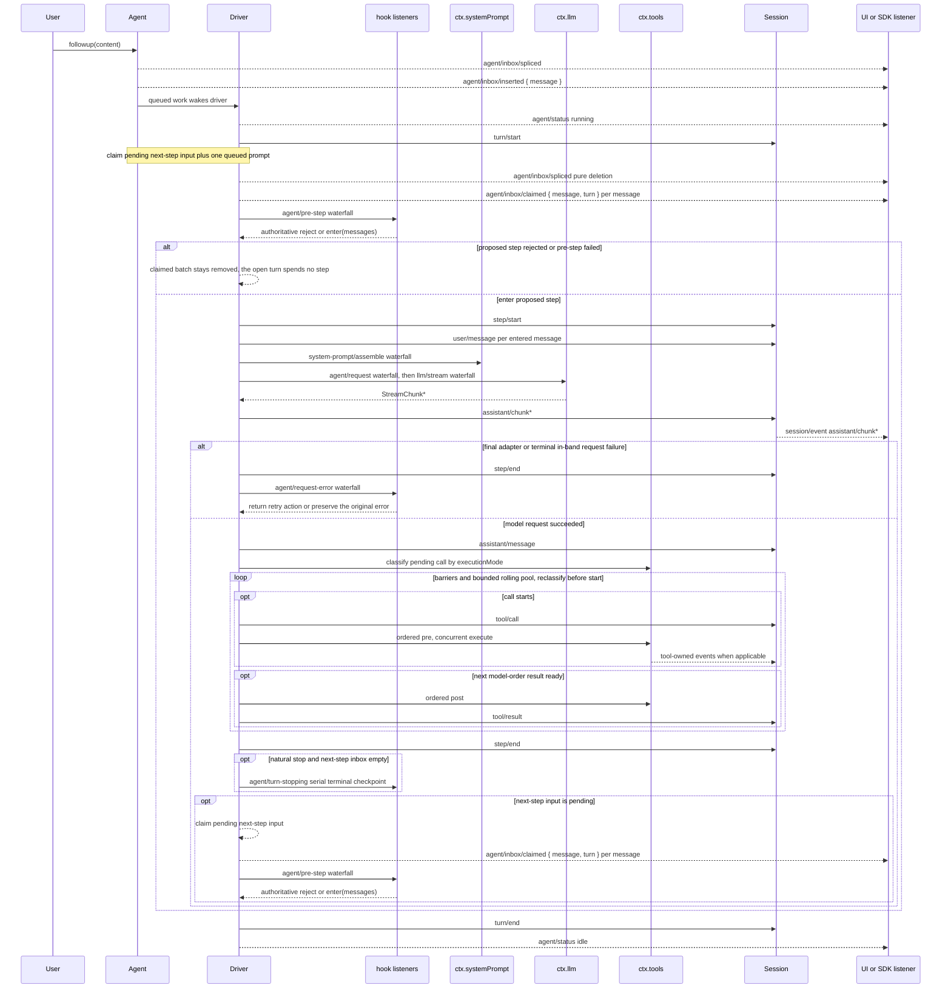

## Two words, precisely defined

The harness defines exactly two units of work inside a running agent, and the whole loop is built out of them:

- A **step** is one model request plus the tool calls that request produced.
- A **turn** is zero or more steps. It opens before its first input is claimed and closes once nothing is owed — no live tool call, no fresh steering.

Everything else in this chapter is the mechanics of opening a turn, running its steps, and closing it again. The authoritative statement of the flow is the ASCII sequence in `docs/architecture.md`'s "Turn flow" section:

```text
turn/start
  claim next-step input plus one queued message
  assemble prompt sections + tool schemas
  -> agent/pre-step                   reject | enter(messages)
     reject, or a first enter rewritten empty -> close the turn with no step
     step/start
     append entered messages as user/message
     derive model history from the log
     agent/request -> llm/stream -> assistant/chunk* -> assistant/message
     tool/call* -> tools/pre-execute -> tools/execute -> tools/post-execute -> tool/result*
     step/end
     tools owe another request, or next-step input arrived -> claim -> next step
  -> agent/turn-stopping
turn/end
```

Two vocabularies are interleaved in that diagram. `turn/*`, `step/*`, `user/message`, `assistant/*`, and `tool/*` are **durable session events** — every one of them is appended to the log and can be replayed. `agent/pre-step`, `agent/request`, `llm/stream`, and the three `tools/*` events are **live extension points**, not logged directly; they are waterfalls, so every listener on them must call `next()` to delegate, or the chain stops there. `agent/turn-stopping` is `serial` — it has no `next()`, only a veto by side effect (steering).

This chapter walks that diagram against the concrete implementation: `ReactLoopAgent` in `packages/core/agent-loop/src/agent.ts`, the only package in the harness that contains concrete loop logic. Everything else — compaction, retries, permission policy, sandboxing — is a plugin sitting on the extension points this chapter names.

## The full sequence diagram

The generated companion diagram in `docs/agent-lifecycle.md` is the authoritative visual for this chapter; it is reproduced faithfully below (participants and event names unchanged) because it is the single most useful artifact for understanding this package.



Two implementation facts sharpen this diagram immediately:

- `assistant/message` is appended for **every** successful provider call, including a content-less finish and a `max-tokens` finish. Empty content stays out of derived history, but the durable event still records usage and the exact `assistant/chunk` seqs it summarizes (`sourceEventSeqs`, `[]` for a chunkless stream).
- The returned `agent/pre-step` decision is authoritative. A listener that wraps `next()` must preserve downstream messages unless it means to replace them — there is no implicit merge.

## Input reaches the driver through one inbox

Before a turn can open, something has to wake the driver. `Agent.send(message, target, wakeup)` is the one primitive; `followup`, `steer`, and `inject` are fixed-preset aliases over it:

```ts
// packages/core/agent-loop/src/agent.ts:122-132
followup(input: UserMessage): void {
  this.send(input, 'next-turn', true)
}

steer(input: UserMessage): void {
  this.send(input, 'next-step', true)
}

inject(input: UserMessage): void {
  this.send(input, 'next-step', false)
}
```

`followup()` appends to the `next-turn` FIFO and wakes the driver — it becomes the sole ordinary message of its own new turn. `steer()` appends to the `next-step` inbox and wakes the driver, so a running turn picks it up at its very next step boundary. `inject()` appends to that same `next-step` inbox but does **not** wake anything — it waits, parked, until a `followup` or `steer` elsewhere wakes the driver, at which point it rides along.

`wakeDriver()` (`agent.ts:172-193`) is where a wake either starts a fresh `kick()` loop or gets latched (`wakeRequested`) behind an in-flight maintenance task or an already-aborted activity, replayed only once that activity converges to idle. A wake delivered while the agent is genuinely idle always opens a turn boundary, even if the message that triggered it is cleared before the driver gets around to claiming — status will show a transient `idle → running → idle` pair.

## `turn()`: opening and closing a turn

`ReactLoopAgent.turn()` (`agent.ts:246-330`) is the outer loop body. Each call:

1. Asserts the driver holds the running phase, then increments and appends `turn/start` (`agent.ts:255`).
2. Enters an inner `while (true)` that proposes one step at a time via `preStep()`.
3. On `reject`, the turn ends with `{ kind: 'blocked' }` and no step is spent.
4. If the very first proposed step (`phase.step === 0`) resolves to zero entered messages — a first `enter` rewritten empty, or the claimed message itself removed — the turn still closes, but with `{ kind: 'completed' }` and, again, no step spent. This is the "a rejected or empty first claim still closes a durable turn that spent no step" line from the architecture doc made concrete: the log records the *attempt*, not nothing.
5. Otherwise it appends `step/start`, appends every entered message as `user/message` (`agent.ts:279-283`), and calls `step()` to actually run the model request and its tool calls.
6. After `step()` returns, it appends `step/end` unconditionally (in a `finally`), tracking `turnEnds` — with one asymmetry worth naming: `max-tokens` is **sticky**. Once any step in the turn hits the output-token ceiling, a later step that completes normally must not downgrade the turn's recorded outcome (`agent.ts:285-290`).
7. If the turn currently looks finished (`turnEnds` set) and the `next-step` inbox is empty, it awaits the `agent/turn-stopping` serial checkpoint (`agent.ts:296`) — the one place a listener can still steer the turn back open by calling `agent.steer(...)`, which lands new work in `next-step` before the loop re-checks it.
8. If the turn is still finished after that check, the `while` loop breaks; otherwise `target` flips to `'next-step'` and the loop proposes another step.
9. `turn/end` is appended in an outer `finally` with whatever `turnEnds` reason was settled — `completed`, `blocked`, `max-tokens`, `aborted`, or `error` — so **every exit path, including a thrown error, produces a paired `turn/end`.**

```ts
// packages/core/agent-loop/src/agent.ts:293-300
if (turnEnds && this.inbox.nextStep.length === 0) {
  await this.dispatch.serial('agent/turn-stopping', { turn, signal })
  signal.throwIfAborted()
}
if (turnEnds && this.inbox.nextStep.length === 0) break
target = 'next-step'
```

At the very end, `turn()` returns `true` only if the inbox still has pending work — `this.inbox.hasPending` — which restarts `kick()`'s outer `while (await this.turn()) {}` loop (`agent.ts:210-223`) into a fresh turn with a fresh `AbortController`.

## `preStep()`: what the model is allowed to see

`preStep()` (`agent.ts:225-243`) is where the ASCII diagram's `claim next-step input plus one queued message` / `assemble prompt sections + tool schemas` / `agent/pre-step` sequence actually happens, in this order:

1. `this.inbox.claim(target, position.turn)` — a pure-deletion splice that removes the proposed batch (all pending `next-step` messages, plus, at a turn boundary, one `next-turn` message) and emits `agent/inbox/claimed { message, turn }` per message.
2. `ctx.systemPrompt.assemble(...)` — the prompt-section waterfall, producing a `PromptAssembly` (tool schemas plus renderable sections).
3. `renderContextSections` + `RuntimeContextProjection.project()` — a dynamic runtime-context snapshot is folded in as one more candidate `UserMessage` only when it differs from what was last retained (`runtime-context.ts:64-75`).
4. The `agent/pre-step` waterfall itself, whose default terminal handler (when no listener overrides it) is `enter` with the claimed messages plus the optional context message appended:

```ts
// packages/core/agent-loop/src/agent.ts:234-240
const decision = await this.dispatch.waterfall(
  'agent/pre-step', { messages: claimed, ...position, signal },
  (): Promise<PreStepDecision> => Promise.resolve<PreStepDecision>({
    kind: 'enter',
    messages: context === undefined ? claimed : [...claimed, context],
  }),
)
```

`PreStepDecision` is a two-member closed union — `{ kind: 'reject' }` or `{ kind: 'enter'; messages: UserMessage[] }` — and a listener that calls `next()` inherits whatever the chain built so far; one that doesn't is fully responsible for what enters the step. This is the seam `dsh-compaction-basic` uses to apply context-pressure repair *before* request derivation ever runs, and it's the seam permission/plan-mode style policy would use to veto a step outright.

## `step()`: one model request plus its tool calls

`ReactLoopAgent.step()` (`agent.ts:332-401`) is the inner loop that corresponds to the diagram's `agent/request -> llm/stream -> assistant/chunk* -> assistant/message` followed by the `tool/call*` block. It runs inside a `while (true)` specifically to support **retry**: a request that fails can be retried in place without leaving the step.

### Building and sending the request

`buildRequest()` (`agent.ts:407-495`) assembles one frozen `GenerateOptions`:

- It reads the session's last `request/header` to decide whether this is the loop's *first* request (seed from `AgentOptions.provider`/`model`/`maxTokens`, restoring only an explicitly pinned `reasoningEffort` for the exact same route) or a *later* one (fold forward the previous header via `requestProposal()`, which strips out adapter-materialized `reasoningEffort`/`maxTokens` fields so the current route re-derives its own defaults rather than inheriting a stale adapter's).
- It runs the `agent/request` waterfall — the seam that lets a listener switch provider/model, inject a fixed `reasoningEffort`, or otherwise override the proposed config; the default terminal handler just returns the seed config unmodified.
- It calls `ctx.llm.prepareCall()` to validate the adapter registration and materialize any adapter-owned defaults, binding the *exact* adapter instance across the async gap so hot-module-reload of one adapter can't leak into a request built against another.
- It logs `request/header` (`agent.ts:465-469`) only on the *first* request of the loop instance, or when the effective header actually changed from the last logged one (`headerEquals`) — not on every step. It similarly logs `request/context` (`agent.ts:479-482`) only when provider/model/contextWindow changed.
- It freezes the final request object (`deepFreeze`, `markAgentLoopRequest`) with the session's derived message history (`session.deriveMessages()`), the rendered system prompt, and the visible tool schemas.

### Streaming the response

```ts
// packages/core/agent-loop/src/agent.ts:345-351
const stream = preparedCall?.stream(request) ?? this.loopCtx.llm.stream(request)
signal.throwIfAborted()
for await (const chunk of stream) {
  signal.throwIfAborted()
  chunkSeqs.push(this.session.append('assistant/chunk', { turn, step, chunk }).seq)
  assembler.push(chunk)
}
```

Every raw `StreamChunk` from the provider is appended as its own `assistant/chunk` session event — this is what preserves replay and UI token-by-token fidelity — and its `seq` is collected so the eventual `assistant/message` can cite the exact chunks it summarizes via `sourceEventSeqs`.

### Terminal failure and retry

If the assembled stream finishes as `error` or `aborted`, the loop runs the `agent/request-error` waterfall (`agent.ts:354-370`) with the failure, the provider, and the adapter's `retryPolicy`. A listener returns `{ kind: 'retry' }` to loop back to the top of `step()`'s `while (true)` and rebuild+resend the request (this is exactly the seam `dsh-llm-retry` uses to wait out a backoff and retry transparently); the default terminal handler returns `undefined`, which throws an `LlmError` and propagates up to close the step and the turn with an `error` outcome.

### Committing the assistant message and dispatching tools

On success, the loop appends exactly one `assistant/message` (`agent.ts:373-390`), tagging it with `sourceEventSeqs: chunkSeqs`. If the finish reason was `max-tokens`, `step()` returns immediately with `{ kind: 'max-tokens' }` — no tool dispatch this step. Otherwise it filters the assembled content for `tool-call` blocks; zero tool calls means `{ kind: 'completed' }`, and one or more calls means `executeToolCalls()` runs (`agent.ts:395-399`), whose `concluded` flag (a tool result carrying `concludesTurn: true`) can force the turn to end even mid-loop.

## Tool-call scheduling: barriers and a bounded rolling pool

`executeToolCalls()` and `runGroup()` in `tool-calls.ts` implement the diagram's `tool/call* -> tools/pre-execute -> tools/execute -> tools/post-execute -> tool/result*` block with one important refinement the ASCII diagram doesn't show: **classification is unary and reclassified before each new call starts.**

```ts
// packages/core/agent-loop/src/tool-calls.ts:82-99
let next = 0
while (next < planned.length) {
  const first = planned[next]!
  const mode = ctx.tools.executionMode(first.exec).kind
  const group = mode === 'parallel' ? planned.slice(next) : [first]
  const outcome = await runGroup(ctx, turn, step, group, mode, signal, acceptContext)
  next += outcome.consumed
  concluded ||= outcome.concluded
  if (outcome.aborted) {
    for (const call of planned.slice(next)) appendSkippedToolCall(session, turn, step, call.block)
    return { concluded }
  }
}
```

A call whose `executionMode` is `exclusive` runs alone as a barrier of size one; a run of consecutive `parallel`-classified calls forms one group dispatched through a **bounded rolling pool** capped at `ctx.agentLoop.config.maxParallelToolCalls` (default 10; setting it to 1 makes execution fully serial). Inside `runGroup()`, dispatch/body work may overlap across the pool, but three things stay strictly **model-ordered**: the `tools/pre-execute` policy check that runs before a call starts, the committed `tool/result`, and any `additionalContexts` that call's result contributes back into the next step's inbox. `commitReady()` (`tool-calls.ts:146-160`) walks the settled slots strictly in model order and refuses to skip ahead over an unsettled one, which is what keeps replay deterministic even though dispatch itself can race.

Abort during tool execution drains started calls to their real result, then appends a synthetic `tool/call` + `tool/result` pair for every call that never got the chance to dispatch, with a fixed error text and code (`appendSkippedToolCall`, `tool-calls.ts:249-258`):

```ts
// packages/core/agent-loop/src/tool-calls.ts:250-258
function appendSkippedToolCall(session: Session, turn: number, step: number, block: ToolCallBlock): void {
  const callSeq = appendToolCall(session, turn, step, block)
  appendToolResult(session, turn, step, block, {
    content: [{ type: 'text', text: 'Error: tool call aborted before dispatch' }],
    isError: true,
    error: { message: 'tool call aborted before dispatch', info: { name: 'AbortError', code: TOOL_ABORTED_BEFORE_DISPATCH } },
  }, callSeq)
}
```

This matters for replay: an assistant message that requested five tool calls must always be followed by exactly five paired results in the log, whether they ran, were skipped by cancellation, or failed outright.

The inner `tools/pre-execute` → `tools/execute` → `tools/post-execute` → `finalizeContent` → `tool/result` sequence that each individual call passes through belongs to `dsh-tools`, not `dsh-agent-loop`; see the flowchart in `docs/tool-execution-pipeline.md` for exactly where policy, sandboxing, and result rewriting attach without the loop knowing about any of them.

## The events, sorted by who owns them

| Event | Kind | Durable? | What it carries |
|---|---|---|---|
| `turn/start` / `turn/end` | session event | yes | turn number; `turn/end` carries the closed-form `TurnEndReason` |
| `step/start` / `step/end` | session event | yes | turn + step numbers |
| `user/message` | session event | yes | one entered message |
| `assistant/chunk` | session event | yes | one raw `StreamChunk`, per streamed token/block |
| `assistant/message` | session event | yes | assembled content, `sourceEventSeqs`, optional usage |
| `tool/call` / `tool/result` | session event | yes | call id, name, arguments / result content, error info |
| `request/header` / `request/context` | session event | yes (change-gated) | frozen `LlmCallConfig` / provider+model+contextWindow |
| `agent/pre-step` | waterfall | no | claimed messages; returns reject or enter |
| `agent/request` | waterfall | no | proposed `LlmCallConfig`; returns a config |
| `agent/request-error` | waterfall | no | failure + retry policy; returns retry-or-terminal |
| `agent/turn-stopping` | serial | no | terminal checkpoint; no return value, only steering as a side effect |
| `agent/status` | emit | no | `idle` ⇄ `running` |
| `agent/inbox/inserted` / `claimed` / `discarded` | emit | no | one message's inbox transition |

Full signatures, including `Scoped<Agent>` scoping and `@mode` annotations, are generated into `docs/subsystems/core.md` under `agent/*` events.

## Why this shape: replay and swappability

Two architectural commitments explain every design choice above:

**Model-visible means logged.** Anything that reaches a model request — the system prompt, tool schemas, message history — must be reconstructable from the session log, and a runtime invariant enforces this. That's why `agent/pre-step` and `agent/request` can only *choose among* or *replace* data the loop derives from the log; they cannot inject content that bypasses `user/message`/`assistant/message` recording. `RuntimeContextProjection` (`runtime-context.ts`) is a good small example: dynamic context is folded into the pre-step batch as an ordinary `UserMessage`, tagged with a plugin source, so it survives replay exactly like anything else a user typed.

**Plugins, not loop changes.** The loop itself never mentions compaction, retries, permission policy, or sandboxing by name. `dsh-compaction-basic` hooks `agent/pre-step` (pressure) and `agent/request-error` (canonical overflow repair); `dsh-llm-retry` hooks `agent/request-error` alone; tool policy hooks the `tools/*` waterfalls. Changing the loop itself is reserved for changes that alter this map — see the "Where new behavior goes" table in `docs/architecture.md` — everything else attaches from outside.

## What to read next

- `docs/subsystems/core.md` for the full `Agent` handle contract — cancellation causes, `whenIdle()`, `runMaintenance()` — that this chapter didn't cover.
- `docs/tool-execution-pipeline.md` for what happens *inside* one `tool/call`, between `tools/pre-execute` and `tool/result`.
- `.agents/notes/implemented/architecture/2026-07-16-explicit-turn-cancellation.md` and the cancel-convergence wake latch note at `.agents/notes/implemented/bug-fix/2026-08-07-cancel-convergence-wake-latch.md` for the exact cancellation and wake-race contract this chapter only summarized.
