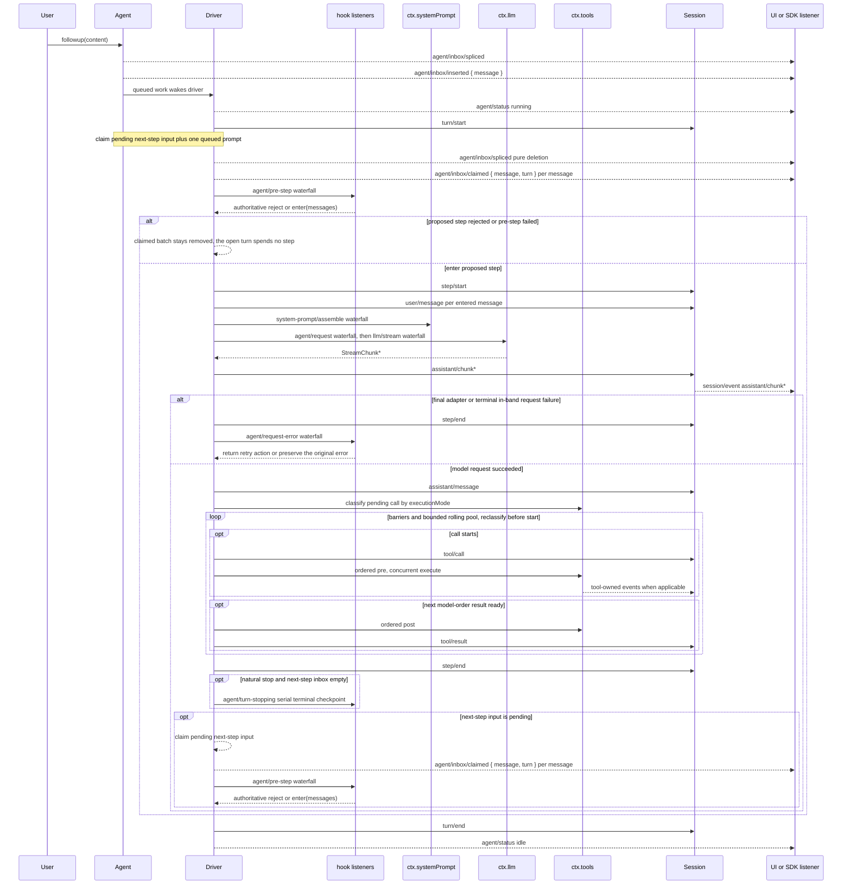

## 一句话版本

Agent loop 是 harness 中唯一含有具体循环逻辑的包——`packages/core/agent-loop/src/agent.ts` 里的 `ReactLoopAgent`。它只定义两个工作单元：**步骤（step）**（一次模型请求，加上这次请求触发的工具调用）与**轮次（turn）**（零个或多个步骤），并用这两个单元搭出整个驱动器：打开一个轮次、跑完它的步骤、不再欠下任何工作时把它关掉。其余一切——压缩、重试、权限策略、沙箱——都是挂在指名扩展点上的插件，从不是循环里的一个分支。下文对照代码，讲清完整的轮次生命周期。

## 速览

四个词撑起整章。两个是驱动器赖以搭建的工作单元；两个是事件所用的两套词汇——一套落日志、可回放，一套实时交给监听器。

:::concept{term="步骤 (step)"}
一次模型请求，加上这次请求触发的工具调用。
:::

:::concept{term="轮次 (turn)"}
零个或多个步骤。它在领取首条输入之前打开，并在不再欠下任何工作——没有存活的工具调用、没有新的 steering——时关闭。
:::

:::concept{term="持久会话事件"}
`turn/*`、`step/*`、`user/message`、`assistant/*`、`tool/*`。每一个都在发生的当下追加进会话日志，因此整个运行过程都能仅凭日志完整回放。
:::

:::concept{term="实时扩展点"}
`agent/pre-step`、`agent/request`、`llm/stream`、`tools/*` 这一系列。它们不落日志——是 waterfall（瀑布式），因此每个监听器都必须调用 `next()` 才能把控制权委托下去，否则链条就在那里短路。`agent/turn-stopping` 是唯一的 `serial`（串行）点：没有 `next()`，只能通过副作用（steering）来否决。
:::

## 轮次生命周期

本章剩下的内容，全部是「如何打开一个轮次、跑完它的步骤、再把它关掉」的机制细节。这套流程最权威的表述是 `docs/architecture.zh.md`「轮次流程」一节——这里把它做成一个可以分步运行的序列：

:::timeline
- turn/start — 打开轮次；领取 next-step 输入和一条入队消息
- assemble prompt — 组装 prompt 段与工具 schema
- agent/pre-step — reject 或 enter(messages)；首个空 enter 会以零 step 关闭该轮
- step/start — 追加 enter 的消息为 user/message；从日志派生模型历史
- agent/request → llm/stream — assistant/chunk* → assistant/message
- tool/call* — tools/pre-execute → tools/execute → tools/post-execute → tool/result*
- step/end — 工具还欠一个请求，或 next-step 输入已到 → 领取 → 下一个 step
- agent/turn-stopping — 串行（serial）否决（steering）
- turn/end — 关闭轮次
:::

带着这两套词汇去读这段时序：持久事件是日志记录下的每一行；扩展点是循环运行之中把控制权交给监听器的地方。

> [!NOTE]
> 持久事件可回放；扩展点是实时 waterfall。这条区分，正是循环既可追踪又可替换的根本原因。

本章会对照具体实现走一遍这套流程：`packages/core/agent-loop/src/agent.ts` 中的 `ReactLoopAgent`，它是 harness 里唯一包含具体循环逻辑的包。除此之外的一切——压缩、重试、权限策略、沙箱——都是挂在上面指名的扩展点上的插件。

## 完整时序图

`docs/agent-lifecycle.zh.md` 中生成的配套图是本章最权威的可视化材料；下面原样复用它（参与者与事件名不变），因为它是理解这个包最有用的单一素材。



两个实现细节能立刻让这张图更清晰：

> [!NOTE]
> `assistant/message` 会为**每一次**成功的提供方调用追加一条，包括无内容结束和以 `max-tokens` 结束的调用。空内容不会进入派生历史，但这条持久事件仍然记录用量，以及它汇总的确切 `assistant/chunk` seq（`sourceEventSeqs`，流没有分片时为 `[]`）。

> [!PITFALL]
> 返回的 `agent/pre-step` 决策是权威结果。包装 `next()` 的监听器必须保留下游消息，除非它确实想替换掉这些消息——这里没有隐式合并。

## 输入通过一个 inbox 抵达驱动器

轮次能打开之前，必须先有什么东西唤醒驱动器。`Agent.send(message, target, wakeup)` 是唯一的原语；`followup`、`steer`、`inject` 都是固定预设参数的别名：

```ts
// packages/core/agent-loop/src/agent.ts:122-132
followup(input: UserMessage): void {
  this.send(input, 'next-turn', true)
}

steer(input: UserMessage): void {
  this.send(input, 'next-step', true)
}

inject(input: UserMessage): void {
  this.send(input, 'next-step', false)
}
```

`followup()` 追加到 `next-turn` FIFO 并唤醒驱动器——它会成为自己那个新轮次里唯一的普通消息。`steer()` 追加到 `next-step` inbox 并唤醒驱动器，所以一个正在运行的轮次会在下一个步骤边界立即领取它。`inject()` 同样追加到 `next-step` inbox，但**不**唤醒任何东西——它会一直停在那里，直到别处的一次 `followup` 或 `steer` 唤醒驱动器，届时它会顺路被一并领取。

:::fold[唤醒锁存：当一次唤醒无法立即打开轮次]
`wakeDriver()`（`agent.ts:172-193`）是这样一个地方：一次唤醒要么启动一轮新的 `kick()` 循环，要么被锁存（`wakeRequested`）在一个正在进行的维护任务或已中止的活动后面，等该活动收敛到空闲后才重放。在 agent 真正空闲时送达的一次唤醒总会打开一个轮次边界，即便触发它的消息在驱动器真正领取之前就已经被清除——此时 status 会短暂显示 `idle → running → idle` 这一对瞬态转换。
:::

## `turn()`：打开与关闭一个轮次

`ReactLoopAgent.turn()`（`agent.ts:246-330`）是外层循环体。每次调用：

1. 断言驱动器持有 running 阶段，然后递增并追加 `turn/start`（`agent.ts:255`）。
2. 进入一个内层 `while (true)`，通过 `preStep()` 逐一提议每个步骤。
3. 遇到 `reject`，轮次以 `{ kind: 'blocked' }` 结束，且不花费任何步骤。
4. 如果被提议的第一个步骤（`phase.step === 0`）解析出零条已进入消息——首次 `enter` 被改写为空，或被领取的消息本身已被移除——轮次仍会关闭，但结果是 `{ kind: 'completed' }`，同样不花费步骤。这正是架构文档中「被拒绝或被清空的首次领取，仍会关闭一个不含步骤的持久轮次」这句话的具体体现：日志记录的是这次*尝试*本身，而不是什么都没发生。
5. 否则它追加 `step/start`，把每条已进入消息都作为 `user/message` 追加（`agent.ts:279-283`），然后调用 `step()` 真正跑一次模型请求及其工具调用。
6. `step()` 返回后，它会在 `finally` 中无条件追加 `step/end`，并更新 `turnEnds`——这里有一处值得点名的不对称：`max-tokens` 是**粘性**的。一旦轮次中任何一个步骤触及输出 token 上限，之后正常完成的步骤就不得把轮次的最终结果往回降级（`agent.ts:285-290`）。
7. 如果轮次此刻看起来已经结束（`turnEnds` 已设置）且 `next-step` inbox 为空，它会等待 `agent/turn-stopping` 这个 serial 检查点（`agent.ts:296`）——这是唯一一处监听器还能通过调用 `agent.steer(...)` 把轮次重新拉回运行状态的地方，新工作会先落进 `next-step`，再由循环重新检查它。
8. 如果检查之后轮次仍然结束，`while` 循环跳出；否则 `target` 切换为 `'next-step'`，循环继续提议下一个步骤。
9. `turn/end` 在外层 `finally` 中追加，携带最终敲定的 `turnEnds` 原因——`completed`、`blocked`、`max-tokens`、`aborted` 或 `error`——因此**每一条退出路径，包括抛出的异常，都会产生一条配对的 `turn/end`。**

```ts
// packages/core/agent-loop/src/agent.ts:293-300
if (turnEnds && this.inbox.nextStep.length === 0) {
  await this.dispatch.serial('agent/turn-stopping', { turn, signal })
  signal.throwIfAborted()
}
if (turnEnds && this.inbox.nextStep.length === 0) break
target = 'next-step'
```

在最后，`turn()` 只有在 inbox 仍有待处理工作时才返回 `true`——即 `this.inbox.hasPending`——这会让 `kick()` 的外层 `while (await this.turn()) {}` 循环（`agent.ts:210-223`）带着一个全新的 `AbortController` 重新进入下一个轮次。

## `preStep()`：决定模型能看见什么

`preStep()`（`agent.ts:225-243`）正是 ASCII 图中 `claim next-step input plus one queued message` / `assemble prompt sections + tool schemas` / `agent/pre-step` 这一串真正发生的地方，顺序如下：

1. `this.inbox.claim(target, position.turn)`——一次仅执行删除的 splice，移除拟议中的整批消息（全部待处理的 `next-step` 消息，加上在轮次边界处再加一条 `next-turn` 消息），并为每条消息各发出一次 `agent/inbox/claimed { message, turn }`。
2. `ctx.systemPrompt.assemble(...)`——提示词片段 waterfall，产出一个 `PromptAssembly`（工具 schema 加上可渲染的片段）。
3. `renderContextSections` + `RuntimeContextProjection.project()`——只有当动态运行时上下文快照与上次保留的内容不同时，它才会被折叠成一条候选的 `UserMessage`（`runtime-context.ts:64-75`）。
4. `agent/pre-step` waterfall 本身，它的默认终端处理器（没有监听器覆盖时）是 `enter`，携带已领取的消息加上可选的上下文消息：

```ts
// packages/core/agent-loop/src/agent.ts:234-240
const decision = await this.dispatch.waterfall(
  'agent/pre-step', { messages: claimed, ...position, signal },
  (): Promise<PreStepDecision> => Promise.resolve<PreStepDecision>({
    kind: 'enter',
    messages: context === undefined ? claimed : [...claimed, context],
  }),
)
```

`PreStepDecision` 是一个只有两个成员的封闭联合类型——`{ kind: 'reject' }` 或 `{ kind: 'enter'; messages: UserMessage[] }`——调用 `next()` 的监听器会继承链条目前已经组装出的内容；不调用的监听器则要对进入这一步的内容完全负责。这正是 `dsh-compaction-basic` 用来在请求派生之前就应用上下文压力修复的接缝，也是权限策略、计划模式这类需要直接否决某个步骤的策略应当使用的接缝。

## `step()`：一次模型请求加上它的工具调用

`ReactLoopAgent.step()`（`agent.ts:332-401`）是内层循环，对应图中 `agent/request -> llm/stream -> assistant/chunk* -> assistant/message` 后面接 `tool/call*` 那一块。它运行在一个 `while (true)` 里，专门是为了支持**重试**：一次失败的请求可以原地重试，而不必离开这个步骤。

### 构建并发送请求

`buildRequest()`（`agent.ts:407-495`）组装出一个冻结的 `GenerateOptions`：

- 它读取会话最后一条 `request/header`，以此判断这是循环的*第一次*请求（种子取自 `AgentOptions.provider`/`model`/`maxTokens`，只在完全相同的路由下才恢复一个明确固定过的 `reasoningEffort`），还是*后续*请求（通过 `requestProposal()` 把上一条 header 折叠向前，该函数会剥离掉适配器物化出来的 `reasoningEffort`/`maxTokens` 字段，好让当前路由重新推导出自己的默认值，而不是继承一个过时适配器留下的值）。
- 它跑 `agent/request` waterfall——这是让监听器切换提供方/模型、注入一个固定的 `reasoningEffort`，或者以其他方式覆盖拟议配置的接缝；默认终端处理器只是原样返回种子配置。
- 它调用 `ctx.llm.prepareCall()` 来校验适配器注册，并物化任何适配器自有的默认值，同时在这段异步间隙中绑定住*确切*的那个适配器实例，这样一来某个适配器的热模块替换就不会串到另一个适配器构建出的请求上。
- 只有在循环实例的*第一次*请求时，或者生效 header 确实与上次记录的不同时（`headerEquals`），它才会记录 `request/header`（`agent.ts:465-469`）——不是每个步骤都记。它同样只在提供方/模型/上下文窗口发生变化时才记录 `request/context`（`agent.ts:479-482`）。
- 它冻结最终的请求对象（`deepFreeze`、`markAgentLoopRequest`），携带会话派生出的消息历史（`session.deriveMessages()`）、渲染后的系统提示词和可见的工具 schema。

### 流式接收响应

```ts
// packages/core/agent-loop/src/agent.ts:345-351
const stream = preparedCall?.stream(request) ?? this.loopCtx.llm.stream(request)
signal.throwIfAborted()
for await (const chunk of stream) {
  signal.throwIfAborted()
  chunkSeqs.push(this.session.append('assistant/chunk', { turn, step, chunk }).seq)
  assembler.push(chunk)
}
```

提供方给出的每一个原始 `StreamChunk` 都会作为独立的 `assistant/chunk` 会话事件追加下来——这正是保证回放和 UI 逐 token 保真度的机制——它的 `seq` 会被收集起来，好让最终的 `assistant/message` 能通过 `sourceEventSeqs` 精确引用它汇总的分片。

### 终态失败与重试

如果组装出的流以 `error` 或 `aborted` 结束，循环会跑 `agent/request-error` waterfall（`agent.ts:354-370`），携带失败信息、提供方和适配器的 `retryPolicy`。监听器返回 `{ kind: 'retry' }` 就会跳回 `step()` 的 `while (true)` 顶部，重新构建并发送请求（这正是 `dsh-llm-retry` 用来等待退避、透明重试的接缝）；默认终端处理器返回 `undefined`，这会抛出一个 `LlmError`，并向上传播，以 `error` 结果关闭步骤和轮次。

### 提交 assistant 消息并调度工具

成功时，循环恰好追加一条 `assistant/message`（`agent.ts:373-390`），标注 `sourceEventSeqs: chunkSeqs`。如果 finish 原因是 `max-tokens`，`step()` 立即返回 `{ kind: 'max-tokens' }`——这一步不调度任何工具。否则它会从组装出的内容里筛出 `tool-call` 块；零个工具调用意味着 `{ kind: 'completed' }`，一个或多个调用则会运行 `executeToolCalls()`（`agent.ts:395-399`），其 `concluded` 标志（某个工具结果携带 `concludesTurn: true`）可以在循环中途强行结束轮次。

## 工具调用调度：屏障与有界滚动池

`tool-calls.ts` 中的 `executeToolCalls()` 和 `runGroup()` 实现了图中 `tool/call* -> tools/pre-execute -> tools/execute -> tools/post-execute -> tool/result*` 这一块，并且带有一个 ASCII 图没有展示的重要细节：**分类是一元的，并且在每次启动新调用之前都会重新分类。**

```ts
// packages/core/agent-loop/src/tool-calls.ts:82-99
let next = 0
while (next < planned.length) {
  const first = planned[next]!
  const mode = ctx.tools.executionMode(first.exec).kind
  const group = mode === 'parallel' ? planned.slice(next) : [first]
  const outcome = await runGroup(ctx, turn, step, group, mode, signal, acceptContext)
  next += outcome.consumed
  concluded ||= outcome.concluded
  if (outcome.aborted) {
    for (const call of planned.slice(next)) appendSkippedToolCall(session, turn, step, call.block)
    return { concluded }
  }
}
```

`executionMode` 为 `exclusive` 的调用会作为大小为一的屏障单独运行；一串连续被分类为 `parallel` 的调用则组成一个组，通过一个受 `ctx.agentLoop.config.maxParallelToolCalls` 限制（默认 10；设为 1 即变成完全串行）的**有界滚动池**来调度。在 `runGroup()` 内部，分发与调用主体的执行可以跨调用重叠，但有三件事严格保持**模型顺序**：调用启动前运行的 `tools/pre-execute` 策略检查、已提交的 `tool/result`，以及该调用结果贡献回下一步骤 inbox 的任何 `additionalContexts`。`commitReady()`（`tool-calls.ts:146-160`）严格按模型顺序遍历已就绪的槽位，拒绝跳过尚未就绪的那个——这正是即便分发本身可能出现竞争、回放依然保持确定性的原因。

:::fold[执行中途中止：每个被请求的调用仍会得到配对结果]
工具执行期间的中止会先把已启动的调用排空到它们真实的结果，然后为每一个从未有机会分发的调用追加一对合成的 `tool/call` + `tool/result`，携带固定的错误文案和错误码（`appendSkippedToolCall`，`tool-calls.ts:249-258`）：

```ts
// packages/core/agent-loop/src/tool-calls.ts:250-258
function appendSkippedToolCall(session: Session, turn: number, step: number, block: ToolCallBlock): void {
  const callSeq = appendToolCall(session, turn, step, block)
  appendToolResult(session, turn, step, block, {
    content: [{ type: 'text', text: 'Error: tool call aborted before dispatch' }],
    isError: true,
    error: { message: 'tool call aborted before dispatch', info: { name: 'AbortError', code: TOOL_ABORTED_BEFORE_DISPATCH } },
  }, callSeq)
}
```

这一点对回放至关重要：一条请求了五个工具调用的 assistant 消息，后面必须总是跟着恰好五对结果，不论它们是真正跑完了、因取消而被跳过，还是彻底失败。
:::

每个单独调用要经过的内层 `tools/pre-execute` → `tools/execute` → `tools/post-execute` → `finalizeContent` → `tool/result` 序列属于 `dsh-tools`，不属于 `dsh-agent-loop`；具体策略、沙箱与结果重写在哪里介入而循环本身对此一无所知，参见 `docs/tool-execution-pipeline.zh.md` 中的流程图。

## 按归属方分类的事件

| 事件 | 类别 | 是否持久 | 携带什么 |
|---|---|---|---|
| `turn/start` / `turn/end` | 会话事件 | 是 | 轮次编号；`turn/end` 携带封闭形式的 `TurnEndReason` |
| `step/start` / `step/end` | 会话事件 | 是 | 轮次编号 + 步骤编号 |
| `user/message` | 会话事件 | 是 | 一条已进入的消息 |
| `assistant/chunk` | 会话事件 | 是 | 一个原始 `StreamChunk`，每个流式 token/块一条 |
| `assistant/message` | 会话事件 | 是 | 组装后的内容、`sourceEventSeqs`、可选用量 |
| `tool/call` / `tool/result` | 会话事件 | 是 | 调用 id、名称、参数 / 结果内容、错误信息 |
| `request/header` / `request/context` | 会话事件 | 是（变更时才记） | 冻结的 `LlmCallConfig` / 提供方+模型+上下文窗口 |
| `agent/pre-step` | waterfall | 否 | 已领取的消息；返回拒绝或进入 |
| `agent/request` | waterfall | 否 | 拟议的 `LlmCallConfig`；返回一份配置 |
| `agent/request-error` | waterfall | 否 | 失败信息 + 重试策略；返回重试或终态动作 |
| `agent/turn-stopping` | serial | 否 | 终态检查点；无返回值，只能靠 steering 这个副作用来否决 |
| `agent/status` | emit | 否 | `idle` ⇄ `running` |
| `agent/inbox/inserted` / `claimed` / `discarded` | emit | 否 | 单条消息的 inbox 状态转换 |

完整签名，包括 `Scoped<Agent>` 作用域限定与 `@mode` 注释，生成在 `docs/subsystems/core.zh.md` 的 `agent/*` 事件目录中。

## 为什么是这样的设计：回放与可替换性

上面每一个设计选择都能追溯到两条架构承诺：

:::decision
**模型可见即已记录。** 任何抵达模型请求的内容——系统提示词、工具 schema、消息历史——都必须能从会话日志重建，并由一项运行时不变量强制断言这一点。这就是为什么 `agent/pre-step` 和 `agent/request` 只能*从*循环从日志派生出的数据中*选择*或*替换*，而不能注入绕过 `user/message`/`assistant/message` 记录的内容。`RuntimeContextProjection`（`runtime-context.ts`）是个很好的小例子：动态上下文会被折叠成 pre-step 批次里一条普通的 `UserMessage`，并标注上插件来源，因此它在回放时和用户手动输入的任何内容一样完好无损。
:::

:::decision
**新行为归属插件，而不是改动循环本身。** 循环自身从不提及压缩、重试、权限策略或沙箱这些名字。`dsh-compaction-basic` 挂在 `agent/pre-step`（观测压力）和 `agent/request-error`（规范的溢出修复）上；`dsh-llm-retry` 单独挂在 `agent/request-error` 上；工具策略挂在 `tools/*` 系列 waterfall 上。改动循环本身仅保留给那些确实要改动这张映射关系的变更——参见 `docs/architecture.zh.md` 中「新行为的归属位置」表——其余一切都从外部挂接进来。
:::

## 接下来读什么

- `docs/subsystems/core.zh.md`，了解本章未涉及的完整 `Agent` 句柄约定——取消原因、`whenIdle()`、`runMaintenance()`。
- `docs/tool-execution-pipeline.zh.md`，了解一次 `tool/call` 内部、`tools/pre-execute` 到 `tool/result` 之间到底发生了什么。
- `.agents/notes/implemented/architecture/2026-07-16-explicit-turn-cancellation.md` 与取消收敛唤醒锁存笔记 `.agents/notes/implemented/bug-fix/2026-08-07-cancel-convergence-wake-latch.md`，了解本章只是概述过的确切取消与唤醒竞态约定。
