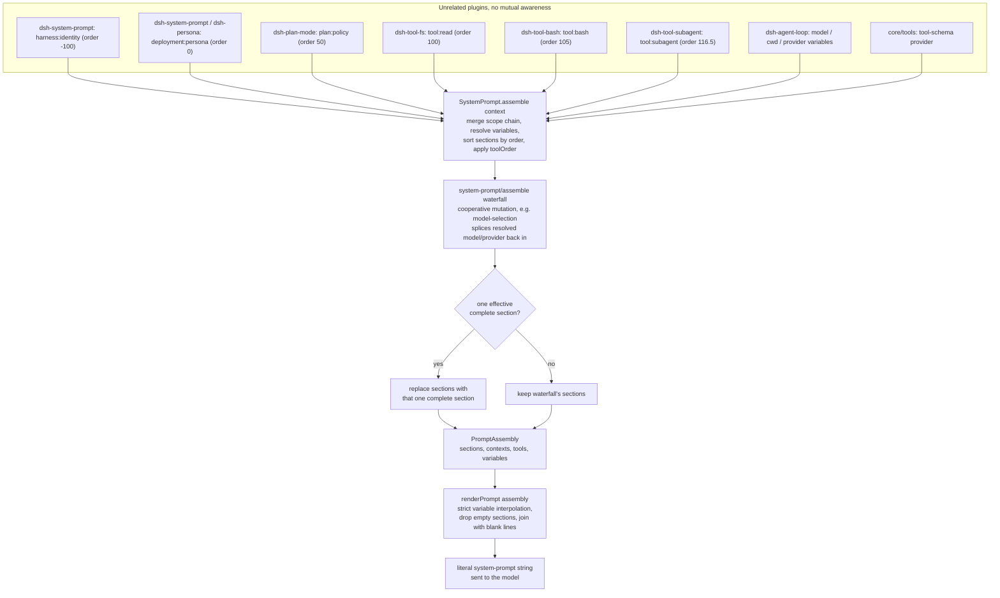
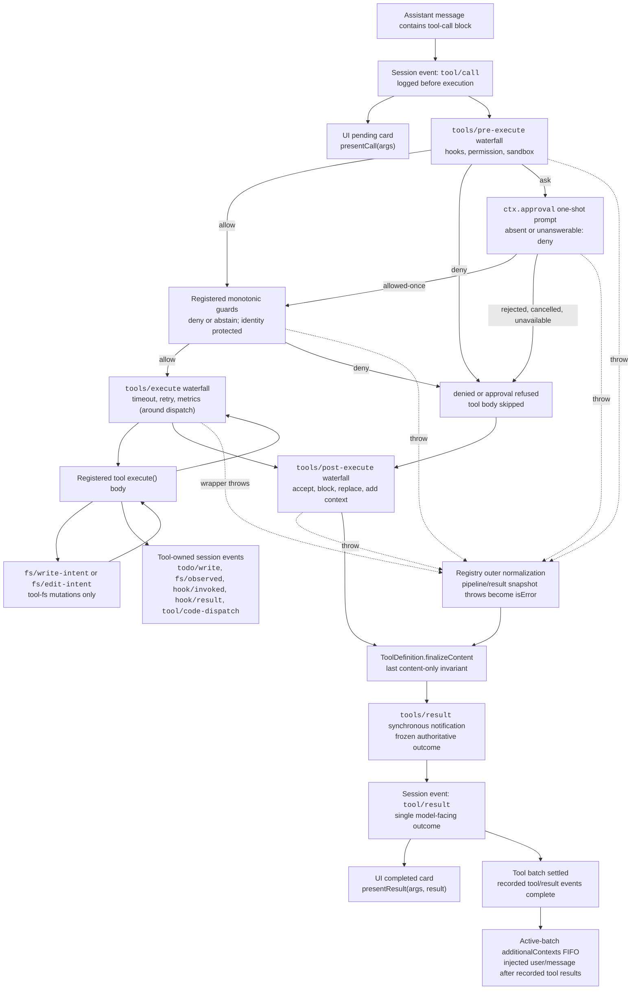

## Two registries build one step

Every step of the agent loop does two things that neither the model nor any single plugin controls end to end: it assembles the request sent to the model, and it executes whatever tool calls the model's reply contains. `core/system-prompt` (`ctx.systemPrompt`) owns the first — dozens of unrelated plugins each contribute a fragment of prompt text or a tool schema, and `SystemPrompt.assemble()` turns those fragments into one deterministic request without giving any single plugin authority over the whole. `core/tools` (`ctx.tools`) owns the second — every tool call, whether `bash`, `read`, `grep`, or a subagent delegation, passes through the same `ToolRuntime.execute()` pipeline, so a tool author writes an `execute()` body once and gets policy, retries, and observability for free.

## One prompt, many owners

A deployment mounts a bash tool, a read/write/edit trio, a web-fetch tool, a subagent tool, a plan-mode plugin, a goal tracker — and each of them may need to tell the model something. The bash package needs the model to check `[exit code: N]` markers; the read tool needs the model to prefer it over `cat`; the operator needs to say "you are a coding assistant" once. None of these plugins knows the others exist or can see the final prompt, and none should have to coordinate a global concatenation order by hand. Any plugin calls `ctx.systemPrompt.section(...)` to contribute a named, ordered fragment; the loop calls `ctx.systemPrompt.assemble()` once per step to collect every currently-registered fragment into one `PromptAssembly`, then `renderPrompt()` turns that into the literal string sent to the model.

## Four ways to contribute

The `SystemPrompt` service (`ctx.systemPrompt`, `packages/core/system-prompt/src/index.ts:338`) exposes four registration methods, each returning a Cordis effect disposer — a plugin that unloads automatically retracts what it contributed:

- **`section(section: PromptSection)`** (line 381) — registers `{ name, order, text, complete? }`. Sections concatenate in ascending `order`; `text` is a static string or a function of `AssembleContext` evaluated fresh at every assembly.
- **`context(context: PromptContext)`** (line 398) — registers ordered *dynamic* context, the cache-unstable counterpart of a section. Contexts become a separate user-role runtime-context snapshot in model history rather than living inside the system prompt, so they can change every turn without invalidating the KV-cache prefix over the stable sections.
- **`tools(provider: (context) => ToolProviderResult)`** (line 430) — registers a tool-schema provider. `ToolProviderResult` is `{ schemas, knownNames? }`: `schemas` is what the model actually sees after restriction; `knownNames` is the pre-restriction universe, needed to tell a `toolOrder` typo apart from a tool deliberately hidden in one scope.
- **`variable(name, provider: (context) => string | undefined)`** (line 446) — registers a named value referenced from section/context text as `{{name}}`. Names must match `[a-z][a-z0-9_]*`.

All four land in a `PromptLayer` (line 304) — the single global layer, or a per-agent scoped layer keyed by the calling context's Cordis scope. A scoped registration shadows a same-named global one for that agent alone; duplicate names within one layer throw immediately, and so does a non-finite `order`.

## Order bands: a convention, not an enum

`PromptSection.order` is a plain `number`; nothing stops two plugins from picking the same value. What keeps assembly deterministic in practice is a documented convention of numeric bands, visible directly in the constants and call sites:

| Order | Owner | Example |
|---|---|---|
| `-100` | `dsh-system-prompt` itself | `harness:identity` — the fixed opener `You are an AI agent powered by DeepSeek Harness.` (lines 357-363) |
| `-99` | `app-boot`, when the self-modification demo mounts it | `harness:source`, naming the on-disk harness checkout (`packages/boot/app-boot/src/index.ts:821`) |
| `0` | `dsh-system-prompt` (`config.persona`) or a shadowing `dsh-persona`/subagent row | `deployment:persona`, exported as `PERSONA_SECTION`/`PERSONA_ORDER` (lines 128-131) |
| `50` | `dsh-plan-mode` | `plan:policy`, rendered only while a plan is pending/active (`packages/plan/plan-mode/src/index.ts:225`) |
| `99` | `core/tools` (code mode) | `tools:code-only`, stated *before* the per-tool guidance it qualifies |
| `100-199` | every tool package | `tool:read` (100), `tool:write` (101), `tool:edit` (102), `tool:glob` (103), `tool:grep` (104), `tool:bash` (105), `tool:pty`/`tool:jobs` (106), `tool:web_search` (110), `tool:web_fetch` (111), `tool:lsp` (112), `tool:session-query` (113), `tool:goal` (114), `tool:cordis`/`tool:workflow` (115), `tool:ralph` (116), `tool:subagent*` (116.5), `tool:subagent_report` (117); `tools:sdk` (150) for a code-mode generated SDK summary |

Sections sharing an `order` value tie-break by registration order — a plugin-load artifact, which is exactly why the convention reserves a distinct integer per concern instead of relying on that tie-break. Each order value is a plain module-level constant (`COLLAPSE_SECTION_ORDER = 99`, `SDK_SECTION_ORDER = 150` in `core/tools`; `SUBAGENT_SECTION_ORDER = 116.5`, `REPORT_SECTION_ORDER = 117` in the subagent tool packages) — no shared registry hands them out, so a new tool package picks an unused value in the 100-199 band by inspecting existing call sites. `toolOrder`, covered below, is canonicalized instead: it is applied to the collected tool list before the waterfall runs, so its determinism does not depend on load order at all.

## One fact, one owner

The Agent Note *Prompt variables and tool-guidance ownership* states the rule behind this design: every fact in the prompt has exactly one owner.

- A **per-tool usage fact** ("what does this tool do, when do I call it") lives in the tool's `description` field on its schema — not in a section.
- A **cross-call habit** a description cannot carry (e.g. "check the `[exit code: N]` marker on every bash result") is a `tool:*` section, owned by that tool's package:

```ts
// packages/shell/tool-bash/src/index.ts:236
ctx.systemPrompt.section({
  name: 'tool:bash',
  order: 105,
  text: 'Check the [exit code: N] marker on every bash result; investigate failures before moving on.',
})
```

`packages/fs/tool-fs/src/read.ts:70` registers `tool:read` at order 100 the same way, to steer the model toward the read tool instead of `cat`.

- A **runtime fact the harness already knows** (the model name, the working directory) is a *variable*, not hand-typed prose. `dsh-agent-loop` registers three of them as pure projections of the current agent (`packages/core/agent-loop/src/index.ts:351-353`):

```ts
ctx.systemPrompt.variable('provider', context => context.agent?.options.provider)
ctx.systemPrompt.variable('model', context => context.agent?.options.model)
ctx.systemPrompt.variable('cwd', context => context.agent?.session.header.cwd)
```

A deployment's persona then *references* the fact instead of restating it:

```yaml
# examples/acp-agent/cordis.yml:63-66
persona: |
  You are a coding assistant powered by the {{model}} model. Your working directory is {{cwd}}. Your bash tool runs under a file sandbox — a `[sandbox: file access denied …]` result is policy, not a command bug.

  Verify your work by running the code or tests. Keep answers brief and factual.
```

Before this decision shipped, the model name was hand-typed in every deployment's persona string and silently drifted from the real `model:` config key the moment someone edited one without the other. Making it a variable means the fact is asserted in exactly one place (`options.model`), and every consumer references it instead of copying it.

- **Deployment role and behavior** ("you are a coding assistant… keep answers brief") is the persona, and only the persona — nothing else states role/behavior facts. `dsh-persona` (`packages/preset/persona/src/index.ts:60-67`) registers that same `deployment:persona` section name and order for a scoped agent preset, so a preset's persona replaces rather than duplicates the deployment default.

## `assemble()`: how the pieces become one deterministic output

`SystemPrompt.assemble(context: AssembleContext = {})` (lines 457-542) is called once per step by the agent loop, with `context.scope` set to the current agent's scope. It performs, in order:

1. **Resolve variables**, global layer first, then each layer in the scope chain (farthest ancestor first) so the nearest scope wins a name collision.
2. **Merge sections and contexts** across the scope chain, so a scoped `deployment:persona` at order 0 replaces the global one wholesale rather than appending to it.
3. **Collect tool schemas** from every registered provider, cloning `parameters` with `structuredClone` so a provider cannot be affected by downstream mutation of its own output, and building the `knownNames` universe used for `toolOrder` validation.
4. **Sort sections by `order`** (stable sort) and detect more than one effective `complete` section, which throws immediately — a `complete: true` section claims to be the *entire* prompt, so two of them contradict each other by construction.
5. **Apply `toolOrder`** via `orderTools()` (lines 164-178): listed tools take their listed position and everything else lands, lexicographically, at the required `'<unlisted-tools>'` rest marker. An unknown tool name in the configured order, or a real schema literally named `<unlisted-tools>`, makes assembly reject rather than silently guess.
6. **Run the `system-prompt/assemble` waterfall** over the assembled-but-unrendered `PromptAssembly`. `core/agent`'s model-selection logic is one listener — it lets `next()` run first, then splices the resolved `provider`/`model` back into `assembly.variables` so a late-bound model choice is still visible to `{{model}}` at render time.
7. **Restore the complete section**, if one was effective: the *original* complete section is spliced back in as the sole section after the waterfall runs, so a waterfall listener cannot add to or replace a scope's prompt once a `complete` section governs it.



## `renderPrompt`: strict interpolation, fail loud

`renderPrompt(assembly)` (lines 212-217) maps every section through `interpolate()`, drops any section that rendered to an empty string — this is how a persona-less deployment or a plan-mode section with no pending plan simply disappears from the prompt — and joins the rest with blank lines. `interpolate()` (lines 258-295) scans for `{{...}}` groups and is deliberately strict:

- An unbalanced open (`{{model}}}`-shaped malformations) throws "malformed prompt variable reference."
- A syntactically valid `{{name}}` whose `name` is not `Object.hasOwn` on the resolved `variables` map throws "unknown prompt variable" — this specifically defeats prototype-pollution-style lookups like `{{constructor}}`, since a plain `in` or bracket check would resolve those through `Object.prototype`.
- A registered variable whose provider returned `undefined` for this assembly throws "has no value for this assembly" — a persona referencing `{{cwd}}` on a config-pre-created stdio agent with no `cwd` fails that turn loudly rather than silently rendering nothing.
- A lone `{{` with no later `}}` anywhere passes through as literal prose — the one case with no ambiguity about authorial intent.

There is currently no escape syntax for a literal `{{...}}` in prompt prose; the package defers it until an actual prompt needs one. `examples/acp-agent`'s `tests/snapshots/text-turn/system-prompt.expected.md` records exactly what this produces for a plain text turn: identity (order -100), persona with `{{model}}`/`{{cwd}}` interpolated (order 0), then one section per mounted tool package in ascending order, with nothing at all where a tool package registered none.

## Two failure classes, and where tool schemas live

`toolOrder` misconfiguration illustrates a two-tier "fail loud" discipline. **Shape** violations — a duplicate name, or a missing `<unlisted-tools>` rest entry — are checked once, synchronously, in `validateToolOrder()` at plugin construction (config-load time). **Content** violations — a listed tool name no provider ever registers — can only be known once providers have had a chance to register, so they surface at the *first* `assemble()` call instead, well before the model could act on a broken tool list.

`PromptAssembly.tools: ToolSchema[]` sits next to `sections`, `contexts`, and `variables` in the same structure, even though the wire protocol transmits tool schemas as a separate JSON field from the system-prompt string — "what the model is told it can do" is one coherent fact regardless of how the wire format splits it, so a single waterfall pass can see and reconcile both. `core/tools` registers itself as a tool-schema provider exactly once (`ctx.systemPrompt.tools(context => this.wireSchemas(context.scope))`), and in code-mode deployments additionally registers two ordinary sections (`tools:code-only` at order 99, `tools:sdk` at order 150) that state, in prose, the same restriction `wireSchemas()` enforces in the schema list — without that section the model reads a full catalog of individually-described tools with no statement that only one may actually be called, calls one directly, gets `UNKNOWN_TOOL`, and reasonably concludes the deployment is broken.

Both the harness-identity opener and the persona default live in `dsh-system-prompt` itself, not in `dsh-agent-loop` — a deployment that swaps out the agent loop keeps both, because the loop's only prompt-shaped contribution is the three variables (`provider`, `model`, `cwd`), facts about *the agents this specific loop drives*. New prompt content is a new section/variable registration on an existing extension point, never a code change to the loop's request-building path.

## The registry is a pipeline, not a dispatch table

Once the model's reply arrives with a tool-call block, `ToolRuntime` (`ctx.tools`) takes over. Tool plugins do not run their own execution logic ad hoc; they register a `ToolDefinition`, and the registry alone decides how a call reaches that definition's `execute()` body. That decision is a fixed sequence of stages, each with its own extension point:

`tools/pre-execute` (allow/deny/ask) → registered guards (final deny) → `tools/execute` (around-dispatch) → the tool body → `tools/post-execute` (accept/block/replace) → `finalizeContent` (content-only) → `tools/result` (observe).

The following diagram is reproduced from `docs/tool-execution-pipeline.md`, which the repository regenerates from the actual `dsh-tools` waterfall registrations (`pnpm run gen-doc-graphs`). Node and edge labels are preserved verbatim.



A few structural facts this diagram encodes are easy to miss on a first read:

- **`tool/call` is logged before execution, not after.** The session has a durable record of the model's intent the instant the loop sees the tool-call block, independent of whether the call is later denied, times out, or throws.
- **Guards run after the reorderable `pre-execute` waterfall, not inside it.** `tools/pre-execute` is where hooks, sandbox policy, and permission prompts plug in and may be reordered relative to each other; `ctx.tools.guard()` registrations run afterward as a final, monotonic check that later waterfall listeners cannot undo — a guard can only deny or abstain, never turn a denial back into an allow.
- **`ctx.approval` is a side door off `pre-execute`, not a fourth stage.** A `kind: 'ask'` decision suspends into a one-shot approval prompt; `allowed-once` re-enters at `guards`, while rejection, cancellation, or an absent approval service all fall through to `denied`. There is no retry loop.
- **`tools/execute` wraps dispatch, not the whole pipeline** (`around --> toolBody`), which is why it is the documented home for timeout, retry, and metrics wrappers — those concerns care about the body's wall-clock behavior, not policy or presentation.
- **Every failure path funnels through `normalized` before `finalize`.** A guard throw, an approval throw, a `pre-execute` throw, and a `tools/execute` wrapper throw all become `isError` results through the same outer normalization, so `finalizeContent` sees one consistent shape regardless of which stage produced the failure.
- **`tools/result` is observe-only.** By the time it fires, the outcome is frozen; the `additionalContexts` FIFO only drains after the whole tool batch settles, so context a tool defers during execution is guaranteed to arrive after every tool result in that batch, never interleaved with them.

## Public surface: what `ctx.tools` actually offers

`ToolRuntime` exposes a small, deliberately narrow API (`packages/core/tools/README.md`):

- `register(definition): () => void` — add a trusted, typed, same-process `ToolDefinition`. The calling context's scope decides the layer: a plain plugin context registers globally, while an agent's `agent.ctx` registers only for that agent, shadowing a same-named global tool there.
- `presentAs(mode)` — override the process-wide `mode` config (`native`/`code`/`both`) for one agent only.
- `restrict(filter)` — apply an agent-scoped allow/deny mask over the global tool set. This is visibility composition, explicitly not an authority boundary — a restricted-away tool is invisible to that agent, but restriction is not how you enforce "this agent must never do X"; that is `guard()`'s job.
- `get(name, scope?)` / `schemas(scope?)` — resolve what one scope can see, with shadowing and restriction already applied.
- `guard(guard: ToolGuard): () => void` — register a monotonic post-`pre-execute` deny. Signature: `(execution: Readonly<ToolExecution>) => string | undefined` (`packages/core/tools/src/index.ts:711`); returning a string is a final denial reason, `undefined` leaves the decision unchanged.
- `execute(exec)` — run the complete pipeline for one call: snapshot and freeze arguments, assign an opaque `ToolExecutionToken`, run pre-execute → guards → execute → post-execute → finalize, and independently snapshot the frozen outcome before `tools/result` fires.
- `executionMode(exec)` — resolve `parallel` vs `exclusive` for scheduling (see below).

### Cancellation is cooperative, not a hard kill

Every `ToolExecutionInput` carries a required, caller-owned `AbortSignal` (`packages/core/tools/src/index.ts:314-338`). A tool body receives it as `exec.signal` and must observe or forward it; only a `tools/execute` wrapper may temporarily replace that signal (to impose a deadline), and the registry re-fuses the original caller signal immediately before the body starts. Cancellation before the body runs settles as `ABORTED_BEFORE_DISPATCH`; cancellation after the body started can only replace a *successful* outcome with `ABORTED` — a more specific failure (denial, wrapper throw, tool throw, post-policy failure, or a timeout wrapper's `TOOL_TIMEOUT`) always wins. The registry cannot hard-terminate same-process code; a tool that ignores its signal simply keeps running.

## `defineTool()`: typed parameters, canonical output, generated validation

Most first-party tools are not built by hand-writing `ToolDefinition` objects with `unknown`-typed `execute(args, exec)` bodies. They use `defineTool()`, exported from `dsh-tools` (`packages/core/tools/src/schema.ts:545-617`), which infers argument and return types straight from a declarative schema and inserts validation before the body ever runs.

```ts
import { readFile } from 'node:fs/promises'
import type { Context } from '@deepseek-ai/cordis'
import { defineTool } from '@deepseek-ai/dsh-tools'

declare const ctx: Context

ctx.tools.register(defineTool({
  name: 'read_file',
  description: 'Read a file from disk.',
  parameters: {
    path: { type: 'string', required: true, description: 'Absolute file path' },
    offset: { type: 'number' },
    limit: { type: 'number' },
  },
  output: {
    schema: { type: 'string' },
    render: (_args, value) => [{ type: 'text', text: value }],
  },
  async execute(args, exec) {
    // args is typed: { path: string; offset?: number; limit?: number }
    return readFile(args.path, { encoding: 'utf8', signal: exec.signal })
  },
}))
```

Two schema types drive this (`packages/core/tools/src/schema.ts:84-106`): **`ParameterSchemaSpec`**, an implicit open object root for arguments where each property is a `ValueSchemaSpec` plus optional `required: true`; and **`ValueSchemaSpec`**, a schema for any lossless JSON value root (`string`/`number`/`integer`/`boolean`/`null`/`array`/`object`/author-only `json`, or an exact-one `oneOf` union). Every explicit `object` node must declare `additionalProperties: true | false` — there is no accidental default. `output.schema` uses this same union, so a tool's canonical return value can be an object, array, or scalar, not just an object.

`DefineToolOptions` (`packages/core/tools/src/schema.ts:482-536`) is the full authoring surface: `name`, `description`, `parameters`, a mandatory `output` block (`schema` + `render(args, value)` + optional `presentationMeta(args, value)`), an optional `timeoutMs` (declarative only — the registry never enforces it; `@deepseek-ai/dsh-tool-call-timeout-policy` is the enforcing `tools/execute` wrapper), an optional `isConcurrencySafe(args)` classifier, `execute(args, exec)`, and optional `finalizeContent`, `presentCall`, `presentResult`.

`defineTool` compiles both schemas once at registration through `parameterSchemaSpecToJsonSchema` / `valueSchemaSpecToJsonSchema`, both of which call `assertSupportedJsonSchema` (`packages/core/tools/src/json-schema.ts:385-389`) — the schema itself is validated against the enforced JSON Schema subset before the tool can even register. At call time, `execute` first runs `validateJsonSchemaValue(parameters, args, '')`; any violation becomes a `ToolArgsError` (`INVALID_ARGS`) rather than a hand-written check inside the body. `InferArgs<S>` and `InferValue<O>` project the schema straight into TypeScript types, so a body like `read_file`'s sees `args: { path: string; offset?: number; limit?: number }` with no casting. Type inference stays exact for the first 16 container levels, then degrades to `JsonValue` — deep enough for real tool schemas, bounded so the type checker itself stays fast.

The enforced raw `JsonSchemaNode` subset (`packages/core/tools/src/json-schema.ts:26-56`) — one scalar `type`, object `properties`/`required`/boolean `additionalProperties`, array `items`, type-correct `enum`/`const`, exact-one `oneOf`, plus annotation-only fields (`description`, `title`, `default`, `examples`) — is shared by tool outputs, Code Mode's generated types, subagent structured output, and workflow structured output. A schema that compiles here is guaranteed representable in every one of those four consumers.

### A raw catalog entry, to see what the model actually reads

`docs/tool-catalog.md` is generated by booting every tool plugin and harvesting `ctx.tools.schemas()`. The `dsh-tool-fs` `read` tool's entry (`docs/tool-catalog.md:638-665`) shows the shape a `defineTool()` schema turns into on the wire:

```json
{
  "type": "object",
  "properties": {
    "file_path": { "type": "string", "description": "Path to read, resolved by the filesystem backend." },
    "offset": { "type": "number", "description": "1-based first line to return. Defaults to 1." },
    "limit": { "type": "number", "description": "Maximum number of lines to return. Defaults to 2000." }
  },
  "required": ["file_path"]
}
```

This is exactly the projection `parameterSchemaSpecToJsonSchema` produces from a `ParameterSchemaSpec` — no hidden fields, no vendor extensions. What the model sees IS the compiled DSL.

## Presentation: a tool owns its own UI card

A registered tool can optionally declare `presentCall(args)` and `presentResult(args, result)` (`packages/core/tools/src/presentation.ts`), returning a `card`-tagged render intent so a UI never needs to special-case tool names. Call-time views are `generic` (default: title, optional `kind` for iconography, `rawInput`, follow-along `locations`), `terminal` (the call IS a shell command), or `diff` (the call creates or modifies files — `diffs: [{ path, oldText, newText }]`, `oldText: null` for a new file). Result-time views add `search` (grouped-by-file matches or a flat path list, with `truncated`/`total`) and `read` (line-numbered, syntax-hinted code view).

These presenters must be pure functions of their arguments (and, for `presentResult`, the durable result) — no I/O, no session reads, no clock — because a UI calls them both during live streaming and during session-log replay. `defineTool` enforces this softly: a `presentCall`/`presentResult` wrapper re-validates arguments and falls back to `undefined` (generic rendering) on a mismatch instead of throwing, so an older logged call from a since-changed schema never crashes replay. `dsh-tool-bash` (terminal) and `dsh-tool-fs` (diff/generic) are the reference implementations.

## Parallel vs exclusive scheduling

`ctx.tools.executionMode(exec)` decides how the agent loop's rolling pool treats a call. It reports `parallel` only when the resolved definition's `isConcurrencySafe(exec.arguments)` classifier returns exactly `true`; any unknown, hidden, undeclared, invalid-argument, or throwing classification is `exclusive`. The loop groups consecutive `parallel` calls into a bounded pool and treats every `exclusive` call as an ordering barrier — dispatch and body execution may overlap, but policy stages, durable results, and model-visible context all preserve model call order regardless. This is opt-in and conservative by construction: a body that mutates parent-owned state, or whose shared-state races do not commute, must not declare `isConcurrencySafe`.

## Code Mode: a generated SDK instead of one call at a time

Everything above describes native mode — the default, in which every visible tool is sent to the model as its own JSON function schema and the model emits one tool-call block per action. `ToolRuntime`'s `mode` config (`native` | `code` | `both`) can instead expose a single reserved tool, `run_code`, plus a generated SDK, letting the model write a short program that calls several tools in sequence or in parallel from inside one execution.

Native mode's per-call round trip means every tool result re-enters the model's context before the next call can be planned, and a multi-step read-then-decide-then-write sequence costs one full model turn per step. Code Mode collapses that into one `run_code` call whose body is a program: the model can loop, branch, and combine several tool results locally, and only the program's own `console.log` output and `return` value re-enter the conversation — intermediate tool results stay off the model's context entirely. The trade is explicit, not a universal win: Code Mode swaps per-tool schemas for one transport schema plus generated SDK text (`packages/core/tools/README.md`, Model Experience section), and the model must reason in generated code rather than in structured JSON calls.

`run_code` takes two required arguments, `code` (the body of an async function) and `description` (a short UI-facing summary), defined in `packages/core/tools/src/code-mode.ts:294-330`. Its schema and SDK instructions are language-specific — the registry resolves the flavor from `ctx.codeRuntime.language` (`typescript` ships via `dsh-code-runtime-worker-thread`; a Python renderer is built in for any runtime reporting `language: 'python'`), and its generated catalog entry (`docs/tool-catalog.md:119-148`) declares exactly those two string properties, both required — mirroring the same projection shown above for `read`. Inside the program body, every other visible tool becomes a binding — `await tools.read_file({ path })`, quoted access for exotic names (`tools["my-tool"](args)`) — that resolves to the tool's exact canonical JSON value, not its rendered Native text. A failed sub-call rejects with `ToolCallError`, carrying only `toolName` and a human-readable `message`; internal error codes and Native content stay outside the contract.

### Sub-calls re-enter the same guarded pipeline

Code Mode is a transport, not a bypass. Each `await tools.name(args)` call inside the program is dispatched through `registry.execute()` exactly like a native call — pre-execute, guards, execute, post-execute, result — carrying the outer `run_code` execution's opaque token as its `parent` (`ToolExecutionInput.parent`, `packages/core/tools/src/index.ts:326-335`). Concurrency-safe sub-calls may overlap up to the configured `maxParallelSubCalls` (default 10); an exclusive-classified sub-call drains the pool, runs alone, and blocks later starts — the same scheduling contract the native loop uses. Each sub-call logs a `tool/code-dispatch-start` event at dispatch entry and a `tool/code-dispatch` event at settlement (deterministic id `<parent>:code:<n>`), so the session log stays a complete, replayable record of everything that ran even though only the outer program's output reaches the model.

Under `mode: code` (not `both`), `run_code` is also the *only* thing a model may call directly: a model-direct call naming any other tool resolves to `UNKNOWN_TOOL` at execution creation — before `tools/pre-execute`, before approval, before guards — so nothing observes or approves a call that could only ever fail. SDK sub-dispatches are exempt from this check because they always carry a `parent` token.

`docs/cookbook/adding-a-tool.md` states the practical implication for tool authors: design `output.schema` "as a useful programmatic API — return handles and fields directly, allow scalar/array/null roots when they are the honest value, and keep human explanation in `output.render`." A tool built only for native mode's rendered prose forces a Code Mode program to parse text to recover an id; a tool whose canonical value already carries that id for free works identically well under both transports, because both read the same `output.schema`-declared value — one through `render()`, one through the SDK binding's typed return.

## Where a tool author fits into all of this

Registering a tool is a plugin-level effect:

```ts
export const name = 'my-tool'
export const inject = ['tools']

export function apply(ctx: Context) {
  ctx.tools.register(defineTool({ /* ... */ }))
}
```

From there, deployment-specific policy belongs on the pipeline stages, not inside the tool body: `tools/pre-execute` for extensible allow/deny/ask, `ctx.tools.guard()` for a final owner-policy deny, `tools/execute` for timeout/retry/metrics wrappers around dispatch, `tools/post-execute` for replacing content, replacing the canonical value, blocking with corrective feedback, or attaching model-facing context, and `tools/result` for pure observation. A tool that hard-codes its own sandboxing or retry logic duplicates what these extension points already provide — and loses the property that a hook or policy plugin can span every tool family without coupling to any one of them. The same discipline applies upstream at the prompt: cross-call guidance is a `tool:*` section at the tool's own package, a runtime fact is a variable registered once, and deployment role/behavior stays in the persona alone — so a new tool or a new deployment never has to touch `agent-loop`'s request-building path to be heard by the model.
