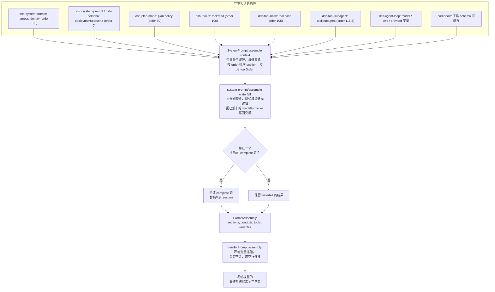
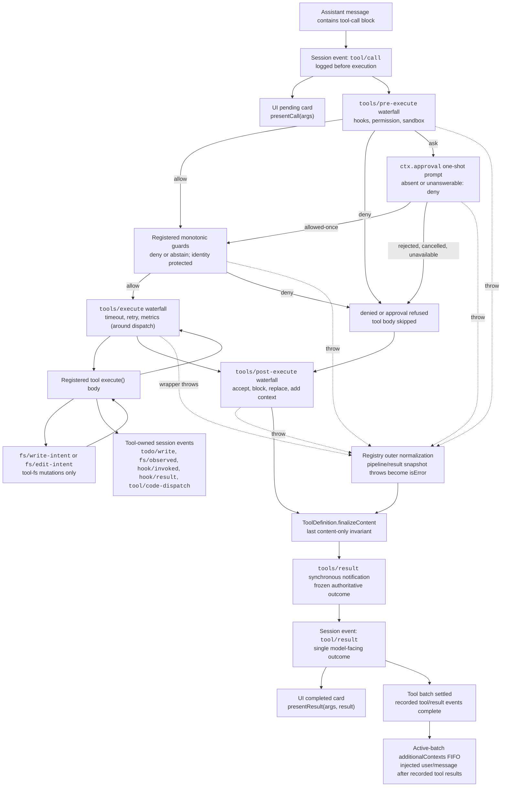

## 两个注册表，撑起一个步骤

agent loop 的每一个步骤都要做两件谁都不能单独把控全程的事：组装发给模型的请求，以及执行模型回复中包含的工具调用。`core/system-prompt`（`ctx.systemPrompt`）拥有第一件事——几十个互不相识的插件各自贡献一段提示词文本或一个工具 schema，`SystemPrompt.assemble()` 把这些片段拼装成一次确定性的请求，而不把整份提示词的控制权交给任何单一插件。`core/tools`（`ctx.tools`）拥有第二件事——无论是 `bash`、`read`、`grep`，还是委派给某个 subagent，每一次工具调用都要经过同一条 `ToolRuntime.execute()` 流水线，因此工具作者只需写一次 `execute()` 主体，就能免费获得策略、重试与可观测性。

## 一份提示词，多个归属方

一个部署会挂载 bash 工具、read/write/edit 三件套、web-fetch 工具、subagent 工具、plan-mode 插件、goal 追踪器——它们中的每一个都可能需要向模型说点什么。bash 包需要模型检查 `[exit code: N]` 标记；read 工具需要模型优先使用它而不是 `cat`；部署方需要说一次「你是一个编码助手」。这些插件互不知道对方的存在，谁也看不到最终的完整提示词，也不该由它们手工协调一个全局的字符串拼接顺序。任何插件都可以调用 `ctx.systemPrompt.section(...)` 贡献一个具名、有序的片段；循环每个步骤调用一次 `ctx.systemPrompt.assemble()`，把当前所有已挂载插件贡献的片段收集进一个 `PromptAssembly`，再由 `renderPrompt()` 把它变成发给模型的那个具体字符串。

## 四种贡献方式

`SystemPrompt` 服务（`ctx.systemPrompt`，定义于 `packages/core/system-prompt/src/index.ts:338`）暴露四个注册方法，每个方法都返回一个 Cordis effect 的 disposer——插件卸载时，它贡献的内容会自动撤回：

:::concept{term="section"}
注册 `{ name, order, text, complete? }`。各段按 `order` 升序拼接；`text` 既可以是静态字符串，也可以是接受 `AssembleContext` 的函数，每次组装都会重新求值。（第 381 行）
:::

:::concept{term="context"}
注册有序的*动态*上下文，是 section 的「缓存不稳定」对应物。上下文会成为模型历史中独立的 user 角色 runtime-context 快照，而不是留在系统提示词内部，因此它可以逐轮变化而不会使覆盖稳定 section 的 KV-cache 前缀失效。（第 398 行）
:::

:::concept{term="tools"}
注册一个工具 schema 提供方。`ToolProviderResult` 是 `{ schemas, knownNames? }`：`schemas` 是限制后模型实际看到的集合；`knownNames` 是限制前的全集，用于把 `toolOrder` 的拼写错误和某个作用域里故意隐藏的工具区分开。（第 430 行）
:::

:::concept{term="variable"}
注册一个具名值，在 section/context 文本中以 `{{name}}` 引用。名称必须匹配 `[a-z][a-z0-9_]*`。（第 446 行）
:::

这四种注册都落在一个 `PromptLayer`（第 304 行）里——要么是唯一的全局层，要么是按调用上下文的 Cordis 作用域标识的 per-agent 作用域层。带作用域的注册只为该 agent 遮蔽同名的全局项；同一层内的重复名称会立即抛出，非有限的 `order` 也一样。

## Order 区间：一种约定，而非枚举

`PromptSection.order` 就是普通的 `number` 类型；类型系统并不阻止两个插件选择相同的值。真正让组装在实践中保持确定性的，是一套记录在案的数值区间约定，直接体现在常量和调用点上：

| Order | 归属方 | 示例 |
|---|---|---|
| `-100` | `dsh-system-prompt` 自身 | `harness:identity`——固定开场白 `You are an AI agent powered by DeepSeek Harness.`（第 357-363 行） |
| `-99` | `app-boot`（自我修改演示挂载时） | `harness:source`，指明磁盘上的 harness 源码检出位置（`packages/boot/app-boot/src/index.ts:821`） |
| `0` | `dsh-system-prompt`（`config.persona`）或遮蔽它的 `dsh-persona`/subagent 行 | `deployment:persona`，以 `PERSONA_SECTION`/`PERSONA_ORDER` 导出（第 128-131 行） |
| `50` | `dsh-plan-mode` | `plan:policy`，仅在有待处理/活跃计划时渲染（`packages/plan/plan-mode/src/index.ts:225`） |
| `99` | `core/tools`（code mode） | `tools:code-only`，陈述在它所限定的逐工具指导*之前* |
| `100-199` | 每个工具包 | `tool:read`（100）、`tool:write`（101）、`tool:edit`（102）、`tool:glob`（103）、`tool:grep`（104）、`tool:bash`（105）、`tool:pty`/`tool:jobs`（106）、`tool:web_search`（110）、`tool:web_fetch`（111）、`tool:lsp`（112）、`tool:session-query`（113）、`tool:goal`（114）、`tool:cordis`/`tool:workflow`（115）、`tool:ralph`（116）、`tool:subagent*`（116.5）、`tool:subagent_report`（117）；`tools:sdk`（150）用于 code-mode 生成的 SDK 摘要 |

共享同一个 `order` 值的段按注册顺序打破平局——这是插件加载顺序的产物，正因如此，约定才要求每个关注点保留一个独立的整数，而不是依赖这个平局规则。每个 order 值都是普通的模块级常量（`core/tools` 中的 `COLLAPSE_SECTION_ORDER = 99`、`SDK_SECTION_ORDER = 150`；subagent 工具包中的 `SUBAGENT_SECTION_ORDER = 116.5`、`REPORT_SECTION_ORDER = 117`）——没有共享注册表来分配它们，新工具包通过查看现有调用点、在 100-199 区间内挑一个未占用的值。下文会讲到的 `toolOrder` 则是*规范化*的：它在 waterfall 运行之前就应用到已收集的工具列表上，因此其确定性完全不依赖加载顺序。

## 一个事实，一个归属方

> [!WHY]
> Agent Note《提示词变量与工具指导归属》陈述了这整套设计背后的原则：提示词中的每一个事实都恰好有一个归属方。一个事实只在一个地方声明；该事实的每个消费者都引用它而不是复制它。

- **单个工具的使用事实**（这个工具是做什么的、什么时候该调用它）放在该工具 schema 的 `description` 字段中——不放在 section 里。
- **description 无法承载的跨调用习惯**（比如「检查每个 bash 结果上的 `[exit code: N]` 标记」）是一个 `tool:*` section，由该工具所在的包拥有：

```ts
// packages/shell/tool-bash/src/index.ts:236
ctx.systemPrompt.section({
  name: 'tool:bash',
  order: 105,
  text: 'Check the [exit code: N] marker on every bash result; investigate failures before moving on.',
})
```

`packages/fs/tool-fs/src/read.ts:70` 用同样的方式在 order 100 处注册 `tool:read`，引导模型使用 read 工具而不是 `cat`。

- **harness 已经知道的运行时事实**（模型名称、工作目录）是一个*变量*，而不是手写的行文。`dsh-agent-loop` 在 `packages/core/agent-loop/src/index.ts:351-353` 注册了三个这样的变量，均为当前 agent 的纯投影：

```ts
ctx.systemPrompt.variable('provider', context => context.agent?.options.provider)
ctx.systemPrompt.variable('model', context => context.agent?.options.model)
ctx.systemPrompt.variable('cwd', context => context.agent?.session.header.cwd)
```

部署方的 persona 随后*引用*这个事实，而不是重述它：

```yaml
# examples/acp-agent/cordis.yml:63-66
persona: |
  You are a coding assistant powered by the {{model}} model. Your working directory is {{cwd}}. Your bash tool runs under a file sandbox — a `[sandbox: file access denied …]` result is policy, not a command bug.

  Verify your work by running the code or tests. Keep answers brief and factual.
```

:::decision
在这个决策落地之前，模型名称是在每个部署的 persona 字符串里手写的，一旦有人只改了 `model:` 配置键而没有同步改 persona，两者就会静默漂移。把它变成变量之后，这个事实只有一个声明处（`options.model`），该事实的每个消费者都引用它而不是复制它。
:::

- **部署角色与行为**（「你是一个编码助手……回答简洁扼要」）只属于 persona——除此之外没有任何地方可以声明角色/行为事实。`dsh-persona`（`packages/preset/persona/src/index.ts:60-67`）为某个作用域的 agent preset 注册的正是同一个 `deployment:persona` 段名和 order，所以一个 preset 的 persona 是替换而不是叠加部署默认值。

## `assemble()`：片段如何变成一份确定性的输出

`SystemPrompt.assemble(context: AssembleContext = {})`（第 457-542 行）由 agent loop 在每个步骤调用一次，`context.scope` 设为当前 agent 的作用域。它依次执行：

:::timeline
- 求值变量 — 先是全局层，然后按作用域链依次求值（从最远的祖先开始），使最近的作用域在名称冲突时获胜
- 合并 section 与 context — 跨作用域链合并，因此作用域内 order 为 0 的 `deployment:persona` 会整体替换全局的那个，而不是追加
- 收集工具 schema — 用 `structuredClone` 克隆 `parameters`，并构建供 `toolOrder` 校验使用的 `knownNames` 全集
- 按 `order` 排序 section — 稳定排序；存在多个生效的 `complete` 段会立即抛出（两个声称是*整份*提示词的声明天然自相矛盾）
- 应用 `toolOrder` — 通过 `orderTools()`；出现未知工具名或恰好名为 `<unlisted-tools>` 的 schema 时，组装直接拒绝而不是悄悄猜测
- 运行 `system-prompt/assemble` waterfall — 模型选择逻辑把已解析的 `provider`/`model` 写回 `assembly.variables`，让 `{{model}}` 在渲染时可见
- 恢复 complete 段 — *原始*的 complete 段被重新拼回作为唯一 section，waterfall 监听器无法再添加或替换
:::



## `renderPrompt`：严格插值，明确失败

`renderPrompt(assembly)`（第 212-217 行）把每个 section 都经过 `interpolate()`，丢弃任何渲染为空字符串的 section——这就是无 persona 的部署或没有待处理计划的 plan-mode section 会从提示词中直接消失的原因——再用空行把剩下的连接起来。`interpolate()`（第 258-295 行）扫描 `{{...}}` 组，刻意保持严格：

- 一个不平衡的开括号（比如 `{{{model}}}` 这类畸形）会抛出「格式错误的提示词变量引用」。
- 一个语法上合法的 `{{name}}`，但 `name` 在已解析的 `variables` 映射上不是 `Object.hasOwn` 的自有属性，会抛出「未知的提示词变量」——这专门用来抵御类似 `{{constructor}}` 这种通过原型链的查找，因为普通的 `in` 或方括号访问会解析到 `Object.prototype` 上。
- 一个已注册的变量，其提供方在本次组装中返回了 `undefined`，会抛出「本次组装没有值」——例如一个引用 `{{cwd}}` 的 persona，用在没有 cwd 的配置预创建 stdio agent 上，会让该轮次响亮地失败，而不是悄悄渲染成空。
- 一个孤立的 `{{`，其后文任何位置都没有 `}}`，会按字面量原样通过——这是唯一一种确实不存在撰写意图歧义的情况。

目前没有在提示词行文中表示字面 `{{...}}` 的转义语法；这个包把它推迟到真正有提示词需要时再实现。`examples/acp-agent` 的 `tests/snapshots/text-turn/system-prompt.expected.md` 精确录制了一个纯文本轮次的产出：identity（order -100）、插值了 `{{model}}`/`{{cwd}}` 的 persona（order 0）、然后是每个已挂载工具包各自的一个 section，按升序排列，某个工具包没有注册 section 的地方则完全不出现任何内容。

## 两类失败，以及工具 schema 归属何处

`toolOrder` 的配置错误处理体现了「明确失败」的两级纪律。**形状**违规——列表中的重复名称，或缺少 `<unlisted-tools>` 其余项——会在插件构造时（配置加载时）由 `validateToolOrder()` 同步检查一次。**内容**违规——列出了一个没有任何提供方注册过的工具名——只有等提供方都有机会注册之后才能得知，因此只会在*第一次* `assemble()` 调用时才浮现，这仍然远早于模型能对一个错误的工具列表采取任何行动。

`PromptAssembly.tools: ToolSchema[]` 和 `sections`、`contexts`、`variables` 并列存在于同一个结构体中，尽管发往模型的 wire 协议把工具 schema 作为独立于系统提示词字符串的 JSON 字段传输——「模型被告知自己能做什么」是一个连贯的整体事实，无论 wire 格式恰好如何拆分它，把两者放在同一个 `PromptAssembly` 下意味着一次 waterfall 遍历就能同时看到并协调两者。`core/tools` 在自己的构造函数中恰好注册一次工具 schema 提供方（`ctx.systemPrompt.tools(context => this.wireSchemas(context.scope))`），并且仅在 code-mode 部署下额外注册两个普通 section（order 99 的 `tools:code-only`，order 150 的 `tools:sdk`），用行文陈述与 `wireSchemas()` 在 schema 列表中强制执行的同一条限制——如果没有它，模型会读到一份逐个描述的完整工具目录，却没有任何声明说明实际上只有一个工具可以被调用，于是它直接原生调用某个工具，收到 `UNKNOWN_TOOL`，进而合理地认定这个部署是坏的。

harness 身份开场白和 persona 默认值都归属于 `dsh-system-prompt` 自身，而不是 `dsh-agent-loop`——因此一个把 agent loop 换成别的实现的部署，这两者都会保留下来，因为循环对提示词唯一的贡献就是那三个变量（`provider`、`model`、`cwd`），它们是关于*这个具体循环所驱动的 agent* 的事实。新的提示词内容是在既有扩展点上新增一次 section/variable 注册，而绝不是修改循环的请求构建路径。

## 注册表是一条流水线，不是一张调度表

模型的回复带着工具调用块抵达之后，`ToolRuntime`（`ctx.tools`）接管一切。工具插件并不各自实现临时的执行逻辑；它们向注册表注册一份 `ToolDefinition`，之后由注册表独家决定一次调用如何抵达这份定义的 `execute()` 主体。这个决定是一串固定的阶段，每个阶段都有自己的扩展点：

`tools/pre-execute`（允许／拒绝／询问）→ 已注册的守卫（终局拒绝）→ `tools/execute`（环绕分发）→ 工具主体 → `tools/post-execute`（接受／阻止／替换）→ `finalizeContent`（只涉及内容）→ `tools/result`（观测）。

下图原样摘自 `docs/tool-execution-pipeline.md`，该文件由仓库根据 `dsh-tools` 实际注册的 waterfall（瀑布式事件）自动重新生成（`pnpm run gen-doc-graphs`）。节点与边上的文字保持原样。



这张图里有几个初看容易忽略、但结构上很关键的事实：

- **`tool/call` 在执行之前就被记录，而不是执行之后。** 只要循环看到模型发出的工具调用块，会话中立刻就有了一条关于模型意图的持久记录——无论这次调用之后是被拒绝、超时还是抛出异常。
- **守卫在可重排的 `pre-execute` waterfall 之后运行，而不是在其内部运行。** `tools/pre-execute` 是钩子、沙箱策略、权限提示彼此可以重新排序的地方；`ctx.tools.guard()` 注册的守卫在其后作为最终的单调检查运行，后续的 waterfall 监听器无法撤销它的决定——守卫只能拒绝或弃权，永远不能把一个拒绝重新变回允许。
- **`ctx.approval` 是 `pre-execute` 上的一条侧门，不是第四个阶段。** `kind: 'ask'` 决定会挂起，进入一次性的审批提示；`allowed-once` 会重新进入 `guards`，而拒绝、取消或审批服务缺失都会一并落到 `denied`。这里没有重试循环。
- **`tools/execute` 只包裹分发过程，不包裹整条流水线**（`around --> toolBody`），这正是文档把它定为超时、重试、指标包装层归属之处的原因——这些关注点在意的是主体的实际运行时行为，而不是策略或呈现。
- **每一条失败路径都会在到达 `finalize` 之前先汇入 `normalized`。** 守卫抛出异常、审批抛出异常、`pre-execute` 抛出异常、`tools/execute` 包装层抛出异常，都会通过同一个外层规范化逻辑变成 `isError` 结果，因此 `finalizeContent` 看到的永远是同一种一致的形态，不论究竟是哪个阶段产生了失败。
- **`tools/result` 只负责观测。** 到它触发的时候，结果已经被冻结；`additionalContexts` 先进先出队列只在整批工具调用全部结算之后才会释放，这也是为什么工具在执行期间推迟附加的上下文，保证会排在这一批全部工具结果之后到达，绝不会与它们交错。

## 公开接口：`ctx.tools` 实际提供什么

`ToolRuntime` 提供的公开 API 有意保持精简（参见 `packages/core/tools/README.zh.md`）：

- `register(definition): () => void`——添加一个受信任、带类型的同进程 `ToolDefinition`。调用方上下文的作用域决定注册所在的层：普通插件上下文全局注册，而 agent 的 `agent.ctx` 只为该 agent 注册，并在那里遮蔽同名的全局工具。
- `presentAs(mode)`——只为单个 agent 覆盖进程级的 `mode` 配置（`native`/`code`/`both`）。
- `restrict(filter)`——在全局工具集合上叠加一个 agent 作用域的允许／拒绝掩码。这是可见性组合，明确不是权限边界——被限制掉的工具对该 agent 不可见，但限制本身不是用来强制「这个 agent 绝不能做 X」的手段，那是 `guard()` 的职责。
- `get(name, scope?)` / `schemas(scope?)`——解析某个作用域实际能看到什么，已经应用了遮蔽和限制。
- `guard(guard: ToolGuard): () => void`——注册一个在 `pre-execute` 之后生效的单调拒绝。签名为 `(execution: Readonly<ToolExecution>) => string | undefined`（`packages/core/tools/src/index.ts:711`）：返回字符串即为最终拒绝理由，返回 `undefined` 则维持原决定不变。
- `execute(exec)`——为一次调用运行完整流水线：快照并冻结参数，分配一个不透明的 `ToolExecutionToken`，依次运行 pre-execute → guards → execute → post-execute → finalize，并在 `tools/result` 触发前独立快照这个已冻结的结果。
- `executionMode(exec)`——为调度决定这次调用是 `parallel` 还是 `exclusive`（见下文）。

### 取消是协作式的，不是强制杀死

每一个 `ToolExecutionInput` 都携带一个由调用方拥有的必填 `AbortSignal`（`packages/core/tools/src/index.ts:314-338`）。工具主体以 `exec.signal` 的形式接收它，必须观测或转发它；只有 `tools/execute` 包装层可以临时替换这个信号（比如用来施加一个截止时间），而注册表会在主体启动之前立即把调用方的原始信号重新融合回去。主体运行之前发生的取消会结算为 `ABORTED_BEFORE_DISPATCH`；主体已经开始运行之后发生的取消，只能把一个*成功*的结果替换为 `ABORTED`——更具体的失败（拒绝、包装层抛出、工具抛出、后置策略失败，或者超时包装层产生的 `TOOL_TIMEOUT`）永远优先。注册表无法强制终止同进程代码；一个忽略自身信号的工具会径直继续运行下去。

## `defineTool()`：类型化参数、规范输出、自动生成的校验

大多数第一方工具并不是靠手写带有 `unknown` 类型 `execute(args, exec)` 主体的 `ToolDefinition` 对象来构建的。它们使用 `dsh-tools` 导出的 `defineTool()`（`packages/core/tools/src/schema.ts:545-617`），该函数直接从一份声明式 schema 推断参数和返回值类型，并在主体运行之前插入校验。

```ts
import { readFile } from 'node:fs/promises'
import type { Context } from '@deepseek-ai/cordis'
import { defineTool } from '@deepseek-ai/dsh-tools'

declare const ctx: Context

ctx.tools.register(defineTool({
  name: 'read_file',
  description: 'Read a file from disk.',
  parameters: {
    path: { type: 'string', required: true, description: 'Absolute file path' },
    offset: { type: 'number' },
    limit: { type: 'number' },
  },
  output: {
    schema: { type: 'string' },
    render: (_args, value) => [{ type: 'text', text: value }],
  },
  async execute(args, exec) {
    // args 已具有类型：{ path: string; offset?: number; limit?: number }
    return readFile(args.path, { encoding: 'utf8', signal: exec.signal })
  },
}))
```

驱动这一切的是两种 schema 类型（`packages/core/tools/src/schema.ts:84-106`）：**`ParameterSchemaSpec`**，工具参数的隐式开放对象根，每个属性是一个 `ValueSchemaSpec` 加上可选的 `required: true`；以及 **`ValueSchemaSpec`**，针对任意无损 JSON 值根的 schema（`string`/`number`/`integer`/`boolean`/`null`/`array`/`object`/仅供作者使用的 `json`，或恰好匹配一个分支的 `oneOf` 联合）。每一个显式的 `object` 节点都必须声明 `additionalProperties: true | false`——不存在意外的默认值。`output.schema` 用的正是同一套联合类型，所以工具的规范返回值可以是对象、数组或标量，不局限于对象。

`DefineToolOptions`（`packages/core/tools/src/schema.ts:482-536`）是完整的编写接口：`name`、`description`、`parameters`，一个必填的 `output` 块（`schema` + `render(args, value)` + 可选的 `presentationMeta(args, value)`），一个可选的 `timeoutMs`（仅作声明用——注册表本身从不强制执行；真正执行的是作为 `tools/execute` 包装层的 `@deepseek-ai/dsh-tool-call-timeout-policy`），一个可选的 `isConcurrencySafe(args)` 分类器，`execute(args, exec)`，以及可选的 `finalizeContent`、`presentCall`、`presentResult`。

`defineTool` 会在注册时通过 `parameterSchemaSpecToJsonSchema` / `valueSchemaSpecToJsonSchema` 各编译一次两套 schema，二者都会调用 `assertSupportedJsonSchema`（`packages/core/tools/src/json-schema.ts:385-389`）——也就是说，schema 本身在工具能够注册之前，就已经针对强制的 JSON Schema 子集完成了校验。调用发生时，`execute` 首先运行 `validateJsonSchemaValue(parameters, args, '')`；任何违规都会变成一个 `ToolArgsError`（`INVALID_ARGS`），而不是主体内部手写的检查。`InferArgs<S>` 和 `InferValue<O>` 把 schema 直接投影成 TypeScript 类型，所以像 `read_file` 这样的主体看到的就是 `args: { path: string; offset?: number; limit?: number }`，无需任何强制类型转换。精确类型推断在嵌套容器的前 16 层内都保持精确，超过之后回退到 `JsonValue`——对真实工具 schema 而言足够深，同时又有边界，使类型检查器自身保持高效。

强制的原始 `JsonSchemaNode` 子集（`packages/core/tools/src/json-schema.ts:26-56`）——单一标量 `type`、对象的 `properties`/`required`/布尔 `additionalProperties`、数组的 `items`、类型正确的 `enum`/`const`、恰好匹配一个分支的 `oneOf`，外加仅作注解用的字段（`description`、`title`、`default`、`examples`）——由工具输出、Code Mode 生成的类型、subagent 结构化输出和工作流结构化输出共享。一份能在这里编译通过的 schema，就保证能在这四个消费方中的每一个里都被完整表达。

### 看一条真实的目录条目，理解模型实际读到什么

`docs/tool-catalog.md` 是通过启动每一个工具插件并采集 `ctx.tools.schemas()` 的结果生成的。`dsh-tool-fs` 的 `read` 工具条目（`docs/tool-catalog.md:638-665`）展示了一份 `defineTool()` schema 在线上呈现的形态：

```json
{
  "type": "object",
  "properties": {
    "file_path": { "type": "string", "description": "Path to read, resolved by the filesystem backend." },
    "offset": { "type": "number", "description": "1-based first line to return. Defaults to 1." },
    "limit": { "type": "number", "description": "Maximum number of lines to return. Defaults to 2000." }
  },
  "required": ["file_path"]
}
```

这正是 `parameterSchemaSpecToJsonSchema` 从一份 `ParameterSchemaSpec` 生成的投影结果——没有隐藏字段，没有厂商扩展。模型看到的，就是编译后的 DSL 本身。

## 呈现：工具自己掌管自己的 UI 卡片

一个已注册的工具可以选择声明 `presentCall(args)` 和 `presentResult(args, result)`（`packages/core/tools/src/presentation.ts`），返回一个带 `card` 标签的呈现意图，让 UI 无需针对工具名称编写特殊逻辑。调用态的视图有 `generic`（默认：标题、可选的 `kind` 用于选择图标、`rawInput`、供编辑器跟随定位的 `locations`）、`terminal`（这次调用本身就是一条 shell 命令）、`diff`（这次调用创建或修改文件——`diffs: [{ path, oldText, newText }]`，新建文件时 `oldText` 为 `null`）。结果态的视图在此基础上新增了 `search`（按文件分组的匹配结果或扁平路径列表，配有 `truncated`/`total`）和 `read`（带行号、附带语法提示的代码视图）。

这些呈现器必须是其参数（对 `presentResult` 而言还包括持久化的结果）的纯函数——不能有 I/O，不能读会话状态，不能依赖时钟——因为 UI 会在实时流式输出和会话日志回放这两种场景下都调用它们。`defineTool` 在展示路径上对此做了柔性强制：`presentCall`/`presentResult` 的包装层会重新校验参数，遇到不匹配就回退到 `undefined`（走通用呈现），而不是抛出异常，这样一条来自已变更 schema 的旧日志调用记录就不会让回放崩溃。`dsh-tool-bash`（terminal）和 `dsh-tool-fs`（diff/generic）是参考实现。

## 并行调度与独占调度

`ctx.tools.executionMode(exec)` 决定 agent loop 的滚动调度池如何对待一次调用。只有当已解析定义的 `isConcurrencySafe(exec.arguments)` 分类器恰好返回 `true` 时，它才会报告 `parallel`；任何未知、隐藏、未声明、参数无效或抛出异常的分类结果都是 `exclusive`。循环会把连续的 `parallel` 调用归入一个有界的池，并把每一个 `exclusive` 调用当作排序屏障——分发与主体执行可以重叠，但策略阶段、持久化结果和模型可见的上下文始终保持模型原本的调用顺序。这是一种主动选择加入、而且天生保守的机制：一个会修改父级拥有的状态、或者共享状态竞态不具备交换性的主体，绝不应该声明 `isConcurrencySafe`。

## Code Mode：用生成的 SDK 取代逐次调用

以上内容描述的都是原生模式——默认模式下，每个可见工具都会作为独立的 JSON 函数 schema 发送给模型，模型每次动作发出一个工具调用块。`ToolRuntime` 的 `mode` 配置（`native` | `code` | `both`）可以转而只暴露一个保留工具 `run_code`，外加一份生成的 SDK，让模型编写一段简短的程序，在一次执行中依次或并行调用多个工具。

原生模式下每次调用都要走一个完整的往返：每个工具结果都要重新进入模型的上下文，下一次调用才能被规划出来，一个「读取→判断→写入」这样的多步序列每一步都要消耗一整轮模型交互。Code Mode 把这一切压缩进一次 `run_code` 调用，其调用体是一段程序：模型可以在本地循环、分支、组合多个工具结果，只有程序自己的 `console.log` 输出和 `return` 返回值会重新进入对话——中间的工具结果完全不会进入模型上下文。这种取舍是明确摆出来的，不是普适的胜利：Code Mode 用一个传输 schema 加生成的 SDK 文本取代了逐个工具的 schema（参见 `packages/core/tools/README.zh.md` 的「模型体验」部分），而且模型必须用生成的代码来推理，而不是用结构化的 JSON 调用。

`run_code` 接受两个必填参数：`code`（一个异步函数的函数体）和 `description`（供 UI 展示的简短摘要），定义在 `packages/core/tools/src/code-mode.ts:294-330`。它的 schema 和 SDK 说明是按语言区分的——注册表根据 `ctx.codeRuntime.language` 解析对应的变体（`typescript` 通过 `dsh-code-runtime-worker-thread` 交付；Python 渲染器是内置的，驱动任何报告 `language: 'python'` 的运行时），其生成的目录条目（`docs/tool-catalog.md:119-148`）恰好声明这两个必填的字符串属性——与前面 `read` 展示的那种投影一致。在程序体内部，每一个其他可见工具都会变成一个绑定——`await tools.read_file({ path })`，特殊名称用带引号的下标访问（`tools["my-tool"](args)`）——解析结果是该工具精确的规范 JSON 值，而不是它渲染出的 Native 文本。子调用失败会以 `ToolCallError` 拒绝，只携带 `toolName` 和一句人类可读的 `message`；内部错误码和 Native 内容都留在这份约定之外。

### 子调用会重新进入同一条受控流水线

:::fold[Code Mode 子调用如何保持受策略约束且可回放]
Code Mode 是一种传输方式，不是一条绕过策略的捷径。程序内部每一次 `await tools.name(args)` 调用都会通过 `registry.execute()` 完整地分发——pre-execute、guards、execute、post-execute、result——一步不少，并携带外层 `run_code` 执行的不透明 token 作为它的 `parent`（`ToolExecutionInput.parent`，`packages/core/tools/src/index.ts:326-335`）。并发安全的子调用最多可以重叠到配置的 `maxParallelSubCalls`（默认 10）；被分类为独占的子调用会排空池、单独运行，并阻挡后续调用的启动——与原生循环用的是同一套调度约定。每个子调用在分发进入时记录一条 `tool/code-dispatch-start` 事件，在结算时记录一条 `tool/code-dispatch` 事件（确定性 id 为 `<parent>:code:<n>`），因此即便只有外层程序的输出会抵达模型，会话日志依然保持一份完整、可回放的实际执行记录。

在 `mode: code`（而非 `both`）下，`run_code` 同时也是模型*唯一*可以直接调用的东西：模型直呼其他任何工具的名字，都会在创建执行时——早于 `tools/pre-execute`、早于审批、早于 guards——就解析为 `UNKNOWN_TOOL`，因此没有任何一方会去观察或批准一个注定只会失败的调用。SDK 子分发不受此限制，因为它们始终携带 `parent` token。
:::

`docs/cookbook/adding-a-tool.md` 直接给工具作者点出了这一点的实践含义：把 `output.schema` 设计成「一个有用的编程 API——直接返回句柄和字段，在标量／数组／null 才是诚实值的时候就允许这些根类型，把面向人类的解释留给 `output.render`」。一个只为原生模式渲染出的散文而构建的工具，会逼着 Code Mode 里的程序去解析文本才能拿到一个 id；而一个规范值本身就已经免费携带这个 id 的工具，在两种传输方式下表现同样出色——因为两者读的是同一个由 `output.schema` 声明的值，一个经由 `render()`，一个经由 SDK 绑定的类型化返回值。

## 工具作者在这一切中处于什么位置

注册一个工具是插件层面的一个 effect：

```ts
export const name = 'my-tool'
export const inject = ['tools']

export function apply(ctx: Context) {
  ctx.tools.register(defineTool({ /* ... */ }))
}
```

从这里出发，部署相关的策略应该放在流水线各阶段，而不是塞进工具主体：可扩展的允许／拒绝／询问逻辑放进 `tools/pre-execute`；最终的所有者策略拒绝放进 `ctx.tools.guard()`；围绕分发的超时／重试／指标包装层放进 `tools/execute`；替换内容、替换规范值、用纠正性反馈阻止结果，或附加面向模型的上下文，放进 `tools/post-execute`；纯粹的观测放进 `tools/result`。一个把沙箱逻辑或重试逻辑硬编码进自身的工具，只是在重复这些扩展点本就存在的职责——并且失去了「一个钩子或策略插件可以横跨所有工具族生效，而无需与其中任何一个耦合」这个本该有的性质。同样的纪律也适用于上游的提示词:跨调用的指导是工具自己所在包里的一个 `tool:*` section,运行时事实是只注册一次的变量,部署角色/行为则只留在 persona 里——因此一个新工具或一个新部署,永远不需要触碰 `agent-loop` 的请求构建路径,就能被模型听见。
