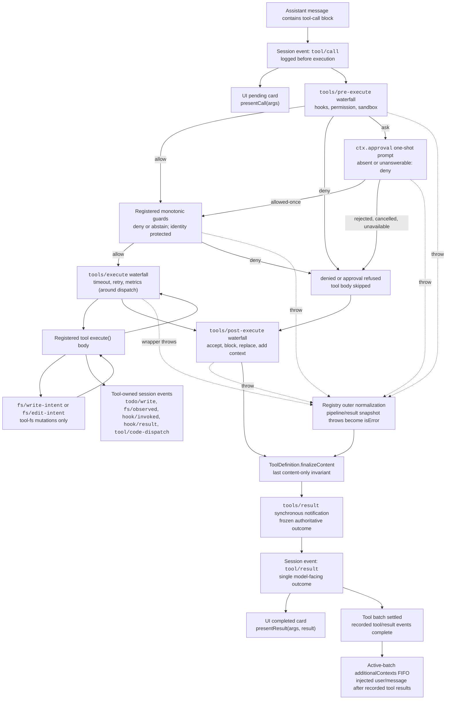

## The registry is a pipeline, not a dispatch table

Every tool call a model makes — `bash`, `read`, `grep`, a subagent delegation — passes through one shared service: `ToolRuntime`, injected as `ctx.tools`. Tool plugins do not run their own execution logic ad hoc; they register a `ToolDefinition` with the registry, and the registry alone decides how a call reaches that definition's `execute()` body. That decision is a fixed sequence of stages, each with its own extension point, none of which the tool author has to reimplement:

`tools/pre-execute` (allow/deny/ask) → registered guards (final deny) → `tools/execute` (around-dispatch) → the tool body → `tools/post-execute` (accept/block/replace) → `finalizeContent` (content-only) → `tools/result` (observe).

This chapter walks that pipeline stage by stage using the harness's own generated diagram, then covers the two things every tool author actually touches: the `defineTool()` DSL for typed parameters and canonical output, and Code Mode, the alternative transport that lets a model write a program against a generated SDK instead of emitting one tool call at a time.

## The full pipeline, as generated by the harness

The following diagram is reproduced from `docs/tool-execution-pipeline.md`, which the repository regenerates from the actual `dsh-tools` waterfall registrations (`pnpm run gen-doc-graphs`). Node and edge labels are preserved verbatim; nothing here is invented for the course.



A few structural facts this diagram encodes that are easy to miss on a first read:

- **`tool/call` is logged before execution, not after.** The session already has a durable record of the model's intent the instant the loop sees the tool-call block — independent of whether the call is later denied, times out, or throws. `presentCall` (a pending UI card) and the `pre` gate both branch off that same logged event.
- **Guards run after the reorderable `pre-execute` waterfall, not inside it.** `tools/pre-execute` is where hooks, sandbox policy, and permission prompts plug in and may be reordered relative to each other; `ctx.tools.guard()` registrations run afterward as a final, monotonic check that later waterfall listeners cannot undo. A guard can only deny or abstain — it can never turn a denial back into an allow.
- **`ctx.approval` is a side door off `pre-execute`, not a fourth stage.** A `kind: 'ask'` decision suspends into a one-shot approval prompt; `allowed-once` re-enters at `guards`, while rejection, cancellation, or an absent approval service all fall through to `denied`. There is no retry loop — one prompt, one answer.
- **`tools/execute` wraps dispatch, not the whole pipeline.** It is the only stage positioned directly around the tool body (`around --> toolBody`), which is why it is documented as the home for timeout, retry, and metrics wrappers: those concerns care about the body's wall-clock behavior, not about policy or presentation.
- **Filesystem read-before-edit checks (`fs/write-intent`, `fs/edit-intent`) live inside the tool body**, scoped to `dsh-tool-fs` mutations only — they are not a generic pipeline stage every tool passes through.
- **Every failure path funnels through `normalized` before `finalize`.** A guard throw, an approval throw, a `pre-execute` throw, and a `tools/execute` wrapper throw all become `isError` results through the same outer normalization, so a tool's `finalizeContent` sees one consistent shape regardless of which stage produced the failure.
- **`finalizeContent` is a `ToolDefinition`-owned callback, not a waterfall.** It runs exactly once per call, after every other transform (`post`, `normalized`), and its only power is replacing `content` — never `value`, never `meta`. This is the tool's last word on what the model actually reads.
- **`tools/result` is observe-only.** By the time it fires, the outcome is frozen; nothing downstream of it can change what already went to `tool/result` in the session log. The `context` node — the `additionalContexts` FIFO — only drains after the whole tool batch settles, which is why context a tool defers during execution is guaranteed to arrive after every tool result in that batch, never interleaved with them.

## Public surface: what `ctx.tools` actually offers

`ToolRuntime` (service key `tools`) exposes a small, deliberately narrow API (`packages/core/tools/README.md`):

- `register(definition): () => void` — add a trusted, typed, same-process `ToolDefinition`. The calling context's scope decides the layer: a plain plugin context registers globally, while an agent's `agent.ctx` registers only for that agent, shadowing a same-named global tool there. Disposal is effect-based — dispose the registering fiber and the tool vanishes.
- `presentAs(mode)` — override the process-wide `mode` config (`native`/`code`/`both`) for one agent only.
- `restrict(filter)` — apply an agent-scoped allow/deny mask over the global tool set. This is visibility composition, explicitly not an authority boundary (a restricted-away tool is invisible to that agent, but restriction is not how you enforce "this agent must never do X" — that is `guard()`'s job).
- `get(name, scope?)` / `schemas(scope?)` — resolve what one scope can see, with shadowing and restriction already applied.
- `guard(guard: ToolGuard): () => void` — register a monotonic post-`pre-execute` deny. Signature: `(execution: Readonly<ToolExecution>) => string | undefined` (`packages/core/tools/src/index.ts:711`); returning a string is a final denial reason, `undefined` leaves the decision unchanged.
- `execute(exec)` — run the complete pipeline for one call: snapshot and freeze arguments, assign an opaque `ToolExecutionToken`, run pre-execute → guards → execute → post-execute → finalize, and independently snapshot the frozen outcome before `tools/result` fires.
- `executionMode(exec)` — resolve `parallel` vs `exclusive` for scheduling (see below).

### Cancellation is cooperative, not a hard kill

Every `ToolExecutionInput` carries a required, caller-owned `AbortSignal` (`packages/core/tools/src/index.ts:314-338`). A tool body receives it as `exec.signal` and must observe or forward it; only a `tools/execute` wrapper may temporarily replace that signal (to impose a deadline, say), and the registry re-fuses the original caller signal immediately before the body starts. Cancellation before the body runs settles as `ABORTED_BEFORE_DISPATCH`; cancellation after the body started can only replace a *successful* outcome with `ABORTED` — a more specific failure (denial, wrapper throw, tool throw, post-policy failure, or a timeout wrapper's `TOOL_TIMEOUT`) always wins. The registry cannot hard-terminate same-process code; a tool that ignores its signal simply keeps running.

## `defineTool()`: typed parameters, canonical output, generated validation

Most first-party tools are not built by hand-writing `ToolDefinition` objects with `unknown`-typed `execute(args, exec)` bodies. They use `defineTool()`, exported from `dsh-tools` (`packages/core/tools/src/schema.ts:545-617`), which infers argument and return types straight from a declarative schema and inserts validation before the body ever runs.

```ts
import { readFile } from 'node:fs/promises'
import type { Context } from '@deepseek-ai/cordis'
import { defineTool } from '@deepseek-ai/dsh-tools'

declare const ctx: Context

ctx.tools.register(defineTool({
  name: 'read_file',
  description: 'Read a file from disk.',
  parameters: {
    path: { type: 'string', required: true, description: 'Absolute file path' },
    offset: { type: 'number' },
    limit: { type: 'number' },
  },
  output: {
    schema: { type: 'string' },
    render: (_args, value) => [{ type: 'text', text: value }],
  },
  async execute(args, exec) {
    // args is typed: { path: string; offset?: number; limit?: number }
    return readFile(args.path, { encoding: 'utf8', signal: exec.signal })
  },
}))
```

Two schema types drive this (`packages/core/tools/src/schema.ts:84-106`):

- **`ParameterSchemaSpec`** — an implicit, open object root for the tool's arguments. Each property is a `ValueSchemaSpec` plus an optional `required: true`.
- **`ValueSchemaSpec`** — a schema for any lossless JSON value root: `string`/`number`/`integer`/`boolean`/`null`/`array`/`object`/author-only `json`, or an exact-one `oneOf` union. Every explicit `object` node must declare `additionalProperties: true | false` — there is no accidental default. `output.schema` uses this same union, so a tool's canonical return value can be an object, array, or scalar, not just an object (`run_code` itself returns `{ logs: string[]; result?: JsonValue }`, an object; a tool could equally declare a bare `string` or `number` root when that is the honest value).

`DefineToolOptions` (`packages/core/tools/src/schema.ts:482-536`) is the full authoring surface: `name`, `description`, `parameters`, a mandatory `output` block (`schema` + `render(args, value)` + optional `presentationMeta(args, value)`), an optional `timeoutMs` (declarative only — the registry never enforces it; `@deepseek-ai/dsh-tool-call-timeout-policy` is the enforcing `tools/execute` wrapper), an optional `isConcurrencySafe(args)` classifier, `execute(args, exec)`, and optional `finalizeContent`, `presentCall`, `presentResult`.

`defineTool` compiles both schemas once at registration through `parameterSchemaSpecToJsonSchema` / `valueSchemaSpecToJsonSchema`, which both call `assertSupportedJsonSchema` (`packages/core/tools/src/json-schema.ts:385-389`) — the schema itself is validated against the enforced JSON Schema subset before the tool can even register. At call time, `execute` first runs `validateJsonSchemaValue(parameters, args, '')`; any violation becomes a `ToolArgsError` (`INVALID_ARGS`) rather than a hand-written check inside the body. `InferArgs<S>` and `InferValue<O>` project the schema straight into TypeScript types, so a body like `read_file`'s sees `args: { path: string; offset?: number; limit?: number }` with no casting. Type inference stays exact for the first 16 container levels of nesting, then degrades to `JsonValue` — deep enough for real tool schemas, and bounded so the type checker itself stays fast (`packages/core/tools/src/schema.ts:149-172`).

The enforced raw `JsonSchemaNode` subset (`packages/core/tools/src/json-schema.ts:26-56`) — one scalar `type`, object `properties`/`required`/boolean `additionalProperties`, array `items`, type-correct `enum`/`const`, exact-one `oneOf`, plus annotation-only fields (`description`, `title`, `default`, `examples`) — is shared by tool outputs, Code Mode's generated types, subagent structured output, and workflow structured output. It is a genuine seam: a schema that compiles here is guaranteed representable in every one of those four consumers.

### A raw catalog entry, to see what the model actually reads

`docs/tool-catalog.md` is generated by booting every tool plugin and harvesting `ctx.tools.schemas()`. The `dsh-tool-fs` `read` tool's entry (`docs/tool-catalog.md:638-665`) shows the shape a `defineTool()` schema turns into on the wire:

```json
{
  "type": "object",
  "properties": {
    "file_path": { "type": "string", "description": "Path to read, resolved by the filesystem backend." },
    "offset": { "type": "number", "description": "1-based first line to return. Defaults to 1." },
    "limit": { "type": "number", "description": "Maximum number of lines to return. Defaults to 2000." }
  },
  "required": ["file_path"]
}
```

This is exactly the projection `parameterSchemaSpecToJsonSchema` produces from a `ParameterSchemaSpec` — no hidden fields, no vendor extensions. What the model sees IS the compiled DSL.

## Presentation: a tool owns its own UI card

A registered tool can optionally declare `presentCall(args)` and `presentResult(args, result)` (`packages/core/tools/src/presentation.ts`), returning a `card`-tagged render intent so a UI never needs to special-case tool names. Call-time views are `generic` (default: title, optional `kind` for iconography, `rawInput`, follow-along `locations`), `terminal` (the call IS a shell command — title is the command, optional `cwd`), or `diff` (the call creates or modifies files — `diffs: [{ path, oldText, newText }]`, `oldText: null` for a new file). Result-time views add `search` (grouped-by-file matches or a flat path list, with `truncated`/`total` so a UI never renders a capped result as complete) and `read` (line-numbered, syntax-hinted code view) on top of `generic`/`terminal`/`diff`.

These presenters must be pure functions of their arguments (and, for `presentResult`, the durable result) — no I/O, no session reads, no clock — because a UI calls them both during live streaming and during session-log replay. `defineTool` enforces this softly on the display path: a `presentCall`/`presentResult` wrapper re-validates arguments and falls back to `undefined` (generic rendering) on a mismatch instead of throwing, so an older logged call from a since-changed schema never crashes replay. `dsh-tool-bash` (terminal) and `dsh-tool-fs` (diff/generic) are the reference implementations.

## Parallel vs exclusive scheduling

`ctx.tools.executionMode(exec)` decides how the agent loop's rolling pool treats a call. It reports `parallel` only when the resolved definition's `isConcurrencySafe(exec.arguments)` classifier returns exactly `true`; any unknown, hidden, undeclared, invalid-argument, or throwing classification is `exclusive`. The loop groups consecutive `parallel` calls into a bounded pool and treats every `exclusive` call as an ordering barrier — dispatch and body execution may overlap, but policy stages, durable results, and model-visible context all preserve model call order regardless. This is opt-in and conservative by construction: a body that mutates parent-owned state, or whose shared-state races do not commute, must not declare `isConcurrencySafe`.

## Code Mode: a generated SDK instead of one call at a time

Everything above describes native mode — the default, in which every visible tool is sent to the model as its own JSON function schema and the model emits one tool-call block per action. `ToolRuntime`'s `mode` config (`native` | `code` | `both`) can instead expose a single reserved tool, `run_code`, plus a generated SDK, letting the model write a short program that calls several tools in sequence or in parallel from inside one execution.

### Why it exists

Native mode's per-call round trip means every tool result re-enters the model's context before the next call can be planned, and a multi-step read-then-decide-then-write sequence costs one full model turn per step. Code Mode collapses that into one `run_code` call whose body is a program: the model can loop, branch, and combine several tool results locally, and only the program's own `console.log` output and `return` value re-enter the conversation — intermediate tool results stay off the model's context entirely. The trade is explicit, not a universal win: Code Mode swaps per-tool schemas for one transport schema plus generated SDK text (`packages/core/tools/README.md`, Model Experience section), and the model must reason in generated code rather than in structured JSON calls.

### The shape of `run_code`

`run_code` takes two required arguments, `code` (the body of an async function) and `description` (a short UI-facing summary), defined in `packages/core/tools/src/code-mode.ts:294-330`. Its schema and SDK instructions are language-specific — the registry resolves the flavor from `ctx.codeRuntime.language` (`typescript` ships via `dsh-code-runtime-worker-thread`; a Python renderer is built in for any runtime reporting `language: 'python'`). The catalog entry for the TypeScript flavor (`docs/tool-catalog.md:119-148`):

```json
{
  "type": "object",
  "properties": {
    "code": { "type": "string", "description": "The program: the body of an async TypeScript function." },
    "description": { "type": "string", "description": "Clear, concise description of what this program does..." }
  },
  "required": ["code", "description"]
}
```

Inside the program body, every other visible tool becomes a binding — `await tools.read_file({ path })`, quoted access for exotic names (`tools["my-tool"](args)`) — that resolves to the tool's exact canonical JSON value, not its rendered Native text. A failed sub-call rejects with `ToolCallError`, carrying only `toolName` and a human-readable `message`; internal error codes and Native content stay outside the contract, so a program can `try`/`catch` and recover without leaking implementation detail.

### Sub-calls re-enter the same guarded pipeline

This is the point worth internalizing: Code Mode is a transport, not a bypass. Each `await tools.name(args)` call inside the program is dispatched through `registry.execute()` exactly like a native call — pre-execute, guards, execute, post-execute, result — carrying the outer `run_code` execution's opaque token as its `parent` (`ToolExecutionInput.parent`, `packages/core/tools/src/index.ts:326-335`). Concurrency-safe sub-calls may overlap up to the configured `maxParallelSubCalls` (default 10); an exclusive-classified sub-call drains the pool, runs alone, and blocks later starts — the same scheduling contract the native loop uses. Each sub-call logs a `tool/code-dispatch-start` event at dispatch entry and a `tool/code-dispatch` event at settlement (deterministic id `<parent>:code:<n>`), so the session log stays a complete, replayable record of everything that ran even though only the outer program's output reaches the model.

Under `mode: code` (not `both`), `run_code` is also the *only* thing a model may call directly: a model-direct call naming any other tool resolves to `UNKNOWN_TOOL` at execution creation — before `tools/pre-execute`, before approval, before guards — so nothing observes or approves a call that could only ever fail. The denial text names the correct route back (`only \`run_code\` is callable directly — call \`<name>\` from inside a \`run_code\` program instead`). SDK sub-dispatches are exempt from this check because they always carry a `parent` token.

### Designing a tool's output for Code Mode

`docs/cookbook/adding-a-tool.md` states the practical implication for tool authors directly: design `output.schema` "as a useful programmatic API — return handles and fields directly, allow scalar/array/null roots when they are the honest value, and keep human explanation in `output.render`." A tool built only for native mode's rendered prose forces a Code Mode program to parse text to recover an id; a tool whose canonical value already carries that id for free works identically well under both transports, because both read the same `output.schema`-declared value — one through `render()`, one through the SDK binding's typed return.

## Where a tool author fits into all of this

Registering a tool is a plugin-level effect (`docs/cookbook/adding-a-tool.md`):

```ts
export const name = 'my-tool'
export const inject = ['tools']

export function apply(ctx: Context) {
  ctx.tools.register(defineTool({ /* ... */ }))
}
```

From there, the pipeline stages are where deployment-specific policy belongs, not inside the tool body: `tools/pre-execute` for extensible allow/deny/ask, `ctx.tools.guard()` for a final owner-policy deny, `tools/execute` for timeout/retry/metrics wrappers around dispatch, `tools/post-execute` for replacing content, replacing the canonical value, blocking with corrective feedback, or attaching model-facing context, and `tools/result` for pure observation. A tool that hard-codes its own sandboxing or its own retry logic duplicates what these extension points already exist to provide — and loses the property that a hook or policy plugin can span every tool family without coupling to any one of them.
