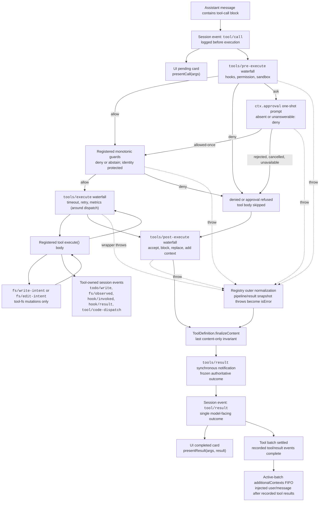

## 注册表是一条流水线，不是一张调度表

模型发起的每一次工具调用——`bash`、`read`、`grep`，或者委派给某个 subagent——都要经过同一个服务：以 `tools` 为键注入的 `ToolRuntime`（`ctx.tools`）。工具插件并不各自实现临时的执行逻辑；它们向注册表注册一份 `ToolDefinition`，之后由注册表独家决定一次调用如何抵达这份定义的 `execute()` 主体。这个决定是一串固定的阶段，每个阶段都有自己的扩展点，工具作者完全不必重新实现：

`tools/pre-execute`（允许／拒绝／询问）→ 已注册的守卫（终局拒绝）→ `tools/execute`（环绕分发）→ 工具主体 → `tools/post-execute`（接受／阻止／替换）→ `finalizeContent`（只涉及内容）→ `tools/result`（观测）。

本章借助 harness 自身生成的流程图逐阶段走一遍这条流水线，然后聚焦每个工具作者真正会接触到的两件事：用于类型化参数与规范输出的 `defineTool()` DSL，以及 Code Mode——让模型针对一份生成的 SDK 编写程序，而不是一次只发出一个工具调用的替代传输方式。

## 完整流水线：harness 自己生成的图

下图原样摘自 `docs/tool-execution-pipeline.md`，该文件由仓库根据 `dsh-tools` 实际注册的 waterfall（瀑布式事件）自动重新生成（`pnpm run gen-doc-graphs`）。节点与边上的文字保持原样，本章没有为教学目的另行编造任何内容。



这张图里有几个初看容易忽略、但结构上很关键的事实：

- **`tool/call` 在执行之前就被记录，而不是执行之后。** 只要循环看到模型发出的工具调用块，会话中立刻就有了一条关于模型意图的持久记录——无论这次调用之后是被拒绝、超时还是抛出异常。`presentCall`（挂起态 UI 卡片）与 `pre` 门禁都从同一个已记录的事件分支出来。
- **守卫在可重排的 `pre-execute` waterfall 之后运行，而不是在其内部运行。** `tools/pre-execute` 是钩子、沙箱策略、权限提示彼此可以重新排序的地方；`ctx.tools.guard()` 注册的守卫在其后作为最终的单调检查运行，后续的 waterfall 监听器无法撤销它的决定。守卫只能拒绝或弃权——它永远不能把一个拒绝重新变回允许。
- **`ctx.approval` 是 `pre-execute` 上的一条侧门，不是第四个阶段。** `kind: 'ask'` 决定会挂起，进入一次性的审批提示；`allowed-once` 会重新进入 `guards`，而拒绝、取消或审批服务缺失都会一并落到 `denied`。这里没有重试循环——一次提示，一个答复。
- **`tools/execute` 只包裹分发过程，不包裹整条流水线。** 它是唯一直接环绕工具主体的阶段（`around --> toolBody`），这正是文档把它定为超时、重试、指标包装层归属之处的原因：这些关注点在意的是主体的实际运行时行为，而不是策略或呈现。
- **文件系统的先读后写检查（`fs/write-intent`、`fs/edit-intent`）位于工具主体内部**，只针对 `dsh-tool-fs` 的写操作生效——它不是每个工具都要经过的通用流水线阶段。
- **每一条失败路径都会在到达 `finalize` 之前先汇入 `normalized`。** 守卫抛出异常、审批抛出异常、`pre-execute` 抛出异常、`tools/execute` 包装层抛出异常，都会通过同一个外层规范化逻辑变成 `isError` 结果，因此工具的 `finalizeContent` 看到的永远是同一种一致的形态，不论究竟是哪个阶段产生了失败。
- **`finalizeContent` 是 `ToolDefinition` 自身持有的回调，不是一个 waterfall。** 它对每次调用恰好运行一次，且排在所有其他变换（`post`、`normalized`）之后；它唯一的权力是替换 `content`——永远不能替换 `value`，也不能替换 `meta`。这是工具对「模型最终读到什么」拥有的最后发言权。
- **`tools/result` 只负责观测。** 到它触发的时候，结果已经被冻结；它之后没有任何环节能再改变已经写入会话日志 `tool/result` 的内容。`context` 节点——也就是 `additionalContexts` 先进先出队列——只在整批工具调用全部结算之后才会释放，这也是为什么工具在执行期间推迟附加的上下文，保证会排在这一批全部工具结果之后到达，绝不会与它们交错。

## 公开接口：`ctx.tools` 实际提供什么

`ToolRuntime`（服务键 `tools`）提供的公开 API 有意保持精简（参见 `packages/core/tools/README.zh.md`）：

- `register(definition): () => void`——添加一个受信任、带类型的同进程 `ToolDefinition`。调用方上下文的作用域决定注册所在的层：普通插件上下文全局注册，而 agent 的 `agent.ctx` 只为该 agent 注册，并在那里遮蔽同名的全局工具。dispose（资源释放）是基于 effect 的——释放注册所在的 fiber，工具就随之消失。
- `presentAs(mode)`——只为单个 agent 覆盖进程级的 `mode` 配置（`native`/`code`/`both`）。
- `restrict(filter)`——在全局工具集合上叠加一个 agent 作用域的允许／拒绝掩码。这是可见性组合，明确不是权限边界（被限制掉的工具对该 agent 不可见，但限制本身不是用来强制「这个 agent 绝不能做 X」的手段——那是 `guard()` 的职责）。
- `get(name, scope?)` / `schemas(scope?)`——解析某个作用域实际能看到什么，已经应用了遮蔽和限制。
- `guard(guard: ToolGuard): () => void`——注册一个在 `pre-execute` 之后生效的单调拒绝。签名为 `(execution: Readonly<ToolExecution>) => string | undefined`（`packages/core/tools/src/index.ts:711`）：返回字符串即为最终拒绝理由，返回 `undefined` 则维持原决定不变。
- `execute(exec)`——为一次调用运行完整流水线：快照并冻结参数，分配一个不透明的 `ToolExecutionToken`，依次运行 pre-execute → guards → execute → post-execute → finalize，并在 `tools/result` 触发前独立快照这个已冻结的结果。
- `executionMode(exec)`——为调度决定这次调用是 `parallel` 还是 `exclusive`（见下文）。

### 取消是协作式的，不是强制杀死

每一个 `ToolExecutionInput` 都携带一个由调用方拥有的必填 `AbortSignal`（`packages/core/tools/src/index.ts:314-338`）。工具主体以 `exec.signal` 的形式接收它，必须观测或转发它；只有 `tools/execute` 包装层可以临时替换这个信号（比如用来施加一个截止时间），而注册表会在主体启动之前立即把调用方的原始信号重新融合回去。主体运行之前发生的取消会结算为 `ABORTED_BEFORE_DISPATCH`；主体已经开始运行之后发生的取消，只能把一个*成功*的结果替换为 `ABORTED`——更具体的失败（拒绝、包装层抛出、工具抛出、后置策略失败，或者超时包装层产生的 `TOOL_TIMEOUT`）永远优先。注册表无法强制终止同进程代码；一个忽略自身信号的工具会径直继续运行下去。

## `defineTool()`：类型化参数、规范输出、自动生成的校验

大多数第一方工具并不是靠手写带有 `unknown` 类型 `execute(args, exec)` 主体的 `ToolDefinition` 对象来构建的。它们使用 `dsh-tools` 导出的 `defineTool()`（`packages/core/tools/src/schema.ts:545-617`），该函数直接从一份声明式 schema 推断参数和返回值类型，并在主体运行之前插入校验。

```ts
import { readFile } from 'node:fs/promises'
import type { Context } from '@deepseek-ai/cordis'
import { defineTool } from '@deepseek-ai/dsh-tools'

declare const ctx: Context

ctx.tools.register(defineTool({
  name: 'read_file',
  description: 'Read a file from disk.',
  parameters: {
    path: { type: 'string', required: true, description: 'Absolute file path' },
    offset: { type: 'number' },
    limit: { type: 'number' },
  },
  output: {
    schema: { type: 'string' },
    render: (_args, value) => [{ type: 'text', text: value }],
  },
  async execute(args, exec) {
    // args 已具有类型：{ path: string; offset?: number; limit?: number }
    return readFile(args.path, { encoding: 'utf8', signal: exec.signal })
  },
}))
```

驱动这一切的是两种 schema 类型（`packages/core/tools/src/schema.ts:84-106`）：

- **`ParameterSchemaSpec`**——工具参数的隐式开放对象根。每个属性是一个 `ValueSchemaSpec`，外加可选的 `required: true`。
- **`ValueSchemaSpec`**——针对任意无损 JSON 值根的 schema：`string`/`number`/`integer`/`boolean`/`null`/`array`/`object`/仅供作者使用的 `json`，或恰好匹配一个分支的 `oneOf` 联合。每一个显式的 `object` 节点都必须声明 `additionalProperties: true | false`——不存在意外的默认值。`output.schema` 用的正是同一套联合类型，所以工具的规范返回值可以是对象、数组或标量，不局限于对象（`run_code` 自身返回的 `{ logs: string[]; result?: JsonValue }` 就是一个对象；但一个工具同样可以声明裸 `string` 或 `number` 根，只要那才是诚实的返回值）。

`DefineToolOptions`（`packages/core/tools/src/schema.ts:482-536`）是完整的编写接口：`name`、`description`、`parameters`，一个必填的 `output` 块（`schema` + `render(args, value)` + 可选的 `presentationMeta(args, value)`），一个可选的 `timeoutMs`（仅作声明用——注册表本身从不强制执行；真正执行的是作为 `tools/execute` 包装层的 `@deepseek-ai/dsh-tool-call-timeout-policy`），一个可选的 `isConcurrencySafe(args)` 分类器，`execute(args, exec)`，以及可选的 `finalizeContent`、`presentCall`、`presentResult`。

`defineTool` 会在注册时通过 `parameterSchemaSpecToJsonSchema` / `valueSchemaSpecToJsonSchema` 各编译一次两套 schema，二者都会调用 `assertSupportedJsonSchema`（`packages/core/tools/src/json-schema.ts:385-389`）——也就是说，schema 本身在工具能够注册之前，就已经针对强制的 JSON Schema 子集完成了校验。调用发生时，`execute` 首先运行 `validateJsonSchemaValue(parameters, args, '')`；任何违规都会变成一个 `ToolArgsError`（`INVALID_ARGS`），而不是主体内部手写的检查。`InferArgs<S>` 和 `InferValue<O>` 把 schema 直接投影成 TypeScript 类型，所以像 `read_file` 这样的主体看到的就是 `args: { path: string; offset?: number; limit?: number }`，无需任何强制类型转换。精确类型推断在嵌套容器的前 16 层内都保持精确，超过之后回退到 `JsonValue`——对真实工具 schema 而言足够深，同时又有边界，使类型检查器自身保持高效（`packages/core/tools/src/schema.ts:149-172`）。

强制的原始 `JsonSchemaNode` 子集（`packages/core/tools/src/json-schema.ts:26-56`）——单一标量 `type`、对象的 `properties`/`required`/布尔 `additionalProperties`、数组的 `items`、类型正确的 `enum`/`const`、恰好匹配一个分支的 `oneOf`，外加仅作注解用的字段（`description`、`title`、`default`、`examples`）——由工具输出、Code Mode 生成的类型、subagent 结构化输出和工作流结构化输出共享。这是一条名副其实的能力衔接点（seam）：一份能在这里编译通过的 schema，就保证能在这四个消费方中的每一个里都被完整表达。

### 看一条真实的目录条目，理解模型实际读到什么

`docs/tool-catalog.md` 是通过启动每一个工具插件并采集 `ctx.tools.schemas()` 的结果生成的。`dsh-tool-fs` 的 `read` 工具条目（`docs/tool-catalog.md:638-665`）展示了一份 `defineTool()` schema 在线上呈现的形态：

```json
{
  "type": "object",
  "properties": {
    "file_path": { "type": "string", "description": "Path to read, resolved by the filesystem backend." },
    "offset": { "type": "number", "description": "1-based first line to return. Defaults to 1." },
    "limit": { "type": "number", "description": "Maximum number of lines to return. Defaults to 2000." }
  },
  "required": ["file_path"]
}
```

这正是 `parameterSchemaSpecToJsonSchema` 从一份 `ParameterSchemaSpec` 生成的投影结果——没有隐藏字段，没有厂商扩展。模型看到的，就是编译后的 DSL 本身。

## 呈现：工具自己掌管自己的 UI 卡片

一个已注册的工具可以选择声明 `presentCall(args)` 和 `presentResult(args, result)`（`packages/core/tools/src/presentation.ts`），返回一个带 `card` 标签的呈现意图，让 UI 无需针对工具名称编写特殊逻辑。调用态的视图有 `generic`（默认：标题、可选的 `kind` 用于选择图标、`rawInput`、供编辑器跟随定位的 `locations`）、`terminal`（这次调用本身就是一条 shell 命令——标题即命令本身，`cwd` 可选）、`diff`（这次调用创建或修改文件——`diffs: [{ path, oldText, newText }]`，新建文件时 `oldText` 为 `null`）。结果态的视图在 `generic`/`terminal`/`diff` 之外还新增了 `search`（按文件分组的匹配结果或扁平路径列表，配有 `truncated`/`total`，使 UI 永远不会把被截断的结果当作完整结果呈现）和 `read`（带行号、附带语法提示的代码视图）。

这些呈现器必须是其参数（对 `presentResult` 而言还包括持久化的结果）的纯函数——不能有 I/O，不能读会话状态,不能依赖时钟——因为 UI 会在实时流式输出和会话日志回放这两种场景下都调用它们。`defineTool` 在展示路径上对此做了柔性强制：`presentCall`/`presentResult` 的包装层会重新校验参数，遇到不匹配就回退到 `undefined`（走通用呈现），而不是抛出异常,这样一条来自已变更 schema 的旧日志调用记录就不会让回放崩溃。`dsh-tool-bash`（terminal）和 `dsh-tool-fs`（diff/generic）是参考实现。

## 并行调度与独占调度

`ctx.tools.executionMode(exec)` 决定 agent loop 的滚动调度池如何对待一次调用。只有当已解析定义的 `isConcurrencySafe(exec.arguments)` 分类器恰好返回 `true` 时,它才会报告 `parallel`；任何未知、隐藏、未声明、参数无效或抛出异常的分类结果都是 `exclusive`。循环会把连续的 `parallel` 调用归入一个有界的池，并把每一个 `exclusive` 调用当作排序屏障——分发与主体执行可以重叠，但策略阶段、持久化结果和模型可见的上下文始终保持模型原本的调用顺序。这是一种主动选择加入、而且天生保守的机制：一个会修改父级拥有的状态、或者共享状态竞态不具备交换性的主体，绝不应该声明 `isConcurrencySafe`。

## Code Mode：用生成的 SDK 取代逐次调用

以上内容描述的都是原生模式——默认模式下，每个可见工具都会作为独立的 JSON 函数 schema 发送给模型，模型每次动作发出一个工具调用块。`ToolRuntime` 的 `mode` 配置（`native` | `code` | `both`）可以转而只暴露一个保留工具 `run_code`，外加一份生成的 SDK，让模型编写一段简短的程序,在一次执行中依次或并行调用多个工具。

### 为什么需要它

原生模式下每次调用都要走一个完整的往返：每个工具结果都要重新进入模型的上下文,下一次调用才能被规划出来,一个「读取→判断→写入」这样的多步序列每一步都要消耗一整轮模型交互。Code Mode 把这一切压缩进一次 `run_code` 调用,其调用体是一段程序：模型可以在本地循环、分支、组合多个工具结果，只有程序自己的 `console.log` 输出和 `return` 返回值会重新进入对话——中间的工具结果完全不会进入模型上下文。这种取舍是明确摆出来的,不是普适的胜利：Code Mode 用一个传输 schema 加生成的 SDK 文本取代了逐个工具的 schema（参见 `packages/core/tools/README.zh.md` 的「模型体验」部分），而且模型必须用生成的代码来推理,而不是用结构化的 JSON 调用。

### `run_code` 的具体形态

`run_code` 接受两个必填参数：`code`（一个异步函数的函数体）和 `description`（供 UI 展示的简短摘要），定义在 `packages/core/tools/src/code-mode.ts:294-330`。它的 schema 和 SDK 说明是按语言区分的——注册表根据 `ctx.codeRuntime.language` 解析对应的变体（`typescript` 通过 `dsh-code-runtime-worker-thread` 交付；Python 渲染器是内置的，驱动任何报告 `language: 'python'` 的运行时）。TypeScript 变体的目录条目如下（`docs/tool-catalog.md:119-148`）：

```json
{
  "type": "object",
  "properties": {
    "code": { "type": "string", "description": "The program: the body of an async TypeScript function." },
    "description": { "type": "string", "description": "Clear, concise description of what this program does..." }
  },
  "required": ["code", "description"]
}
```

在程序体内部，每一个其他可见工具都会变成一个绑定——`await tools.read_file({ path })`，特殊名称用带引号的下标访问（`tools["my-tool"](args)`）——解析结果是该工具精确的规范 JSON 值，而不是它渲染出的 Native 文本。子调用失败会以 `ToolCallError` 拒绝，只携带 `toolName` 和一句人类可读的 `message`；内部错误码和 Native 内容都留在这份约定之外，因此程序可以 `try`/`catch` 并恢复，而不会泄露实现细节。

### 子调用会重新进入同一条受控流水线

这一点值得牢牢记住：Code Mode 是一种传输方式，不是一条绕过策略的捷径。程序内部每一次 `await tools.name(args)` 调用都会通过 `registry.execute()` 完整地分发——pre-execute、guards、execute、post-execute、result——一步不少，并携带外层 `run_code` 执行的不透明 token 作为它的 `parent`（`ToolExecutionInput.parent`，`packages/core/tools/src/index.ts:326-335`）。并发安全的子调用最多可以重叠到配置的 `maxParallelSubCalls`（默认 10）；被分类为独占的子调用会排空池、单独运行，并阻挡后续调用的启动——与原生循环用的是同一套调度约定。每个子调用在分发进入时记录一条 `tool/code-dispatch-start` 事件，在结算时记录一条 `tool/code-dispatch` 事件（确定性 id 为 `<parent>:code:<n>`），因此即便只有外层程序的输出会抵达模型，会话日志依然保持一份完整、可回放的实际执行记录。

在 `mode: code`（而非 `both`）下，`run_code` 同时也是模型*唯一*可以直接调用的东西：模型直呼其他任何工具的名字，都会在创建执行时——早于 `tools/pre-execute`、早于审批、早于 guards——就解析为 `UNKNOWN_TOOL`，因此没有任何一方会去观察或批准一个注定只会失败的调用。拒绝文本会指出正确的路径（`only \`run_code\` is callable directly — call \`<name>\` from inside a \`run_code\` program instead`）。SDK 子分发不受此限制，因为它们始终携带 `parent` token。

### 为 Code Mode 设计工具的输出

`docs/cookbook/adding-a-tool.md` 直接给工具作者点出了这一点的实践含义：把 `output.schema` 设计成「一个有用的编程 API——直接返回句柄和字段，在标量／数组／null 才是诚实值的时候就允许这些根类型，把面向人类的解释留给 `output.render`」。一个只为原生模式渲染出的散文而构建的工具，会逼着 Code Mode 里的程序去解析文本才能拿到一个 id；而一个规范值本身就已经免费携带这个 id 的工具，在两种传输方式下表现同样出色——因为两者读的是同一个由 `output.schema` 声明的值，一个经由 `render()`，一个经由 SDK 绑定的类型化返回值。

## 工具作者在这一切中处于什么位置

注册一个工具是插件层面的一个 effect（`docs/cookbook/adding-a-tool.md`）：

```ts
export const name = 'my-tool'
export const inject = ['tools']

export function apply(ctx: Context) {
  ctx.tools.register(defineTool({ /* ... */ }))
}
```

从这里出发,部署相关的策略应该放在流水线各阶段,而不是塞进工具主体：可扩展的允许／拒绝／询问逻辑放进 `tools/pre-execute`；最终的所有者策略拒绝放进 `ctx.tools.guard()`；围绕分发的超时／重试／指标包装层放进 `tools/execute`；替换内容、替换规范值、用纠正性反馈阻止结果，或附加面向模型的上下文,放进 `tools/post-execute`；纯粹的观测放进 `tools/result`。一个把沙箱逻辑或重试逻辑硬编码进自身的工具，只是在重复这些扩展点本就存在的职责——并且失去了「一个钩子或策略插件可以横跨所有工具族生效,而无需与其中任何一个耦合」这个本该有的性质。
