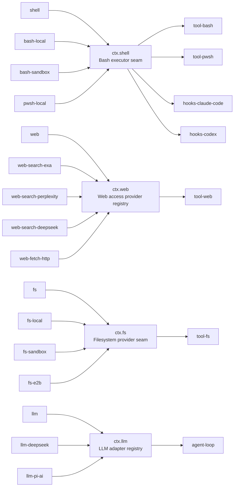

## 一个具体的痛点

harness 现在执行 bash 命令；将来它可能需要在 Landlock 沙箱里执行、在远程 E2B 容器里执行，或者在 Windows 上用 PowerShell 执行。一种朴素的设计会把「bash 执行是什么」「这个具体后端怎么跑一条命令」和「模型请求 `bash` 时看到什么」全部塞进一个包。这正是陷阱所在：把本地执行器换成沙箱化执行器,模型读到的工具 schema 也会跟着变——即便面向模型的约定其实从未改变。token 预算会漂移，KV 缓存前缀会失效,针对旧 schema 做的提示词工程也会在无声中失效。

[能力 seam 的 Agent Note](../../../.agents/notes/implemented/architecture/2026-06-13-capability-seams.md) 直接点出了背后的事实:一项能力包含三个变化速率、变化原因都不同的关注点。

- **约定**——这项能力是什么。
- **实现**——它如何运行。
- **消费方 API**——模型和其他插件面向什么编程。

把这三者拆开,各自拥有独立的包,一次 Provider 替换就会止步于 Provider 边界,不再向外扩散。

## 三个角色,精确定义

一个**能力 seam** 是恰好由三个角色协作构成的一项可替换能力:

1. **Service Definition**——拥有 `ctx.<key>` 和约定所需词汇类型的 Cordis `Service`,不多不少。Definition 可以是抽象类(如 `ShellExecutor`),也可以是具体的注册表服务(如 `WebRuntime`)——但**绝不能是裸的 TypeScript `interface`**。这一区别很关键:Cordis 的 `Service` 参与框架自身的生命周期(挂载、销毁、`inject` 门控),而一个普通接口做不到这些。
2. **Service Provider**——提供或注册 Service Definition 具体实现的插件。`dsh-bash-local` 通过真实子进程运行 bash;沙箱化、远程、平台特定的 Provider 则是实现同一 Service Definition 的兄弟包。
3. **Consumer**——模型和其他插件真正面向编程的东西:一个工具 schema、一段提示词、另一个服务内部的调用点。Consumer 通过 `ctx` 键注入服务,从不导入某个 Provider 特有的类型。

[术语表](../../../docs/glossary.md#capability-seam)给出了角色归属包的规则:当角色需要独立演进时,通常分处不同的包;但当它们确实属于同一个关注点时,一个包也可以同时承担多个角色。规范的反例是 `dsh-llm`——它把 Service Definition 和 Consumer 合并进一个包,因为它的 Consumer 就是 agent loop(智能体循环)本身,而不是一个可替换的 schema 接口;而各个适配器(`dsh-llm-deepseek`、`dsh-llm-pi-ai`)依然是独立的 Service Provider 包。不要预防性拆分:一项能力如果只有一种可设想的 Provider 和一个 Consumer,就应该保持为一个包,直到第二个 Provider 真正出现。

## 术语辨析:seam 指三者组合,而非某个接口

这一点值得专门说清楚,因为这个词很容易被误读。**「seam」这个词严格保留给完整的三角色能力——绝不指其中单独一个角色。** 把 Service Definition 所在的包本身称作「the seam」是不精确的;把某一个 Service Provider 称作「the seam」则是错误的。命名某个组成部分时,应该用它具体的角色、类、服务、约定或扩展点来称呼它——「`ShellExecutor` 这个 Service Definition」「`dsh-bash-sandbox` 这个 Provider」「`dsh-tool-bash` 这个 Consumer」——而把「seam」留给描述这三者共同构成的完整可替换单元。

角色名本身使用标题式大小写——**Service Definition**、**Service Provider**、**Consumer**——而泛指、非角色意义上使用 provider 和 consumer 时则保持小写。

## 规范范例:bash 能力

`packages/shell/` 是整个 harness 其余部分照此建造的参考模板:

| 包 | 角色 | 拥有什么 |
|---|---|---|
| [`dsh-shell`](../../../packages/shell/shell/README.md) | Service Definition | 抽象类 `ShellExecutor`、`ctx.shell`,以及词汇类型(`ShellExecRequest`、`ShellExecSpec`、`ShellRunResult`、`ShellProcess`) |
| [`dsh-bash-local`](../../../packages/shell/bash-local/README.md) | Service Provider | 通过 `ctx.subprocess` 以真实子进程运行 `bash -c <command>`;负责命令默认值、超时分类、面向模型的终端环境 |
| [`dsh-bash-sandbox`](../../../packages/shell/bash-sandbox/README.md) | Service Provider | 复用 `dsh-bash-local` 的机制,但通过 `ctx.sandbox` 约束每一次 spawn,并把拒绝结果作为结果事实报告出来 |
| [`dsh-tool-bash`](../../../packages/shell/tool-bash/README.md) | Consumer | 面向模型的 `bash` 工具 schema,以及向 `ctx.jobs` 注册后台任务 |

每个包自己的 `README.md` 都明确声明了自己的角色。`dsh-shell` 的 README 开篇就说明 `ShellExecutor`(`ctx.shell`)定义的是一个后端「做什么」,而不是「怎么做」,随后给出与上表相同的四行表格,并说明这样拆分是「为了让每个角色都能独立演进(和被替换)」。`dsh-bash-sandbox` 的 README 从 Provider 一侧陈述了同样的替换约定:它是**替代** `dsh-bash-local` 加载的,配合一个 `ctx.sandbox` Provider 和一个 `ctx.sandboxPolicy`,并且「不需要另外的工具插件」——`dsh-tool-bash` 会在注册时检测所挂载执行器的 `sandboxMode` 能力,只有在真正挂载了沙箱化后端时,才会给自己的 schema 加上升级字段。

### Service Definition 的代码形态

`ShellExecutor` 是一个继承自 Cordis `Service` 的抽象类,而不是一个接口:

```ts
// packages/shell/shell/src/index.ts:65-101
export abstract class ShellExecutor extends Service {
  constructor(ctx: Context) {
    super(ctx, 'shell')
  }

  get sandboxMode(): SandboxMode | undefined {
    return undefined
  }

  abstract resolve(request: ShellExecRequest): ShellExecSpec
  abstract run(spec: ShellExecSpec): Promise<ShellRunResult>
  abstract start(spec: ShellExecSpec): ShellProcess
}
```

`super(ctx, 'shell')` 正是声明占用 `ctx.shell` 这个 Cordis 服务的地方——加载第二个实现会抛错,这是 Cordis 对重复服务注册的标准行为。`sandboxMode` 默认返回 `undefined`:这是 Consumer 用来判断是否要展示沙箱升级相关行为的能力事实,判断过程完全不需要导入任何一行具体 Provider 的代码。

### Service Provider 的代码形态

`LocalBashExecutor` 是其中一个具体子类,它注入的是自己完成工作所需的服务(`ctx.subprocess`,一个更底层的 seam),而不是任何 shell 专属的东西:

```ts
// packages/shell/bash-local/src/index.ts:95-102
export class LocalBashExecutor extends ShellExecutor {
  static inject = ['subprocess']

  static Config: z<Config> = z.object({
    cwd: z.string(),
    timeoutMs: z.number().default(120_000),
    // ...
  })
```

`dsh-bash-sandbox` 的 `SandboxBashExecutor` 继承了 `dsh-bash-local` 的进程机制(spawn、进程组 kill、spill 文件),只额外做了一件事:在每条命令 spawn 之前,把即将执行的确切 `['bash', '-c', command]` argv 交给 `ctx.sandbox` Provider 加以约束。两个 Provider 互不导入,Consumer 也不导入它们中的任何一个。

### Consumer 的代码形态

`dsh-tool-bash` 按名字注入 `shell`——它从不导入 `LocalBashExecutor` 或 `SandboxBashExecutor`:

```ts
// packages/shell/tool-bash/src/index.ts:1-31
/**
 * Model-facing Consumer of the `ctx.shell` capability seam. ...
 */
export const name = 'tool-bash'
export const inject = ['tools', 'shell', 'systemPrompt', 'shellEnv']
```

它的模块文档注释直接写明了这一点:「面向模型的 `ctx.shell` 能力 seam 的 Consumer」。注册时,它会读取每个 `ShellExecutor` 实现都暴露的 `ctx.shell.sandboxMode` 属性,以此决定是否给自己注册在 `ctx.tools` 上的 `bash` schema 加上 `sandbox_permissions` 和 `justification` 参数。当挂载的是 `dsh-bash-local` 时,`sandboxMode` 是 `undefined`,这些参数不会出现;当换成挂载 `dsh-bash-sandbox` 时,它们才会出现。工具 schema 的形状完全取决于其下方组合了哪个 Provider——Consumer 自己的源代码在两种组合下完全相同。

## 结果:替换 Provider 就能替换产品行为,而消费方毫不知情

这正是整个模式的回报所在。一份 `cordis.yml` leaf 只需组合一个 `ctx.shell` Provider:

```yaml
# 不受限组合
- id: bash
  name: '@deepseek-ai/dsh-bash-local'
```

```yaml
# 沙箱化组合——同一个工具插件,代码零改动
- id: sandbox
  name: '@deepseek-ai/dsh-sandbox-local'
- id: sandbox-policy
  name: '@deepseek-ai/dsh-sandbox-policy'
  config:
    mode: read-only
- id: bash
  name: '@deepseek-ai/dsh-bash-sandbox'
```

`dsh-tool-bash` 不会出现在这份 diff 里。它的配置原封不动,而它的行为——暴露的工具 schema、渲染的拒绝标记——会随着下方 Provider 的变化而变化,原因是下方的 Provider 换了,不是有人改动了 Consumer。这正是 `docs/architecture.md` 那句话的具体含义:「文件系统和子进程 Provider 共享同一个执行世界,因此把它们指向一个远程沙箱会带着 Bash、PTY 和 LSP 一起移动,不需要为 Provider 单独分叉。」

## 由此衍生出的包边界规则

[`packages/README.md`](../../../packages/README.md) 把这个结果表述为整个仓库中每个扩展插件都必须遵守的硬规则:

> **扩展插件依赖 Service Definition,绝不依赖具体提供方。** `dsh-agent-loop` 可替换;UI、钩子和工具插件使用 `dsh-agent`。

这条规则的适用范围远不止 bash。`dsh-agent-loop`(目前唯一具体的循环实现)本身也是可替换的——扩展包依赖的是 `dsh-agent` 的事件与服务,而不是直接依赖 `dsh-agent-loop`。同样的规则也解释了为什么 `dsh-web` 的搜索和抓取 Provider 可以各自独立于 `dsh-tool-web` 发布,以及为什么 `dsh-fs-local` 和 `dsh-fs-sandbox` 都能实现 `ctx.fs`,而 `dsh-tool-fs` 不需要导入它们中的任何一个。

## 读图:遍览全仓库的能力 seam

`docs/capability-seams.md` 是一份**生成**产物(`pnpm run gen-doc-graphs`,在 CI 中有新鲜度检查),覆盖 harness 中每一个 `ctx.<key>` 服务,并将其分类为 `seam`(可替换、可能有多个 Provider)、`core`(单一固定所有者)或 `bundle`(一个组合点)。下面的节选是从该生成文件中截取的、忠实的子集——shell seam 加上另外三个选取的例子,用来展示这个模式的适用范围;完整关系图覆盖大约四十个服务,以上方的链接给出全文,这里不再逐一复现。



这份节选展示了该模式适用范围的四个侧面:

- **`ctx.shell`** 有三个 Service Provider(`bash-local`、`bash-sandbox`、`pwsh-local`)和四个直接 Consumer,其中包括 Claude Code 与 Codex 的钩子桥接——一个 seam 的 Consumer 并不局限于面向模型的工具。
- **`ctx.web`** 在一个 seam 之下有四个 Service Provider——两家搜索厂商、一条 DeepSeek 托管的搜索路由,以及一个 HTTP 抓取后端——都汇入同一个 Consumer 包 `dsh-tool-web`,由它负责稳定的面向模型工具名称,无论底层实际由哪家厂商响应。
- **`ctx.fs`** 印证了 `docs/architecture.md` 明确提出的「执行世界」论点:`fs-local`、`fs-sandbox`、`fs-e2b` 分别与 `bash-local`/`bash-sandbox`/`subprocess-e2b` 配对,因此一次部署对执行世界的选择会带动多个 seam 一起移动。
- **`ctx.llm`** 是术语表中提到的角色合并反例:它的 Consumer 箭头直接指向 `agent-loop`——不存在单独的 `tool-llm` 包,因为这里的 Consumer 就是循环本身,而不是一个可替换的 schema 接口。

`docs/capability-seams.md` 中完整的生成表格还进一步区分了 `seam` 行(如上面四例)、`core` 行(单一固定所有者,不预期出现其他 Provider,例如 `ctx.tools`、`ctx.sessions`)和 `bundle` 行(单一具名组合点,例如 `ctx.agentLoop`)。只有 `seam` 行才是本章所定义意义上的能力 seam;该表格的「角色」列为 harness 中的每一个服务都明确标注了这一分类。

## 为什么值得多付出这些包

拆分角色不是免费的。[Agent Note](../../../.agents/notes/implemented/architecture/2026-06-13-capability-seams.md) 直接点明了这项成本:独立的包意味着独立的 `package.json`、`tsconfig`、README 和注入接线——本可以是一个文件里的内容。而换来的回报正是这份成本的意义所在:Service Provider 和 Consumer 可以独立发布、独立演进版本,新增一个后端永远不会波及面向模型的约定。当 `dsh-bash-sandbox` 被加入时,`dsh-tool-bash` 自身的逻辑完全不需要改动——因为它从第一天起,Service Definition 里就已经内置了一个能力探测点(`ctx.shell.sandboxMode`),这是因为 Service Definition 在设计之初就考虑到了它需要服务的每一个 Consumer,而不只是当时已经存在的那一个。

这份 Agent Note 也明确点出了能力 seam **不是**什么:`@cordisjs/plugin-capability` 是一个权限/安全服务(具名权限加继承,通过 `ctx.capability.test` 针对会话检测),这是完全不同的维度,是延后的 `tools/pre-execute` deny/ask 策略工作的候选机制,而绝不是替换实现的手段。混淆「capability」这个词的这两种含义,正是这份 Agent Note 的术语小节想要防止的陷阱。

## 什么时候该动手拆出一个 seam

既然规则是「不要预防性拆分」,实际可用的判断标准是:这项能力现在,或者不久之后,是否会出现不止一个 Service Provider,或者不止一个必须彼此解耦的 Consumer?如果一项新能力目前只有一种可设想的实现、只有一个调用方,那就让 Service Definition、实现和 Consumer 使用都待在同一个包里——就像 `dsh-llm` 把 Service Definition 和 Consumer 合并在一起那样。一旦第二个 bash 后端、第二家搜索厂商,或者第二个模型提供方需要在不改变面向模型接口形状的前提下接入,那就是把 Service Definition 拆成独立包、让两种实现成为兄弟 Service Provider 的信号。

## 这个模式接下来往哪里走

接下来的几章会各取一个具体的 seam 深入展开——文件系统与 LSP、子进程与终端、沙箱、LLM seam、Web seam;更后面的章节会讲 subagent、技能、压缩和会话持久化,它们是 provider 家族尤其庞大的 seam。这份代码库里并非每个机制都是 seam,后面章节遇到不是 seam 的情况会明确说明。
