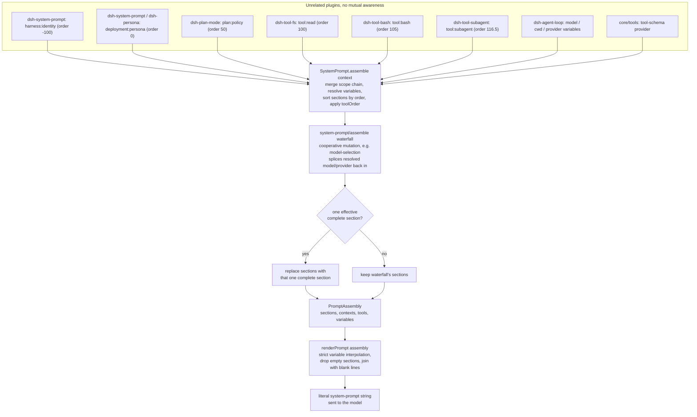

## The problem: one prompt, many owners

A DeepSeek Harness deployment mounts dozens of plugins — a bash tool, a read/write/edit tool trio, a web-fetch tool, a subagent tool, a plan-mode plugin, a goal tracker — and every one of them may need to tell the model something. The bash package needs the model to check `[exit code: N]` markers. The read tool needs the model to prefer it over `cat`. The deployment operator needs to say "you are a coding assistant" once. None of these plugins knows the others exist, none of them can see the final prompt, and none of them should have to coordinate a global string-concatenation order by hand.

`core/system-prompt` (`packages/core/system-prompt`) is the registry that resolves this without giving any single plugin authority over the whole prompt. Any plugin calls `ctx.systemPrompt.section(...)` to contribute a named, ordered fragment of prompt text; the loop calls `ctx.systemPrompt.assemble()` once per step to collect every currently-registered fragment (from every currently-mounted plugin) into one `PromptAssembly`, then `renderPrompt()` turns that into the literal string sent to the model.

## The four contribution kinds

The `SystemPrompt` service (`ctx.systemPrompt`, defined at `packages/core/system-prompt/src/index.ts:338`) exposes four registration methods. Each returns a Cordis effect disposer, so registering is just as reversible as every other extension point in the harness — a plugin that unloads (or is HMR-reloaded) automatically retracts what it contributed.

- **`section(section: PromptSection)`** (line 381) — registers `{ name, order, text, complete? }`. Sections are concatenated in ascending `order`. `text` is either a static string or a function of `AssembleContext` evaluated fresh at every assembly.
- **`context(context: PromptContext)`** (line 398) — registers ordered *dynamic* context (`{ name, order, text }`), the cache-unstable counterpart of a section. Contexts become a separate user-role runtime-context snapshot in model history rather than living inside the system prompt itself, so they can change every turn without invalidating the KV-cache prefix that covers the stable sections.
- **`tools(provider: (context) => ToolProviderResult)`** (line 430) — registers a tool-schema provider. `ToolProviderResult` is `{ schemas, knownNames? }`: `schemas` is what the model actually sees after any restriction; `knownNames` is the pre-restriction universe, needed so a `toolOrder` typo can be told apart from a tool that is deliberately hidden in one scope.
- **`variable(name, provider: (context) => string | undefined)`** (line 446) — registers a named value referenced from section/context text as `{{name}}`. Names must match `[a-z][a-z0-9_]*`.

All four registrations land in a `PromptLayer` (line 304) — either the single global layer, or a per-agent scoped layer keyed by the calling context's Cordis scope. A scoped registration shadows a same-named global one for that agent alone; duplicate names within one layer throw immediately, and so does a non-finite `order`.

## Order bands: a convention, not an enum

`PromptSection.order` is a plain `number`; nothing in the type system stops two plugins from picking the same value. What keeps assembly deterministic in practice is a documented convention of numeric bands, visible directly in the constants and call sites:

| Order | Owner | Example |
|---|---|---|
| `-100` | `dsh-system-prompt` itself | `harness:identity` — the fixed opener `You are an AI agent powered by DeepSeek Harness.` (lines 357-363) |
| `-99` | `app-boot`, when the self-modification demo mounts it | `harness:source`, naming the on-disk harness checkout (`packages/boot/app-boot/src/index.ts:821`) |
| `0` | `dsh-system-prompt` (`config.persona`) or a shadowing `dsh-persona`/subagent row | `deployment:persona`, exported as `PERSONA_SECTION`/`PERSONA_ORDER` (lines 128-131) |
| `50` | `dsh-plan-mode` | `plan:policy`, rendered only while a plan is pending/active (`packages/plan/plan-mode/src/index.ts:225`) |
| `99` | `core/tools` (code-mode) | `tools:code-only`, stated *before* the per-tool guidance it qualifies |
| `100-199` | every tool package | `tool:read` (100), `tool:write` (101), `tool:edit` (102), `tool:glob` (103), `tool:grep` (104), `tool:bash` (105), `tool:pty`/`tool:jobs` (106), `tool:web_search` (110), `tool:web_fetch` (111), `tool:lsp` (112), `tool:session-query` (113), `tool:goal` (114), `tool:cordis`/`tool:workflow` (115), `tool:ralph` (116), `tool:subagent*` (116.5), `tool:subagent_report` (117); `tools:sdk` (150) for a code-mode generated SDK summary |

Sections sharing an `order` value tie-break by registration order — a plugin-load artifact, which is exactly why the convention reserves a distinct integer per concern instead of relying on that tie-break. `toolOrder`, by contrast, is *canonicalized*: it is applied to the collected tool list before the waterfall runs, so its determinism does not depend on load order at all (see below).

Each order value is a plain module-level constant (`COLLAPSE_SECTION_ORDER = 99`, `SDK_SECTION_ORDER = 150` in `core/tools`; `SUBAGENT_SECTION_ORDER = 116.5`, `REPORT_SECTION_ORDER = 117` in the subagent tool packages) — no shared registry hands them out, so a new tool package picks an unused value in the 100-199 band by inspecting existing call sites, the same way this table was built.

## Text is written from the model's perspective, and split by what kind of fact it states

The Agent Note *Prompt variables and tool-guidance ownership* states the rule behind this whole design: **every fact in the prompt has exactly one owner.**

- A **per-tool usage fact** ("what does this tool do, when do I call it") lives in the tool's `description` field on its schema — not in a section.
- A **cross-call habit** a description cannot carry (e.g. "check the `[exit code: N]` marker on every bash result") is a `tool:*` section, owned by that tool's package. `packages/fs/tool-fs/src/read.ts:70` and `packages/shell/tool-bash/src/index.ts:236` are two concrete examples:

```ts
// packages/fs/tool-fs/src/read.ts:70
ctx.systemPrompt.section({
  name: 'tool:read',
  order: 100,
  text: 'Use the read tool — not shell commands like cat — to inspect text files. Results include line numbers. Use offset and limit to continue reading large files.',
})
```

```ts
// packages/shell/tool-bash/src/index.ts:236
ctx.systemPrompt.section({
  name: 'tool:bash',
  order: 105,
  text: 'Check the [exit code: N] marker on every bash result; investigate failures before moving on.',
})
```

- A **runtime fact the harness already knows** (the model name, the working directory) is a *variable*, not hand-typed prose. `dsh-agent-loop` registers three of them as pure projections of the current agent, at `packages/core/agent-loop/src/index.ts:351-353`:

```ts
ctx.systemPrompt.variable('provider', context => context.agent?.options.provider)
ctx.systemPrompt.variable('model', context => context.agent?.options.model)
ctx.systemPrompt.variable('cwd', context => context.agent?.session.header.cwd)
```

A deployment's persona then *references* the fact instead of restating it:

```yaml
# examples/acp-agent/cordis.yml:63-66
persona: |
  You are a coding assistant powered by the {{model}} model. Your working directory is {{cwd}}. Your bash tool runs under a file sandbox — a `[sandbox: file access denied …]` result is policy, not a command bug.

  Verify your work by running the code or tests. Keep answers brief and factual.
```

Before this decision shipped, the model name was hand-typed in every deployment's persona string and silently drifted from the real `model:` config key the moment someone edited one without the other. Making it a variable means there is exactly one place the fact is asserted (`options.model`), and every consumer of that fact references it instead of copying it.

- **Deployment role and behavior** ("you are a coding assistant… keep answers brief") is the persona, and only the persona — nothing else states role/behavior facts.

## `assemble()`: how the pieces become one deterministic output

`SystemPrompt.assemble(context: AssembleContext = {})` (lines 457-542) is called once per step by the agent loop, with `context.scope` set to the current agent's scope. It performs, in order:

1. **Resolve variables**, global layer first, then each layer in the scope chain (farthest ancestor first) so the *nearest* scope wins a name collision — exactly the "scoped shadows global" rule applied consistently across sections, contexts, and variables.
2. **Merge sections and contexts** across the scope chain (`this.layers.merge(scope, ...)`), so a scoped `deployment:persona` at order 0 replaces the global one wholesale rather than appending to it.
3. **Collect tool schemas** from every registered provider (global + scope chain), cloning `parameters` with `structuredClone` so a provider cannot be affected by downstream mutation of its own output, and building the `knownNames` universe used for `toolOrder` validation.
4. **Sort sections by `order`** (stable sort — this is where the tie-break-by-registration-order behavior comes from) and detect **more than one effective `complete` section**, which throws immediately — a `complete: true` section is a claim to be the *entire* prompt, so two of them contradict each other by construction.
5. **Apply `toolOrder`** via `orderTools()` (lines 164-178): if the deployment configured an explicit tool order, listed tools take their listed position and everything else lands, in lexicographic order, at the single required `'<unlisted-tools>'` rest marker (`TOOL_ORDER_REST`). If a provider's schema is literally named `<unlisted-tools>`, or the configured order lists an unknown tool name, assembly rejects rather than silently guessing.
6. **Run the `system-prompt/assemble` waterfall** (event declared at line 31) over the assembled-but-unrendered `PromptAssembly`. This is the cooperative extension point: a listener receives the mutable assembly and a `next()` continuation, and its returned value becomes authoritative. `core/agent`'s model-selection logic is one concrete listener — it lets `next()` run first, then splices the resolved `provider`/`model` back into `assembly.variables` so a late-bound model choice is still visible to `{{model}}` at render time, honoring the same "the plugin that owns a late-bound fact states it on the waterfall" rule from the Agent Note.
7. **Restore the complete section**, if one was effective: after the waterfall runs (so tools/contexts/variables are still fully resolved), the *original* complete section is spliced back in as the sole section — a waterfall listener cannot add to or replace a scope's prompt once a `complete` section governs it.



## `renderPrompt`: strict interpolation, fail loud

`renderPrompt(assembly)` (lines 212-217) is the single path that turns a `PromptAssembly` into a literal string: it maps every section through `interpolate()`, drops any section that rendered to an empty string (this is how a persona-less deployment or a plan-mode section with no pending plan simply disappears from the prompt), and joins the rest with blank lines.

`interpolate()` (lines 258-295) scans for `{{...}}` groups and is deliberately strict in four ways, each with an explicit failure:

- An unbalanced open (`{{` followed eventually by `}}` but not forming a clean simple group, e.g. `{{{model}}}`) throws — "malformed prompt variable reference."
- A syntactically valid `{{name}}` whose `name` is not `Object.hasOwn` on the resolved `variables` map throws as "unknown prompt variable" — this specifically defeats prototype-pollution-style lookups like `{{constructor}}`, since a plain `in` or bracket check would resolve those through `Object.prototype`.
- A registered variable whose provider returned `undefined` for this assembly throws as "has no value for this assembly" — for example, a persona that references `{{cwd}}` on a config-pre-created stdio agent with no `cwd` fails that turn loudly rather than silently rendering nothing.
- A lone `{{` with **no** later `}}` anywhere in the text passes through as literal prose — the one case where there is genuinely no ambiguity about authorial intent.

There is currently no escape syntax for a literal `{{...}}` in prompt prose; the package defers it until an actual prompt needs one.

## Two failure classes: load-time vs. assembly-time

`toolOrder` misconfiguration illustrates the harness's two-tier "fail loud" discipline. **Shape** violations — a duplicate name in the list, or a missing `<unlisted-tools>` rest entry — are checked once, synchronously, in `validateToolOrder()` at plugin construction (config-load time). **Content** violations — a listed tool name that no provider ever registers — can only be known once providers have had a chance to register, so they surface at the *first* `assemble()` call instead: under the shipped agent loop that means the very first turn fails before any model request is sent, which is still well before the model could act on a broken tool list.

## Tool schemas are part of the assembly, not a side channel

`PromptAssembly.tools: ToolSchema[]` sits next to `sections`, `contexts`, and `variables` in the same structure, even though the wire protocol to the model transmits tool schemas as a separate JSON field from the system-prompt string. The rationale, spelled out in the package README, is that "what the model is told it can do" is one coherent fact regardless of how the wire format happens to split it — a tool-schema-filtering waterfall listener and a section-filtering one are solving variants of the same problem, and keeping both under one `PromptAssembly` means a single waterfall pass can see and reconcile both.

`core/tools` registers itself as a tool-schema provider exactly once, in its own constructor (`ctx.systemPrompt.tools(context => this.wireSchemas(context.scope))`), and — in code-mode deployments only — additionally registers two ordinary sections (`tools:code-only` at order 99, `tools:sdk` at order 150) that state, in prose, the same restriction its `wireSchemas()` enforces in the schema list: only `run_code` is callable natively. The comment on that code is explicit about why the section is needed at all: without it, the model reads a full catalog of individually-described tools and no statement that only one of them may actually be called, calls one directly, gets `UNKNOWN_TOOL`, and reasonably concludes the deployment is broken.

## Composition survives a replacement loop

Both the harness-identity opener and the persona default live in `dsh-system-prompt` itself, not in `dsh-agent-loop` — so a deployment that swaps out the agent loop for something else keeps both. The loop's only prompt-shaped contribution is the three variables (`provider`, `model`, `cwd`), because those are facts about *the agents this specific loop drives*; a replacement loop supplies its own. This is the same "plugins, not loop changes" principle the repository conventions state generally: new prompt content is a new section/variable registration on an existing extension point, never a code change to the loop's request-building path.

## Reading a recorded example

`examples/acp-agent` records the exact assembled prompt as a snapshot fixture for several turns. `tests/snapshots/text-turn/system-prompt.expected.md` shows the full concatenation for a plain text turn: identity (order -100), persona with `{{model}}`/`{{cwd}}` interpolated (order 0), then one section per mounted tool package in ascending order — read, write, edit, bash, jobs, goal, workflow, ralph, subagent — with blank lines between them and nothing at all where a tool package registered no section. This is the literal string a plugin author is changing when they add, remove, or reword a `ctx.systemPrompt.section()` call.

## Known limits

- There is no end-user prompt-editing API: deployment-authored text is config/composition only (the `persona` config key, or a scoped section registered by a preset), never an interactive edit surface.
- `PromptSection.order` values sharing a band still tie-break by registration order — this is a plugin-load artifact the convention works around by reserving distinct integers, not something the type system enforces.
- `toolOrder` content errors surface at first assembly, not at boot, because the tool-provider universe is unknown until plugins have registered.
