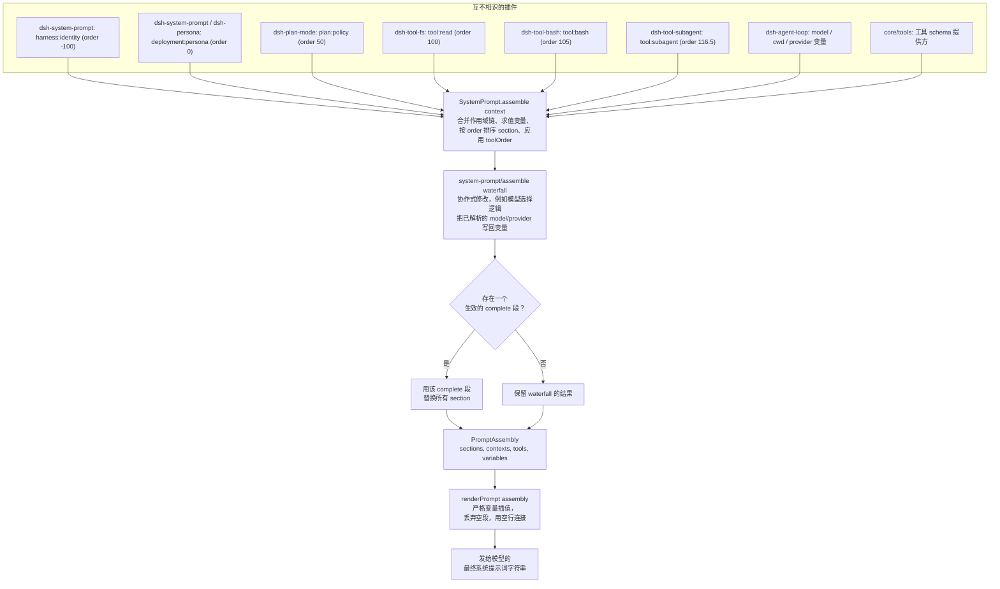

## 问题：一份提示词，多个归属方

一个 DeepSeek Harness 部署会挂载几十个插件——bash 工具、read/write/edit 三件套、web-fetch 工具、subagent 工具、plan-mode 插件、goal 追踪器——它们中的每一个都可能需要向模型说点什么。bash 包需要模型检查 `[exit code: N]` 标记；read 工具需要模型优先使用它而不是 `cat`；部署方需要说一次「你是一个编码助手」。这些插件互不知道对方的存在，谁也看不到最终的完整提示词，也不该由它们手工协调一个全局的字符串拼接顺序。

`core/system-prompt`（`packages/core/system-prompt`）就是解决这个问题的注册表，且不会把整份提示词的控制权交给任何单一插件。任何插件都可以调用 `ctx.systemPrompt.section(...)` 贡献一个具名、有序的提示词片段；循环在每个步骤调用一次 `ctx.systemPrompt.assemble()`，把当前所有已挂载插件贡献的片段收集进一个 `PromptAssembly`，再由 `renderPrompt()` 把它变成发给模型的那个具体字符串。

## 四种贡献方式

`SystemPrompt` 服务（`ctx.systemPrompt`，定义于 `packages/core/system-prompt/src/index.ts:338`）暴露四个注册方法。每个方法都返回一个 Cordis effect 的 disposer（释放函数），所以注册和 harness 里其他任何扩展点一样是可逆的——插件卸载（或被 HMR 热重载）时，它贡献的内容会自动撤回。

- **`section(section: PromptSection)`**（第 381 行）：注册 `{ name, order, text, complete? }`。各段按 `order` 升序拼接。`text` 既可以是静态字符串，也可以是接受 `AssembleContext` 的函数，每次组装都会重新求值。
- **`context(context: PromptContext)`**（第 398 行）：注册有序的*动态*上下文（`{ name, order, text }`），是 section 的「缓存不稳定」对应物。上下文会成为模型历史中独立的 user 角色 runtime-context 快照，而不是留在系统提示词内部，因此它可以逐轮变化而不会使覆盖稳定 section 的 KV-cache 前缀失效。
- **`tools(provider: (context) => ToolProviderResult)`**（第 430 行）：注册一个工具 schema 提供方。`ToolProviderResult` 是 `{ schemas, knownNames? }`：`schemas` 是限制后模型实际看到的集合；`knownNames` 是限制前的全集，用于把 `toolOrder` 的拼写错误和某个作用域里故意隐藏的工具区分开。
- **`variable(name, provider: (context) => string | undefined)`**（第 446 行）：注册一个具名值，在 section/context 文本中以 `{{name}}` 引用。名称必须匹配 `[a-z][a-z0-9_]*`。

这四种注册都落在一个 `PromptLayer`（第 304 行）里——要么是唯一的全局层，要么是按调用上下文的 Cordis 作用域标识的 per-agent 作用域层。带作用域的注册只为该 agent 遮蔽同名的全局项；同一层内的重复名称会立即抛出，非有限的 `order` 也一样。

## Order 区间：一种约定，而非枚举

`PromptSection.order` 就是普通的 `number` 类型；类型系统并不阻止两个插件选择相同的值。真正让组装在实践中保持确定性的，是一套记录在案的数值区间约定，直接体现在常量和调用点上：

| Order | 归属方 | 示例 |
|---|---|---|
| `-100` | `dsh-system-prompt` 自身 | `harness:identity`——固定开场白 `You are an AI agent powered by DeepSeek Harness.`（第 357-363 行） |
| `-99` | `app-boot`（自我修改演示挂载时） | `harness:source`，指明磁盘上的 harness 源码检出位置（`packages/boot/app-boot/src/index.ts:821`） |
| `0` | `dsh-system-prompt`（`config.persona`）或遮蔽它的 `dsh-persona`/subagent 行 | `deployment:persona`，以 `PERSONA_SECTION`/`PERSONA_ORDER` 导出（第 128-131 行） |
| `50` | `dsh-plan-mode` | `plan:policy`，仅在有待处理/活跃计划时渲染（`packages/plan/plan-mode/src/index.ts:225`） |
| `99` | `core/tools`（code mode） | `tools:code-only`，陈述在它所限定的逐工具指导*之前* |
| `100-199` | 每个工具包 | `tool:read`（100）、`tool:write`（101）、`tool:edit`（102）、`tool:glob`（103）、`tool:grep`（104）、`tool:bash`（105）、`tool:pty`/`tool:jobs`（106）、`tool:web_search`（110）、`tool:web_fetch`（111）、`tool:lsp`（112）、`tool:session-query`（113）、`tool:goal`（114）、`tool:cordis`/`tool:workflow`（115）、`tool:ralph`（116）、`tool:subagent*`（116.5）、`tool:subagent_report`（117）；`tools:sdk`（150）用于 code-mode 生成的 SDK 摘要 |

共享同一个 `order` 值的段按注册顺序打破平局——这是插件加载顺序的产物，正因如此，约定才要求每个关注点保留一个独立的整数，而不是依赖这个平局规则。相比之下，`toolOrder` 是*规范化*的：它在 waterfall 运行之前就应用到已收集的工具列表上，因此其确定性完全不依赖加载顺序（见下文）。

每个 order 值都是普通的模块级常量（`core/tools` 中的 `COLLAPSE_SECTION_ORDER = 99`、`SDK_SECTION_ORDER = 150`；subagent 工具包中的 `SUBAGENT_SECTION_ORDER = 116.5`、`REPORT_SECTION_ORDER = 117`）——没有共享注册表来分配它们，新工具包通过查看现有调用点、在 100-199 区间内挑一个未占用的值，本表格本身就是这样整理出来的。

## 提示词文本从模型视角撰写，并按事实类型划分归属

Agent Note《提示词变量与工具指导归属》陈述了这整套设计背后的原则：**提示词中的每一个事实都恰好有一个归属方。**

- **单个工具的使用事实**（这个工具是做什么的、什么时候该调用它）放在该工具 schema 的 `description` 字段中——不放在 section 里。
- **description 无法承载的跨调用习惯**（比如「检查每个 bash 结果上的 `[exit code: N]` 标记」）是一个 `tool:*` section，由该工具所在的包拥有。`packages/fs/tool-fs/src/read.ts:70` 和 `packages/shell/tool-bash/src/index.ts:236` 是两个具体例子：

```ts
// packages/fs/tool-fs/src/read.ts:70
ctx.systemPrompt.section({
  name: 'tool:read',
  order: 100,
  text: 'Use the read tool — not shell commands like cat — to inspect text files. Results include line numbers. Use offset and limit to continue reading large files.',
})
```

```ts
// packages/shell/tool-bash/src/index.ts:236
ctx.systemPrompt.section({
  name: 'tool:bash',
  order: 105,
  text: 'Check the [exit code: N] marker on every bash result; investigate failures before moving on.',
})
```

- **harness 已经知道的运行时事实**（模型名称、工作目录）是一个*变量*，而不是手写的行文。`dsh-agent-loop` 在 `packages/core/agent-loop/src/index.ts:351-353` 注册了三个这样的变量，均为当前 agent 的纯投影：

```ts
ctx.systemPrompt.variable('provider', context => context.agent?.options.provider)
ctx.systemPrompt.variable('model', context => context.agent?.options.model)
ctx.systemPrompt.variable('cwd', context => context.agent?.session.header.cwd)
```

部署方的 persona 随后*引用*这个事实，而不是重述它：

```yaml
# examples/acp-agent/cordis.yml:63-66
persona: |
  You are a coding assistant powered by the {{model}} model. Your working directory is {{cwd}}. Your bash tool runs under a file sandbox — a `[sandbox: file access denied …]` result is policy, not a command bug.

  Verify your work by running the code or tests. Keep answers brief and factual.
```

在这个决策落地之前，模型名称是在每个部署的 persona 字符串里手写的，一旦有人只改了 `model:` 配置键而没有同步改 persona，两者就会静默漂移。把它变成变量之后，这个事实只有一个声明处（`options.model`），该事实的每个消费者都引用它而不是复制它。

- **部署角色与行为**（「你是一个编码助手……回答简洁扼要」）只属于 persona——除此之外没有任何地方可以声明角色/行为事实。

## `assemble()`：片段如何变成一份确定性的输出

`SystemPrompt.assemble(context: AssembleContext = {})`（第 457-542 行）由 agent loop 在每个步骤调用一次，`context.scope` 设为当前 agent 的作用域。它依次执行：

1. **求值变量**：先是全局层，然后按作用域链依次求值（从最远的祖先开始），使*最近*的作用域在名称冲突时获胜——这与「作用域项遮蔽全局项」的规则在 section、context、variable 三者上保持一致。
2. **合并各作用域链上的 section 和 context**（`this.layers.merge(scope, ...)`），因此作用域内 order 为 0 的 `deployment:persona` 会整体替换掉全局的那个，而不是追加在它后面。
3. **收集工具 schema**：来自全局及作用域链上每一个已注册的提供方，用 `structuredClone` 克隆 `parameters`，使某个提供方不会受到下游对其自身输出的修改影响，同时构建供 `toolOrder` 校验使用的 `knownNames` 全集。
4. **按 `order` 排序各 section**（稳定排序——这正是「按注册顺序打破平局」这一行为的来源），并检测**是否存在多个生效的 `complete` 段**，若存在则立即抛出——`complete: true` 段是在声称自己就是*整份*提示词，两个这样的声明天然自相矛盾。
5. **应用 `toolOrder`**，通过 `orderTools()`（第 164-178 行）：如果部署配置了显式工具顺序，已列工具按列表位置排列，其余的按字典序统一插入唯一必须存在的 `'<unlisted-tools>'` 其余项标记（`TOOL_ORDER_REST`）处。如果某个提供方的 schema 恰好名为 `<unlisted-tools>`，或配置的顺序列出了未知的工具名，组装会直接拒绝，而不是悄悄猜测。
6. **运行 `system-prompt/assemble` waterfall**（事件声明在第 31 行），作用于尚未渲染的 `PromptAssembly`。这是协作式扩展点：监听器接收可变的 assembly 和一个 `next()` 续延，其返回值即为最终结果。`core/agent` 的模型选择逻辑就是一个具体的监听器——它先让 `next()` 运行，然后把已解析出的 `provider`/`model` 重新写回 `assembly.variables`，这样一次延迟绑定的模型选择在渲染时依然能被 `{{model}}` 看到，遵循 Agent Note 中「拥有延迟绑定事实的插件在 waterfall 上声明它」这条规则。
7. **恢复 complete 段**（如果有一个生效）：waterfall 运行之后（此时工具/上下文/变量仍然完全已解析），*原始*的 complete 段会被重新拼回作为唯一的 section——一旦某个作用域被 complete 段约束，waterfall 监听器就无法再向该作用域的提示词添加或替换内容。



## `renderPrompt`：严格插值，明确失败

`renderPrompt(assembly)`（第 212-217 行）是把 `PromptAssembly` 变成字面字符串的唯一路径：它把每个 section 都经过 `interpolate()`，丢弃任何渲染为空字符串的 section（这就是无 persona 的部署或没有待处理计划的 plan-mode section 会从提示词中直接消失的原因），再用空行把剩下的连接起来。

`interpolate()`（第 258-295 行）扫描 `{{...}}` 组，在四个方面刻意保持严格，每一种都有明确的失败：

- 一个不平衡的开括号（`{{` 之后确实出现了 `}}`，但没有形成一个规整的简单组，比如 `{{{model}}}`）会抛出「格式错误的提示词变量引用」。
- 一个语法上合法的 `{{name}}`，但 `name` 在已解析的 `variables` 映射上不是 `Object.hasOwn` 的自有属性，会抛出「未知的提示词变量」——这专门用来抵御类似 `{{constructor}}` 这种通过原型链的查找，因为普通的 `in` 或方括号访问会解析到 `Object.prototype` 上。
- 一个已注册的变量，其提供方在本次组装中返回了 `undefined`，会抛出「本次组装没有值」——例如一个引用 `{{cwd}}` 的 persona，用在没有 cwd 的配置预创建 stdio agent 上，会让该轮次响亮地失败，而不是悄悄渲染成空。
- 一个孤立的 `{{`，其后文任何位置都**没有** `}}`，会按字面量原样通过——这是唯一一种确实不存在撰写意图歧义的情况。

目前没有在提示词行文中表示字面 `{{...}}` 的转义语法；这个包把它推迟到真正有提示词需要时再实现。

## 两类失败：加载时 vs. 组装时

`toolOrder` 的配置错误处理体现了 harness「明确失败」的两级纪律。**形状**违规——列表中的重复名称，或缺少 `<unlisted-tools>` 其余项——会在插件构造时（配置加载时）由 `validateToolOrder()` 同步检查一次。**内容**违规——列出了一个没有任何提供方注册过的工具名——只有等提供方都有机会注册之后才能得知，因此只会在*第一次* `assemble()` 调用时才浮现：在随附循环下，这意味着第一个轮次会在任何模型请求发出之前就失败，这仍然远早于模型能对一个错误的工具列表采取任何行动。

## 工具 schema 是组装结果的一部分，而不是旁路通道

`PromptAssembly.tools: ToolSchema[]` 和 `sections`、`contexts`、`variables` 并列存在于同一个结构体中，尽管发往模型的 wire 协议把工具 schema 作为独立于系统提示词字符串的 JSON 字段传输。包 README 中给出的理由是：「模型被告知自己能做什么」是一个连贯的整体事实，无论 wire 格式恰好如何拆分它——一个过滤工具 schema 的 waterfall 监听器和一个过滤 section 的监听器，本质上是在解决同一类问题的不同变体，把两者放在同一个 `PromptAssembly` 下，意味着一次 waterfall 遍历就能同时看到并协调两者。

`core/tools` 在自己的构造函数中恰好注册一次工具 schema 提供方（`ctx.systemPrompt.tools(context => this.wireSchemas(context.scope))`），并且——仅在 code-mode 部署下——额外注册两个普通 section（order 99 的 `tools:code-only`，order 150 的 `tools:sdk`），用行文陈述与 `wireSchemas()` 在 schema 列表中强制执行的同一条限制：原生只能调用 `run_code`。这段代码上的注释明确解释了为什么需要这个 section：如果没有它，模型会读到一份逐个描述的完整工具目录，却没有任何声明说明实际上只有一个工具可以被调用，于是它直接原生调用某个工具，收到 `UNKNOWN_TOOL`，进而合理地认定这个部署是坏的。

## 组合关系在替换循环时依然存活

harness 身份开场白和 persona 默认值都归属于 `dsh-system-prompt` 自身，而不是 `dsh-agent-loop`——因此一个把 agent loop 换成别的实现的部署，这两者都会保留下来。循环对提示词唯一的贡献就是那三个变量（`provider`、`model`、`cwd`），因为它们是关于*这个具体循环所驱动的 agent* 的事实；一个替换循环会提供自己的变量。这正是仓库约定中「用插件，不改循环」原则的具体体现：新的提示词内容是在既有扩展点上新增一次 section/variable 注册，而绝不是修改循环的请求构建路径。

## 阅读一份录制样例

`examples/acp-agent` 把组装后的完整提示词录制成快照 fixture，覆盖多个轮次。`tests/snapshots/text-turn/system-prompt.expected.md` 展示了一个纯文本轮次的完整拼接：identity（order -100）、插值了 `{{model}}`/`{{cwd}}` 的 persona（order 0）、然后是按升序排列的、每个已挂载工具包各自的一个 section——read、write、edit、bash、jobs、goal、workflow、ralph、subagent——之间用空行分隔，某个工具包没有注册 section 的地方则完全不出现任何内容。这正是插件作者在增加、删除或改写一次 `ctx.systemPrompt.section()` 调用时所改动的那个字面字符串。

## 已知限制

- 不存在终端用户的提示词编辑 API：部署方撰写的文本只来自配置/组合（`persona` 配置键，或由某个 preset 注册的作用域 section），绝不是一个交互式编辑界面。
- 共享同一区间的 `PromptSection.order` 值仍然按注册顺序打破平局——这是插件加载顺序的产物，约定通过保留独立整数来规避它，而不是类型系统强制的结果。
- `toolOrder` 的内容错误在首次组装时才会浮现，而不是在启动时，因为工具提供方的全集要等插件都注册完才能知道。
