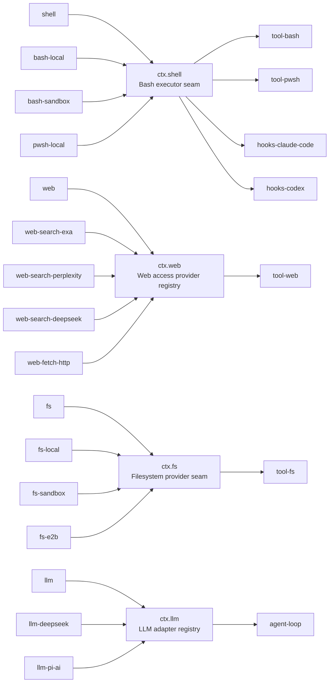

## The problem a seam solves

The harness runs bash commands today. Tomorrow it may run them inside a Landlock sandbox, inside a remote E2B container, or under PowerShell on Windows. A naive design bundles "what bash execution is," "how this particular backend runs a command," and "what the model sees when it asks for `bash`" into one package. That bundling is the trap: swap a local executor for a sandboxed one, and the tool schema the model reads changes too — even though the model-facing contract never actually changed. Token budgets shift, KV-cache prefixes invalidate, and prompt-engineering work done against the old schema silently rots.

The [capability seams Agent Note](../../../.agents/notes/implemented/architecture/2026-06-13-capability-seams.md) names the underlying fact directly: a capability has three concerns that change at different rates and for different reasons.

- The **contract** — what the capability is.
- The **implementation** — how it runs.
- The **consumer API** — what the model and other plugins program against.

Separate these into three roles, own each in its own package, and a provider swap stops at the provider boundary.

## The three roles, precisely

A **capability seam** is one swappable capability made of exactly three roles working together:

1. **Service Definition** — the Cordis `Service` that owns `ctx.<key>` and the vocabulary types the contract needs, and nothing else. A definition may be an abstract class (`ShellExecutor`) or a concrete registry service (`WebRuntime`) — it is **never a bare TypeScript `interface`**. This distinction matters because a Cordis `Service` participates in the framework's own lifecycle (mounting, disposal, `inject` gating); a plain interface cannot.
2. **Service Provider** — a plugin that supplies or registers a concrete implementation of the Service Definition. `dsh-bash-local` runs bash through real subprocesses; sandboxed, remote, or platform-specific providers are sibling packages implementing the same Service Definition.
3. **Consumer** — what the model and other plugins actually program against: a tool schema, a prompt section, another service's internals. A Consumer injects the service by its `ctx` key and never imports a provider-specific type.

The [glossary](../../../docs/glossary.md#capability-seam) states the rule for role placement: roles normally occupy separate packages when they evolve independently, but a package may own multiple roles when they are genuinely one concern. The canonical counter-example is `dsh-llm`, which folds Service Definition and Consumer into one package because its Consumer is the agent loop itself — not a swappable schema surface — while adapters (`dsh-llm-deepseek`, `dsh-llm-pi-ai`) remain separate Service Provider packages. Don't split preemptively: a capability with one conceivable provider and one Consumer stays one package until a second provider actually appears.

## Terminology: "seam" names the trio, not the interface

This is worth stating precisely because the word invites a common misreading. **"Seam" is reserved for the complete three-role capability — never for one role alone.** Calling the Service Definition package itself "the seam" is imprecise; calling one Service Provider "the seam" is wrong. When naming a constituent, name it by its concrete role, class, service, contract, or extension point — "the `ShellExecutor` Service Definition," "the `dsh-bash-sandbox` provider," "the `dsh-tool-bash` Consumer" — and reserve "seam" for describing the whole swappable unit these three form together.

The role names themselves use title case — **Service Definition**, **Service Provider**, **Consumer** — while generic, non-role uses of "provider" and "consumer" stay lowercase.

## The canonical worked example: the bash capability

`packages/shell/` is the reference template the rest of the harness is built to match:

| Package | Role | What it owns |
|---|---|---|
| [`dsh-shell`](../../../packages/shell/shell/README.md) | Service Definition | The abstract `ShellExecutor` class, `ctx.shell`, and the vocabulary types (`ShellExecRequest`, `ShellExecSpec`, `ShellRunResult`, `ShellProcess`) |
| [`dsh-bash-local`](../../../packages/shell/bash-local/README.md) | Service Provider | Runs `bash -c <command>` as a real subprocess through `ctx.subprocess`; owns command defaulting, timeout classification, the model-friendly terminal environment |
| [`dsh-bash-sandbox`](../../../packages/shell/bash-sandbox/README.md) | Service Provider | Reuses `dsh-bash-local`'s mechanics but confines every spawn through `ctx.sandbox`, reporting denials as result facts |
| [`dsh-tool-bash`](../../../packages/shell/tool-bash/README.md) | Consumer | The model-facing `bash` tool schema, background-job registration into `ctx.jobs` |

Each package's own `README.md` states its role explicitly. `dsh-shell`'s README opens by describing what `ShellExecutor` (`ctx.shell`) defines — WHAT a backend does, not HOW — and then lays out the same four-row table above, framed as "so each role can evolve (and be swapped) independently." `dsh-bash-sandbox`'s README states the swap contract from the provider's own side: it is loaded **instead of** `dsh-bash-local`, together with a `ctx.sandbox` provider and a `ctx.sandboxPolicy`, and "no alternate tool plugin is needed" — `dsh-tool-bash` detects the mounted executor's `sandboxMode` capability at registration time and adds escalation fields to its own schema only when a sandboxing backend is actually present.

### The Service Definition in code

`ShellExecutor` is an abstract class extending Cordis `Service`, not an interface:

```ts
// packages/shell/shell/src/index.ts:65-101
export abstract class ShellExecutor extends Service {
  constructor(ctx: Context) {
    super(ctx, 'shell')
  }

  get sandboxMode(): SandboxMode | undefined {
    return undefined
  }

  abstract resolve(request: ShellExecRequest): ShellExecSpec
  abstract run(spec: ShellExecSpec): Promise<ShellRunResult>
  abstract start(spec: ShellExecSpec): ShellProcess
}
```

`super(ctx, 'shell')` is what claims `ctx.shell` as a Cordis service — loading a second implementation throws, because two providers of the same seam is Cordis's standard duplicate-service failure. `sandboxMode` returns `undefined` by default: it is the capability fact a Consumer reads to decide whether to advertise sandbox-escalation behavior at all, without importing a single line from any concrete provider.

### The Service Provider in code

`LocalBashExecutor` is one concrete subclass, injecting the service it needs to do its own job (`ctx.subprocess`, a lower-level seam) rather than reaching for anything shell-specific:

```ts
// packages/shell/bash-local/src/index.ts:95-102
export class LocalBashExecutor extends ShellExecutor {
  static inject = ['subprocess']

  static Config: z<Config> = z.object({
    cwd: z.string(),
    timeoutMs: z.number().default(120_000),
    // ...
  })
```

`dsh-bash-sandbox`'s `SandboxBashExecutor` inherits `dsh-bash-local`'s process mechanics (spawn, process-group kill, spill files) and adds exactly one thing: every command is confined by handing a `ctx.sandbox` provider the exact `['bash', '-c', command]` argv before it spawns. Neither provider imports the other, and neither is imported by the Consumer.

### The Consumer in code

`dsh-tool-bash` injects `shell` by name — it never imports `LocalBashExecutor` or `SandboxBashExecutor`:

```ts
// packages/shell/tool-bash/src/index.ts:1-31
/**
 * Model-facing Consumer of the `ctx.shell` capability seam. ...
 */
export const name = 'tool-bash'
export const inject = ['tools', 'shell', 'systemPrompt', 'shellEnv']
```

Its module doc comment says it outright: "Model-facing Consumer of the `ctx.shell` capability seam." At registration time it reads `ctx.shell.sandboxMode` — a property every `ShellExecutor` implementation exposes — to decide whether to add `sandbox_permissions` and `justification` parameters to the `bash` schema it registers on `ctx.tools`. When `dsh-bash-local` is mounted, `sandboxMode` is `undefined` and those parameters never appear. When `dsh-bash-sandbox` is mounted instead, they do. The tool schema's shape is a pure function of which provider composed underneath it — the Consumer's source code is identical in both compositions.

## The result: swapping a provider swaps the product without touching consumers

This is the entire payoff. A `cordis.yml` leaf composes one `ctx.shell` provider:

```yaml
# unconfined composition
- id: bash
  name: '@deepseek-ai/dsh-bash-local'
```

```yaml
# sandboxed composition — same tool plugin, no code changes
- id: sandbox
  name: '@deepseek-ai/dsh-sandbox-local'
- id: sandbox-policy
  name: '@deepseek-ai/dsh-sandbox-policy'
  config:
    mode: read-only
- id: bash
  name: '@deepseek-ai/dsh-bash-sandbox'
```

`dsh-tool-bash` does not appear in the diff. It stays exactly as configured, and its behavior — the tool schema it exposes, the denial markers it renders — changes because the provider underneath it changed, not because anyone edited the Consumer. That is the concrete meaning of `docs/architecture.md`'s framing: "Filesystem and subprocess providers share one execution world, so pointing them at a remote sandbox moves Bash, PTY, and LSP with them, with no provider forks."

## The package-boundary rule this enables

[`packages/README.md`](../../../packages/README.md) states the consequence as a hard rule for every extension plugin in the repository:

> **Extension plugins depend on Service Definitions, never concrete providers.** `dsh-agent-loop` is swappable; UI, hook, and tool plugins use `dsh-agent`.

This generalizes past bash. `dsh-agent-loop` (the one concrete loop implementation) is itself swappable — extension packages depend on `dsh-agent`'s events and services, never on `dsh-agent-loop` directly. The same rule is why `dsh-web`'s search and fetch providers can each ship independently of `dsh-tool-web`, and why `dsh-fs-local` and `dsh-fs-sandbox` can both implement `ctx.fs` without `dsh-tool-fs` importing either one.

## Reading the graph: capability seams across the whole harness

`docs/capability-seams.md` is a **generated** artifact (`pnpm run gen-doc-graphs`, freshness-checked in CI) covering every `ctx.<key>` service in the harness, classified as a `seam` (swappable, multiple possible providers), `core` (one fixed owner), or `bundle` (a composition point). The excerpt below is a faithful subset — the shell seam plus three others chosen to show the pattern's range — pulled directly from that generated file; the full graph covers roughly forty services and is linked in full above rather than reproduced here.



Four things this excerpt shows about the pattern's range:

- **`ctx.shell`** has three Service Providers (`bash-local`, `bash-sandbox`, `pwsh-local`) and four direct Consumers, including the Claude Code and Codex hook bridges — a seam's Consumers are not limited to model-facing tools.
- **`ctx.web`** has four Service Providers behind one seam — two search vendors, a DeepSeek-hosted search route, and one HTTP fetch backend — feeding a single Consumer package, `dsh-tool-web`, which owns the stable model-facing tool names regardless of which vendor answers underneath.
- **`ctx.fs`** shows the same execution-world argument `docs/architecture.md` makes explicitly: `fs-local`, `fs-sandbox`, and `fs-e2b` are filesystem providers that pair with `bash-local`/`bash-sandbox`/`subprocess-e2b` respectively, so a deployment's choice of execution world moves multiple seams together.
- **`ctx.llm`** is the folded-role counter-example the glossary calls out: its Consumer arrow points directly at `agent-loop` — no separate `tool-llm` package exists, because the Consumer here is the loop itself, not a swappable schema surface.

The full generated table in `docs/capability-seams.md` additionally distinguishes `seam` rows (like all four above) from `core` rows (one fixed owner, no alternate providers expected — `ctx.tools`, `ctx.sessions`) and `bundle` rows (a single named composition point — `ctx.agentLoop`). Only `seam` rows are capability seams in the sense this chapter defines; the table's `Role` column names this classification explicitly for every service in the harness.

## Why this is worth the extra packages

Splitting roles is not free. The [Agent Note](../../../.agents/notes/implemented/architecture/2026-06-13-capability-seams.md) names the cost directly: separate packages mean separate `package.json`, `tsconfig`, README, and injection wiring for what would otherwise be one file. The return is what makes it worth paying: Service Providers and Consumers ship and version independently, and a new backend never risks the model-facing contract. When `dsh-bash-sandbox` was added, `dsh-tool-bash` needed zero changes to its own logic — it already had a capability-detection point (`ctx.shell.sandboxMode`) built into the Service Definition from day one, because the Service Definition was designed for every Consumer it needed to serve, not just the first one that existed.

The Agent Note also names what a capability seam is explicitly **not**: `@cordisjs/plugin-capability` is a permission/security service (named permissions with inheritance, tested via `ctx.capability.test`) — a different axis entirely, and a candidate mechanism for deferred `tools/pre-execute` deny/ask policy work, never a way to swap implementations. Confusing the two meanings of "capability" is the exact trap the Agent Note's terminology section exists to prevent.

## Recognizing when to build a seam

Given the rule "don't split preemptively," the practical test is: does this capability already have, or will it soon have, more than one Service Provider or more than one Consumer that must not couple to each other? If a new capability has exactly one conceivable implementation and exactly one caller, it stays one package — Service Definition, implementation, and Consumer usage all in the same file, the way `dsh-llm` folds Service Definition and Consumer together. The moment a second bash backend, a second search vendor, or a second model provider needs to slot in beside the first without the model-facing surface changing shape, that is the signal to extract the Service Definition into its own package and let the two implementations become sibling Service Providers.
