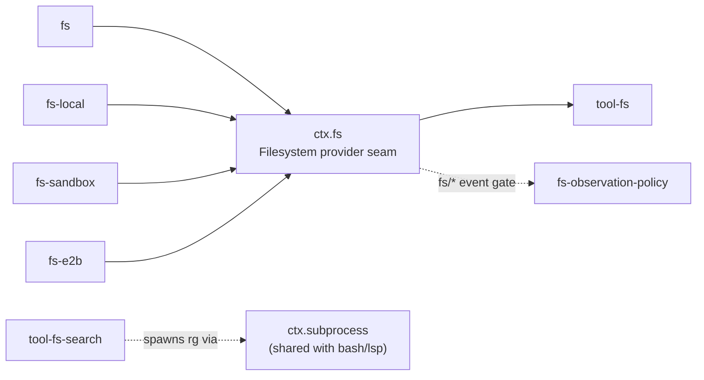
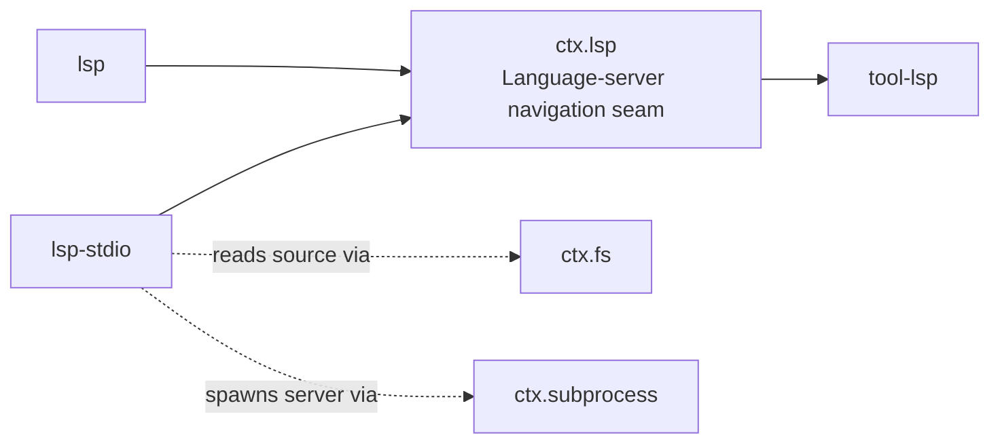

## Two execution-world seams, one lesson

[The previous chapter](../s07-capability-seams-primer/README.md) worked through the bash seam in depth — Service Definition, Service Providers, Consumer, and why splitting them pays for itself. This chapter applies the exact same three-role shape to two more capabilities, filesystem and language-server navigation, and spends most of its time on the first because its provider family is the more instructive one: three backends, each answering the same twelve-method contract in a genuinely different way.

`docs/architecture.md` states the point that ties the two seams (and bash) together directly: "Filesystem and subprocess providers share one execution world, so pointing them at a remote sandbox moves Bash, PTY, and LSP with them, with no provider forks." A deployment's choice of *where code and files live* is one decision that several seams honor together, not a filesystem-specific concern.

## The `ctx.fs` seam: Service Definition

`packages/fs/fs/` owns `ctx.fs` and nothing else — no local disk access, no policy, no model-facing schema. It is `FileSystem`, an abstract class extending Cordis `Service`, exposing twelve primitives that describe WHAT a filesystem backend can do without saying HOW:

```ts filename="packages/fs/fs/src/index.ts"
export abstract class FileSystem extends Service {
  constructor(ctx: Context) {
    super(ctx, 'fs')
  }

  get sandboxMode(): SandboxMode | undefined {
    return undefined
  }

  abstract resolve(path: string, opts?: { cwd?: string; signal?: AbortSignal }): Promise<FsTarget>
  abstract processPath(target: FsTarget): string
  abstract fileUrl(target: FsTarget): string
  abstract contains(parent: FsTarget, child: FsTarget): boolean
  abstract stat(target: FsTarget, signal?: AbortSignal): Promise<FsInfo | undefined>
  abstract lstat(path: string, opts?: { cwd?: string }, signal?: AbortSignal): Promise<FsPathInfo | undefined>
  abstract readText(target: FsTarget, signal?: AbortSignal): Promise<string>
  abstract streamText(target: FsTarget, signal?: AbortSignal): Promise<AsyncIterable<string>>
  abstract readBytes(target: FsTarget, signal: AbortSignal | undefined, maxBytes: number): Promise<Uint8Array>
  abstract listDir(target: FsTarget, signal?: AbortSignal): Promise<FsDirEntry[]>
  abstract writeText(target: FsTarget, content: string, expected?: FsWriteIntent, signal?: AbortSignal, sandboxPolicy?: SandboxExecutionPolicy): Promise<FsWriteOutcome>
  abstract editText(target: FsTarget, edit: FsEditRequest, expected?: { version: FsVersion }, signal?: AbortSignal, sandboxPolicy?: SandboxExecutionPolicy): Promise<FsEditOutcome>
}
```

`super(ctx, 'fs')` claims `ctx.fs` exactly as `ShellExecutor` claimed `ctx.shell` in the previous chapter — a second `FileSystem` provider mounted in the same context throws, Cordis's standard duplicate-service failure. `sandboxMode` is the same capability-fact pattern you saw on `ShellExecutor`: `undefined` by default, overridden by a confining backend, read by the Consumer to decide whether to advertise escalation fields — without importing a single line from any concrete provider.

The contract sits deliberately "half a level above byte-level `cat`/`open`," in the README's own words: it decodes UTF-8, rejects binary content, and owns the atomic-write and literal-edit critical sections, but it does not own line windows, numbered output, or observed-state policy — those belong to layers above it. `writeText` and `editText` both take an *optional* version guard (`FsWriteIntent` / `{ version: FsVersion }`): omit it and the backend performs an unconditional atomic write or edit; supply it and the backend enforces compare-and-swap freshness. That optionality is what makes `ctx.fs` on its own — with no policy plugin loaded — a complete, if unconstrained, storage seam.

Twelve primitives is a closed set: no delete, rename, copy, or watch, and `listDir` lists one level only. That is a documented scope boundary, not an oversight — recursion, globbing, and search are a different tool's job, covered below.

## Three Service Providers, three different reasons to swap

Three packages implement `FileSystem`, and each answers "where does the file actually live" a different way.

**`dsh-fs-local`** (`packages/fs/fs-local/`) is the host-filesystem backend: unconfined disk access on the machine the harness runs on. Its `resolve` realpaths the target so aliases through a symlink share one `targetKey`, `writeText` publishes through a temp-file-plus-rename dance with Windows DACL preservation, and `editText` runs a literal read-match-write cycle serialized per target by an in-process lock. Nothing in this backend confines anything — `config.cwd` is a resolution default for relative paths, explicitly documented as "not a sandbox": absolute paths and `..` escape it freely.

**`dsh-fs-sandbox`** (`packages/fs/fs-sandbox/`) answers a different need: policy-fenced access for an untrusted or semi-trusted model. It *extends* `LocalFileSystem` rather than reimplementing storage from scratch — every read, every atomic-write mechanic, every edit critical section is inherited verbatim. It overrides exactly two methods, `writeText` and `editText`, wrapping each in a per-call mode check before delegating to the inherited implementation:

```ts
// packages/fs/fs-sandbox/src/index.ts:59-151
export class SandboxedFileSystem extends LocalFileSystem {
  static inject = ['sandboxPolicy']

  override async writeText(
    target: FsTarget,
    content: string,
    expected?: FsWriteIntent,
    signal?: AbortSignal,
    sandboxPolicy?: SandboxExecutionPolicy,
  ): Promise<FsWriteOutcome> {
    return super.writeText(await this.checkedTarget(target, sandboxPolicy), content, expected, signal)
  }

  private async checkedTarget(target: FsTarget, sandboxPolicy?: SandboxExecutionPolicy): Promise<FsTarget> {
    const policy = sandboxPolicy ?? this.ctx.sandboxPolicy.resolve()
    const { mode } = policy
    if (mode === 'danger-full-access') return target
    if (mode === 'read-only') {
      throw new FsError(`cannot write "${target.displayPath}": file access denied under read-only mode`, 'FS_SANDBOX_DENIED')
    }
    const fresh = await this.resolve(target.displayPath)
    let contained = false
    for (const root of writableRoots(policy)) {
      if (await isPathUnder(fresh.targetKey, root)) { contained = true; break }
    }
    if (!contained) {
      throw new FsError(`cannot write "${target.displayPath}": file access denied under workspace-write mode`, 'FS_SANDBOX_DENIED')
    }
    return fresh
  }
}
```

`read-only` denies every mutation, `workspace-write` requires the target to canonicalize under the session workspace root or a platform temp directory (using the same `writableRoots` function the Seatbelt runner profile uses, so bash and fs cannot drift onto different writable sets), and `danger-full-access` delegates unfenced. Its own README is explicit about the threat model this represents: "a policy fence, not a kernel boundary" — the operations are the seam's own (open, rename), only the target path is model-controlled, so canonicalize-then-contain is a complete answer. Kernel-grade isolation of untrusted *code* stays `ctx.shell`'s job (`dsh-bash-sandbox`); this package's job is isolation of untrusted *paths*.

**`dsh-fs-e2b`** (`packages/e2b/fs-e2b/`) answers a third need: remote container access, so file state lives in the same E2B sandbox that E2B-backed Bash processes already run in. It shares the SDK handle and remote cwd owned by `ctx.e2b`, projects E2B metadata into the same `FsInfo`/`FsPathInfo` shapes, and reimplements every primitive against the remote controller — GNU `realpath -mz` for canonical identity, atomic same-filesystem rename for replacement, remote `ln -T` for guarded no-replace creation. It does not sync with the host: an empty E2B cwd stays empty until something inside that world populates it.

These are not three variations on a theme picked for variety — they are three genuinely different deployment postures behind the identical `FileSystem` contract, which is exactly the point of the seam: `dsh-tool-fs` (below) never imports `LocalFileSystem`, `SandboxedFileSystem`, or the E2B backend. It calls `ctx.fs.writeText(...)` and gets whichever posture the deployment composed.

## The Consumer: `dsh-tool-fs`

`packages/fs/tool-fs/` is both the model-facing `read`/`write`/`edit` (and `read_image`) tool schemas *and* their executor — it calls `ctx.fs` directly rather than routing through an intermediate service:

```ts
// packages/fs/tool-fs/src/index.ts:19-22
export const name = 'tool-fs'
export const inject = ['tools', 'fs', 'systemPrompt']
```

Each tool resolves the path via `ctx.fs.resolve(path, { cwd, signal })`, passing the calling agent's session cwd so relative paths resolve the same way `dsh-tool-bash` resolves them, then reads or mutates. `read` owns line windowing (`offset`/`limit`, byte and line-length caps) and renders `<path>`/`<content>` output with numbered lines — none of that belongs on `ctx.fs`, which returns only decoded whole-file text. When the mounted backend reports a `sandboxMode`, the tool adds `sandbox_permissions` and `justification` fields to `write`/`edit`'s schema and resolves approved retries through `ctx.approval` — exactly the same capability-detection pattern `dsh-tool-bash` uses for `ShellExecutor.sandboxMode`.

## The event gate: policy without a service dependency

Between the provider and the tool sits a policy plugin, `dsh-fs-observation-policy`, that is worth naming precisely because of *how* it participates: not as an injected service, but through three `fs/*` events `dsh-fs` declares and `dsh-tool-fs` dispatches — `fs/write-intent` and `fs/edit-intent` (single-slot decision waterfalls the policy plugin fully decides, never calling `next()`), and `fs/observed` (a fire-and-forget recording event). The tool's default thunks return `undefined` when no listener answers, which is the bare, unconstrained provider behavior; loading the policy plugin makes `write` require a prior `read` at the unchanged version before overwriting, and makes `edit` require the same before mutating. Removing the plugin does not break the tool at any injection boundary — there is no service to inject — it just loses the freshness policy and falls through to the bare provider's unconditional behavior. That graceful degrade is the entire reason this is an event gate rather than a mandatory method service.

## The documented non-seam: `dsh-tool-fs-search` bypasses `ctx.fs` on purpose

The fs package family ships a fourth model-facing package, `dsh-tool-fs-search`, supplying `glob` and `grep`. It is worth calling out explicitly: this package does **not** go through `ctx.fs` at all, and its own README says so in the first paragraph rather than leaving a reader to infer it from the injection list. Its module doc states the reason directly:

```ts
// packages/fs/tool-fs-search/src/index.ts:1-19
/**
 * ## Spawn-backed, not a `ctx.fs` provider method
 *
 * Local workspace discovery is a process-backed `rg` workflow, so these tools
 * execute through `ctx.subprocess.spawn()` with fixed ripgrep argv templates —
 * never `ctx.shell`, never `ctx.shell.start()`, never a model-visible background
 * task. ... The package injects `tools`, `systemPrompt`, and
 * `subprocess` — deliberately NOT `fs`, and `ctx.spillStore` is read
 * opportunistically with `ctx.get()` because formatted-result spill is optional.
 */
```

Its `inject` array confirms the claim: `['tools', 'systemPrompt', 'subprocess']` — no `fs`. Every `glob`/`grep` call spawns the packaged `@vscode/ripgrep` binary through `ctx.subprocess`, the same execution-world seam bash executors use, not a filesystem-provider method. The package's own README frames the design choice as deliberate: "putting search on `ctx.fs` would force every filesystem backend to grow a search API." Discovery is naturally a process-backed workflow (parse `rg`'s output, build argv, apply caps) — extending the twelve-primitive `FileSystem` contract with a thirteenth, search-shaped primitive would burden `dsh-fs-sandbox` and `dsh-fs-e2b` with reimplementing ripgrep-equivalent behavior rather than reusing one packaged binary. The cost of that choice is explicit too: returned paths are follow-up-readable with `read` only when the search workdir and the `ctx.fs` root denote the same workspace — a documented co-located-deployment assumption, not something the two packages check against each other at runtime.

## Diagram: the `ctx.fs` seam



`tool-fs-search`'s edge is drawn dashed and pointed at `ctx.subprocess`, not `ctx.fs` — that is the diagram's honest depiction of the bypass, not a simplification.

## The `ctx.lsp` seam: a smaller instance of the same pattern

Language-server navigation is the same three-role shape, scaled down. `packages/lsp/` states its scope directly: "the seam exposes exactly four semantic operations — `goToDefinition`, `findReferences`, `goToImplementation`, `hover` — and no generic JSON-RPC escape hatch." The problem it solves is real language servers (TypeScript, Go, Rust, whatever a deployment configures) speak the Language Server Protocol, an enormous surface with arbitrary requests, notifications, and — critically — mutating capabilities like `workspace/applyEdit` and command execution. `ctx.lsp` deliberately narrows that entire protocol down to four read-only navigation queries, so no protocol payload and no unreviewed mutation ever reaches a provider through the model-facing contract.

**Service Definition** — `dsh-lsp` (`packages/lsp/lsp/`) owns `ctx.lsp`, a **provider registry** rather than a single fixed executor (the same registry shape `ctx.subagents` uses, not the one-executor-per-context rule bash uses): `registerProvider` reserves a branded provider id plus every file extension it claims, atomically and exclusively — two providers cannot both claim `.ts`. `query(request, signal?)` selects a provider by the file's extension and runs one normalized request, throwing `LSP_UNAVAILABLE` when nothing matches. The result type is a closed discriminated union (`{ kind: 'locations', ... }` or `{ kind: 'hover', ... }`), so consumers `switch` to exhaustiveness rather than parsing an open-ended payload.

**Service Provider** — `dsh-lsp-stdio` (`packages/lsp/lsp-stdio/`) is a generic, multi-server stdio backend: one plugin instance, a configured table of servers, one isolated provider registered per entry. It reads source through `ctx.fs` and launches the server process through `ctx.subprocess` — the same execution-world seams bash and fs already use — so a language server run against a remote sandbox sees the same files and shares the same process world as everything else pointed at that sandbox. Each query opens the document transiently (`didOpen` → the request → `didClose` in `finally`), so the first version needs no persistent document cache or LRU.

**Consumer** — `dsh-tool-lsp` (`packages/lsp/tool-lsp/`) is one read-only tool with an `operation` argument selecting among the four operations, plus `file_path`, `line`, `character`. It owns the one-based UTF-16 cursor convention the model uses, converting to and from the seam's zero-based positions; provider, language id, workspace root, and executable never appear in the schema.



`docs/capability-seams.md` classifies `ctx.lsp` as a `seam` row with one known implementation (`lsp-stdio`) and one consumer (`tool-lsp`) — a single provider today, unlike `ctx.fs`'s three, but the registry shape and the extension-exclusivity check already anticipate a second stdio table entry or a second backend without changing `dsh-tool-lsp`'s schema at all.

## Why the LSP seam stays this narrow

The four-operation limit is not a placeholder for a fuller protocol surface arriving later — the package's own limitations section calls out that symbols and call hierarchy are deferred because "they need different schemas," and that mutations (rename, code actions, formatting) would require "separate tools with preview, permission, and write-policy integration" rather than an extension of this seam. That is the same instinct behind `ctx.fs`'s twelve fixed primitives and `tool-fs-search` staying off `ctx.fs` entirely: a Service Definition is sized to the Consumers it actually has, not to the protocol or filesystem API it wraps.

## What to carry forward

Both seams reinforce the same three lessons from the previous chapter, now visible at a different scale:

- **A Service Definition is a closed, intentionally narrow contract** — twelve fs primitives, four lsp operations — not a passthrough for whatever the richest possible backend (a POSIX filesystem, the full LSP spec) can do.
- **Providers can share almost everything and differ in one dimension.** `dsh-fs-sandbox` inherits all of `dsh-fs-local`'s storage mechanics and adds one policy fence; the payoff of subclassing rather than reimplementing is that a bug fix to atomic-write mechanics benefits both backends at once.
- **Not every model-facing package under a capability's directory is a Consumer of that capability's seam.** `dsh-tool-fs-search` sits in `packages/fs/` and is model-facing, but it is a Consumer of `ctx.subprocess`, not of `ctx.fs` — and its own README says so in the first paragraph rather than leaving a reader to infer it from the injection list.
