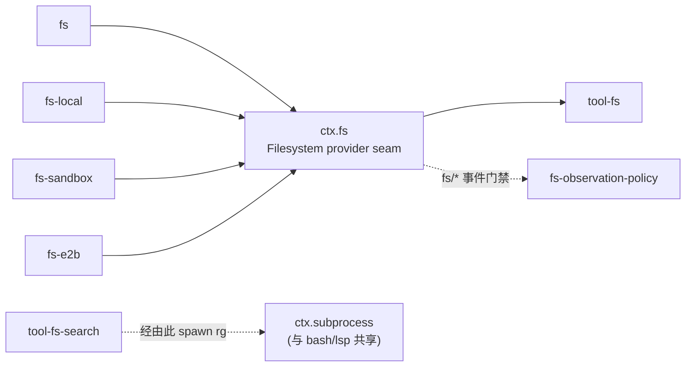
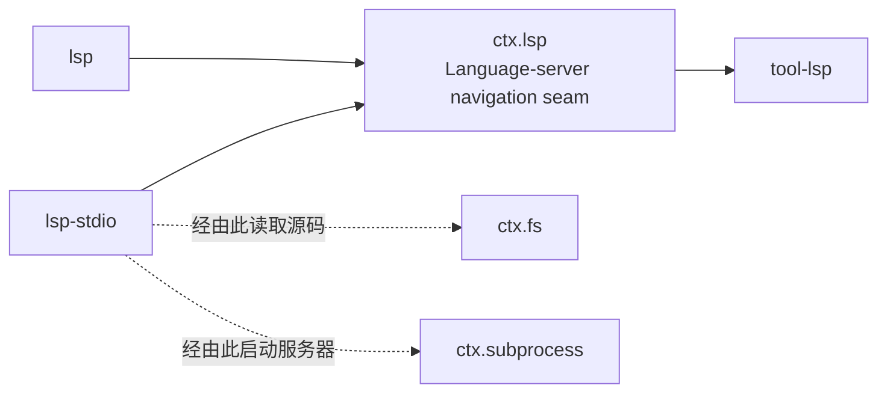

## 一句话版本

`ctx.fs` 是同一份 `FileSystem` 约定，由三种真正不同的方式应答——不受限的本地磁盘、加政策围栏的沙箱、以及 E2B 远程容器——而 `ctx.lsp` 则是同一套三角色形态的缩小版，只保留四种只读导航操作。[上一章](../s07-capability-seams-primer/README.zh.md) 在 bash seam 上建立了三角色模式(Service Definition、Service Provider、Consumer);本章把它重放到另外两个能力上,并在不同尺度上落定同一条经验:一个 Service Definition 的大小,要匹配它实际拥有的 Consumer,而不是它包装的 API 有多丰富。

`docs/architecture.md` 直接点出了把这两个 seam(以及 bash)联系在一起的那句话:"文件系统与子进程提供方共享同一个执行世界,所以把它们指向一个远程沙箱,会把 Bash、PTY 和 LSP 一并带过去,不需要任何 provider 分叉。"一个部署选择*代码和文件生活在哪里*,是好几个 seam 共同遵守的一个决定,而不是文件系统专属的关切。

## 速览

:::concept{term="FileSystem"}
`ctx.fs` 的 Service Definition:一个继承 Cordis `Service` 的抽象类,公开十二个原语,描述文件系统后端**能做什么**,而不规定**怎么做**。它解码 UTF-8、拒绝二进制内容,并拥有原子写入和字面量编辑的临界区。
:::

:::concept{term="sandboxMode"}
Service Definition 上一个可选的能力事实 getter:默认为 `undefined`,由约束性后端覆盖,由 Consumer 读取以决定是否展示升级字段——完全不需要从任何具体 provider 导入一行代码。
:::

:::concept{term="ctx.lsp"}
语言服务器的 Service Definition:恰好四种只读导航操作——`goToDefinition`、`findReferences`、`goToImplementation`、`hover`——且不提供通用 JSON-RPC 逃生口。
:::

## `ctx.fs` seam:Service Definition

`packages/fs/fs/` 拥有 `ctx.fs`,别无其他——没有本地磁盘访问,没有政策,没有面向模型的 schema。

```ts filename="packages/fs/fs/src/index.ts"
export abstract class FileSystem extends Service {
  constructor(ctx: Context) {
    super(ctx, 'fs')
  }

  get sandboxMode(): SandboxMode | undefined {
    return undefined
  }

  abstract resolve(path: string, opts?: { cwd?: string; signal?: AbortSignal }): Promise<FsTarget>
  abstract processPath(target: FsTarget): string
  abstract fileUrl(target: FsTarget): string
  abstract contains(parent: FsTarget, child: FsTarget): boolean
  abstract stat(target: FsTarget, signal?: AbortSignal): Promise<FsInfo | undefined>
  abstract lstat(path: string, opts?: { cwd?: string }, signal?: AbortSignal): Promise<FsPathInfo | undefined>
  abstract readText(target: FsTarget, signal?: AbortSignal): Promise<string>
  abstract streamText(target: FsTarget, signal?: AbortSignal): Promise<AsyncIterable<string>>
  abstract readBytes(target: FsTarget, signal: AbortSignal | undefined, maxBytes: number): Promise<Uint8Array>
  abstract listDir(target: FsTarget, signal?: AbortSignal): Promise<FsDirEntry[]>
  abstract writeText(target: FsTarget, content: string, expected?: FsWriteIntent, signal?: AbortSignal, sandboxPolicy?: SandboxExecutionPolicy): Promise<FsWriteOutcome>
  abstract editText(target: FsTarget, edit: FsEditRequest, expected?: { version: FsVersion }, signal?: AbortSignal, sandboxPolicy?: SandboxExecutionPolicy): Promise<FsEditOutcome>
}
```

`super(ctx, 'fs')` 占用 `ctx.fs`,方式与上一章 `ShellExecutor` 占用 `ctx.shell` 完全一致——在同一个 context 里挂载第二个 `FileSystem` provider 会抛出错误,这是 Cordis 标准的重复服务失败。

:::fold[约定停在哪一层,以及可选的版本防护]
这份约定刻意停在 README 自己所说的"比字节级 `cat`/`open` 高半层":它解码 UTF-8、拒绝二进制内容,并拥有原子写入和字面量编辑的临界区,但它不拥有行窗口、编号输出,或已观察状态政策——那些属于它上层的角色。`writeText` 和 `editText` 都接受一个*可选*的版本防护(`FsWriteIntent` / `{ version: FsVersion }`):省略它,后端执行无条件的原子写入或编辑;提供它,后端强制执行比较并交换式的新鲜度检查。正是这种可选性,使得 `ctx.fs` 本身——在没有加载任何政策插件的情况下——就是一个完整、只是不受约束的存储 seam。
:::

> [!NOTE]
> 十二个原语是一个封闭集合:没有删除、重命名、复制或监视,`listDir` 只列出一层。这是一个记录在案的范围边界,而非疏漏——递归、glob 匹配和搜索是另一个工具的职责,下文会讲到。

## 三个 Service Provider,三种部署姿态

三个包实现了 `FileSystem`,每一个对"文件到底存在哪里"给出不同的答案。

**`dsh-fs-local`**(`packages/fs/fs-local/`)是宿主文件系统后端:在运行 harness 的机器上不受限制地访问磁盘。它的 `resolve` 会对目标做 realpath,使经由符号链接到达的别名共享同一个 `targetKey`;`writeText` 通过临时文件加重命名的方式发布,并保留 Windows 的 DACL;`editText` 执行字面量读取-匹配-写入循环,由进程内锁按目标串行化。这个后端没有任何约束——`config.cwd` 只是相对路径的解析默认值,文档明确说它"不是沙箱":绝对路径和 `..` 可以自由逃逸。

**`dsh-fs-sandbox`**(`packages/fs/fs-sandbox/`)回答的是另一种需求:为不受信任或半受信任的模型提供政策围栏的访问。它*继承* `LocalFileSystem`,而不是从头重新实现存储——每一次读取、每一个原子写入机制、每一个编辑临界区都原样继承。它恰好覆盖两个方法,`writeText` 和 `editText`,在委托给继承实现之前各自包一层逐调用的模式检查:

```ts
// packages/fs/fs-sandbox/src/index.ts:59-151
export class SandboxedFileSystem extends LocalFileSystem {
  static inject = ['sandboxPolicy']

  override async writeText(
    target: FsTarget,
    content: string,
    expected?: FsWriteIntent,
    signal?: AbortSignal,
    sandboxPolicy?: SandboxExecutionPolicy,
  ): Promise<FsWriteOutcome> {
    return super.writeText(await this.checkedTarget(target, sandboxPolicy), content, expected, signal)
  }

  private async checkedTarget(target: FsTarget, sandboxPolicy?: SandboxExecutionPolicy): Promise<FsTarget> {
    const policy = sandboxPolicy ?? this.ctx.sandboxPolicy.resolve()
    const { mode } = policy
    if (mode === 'danger-full-access') return target
    if (mode === 'read-only') {
      throw new FsError(`cannot write "${target.displayPath}": file access denied under read-only mode`, 'FS_SANDBOX_DENIED')
    }
    const fresh = await this.resolve(target.displayPath)
    let contained = false
    for (const root of writableRoots(policy)) {
      if (await isPathUnder(fresh.targetKey, root)) { contained = true; break }
    }
    if (!contained) {
      throw new FsError(`cannot write "${target.displayPath}": file access denied under workspace-write mode`, 'FS_SANDBOX_DENIED')
    }
    return fresh
  }
}
```

`read-only` 拒绝一切变更,`workspace-write` 要求目标规范化后落在会话工作区根目录或某个平台临时目录之下(使用与 Seatbelt 运行器 profile 相同的 `writableRoots` 函数,使 bash 和 fs 不会漂移到不同的可写集合),`danger-full-access` 无围栏地委托下去。它自己的 README 明确说明了这代表的威胁模型:"一个政策围栏,不是内核边界"——操作本身就是 seam 自己的(open、rename),只有目标路径是模型可控的,所以先规范化再检查包含关系就是这个层面的完整答案。对不受信任*代码*的内核级隔离仍是 `ctx.shell` 的职责(`dsh-bash-sandbox`);这个包的职责是对不受信任*路径*的隔离。

:::decision
选择继承本地后端,而不是重新实现。`dsh-fs-sandbox` 继承了 `dsh-fs-local` 全部的存储机制,只用一道政策围栏覆盖两个变更方法——于是一次原子写入机制的修复能同时惠及两个后端,而且围栏永远不会跟它守护的存储机制脱节。
:::

**`dsh-fs-e2b`**(`packages/e2b/fs-e2b/`)回答第三种需求:远程容器访问,使文件状态存在于 E2B-backed Bash 进程已经运行的同一个 E2B 沙箱中。它共享由 `ctx.e2b` 拥有的 SDK 句柄和远程 cwd,把 E2B 元数据投影成同样的 `FsInfo`/`FsPathInfo` 形态,并针对远程控制器重新实现了每一个原语——用 GNU `realpath -mz` 做规范身份、用同文件系统原子重命名做替换、用远程 `ln -T` 做带防护的不替换创建。它不与宿主同步:一个空的 E2B cwd 会一直保持空,直到那个世界内部的某个东西填充它。

| | `dsh-fs-local` | `dsh-fs-sandbox` | `dsh-fs-e2b` |
|---|---|---|---|
| 文件存在哪里 | 宿主磁盘 | 宿主磁盘,加政策围栏 | E2B 远程容器 |
| 存储机制 | 自有(realpath、临时文件+重命名、DACL) | 继承自 `LocalFileSystem` | 针对远程控制器重新实现 |
| 覆盖的方法 | ——(它本身就是基类) | 仅 `writeText` + `editText` | 全部十二个 |
| 约束 | 无——`config.cwd` "不是沙箱" | 先规范化再在 `writableRoots` 下检查包含 | E2B 沙箱边界本身 |
| 威胁模型 | 受信任的操作方 | "一个政策围栏,不是内核边界" | 对不受信任代码的内核级隔离 |

这三者不是为了多样性而挑选的三种变体——它们是同一份 `FileSystem` 约定背后三种真正不同的部署姿态,这正是这个 seam 的意义所在:下文的 `dsh-tool-fs` 从不导入 `LocalFileSystem`、`SandboxedFileSystem`,或 E2B 后端。它调用 `ctx.fs.writeText(...)`,得到的是部署方组合出的任何一种姿态。

## Consumer:`dsh-tool-fs`

`packages/fs/tool-fs/` 既是面向模型的 `read`/`write`/`edit`(以及 `read_image`)工具 schema,又是它们的执行器——它直接调用 `ctx.fs`,而不经过一个中间服务:

```ts
// packages/fs/tool-fs/src/index.ts:19-22
export const name = 'tool-fs'
export const inject = ['tools', 'fs', 'systemPrompt']
```

每个工具都通过 `ctx.fs.resolve(path, { cwd, signal })` 解析路径,传入调用方 agent 的会话 cwd,使相对路径的解析方式与 `dsh-tool-bash` 一致,然后读取或变更。`read` 拥有行窗口逻辑(`offset`/`limit`、字节和行长上限),并把 `<path>`/`<content>` 输出渲染为带编号的行——这些都不属于 `ctx.fs`,后者只返回解码后的整文件文本。当挂载的后端报告了 `sandboxMode`,工具会为 `write`/`edit` 的 schema 添加 `sandbox_permissions` 和 `justification` 字段,并通过 `ctx.approval` 解析已批准的重试——与 `dsh-tool-bash` 针对 `ShellExecutor.sandboxMode` 使用的能力检测模式完全相同。

## 事件门禁:不依赖服务的政策

在 provider 和工具之间,坐着一个政策插件 `dsh-fs-observation-policy`,值得精确说明它*如何*参与:不是作为一个被注入的服务,而是通过 `dsh-fs` 声明、`dsh-tool-fs` 分派的三个 `fs/*` 事件——`fs/write-intent` 和 `fs/edit-intent`(单槽决策 waterfall,由政策插件完整决策,绝不调用 `next()`),以及 `fs/observed`(发后即忘的记录事件)。当没有监听器应答时,工具的默认 thunk 返回 `undefined`,这就是裸的、不受约束的 provider 行为;加载政策插件后,`write` 会要求在覆盖前先有一次未变版本的 `read`,`edit` 也是同样要求先读后改。

:::decision
采用事件门禁、而非强制方法服务。移除该插件不会在任何注入边界上破坏工具——因为根本没有服务可注入——只是失去新鲜度政策,回落到裸 provider 的无条件行为。这种优雅降级正是这一选择的全部理由。
:::

## 记录在案的非 seam:`dsh-tool-fs-search` 刻意绕开 `ctx.fs`

fs 包家族还发布了第四个面向模型的包,`dsh-tool-fs-search`,提供 `glob` 和 `grep`。这里值得明确指出:这个包**完全不**经过 `ctx.fs`,它自己的 README 在第一段就说明了这一点,不需要读者从注入列表里自行推断。它的模块文档直接说明了原因:

```ts
// packages/fs/tool-fs-search/src/index.ts:1-19
/**
 * ## Spawn-backed, not a `ctx.fs` provider method
 *
 * Local workspace discovery is a process-backed `rg` workflow, so these tools
 * execute through `ctx.subprocess.spawn()` with fixed ripgrep argv templates —
 * never `ctx.shell`, never `ctx.shell.start()`, never a model-visible background
 * task. ... The package injects `tools`, `systemPrompt`, and
 * `subprocess` — deliberately NOT `fs`, and `ctx.spillStore` is read
 * opportunistically with `ctx.get()` because formatted-result spill is optional.
 */
```

它的 `inject` 数组印证了这个说法:`['tools', 'systemPrompt', 'subprocess']`——没有 `fs`。每一次 `glob`/`grep` 调用都通过 `ctx.subprocess` 生成打包的 `@vscode/ripgrep` 二进制文件——与 bash 执行器使用的是同一个执行世界 seam,而不是某个文件系统 provider 方法。

:::decision
这个包自己的 README 把这个设计选择描述为刻意为之:"把搜索放到 `ctx.fs` 上,会强迫每一个文件系统后端都长出一个搜索 API。"发现天然是一个由进程支撑的工作流(解析 `rg` 的输出、构建 argv、施加上限)——为十二原语的 `FileSystem` 约定扩展出第十三个、搜索形态的原语,只会让 `dsh-fs-sandbox` 和 `dsh-fs-e2b` 背上重新实现等价 ripgrep 行为的负担,而不是复用一个打包好的二进制文件。
:::

> [!PITFALL]
> 这个选择的代价也被明确写了出来:返回的路径只有在搜索工作目录与 `ctx.fs` 的根是同一个工作区时,才能被 `read` 跟进读取——这是一个记录在案的共置部署假设,而不是两个包在运行时互相校验的东西。

## 图示:`ctx.fs` seam



`tool-fs-search` 的边被画成虚线,指向 `ctx.subprocess` 而非 `ctx.fs`——这是这张图对绕开行为的诚实描绘,而不是一种简化处理。

## `ctx.lsp` seam:同一模式的缩小实例

语言服务器导航是同样的三角色形态,只是规模更小。它要解决的问题是真实存在的:语言服务器(TypeScript、Go、Rust,任何部署方配置的语言)讲的是语言服务器协议,这是一个巨大的接口面,包含任意请求、通知,以及——关键的是——诸如 `workspace/applyEdit` 和命令执行这样的变更能力。`ctx.lsp` 刻意把整个协议收窄成四种只读的导航查询,使得没有任何协议载荷、也没有任何未经评审的变更,能通过面向模型的约定到达 provider。

**Service Definition**——`dsh-lsp`(`packages/lsp/lsp/`)拥有 `ctx.lsp`,这是一个**provider 注册表**,而非单一固定的执行器(与 `ctx.subagents` 相同的注册表形态,而非 bash 那种每上下文一个执行器的规则):`registerProvider` 原子且排他地预留一个品牌化的 provider id 加上它声明的每个文件扩展名——两个 provider 不能同时声明 `.ts`。`query(request, signal?)` 按文件扩展名选择一个 provider,运行一次标准化请求,若无匹配则抛出 `LSP_UNAVAILABLE`。结果类型是一个封闭的可辨识联合(`{ kind: 'locations', ... }` 或 `{ kind: 'hover', ... }`),使消费方能够穷尽式地 `switch`,而不是解析一个开放式载荷。

**Service Provider**——`dsh-lsp-stdio`(`packages/lsp/lsp-stdio/`)是一个通用的多服务器 stdio 后端:一个插件实例,一份配置好的服务器表,每个条目注册一个隔离的 provider。它通过 `ctx.fs` 读取源码,通过 `ctx.subprocess` 启动服务器进程——与 bash 和 fs 已经使用的是同样的执行世界 seam——所以针对远程沙箱运行的语言服务器,看到的是同样的文件,与所有指向该沙箱的其他东西共享同一个进程世界。每次查询都临时打开文档,所以第一个版本不需要持久化文档缓存或 LRU:

:::timeline
- didOpen——对着语言服务器临时打开文档
- request——运行这一次标准化的导航查询
- didClose——在 `finally` 中关闭;查询之外不留任何持久化文档状态
:::

**Consumer**——`dsh-tool-lsp`(`packages/lsp/tool-lsp/`)是一个只读工具,用一个 `operation` 参数在四种操作中选择,外加 `file_path`、`line`、`character`。它拥有模型使用的从 1 开始的 UTF-16 光标约定,负责与 seam 从 0 开始的坐标相互转换;provider、language id、工作区根目录和可执行文件都不会出现在 schema 里。



`docs/capability-seams.md` 把 `ctx.lsp` 分类为 `seam` 一行,标注一个已知实现(`lsp-stdio`)和一个消费方(`tool-lsp`)——与 `ctx.fs` 的三个 provider 不同,目前只有一个,但注册表形态和扩展名排他性检查已经为将来新增第二个 stdio 表条目、或第二个后端做好了准备,而完全不需要改动 `dsh-tool-lsp` 的 schema。

## 为什么 LSP seam 保持这么窄

四种操作的限制不是为将来会到来的更完整协议接口预留的占位符——这个包自己的限制章节指出,符号(symbols)和调用层级(call hierarchy)被推迟是因为"它们需要不同的 schema",而变更类操作(重命名、code action、格式化)将需要"带预览、权限和写入政策集成的独立工具",而不是这个 seam 的一次扩展。这与 `ctx.fs` 固定十二个原语、以及 `tool-fs-search` 完全不接入 `ctx.fs` 背后是同一种直觉:一个 Service Definition 的大小要匹配它实际拥有的 Consumer,而不是它包装的协议或文件系统 API 本身有多丰富。

## 应该带走的经验

两个 seam 都在不同的尺度上,重申了上一章的三条经验:

- **一个 Service Definition 是一份封闭且刻意收窄的约定**——十二个 fs 原语、四种 lsp 操作——而不是对最丰富后端(一个 POSIX 文件系统、完整的 LSP 规范)所能做到的一切的透传。
- **provider 可以共享几乎一切,只在一个维度上不同。**`dsh-fs-sandbox` 继承了 `dsh-fs-local` 全部的存储机制,只加了一道政策围栏;选择继承而非重新实现的回报是:一次原子写入机制的修复能同时惠及两个后端。
- **不是一个能力目录下所有面向模型的包,都是那个能力 seam 的 Consumer。**`dsh-tool-fs-search` 位于 `packages/fs/` 下,也面向模型,但它是 `ctx.subprocess` 的 Consumer,而不是 `ctx.fs` 的——而且它自己的 README 在第一段就这么说,不需要读者从注入列表里自行推断。
