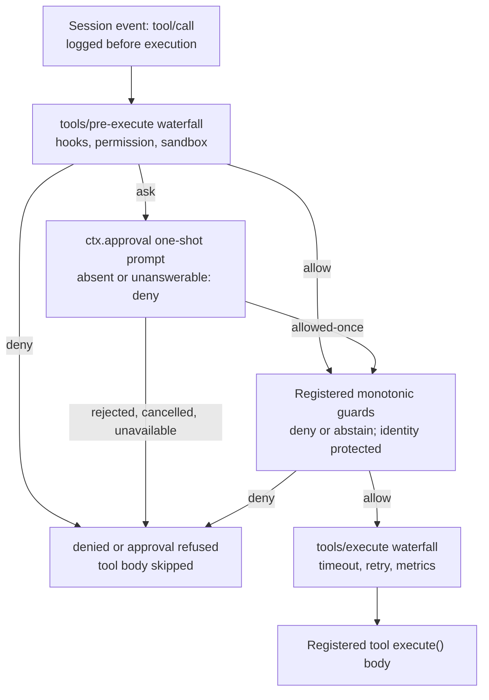

## The plane where a human answers for the model

Every other chapter so far has been about the loop running without anyone watching it: the model calls a tool, the pipeline validates and dispatches it, a result comes back. The `interaction/` package group is where that story stops being fully automatic. Four small services sit at the seam where a human — not another plugin, not a policy fold — decides something the model cannot decide for itself:

| Package | Role | `ctx` key |
|---|---|---|
| [`user-approval/`](../../../packages/interaction/user-approval/README.md) | Coordinates one-shot approval decisions for a single pending action. | `ctx.approval` |
| [`permission-presets/`](../../../packages/interaction/permission-presets/README.md) | Bundles sandbox mode and approval policy into named, user-facing presets. | `ctx.permissionPresets` |
| [`user-questions/`](../../../packages/interaction/user-questions/README.md) | Provider-neutral vocabulary for pausing a tool call until a human answers a question. | `ctx.userQuestions` |
| [`tool-ask-user/`](../../../packages/interaction/tool-ask-user/README.md) | Exposes `ctx.userQuestions` to the model as the `ask_user_question` tool. | registers on `ctx.tools` |

These are product packages, not loop infrastructure: they integrate through the same `ctx` service injection, event waterfalls, and session-log append discipline every other capability uses, without changing `agent-loop` itself. An interactive host (the Web app, a CLI prompt) wires up the human side; automation — the ACP bridge — wires up a machine side instead. Both speak the same seam vocabulary.

## `ctx.approval`: one question, one closed answer

The approval seam answers exactly one question — *may this specific action proceed?* — and nothing more. It has no memory of past answers, no persisted grant, and no notion of "always allow this kind of thing." Every `ApprovalOutcome` is one of four closed values:

```ts
type ApprovalOutcome = 'allowed-once' | 'rejected' | 'cancelled' | 'unavailable'
```

`allowed-once` is the only grant, and it authorizes exactly the action described in the request — nothing wider, nothing later. The other three are all denials from the caller's point of view: an explicit human rejection, a withdrawn request (the caller's `AbortSignal` fired), or an answerer that could not produce a decision at all. That last case is deliberate: a missing answerer, a throwing answerer, or an answerer that returns something outside the closed vocabulary all normalize to `unavailable` rather than silently becoming a grant. The seam fails closed by construction — there is no code path where "nobody answered" turns into "proceed."

### The request

```ts
interface ApprovalRequest {
  readonly agent: Agent
  readonly toolName: string
  readonly callId?: CallId
  readonly reason?: string
  readonly signal?: AbortSignal
}
```

Notice what is missing: tool arguments. The request identifies *which* tool call is being decided through `callId` — a UI answerer attaches its prompt to the tool call it already streamed to the user rather than rendering a second copy of the arguments that could drift from what actually executed. `agent` routes the question (an answerer only answers for agents it owns) and determines which session receives the audit trail.

### Dispatch: policy first, then the waterfall

`ApprovalService.request(req)` runs a fixed sequence, all inside `packages/interaction/user-approval/src/index.ts`:

1. **Require an open turn.** The audit pair below must be enclosed inside a `turn/start`/`turn/end` boundary — an event appended between turns is indistinguishable from a crash tail on reload and would be silently dropped. An idle-session ask throws before touching the log at all.
2. **Append `approval/asked`** — a fresh `ApprovalRequestId`, the tool name, optional `callId` and `reason`. Log-only; this never enters the model transcript.
3. **Decide.** If `req.signal` is already aborted, the outcome is `cancelled` immediately. Otherwise the service checks the session's effective `ApprovalPolicy`: `'never'` resolves `rejected` deterministically, decided *inside the service itself, before any waterfall dispatch* — so a listener registered with `prepend: true` cannot get in front of this check and override it. Under `'ask'`, the service dispatches the `approval/request` waterfall to composed answerers, racing the result against `req.signal` so a late abort still wins.
4. **Append `approval/decided`** with the same id and the resolved outcome.
5. **Return the outcome** to the caller.

```ts
async request(req: ApprovalRequest): Promise<ApprovalOutcome> {
  const session = req.agent.session
  if (!hasOpenTurn(session.events)) {
    throw new Error('approval.request() outside an open turn: …')
  }
  const id = ApprovalRequestId(randomUUID())
  session.append('approval/asked', { id, toolName: req.toolName, /* … */ })
  const outcome = await this.decide(req, session)
  session.append('approval/decided', { id, outcome })
  return outcome
}
```

A failure that prevents either audit event from committing rejects the whole call rather than returning an unlogged decision — the `approval/asked`/`approval/decided` pair is a hard invariant, never a best-effort log line.

### Answerers are waterfall listeners, scoped by agent

```ts
'approval/request'(this: Scoped<ApprovalService>, req: ApprovalRequest, next: () => Promise<ApprovalOutcome>): Promise<ApprovalOutcome>
```

An answerer either returns a closed `ApprovalOutcome` to claim the decision, or calls `next()` to delegate further down the chain; the chain's terminal default (with no answerer claiming it) is `'unavailable'`. `@deepseek-ai/dsh-scope` filters dispatch so an agent-scoped listener only sees requests for the agents it owns — a deployment composes one terminal answerer, because sibling listener order is not meant to function as a priority mechanism.

The ACP automation bridge is the reference machine answerer, registered directly against this event:

```ts
ctx.on('approval/request', (request, next) => {
  const record = ownedRecord(request.agent)
  if (record === undefined || request.callId === undefined) return next()
  return conn.requestPermission({
    sessionId: record.agent.session.id,
    toolCall: { toolCallId: request.callId },
    options: [
      { optionId: 'allow-once', name: 'Allow once', kind: 'allow_once' },
      { optionId: 'reject-once', name: 'Reject', kind: 'reject_once' },
    ],
  }).then(({ outcome }) => {
    if (outcome.outcome === 'cancelled') return 'cancelled'
    return outcome.optionId === 'allow-once' ? 'allowed-once' : 'rejected'
  })
})
```

It offers exactly the two one-shot options the closed vocabulary allows, and never infers a durable grant from an unrecognized client response.

### Two consumers, one seam

`ctx.tools`' pipeline is the primary consumer. When a `tools/pre-execute` listener returns `{ kind: 'ask', reason? }`, `ToolRuntime.serviceAsk()` resolves it through `ctx.approval` opportunistically (`ctx.get('approval')`, not a hard injection — a deployment without the plugin degrades to deny):

```ts
const outcome = await approval.request({
  agent: exec.agent, toolName: exec.name, callId: exec.callId,
  ...ask.reason !== undefined ? { reason: ask.reason } : {}, signal: exec.signal,
})
switch (outcome) {
  case 'allowed-once': return { decision: { kind: 'allow' }, approvalCancelled: false }
  case 'rejected': return { decision: { kind: 'deny', reason: `the user rejected tool "${exec.name}"` }, approvalCancelled: false }
  case 'cancelled': return { decision: { kind: 'deny', reason: `approval for tool "${exec.name}" was cancelled` }, approvalCancelled: true }
  case 'unavailable': return { decision: { kind: 'deny', reason: `tool "${exec.name}" requires approval, but no approval channel is available` }, approvalCancelled: false }
}
```

Every non-grant outcome gets its own model-facing denial text, so the model can tell "the user said no" from "nobody was there to ask."

The sandbox escalation gate (`packages/sandbox/sandbox/src/escalation.ts`) is the second consumer, and it shows the seam is genuinely shared mechanism, not tool-specific: when a bash or filesystem call asks to widen its `sandbox_permissions` beyond its current mode, `approveEscalation()` first checks strict widening against the call's effective mode (an execution-time check, not a schema constraint), then routes through the *identical* `approval.request()` call with a self-describing reason (`escalate sandbox to ${mode}: ${justification}`), and maps the same four outcomes to distinct thrown errors. Two families — the generic tool pipeline and the sandbox escalation retry — share one vocabulary, one audit format, and one fail-closed guarantee because both close over `ctx.approval` rather than reinventing it.

### Per-session policy: `ask` vs `never`

```ts
type ApprovalPolicy = 'ask' | 'never'
```

`'ask'` is the default: delegate to the composed answerer waterfall. `'never'` is the deterministic headless stance (CI, unattended runs) — every ask resolves `rejected` without dispatching any answerer at all, decided before the waterfall even runs. The effective policy is the last `approval/policy` event in the session log, falling back to the plugin's configured default; `setApprovalPolicy(session, policy)` is the single write path, so replaying the log reconstructs the override with no separate catch-up state. `ApprovalService.setPolicy(agent, policy)` is the live-switch entry point: it writes the event and injects a `user/message` telling the model the policy changed, e.g. `The approval policy changed from "ask" to "never" (changed by the user).`

Both policy values also contribute their complete current meaning to the runtime-context snapshot that assembles the request — under `'ask'` the model reads that approval may be consulted and an absent answerer fails closed; under `'never'` it reads that approval prompts are disabled and it should not bother requesting `sandbox_permissions`. This is append-only: the snapshot lands after retained history rather than rewriting the stable system-prompt prefix, so a policy switch does not invalidate the KV cache built up before it.

A subagent delegated by a parent agent is a special case worth naming: a delegated child's approval policy is always pinned to `'never'` regardless of the parent's own policy, recorded as `approval/policy { policy: 'never', source: 'delegation' }`. A child that asked for approval would have no answerer watching it — subagent sessions have no interactive surface of their own — so instead of a silently stuck child, its whole permission story is fixed by its inherited sandbox scope at delegation time, and any widening decision belongs to the parent.

## `ctx.permissionPresets`: bundling two knobs into one selector

Approval policy is one of two independent knobs that decide how much an agent may do without asking; the other is [sandbox mode](../s08-capability-seams/README.md) (`SandboxMode`: `read-only` | `workspace-write` | `danger-full-access`, owned by `dsh-sandbox-policy`'s `sandbox/mode` event). Exposing both separately to a user is exact but unfriendly. `PermissionPresetService` (`ctx.permissionPresets`) is the thin layer that bundles them into named presets a client renders as one selector, while enforcement, prompt narration, and replay all keep reading their own knob's fold exactly as before — the preset never becomes a third source of truth for what actually executes.

```ts
interface PresetSpec {
  sandbox: SandboxMode
  approval: ApprovalPolicy
  name?: string
  description?: string
}
```

The default table ships two entries:

| Preset | `sandbox` | `approval` | Meaning |
|---|---|---|---|
| `workspace-write` | `workspace-write` | `ask` | Write inside the workspace and permitted temp directories; wider retries require approval. |
| `danger-full-access` | `danger-full-access` | `never` | Full file access without approval prompts. |

The name `custom` is reserved and cannot appear in the configured table — the plugin throws at load if it does, because `custom` names a *derived* state, never a configured one. The service also requires a confining `ctx.shell` executor: composing it over an executor with no `sandboxMode` capability fact throws at load, since a preset that bundles a sandbox mode is meaningless without one.

### Deriving the current preset, and when it becomes `custom`

`current(events)` does not read its own event in isolation — it folds the session's effective sandbox mode and effective approval policy first, then asks which table entry that *combination* matches:

```ts
private derive(state: KnobState): string {
  const sandbox = state.sandbox ?? this.ctx.shell.sandboxMode
  const approval = state.approval ?? this.ctx.approval.config.policy ?? 'ask'
  const matches = (spec: PresetSpec): boolean => spec.sandbox === sandbox && spec.approval === approval
  if (state.preset !== null) {
    const spec = this.presets[state.preset]
    if (spec !== undefined && matches(spec)) return state.preset
  }
  for (const [name, spec] of Object.entries(this.presets)) {
    if (matches(spec)) return name
  }
  return CUSTOM_PRESET
}
```

A still-matching last recorded selection wins ties when two presets happen to share a bundle; otherwise the first table match in declaration order wins; and if the live knobs match nothing in the table at all, the answer is `CUSTOM_PRESET` (`'custom'`) — a client may display it, but it is never a switch target, and it never appears as an event payload.

### Switching: the selection event precedes the knob writes

```ts
set(session: Session, name: string): void {
  this.apply(session, name, (policy) => { setApprovalPolicy(session, policy) })
}

private apply(session: Session, name: string, setApproval: (policy: ApprovalPolicy) => void): void {
  const spec = this.resolve(name)
  if (this.current(session.events) !== name) {
    session.append('permission/preset', { preset: name })
  }
  const events = session.events
  if (spec.sandbox !== (effectiveSandboxMode(events) ?? this.ctx.shell.sandboxMode)) {
    setSandboxMode(session, spec.sandbox)
  }
  if (spec.approval !== (effectiveApprovalPolicy(events) ?? this.ctx.approval.config.policy ?? 'ask')) {
    setApproval(spec.approval)
  }
}
```

`set()` resolves the preset (an unknown name throws), appends a log-only `permission/preset` event only when the preset actually changes, then writes each knob through its *own* canonical setter — `setSandboxMode` and `setApprovalPolicy` — and only for the knob whose effective value would actually change. Re-selecting the already-effective preset appends nothing at all. `permission/preset` never enters the model transcript; the knob events it triggers own all model-visible consequences through their own consumers (the approval policy sentence above, the sandbox mode's own runtime-context contribution). Its only job is preserving *which* preset the user picked, for the case where two presets happen to bundle the same sandbox/approval pair and `current()` needs a tiebreaker.

Two optional children ship over the same service, activating only when their registry is composed: a `permissions` session-projection unit (folds the three knob events into a `PermissionSelect` — options plus current value — for a UI to render) and a `/permission` command (`packages/interaction/permission-presets/src/index.ts:257-277`) that reports the current preset with no argument or switches through `set()` with one.

## `ctx.userQuestions`: the provider-neutral human Q&A seam

Where approval answers a yes/no about one pending action, `UserQuestionService` is the general seam for a tool or permission plugin that needs the human to make a richer decision — pick one of several options, type free text, or both — before the agent can continue.

```ts
interface UserQuestionProvider {
  ask(request: AskUserQuestionRequest): Promise<AskUserQuestionAnswer>
}
```

Exactly one provider may be active in a context; `registerProvider()` is effect-bound, so disposal (HMR, unmount) cleanly removes the active UI, and a second registration throws `DUPLICATE_PROVIDER` rather than silently replacing the first. With none registered, `ask()` throws `NO_PROVIDER`.

### The request shape

```ts
interface AskUserQuestionItem {
  id: string
  question: string
  detail?: string
  header?: string
  options?: AskUserQuestionOption[]
  multiSelect?: boolean
  intent?: AskUserQuestionIntent
}

interface AskUserQuestionRequest {
  questions: AskUserQuestionItem[]
  agent?: Agent
  signal?: AbortSignal
}
```

`questions` is an array so a single request can batch several related prompts while each keeps a caller-supplied, stable `id` that comes back attached to its answer. `detail` is supporting text a provider renders alongside the question without turning it into a selectable option — this matters for the one built-in presentation `intent`, `plan-review`, which names an `approve` option label and requires `detail` to carry the plan text being reviewed. `ask()` validates both intent assertions no type system can express — an `approve` naming none of the question's own options, or an intent on a question with no `detail` — and throws `BAD_INTENT` rather than letting an inconsistent request reach a UI that would render nonsense.

### Runtime ownership, not durable lineage, decides who may ask

```ts
async ask(request: AskUserQuestionRequest): Promise<AskUserQuestionAnswer> {
  // …
  const agent = request.agent
  if (agent !== undefined) {
    const agents = this.ctx.get('agents')
    if (agents === undefined || agents.get(agent.id) !== agent) {
      throw new UserQuestionError('human interaction requires the exact live calling agent when an agent is supplied', 'CALLER_NOT_LIVE')
    }
    if (!agents.roots().includes(agent)) {
      throw new UserQuestionError(
        "human interaction is unavailable while the calling agent is owned by another live agent; "
        + "include the unresolved question or decision in the child agent's final result",
        'DELEGATED_CALLER')
    }
  }
  // …
}
```

When a caller supplies an agent, `ask()` first checks that it is the exact live instance the registry currently tracks (`CALLER_NOT_LIVE` otherwise — stale references are rejected, not silently routed), then checks that it is a runtime root, not an owned child (`DELEGATED_CALLER` otherwise). A delegated subagent has no human answerer of its own and would block forever waiting for one; the fix is architectural, not a timeout — a child must report the unresolved question or decision in its final result instead. Note this is about *runtime* ownership at the moment of the call, not durable session lineage: a session with historical delegation depth that gets resumed later as a fresh runtime root may ask normally, while a live child owned by another agent is rejected even if its durable lineage depth happens to be zero.

### The answer shape

```ts
interface AskUserQuestionAnswerItem {
  id: string
  selected: string[]
  custom?: string
}
```

For a single-select question, `custom` (free text) overrides the selected choice and `selected` is empty. For a multi-select question, `custom` may supplement the labels already in `selected`. A UI may also answer with empty `selected` and no `custom` to record a deliberately skipped question while preserving the rest of a batch.

## `ask_user_question`: the tool that puts a question in front of the human

`dsh-tool-ask-user` is the Consumer that turns `ctx.userQuestions` into a model-visible tool. It registers exactly one tool, `ask_user_question`:

```ts
export const inject = ['tools', 'userQuestions']

export function apply(ctx: Context): void {
  ctx.tools.register(defineTool({
    name: 'ask_user_question',
    description: 'Ask the user a concise question when you need confirmation, a choice, or missing information before proceeding. '
      + 'Send one or more questions, each with a stable id that will be echoed in the answer.',
    parameters: {
      questions: { type: 'array', required: true, /* id, question, header?, options?, multi_select? */ },
    },
    output: {
      schema: { /* { answers: [{ id, selected, custom? }] } */ },
      render: (_args, value) => [{ type: 'text', text: JSON.stringify(value) }],
    },
    async execute(args, exec) {
      const result = await ctx.userQuestions.ask({
        questions: args.questions.map(question => ({ id: question.id, question: question.question, /* … */ })),
        ...exec.agent !== undefined ? { agent: exec.agent } : {},
        signal: exec.signal,
      })
      return { answers: result.answers.map(answer => ({ id: answer.id, selected: [...answer.selected], /* … */ })) }
    },
  }))
}
```

The tool translates model arguments into an `AskUserQuestionRequest` and translates the human's `AskUserQuestionAnswer` back into the tool's canonical `{ answers: [...] }` return value — nothing more. It does not render UI and does not know how input is collected; that is entirely the registered provider's job. Because `execute` passes `exec.agent` and `exec.signal` straight through, the tool call inherits every rule described above for free: a delegated subagent's call fails with `DELEGATED_CALLER`, an aborted turn resolves `ASK_ABORTED`, and a missing provider resolves `NO_PROVIDER` — all surfaced to the model as ordinary tool errors it can read and react to.

## How a tool call becomes a human decision, end to end

The diagram below is the `ctx.approval` slice of the harness's own generated [tool execution pipeline](../../../docs/tool-execution-pipeline.md), reproduced verbatim — `tools/pre-execute` is where the `ask` decision originates, and everything downstream of `approval` is the same guarded pipeline every other tool call passes through.



Concretely, tracing an actual sandbox-escalation approval from the [approval-seam Agent Note](../../../.agents/notes/implemented/feature/2026-07-06-approval-seam.md): the model calls `bash` with `sandbox_permissions: "workspace-write"` and a `justification`; the escalation gate resolves through `ctx.approval.request()`, which logs `approval/asked`, dispatches the waterfall to the ACP bridge, which sends `session/request_permission` to the client with the exact `callId` and two one-shot options. The user picks "Allow once"; the bridge returns `allowed-once`; the service logs `approval/decided`; the call runs under the wider mode; and the grant dies with it — the next call at the same or a wider mode asks again. Reject instead, and nothing executes: the model's tool result carries the asker's exact fail-closed text, `the user rejected escalating this command to "workspace-write"`.

## What ties the four packages together

None of these four services changes `agent-loop`. They are all instances of the same shape: a capability seam that a human-facing consumer (a UI, the ACP bridge) plugs into on one side, and a model-facing or policy-facing consumer (`ctx.tools`, the sandbox escalation gate, `ask_user_question`) plugs into on the other, with the seam itself owning only the shared vocabulary, the audit/log discipline, and the fail-closed default. `ctx.approval` and `ctx.userQuestions` never render anything themselves; `ctx.permissionPresets` never enforces anything itself — it only writes through the setters that `ctx.approval` and `dsh-sandbox-policy` already own. Every one of them is optional: a headless deployment that composes none of them gets deterministic, auditable denial (`unavailable`, `NO_PROVIDER`) rather than a hang or a silent bypass, because "no answerer" and "no provider" are first-class states in each closed vocabulary, not implicit gaps.
