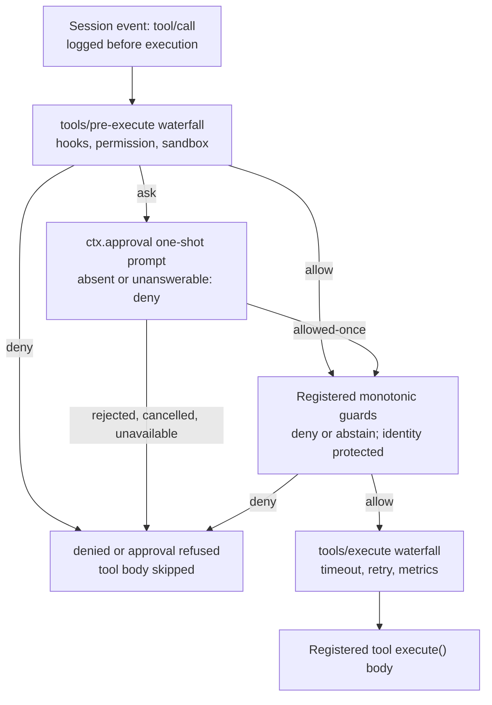

## 人类替模型回答的那个平面

到目前为止,前面几章讲的都是循环在无人旁观时自行运转的故事:模型调用工具,流水线校验并分发,结果返回。`interaction/` 这一组包,正是这个自动化故事出现停顿的地方。有四个很小的服务坐镇在这样一个 seam(接缝)上——不是另一个插件,不是某种策略折叠,而是由人类来决定一件模型自己无法决定的事情:

| 包 | 职责 | `ctx` 键 |
|---|---|---|
| [`user-approval/`](../../../packages/interaction/user-approval/README.md) | 为单个待决动作协调一次性审批决策。 | `ctx.approval` |
| [`permission-presets/`](../../../packages/interaction/permission-presets/README.md) | 把沙箱模式与审批策略打包成面向用户的具名预设。 | `ctx.permissionPresets` |
| [`user-questions/`](../../../packages/interaction/user-questions/README.md) | 与提供方无关的词汇,用于暂停工具调用直至人类回答问题。 | `ctx.userQuestions` |
| [`tool-ask-user/`](../../../packages/interaction/tool-ask-user/README.md) | 把 `ctx.userQuestions` 以 `ask_user_question` 工具的形式暴露给模型。 | 注册到 `ctx.tools` |

这些都是产品包,而非循环基础设施:它们通过与其他能力完全相同的 `ctx` 服务注入、事件 waterfall(瀑布式事件)与会话日志追加纪律来集成,不改动 `agent-loop`(智能体循环)本身。交互式宿主(Web 应用、CLI 提示)接好人类那一侧;自动化——ACP 桥接层——接的是机器那一侧。两边说的是同一套 seam 词汇。

## `ctx.approval`:一个问题,一个闭合的答案

审批 seam 只回答一个问题——*这个具体动作现在可以继续吗?*——仅此而已。它不记得过去的答案,不持久化任何授权,也没有「以后同类事情都放行」这种概念。每个 `ApprovalOutcome`(审批结果)都是以下四个闭合值之一:

```ts
type ApprovalOutcome = 'allowed-once' | 'rejected' | 'cancelled' | 'unavailable'
```

`allowed-once` 是唯一的放行,而且它只授权请求中描述的那一个动作——不更宽,也不管以后。剩下三个,从调用方角度看都是拒绝:人类明确的拒绝、被撤回的请求(调用方的 `AbortSignal` 触发)、或者应答者根本给不出决定。最后这种情况是刻意设计:缺失的应答者、抛异常的应答者,或者返回值不在闭合词汇表内的应答者,统统归一化为 `unavailable`,而不会悄悄变成放行。这个 seam 在结构上就是失败即拒绝——不存在任何一条代码路径能让「没人回答」变成「继续执行」。

### 请求

```ts
interface ApprovalRequest {
  readonly agent: Agent
  readonly toolName: string
  readonly callId?: CallId
  readonly reason?: string
  readonly signal?: AbortSignal
}
```

注意这里缺了什么:工具参数。请求通过 `callId` 标识*究竟是哪一次*工具调用正在被决定——UI 应答者把提示附加到已经流式呈现给用户的那次工具调用上,而不是再渲染一份可能与实际执行内容产生偏差的参数副本。`agent` 用于路由这个问题(应答者只会为它所拥有的 agent 应答),并决定审计轨迹落到哪个会话上。

### 分发:先看策略,再走 waterfall

`ApprovalService.request(req)` 首先要求发起请求的会话处于一个尚未结束的轮次内——下面的审计事件对必须被包裹在 `turn/start`/`turn/end` 边界内,因为在轮次之间追加的事件,重新加载时无法与崩溃尾部区分,会被静默丢弃;空闲会话发起的请求会在触碰日志之前就直接抛出异常。随后它追加 `approval/asked`(仅写日志,永远不进入模型 transcript),决定一个结果,追加对应的 `approval/decided`,然后返回:

```ts
async request(req: ApprovalRequest): Promise<ApprovalOutcome> {
  const session = req.agent.session
  if (!hasOpenTurn(session.events)) {
    throw new Error('approval.request() outside an open turn: …')
  }
  const id = ApprovalRequestId(randomUUID())
  session.append('approval/asked', { id, toolName: req.toolName, /* … */ })
  const outcome = await this.decide(req, session)
  session.append('approval/decided', { id, outcome })
  return outcome
}
```

在 `decide()` 内部:已经处于中止状态的 `req.signal` 会立即解析为 `cancelled`;否则服务会*在任何 waterfall 分发之前*检查该会话的生效 `ApprovalPolicy`——`'never'` 会在这里就确定性地解析为 `rejected`,因此即便有监听器以 `prepend: true` 注册,也无法抢在这个检查之前把它绕过去。在 `'ask'` 下,服务把 `approval/request` waterfall 分发给已组合的应答者,并把结果与 `req.signal` 赛跑,确保后到的中止信号依然能生效。如果两条审计事件中的任意一条在提交前失败,整次调用都会拒绝,而不会返回一个未记录在案的决定——asked/decided 这一对是硬性不变量,绝不是尽力而为的日志行。

### 应答者是按 agent 限定作用域的 waterfall 监听器

应答者要么返回一个闭合的 `ApprovalOutcome` 来认领这次决策,要么调用 `next()` 把请求继续向链条下游委托;链条的终端默认值(没有任何应答者认领)是 `'unavailable'`。`@deepseek-ai/dsh-scope` 会过滤分发,使得限定 agent 作用域的监听器只能看到它所拥有的那些 agent 的请求——一次部署应当只组合一个终端应答者,因为同级监听器的注册顺序并不是一种优先级机制。

ACP 自动化桥接层是参照实现的机器应答者,直接注册在 `approval/request` 上:它通过 `conn.requestPermission()` 只提供两个一次性选项(`allow-once`、`reject-once`),标注上正在被决定的确切 `callId`,并把客户端的选择直接映射为 `ApprovalOutcome`——绝不会从一个无法识别的响应中推断出一次持久授权。

```ts
ctx.on('approval/request', (request, next) => {
  const record = ownedRecord(request.agent)
  if (record === undefined || request.callId === undefined) return next()
  return conn.requestPermission({
    sessionId: record.agent.session.id,
    toolCall: { toolCallId: request.callId },
    options: [
      { optionId: 'allow-once', name: 'Allow once', kind: 'allow_once' },
      { optionId: 'reject-once', name: 'Reject', kind: 'reject_once' },
    ],
  }).then(({ outcome }) => {
    if (outcome.outcome === 'cancelled') return 'cancelled'
    return outcome.optionId === 'allow-once' ? 'allowed-once' : 'rejected'
  })
})
```

### 两个消费方,同一条 seam

`ctx.tools` 的流水线是主要消费方。当某个 `tools/pre-execute` 监听器返回 `{ kind: 'ask', reason? }` 时,`ToolRuntime.serviceAsk()` 会机会性地(用 `ctx.get('approval')`,而不是硬性注入——没有装配该插件的部署会退化为拒绝)通过 `ctx.approval` 来解析它,再把每种结果映射为各自面向模型的拒绝文本,好让模型能分辨出「用户说了不」和「根本没人可问」的区别:

```ts
const outcome = await approval.request({
  agent: exec.agent, toolName: exec.name, callId: exec.callId,
  ...ask.reason !== undefined ? { reason: ask.reason } : {}, signal: exec.signal,
})
switch (outcome) {
  case 'allowed-once': return { decision: { kind: 'allow' }, approvalCancelled: false }
  case 'rejected': return { decision: { kind: 'deny', reason: `the user rejected tool "${exec.name}"` }, approvalCancelled: false }
  case 'cancelled': return { decision: { kind: 'deny', reason: `approval for tool "${exec.name}" was cancelled` }, approvalCancelled: true }
  case 'unavailable': return { decision: { kind: 'deny', reason: `tool "${exec.name}" requires approval, but no approval channel is available` }, approvalCancelled: false }
}
```

沙箱升权闸门(`packages/sandbox/sandbox/src/escalation.ts`)是第二个消费方,它说明这条 seam 确实是共享机制,而不是某个工具的专属逻辑:当一次 bash 或文件系统调用请求把它的 `sandbox_permissions`(沙箱权限)拓宽到超出当前模式时,`approveEscalation()` 首先针对该次调用的生效模式检查是否严格拓宽(这是一个执行期检查,而非 schema 约束),然后通过*完全相同*的 `approval.request()` 调用,携带一个自描述的理由(`escalate sandbox to ${mode}: ${justification}`),再把同样的四种结果映射为不同的抛出错误。两个不同的家族——通用工具流水线与沙箱升权重试——共享同一套词汇、同一种审计格式、同一个失败即拒绝的保证,因为两者都是直接借助 `ctx.approval`,而不是各自重新发明一套。

### 按会话的策略:`ask` 与 `never`

```ts
type ApprovalPolicy = 'ask' | 'never'
```

`'ask'` 是默认值:委托给已组合的应答者 waterfall。`'never'` 是确定性的无头姿态(CI、无人值守运行)——每次询问都会解析为 `rejected`,连 waterfall 都不会分发,这个判断甚至在 waterfall 运行之前就已做出。生效策略取会话日志中最后一条 `approval/policy` 事件,回退到插件配置的默认值;`setApprovalPolicy(session, policy)` 是唯一的写入路径,因此回放日志就能重建覆盖值,不需要任何独立的追赶状态。`ApprovalService.setPolicy(agent, policy)` 是实时切换的入口:它写入事件,并注入一条 `user/message`,告诉模型策略已经变化,例如 `The approval policy changed from "ask" to "never" (changed by the user).`

两种策略值都会把各自完整的当前含义贡献给组装请求时生成的运行时上下文快照——在 `'ask'` 下,模型会读到审批可能被咨询、缺少应答者时会失败即拒绝;在 `'never'` 下,模型会读到审批提示已被禁用,不必再费心请求 `sandbox_permissions`。这是仅追加的:快照落在保留历史之后,而不是改写稳定的系统提示词前缀,因此一次策略切换不会使切换之前已经建立起来的 KV cache 失效。

值得单独一提的一种特殊情形是:由父 agent 委派的 subagent(子智能体),其审批策略无论父级自身的策略如何,始终会被固定为 `'never'`,记录为 `approval/policy { policy: 'never', source: 'delegation' }`。一个请求审批的子级本来就没有任何应答者在关注它——subagent 会话没有自己的交互界面——因此,与其让子级静默卡住,不如把它整个的权限故事在委派那一刻就由继承而来的沙箱范围一次性固定下来,任何拓宽的决定都属于父级。

## `ctx.permissionPresets`:把两个旋钮打包成一个选择器

审批策略是决定 agent 在不请示的情况下能做多少事的两个独立旋钮之一;另一个是[沙箱模式](../s08-capability-seams/README.zh.md)(`SandboxMode`:`read-only` | `workspace-write` | `danger-full-access`,由 `dsh-sandbox-policy` 的 `sandbox/mode` 事件拥有)。把这两个旋钮分别暴露给用户虽然精确,却并不友好。`PermissionPresetService`(`ctx.permissionPresets`)是一层很薄的封装,把二者打包成具名预设,供客户端渲染为单个选择器,而执行、提示词叙述与回放仍然一如既往地各读各自旋钮的折叠结果——预设永远不会成为「实际执行什么」的第三个信源。

```ts
interface PresetSpec {
  sandbox: SandboxMode
  approval: ApprovalPolicy
  name?: string
  description?: string
}
```

默认预设表自带两项:

| 预设 | `sandbox` | `approval` | 含义 |
|---|---|---|---|
| `workspace-write` | `workspace-write` | `ask` | 在工作区与允许的临时目录内写入;更宽的重试需要审批。 |
| `danger-full-access` | `danger-full-access` | `never` | 完全文件访问,不弹审批提示。 |

名称 `custom` 是保留字,不能出现在已配置的表中——如果出现,插件会在加载时直接抛出异常,因为 `custom` 命名的是一种*派生*状态,绝不是配置状态。该服务还要求存在一个具有约束能力的 `ctx.shell` 执行器:如果组合在一个没有 `sandboxMode` 能力事实的执行器之上,会在加载时抛出异常,因为一个捆绑了沙箱模式的预设,如果没有可约束的执行器,就毫无意义。

### 推导当前预设,以及何时变成 `custom`

`current(events)` 不会孤立地只读自己的事件——它先折叠会话的生效沙箱模式与生效审批策略,再判断这个*组合*究竟匹配表中的哪一项。当两个预设恰好共享同一组取值时,仍然匹配的上一次记录的选择会赢得平局;否则声明顺序中第一个匹配的表项获胜;如果当前生效的旋钮组合在整张表里都匹配不到任何项,答案就是 `CUSTOM_PRESET`(`'custom'`)——客户端可以把它显示出来,但它绝不是切换目标,也绝不会出现在任何事件 payload 中。

```ts
private derive(state: KnobState): string {
  const sandbox = state.sandbox ?? this.ctx.shell.sandboxMode
  const approval = state.approval ?? this.ctx.approval.config.policy ?? 'ask'
  const matches = (spec: PresetSpec): boolean => spec.sandbox === sandbox && spec.approval === approval
  if (state.preset !== null) {
    const spec = this.presets[state.preset]
    if (spec !== undefined && matches(spec)) return state.preset
  }
  for (const [name, spec] of Object.entries(this.presets)) {
    if (matches(spec)) return name
  }
  return CUSTOM_PRESET
}
```

### 切换:选择事件先于旋钮写入

`set()` 解析预设(未知名称会抛出异常),仅在预设确实发生变化时追加一条仅写日志的 `permission/preset` 事件,然后通过每个旋钮*各自*的规范 setter——`setSandboxMode` 与 `setApprovalPolicy`——写入,而且只对生效值真正会改变的那个旋钮写入。重新选择已经生效的预设则什么都不追加。

```ts
private apply(session: Session, name: string, setApproval: (policy: ApprovalPolicy) => void): void {
  const spec = this.resolve(name)
  if (this.current(session.events) !== name) {
    session.append('permission/preset', { preset: name })
  }
  const events = session.events
  if (spec.sandbox !== (effectiveSandboxMode(events) ?? this.ctx.shell.sandboxMode)) {
    setSandboxMode(session, spec.sandbox)
  }
  if (spec.approval !== (effectiveApprovalPolicy(events) ?? this.ctx.approval.config.policy ?? 'ask')) {
    setApproval(spec.approval)
  }
}
```

`permission/preset` 永远不会进入模型 transcript;由它触发的旋钮事件才通过各自的消费方(上面提到的审批策略语句、沙箱模式自身的运行时上下文贡献)拥有一切模型可见的后果。它唯一的职责,是在两个预设恰好捆绑同一组沙箱/审批取值、`current()` 需要一个断线胜出规则时,保住用户究竟选中的是哪一个预设。

两个可选子功能架设在同一服务之上,只有在各自的注册表被组合时才会激活:一个 `permissions` 会话投影单元(把三个旋钮事件折叠成一个 `PermissionSelect`——选项加当前值——供 UI 渲染),以及一个 `/permission` 命令(`packages/interaction/permission-presets/src/index.ts:257-277`),不带参数调用时报告当前预设,带一个参数调用时经 `set()` 切换。

## `ctx.userQuestions`:与提供方无关的人机问答 seam

审批回答的是关于单个待决动作的是/否问题,而 `UserQuestionService` 则是更通用的 seam,供工具或权限插件在需要人类做出更丰富的决定时使用——从若干选项中挑一个、输入自由文本,或者两者兼有——然后 agent 才能继续。

```ts
interface UserQuestionProvider {
  ask(request: AskUserQuestionRequest): Promise<AskUserQuestionAnswer>
}
```

同一个上下文中只能有一个活跃的提供方;`registerProvider()` 绑定到 effect,因此 dispose(资源释放,如 HMR、卸载)能干净地移除当前活跃的 UI,而第二次注册会直接抛出 `DUPLICATE_PROVIDER`,而不是悄悄替换第一个。如果一个提供方都没有注册,`ask()` 会抛出 `NO_PROVIDER`。

### 请求的形态

```ts
interface AskUserQuestionItem {
  id: string
  question: string
  detail?: string
  header?: string
  options?: AskUserQuestionOption[]
  multiSelect?: boolean
  intent?: AskUserQuestionIntent
}

interface AskUserQuestionRequest {
  questions: AskUserQuestionItem[]
  agent?: Agent
  signal?: AbortSignal
}
```

`questions` 是数组,这样一次请求就能批量提出若干相关提示,同时每个问题都保有调用方提供的、稳定的 `id`,并原样附着在其回答上。`detail` 是提供方会随问题一起渲染、但不会变成可选选项的辅助文本——这对唯一内置的呈现 `intent`(意图)`plan-review` 尤为重要,它指名一个 `approve` 选项标签,并要求 `detail` 携带待审阅的计划文本。`ask()` 会校验两项类型系统无法表达的断言——`approve` 未命中该问题自身的任何一个选项,或者某个意图落在没有 `detail` 的问题上——并以 `BAD_INTENT` 拒绝,而不是让一个自相矛盾的请求抵达 UI 层渲染出无意义的内容。

### 由运行时归属决定谁能提问,而非持久谱系

当调用方提供了 agent 时,`ask()` 首先检查它是否是注册表当前追踪的那个确切存活实例(否则抛出 `CALLER_NOT_LIVE`——过期引用会被拒绝,而不是被悄悄路由过去),然后检查它是否是运行时根,而不是被拥有的子级(否则抛出 `DELEGATED_CALLER`):

```ts
if (agents === undefined || agents.get(agent.id) !== agent) {
  throw new UserQuestionError('human interaction requires the exact live calling agent when an agent is supplied', 'CALLER_NOT_LIVE')
}
if (!agents.roots().includes(agent)) {
  throw new UserQuestionError(
    "human interaction is unavailable while the calling agent is owned by another live agent; "
    + "include the unresolved question or decision in the child agent's final result",
    'DELEGATED_CALLER')
}
```

一个被委派的 subagent 没有属于自己的人类应答者,如果放任不管就会永远阻塞等待;这个修复是架构层面的,而不是一个超时——子级必须把尚未解决的问题或决策写进自己的最终结果里。这里判断的是调用那一刻的*运行时*归属,而不是持久化的会话谱系:一个带有历史委托深度的会话,在之后被恢复为全新的运行时根时,可以正常提问;而一个归属于另一个 agent 的存活子级,即便它持久化记录的委托深度恰好是零,依然会被拒绝。

### 回答的形态

```ts
interface AskUserQuestionAnswerItem {
  id: string
  selected: string[]
  custom?: string
}
```

对单选题而言,`custom`(自由文本)会覆盖已选中的选项,`selected` 为空。对多选题而言,`custom` 可以在 `selected` 已有的标签之外补充。UI 也可以用一个 `selected` 为空且没有 `custom` 的回答项,来记录一个被有意跳过的问题,同时保留同一批次中其余的回答。

## `ask_user_question`:把问题递到人类面前的工具

`dsh-tool-ask-user` 是把 `ctx.userQuestions` 变成模型可见工具的 Consumer(消费方)。它只注册一个工具,`ask_user_question`,其 `execute` 把模型参数翻译成一个 `AskUserQuestionRequest`,再把人类的 `AskUserQuestionAnswer` 翻译回工具规范的 `{ answers: [...] }` 返回值——仅此而已:

```ts
async execute(args, exec) {
  const result = await ctx.userQuestions.ask({
    questions: args.questions.map(question => ({ id: question.id, question: question.question, /* … */ })),
    ...exec.agent !== undefined ? { agent: exec.agent } : {},
    signal: exec.signal,
  })
  return { answers: result.answers.map(answer => ({ id: answer.id, selected: [...answer.selected], /* … */ })) }
}
```

它不渲染 UI,也不了解输入是怎么收集来的;那完全是已注册提供方的职责。因为 `execute` 把 `exec.agent` 和 `exec.signal` 原样传递下去,这次工具调用就免费继承了上面描述的每一条规则:被委派的 subagent 调用会以 `DELEGATED_CALLER` 失败,被中止的轮次会解析为 `ASK_ABORTED`,缺失的提供方会解析为 `NO_PROVIDER`——全部作为普通的工具错误呈现给模型,供其读取并作出反应。

## 一次工具调用如何最终变成一次人类决策

下面这张图取自 harness 自己生成的[工具执行流水线](../../../docs/tool-execution-pipeline.md)中与 `ctx.approval` 相关的那一段,原样复刻——`tools/pre-execute` 是 `ask` 决策的起点,`approval` 之后的一切,都是所有其他工具调用共用的那条受守卫的流水线。



具体来看,追踪[审批 seam 的 Agent Note](../../../.agents/notes/implemented/feature/2026-07-06-approval-seam.md)中一次真实的沙箱升权审批:模型调用 `bash`,携带 `sandbox_permissions: "workspace-write"` 与一段 `justification`(理由);升权闸门通过 `ctx.approval.request()` 解析,先记录 `approval/asked`,再把 waterfall 分发给 ACP 桥接层,后者向客户端发送 `session/request_permission`,携带确切的 `callId` 与两个一次性选项。用户选择「Allow once」;桥接层返回 `allowed-once`;服务记录 `approval/decided`;调用在更宽的模式下执行;授权也随之终结——下一次调用即便是同一种或更宽的模式,依然要重新询问。反过来,如果用户选择拒绝,则什么都不会执行:模型的工具结果会携带发起方那段确切的失败即拒绝文本,`the user rejected escalating this command to "workspace-write"`。

## 把四个包串在一起的东西

这四个服务没有一个改动了 `agent-loop`。它们都是同一种形态的实例:一条能力 seam,一侧插着面向人类的消费方(某个 UI、ACP 桥接层),另一侧插着面向模型或面向策略的消费方(`ctx.tools`、沙箱升权闸门、`ask_user_question`),而 seam 自身只拥有共享的词汇、审计/日志纪律,以及失败即拒绝的默认值。`ctx.approval` 和 `ctx.userQuestions` 从不自己渲染任何东西;`ctx.permissionPresets` 也从不自己强制执行任何东西——它只是通过 `ctx.approval` 和 `dsh-sandbox-policy` 已经拥有的那些 setter 写入。这四者全都是可选的:一个一个都不组合的无头部署,得到的是确定性、可审计的拒绝(`unavailable`、`NO_PROVIDER`),而不是卡死或悄悄绕过——因为「没有应答者」和「没有提供方」在各自的闭合词汇表里都是一等状态,而不是隐含的空白。
