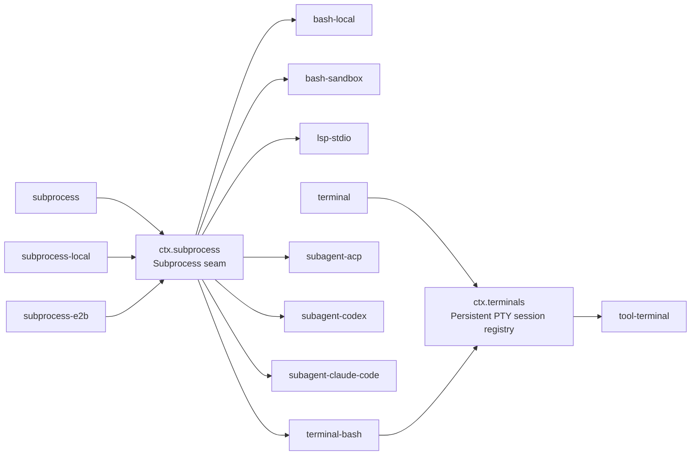

## One execution world, two layers of seam

[The capability seams primer](../s07-capability-seams-primer/README.md) worked through `ctx.shell` as the canonical three-role trio. This chapter goes one layer deeper: `dsh-bash-local` does not spawn processes itself. It resolves a `ShellExecRequest` into a `ShellExecSpec` and hands the actual spawning to a service it injects — `ctx.subprocess`. That service is a capability seam in its own right, and its Consumers are not limited to bash. The persistent-PTY backend, the LSP host, and three out-of-process subagent providers all spawn through the same `ctx.subprocess` seam, which is why `docs/architecture.md` states the payoff directly:

> "Filesystem and subprocess providers share one execution world, so pointing them at a remote sandbox moves Bash, PTY, and LSP with them, with no provider forks."

This chapter has two parts. First, `ctx.subprocess` — the low-level process substrate shared by everything that runs a child process or allocates a terminal. Second, `ctx.terminals` — a smaller, separate seam built on top of `ctx.subprocess.spawnTerminal`, for interactive sessions that must survive across many tool calls rather than complete within one.

## The `ctx.subprocess` seam: Service Definition and Provider

| Package | ctx key | Role | What it owns |
|---|---|---|---|
| [`dsh-subprocess`](../../../packages/subprocess/subprocess/README.md) | `ctx.subprocess` | Service Definition | The abstract `SubprocessRuntime` class: executable lookup, the fully-specified managed spawn, one terminal-process primitive, and the shared `DSH_*` environment/output vocabulary |
| [`dsh-subprocess-local`](../../../packages/subprocess/subprocess-local/README.md) | — | Service Provider | Detached process trees, bounded collection with spill files, `node-pty` allocation, foreground/session inspection, tree signalling, and terminate-and-join disposal |

`docs/capability-seams.md` classifies `ctx.subprocess` as a `seam` row (not `core`, not `bundle`) — it lists two known Service Providers (`subprocess-local`, and the remote `subprocess-e2b`) and seven direct Consumer packages. That row is the generated source for the fan-out this chapter is about.

The Service Definition owns exactly three verbs, and nothing about command defaulting, shell semantics, or presentation:

```ts filename="packages/subprocess/subprocess/src/index.ts"
export abstract class SubprocessRuntime extends Service {
  constructor(ctx: Context) {
    super(ctx, 'subprocess')
  }

  abstract resolveExecutable(
    command: string,
    env?: Readonly<Record<string, string>>,
    signal?: AbortSignal,
  ): Promise<string>

  abstract spawn(spec: SubprocessSpawnSpec): SubprocessHandle

  abstract spawnTerminal(spec: SubprocessTerminalSpawnSpec): Promise<SubprocessTerminalHandle>
}
```

:::concept{term="resolveExecutable"}
Verifies an absolute path or resolves a bare name against the provider's own scrubbed `PATH` — the executable lookup happens inside whichever execution world the provider represents, local or remote.
:::

:::concept{term="spawn"}
Returns a live handle immediately; its `done` promise resolves at process close with exit facts and never carries output or a cause classification — timeout versus cancellation is a caller concern, not the service's.
:::

:::concept{term="spawnTerminal"}
Called out in its own JSDoc as "the only non-pipe primitive": it is the one method that allocates a real terminal instead of a stream.
:::

`LocalSubprocessRuntime` is the one concrete subclass mounted in ordinary compositions:

```ts
// packages/subprocess/subprocess-local/src/index.ts:37
export class LocalSubprocessRuntime extends SubprocessRuntime {
```

It has no `Config` — every disposition, limit, terminal dimension, and grace period arrives on the spec from the calling Consumer, which is the same "explicit spec, no hidden service default" pattern `dsh-shell`'s request/spec split established for bash. `spawnTerminal`'s local implementation is a thin wrapper over `node-pty`:

```ts
// packages/subprocess/subprocess-local/src/index.ts:161-176 (abridged)
async spawnTerminal(spec: SubprocessTerminalSpawnSpec): Promise<SubprocessTerminalHandle> {
  const file = spec.argv[0]
  // ...validate argv, build IPtyForkOptions from spec.rows/cols/cwd/env...
  const terminal = nodePty.spawn(file, [...spec.argv.slice(1)], options)
  const handle = new LocalTerminalHandle(terminal, inspector, spec.graceMs)
  this.terminals.add(handle)
  // ...release from the live set once the handle's terminate() settles...
  return handle
}
```

## The key insight: one substrate, seven Consumers

`docs/capability-seams.md`'s `ctx.subprocess` row lists these direct Consumers: `bash-local`, `bash-sandbox`, `terminal-bash`, `lsp-stdio`, `subagent-acp`, `subagent-codex`, `subagent-claude-code`. Each package's own README confirms the injection independently:

- **Bash** — `dsh-bash-local` and `dsh-bash-sandbox` map a resolved `ShellExecSpec` onto `['bash', '-c', command]` and call `ctx.subprocess.spawn()`.
- **The LSP host** — `dsh-lsp-stdio` `inject`s `['fs', 'lsp', 'subprocess']` and launches every configured language server through the same seam, so "a deployment must mount filesystem and subprocess providers for the same execution world."
- **The PTY shell backend** — `dsh-terminal-bash` `inject`s `['terminals', 'sandboxPolicy', 'subprocess']` and calls `ctx.subprocess.spawnTerminal()` for every session (detailed below).
- **Three out-of-process subagent providers** — `dsh-subagent-acp`, `dsh-subagent-codex`, and `dsh-subagent-claude-code` each `inject` `['subagents', 'subprocess']`. The ACP provider's README states it plainly: "the child spawns through the `dsh-subprocess` seam" — credential-shaped and `DSH_*` ambient names are scrubbed, explicit `config.env` merges after, and disposal escalates through the same `SIGTERM`→grace→`SIGKILL` tree-termination verb every other Consumer uses.

This is the concrete shape of "one execution world": none of these six Consumer packages import `LocalSubprocessRuntime`, `node-pty`, or a process-tree signalling routine of their own. They all program against the same three abstract methods. The payoff shows up when the provider changes rather than the Consumers: `dsh-subprocess-e2b` is a second Service Provider — its README opens by saying "Load `dsh-e2b` first, then this service in place of `dsh-subprocess-local`. Existing Bash, PTY, and LSP consumers then execute in the shared remote sandbox without E2B-specific capability packages." Swap the one provider line in a `cordis.yml`, and bash, the PTY backend, the LSP host, and every out-of-process subagent transport all start spawning inside the remote sandbox — with zero changes to any of the six Consumer packages above.



(Adapted from the `ctx.subprocess` and `ctx.terminals` rows of the generated `docs/capability-seams.md` graph.)

> [!NOTE]
> `terminal-bash` appears twice in the graph: once as a Consumer of `ctx.subprocess`, once as the Service Provider registering under `ctx.terminals`. A package plays different roles in different seams — the primer's rule against folding roles applies *within* one seam, not across two seams that happen to compose vertically.

## Why `spawnTerminal` is not just another `spawn`

:::decision
An ordinary `spawn()` hands the caller pipes: bytes in, bytes out, an exit code at the end. That is sufficient for bash and for LSP's JSON-RPC framing, but it cannot express what an interactive shell needs — a real controlling terminal, a foreground process group that can receive `SIGINT`, and cleanup that reaches every process in a PTY session rather than just the direct child.

The Service Definition's JSDoc is explicit that this is deliberately the *only* exception to the pipe model: "ordinary pipes cannot allocate a controlling terminal or clean terminal-session members." `spawnTerminal` returns a `SubprocessTerminalHandle` that owns real PTY allocation, UTF-8 text I/O, foreground-process-group inspection and signalling, and one awaited `terminate()` that reaches quiescence for every session member the provider can still observe. Readiness detection, scrollback retention, and prompt policy are explicitly *not* part of this primitive — "these operations remain one substrate primitive... readiness, scrollback, and owner policy remain in the PTY consumer." That consumer is `dsh-terminal-bash`, covered next.
:::

## `ctx.terminals`: a smaller seam for sessions that outlive one tool call

A one-shot `bash` call resolves a request, spawns, waits for `done`, and returns — the process and its handle are gone by the time the model sees a result. Some workflows need the opposite: a shell whose current directory, exported variables, activated virtualenv, or a running REPL persists *across* several separate tool calls from the model. That is what `ctx.terminals` exists for, and — per the [persistent PTY Agent Note](../../../.agents/notes/implemented/feature/2026-07-16-persistent-pty-sessions.md) — it "follows the repository's capability pattern, coexists with the existing command and filesystem tools, and does not change `agent-loop`." It is a genuinely separate, smaller seam from `ctx.subprocess`, not a mode flag on it.

| Package | ctx key | Role | What it owns |
|---|---|---|---|
| [`dsh-terminal`](../../../packages/terminal/terminal/README.md) | `ctx.terminals` | Service Definition | `TerminalSessionService`: branded session ids, backend registry, exact-Agent ownership, and awaited cleanup |
| [`dsh-terminal-bash`](../../../packages/terminal/terminal-bash/README.md) | registers on `ctx.terminals` | Service Provider | Shell backend over `ctx.subprocess.spawnTerminal`: readiness detection, bounded terminal state, sandbox policy |
| [`dsh-tool-terminal`](../../../packages/terminal/tool-terminal/README.md) | registers on `ctx.tools` | Consumer | Six model-facing tools: `terminal_open`, `terminal_send`, `terminal_read`, `terminal_signal`, `terminal_close`, `terminal_list` |

### What makes a PTY session its own seam

`docs/capability-seams.md`'s `ctx.terminals` row also classifies it a `seam` (one Service Definition package, one known backend, one Consumer today — the pattern does not require multiple providers to already exist, only that the roles are designed to allow it). Two facts distinguish this from ordinary subprocess use:

1. **Owner-scoped identity that survives.** `TerminalSessionService` "mints opaque session ids, routes creation through named backends, fences every operation to the exact live `Agent`." A `TerminalSessionId` is meaningless to any agent other than the one that opened it — `dsh-tool-terminal`'s README states this as a security property: "a model cannot address another agent's terminal even if it learns the id." An ordinary subprocess handle has no such concept; it belongs to whichever code called `spawn()` and typically does not outlive that call.
2. **Multiple operations against one live session.** A subprocess handle is written once (or streamed once) and waited on. A terminal session accepts a `spawn`, then any number of separate `startSend`/`read`/`signal` calls across separate tool-call turns, until an explicit `terminal_close` — or the owning Agent disposing — tears it down. "One session accepts at most one live send operation... another send fails until the operation settles," which is a concurrency contract that only makes sense for a session meant to be reused repeatedly.

`dsh-terminal-bash` is the package that bridges the two seams. It `inject`s `['terminals', 'sandboxPolicy', 'subprocess']`:

```ts
// packages/terminal/terminal-bash/src/index.ts:23-25
export const name = 'terminal-bash'
export const inject = ['terminals', 'sandboxPolicy', 'subprocess']
```

and its `BashTerminalBackend` defaults its terminal allocation directly to the lower seam:

```ts
// packages/terminal/terminal-bash/src/index.ts:108-110
private readonly spawnTerminal: (
  spec: SubprocessTerminalSpawnSpec,
) => Promise<SubprocessTerminalHandle> = spec => ctx.subprocess.spawnTerminal(spec),
```

Everything `dsh-terminal-bash` adds on top — a private bash prompt marker for readiness, bounded line-oriented scrollback, sandbox-mode fencing so a session cannot survive a permission downgrade, `SIGINT` delivery to the foreground process group on cancellation — is PTY-consumer policy layered over the substrate primitive; none of it duplicates what `ctx.subprocess` already owns. Its own README states the composability this buys: "the same PTY backend therefore composes with local or remote execution-world providers" — swap `subprocess-local` for `subprocess-e2b`, and `dsh-terminal-bash` needs no changes to keep working.

## Where the generated docs lag the source

:::fold[The `tool-bash-persistent` injection the graph missed]
`docs/capability-seams.md`'s `ctx.terminals` row lists exactly one direct Consumer: `tool-terminal`. But `packages/shell/tool-bash-persistent/` — a different package, in the `shell/` group, not `terminal/` — also injects the service directly:

```ts
// packages/shell/tool-bash-persistent/src/index.ts:401-402
export const name = 'tool-bash-persistent'
export const inject = ['tools', 'terminals']
```

`dsh-tool-bash-persistent` is a model-facing `bash(command)` tool that keeps one owner-scoped `ctx.terminals` shell alive per Agent — same persistence idea as `dsh-tool-terminal`, but exposed as a single familiar `bash` tool name instead of the six explicit `terminal_*` operations, wrapping each command in start/end markers and parsing the shell's own exit status back out of the scrollback. It is a second, independently-shipped Consumer of `ctx.terminals` that the generated capability-seam graph does not yet enumerate. This is a small, concrete instance of a general fact: `docs/capability-seams.md` is generated from a fixed scan (`pnpm run gen-doc-graphs`), and a new injection site in a package the generator's Consumer-detection did not anticipate can land in source before it lands in that table. The source `inject` array is the ground truth; the generated table is a snapshot of it.
:::

## Summary

- `ctx.subprocess` is the low-level process-spawning seam: one Service Definition (`dsh-subprocess`), one local Service Provider (`dsh-subprocess-local`, with `dsh-subprocess-e2b` as a remote alternative), and direct Consumers spanning bash, the LSP host, the PTY backend, and three out-of-process subagent transports.
- Swapping the one `ctx.subprocess` provider moves every one of those Consumers to a different execution world at once — that fan-out, not any single Consumer, is the seam's payoff.
- `spawnTerminal` is the one non-pipe primitive on that same Service Definition: real PTY allocation, foreground-group signalling, and whole-session cleanup, with readiness and presentation left to the PTY consumer.
- `ctx.terminals` is a distinct, smaller seam layered on top, for sessions with owner-scoped identity that must survive across many separate tool calls rather than complete within one — a concurrency and authorization contract that plain subprocess handles do not need.
- `dsh-terminal-bash` plays two roles at once, in two different seams: Consumer of `ctx.subprocess`, Service Provider of `ctx.terminals` — composing seams vertically is normal; folding roles within one seam is what the pattern forbids.
