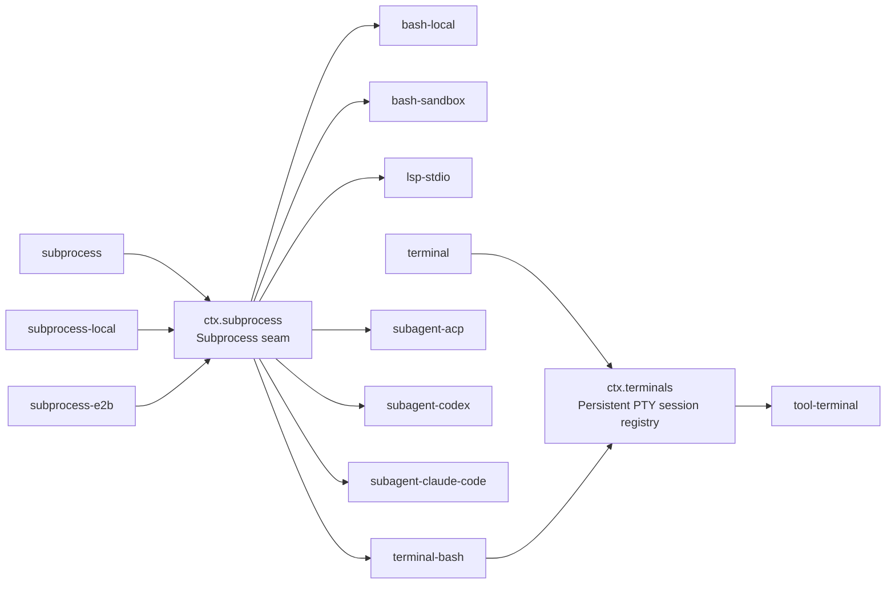

## 一句话版本

harness 里所有要运行子进程或分配终端的模块——bash、LSP 主机、PTY shell 后端,以及三个进程外 subagent 传输——都经由同一条底层 seam `ctx.subprocess` 来 spawn。换掉这一个 Provider,上述每一个 Consumer 会同时迁入另一个执行世界;这种扇出,而非任何单一 Consumer,才是它的收益。在它之上还叠着第二条更小的 seam `ctx.terminals`,服务于那些身份必须跨越多次工具调用存活、而非在一次调用内完成的交互式会话。本章先讲基底,再讲建在它之上的会话 seam。

## 速览

三个术语组织起整章——一个执行世界,两条纵向叠放的 seam:

:::concept{term="execution world"}
一组就「进程在哪里跑、文件在哪里存」达成一致的 Provider。把文件系统与子进程 Provider 指向远程沙箱,Bash、PTY 与 LSP 会一起迁移——无需任何 Provider 分叉。
:::

:::concept{term="ctx.subprocess / SubprocessRuntime"}
底层的进程 spawn seam:一个抽象 Service Definition,只有三个动词(`resolveExecutable`、`spawn`、`spawnTerminal`),配一个本地 Provider 与一个远程(`e2b`)替代。
:::

:::concept{term="ctx.terminals / TerminalSessionService"}
建在 `ctx.subprocess.spawnTerminal` 之上的一条独立的、更小的 seam:限定所有者范围的持久 PTY 会话,在显式关闭前可跨越多次独立工具调用接受任意次操作。
:::

## 一个执行世界,两层 seam

[能力接缝入门](../s07-capability-seams-primer/README.zh.md)以 `ctx.shell` 为范例,完整讲解了三角色组合。本章再往下深入一层:`dsh-bash-local` 自己并不 spawn 进程。它把 `ShellExecRequest` 解析为 `ShellExecSpec`,再把真正的 spawn 操作交给它注入的另一个服务——`ctx.subprocess`。这个服务本身就是一个独立的能力 seam,它的 Consumer 并不限于 bash。持久 PTY 后端、LSP 主机,以及三个进程外 subagent 提供方,全都通过同一个 `ctx.subprocess` seam 来 spawn 进程,这正是 `docs/architecture.md` 直接点明的收益:

> "Filesystem and subprocess providers share one execution world, so pointing them at a remote sandbox moves Bash, PTY, and LSP with them, with no provider forks."（文件系统与子进程提供方共享同一个执行世界,把它们指向远程沙箱时,Bash、PTY 与 LSP 会随之一起迁移,无需任何提供方分叉。)

本章分两部分。第一部分讲 `ctx.subprocess`——被所有运行子进程或分配终端的模块共享的底层进程基底。第二部分讲 `ctx.terminals`——建立在 `ctx.subprocess.spawnTerminal` 之上的一个更小、独立的 seam,专门服务那些必须跨越多次工具调用存活、而不是在一次调用内完成的交互式会话。

## `ctx.subprocess` seam:Service Definition 与 Provider

| 包 | ctx 键 | 角色 | 拥有什么 |
|---|---|---|---|
| [`dsh-subprocess`](../../../packages/subprocess/subprocess/README.md) | `ctx.subprocess` | Service Definition | 抽象类 `SubprocessRuntime`:可执行文件查找、完全明确指定的受管 spawn、一项终端进程原语,以及共享的 `DSH_*` 环境／输出词汇 |
| [`dsh-subprocess-local`](../../../packages/subprocess/subprocess-local/README.md) | 无 | Service Provider | detached 进程树、带 spill 文件的有界收集、`node-pty` 分配、前台／会话检查、进程树信号发送,以及先终止再等待退出的 dispose |

`docs/capability-seams.md` 把 `ctx.subprocess` 归类为 `seam` 行(既非 `core` 也非 `bundle`)——该行列出了两个已知的 Service Provider(`subprocess-local`,以及远程的 `subprocess-e2b`)和七个直接 Consumer 包。本章讲的这种扇出,正是来自这一生成文件行的原始素材。

Service Definition 只拥有三个动词,不涉及命令默认值补全、shell 语义或呈现方式:

```ts filename="packages/subprocess/subprocess/src/index.ts"
export abstract class SubprocessRuntime extends Service {
  constructor(ctx: Context) {
    super(ctx, 'subprocess')
  }

  abstract resolveExecutable(
    command: string,
    env?: Readonly<Record<string, string>>,
    signal?: AbortSignal,
  ): Promise<string>

  abstract spawn(spec: SubprocessSpawnSpec): SubprocessHandle

  abstract spawnTerminal(spec: SubprocessTerminalSpawnSpec): Promise<SubprocessTerminalHandle>
}
```

:::concept{term="resolveExecutable"}
验证绝对路径,或根据提供方自身清理后的 `PATH` 解析裸名称——可执行文件查找发生在提供方所代表的那个执行世界内部,无论是本地还是远程。
:::

:::concept{term="spawn"}
立即返回一个活动句柄;其 `done` promise 在进程关闭时以退出事实 resolve,从不携带输出,也不携带原因分类——超时与取消的区分是调用方的事,不属于该服务。
:::

:::concept{term="spawnTerminal"}
在自己的 JSDoc 中被明确称为「唯一的非管道原语」:它是唯一一个分配真实终端、而非流的方法。
:::

`LocalSubprocessRuntime` 是普通组合中挂载的那个具体子类:

```ts
// packages/subprocess/subprocess-local/src/index.ts:37
export class LocalSubprocessRuntime extends SubprocessRuntime {
```

它没有任何 `Config`——每项处置方式、限制、终端尺寸与宽限期都来自调用方 Consumer 传入的 spec,这与 `dsh-shell` 的 request/spec 拆分为 bash 建立的「spec 显式指定、服务不藏默认值」是同一种模式。它的 `spawnTerminal` 本地实现只是对 `node-pty` 的一层薄封装:

```ts
// packages/subprocess/subprocess-local/src/index.ts:161-176(节选)
async spawnTerminal(spec: SubprocessTerminalSpawnSpec): Promise<SubprocessTerminalHandle> {
  const file = spec.argv[0]
  // ...校验 argv,依据 spec.rows/cols/cwd/env 构建 IPtyForkOptions...
  const terminal = nodePty.spawn(file, [...spec.argv.slice(1)], options)
  const handle = new LocalTerminalHandle(terminal, inspector, spec.graceMs)
  this.terminals.add(handle)
  // ...句柄的 terminate() 结算后,将其从存活集合中释放...
  return handle
}
```

## 关键洞见:一个基底,七个 Consumer

`docs/capability-seams.md` 的 `ctx.subprocess` 行列出了以下直接 Consumer:`bash-local`、`bash-sandbox`、`terminal-bash`、`lsp-stdio`、`subagent-acp`、`subagent-codex`、`subagent-claude-code`。每个包自己的 README 都各自印证了这项注入:

- **Bash**——`dsh-bash-local` 与 `dsh-bash-sandbox` 把解析后的 `ShellExecSpec` 映射为 `['bash', '-c', command]`,再调用 `ctx.subprocess.spawn()`。
- **LSP 主机**——`dsh-lsp-stdio` 的 `inject` 是 `['fs', 'lsp', 'subprocess']`,所有配置的语言服务器都经由同一个 seam 启动,因此「部署必须为同一个执行世界挂载文件系统与子进程提供方」。
- **PTY shell 后端**——`dsh-terminal-bash` 的 `inject` 是 `['terminals', 'sandboxPolicy', 'subprocess']`,每个会话都调用 `ctx.subprocess.spawnTerminal()`(下文详述)。
- **三个进程外 subagent 提供方**——`dsh-subagent-acp`、`dsh-subagent-codex` 与 `dsh-subagent-claude-code` 各自的 `inject` 都是 `['subagents', 'subprocess']`。ACP 提供方的 README 直言:「子进程通过 `dsh-subprocess` seam spawn」——形似凭据与 `DSH_*` 环境名称会被清理,显式的 `config.env` 在清理之后合并,dispose 时经由同一套 `SIGTERM`→宽限期→`SIGKILL` 的进程树终止动词,与其他所有 Consumer 完全一致。

这正是「一个执行世界」的具体体现:上述六个 Consumer 包没有一个导入 `LocalSubprocessRuntime`、`node-pty`,或自行实现进程树信号发送逻辑。它们都面向同样的三个抽象方法编程。当 Provider 发生变化、而不是 Consumer 发生变化时,收益才真正显现:`dsh-subprocess-e2b` 是第二个 Service Provider——它的 README 开篇即说「先加载 `dsh-e2b`,再用这个服务取代 `dsh-subprocess-local`。既有的 Bash、PTY 与 LSP 消费方随即在共享远程沙箱中执行,无需任何 E2B 专属能力包」。只需在 `cordis.yml` 里替换那一行 Provider,bash、PTY 后端、LSP 主机,以及每一个进程外 subagent 传输,就会全部开始在远程沙箱内 spawn——上述六个 Consumer 包一行代码都不用改。



(改编自生成文件 `docs/capability-seams.md` 关系图中 `ctx.subprocess` 与 `ctx.terminals` 两行。)

> [!NOTE]
> `terminal-bash` 在图中出现了两次:一次是 `ctx.subprocess` 的 Consumer,一次是注册到 `ctx.terminals` 之下的 Service Provider。同一个包在不同的 seam 里扮演不同角色——入门篇「禁止合并角色」的规则约束的是*同一个* seam 内部,而不是两个纵向组合起来的独立 seam。

## 为什么 `spawnTerminal` 不只是另一个 `spawn`

:::decision
普通的 `spawn()` 交给调用方的是管道:字节进,字节出,末尾一个退出码。这对 bash 和 LSP 的 JSON-RPC 分帧已经足够,但它无法表达交互式 shell 所需要的东西——一个真正的控制终端、一个能接收 `SIGINT` 的前台进程组,以及能触达整个 PTY 会话中每个进程、而不只是直接子进程的清理机制。

Service Definition 的 JSDoc 明确指出这是刻意保留的、对管道模型的唯一例外:「普通管道无法分配控制终端或清理终端会话成员」。`spawnTerminal` 返回一个 `SubprocessTerminalHandle`,它拥有真实的 PTY 分配、UTF-8 文本 I/O、前台进程组检查与信号发送,以及一项须等待的 `terminate()`——它会让提供方仍可观察到的每一个会话成员都完全停稳。就绪检测、scrollback 保留与提示符策略都明确*不属于*这项原语的一部分——「这些操作保留为一项执行基底原语……就绪状态、scrollback 和所有者策略仍归 PTY 消费方所有。」这个消费方就是下面要讲的 `dsh-terminal-bash`。
:::

## `ctx.terminals`:服务于跨越多次工具调用的会话的更小 seam

一次性的 `bash` 调用会解析请求、spawn、等待 `done`、然后返回——模型看到结果时,进程和句柄早已消失。有些工作流恰恰需要相反的东西:一个 shell,它的当前目录、导出的环境变量、已激活的虚拟环境,或一个正在运行的 REPL,需要*跨越*模型的多次独立工具调用持续存在。这正是 `ctx.terminals` 存在的理由——根据[持久 PTY 会话 Agent Note](../../../.agents/notes/implemented/feature/2026-07-16-persistent-pty-sessions.md)所说,它「遵循仓库自身的能力模式,与既有的命令和文件系统工具共存,且不改变 `agent-loop`」。它是一个真正独立、比 `ctx.subprocess` 更小的 seam,而不是后者上的一个模式开关。

| 包 | ctx 键 | 角色 | 拥有什么 |
|---|---|---|---|
| [`dsh-terminal`](../../../packages/terminal/terminal/README.md) | `ctx.terminals` | Service Definition | `TerminalSessionService`:品牌化会话 id、后端注册表、精确的 Agent 所有权、等待完成的清理 |
| [`dsh-terminal-bash`](../../../packages/terminal/terminal-bash/README.md) | 注册到 `ctx.terminals` | Service Provider | `ctx.subprocess.spawnTerminal` 之上的 shell 后端:就绪检测、有界终端状态、沙箱策略 |
| [`dsh-tool-terminal`](../../../packages/terminal/tool-terminal/README.md) | 注册到 `ctx.tools` | Consumer | 6 个面向模型的工具:`terminal_open`、`terminal_send`、`terminal_read`、`terminal_signal`、`terminal_close`、`terminal_list` |

### 是什么让 PTY 会话成为独立的 seam

`docs/capability-seams.md` 的 `ctx.terminals` 行同样把它归类为 `seam`(目前只有一个 Service Definition 包、一个已知后端、一个 Consumer——这个模式并不要求已经存在多个 Provider,只要求角色被设计成允许多个 Provider 存在)。有两点事实使它区别于普通的子进程使用方式:

1. **能够存活的、限定所有者范围的身份。**`TerminalSessionService`「生成不透明的会话 id,通过具名后端路由创建操作,将每个操作限制在完全相同的活跃 `Agent` 内」。`TerminalSessionId` 对除了创建它的那个 agent 以外的任何 agent 都没有意义——`dsh-tool-terminal` 的 README 把这一点表述为一项安全属性:「即使模型获知另一个 agent 的 id,也无法操作其终端。」普通的子进程句柄没有这种概念;它只属于调用 `spawn()` 的那段代码,通常也不会活过那次调用。
2. **对一个活跃会话的多次操作。**子进程句柄只写入一次(或流式传输一次)然后等待结算。而终端会话接受一次 `spawn`,之后可以在跨越多个独立工具调用回合的过程中,进行任意次数的 `startSend`/`read`/`signal` 调用,直到显式的 `terminal_close`——或所有者 Agent 被 dispose——才会关闭它。「一个会话最多接受一个活跃的发送操作……在当前操作结算前,另一项发送会失败」,这是一种只有为反复重用而设计的会话才需要的并发约定。

### 会话生命周期,端到端

一个持久终端会话从分配到拆除有明确的形态——而且与一次性 `spawn` 不同,它的每个阶段都是一个独立的工具调用回合:

:::timeline
- terminal_open —— 通过具名后端路由创建;`ctx.subprocess.spawnTerminal` 分配 PTY,服务生成一个限定到确切所有者 `Agent` 的不透明会话 id
- terminal_send / terminal_read / terminal_signal —— 跨越多个独立工具调用回合的任意次操作;同一时刻最多一个活跃 send,另一项发送在当前操作结算前会失败
- terminal_close —— 显式拆除,或由所有者 `Agent` 的 dispose 拆除会话
- 终止升级 —— dispose 经由共享的 `SIGTERM` → `graceMs` → `SIGKILL` 进程树终止动词触达每个会话成员,并等待至完全停稳
:::

`dsh-terminal-bash` 是连接这两个 seam 的包。它的 `inject` 是 `['terminals', 'sandboxPolicy', 'subprocess']`:

```ts
// packages/terminal/terminal-bash/src/index.ts:23-25
export const name = 'terminal-bash'
export const inject = ['terminals', 'sandboxPolicy', 'subprocess']
```

其 `BashTerminalBackend` 把终端分配默认直接委托给下层 seam:

```ts
// packages/terminal/terminal-bash/src/index.ts:108-110
private readonly spawnTerminal: (
  spec: SubprocessTerminalSpawnSpec,
) => Promise<SubprocessTerminalHandle> = spec => ctx.subprocess.spawnTerminal(spec),
```

`dsh-terminal-bash` 在此基础上叠加的一切——用于就绪检测的私有 bash 提示符标记、有界的逐行 scrollback、防止会话在权限降级后继续存活的沙箱模式围栏、取消时向前台进程组发送 `SIGINT`——都是叠加在基底原语之上的 PTY 消费方策略;其中没有一项是对 `ctx.subprocess` 已经拥有的能力的重复实现。它自己的 README 说明了这带来的可组合性:「因此,同一个 PTY 后端可以与本地或远程执行世界提供方组合」——把 `subprocess-local` 换成 `subprocess-e2b`,`dsh-terminal-bash` 无需任何改动即可继续工作。

## 生成文档滞后于真实代码的一处

:::fold[关系图漏掉的 `tool-bash-persistent` 注入]
`docs/capability-seams.md` 的 `ctx.terminals` 行只列出了一个直接 Consumer:`tool-terminal`。但 `packages/shell/tool-bash-persistent/`——一个不同的包,属于 `shell/` 组而非 `terminal/` 组——也直接注入了该服务:

```ts
// packages/shell/tool-bash-persistent/src/index.ts:401-402
export const name = 'tool-bash-persistent'
export const inject = ['tools', 'terminals']
```

`dsh-tool-bash-persistent` 是一个面向模型的 `bash(command)` 工具,为每个 Agent 维持一个所有者限定范围的 `ctx.terminals` shell 存活——与 `dsh-tool-terminal` 是同样的持久化思路,但以一个熟悉的单一 `bash` 工具名对外呈现,而不是六个显式的 `terminal_*` 操作,它把每条命令包在起止标记之间,再从 scrollback 中把 shell 自身的退出状态解析出来。它是 `ctx.terminals` 的第二个、独立发布的 Consumer,目前生成的能力-seam 关系图尚未把它列举进去。这是一个具体而微的通例实例:`docs/capability-seams.md` 由一次固定扫描生成(`pnpm run gen-doc-graphs`),而一个生成器 Consumer 检测逻辑未曾预料到的新注入点,完全可能先落地在源码中,后落地在这张表格里。源码中的 `inject` 数组才是最终依据;生成的表格只是它某一时刻的快照。
:::

## 小结

- `ctx.subprocess` 是底层的进程 spawn seam:一个 Service Definition(`dsh-subprocess`)、一个本地 Service Provider(`dsh-subprocess-local`,以 `dsh-subprocess-e2b` 作为远程替代),以及横跨 bash、LSP 主机、PTY 后端与三个进程外 subagent 传输的直接 Consumer。
- 替换那一个 `ctx.subprocess` Provider,会让上述每一个 Consumer 同时迁移到不同的执行世界——这种扇出效应,而非任何单一 Consumer,才是这个 seam 的真正收益。
- `spawnTerminal` 是同一个 Service Definition 上唯一的非管道原语:真实的 PTY 分配、前台进程组信号发送,以及完整会话的清理,而就绪检测与呈现方式留给 PTY 消费方。
- `ctx.terminals` 是叠加在其上的一个独立的、更小的 seam,服务于那些拥有限定所有者范围身份、必须跨越多次独立工具调用存活、而非在一次调用内完成的会话——这是一种普通子进程句柄不需要的并发与授权约定。
- `dsh-terminal-bash` 同时在两个不同的 seam 中扮演两种角色:`ctx.subprocess` 的 Consumer,`ctx.terminals` 的 Service Provider——纵向组合多个 seam 是正常的;这个模式所禁止的,是在同一个 seam 内部合并角色。
