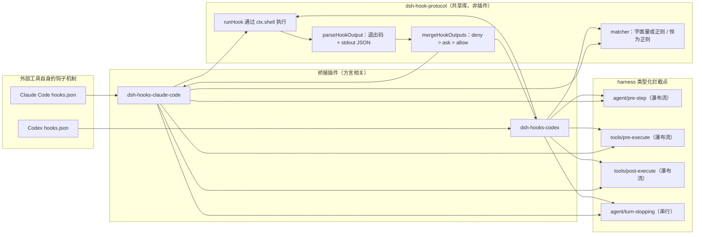

## 这里说的"钩子"是什么

`hooks.json` 不是 deepseek-harness 发明的东西。它是 Claude Code 与 Codex 早已使用的磁盘配置格式，让用户在 agent 生命周期的固定节点上运行自己的 shell 命令——接受一条 prompt 之前、工具执行前后、会话启动时、agent 打算停止时。用户带着已经写好的这些文件来到 deepseek-harness。harness 的任务不是再发明第三套钩子格式，而是**忠实地**运行这些既有文件，不要求任何人重写它们。

关键的重新框定在[拦截扩展点 Agent Note](https://github.com/deepseek-ai/deepseek-harness/blob/47f943859bef60e4160492346772ded9b24f765a/.agents/notes/implemented/feature/2026-06-30-interception-extension-points.md)中说得很清楚：**"原生钩子"根本不是一个包**。harness 真正的扩展接口是一组类型化的 Cordis 事件——`agent/session-start`、`agent/pre-step`、`tools/pre-execute`、`tools/post-execute`、`agent/turn-stopping`、`subagent/start`、`subagent/end`——任何普通插件都可以订阅它们，拥有完整的 `ctx` 访问权限和类型化的返回值。如果是从零编写新代码的插件作者，应当直接使用这些扩展点；不需要与 shell 钩子有任何关系。

`packages/hooks/*` 增加的是一种**桥接**：一个读取用户*已有*的 CC 或 Codex `hooks.json`、在对应扩展点上启动每条配置的 shell 命令、并把该命令的 stdout/退出码协议翻译成原生插件本应返回的同一套类型化决策的插件。桥接能做的任何事——拒绝一次工具调用、注入上下文、强制再走一步——原生插件都能做得更强，没有序列化边界，也不需要子进程。桥接存在的唯一理由,是为用户手头已有的钩子配置提供一条**兼容路径**。



## 为什么需要一个共享库，而不是两个独立的桥接实现

两个工具的钩子引擎参考实现有惊人的结构重合。Codex 自己的源码把它的钩子引擎命名为 Claude 引擎的同名物,并在"有意分歧"的地方留下注释——它复用了同样的 `hooks.json` matcher-group 形状、同样的退出码/结构化 stdout 输出约定、同样的 command hook 执行模型。既然如此,从零写两个桥接插件就意味着复制协议的大部分内容,并让两份拷贝随时间彼此漂移。

`@deepseek-ai/dsh-hook-protocol` 就是针对这个问题的解法:它是一个**库**,不是插件——不向 Cordis 注册任何东西,也不注入任何服务([`packages/hooks/hook-protocol/README.md`](https://github.com/deepseek-ai/deepseek-harness/blob/47f943859bef60e4160492346772ded9b24f765a/packages/hooks/hook-protocol/README.md))。两个桥接包都把它当作普通依赖导入。它只拥有那些真正与方言无关的原语,不多不少:

| 关注点 | 由 `dsh-hook-protocol` 拥有 | 由各桥接自行拥有 |
|---|---|---|
| Matcher 校验与匹配 | `matcherDiagnostic` / `matchesMatcher`,以 `mode` 参数化 | 挑选自己的 `mode`(`claude-code` = 字面量或正则,`codex` = 恒为正则) |
| 运行一个钩子 | `runHook(bash, hook, opts, now)`——stdin 序列化、`ctx.shell` 执行、超时、解码 | 构造每个事件专属的 stdin payload 与方言的环境变量 |
| 解码输出 | `parseHookOutput(exit, stdout, stderr)` → 方言无关的 `HookOutput` | 把 `HookOutput` 映射到自己扩展点专属的类型化 Decision |
| 合并 N 个匹配的钩子 | `mergeHookOutputs(outputs)` → 最严格的 `MergedHookOutcome` | —— |
| 持久化记录 | `appendHookInvoked` / `appendHookResult` | 在每次调用前后分别调用它们 |
| 分离运行的静默关闭 | `createDetachedRuns()` | 把追踪器的 `signal` 传入 `runHook`,把 `drain` 注册为 dispose effect |

两种方言在匹配上唯一真正不同的那根轴,被折叠进一个 `mode` 参数,而不是两个独立函数——见 [`matcher.ts:37-65`](https://github.com/deepseek-ai/deepseek-harness/blob/47f943859bef60e4160492346772ded9b24f765a/packages/hooks/hook-protocol/src/matcher.ts#L37-L65)。Claude Code 把纯 `[A-Za-z0-9_|]+` 的模式当作字面量(`|` 表示精确匹配的多选一),其余一律当正则;Codex 则永远是无锚点正则。`matcherDiagnostic` 在解析配置时校验一个模式,一个非法正则会让整份配置加载失败并附带稳定的诊断信息;`matchesMatcher` 是运行时谓词,永不抛出——即便它遇到一个非法正则,也只会返回 `false`,所以直接调用这个库的代码永远不会因为一个 matcher 字符串而让 agent 循环崩溃。

这个划分不是从第一天就完美无缺,后来还被收紧过一次。[收紧 hook-protocol 契约的 Agent Note](https://github.com/deepseek-ai/deepseek-harness/blob/47f943859bef60e4160492346772ded9b24f765a/.agents/notes/implemented/simplification/2026-07-04-tighten-hook-protocol-contract.md)记录了一个具体案例:`hook/result` 的 stderr 截断规则和 `decision ?? (continue === false ? 'stop' : 'pass')` 这条推导规则,原本在 `hooks-claude-code/src/index.ts` 与 `hooks-codex/src/index.ts` 里是字节级相同的两份拷贝。由于 `dsh-hook-protocol` *声明*了 `hook/result` 事件,却没有*拥有*它的语义,两个桥接就可能悄悄产生分歧——不同的截断上限、不同的兜底值——而任何一个包的测试都不会发现。修复方式是把这两条规则都搬进库里的 `appendHookResult`(现位于 [`events.ts:92-104`](https://github.com/deepseek-ai/deepseek-harness/blob/47f943859bef60e4160492346772ded9b24f765a/packages/hooks/hook-protocol/src/events.ts#L92-L104)),与参考默认值 `DEFAULT_STDERR_SUMMARY_MAX_CHARS` 放在一起。这个案例概括出的规律是:**谁声明了一个持久化事件的结构,谁就该拥有填充它的推导逻辑**,而不是把这份逻辑散落地复制在每个生产者里。

## 方言无关的结果:`HookOutput`

一个钩子能表达的一切——阻断、放行、请求确认、追加上下文、发出警告、要求整体停止——都汇入同一个结构 [`HookOutput`](https://github.com/deepseek-ai/deepseek-harness/blob/47f943859bef60e4160492346772ded9b24f765a/packages/hooks/hook-protocol/src/types.ts#L89-L137),由 `parseHookOutput` 从钩子进程的退出码、stdout、stderr 中解码而来:

```ts
export interface HookOutput {
  exitCode: number | undefined
  stderr: string
  stdout: string
  continue?: boolean
  stopReason?: string
  decision?: 'approve' | 'allow' | 'block' | 'deny' | 'ask'
  reason?: string
  hookEventName?: string
  additionalContext?: string
  systemMessage?: string
  updatedInput?: Record<string, unknown>
}
```

每个字段都是可选的,因为真实钩子只会用到其中的一部分,而某个桥接也只会理会对自己的方言与钩子点有意义的那一部分字段——用协议库自己的话说,叫"忠实但降级"。[`codec.ts:59-89`](https://github.com/deepseek-ai/deepseek-harness/blob/47f943859bef60e4160492346772ded9b24f765a/packages/hooks/hook-protocol/src/codec.ts#L59-L89)里的解码逻辑把退出码 `2` 当作附带 `stderr` 作为原因的阻断(CC 和 Codex 都遵循这个约定),其余非零或缺失的退出码都是非阻断性错误,而干净退出时的 stdout 要么是纯文本,要么——当它以 `{` 开头时——被当作宽松解析的 JSON。它还规范化了一个两套参考 schema 都保留但分得很开的细节:旧版顶层 `decision` 字段只能是 `approve`/`block`,而 `allow`/`deny`/`ask` 专属于嵌套的 `hookSpecificOutput.permissionDecision`。`HookOutput.decision` 把两个通道折叠成一个枚举,当两者都存在时以嵌套的 `permissionDecision` 覆盖旧字段。

`mergeHookOutputs` 随后把匹配同一个扩展点的所有钩子折叠成单一的 `MergedHookOutcome`,采用 **deny > ask > allow** 的优先级([`merge.ts:34-52`](https://github.com/deepseek-ai/deepseek-harness/blob/47f943859bef60e4160492346772ded9b24f765a/packages/hooks/hook-protocol/src/merge.ts#L34-L52)):只要有一个匹配的钩子给出 `deny`,就压倒其余钩子给出的 `allow`;`continue: false` 一旦由某个钩子提出就具有粘性;多个阻断原因用空行拼接。两个桥接都是**按配置顺序串行**运行匹配到的钩子,而不是像参考引擎那样并发——这是刻意的选择,因为串行能让每个钩子的 `hook/invoked`/`hook/result` 在会话日志里保持相邻,而合并结果本身与顺序无关,不会因为串行而改变最终决策。

## 执行:`runHook` 依托 `ctx.shell`

一个钩子归根结底就是一条需要以 JSON payload 写入 stdin、带若干环境变量、指定工作目录、设置超时并可被取消的 shell 命令。`runHook`([`runner.ts:67-106`](https://github.com/deepseek-ai/deepseek-harness/blob/47f943859bef60e4160492346772ded9b24f765a/packages/hooks/hook-protocol/src/runner.ts#L67-L106))自己并不启动进程——它通过 `dsh-shell` 的 `ShellExecutor` 调用,与 harness 中其他所有需要运行子进程的插件用的是同一套能力。这让桥接免费获得执行器已有的凭据清理、进程组终止语义与超时机制,用的是 `dsh-shell` 专为此类可信插件用途新增的 `stdin`/`env` 字段。`runHook` 永不抛出:一次执行器拒绝(工作目录不可用、缺少 shell)会变成一个 `exitCode: undefined` 的非阻断 `HookOutput`,所以一份写坏的钩子配置只会退化为"什么都没发生",而不会让当前回合崩溃。

每一个以"发出通知"形式存在的钩子点(`SessionStart`、`SubagentStart`、`SubagentStop`)都以**分离(detached)**方式运行——没有任何扩展点会等待这些钩子,因为它们本质上是纯通知,没有需要折叠进决策的返回值。一个比会话本身活得更久的分离钩子会泄漏进程,甚至可能在一个已被销毁的 context 里触发一次迟到的注入。`createDetachedRuns()`([`detached.ts:43-62`](https://github.com/deepseek-ai/deepseek-harness/blob/47f943859bef60e4160492346772ded9b24f765a/packages/hooks/hook-protocol/src/detached.ts#L43-L62))就是为此而生:每个桥接把完整的运行链(钩子进程本身,加上它的后续处理——一次 `agent.inject()`调用,一条警告日志)记录在一个 `Set` 里,把追踪器的 `AbortSignal` 传入每一次 `runHook` 调用,并把 `drain()` 注册为自己的 Cordis dispose effect。销毁这个桥接时会先触发中止信号——杀死任何仍在运行的钩子进程,而不是等它超时——然后在所有被追踪的运行链都settle之后才resolve。`fiber.dispose()` 的resolve因此真正意味着不会再有分离的钩子工作能触达一个已经销毁的 context,这正是 harness 其余部分遵循的"销毁必须达到静默,而非仅仅发出请求"这条防御性模式。

## `hook/*` 会话事件只用于记录

每一次钩子调用及其结果都会被持久化记录:进程运行前是 `hook/invoked`,运行后是 `hook/result`,二者通过 `handlerId` 配对。这两个事件是从 `dsh-hook-protocol` 自身的 `types.ts` 声明合并进 `SessionEventMap` 的,和 `compaction/*` 一样——**不是** `SurfaceEventType`,不带 `surfaceOp`,因为它们的存在纯粹是为了审计与回放,不是为了 UI 呈现。`appendHookResult` 推导出持久化的 `decision` 字符串:优先取钩子自己解析出的决策,否则在 `continue: false` 时回退为 `'stop'`,再否则是 `'pass'`;`stderrSummary` 会被裁剪并限制在一个由桥接配置的字符数上限内(`stderrSummaryMaxChars`,参考默认值 `500`)。

一条钩子记录必须落在某个已打开的回合(turn)内——回合中段的几个钩子点(`UserPromptSubmit`、`PreToolUse`、`PostToolUse`、`Stop`)天然满足这一点,因为它们只会在回合已经打开之后才触发。`SessionStart` 在第 1 个回合存在之前就运行,所以它不产生 `hook/*` 记录;它注入的上下文会停留在会话的收件箱中,直到第一个回合打开并取走它。

把这一对事件放在库里而不是拦截点的 Service Definition 里,这个设计决策在[拦截扩展点 Agent Note](https://github.com/deepseek-ai/deepseek-harness/blob/47f943859bef60e4160492346772ded9b24f765a/.agents/notes/implemented/feature/2026-06-30-interception-extension-points.md)里说得很明确:一个直接使用类型化决策的原生插件完全不需要外部钩子日志,所以 `hook/*` 属于桥接协议,不属于所有插件共享的那套规范接口。

## 方言专属:各桥接独自拥有的部分

两个桥接都是普通的函数式/命名空间插件——`name`/`inject`/`Config`/`apply` 作为独立的命名导出,`inject = ['shell']`——都会在加载时**一次性**解析 `configPath`(相对路径相对于进程启动时的工作目录解析,所以目前一份配置作用于整个进程;按会话发现配置仍是两份 README 里公开标注的 `TODO(per-session-hook-config)`)。解析或读取失败会被兜住:桥接记录一条警告并且不注册任何钩子,而不是因为一个写错的路径就让 agent 整体崩溃。

**`dsh-hooks-claude-code`** 支持 CC 当前钩子点中的七个(`SessionStart`、`UserPromptSubmit`、`PreToolUse`、`PostToolUse`、`Stop`、`SubagentStart`、`SubagentStop`——Claude Code 文档中的 30 个事件里还有 23 个不受支持,在解析阶段就被丢弃)。它构造 CC 形状的 stdin payload,在配置解析阶段就对命令字符串执行 `${CLAUDE_PLUGIN_ROOT}`/`${CLAUDE_PROJECT_DIR}` 替换(见 `hooks-claude-code/src/config.ts` 里的 `substituteCommand`),并向钩子进程导出 `CLAUDE_PROJECT_DIR`——当配置省略 `projectDir` 时,默认取 agent 的会话工作目录,因为真实的、未经修改的钩子普遍引用这个变量。`PreToolUse` 的 `deny`/`ask` 决策映射到 `tools/pre-execute` 的 `PreToolDecision`,其中 `ask` 会经由可选的审批接缝来解决,而不是桥接自己给出的终局决定。

**`dsh-hooks-codex`** 支持 Codex 十个钩子点中的五个(`SessionStart`、`UserPromptSubmit`、`PreToolUse`、`PostToolUse`、`Stop`),永远使用正则 matcher(没有字面量快速路径),写出的是 snake_case payload,带有 `turn_id`/`model` 额外字段,并且**不带**尾随换行符(而 CC 的 payload 确实带一个),不做插件环境变量注入,也不做占位符替换,并且 `PreToolUse` 没有 `allow`/`ask` 路径——只有 `block` 会被理会,映射为 `PreToolDecision.deny`。

两份 README 都设有"Known Limitations and Deferred Work"一节,精确列出了当前哪些钩子字段是"解析了但被忽略"的:`updatedInput`(工具输入重写)会被记录并发出警告,但从不真正应用;`systemMessage` 同样被记录并警告,但从不呈现给模型;两个参考工具都实现的 Stop 钩子连续阻断守卫,这里尚未被追踪(`TODO(stop-loop-guard)`),所以一个无条件阻断的 `Stop` 钩子会强制每一步都继续执行,直到该钩子自我限制为止。

## 上下文来源永远归属于插件本身

桥接注入的每一条消息——`SessionStart` 的上下文、被折叠进下游 `agent/pre-step` 决策的 `additionalContext`、`Stop` 钩子的续行原因——都携带一个显式的 `{ kind: 'plugin', plugin: 'hooks-claude-code' }` 或 `'hooks-codex'` 来源标记。这是一个虽小但刻意为之的防护:没有这个标记,钩子提供的文本就可能在日志里,或者在后续某次 prompt 重建过程中,被误认为是*用户*真正输入的内容。两个桥接的测试套件都会核对生成的 `user/message` 事件上的这个来源字段。

## 一个相关但不同的坑:default export 与 Loader

[hook 桥接 Agent Note](https://github.com/deepseek-ai/deepseek-harness/blob/47f943859bef60e4160492346772ded9b24f765a/.agents/notes/implemented/feature/2026-06-30-hook-bridges.md)明确要求两个桥接插件都以独立的命名导出方式导出 `name`/`inject`/`Config`/`apply`,**不带 default export**,并引用[postmortem 0001](https://github.com/deepseek-ai/deepseek-harness/blob/47f943859bef60e4160492346772ded9b24f765a/docs/postmortem/0001-acp-default-export-drops-inject.md)作为理由。那份 postmortem 记录的真实事故其实发生在另一个包里(`@deepseek-ai/dsh-acp`,ACP 桥接),而不是 hooks 家族——它的根因是一行多余的 `export default apply`,导致 Cordis 的 `Loader.unwrapExports` 优先选中裸函数而不是模块命名空间,悄悄丢弃了 `inject`,并在插件第一次读取被注入的服务时立刻崩溃。这个教训能直接推广到仓库里的每一个命名空间插件,hooks 桥接也不例外:**在 Cordis Loader 下,命名空间插件和 default export 是互斥的**。`hooks-claude-code/src/index.ts` 和 `hooks-codex/src/index.ts` 都遵循这份 postmortem 产出的规则——`export const name`、`export const inject`、`export const Config`、`export function apply`——正是因为一旦写错,就会悄悄把 `inject = ['shell']` 清空,在加载阶段就拖垮整个桥接,与 ACP 事故中 `session/new` 被拖垮的方式如出一辙。

## 值得留意的已知局限

除了各桥接 README 里逐字段列出的差距之外,两种方言还共享三处结构性缺口:**输入重写**(`updatedInput`)被当作一个独立的一致性设计问题推迟处理,因为工具调用审计、assistant-message 历史记录和 UI 呈现都在钩子有机会重写之前就读取了已封存的预执行参数;**按会话发现配置**目前尚不存在,今天单一的进程级 `configPath` 无法按项目区分;**通过 `continue: false` 实现的硬性整体停止**会被记录在持久化日志里,但对运行本身没有任何效果,因为当前的拦截点只能表达针对单次调用的决策(阻断、拒绝、引导),而不是"让整个 agent 停下来"。
