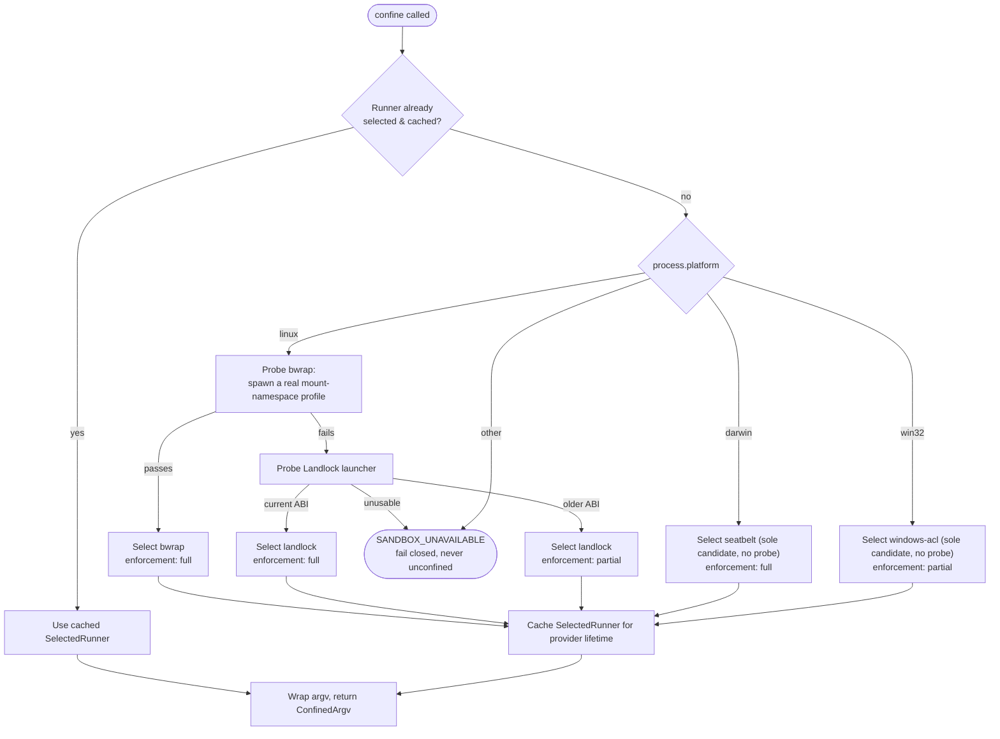

## No OS gives you one process-confinement primitive

Linux, macOS, and Windows each expose a different kernel-level mechanism for restricting what a spawned process can touch, and none of the three mechanisms is a drop-in substitute for either of the others. Linux offers `bwrap`'s mount-namespace bind profile and, underneath it, the Landlock LSM. macOS ships Seatbelt, a deny-by-default sandbox profile compiler wired through the (Apple-deprecated but still-shipped) `sandbox-exec` CLI. Windows has no equivalent sandbox profile language at all — its nearest primitive is a `WRITE_RESTRICTED` access token whose restricting SIDs gate write access at the ACL layer, a completely different shape of guarantee from a mount namespace or an LSM.

`ctx.sandbox` is the harness's answer to that fact: one Service Definition expressing a small, deliberately narrow vocabulary — confine this exact argv under this file-effect mode — and one Service Provider, `dsh-sandbox-local`, that dispatches to whichever OS-specific runner the host actually has. The seam's payoff is the same one every capability seam delivers: `dsh-bash-sandbox` and `dsh-terminal-bash` call `ctx.sandbox.confine()` without knowing or caring whether the host resolves that call to `bwrap`, Landlock, Seatbelt, or the Windows ACL runner. See [Capability Seams: Definition, Provider, Consumer](../s07-capability-seams-primer/README.md) for the three-role pattern this chapter assumes.

## The Service Definition: `ctx.sandbox`

[`dsh-sandbox`](../../../packages/sandbox/sandbox/README.md) owns `ctx.sandbox` and the shared confinement vocabulary:

:::concept{term="SandboxMode"}
`read-only` / `workspace-write` / `danger-full-access` — file effects only.
:::

:::concept{term="SandboxEnforcement"}
`full` / `partial`.
:::

:::concept{term="SandboxExecutionPolicy / SandboxPolicy"}
The complete per-call mode plus workspace root.
:::

:::concept{term="SANDBOX_UNAVAILABLE"}
The fail-closed error thrown when no backend is usable.
:::

It depends only on Cordis and the harness error base — never on a backend.

```ts
// packages/sandbox/sandbox/src/index.ts:158-176
export abstract class SandboxProvider extends Service {
  constructor(ctx: Context) {
    super(ctx, 'sandbox')
  }

  /**
   * Wrap `argv` so it executes confined under `policy` on this host; the
   * caller spawns the returned argv in place of its own.
   * @param argv - the exact argv the caller is about to spawn (program plus
   *   arguments), NOT a shell string — a shell-shaped consumer passes
   *   `['bash', '-c', command]`.
   * @param policy - the file-effect policy this execution runs under,
   *   carried per call (see {@link SandboxPolicy}).
   * @returns the argv to spawn instead, plus the enforcement completeness
   *   the selected backend achieves for it.
   */
  abstract confine(argv: readonly string[], policy: SandboxPolicy): ConfinedArgv
}
```

The contract in one line: `ctx.sandbox.confine(argv, policy)` returns the argv to spawn INSTEAD of the caller's own — wrapped so the process and everything it spawns runs confined — plus the selected backend's enforcement completeness, a denial dialect (`denialSignatures`, the case-insensitive stderr substrings that backend's own kernel produces for a blocked write), and structured runner-failure evidence (`runnerFailureRules`, so a broken runner is never mistaken for a denial). When no backend is usable it throws `SandboxUnavailableError` rather than passing the argv through unconfined.

Policy rides the call, not the provider: two consumers may confine under different policies at the same instant — bash under `read-only` while a confined child agent keeps its state directory writable — and an approved escalated retry is just a new call with a wider policy.

> [!WHY]
> **Same-world confinement only.** A backend shares the host's filesystem and kernel (`bwrap`, Landlock, Seatbelt, the Windows ACL token); `workspaceRoot` names the filesystem-canonical real host directory. Containers, microVMs, and remote executors are explicitly NOT backends of this seam — they replace whole capability-seam families (`ctx.shell`, `ctx.fs`) as environment-coherent groups, the same way `docs/architecture.md` frames filesystem and subprocess providers as sharing one execution world.

## The Service Provider: `dsh-sandbox-local` dispatches by platform

[`dsh-sandbox-local`](../../../packages/sandbox/sandbox-local/README.md) is the sole shipped implementation of `ctx.sandbox`, and it is itself a small dispatcher: it selects and caches one platform runner for its whole lifetime, rather than choosing per call. Selection happens by platform first and by functional probe only where a platform actually has more than one candidate.

```ts filename="packages/sandbox/sandbox-local/src/index.ts"
/**
 * The runner chain per platform — selection is BY PLATFORM first, probes
 * second: a platform's chain is probed in preference order only when it has
 * MORE than one candidate (probing arbitrates; it does not re-validate a
 * choice that has no alternative). A platform with no chain fails closed at
 * `confine()`. Linux prefers `bwrap` (its mount profile is closest to the
 * mode vocabulary) over the Landlock launcher; darwin has exactly one
 * candidate, selected without any probe.
 */
const PLATFORM_CHAINS: Record<string, readonly SelectedRunner['runner'][]> = {
  linux: ['bwrap', 'landlock'],
  darwin: ['seatbelt'],
  // The Windows restricted-token runner (@deepseek-ai/dsh-sandbox-windows-acl):
  // a sole candidate, selected without a probe — its execution-time refusal
  // fails closed through its stderr signature (windows-acl-run:) and exit 127.
  win32: ['windows-acl'],
}

// ...

private selectRunner(mode: ConfinedSandboxMode): SelectedRunner {
  this.selectedRunner ??= this.chainVerdict()
  if (this.selectedRunner === 'unavailable') throw new SandboxUnavailableError(mode)
  return this.selectedRunner
}

/** Walk this platform's chain: sole candidate unprobed, several probed in order, none usable → unavailable. */
private chainVerdict(): SelectedRunner | 'unavailable' {
  const chain = this.internals.chain ?? PLATFORM_CHAINS[this.internals.platform ?? process.platform] ?? []
  const [first, ...rest] = chain
  if (first === undefined) return 'unavailable'
  // A sole candidate needs no arbitration; its execution-time refusal still fails closed.
  if (rest.length === 0) return { runner: first, enforcement: STATIC_ENFORCEMENT[first] }
  for (const runner of chain) {
    const enforcement = this.probeRunner(runner)
    if (enforcement !== 'unusable') return { runner, enforcement }
  }
  return 'unavailable'
}
```

## Stepping through the dispatch



Three things this walk makes concrete:

:::timeline
- Linux is the only platform that actually arbitrates — it has two candidates, so `bwrap` is tried first (spawning a real mount-namespace profile under `--ro-bind` / `--dev` / `--proc`) and Landlock is the fallback only if that probe fails; macOS and Windows each have exactly one candidate, so `chainVerdict` skips probing entirely and selects it directly, its own execution-time refusal failing closed rather than a preflight probe.
- Selection happens once per provider lifetime, cached in `this.selectedRunner` — installing, removing, or repairing a runner requires reloading the plugin before selection changes, a known limitation rather than an oversight.
- A platform absent from `PLATFORM_CHAINS`, or a chain where every candidate probes `unusable`, fails closed with `SandboxUnavailableError` and the `SANDBOX_UNAVAILABLE` code — never a silent unconfined passthrough.
:::

## Enforcement completeness: `full` versus `partial`, reported honestly

`SandboxEnforcement` is a two-value type — `full` or `partial` — and the local provider's `STATIC_ENFORCEMENT` table assigns it per runner:

```ts
// packages/sandbox/sandbox-local/src/index.ts:177-187
const STATIC_ENFORCEMENT: Record<SelectedRunner['runner'], SandboxEnforcement> = {
  bwrap: 'full',
  landlock: 'full',
  seatbelt: 'full',
  'windows-acl': 'partial',
}
```

`bwrap` and Seatbelt earn `full` by construction: `bwrap`'s mount-namespace bind profile and Seatbelt's `(deny file-write*)`-plus-allow-list profile each govern every file effect the mode promises, so a passing functional probe is the whole enforcement story. Landlock is more nuanced — its table entry says `full`, but that is only the claim used when a sole-candidate chain would select it unprobed (which does not happen today, since Linux always has two candidates). In practice Landlock is reached only through its probe, and that probe's own return value — not the static table — decides `full` versus `partial`: an older supported kernel ABI exposes fewer access classes than a newer one, and the launcher additionally self-reports partial enforcement on stderr (`landlock-run: partial enforcement (older Landlock ABI)`) at every confined run under that ABI.

Windows ACL is the one runner whose table entry is unconditionally `partial`, and the `dsh-sandbox-windows-acl` README explains exactly why, in its own words: a `WRITE_RESTRICTED` token "must retain Everyone in its restricting list" for process initialization to succeed at all — remove Everyone and early DLL init dies with `0xC0000142` — so "an external NTFS object whose normal DACL grants Everyone a requested write right therefore clears both access checks and stays writable under both modes." The second gap is structural rather than a workaround for initialization: "NTFS ACLs belong to file objects rather than paths," so an inheritable workspace ACE propagated onto an existing hard link changes the one underlying file's security descriptor, making that file writable through any external alias too — and "rejecting every multiply-linked workspace file is not viable for ordinary pnpm installations," which hard-link into a content-addressable store. The provider's own summary of the consequence: "The rung enforces the remaining ACL-addressable surface but must not advertise the absolute promise."

This is the theme worth naming precisely: every runner in the chain reports what it actually verified, not what the mode vocabulary would like to promise. A consumer that needs an absolute boundary reads `result.sandbox.enforcement` and can choose to reject a `partial` result rather than silently trusting it as if it were `full`. Nothing in the seam papers over the difference — the Landlock launcher's own stderr and the Windows ACL provider's own README both say `partial` in as many words.

## The Windows ACL mechanism, precisely

Windows has no Landlock or Seatbelt equivalent, so [`dsh-sandbox-windows-acl`](../../../packages/sandbox/sandbox-windows-acl/README.md) builds directly on a lower-level primitive: `CreateRestrictedToken` with the `WRITE_RESTRICTED` flag. The mechanism, in the package's own words:

> "the caller's token is duplicated into a `WRITE_RESTRICTED` token whose restricting SIDs carry separate workspace and private-temp capabilities... Windows grants a write only where BOTH the caller's normal access AND the restricting-SID intersection allow it."

:::decision
The restricted-token approach is a deliberate design choice recorded against two rejected alternatives: Microsoft's mxc container needs an OS floor of Windows 11 24H2 and would require wholesale host DACL writes for arbitrary-path reads, and AppContainer cannot do arbitrary-path reads at all. The restricted-token approach needs neither, because `WRITE_RESTRICTED` only ever intersects write access — reads pass through on the caller's normal, unrestricted access.
:::

`workspaceWriteSid` is derived deterministically from the canonical workspace path, so its ACE materializes once per workspace per machine and every later session or restart hits an "exact-ACE skip" instead of re-propagating permissions across the whole directory tree. `tempWriteSid` is different by design: every live session/workspace pair gets a fresh, randomly located private temp directory and its own derived SID, so sessions sharing a workspace share its intended write authority without inheriting each other's temp authority. This is a Node.js/[koffi](https://koffi.dev/) port of the mechanism demonstrated in `huoyaoyuan/windows-acl-restrict-poc` (pinned revision `10e4dfb`).

The runner it produces is the same architectural shape as the POSIX runners: an argv-prefix wrapper (`node runner.js --workspace <dir> --temp <dir> --mode <mode> [--write-sid ... --temp-write-sid ...] -- <argv...>`) that `dsh-sandbox-local` spawns in place of the caller's command, so `ctx.sandbox.confine()`'s contract needs no per-platform special case at the call site — only inside the dispatcher shown above.

## Not a seam: `ctx.sandboxPolicy`

`docs/capability-seams.md` classifies `ctx.sandbox` as Role `seam` and `ctx.sandboxPolicy` as Role `core` — verified directly against the generated table:

```
| `ctx.sandbox` | `seam` | [`sandbox`](../packages/sandbox/sandbox) | [`sandbox-local`](../packages/sandbox/sandbox-local) | [`bash-sandbox`](../packages/shell/bash-sandbox), [`terminal-bash`](../packages/terminal/terminal-bash) | - | Consumers hand over the exact argv they are about to spawn; same-world backends wrap it under a per-call policy and report enforcement. |
| `ctx.sandboxPolicy` | `core` | [`sandbox-policy`](../packages/sandbox/sandbox-policy) | - | [`bash-sandbox`](../packages/shell/bash-sandbox), [`fs-sandbox`](../packages/fs/fs-sandbox), [`terminal-bash`](../packages/terminal/terminal-bash) | - | The one home for the deployment default mode + workspace root... Both enforcing families read it so bash and fs cannot confine to different roots. |
```

[`dsh-sandbox-policy`](../../../packages/sandbox/sandbox-policy/README.md) has no "Implementations" column entry — no alternate provider exists or is expected. It is a single package that resolves one thing: the deployment's default `SandboxMode` and fallback workspace root, plus each session's durable mode override (an appended `sandbox/mode` event) and immutable workspace root. `ctx.sandboxPolicy.resolve({ session?, mode? })` returns one complete `SandboxExecutionPolicy` per call, with precedence explicit mode > session's last `sandbox/mode` event > deployment default.

The reason this is `core` and not `seam` is not that it is unimportant — it is read by both enforcing families, `dsh-bash-sandbox` and `dsh-fs-sandbox`, plus `dsh-terminal-bash`, precisely so that bash and the filesystem sandbox cannot drift into confining two different roots for the same session. It is `core` because there is exactly one conceivable implementation and no swap need: "the home for default sandbox mode and workspace root" is a single fact with a single owner, not a contract multiple backends could satisfy differently. This is the same distinction the [capability-seams primer](../s07-capability-seams-primer/README.md) draws for `ctx.tools` and `ctx.sessions` — a fixed owner, not a seam, even though the service is load-bearing.

## The Consumers: `dsh-bash-sandbox` and `dsh-terminal-bash`

[`dsh-bash-sandbox`](../../../packages/shell/bash-sandbox/README.md) loads **instead of** `dsh-bash-local`, alongside a `ctx.sandbox` provider and `ctx.sandboxPolicy` — and needs no alternate tool plugin, because `dsh-tool-bash` detects the mounted executor's `sandboxMode` capability at registration time and adds escalation fields to its own schema only when a sandboxing backend is actually present. Every command is confined by handing the provider the exact `['bash', '-c', command]` argv the executor is about to spawn; a denial is reported as a result fact (`ShellRunResult.sandbox.denied: true`), classified from the selected backend's own `denialSignatures` against the collected stderr tail.

[`dsh-terminal-bash`](../../../packages/terminal/terminal-bash/README.md) is the PTY-backed sibling: it injects `pty`, `sandboxPolicy`, and `subprocess`, resolves one `ctx.sandboxPolicy.resolve({ session })` call per spawn for both the effective mode and the session workspace root, and wraps the exact shell argv through `ctx.sandbox` for any confined mode — `danger-full-access` starts the shell directly with no sandbox provider required at all. Neither Consumer imports `dsh-sandbox-local`, `dsh-sandbox-windows-acl`, or any other provider-specific type; both inject services by name.

## Known limits the seam states about itself

The `dsh-sandbox` README's own "Known Limitations and Deferred Work" section is direct about what this seam does not attempt to be:

- **File effects are the whole policy vocabulary** — no network, process, syscall, device, or credential restrictions exist in this seam at all.
- **Same-world confinement only** — containers, microVMs, and remote execution require replacing capability implementations, not adding a `ctx.sandbox` provider.
- **Denial reporting is a stderr dialect**, not a typed runtime denial channel — a consumer that needs classification infers it from the child process's own output.
- **One provider per context** — composing different sandbox mechanisms simultaneously needs a provider-level ladder or separate Cordis contexts.

None of this is presented as a temporary gap being closed later; it is the seam's stated scope. Combined with the honest `full`/`partial` enforcement reporting, the picture is consistent: `ctx.sandbox` promises exactly what it can verify per platform, and states the rest as a limitation rather than an implicit guarantee.
