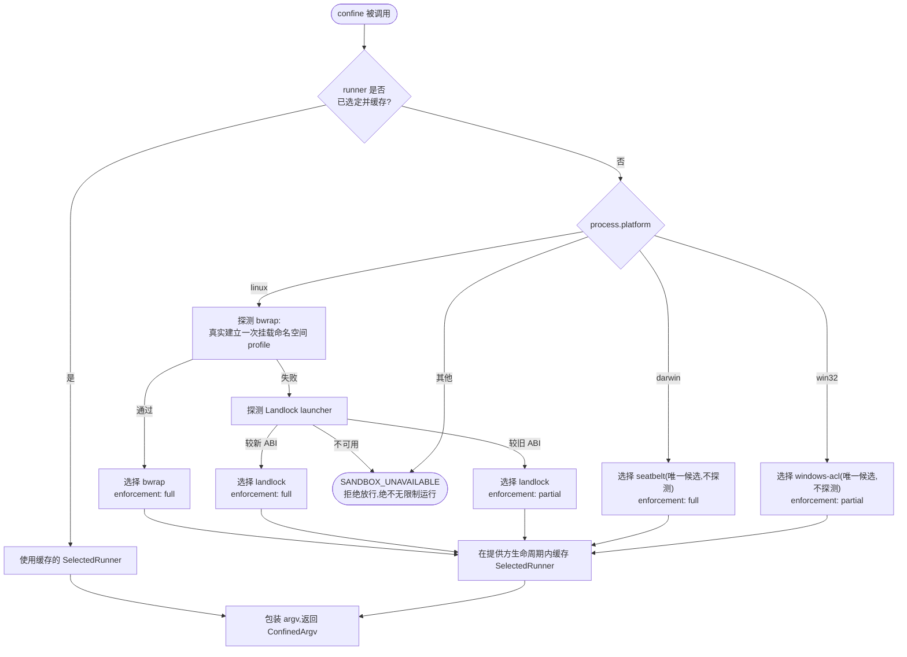

## 一句话版本

`ctx.sandbox` 是 harness 的进程限制 seam。一个 Service Definition(`dsh-sandbox`)固定下一套刻意克制的词汇——在这个文件操作模式下限制这份确切 argv——一个 Service Provider(`dsh-sandbox-local`)把这次调用分派到宿主机实际拥有的那个操作系统专属 runner:`bwrap`、Landlock、Seatbelt,或 Windows ACL 令牌。`dsh-bash-sandbox`、`dsh-terminal-bash` 这类 Consumer 调用 `ctx.sandbox.confine()` 时,并不需要知道是哪一个 runner 应答。这个 seam 的招牌动作是诚实：每个 runner 都如实报告自己的强制执行完整度——`full` 或 `partial`——而不是躲在一套统一保证后面。下文讲清为什么一个 seam 需要三个后端、平台分派如何运转,以及 Windows 上的 `partial` 到底意味着什么。

## 速览

:::concept{term="SandboxMode"}
`read-only` / `workspace-write` / `danger-full-access`——仅限文件操作的词汇,仅此而已。这个 seam 里完全不存在网络、进程、系统调用、设备或凭据这些维度。
:::

:::concept{term="SandboxEnforcement"}
`full` / `partial`——所选后端真正验证到了模式承诺的多少。本章的招牌：按 runner 逐一报告,绝不含糊掩盖。
:::

:::concept{term="SandboxExecutionPolicy / SandboxPolicy"}
一次完整的逐调用限制请求：一个模式,加上文件系统规范化后的工作区根目录;随每次调用携带,而不是钉死在提供方上。
:::

:::concept{term="ConfinedArgv"}
`confine()` 的返回值：应当取代原始 argv 去 spawn 的包装后 argv,外加该后端的强制执行完整度、它的拒绝方言(`denialSignatures`),以及结构化的 runner 失败证据(`runnerFailureRules`)。
:::

:::concept{term="SANDBOX_UNAVAILABLE"}
没有可用后端时抛出的故障即拒绝(fail-closed)错误——这个 seam 绝不会把 argv 原样放行、任其不受限制地运行。
:::

## 为什么一个 seam 需要三个后端

Linux、macOS 和 Windows 各自暴露一套完全不同的内核级机制来限制被 spawn 进程能触碰什么,三者互不能直接替代。Linux 提供 `bwrap` 的挂载命名空间绑定 profile,以及更底层的 Landlock LSM。macOS 提供 Seatbelt——一个默认拒绝的沙箱 profile 编译器,通过(Apple 已标记 deprecated 但仍在每个 macOS 上出货的)`sandbox-exec` CLI 调用。Windows 完全没有对等的沙箱 profile 语言——它最接近的原语是一个 `WRITE_RESTRICTED` 访问令牌,靠 restricting SID 在 ACL 层限制写访问,与挂载命名空间或 LSM 是完全不同形态的保证。

`ctx.sandbox` 就是 harness 对这一事实的回应：一个表达小而克制词汇的 Service Definition——在这个文件操作模式下限制这份确切 argv——加上一个 Service Provider `dsh-sandbox-local`,它会分派到宿主机实际拥有的那个操作系统专属 runner。这个 seam 的收益和每一个能力 seam 一样:`dsh-bash-sandbox` 和 `dsh-terminal-bash` 调用 `ctx.sandbox.confine()` 时,完全不需要知道也不关心宿主机把这次调用解析到了 `bwrap`、Landlock、Seatbelt 还是 Windows ACL runner。三角色形态本身见[《能力接缝：Definition / Provider / Consumer》](../s07-capability-seams-primer/README.zh.md),本章直接沿用它。

## Service Definition:`ctx.sandbox`

[`dsh-sandbox`](../../../packages/sandbox/sandbox/README.md) 拥有 `ctx.sandbox` 与上面卡片所定义的共享限制词汇。它只依赖 Cordis 与 harness 错误基类——绝不依赖后端。

```ts
// packages/sandbox/sandbox/src/index.ts:158-176
export abstract class SandboxProvider extends Service {
  constructor(ctx: Context) {
    super(ctx, 'sandbox')
  }

  /**
   * Wrap `argv` so it executes confined under `policy` on this host; the
   * caller spawns the returned argv in place of its own.
   * @param argv - the exact argv the caller is about to spawn (program plus
   *   arguments), NOT a shell string — a shell-shaped consumer passes
   *   `['bash', '-c', command]`.
   * @param policy - the file-effect policy this execution runs under,
   *   carried per call (see {@link SandboxPolicy}).
   * @returns the argv to spawn instead, plus the enforcement completeness
   *   the selected backend achieves for it.
   */
  abstract confine(argv: readonly string[], policy: SandboxPolicy): ConfinedArgv
}
```

用一句话概括这份约定:`ctx.sandbox.confine(argv, policy)` 返回应当取代调用方原始 argv 的、用于 spawn 的 argv——经过包装,使该进程及其派生的一切都在限制下运行——并附带所选后端的强制执行完整度、一种拒绝方言(`denialSignatures`,该后端自己的内核对被拦截写入产生的、不区分大小写的 stderr 子串),以及结构化的 runner 失败证据(`runnerFailureRules`,使损坏的 runner 永远不会被误判为一次拒绝)。没有可用后端时,它会抛出 `SandboxUnavailableError`,而不是把 argv 原样传递下去、让命令不受限制地运行。

策略随调用传递,而不属于提供方：两个消费方可以在同一时刻按不同策略施加限制——bash 处于 `read-only`,而一个受限的子 agent(智能体)需要其状态目录保持可写——一次获批的升权重试只是使用更宽策略发起的新调用。

> [!WHY]
> **只支持与宿主共享文件系统和内核的限制。** 后端与宿主共享文件系统和内核(`bwrap`、Landlock、Seatbelt、Windows ACL 令牌);`workspaceRoot` 指向文件系统规范化后的真实主机目录。容器、microVM 与远程执行器明确不是该 seam 的后端——它们会以环境一致的分组替换整个能力 seam 家族(`ctx.shell`、`ctx.fs`),正如 `docs/architecture.md` 把文件系统与子进程提供方描述为共享同一个执行世界。

## Service Provider:`dsh-sandbox-local` 按平台分派

[`dsh-sandbox-local`](../../../packages/sandbox/sandbox-local/README.md) 是 `ctx.sandbox` 目前唯一交付的实现,它本身就是一个小型分派器：它为整个生命周期选择并缓存一个平台 runner,而不是逐次调用去选择。选择首先按平台进行,只有当某个平台确实有多个候选项时才依赖功能探测。

```ts filename="packages/sandbox/sandbox-local/src/index.ts"
/**
 * The runner chain per platform — selection is BY PLATFORM first, probes
 * second: a platform's chain is probed in preference order only when it has
 * MORE than one candidate (probing arbitrates; it does not re-validate a
 * choice that has no alternative). A platform with no chain fails closed at
 * `confine()`. Linux prefers `bwrap` (its mount profile is closest to the
 * mode vocabulary) over the Landlock launcher; darwin has exactly one
 * candidate, selected without any probe.
 */
const PLATFORM_CHAINS: Record<string, readonly SelectedRunner['runner'][]> = {
  linux: ['bwrap', 'landlock'],
  darwin: ['seatbelt'],
  // The Windows restricted-token runner (@deepseek-ai/dsh-sandbox-windows-acl):
  // a sole candidate, selected without a probe — its execution-time refusal
  // fails closed through its stderr signature (windows-acl-run:) and exit 127.
  win32: ['windows-acl'],
}

// ...

private selectRunner(mode: ConfinedSandboxMode): SelectedRunner {
  this.selectedRunner ??= this.chainVerdict()
  if (this.selectedRunner === 'unavailable') throw new SandboxUnavailableError(mode)
  return this.selectedRunner
}

/** Walk this platform's chain: sole candidate unprobed, several probed in order, none usable → unavailable. */
private chainVerdict(): SelectedRunner | 'unavailable' {
  const chain = this.internals.chain ?? PLATFORM_CHAINS[this.internals.platform ?? process.platform] ?? []
  const [first, ...rest] = chain
  if (first === undefined) return 'unavailable'
  // A sole candidate needs no arbitration; its execution-time refusal still fails closed.
  if (rest.length === 0) return { runner: first, enforcement: STATIC_ENFORCEMENT[first] }
  for (const runner of chain) {
    const enforcement = this.probeRunner(runner)
    if (enforcement !== 'unusable') return { runner, enforcement }
  }
  return 'unavailable'
}
```

## 逐步走一遍分派逻辑



这张流程图是一条有序的流水线;这里把它做成一个可以分步运行的序列:

:::timeline
- `confine(argv, policy)` 被调用——一个 Consumer 交出它即将 spawn 的确切 argv
- runner 已缓存?——复用为这个提供方生命周期只选定一次的 `SelectedRunner`,否则现在就选
- 按 `process.platform` 分派——`linux` / `darwin` / `win32` 各自点名一条候选链;任何其他平台都故障即拒绝
- 只在某平台有两个候选项时才探测——Linux 真实建立一次 `bwrap` 挂载命名空间 profile;Landlock 是回退项
- 选定并缓存——幸存 runner 及其 `SandboxEnforcement` 被存储起来,供提供方整个生命周期复用
- 包装并返回——调用方 spawn 包装后的 argv,并从 `ConfinedArgv` 读回所报告的强制执行完整度
:::

这次走查揭示了三件具体的事:

- **只有 Linux 真正需要仲裁**——它有两个候选项,所以先尝试 `bwrap`(通过 `--ro-bind` / `--dev` / `--proc` 真实建立一次挂载命名空间 profile),只有该探测失败时才回退到 Landlock。macOS 和 Windows 的链表里各自只有一个候选项,因此 `chainVerdict` 完全跳过探测、直接选定它——由它自己在执行期的拒绝来完成拒绝放行,而不是靠预检探测。
- **选择在提供方的整个生命周期内只发生一次**,缓存在 `this.selectedRunner` 中。安装、移除或修复 runner 后必须重载插件才能改变选择——README 把这写成一条已知限制,而不是一处疏忽。
- **`PLATFORM_CHAINS` 中不存在的平台**,或链表中每个候选项都探测为 `unusable`,都会以 `SandboxUnavailableError` 与 `SANDBOX_UNAVAILABLE` 错误码**拒绝放行**——绝不会静默地无限制通过。

## 强制执行完整度：如实报告 `full` 与 `partial`

`SandboxEnforcement` 是一个只有两个取值的类型——`full` 或 `partial`——本地提供方的 `STATIC_ENFORCEMENT` 表按 runner 逐一赋值:

```ts
// packages/sandbox/sandbox-local/src/index.ts:177-187
const STATIC_ENFORCEMENT: Record<SelectedRunner['runner'], SandboxEnforcement> = {
  bwrap: 'full',
  landlock: 'full',
  seatbelt: 'full',
  'windows-acl': 'partial',
}
```

`bwrap` 与 Seatbelt 靠自身构造就能达到 `full`:`bwrap` 的挂载命名空间绑定 profile 与 Seatbelt 的 `(deny file-write*)` 加写入 allow-list profile,各自约束了模式承诺的每一项文件操作,因此一次通过的功能探测就是完整的强制执行故事。Landlock 更微妙一些——它在表里标注的是 `full`,但这只是当一个唯一候选链会不经探测直接选定它时才会用到的声明(目前实际上不会发生,因为 Linux 永远有两个候选项)。实际中 Landlock 只会经由自己的探测被选中,决定 `full` 还是 `partial` 的是探测本身的返回值,而不是这张静态表：较旧但仍受支持的内核 ABI 暴露的访问类别比新版更少,launcher 还会在该 ABI 下的每次受限运行中额外在 stderr 自我报告部分强制执行(`landlock-run: partial enforcement (older Landlock ABI)`)。

Windows ACL 是表中唯一无条件标注 `partial` 的 runner,`dsh-sandbox-windows-acl` 的 README 用它自己的话精确解释了原因：一个 `WRITE_RESTRICTED` 令牌"必须在其 restricting 列表中保留 Everyone"进程初始化才能成功——移除 Everyone,早期 DLL 初始化就会以 `0xC0000142` 死亡——所以"如果外部 NTFS 对象的正常 DACL 向 Everyone 授予所请求的写权限,它就会同时通过两次访问检查,并在两种模式下保持可写"。第二处缺口是结构性的,而不是绕过初始化问题的权宜之计:"NTFS ACL 属于文件对象而非路径",因此传播到已有硬链接上的可继承工作区 ACE 会修改底层同一文件的安全描述符,使该文件也能通过任意外部别名写入——而"拒绝工作区中的所有多链接文件不具可行性",因为普通 pnpm 安装会用硬链接指向其内容寻址存储。提供方自己对这一后果的总结是:"该档强制执行了其余可由 ACL 寻址的表面,但不得把这一边界夸大为绝对承诺。"

这正是值得精确命名的主题：链条中的每一个 runner 都如实报告自己真正验证过的内容,而不是模式词汇本想承诺的内容。需要绝对边界的消费方读取 `result.sandbox.enforcement`,可以选择拒绝一个 `partial` 结果,而不是把它当成 `full` 静默信任。这个 seam 里没有任何东西掩盖这种差异——Landlock launcher 自己的 stderr 与 Windows ACL 提供方自己的 README 都逐字写着 `partial`。

:::fold[Windows ACL 机制的精确说明]
Windows 没有对等的 Landlock 或 Seatbelt,所以 [`dsh-sandbox-windows-acl`](../../../packages/sandbox/sandbox-windows-acl/README.md) 直接构建在一个更底层的原语上：带 `WRITE_RESTRICTED` 标志的 `CreateRestrictedToken`。这套机制,用该包自己的话说:

> "把调用者令牌复制为 `WRITE_RESTRICTED` 受限令牌,其 restricting SIDs 携带彼此独立的工作区能力与私有临时目录能力……此后 Windows 只在「调用者正常权限」与「restricting SID 交集」同时允许时才放行写入。"

:::decision
受限令牌方案是一个记录在案、针对两个被否决方案做出的刻意设计选择：微软的 mxc 容器要求 Windows 11 24H2 的 OS 下限,且任意路径读取需要整体改写宿主 DACL;AppContainer 则根本无法做到任意路径读取。受限令牌方案两者都不需要,因为 `WRITE_RESTRICTED` 只交叉检查写访问——读取会照常通过调用者正常的、不受限的访问权限。
:::

真正携带授权的是两个 SID。`workspaceWriteSid` 由规范工作区路径确定性派生,因此它的 ACE 每台机器每个工作区只物化一次,之后每次会话或重启都会命中"精确 ACE 跳过",而不是把权限重新传播到整棵目录树。`tempWriteSid` 的设计则不同：每个活跃的会话/工作区对都获得一个全新的、随机位置的私有临时目录及其自身派生的 SID,因此共享工作区的会话会共享其预期的写权限,却不会继承彼此的临时目录权限。这是对 `huoyaoyuan/windows-acl-restrict-poc`(固定修订版本 `10e4dfb`)所演示机制的一次 Node.js/[koffi](https://koffi.dev/) 移植。

它产生的 runner 与 POSIX 系 runner 是同一种架构形态：一个 argv 前缀包装器(`node runner.js --workspace <dir> --temp <dir> --mode <mode> [--write-sid ... --temp-write-sid ...] -- <argv...>`),由 `dsh-sandbox-local` 在调用方命令的位置 spawn,因此 `ctx.sandbox.confine()` 的约定在调用点无需任何平台特判——特判只发生在上面展示的分派器内部。
:::

## 非 seam:`ctx.sandboxPolicy`

`docs/capability-seams.md` 把 `ctx.sandbox` 归类为 Role `seam`,把 `ctx.sandboxPolicy` 归类为 Role `core`——这一点直接对照生成的表格核实过:

```
| `ctx.sandbox` | `seam` | [`sandbox`](../packages/sandbox/sandbox) | [`sandbox-local`](../packages/sandbox/sandbox-local) | [`bash-sandbox`](../packages/shell/bash-sandbox), [`terminal-bash`](../packages/terminal/terminal-bash) | - | Consumers hand over the exact argv they are about to spawn; same-world backends wrap it under a per-call policy and report enforcement. |
| `ctx.sandboxPolicy` | `core` | [`sandbox-policy`](../packages/sandbox/sandbox-policy) | - | [`bash-sandbox`](../packages/shell/bash-sandbox), [`fs-sandbox`](../packages/fs/fs-sandbox), [`terminal-bash`](../packages/terminal/terminal-bash) | - | The one home for the deployment default mode + workspace root... Both enforcing families read it so bash and fs cannot confine to different roots. |
```

[`dsh-sandbox-policy`](../../../packages/sandbox/sandbox-policy/README.md) 没有"Implementations"这一列的条目——不存在也不预期存在替代提供方。它是一个单一的包,只解析一件事：部署方默认的 `SandboxMode` 与回退工作区根目录,加上每个会话的持久模式覆盖(一条追加的 `sandbox/mode` 事件)与不可变工作区根目录。`ctx.sandboxPolicy.resolve({ session?, mode? })` 为每次调用返回一份完整的 `SandboxExecutionPolicy`,优先级为显式模式 > 会话最后一条 `sandbox/mode` 事件 > 部署方默认值。

这里之所以是 `core` 而不是 `seam`,不是因为它不重要——它同时被两个强制执行家族读取:`dsh-bash-sandbox` 与 `dsh-fs-sandbox`,以及 `dsh-terminal-bash`,正是为了让 bash 与文件系统沙箱不会为同一个会话漂移出两个不同的受限根目录。它属于 `core`,是因为只存在一种可设想的实现、没有可替换的需求:"部署方默认沙箱模式与工作区根目录的归属位置"是一个由单一归属方掌管的单一事实,而不是多个后端可以各自不同满足的约定。这与[能力接缝入门](../s07-capability-seams-primer/README.zh.md)对 `ctx.tools` 和 `ctx.sessions` 所做的区分完全一致——固定归属方,而非 seam,即便该服务举足轻重。

## Consumer:`dsh-bash-sandbox` 与 `dsh-terminal-bash`

[`dsh-bash-sandbox`](../../../packages/shell/bash-sandbox/README.md) **取代** `dsh-bash-local` 装载,与一个 `ctx.sandbox` 提供方及 `ctx.sandboxPolicy` 一起组合——且不需要另一个工具插件,因为 `dsh-tool-bash` 会在注册时探测已挂载执行器的 `sandboxMode` 能力,只有确实存在一个沙箱后端时才向自己的 schema 添加升权字段。每条命令都靠把执行器即将 spawn 的确切 `['bash', '-c', command]` argv 交给提供方来完成限制;一次拒绝会作为结果事实报告出来(`ShellRunResult.sandbox.denied: true`),依据所选后端自己的 `denialSignatures` 对采集到的 stderr 尾部做分类。

[`dsh-terminal-bash`](../../../packages/terminal/terminal-bash/README.md) 是 PTY 支撑的姊妹实现：它注入 `pty`、`sandboxPolicy` 与 `subprocess`,每次 spawn 只调用一次 `ctx.sandboxPolicy.resolve({ session })`,同时取得有效模式和会话工作区根目录,并为任何受限模式通过 `ctx.sandbox` 包装确切的 shell argv——`danger-full-access` 则直接启动 shell,完全不需要沙箱提供方。两个 Consumer 都不 import `dsh-sandbox-local`、`dsh-sandbox-windows-acl` 或任何其他提供方专属类型;两者都按名字注入服务。

## seam 对自身局限的坦白

`dsh-sandbox` README 自己的"已知限制与暂缓事项"一节,对这个 seam 不试图做到什么讲得很直接:

- **文件操作是完整的策略词汇**——这个 seam 里完全不存在网络、进程、系统调用、设备或凭据方面的限制。
- **只支持与宿主共享文件系统和内核的限制**——容器、microVM 与远程执行需要替换能力实现,而不是给 `ctx.sandbox` 增加一个提供方。
- **拒绝报告是一种 stderr 方言**,而不是类型化的运行时拒绝通道——需要分类的消费方要从子进程自身的输出去推断。
- **每个上下文只有一个提供方**——同时组合不同的沙箱机制需要提供方级阶梯或独立的 Cordis 上下文。

这些都不是被包装成"稍后会补上的临时缺口",而是这个 seam 明确声明的范围。再结合如实报告 `full`/`partial` 的强制执行完整度,整幅图景是一致的:`ctx.sandbox` 只承诺它在每个平台上真正能够验证的部分,其余的一律作为一条已知限制写出来,而不是一份隐含的保证。
