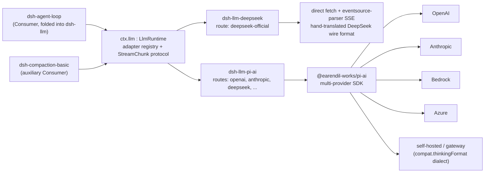

## Where this fits against the primer

[Chapter 7](../s07-capability-seams-primer/README.md) worked the bash seam end to end: `dsh-shell` owns the `ShellExecutor` Service Definition, `dsh-bash-local`/`dsh-bash-sandbox` are separate Service Provider packages, and `dsh-tool-bash` is a separate Consumer package that injects `ctx.shell` by name and never imports a provider type. That chapter already named `dsh-llm` as the counter-example to the "always three packages" reading of the pattern: `dsh-llm` folds Service Definition and Consumer into one package, because its Consumer is the agent loop itself, not a swappable schema surface. This chapter takes that one line and goes deep on it — why the fold is correct here specifically, and why the *provider* side still splits into two packages built on genuinely different internals rather than staying one adapter or forking per vendor.

## Why the fold, precisely

Every other seam in this course has a Consumer that decides what the *model* sees: `dsh-tool-bash` builds a tool schema, `dsh-tool-web` builds `web_search`/`web_fetch` schemas, `dsh-tool-fs` builds `read_file`/`write_file`. Swapping the provider underneath any of them must not change that schema, which is exactly why the Consumer lives in its own package with its own release cadence.

`ctx.llm` has no such schema to protect. Its Consumer is `dsh-agent-loop` (plus `dsh-compaction-basic` for its own auxiliary summarization calls) — the driver that already owns the turn/step loop, the session log, and the prompt assembly. There is no separate "LLM tool" a model calls; the model *is* the thing being called. A `tool-llm` package would have nothing to own: no schema, no argument parsing, no result formatting — just a pass-through to `ctx.llm.stream()` that the loop already performs directly. `packages/llm/README.md` states this compactly: "the `llm` package owns both the Service Definition and Consumer roles: the abstract service, content-block vocabulary, and stream-chunk assembler. Provider adapters register on `ctx.llm`." The generated capability graph (`docs/capability-seams.md`) confirms the shape with actual data, not just prose — `ctx.llm`'s row lists `agent-loop` and `compaction-basic` directly under "Direct consumers," with no intermediate tool package anywhere in the column.

This is the general test [Chapter 7](../s07-capability-seams-primer/README.md#the-package-boundary-rule-this-enables) closes with, applied concretely: split roles into separate packages only when they evolve independently. The Service Definition here (adapter registry, streaming vocabulary, retry-policy shape) changes on a different rhythm than adding a fourth vendor's HTTP quirks, so that split still holds. But the Definition and the one Consumer that exists change together — a new `LlmRuntime` method exists because the loop needs it, not because some independent tool schema does — so splitting them would just be two packages sharing one release cadence with an injection wire between them.

## The Service Definition: `LlmRuntime` and `ctx.llm`

`LlmRuntime` is a Cordis `Service`, not a bare interface — the same rule [Chapter 7](../s07-capability-seams-primer/README.md#the-service-definition-in-code) established for `ShellExecutor`:

```ts filename="packages/llm/llm/src/index.ts"
export class LlmRuntime extends Service {
  private adapters = new Map<string, AdapterRegistration>()
  private directory = new Map<string, LlmConfigurableProvider>()
  private discoveries = new Map<
    string,
    (request: LlmModelDiscoveryRequest) => Promise<readonly LlmDiscoveredModel[]>
  >()

  constructor(ctx: Context) {
    super(ctx, 'llm')
  }
  // registerAdapter(), listProviders(), registerConfigurableProviders(),
  // registerModelDiscovery(), providerRetryPolicy(), resolveModelInfo(),
  // resolveCallConfig(), prepareCall(), stream() ...
}
```

`super(ctx, 'llm')` claims `ctx.llm` exactly as `super(ctx, 'shell')` claimed `ctx.shell` — a second `LlmRuntime` mounted in the same context is Cordis's standard duplicate-service failure, unrelated to the per-*route* duplicate check `registerAdapter()` performs on top of it.

`LlmRuntime` is an **adapter registry with a named-route dispatch table**, structurally close to `dsh-subagent`'s named-provider registry ([Chapter 16](../s16-subagent-seam/README.md)) rather than to bash's one-executor-per-context rule. `registerAdapter(providers, adapter)` binds a set of provider route strings (`deepseek-official`, `openai`, `anthropic`, a hand-declared gateway name, …) to one `LlmAdapter` instance; a second adapter claiming an already-owned route fails with `LlmError('DUPLICATE_ADAPTER')`, but two adapters claiming disjoint routes coexist in the same registry without conflict. This is the mechanism that lets one composition mount `dsh-llm-deepseek` (owning `deepseek-official`) and `dsh-llm-pi-ai` (owning `openai`, `anthropic`, `deepseek`, and any hand-declared gateway) side by side, exactly the way a session can hold two subagent providers side by side.

Route registration is transactional and disposal-safe. The returned handle carries `replace(providers)`: the candidate route set is validated in full before anything moves, so a rejected replacement leaves the previously-registered routes serving, and the swap itself is one synchronous section — no request observes a route that is neither the old set nor the new one. This is what lets `dsh-llm-deepseek` and `dsh-llm-pi-ai` both re-register their route set in place when their *retry policy* changes through live settings, without a service restart and without a window where the route briefly disappears.

Beyond adapter dispatch, `LlmRuntime` owns the parts every Consumer and every configuration surface needs regardless of which adapter answers: the `Message`/`ContentBlock` vocabulary, the raw `StreamChunk` protocol (`block-start`, `text-delta`, `reasoning-delta`, `tool-call-delta`, `block-end`, `usage`, `finish`), `LlmCallConfig` (provider/model/reasoningEffort/temperature/maxTokens/stop as per-conversation state logged in `request/header`), the configurable-provider directory for settings surfaces, and model-discovery for interrogating a draft endpoint before a route exists.

## The provider contract: `LlmAdapter`

Every adapter — direct or wrapped — subclasses one abstract base with exactly one required method:

```ts
// packages/llm/llm/src/index.ts:180-233
export abstract class LlmAdapter {
  providerInfo(provider: string): LlmProviderInfo { return { id: provider, name: provider } }
  providerRetryPolicy(_provider: string): ResolvedRetryPolicy | undefined { return undefined }
  listModels(_provider: string): Promise<readonly LlmModelInfo[]> { return Promise.resolve([]) }
  resolveModel(provider: string, model: string, _signal?: AbortSignal): Promise<LlmResolvedModelInfo> {
    return Promise.resolve({ provider, id: model, name: model })
  }
  abstract stream(options: GenerateOptions): AsyncIterable<StreamChunk>
}
```

Everything except `stream()` has a conservative default: no retry policy (normal defaults apply), no advertised models, no resolvable capacity or reasoning metadata. An adapter that only implements `stream()` still works — it just advertises nothing about itself, and callers pass model ids straight through. `dsh-llm-deepseek` and `dsh-llm-pi-ai` both override every one of these to expose real catalogs, real capacity, and real reasoning metadata, but the base class does not require it.

## Two Service Providers, for a wire-protocol reason, not a style preference

`dsh-llm-deepseek` and `dsh-llm-pi-ai` both implement `LlmAdapter`, both stream against real HTTP endpoints, and both produce the same `StreamChunk` protocol — but they are built on deliberately different internals, and the [twin-adapters Agent Note](../../../.agents/notes/implemented/architecture/2026-06-13-twin-llm-adapters.md) explains why that pair exists at all rather than one adapter or a fork per vendor:

> A vocabulary defined against a single adapter risks baking that adapter's quirks into the "neutral" contract: anything the one implementation happens to do becomes the de-facto spec, and the abstraction is unverified until a second provider arrives — by which point the leak is expensive to fix.

The two adapters are not redundant instances of the same idea; they cover the two axes real LLM vendors actually diverge on:

**Wire-protocol divergence.** `dsh-llm-deepseek` speaks the exact DeepSeek chat-completions wire format directly: raw `fetch` plus `eventsource-parser` SSE framing, hand-translating `reasoning_content`, `prompt_cache_hit_tokens`, and DeepSeek's specific `finish_reason` vocabulary into `StreamChunk`s. There is exactly one endpoint family to get exactly right, so owning the wire bytes end to end is tractable and lets the harness assert facts a generic client could not — for instance, that the first thinking-mode chunk's empty `reasoning_content: ""` must not spawn a spurious reasoning block, or that cache-read accounting reads `prompt_cache_hit_tokens` specifically.

**Reasoning-dialect divergence.** OpenAI, Anthropic, Bedrock, Azure, and a growing set of self-hosted OpenAI-compatible gateways each have their own wire shape for "how much should the model think" — `reasoning_effort` alone, a nested `thinking: {type, budget}` object, a vendor-specific enum, or nothing at all. Hand-rolling a `dsh-llm-deepseek`-style adapter for each one does not scale: it is N wire clients to build and maintain, each duplicating auth, retry-policy plumbing, streaming-chunk translation, and model-catalog resolution for a difference that is really confined to one field. `dsh-llm-pi-ai` instead wraps `@earendil-works/pi-ai`, a third-party library that already knows how to speak to many providers, and layers the harness's own configuration, credential resolution, and reasoning-effort vocabulary on top of whatever pi-ai already handles. Adding a new gateway is then a `cordis.yml` profile, not a new adapter package — the README states the exact case: "an OpenAI-compatible gateway, a self-hosted server, or a provider newer than the installed catalog is configuration rather than a code change."

The Agent Note is explicit that the split is a **design-verification choice**, not merely a convenience: shipping two adapters against one `StreamChunk` contract from day one is what caught divergences the vocabulary needed to handle — usage-before-finish ordering, tool-call arguments as raw JSON strings end-to-end, and the two sanctioned error paths (throw from `stream()`, or end with `finish {kind:'error'|'aborted'}`) — before a third vendor's adapter would have hit them as surprises.

| | `dsh-llm-deepseek` | `dsh-llm-pi-ai` |
|---|---|---|
| Provider route(s) owned | `deepseek-official` (exactly one) | one route per configured profile — `openai`, `anthropic`, `deepseek`, any hand-declared gateway |
| Wire mechanism | direct `fetch` + `eventsource-parser` SSE, hand-translated | `@earendil-works/pi-ai`'s common streaming API; the library owns per-provider wire shape |
| Reasoning control | adapter-owned `off`/`high`/`max` mapped to DeepSeek's `reasoning_effort` / `thinking.type: disabled` | pi-ai's ordered level set (`off`…`xhigh`/`max`) via `thinkingLevelMap`, with `compat.thinkingFormat` naming the wire dialect per route/model when the endpoint URL alone can't say |
| Adding a new backend | not applicable — one vendor, hand-rolled on purpose | a new `providers.<name>` profile in config; catalog and protocol default from pi-ai or are hand-declared |
| Dependency weight | none beyond `eventsource-parser` | pulls in every pi-ai provider SDK, lazy-loaded per selected model; isolated to this opt-in package |
| Tool-call arguments | raw JSON strings natively (matches harness vocabulary) | pi-ai parses to objects; adapter re-stringifies to match harness vocabulary |

Both routes stay registered on the exact same `ctx.llm` interface, so `dsh-agent-loop` never branches on which adapter answers a given request — it calls `ctx.llm.stream()` (via `prepareCall()`) and reads `StreamChunk`s, identically either way.



## `compat.thinkingFormat`: naming a reasoning dialect pi-ai can't guess

The concrete mechanism behind "reasoning-dialect divergence" in `dsh-llm-pi-ai` is the `compat.thinkingFormat` configuration field, and it exists because pi-ai's own auto-detection has a real gap. pi-ai infers `compat.thinkingFormat` — whether a route speaks plain `reasoning_effort`, DeepSeek's `thinking: {type}` plus effort, z.ai's own `thinking` object, or another dialect — by pattern-matching the endpoint's URL. That guess works for installed catalog providers whose URLs are known in advance, but "a private gateway's URL says nothing, so a DeepSeek-dialect gateway would be spoken to in the OpenAI dialect with no way to correct it" without an explicit override. `compat.thinkingFormat` and `compat.supportsReasoningEffort` are therefore configurable both per route (the models' default) and per model (winning per field), resolving `model → route → installed catalog entry → pi-ai's URL-derived guess` — the config example in the README sets exactly this for a hand-declared gateway:

```yaml
acme-gateway:
  displayName: Acme Gateway
  apiKeyEnv: ACME_GATEWAY_API_KEY
  api: openai-completions
  baseURL: https://gateway.acme.example/v1
  # Reasoning dialect for an endpoint whose URL pi-ai cannot recognize.
  compat:
    thinkingFormat: deepseek
```

Both switches exist only on the `openai-completions` protocol, because every other pi-ai protocol carries its reasoning shape in the protocol itself rather than as a compat guess — Anthropic's and Bedrock's own wire shapes are unambiguous once the protocol is selected, so there is nothing for a URL-based guess to get wrong there.

## Two directions of asymmetry worth naming explicitly

The two adapters are asymmetric in a way that is easy to read as accidental but is fully intentional, matching what each one is actually for:

- **One route vs. many routes.** `dsh-llm-deepseek` registers exactly one route, `deepseek-official`, chosen deliberately distinct from pi-ai's own catalog name `deepseek` — the README states this lets "one composition mount both DeepSeek paths side by side," useful when comparing the hand-rolled direct path against the pi-ai-wrapped path against the same vendor. `dsh-llm-pi-ai` registers one route *per configured profile*, because its whole reason to exist is fanning one plugin instance out across many vendors' endpoints.
- **Adapter-owned vocabulary vs. inherited vocabulary.** `dsh-llm-deepseek`'s three reasoning levels (`off`/`high`/`max`) are a fixed enum this package defines and maps directly onto DeepSeek's wire fields. `dsh-llm-pi-ai`'s reasoning levels come from pi-ai's own six-level set (`off`, `minimal`, `low`, `medium`, `high`, `xhigh`, `max`), filtered per model by what that model's catalog entry or `reasoningEfforts` declaration actually supports — the vocabulary here is inherited from the wrapped library, not authored by the harness.

Neither package apologizes for the asymmetry, because the asymmetry is the design: a direct adapter owns everything about its one vendor, while a wrapping adapter owns only the harness-specific configuration and credential layer around a library that already owns vendor multiplicity.

## The companion plugin that is not a `ctx.llm` provider: `dsh-llm-retry`

`dsh-llm-retry` is easy to mistake for a third provider, and the package family table in `packages/llm/README.md` is careful to mark it otherwise: its `ctx key` column reads "listens to `agent/request-error`," not "registers on `ctx.llm`." It is a function plugin, not a `LlmAdapter` subclass, and it never wraps `ctx.llm.stream()` — every adapter call from any provider remains one single-attempt provider request. Its extension point is different in kind: it listens to the agent loop's closed-step `agent/request-error` waterfall and decides, using the **provider-owned retry policy captured at registration time** (`ctx.llm.providerRetryPolicy(provider)`), whether to schedule a fresh numbered turn as a retry.

This placement matters because it is the direct consequence of `LlmRuntime` treating retry policy as *registration metadata*, not as executed behavior: `registerAdapter()` captures each route's `retryPolicy`, and `providerRetryPolicy()` returns it — but `LlmRuntime` itself never retries anything. `packages/llm/llm/README.md`'s own limitations section states the split plainly: "provider registration stores retry policy, but `llm/stream` remains a single-attempt call wrapper... `@deepseek-ai/dsh-llm-retry` is the optional executor loaded by the shared example spine." Both real adapters configure their retry policy the same way — `dsh-llm-deepseek` takes one `retryPolicy` block for its single route; `dsh-llm-pi-ai` takes one nested inside each provider profile, "avoiding a second provider-name list" the README notes — and `dsh-llm-retry` reads whichever route's policy applied to the failed request, regardless of which adapter package owns that route.

## Token metering: `dsh-token-meter`, in the same package group, a separate seam

`dsh-token-meter` (`packages/llm/token-meter/`) ships in the same `packages/llm/` group and owns `ctx.tokenMeter`, but it is a `core` row in the capability graph, not part of the `ctx.llm` seam itself — `docs/capability-seams.md` lists it with no alternate implementations, one fixed owner. It replays the durable session log to measure request pressure (`measure()`) and price one message with a fixed four-characters-per-token heuristic (`estimateMessage()`), so `dsh-compaction-basic` and other pressure-sensitive plugins share one accounting fold without depending on `CompactionEngine` directly. It reads `ctx.llm.resolveModelInfo().context` for a route's advertised capacity but never registers on `ctx.llm` itself and never adjudicates which adapter serves a request — it is a downstream reader of what the seam already decided, packaged alongside it because both live in the same product area rather than because either is a provider of the other.

## Model, token, and KV-cache effects, one level up

Neither `dsh-llm` nor `LlmRuntime` itself adds any model-visible text, schema, or message — `packages/llm/llm/README.md`'s own Model Experience section states this directly: "None, as the service adds no model-bound text, schema, or message; it only materializes and logs an adapter-configured reasoning effort." Every model-visible and cache-visible effect lives one level down, in whichever adapter's route actually served the request:

- `dsh-llm-deepseek` reports DeepSeek's own cache-read usage (`prompt_cache_hit_tokens`) and passes reasoning content back into history only on turns that carried tool calls, per DeepSeek's own thinking-mode requirement — dropping it elsewhere saves the tokens outright since the API ignores it anyway.
- `dsh-llm-pi-ai` preserves logical request order without inserting harness-authored text; provider-native replay metadata (`replayState`) is restored only when `LlmRuntime` confirms the historical route and target route are currently owned by the *same* adapter instance, letting a provider reuse its own server-side state across turns without ever crossing between adapter families.

This is the same "pass-through, adapter and provider own the actual cache boundary" framing `LlmRuntime`'s own README gives for its KV-cache effect — the registry preserves the assembled request prefix; the selected adapter and its wrapped provider decide what happens to it next.

## What this buys, restated concretely

A deployment can point every conversation at DeepSeek through the hand-rolled direct adapter, add a second route to the same DeepSeek endpoint through pi-ai for A/B comparison (`deepseek-official` versus pi-ai's `deepseek`), and add an OpenAI-compatible internal gateway with its own reasoning dialect — all as `cordis.yml` composition and settings-layer configuration, with zero changes to `dsh-agent-loop`, which keeps calling `ctx.llm.stream()` exactly as before. That is the seam's actual payoff: the loop's one call site never grew a branch for "if DeepSeek do X, if OpenAI do Y" — every one of those decisions lives in the provider package that owns the vendor whose quirk it is.
