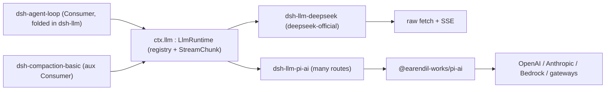

## The short version

`ctx.llm` is how the agent loop calls a model. One package (`dsh-llm`) owns the whole seam — Service Definition *and* Consumer folded together, because the Consumer is the loop itself. Two *providers* sit under it: `dsh-llm-deepseek` (hand-rolled, speaks one vendor's wire) and `dsh-llm-pi-ai` (wraps a third-party multi-provider SDK). The loop calls `ctx.llm.stream()` and never branches on which one answered. Read on for why the fold is correct and why the provider side still splits in two.

## At a glance

:::concept{term="ctx.llm / LlmRuntime"}
A Cordis `Service` that is the LLM Service Definition: an adapter registry plus the streaming `StreamChunk` protocol every consumer reads. What the loop calls.
:::

:::concept{term="LlmAdapter"}
The provider contract: one required method, `stream(options): AsyncIterable<StreamChunk>`. Everything else (model list, retry policy, resolved metadata) has a safe default.
:::

:::concept{term="StreamChunk protocol"}
The wire-neutral stream vocabulary: `block-start · text-delta · reasoning-delta · tool-call-delta · block-end · usage · finish`. Both providers emit exactly these.
:::

## Why Definition and Consumer fold into one package

Most seams have three packages because the **Consumer owns a model-visible schema** — `dsh-tool-bash` builds the bash tool schema, `dsh-tool-web` builds `web_search`/`web_fetch`. Swap the provider and that schema must not move, so the Consumer lives on its own release cadence.

`ctx.llm` has no schema to protect. Its Consumer is `dsh-agent-loop` (plus `dsh-compaction-basic` for its summarization calls) — the driver that already owns the turn/step loop and prompt assembly. There is no distinct "LLM tool": a `dsh-tool-llm` package would have nothing to own, just a pass-through to `ctx.llm.stream()` the loop already does directly.

:::decision
Split roles into separate packages only when they evolve independently. The Definition (registry, stream vocabulary, retry shape) changes on a different rhythm than adding one new vendor's HTTP quirks — so it *does* split from the providers. But the Definition and its one Consumer change together — a new `LlmRuntime` method exists because the loop needs it — so folding those two is right, and it is exactly why the generated graph lists `agent-loop` and `compaction-basic` as `ctx.llm`'s direct consumers with no tool in between.
:::

## The mechanism: named-route dispatch

> [!NOTE]
> `LlmRuntime` is an **adapter registry with a named-route dispatch table** — closer to `dsh-subagent`'s named-provider registry (s16) than to bash's one-executor rule.

- `registerAdapter(providers, adapter)` binds a set of route strings (`deepseek-official`, `openai`, `anthropic`, a hand-declared gateway, …) to one adapter. A second adapter claiming an owned route fails `DUPLICATE_ADAPTER`; disjoint routes coexist.
- Registration is **transactional and disposal-safe**: the candidate route set is validated in full before the swap, so a rejected replacement keeps serving the old routes — no request ever sees a route that's "neither old nor new."

Let me restate the full definition excerpt for clarity as it's the one snippet worth lingering on:

```ts filename="packages/llm/llm/src/index.ts"
export class LlmRuntime extends Service {
  private adapters = new Map<string, AdapterRegistration>()
  private directory = new Map<string, LlmConfigurableProvider>()
  private discoveries = new Map<string, (request) => Promise<readonly LlmDiscoveredModel[]>>()
  constructor(ctx: Context) { super(ctx, 'llm') }
  // registerAdapter(), listProviders(), registerConfigurableProviders(),
  // registerModelDiscovery(), providerRetryPolicy(), resolveModelInfo(),
  // resolveCallConfig(), prepareCall(), stream() ...
}
```

`super(ctx, 'llm')` claims `ctx.llm` — mounting a second `LlmRuntime` is Cordis's standard duplicate-service failure.

The provided code below for the adapter appears significant to the reader so I want to wall it off instead of giving another code variable shot.

```ts
// packages/llm/llm/src/index.ts:180-233
export abstract class LlmAdapter {
  providerInfo(provider: string): LlmProviderInfo { return { id: provider, name: provider } }
  providerRetryPolicy(_provider: string): ResolvedRetryPolicy | undefined { return undefined }
  listModels(_provider: string): Promise<readonly LlmModelInfo[]> { return Promise.resolve([]) }
  resolveModel(provider: string, model: string, _signal?: AbortSignal): Promise<LlmResolvedModelInfo> {
    return Promise.resolve({ provider, id: model, name: model })
  }
  abstract stream(options: GenerateOptions): AsyncIterable<StreamChunk>
}
```

## Two providers, two real axes of divergence

:::decision
A vocabulary defined against one adapter risks baking that adapter's quirks into the "neutral" contract — the abstraction is unverified until a second provider arrives. Shipping two from day one is what caught the divergences the vocabulary needed to handle.
:::

The pair is not redundant — they cover the two axes vendors actually diverge on:

- **Wire protocol.** `dsh-llm-deepseek` speaks DeepSeek's exact chat-completions wire with raw `fetch` + SSE framing, hand-translating `reasoning_content` and `prompt_cache_hit_tokens`. One endpoint to get exactly right lets it assert facts a generic client can't.
- **Reasoning dialect.** OpenAI/Anthropic/Bedrock/gateways each format "how much should it think" differently. `dsh-llm-pi-ai` wraps `@earendil-works/pi-ai`, a library that already speaks to many providers, so a new gateway is a config profile, not a new adapter.

| | `dsh-llm-deepseek` | `dsh-llm-pi-ai` |
|---|---|---|
| Route(s) | `deepseek-official` (one) | one per profile — `openai`, `anthropic`, `deepseek`, gateways |
| Wire | raw `fetch` + SSE, hand-translated | `@earendil-works/pi-ai` SDK, library owns per-provider wire |
| Reasoning | fixed enum `off/high/max` → DeepSeek fields | pi-ai's `off…xhigh/max` via `thinkingLevelMap` + `compat.thinkingFormat` |
| New backend | not applicable (one vendor on purpose) | a `providers.<name>` config profile |
| Tool-call args | raw JSON strings natively | pi-ai parses to objects; adapter re-stringifies to match |

Both stay registered on the same `ctx.llm`, so `dsh-agent-loop` never branches — it calls `ctx.llm.stream()` and reads `StreamChunk`s identically for either.



## `compat.thinkingFormat`: naming a dialect pi-ai can't guess

pi-ai infers the reasoning dialect (`reasoning_effort` vs DeepSeek's `thinking:{type}` vs z.ai's object) by pattern-matching the endpoint URL. A private gateway's URL says nothing — without an override it would be spoken to in the OpenAI dialect. `compat.thinkingFormat` resolves `model → route → installed catalog → URL guess`, configured per route/model:

```yaml
acme-gateway:
  api: openai-completions
  baseURL: https://gateway.acme.example/v1
  compat:
    thinkingFormat: deepseek   # dialect the URL can't reveal
```

## Not every sibling is a provider

- **`dsh-llm-retry`** — *not* a provider. It listens to the loop's `agent/request-error` waterfall and, using the retry policy `LlmRuntime` captured at registration (`providerRetryPolicy(provider)`), schedules a retry. `LlmRuntime` stores the policy but never retries.
- **`dsh-token-meter`** — a `core` row, one fixed owner, not part of the `ctx.llm` seam. It replays the session log to measure request pressure for compaction; it *reads* `ctx.llm.resolveModelInfo()` but never registers on `ctx.llm`.

Neither `dsh-llm` nor `LlmRuntime` adds any model-visible text — it only materializes and logs the adapter-configured reasoning effort. Every cache/token effect lives one level down, in whichever adapter's route served.

## Payoff

Point every conversation at DeepSeek via the direct adapter, add a second route to the same endpoint via pi-ai for A/B, and add a gateway with its own dialect — all as `cordis.yml` composition, zero changes to the loop. The loop's one call site never grew an "if DeepSeek do X, if OpenAI do Y" branch: every one of those decisions lives in the provider package that owns the vendor whose quirk it is.
