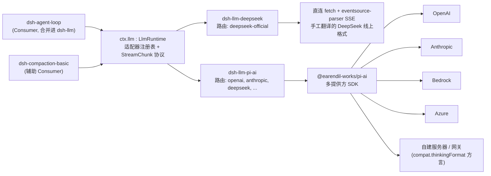

## 这一章在全局中的位置

[第 7 章](../s07-capability-seams-primer/README.zh.md)完整跑通了 bash 这个 seam:`dsh-shell` 拥有 `ShellExecutor` 这个 Service Definition,`dsh-bash-local`/`dsh-bash-sandbox` 是各自独立的 Service Provider 包,`dsh-tool-bash` 则是独立的 Consumer 包——它按名字注入 `ctx.shell`,从不 import 任何提供方的具体类型。那一章已经把 `dsh-llm` 点名为"三个包"这种读法的反例:`dsh-llm` 把 Service Definition 和 Consumer 合并进同一个包,因为它的 Consumer 就是 agent loop 本身,而不是一个可替换的 schema 界面。本章要把那一句话彻底展开——为什么这里的合并恰恰是正确的,以及为什么提供方那一侧仍然要分裂成两个包、建立在真正不同的内部实现之上,而不是留一个适配器,也不是按厂商各写一份分叉。

## 为什么要合并,准确地说

本课程中出现过的每一个其他 seam,其 Consumer 决定的都是**模型**能看到什么:`dsh-tool-bash` 构建一份工具 schema,`dsh-tool-web` 构建 `web_search`/`web_fetch` 的 schema,`dsh-tool-fs` 构建 `read_file`/`write_file` 的 schema。替换底下的提供方绝不能改变这份 schema——这正是 Consumer 独立成包、拥有自己发布节奏的原因。

`ctx.llm` 根本没有这样一份需要保护的 schema。它的 Consumer 是 `dsh-agent-loop`(以及为自身辅助摘要调用服务的 `dsh-compaction-basic`)——这个驱动器已经拥有 turn/step 循环、会话日志和提示词组装。这里不存在一个单独的"LLM 工具"供模型调用;模型本身就是被调用的那个对象。一个 `tool-llm` 包将无物可拥有:没有 schema、没有参数解析、没有结果格式化——只剩一层对 `ctx.llm.stream()` 的透传,而这层透传 loop 本来就直接在做。`packages/llm/README.md` 对此的表述很精炼:"`llm` 包同时承担 Service Definition 和 Consumer 角色:抽象服务、内容块词汇和流式分片组装器。提供方适配器注册到 `ctx.llm`。"生成的能力图(`docs/capability-seams.md`)用实际数据而非叙述确认了这一形状——`ctx.llm` 这一行"Direct consumers"列里直接列着 `agent-loop` 和 `compaction-basic`,中间没有任何工具包。

这正是[第 7 章](../s07-capability-seams-primer/README.zh.md#the-package-boundary-rule-this-enables)结尾给出的通用检验标准的一次具体应用:只有当角色以不同节奏演化时,才把它们拆成独立的包。这里的 Service Definition(适配器注册表、流式词汇、重试策略的形状)确实以不同于"给第四个厂商的 HTTP 怪癖打补丁"的节奏在变化,所以这层拆分依然成立。但 Definition 与唯一存在的那个 Consumer 是一起演化的——`LlmRuntime` 新增一个方法,是因为 loop 需要它,而不是因为某个独立的工具 schema 需要它——把它们拆开只会得到两个共享同一发布节奏、中间靠注入连线的包。

## Service Definition:`LlmRuntime` 与 `ctx.llm`

`LlmRuntime` 是一个 Cordis `Service`,不是裸接口——与[第 7 章](../s07-capability-seams-primer/README.zh.md#the-service-definition-in-code)为 `ShellExecutor` 定下的规则完全一致:

```ts filename="packages/llm/llm/src/index.ts"
export class LlmRuntime extends Service {
  private adapters = new Map<string, AdapterRegistration>()
  private directory = new Map<string, LlmConfigurableProvider>()
  private discoveries = new Map<
    string,
    (request: LlmModelDiscoveryRequest) => Promise<readonly LlmDiscoveredModel[]>
  >()

  constructor(ctx: Context) {
    super(ctx, 'llm')
  }
  // registerAdapter()、listProviders()、registerConfigurableProviders()、
  // registerModelDiscovery()、providerRetryPolicy()、resolveModelInfo()、
  // resolveCallConfig()、prepareCall()、stream() ……
}
```

`super(ctx, 'llm')` 占据 `ctx.llm`,与 `super(ctx, 'shell')` 占据 `ctx.shell` 的方式完全一样——在同一个 context 里挂载第二个 `LlmRuntime` 会触发 Cordis 标准的重复服务失败,这与 `registerAdapter()` 在其上再做的按**路由**去重检查是两回事。

`LlmRuntime` 是一个**带具名路由分派表的适配器注册表**,其结构更接近 `dsh-subagent` 的具名 provider 注册表([第 16 章](../s16-subagent-seam/README.zh.md)),而不是 bash 那种"每个上下文一个执行器"的规则。`registerAdapter(providers, adapter)` 把一组 provider 路由字符串(`deepseek-official`、`openai`、`anthropic`、某个手工声明的网关名,……)绑定到一个 `LlmAdapter` 实例上;第二个适配器若声明一个已被占用的路由,会以 `LlmError('DUPLICATE_ADAPTER')` 失败,但两个适配器各自声明互不相交的路由集合,可以在同一个注册表里共存,互不冲突。正是这个机制,让一次组合可以同时挂载 `dsh-llm-deepseek`(占据 `deepseek-official`)和 `dsh-llm-pi-ai`(占据 `openai`、`anthropic`、`deepseek` 以及任意手工声明的网关),就像一个会话可以同时持有两个 subagent provider 一样。

路由注册是事务性的,并且对释放安全。返回的句柄携带 `replace(providers)`:候选路由集合会先完整校验,任何东西移动之前都要通过,所以一次被拒绝的替换会让先前已注册的路由继续服务,而替换本身是一个同步区段——没有任何请求会观察到一个既非旧集合也非新集合的中间态。正是这一点,让 `dsh-llm-deepseek` 与 `dsh-llm-pi-ai` 都能在自己的**重试策略**通过实时设置发生变化时,原地重新注册自己的路由集合,既不需要重启服务,也不会出现路由短暂消失的窗口。

除了适配器分派之外,`LlmRuntime` 还拥有每个 Consumer 和每个配置界面都需要、且与具体哪个适配器应答无关的部分:`Message`/`ContentBlock` 词汇、原始 `StreamChunk` 协议(`block-start`、`text-delta`、`reasoning-delta`、`tool-call-delta`、`block-end`、`usage`、`finish`)、`LlmCallConfig`(provider/model/reasoningEffort/temperature/maxTokens/stop 这些记录在 `request/header` 里的按会话状态)、供设置界面使用的可配置 provider 目录,以及在路由存在之前对草稿端点进行询问的模型发现能力。

## 提供方约定:`LlmAdapter`

无论是直连型还是包装型,每一个适配器都继承同一个抽象基类,其中只有一个方法是必需的:

```ts
// packages/llm/llm/src/index.ts:180-233
export abstract class LlmAdapter {
  providerInfo(provider: string): LlmProviderInfo { return { id: provider, name: provider } }
  providerRetryPolicy(_provider: string): ResolvedRetryPolicy | undefined { return undefined }
  listModels(_provider: string): Promise<readonly LlmModelInfo[]> { return Promise.resolve([]) }
  resolveModel(provider: string, model: string, _signal?: AbortSignal): Promise<LlmResolvedModelInfo> {
    return Promise.resolve({ provider, id: model, name: model })
  }
  abstract stream(options: GenerateOptions): AsyncIterable<StreamChunk>
}
```

除 `stream()` 之外的每个方法都有保守的默认实现:没有重试策略(套用普通默认值)、不宣称任何模型、无法解析出容量或推理元数据。一个只实现了 `stream()` 的适配器依然能工作——只是它对自身一无所述,调用方直接透传模型 id。`dsh-llm-deepseek` 与 `dsh-llm-pi-ai` 都重写了以上每一个方法,以暴露真实的目录、真实的容量和真实的推理元数据,但基类并不强制这么做。

## 两个 Service Provider,原因是线上协议的分歧,而非风格偏好

`dsh-llm-deepseek` 与 `dsh-llm-pi-ai` 都实现了 `LlmAdapter`,都对真实的 HTTP 端点发起流式调用,产出的也是同一套 `StreamChunk` 协议——但它们建立在刻意选择的不同内部实现之上,[孪生适配器 Agent Note](../../../.agents/notes/implemented/architecture/2026-06-13-twin-llm-adapters.md) 解释了为什么会存在这样一对适配器,而不是一个适配器,也不是按厂商各分叉一份:

> 若一份词汇只针对单一适配器定义,就有把该适配器的怪癖固化进这份"中立"约定里的风险:这一个实现碰巧做的任何事,都会变成事实上的规范,而这套抽象在第二个提供方到来之前始终未经验证——等到那时再修补这个泄漏,代价已经很高。

这两个适配器并非同一想法的冗余实例;它们分别覆盖了真实 LLM 厂商真正分道扬镳的两个维度:

**线上协议的分歧。** `dsh-llm-deepseek` 直接说 DeepSeek chat-completions 精确的线上格式:原始 `fetch` 加 `eventsource-parser` 的 SSE 分帧,手工把 `reasoning_content`、`prompt_cache_hit_tokens`,以及 DeepSeek 特有的 `finish_reason` 词汇翻译成 `StreamChunk`。这里只有一个端点家族需要被彻底做对,所以端到端拥有线缆字节是可行的,并且能让 harness 断言一个通用客户端做不到的事实——比如,第一个 thinking 模式分片里空的 `reasoning_content: ""` 不应该生出一个虚假的 reasoning 块,或者缓存读取计费要专门读取 `prompt_cache_hit_tokens`。

**推理方言的分歧。** OpenAI、Anthropic、Bedrock、Azure,以及数量还在增长的自建 OpenAI 兼容网关,各自都有一套"模型该想多久"的线上表达——单独一个 `reasoning_effort`、一个嵌套的 `thinking: {type, budget}` 对象、某个厂商专属的枚举,或者干脆什么都没有。像 `dsh-llm-deepseek` 那样为每一个都手写一份适配器无法扩展:那是 N 份线缆客户端要构建和维护,每一份都要重复认证、重试策略管线、流式分片翻译、模型目录解析——而真正的差异其实只集中在一个字段上。`dsh-llm-pi-ai` 转而包装 `@earendil-works/pi-ai`——一个已经知道如何对接多家提供方的第三方库——并在 pi-ai 已经处理好的一切之上,叠加 harness 自己的配置、凭证解析和推理力度词汇。新增一个网关因此变成一份 `cordis.yml` profile,而不是一个新适配器包——README 里写得很直白:"一个 OpenAI 兼容网关、一台自建服务器,或者一个比已安装目录更新的提供方,都是配置而非代码变更。"

Agent Note 明确指出这个拆分是一个**设计验证选择**,而不只是图方便:从第一天起就针对同一份 `StreamChunk` 约定发布两个适配器,正是这样才捕捉到了这份词汇需要处理的分歧——usage 先于 finish 的次序、工具调用参数端到端都是原始 JSON 字符串、以及两条被认可的错误路径(从 `stream()` 抛出,或者以 `finish {kind:'error'|'aborted'}` 结束)——而这些原本会在第三家厂商的适配器出现时才被当作意外撞见。

| | `dsh-llm-deepseek` | `dsh-llm-pi-ai` |
|---|---|---|
| 占据的 provider 路由 | `deepseek-official`(恰好一个) | 每个已配置 profile 对应一个路由——`openai`、`anthropic`、`deepseek`、任意手工声明的网关 |
| 线上机制 | 直连 `fetch` + `eventsource-parser` 的 SSE,手工翻译 | `@earendil-works/pi-ai` 的通用流式 API;线上具体形状由该库负责 |
| 推理控制 | 适配器自定义的 `off`/`high`/`max`,映射到 DeepSeek 的 `reasoning_effort` / `thinking.type: disabled` | pi-ai 的有序等级集合(`off`……`xhigh`/`max`),经由 `thinkingLevelMap`;当端点 URL 本身说不清楚时,由 `compat.thinkingFormat` 按路由/模型指明线上方言 |
| 新增一个后端 | 不适用——只有一个厂商,刻意手写 | 在配置里新增一个 `providers.<name>` profile;目录与协议默认来自 pi-ai,或手工声明 |
| 依赖体量 | 除 `eventsource-parser` 外无其他依赖 | 拉入每一个 pi-ai provider SDK,按所选模型按需加载;体量隔离在这个可选包内 |
| 工具调用参数 | 原生就是原始 JSON 字符串(与 harness 词汇天然吻合) | pi-ai 解析成对象;适配器再序列化回去以匹配 harness 词汇 |

两条路由都注册在完全同一个 `ctx.llm` 接口上,所以 `dsh-agent-loop` 从不需要根据"是哪个适配器在应答"来分支——它调用 `ctx.llm.stream()`(经由 `prepareCall()`)并读取 `StreamChunk`,无论哪个适配器应答,行为都完全一致。



## `compat.thinkingFormat`:命名一种 pi-ai 猜不出来的推理方言

`dsh-llm-pi-ai` 里"推理方言分歧"背后的具体机制,是 `compat.thinkingFormat` 这个配置字段,而它之所以存在,是因为 pi-ai 自身的自动探测存在一个真实的缺口。pi-ai 通过对端点 URL 做模式匹配来推断 `compat.thinkingFormat`——判断一条路由说的是纯粹的 `reasoning_effort`、DeepSeek 的 `thinking: {type}` 加 effort、z.ai 自己的 `thinking` 对象,还是别的方言。这个猜测对已安装目录里的提供方是有效的,因为它们的 URL 提前就是已知的,但"一个私有网关的 URL 什么都说明不了,所以一个 DeepSeek 方言的网关会被以 OpenAI 方言对话,且无从纠正",除非有一个显式的覆盖项。因此 `compat.thinkingFormat` 与 `compat.supportsReasoningEffort` 既可以在路由层配置(作为该路由下模型的默认值),也可以在模型层配置(逐字段生效),解析顺序是 `模型 → 路由 → 已安装目录条目 → pi-ai 基于 URL 的猜测`——README 里给手工声明网关的配置示例正是这么设置的:

```yaml
acme-gateway:
  displayName: Acme Gateway
  apiKeyEnv: ACME_GATEWAY_API_KEY
  api: openai-completions
  baseURL: https://gateway.acme.example/v1
  # 为一个 pi-ai 无法从 URL 识别的端点指明推理方言。
  compat:
    thinkingFormat: deepseek
```

这两个开关都只存在于 `openai-completions` 协议上,因为其它每一种 pi-ai 协议都把推理的线上形状固化在协议本身里,而不是靠一个基于 URL 的猜测——Anthropic 和 Bedrock 各自的线上形状一旦选定协议就毫无歧义,所以那里没有什么是基于 URL 的猜测会猜错的。

## 两处值得明说的不对称

这两个适配器之间的不对称很容易被误读成疏忽,但其实完全是有意为之,恰好对应了各自真正要做的事:

- **一条路由 vs. 多条路由。** `dsh-llm-deepseek` 恰好注册一条路由 `deepseek-official`,并刻意选得与 pi-ai 自己的目录名 `deepseek` 不同——README 指出这让"一次组合可以让两条 DeepSeek 路径并存",这在把手写直连路径与 pi-ai 包装路径对同一厂商做对比时很有用。`dsh-llm-pi-ai` 则**按每个已配置 profile** 注册一条路由,因为它存在的全部理由,就是让单个插件实例横跨扇出到多家厂商的端点。
- **适配器自有词汇 vs. 继承来的词汇。** `dsh-llm-deepseek` 的三个推理等级(`off`/`high`/`max`)是这个包自己定义、直接映射到 DeepSeek 线上字段的固定枚举。`dsh-llm-pi-ai` 的推理等级来自 pi-ai 自身的六级集合(`off`、`minimal`、`low`、`medium`、`high`、`xhigh`、`max`),再按每个模型的目录条目或 `reasoningEfforts` 声明实际支持的部分过滤——这里的词汇是从被包装的库里继承来的,不是 harness 自己author 的。

两个包都不为这种不对称道歉,因为不对称本身就是设计所在:一个直连适配器拥有其唯一厂商的一切;一个包装适配器只拥有 harness 特有的配置与凭证层,叠加在一个本已拥有厂商多样性的库之上。

## 那个不是 `ctx.llm` 提供方的伙伴插件:`dsh-llm-retry`

`dsh-llm-retry` 很容易被误认成第三个 provider,`packages/llm/README.md` 里的包家族表特意把它标注成别的东西:它的 `ctx key` 一列写的是"监听 `agent/request-error`",而不是"注册到 `ctx.llm`"。它是一个函数插件,不是 `LlmAdapter` 的子类,也从不包装 `ctx.llm.stream()`——来自任何提供方的每一次适配器调用,依然都是一次单次尝试的 provider 请求。它的扩展点性质完全不同:它监听 agent loop 已关闭步骤上的 `agent/request-error` waterfall,并借助**在注册时就已捕获的、provider 自有的重试策略**(`ctx.llm.providerRetryPolicy(provider)`)来决定是否安排一个全新编号的重试轮次。

这个位置安排之所以重要,是因为它直接源自 `LlmRuntime` 把重试策略当作**注册期元数据**、而非已执行行为来处理的方式:`registerAdapter()` 捕获每条路由的 `retryPolicy`,`providerRetryPolicy()` 把它返回出来——但 `LlmRuntime` 本身从不重试任何东西。`packages/llm/llm/README.md` 自己的局限性小节把这个拆分讲得很清楚:"provider 注册保存了重试策略,但 `llm/stream` 依然是一个单次尝试的调用包装……`@deepseek-ai/dsh-llm-retry` 是共享示例组合装载的可选执行器。"两个真实适配器配置重试策略的方式相同——`dsh-llm-deepseek` 为它唯一的路由取一个 `retryPolicy` 块;`dsh-llm-pi-ai` 把它嵌套在每个 provider profile 内部,README 里说这是为了"避免第二份按 provider 名字列出的清单"——而 `dsh-llm-retry` 读取的,始终是应用于那次失败请求的那条路由的策略,无论那条路由归属于哪个适配器包。

## Token 计量:`dsh-token-meter`,同一个包组,不同的 seam

`dsh-token-meter`(`packages/llm/token-meter/`)与其它包同属 `packages/llm/` 这一组,拥有 `ctx.tokenMeter`,但在能力图里它是一行 `core`,不属于 `ctx.llm` 这个 seam 本身——`docs/capability-seams.md` 把它列为没有替代实现、只有一个固定所有者。它回放持久化会话日志来测量请求压力(`measure()`),并用一个固定的"每 token 约四个字符"启发式给一条消息定价(`estimateMessage()`),这样 `dsh-compaction-basic` 及其它对压力敏感的插件就能共享同一份计量折叠,而无需直接依赖 `CompactionEngine`。它读取 `ctx.llm.resolveModelInfo().context` 来获取一条路由所宣称的容量,但自己从不注册到 `ctx.llm` 上,也从不裁决由哪个适配器来服务某个请求——它是这个 seam 已经做出的决定的下游读者,之所以和它打包在一起,是因为二者同属一个产品领域,而不是因为其中一个是另一个的 provider。

## 模型、token 与 KV 缓存效应,要上移一层看

`dsh-llm` 和 `LlmRuntime` 本身都不添加任何模型可见的文本、schema 或消息——`packages/llm/llm/README.md` 自己的 Model Experience 小节直接写明:"无,因为该服务不添加任何模型绑定的文本、schema 或消息;它只是把一个适配器配置的推理力度物化并记录下来。"每一个模型可见与缓存可见的效应都生活在低一层——具体到底是哪一个适配器的哪条路由真正服务了这个请求:

- `dsh-llm-deepseek` 上报 DeepSeek 自己的缓存读取用量(`prompt_cache_hit_tokens`),并且只在带有工具调用的轮次里把推理内容回传进历史——这是 DeepSeek 自身 thinking 模式的要求;其它场合直接丢弃,因为反正 API 也会忽略它,这样做能直接省下那部分 token。
- `dsh-llm-pi-ai` 在不插入任何 harness author 文本的前提下保留逻辑请求顺序;provider 原生的回放元数据(`replayState`)只有在 `LlmRuntime` 确认历史路由与目标路由当前归属**同一个**适配器实例时才会被恢复,这样一个 provider 才能复用它自己服务端保存的状态,而不会跨适配器家族发生错乱。

这与 `LlmRuntime` 自己 README 给出的 KV 缓存效应表述是一致的:"透传——注册表保留组装好的请求前缀,而被选中的适配器与提供方拥有实际的缓存复用与路由边界。"

## 这套设计到底换来了什么,再具体说一遍

一次部署可以把所有对话都指向 DeepSeek,走那个手写的直连适配器;再通过 pi-ai 给同一个 DeepSeek 端点加一条路由用于 A/B 对比(`deepseek-official` 对 pi-ai 的 `deepseek`);再加一个带有自己推理方言的内部 OpenAI 兼容网关——这一切都只是 `cordis.yml` 组合与设置层的配置改动,`dsh-agent-loop` 不需要任何改动,它照旧调用 `ctx.llm.stream()`。这就是这个 seam 真正的收益:loop 那一个调用点从未为"如果是 DeepSeek 就做 X,如果是 OpenAI 就做 Y"长出过任何分支——每一个这样的决定,都活在拥有对应厂商那个怪癖的 provider 包里。
