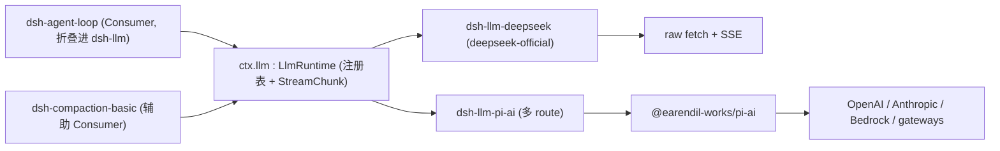

## 一句话版本

`ctx.llm` 是 agent loop 调模型的入口。一个包(`dsh-llm`）就装了整条 seam——Service Definition 与 Consumer 折叠在一起，因为它的 Consumer 就是 loop 自己。下面挂两个 **Provider**:`dsh-llm-deepseek`（手写，只讲一家厂商的 wire）与 `dsh-llm-pi-ai`（包装一个多方 SDK)。loop 调 `ctx.llm.stream()`，从不区分是谁应答。下文讲清为什么这个 fold 是对的、provider 为什么分两家。

## 速览

:::concept{term="ctx.llm / LlmRuntime"}
Cordis `Service`——整章的 Service Definition。一个 adapter 注册表，外加所有 Consumer 共用的 `StreamChunk` 流协议。loop 调的就是它。
:::

:::concept{term="LlmAdapter"}
Provider 契约：唯一必需的方法是 `stream(options): AsyncIterable<StreamChunk>`。其余（模型清单/retry policy/解析元数据）都有保守默认。
:::

:::concept{term="StreamChunk 协议"}
与厂商无关的流词汇:`block-start · text-delta · reasoning-delta · tool-call-delta · block-end · usage · finish`。两家 Provider 都照此产出。
:::

## 为什么 Definition 与 Consumer 折叠在一个包

多数 seam 要有三个包，是因为**Consumer 保有一个模型可见的 schema**——`dsh-tool-bash` 灌一个 bash tool schema,`dsh-tool-web` 灌 `web_search`/`web_fetch`。换掉 provider 时 schema 不能动，所以 Consumer 要有自己的发行节奏。

`ctx.llm` 没有这种需要守护的 schema。它的 Consumer 就是 `dsh-agent-loop`（加上 `dsh-compaction-basic` 用它做压缩 summarize 调用）——这个 loop 本来就拥有 turn/step 循环与 prompt 组装。所谓"LLM tool"根本不存在：`dsh-tool-llm` 会没活干——没 schema、没参数解析，只是一层 `ctx.llm.stream()` 的转接，而这本来就是 loop 的直接动作。

:::decision
只有当两个角色按各自节奏演进时才值得拆包。Definition（注册表、stream 词汇、retry 形状）与厂商 HTTP 怪癖的节奏不同，所以**该**与 provider 分家；但 Definition 与唯一的 Consumer 是同步演进的——`LlmRuntime` 新加一个方法，是因为 loop 需要——所以折叠在一起是对的。这也正是生成图谱把 `agent-loop` 和 `compaction-basic` 直接列为 `ctx.llm` 直接 Consumer 的原因，中间没有 tool。
:::

## 机制：按名分派的 route 表

> [!NOTE]
> `LlmRuntime` 是一个**带 named-route dispatch table 的 adapter 注册表**——结构上更像 `dsh-subagent` 的 named-provider 注册表（见 s16)，而非 bash 那套"一 context 一 executor"。

- `registerAdapter(providers, adapter)` 把一组 route 字符串（`deepseek-official`、`openai`、`anthropic`、手写 gateway…）绑到一个 adapter。两个 adapter 抢同一个 route 会报 `DUPLICATE_ADAPTER`；但 disjoint 的 route 可以并存。
- 注册是**事务性、可回收安全**的：候选 route 集合先整体验证再执行——被拒绝的替换仍保留旧 route 接流量，不会有请求落在"既不是旧也不是新"的 route 上。

LLM 小包完整签名如下，是你想要停留在的唯一片段：

```ts filename="packages/llm/llm/src/index.ts"
export class LlmRuntime extends Service {
  private adapters = new Map<string, AdapterRegistration>()
  private directory = new Map<string, LlmConfigurableProvider>()
  private discoveries = new Map<string, (request) => Promise<readonly LlmDiscoveredModel[]>>()
  constructor(ctx: Context) { super(ctx, 'llm') }
  // registerAdapter(), listProviders(), registerConfigurableProviders(),
  // registerModelDiscovery(), providerRetryPolicy(), resolveModelInfo(),
  // resolveCallConfig(), prepareCall(), stream() ...
}
```

`super(ctx, 'llm')` 认领 `ctx.llm`；把同一个 `LlmRuntime` 挂在同 context 里会触发 Cordis 的统一 duplicate-service 失败。

Provider 的抽象类只有 `stream()` 是必需实现：

```ts
// packages/llm/llm/src/index.ts:180-233
export abstract class LlmAdapter {
  providerInfo(provider: string): LlmProviderInfo { return { id: provider, name: provider } }
  providerRetryPolicy(_provider: string): ResolvedRetryPolicy | undefined { return undefined }
  listModels(_provider: string): Promise<readonly LlmModelInfo[]> { return Promise.resolve([]) }
  resolveModel(provider, model, _signal?): Promise<LlmResolvedModelInfo> {
    return Promise.resolve({ provider, id: model, name: model })
  }
  abstract stream(options: GenerateOptions): AsyncIterable<StreamChunk>
}
```

## 两家 Provider、两条真分歧

:::decision
只针对一个 adapter 定义的词汇，很容易把那个 adapter 的怪癖烤进"中立"契约——等第二个 provider 到来才验证，就太昂贵了。两家从一开始就字屏，正是这个接缝找出分歧的原角。
:::

这一对不是冗余——它们覆盖厂商真正分歧的两条轴线：

- **Wire 协议。** `dsh-llm-deepseek` 用 raw `fetch` + SSE 讲 DeepSeek 的真实 chat-completions wire，手工转译 `reasoning_content` 与 `prompt_cache_hit_tokens`——只面对一个 endpoint，能断言一般 client 断言不了的事。
- **Reasoning 方言。** OpenAI/Anthropic/Bedrock/gateway 表述"模型思考多少"的方式不一。`dsh-llm-pi-ai` 包装 `@earendil-works/pi-ai` 这个已会讲多家厂商的库——新接一个 gateway 只是配置 profile，不是新写 adapter 包。

| | `dsh-llm-deepseek` | `dsh-llm-pi-ai` |
|---|---|---|
| Route | `deepseek-official`（只此一条） | 一条/config profile——`openai`、`anthropic`、`deepseek`、gateway |
| Wire | raw `fetch` + SSE，手工转译 | `@earendil-works/pi-ai` SDK，库自己讲各家 wire |
| Reasoning | 固定枚举 `off/high/max` 落到 DeepSeek 字段 | pi-ai 的 `off…xhigh/max`，配合 `thinkingLevelMap` 与 `compat.thinkingFormat` |
| 新接入 | 不适用（一家厂商是有意为之） | 一条 `providers.<name>` 配置 |
| Tool 参数 | 原生倒 JSON 字符串 | pi-ai 解析成对象；adapter 再转回字符串，与 harness 杆约 |

两家都挂在同一个 `ctx.llm` 上，所以 `dsh-agent-loop` 从不分支——都是一样的 `ctx.llm.stream()`、一样的 `StreamChunk`。



## `compat.thinkingFormat`：命名 pi-ai 猜不出的方言

pi-ai 靠终端 URL 反推 reasoning 方言（`reasoning_effort` / DeepSeek 的 `thinking:{type}` / z.ai 的对象）。私有 gateway 的 URL 什么线索也没有——不设 override 就按 OpenAI 方言讲。`compat.thinkingFormat` 依次按 `model → route → 已安装 catalog → URL 猜测` 求解，per route/model 皆可配置：

```yaml
acme-gateway:
  api: openai-completions
  baseURL: https://gateway.acme.example/v1
  compat:
    thinkingFormat: deepseek   # URL 猜不出的方言
```

## 兄弟包不等于 Provider

- **`dsh-llm-retry`**——**不是** Provider。它监听 loop 的 `agent/request-error` waterfall，按 `LlmRuntime` 注册时捕获的 retry policy(`providerRetryPolicy(provider)`)决定是否重试。`LlmRuntime` 只存 policy，从不自己重试。
- **`dsh-token-meter`**——`core` 档，只有一个固定 owner，不属于 `ctx.llm` seam。它回放 session log 给 compaction 测请求压力；它**读** `ctx.llm.resolveModelInfo()`，但从不注册到 `ctx.llm` 上。

`dsh-llm` 与 `LlmRuntime` 本身不往模型上摆任何文本、schema 或 message——它只把 adapter 配置的 reasoning effort 具体化并落日志。任何缓存/token 效果都发生在下层 adapter 的 route 上。

## 最后是为什么这就值

把所有对话指向 DeepSeek 直连 adapter，又用 pi-ai 加一条走到同个 endpoint 的 route 做 A/B，再挂一个带自家方言的 gateway——全部都在 `cordis.yml` 的 composition 里完成，loop 一行未动。loop 唯一的调用点从来没长出"if DeepSeek 做 X,if OpenAI 做 Y"的分支——这类决定都被放进拥有那一家怪癖的 provider 包里。
