## 两种可见协作 seam，而非副作用

到目前为止的每一章讲的工具都在「做」某件事：跑一条命令、读一个文件、等一次批准。`todo_write` 和 plan mode 属于不同的一类。这两个工具都没有模型用文字回答说不出来的外部副作用。它们买到的东西是**人类（或界面）能在对话旁边观察到的、可见、持久、结构化的状态**——一份持续显示在界面上的任务清单，以及一个会在模型行动之前改变其指令的模式开关。这两种机制完全建立在前面章节已经确立的原语之上：一个 `SessionEventMap` 成员、整值替换折叠、一个 `ctx.systemPrompt` 段落，以及（对 plan mode 而言）来自[权限与审批](../s09-permissions-and-approval/README.md)一章的 `ctx.userQuestions` 评审 seam。两者都不需要任何新的循环机制。

把两者放在一起读，还能形成一个有意思的对照。`todo_write` 是一个只做一件事的小工具包：记录一份快照。Plan mode 则是一整套协作协议——一个提示词段落、一个进入命令、一个退出工具，以及一次把控转换的人类评审决定。两者合起来展示了这个 harness 里「协作状态」这个概念的两端。

## `todo_write`：以事件快照记录模型的任务清单

`@deepseek-ai/dsh-tool-todo` 在 `ctx.tools` 上只注册一个工具：`todo_write(todos: [{ content, status }])`。它的定义性规则是**整表替换**：每次调用都发送完整列表，并替换掉之前的所有内容。没有单项编辑，没有 id，没有增量协议。

```ts
export interface Config {
  allowParallelInProgress: boolean
}
```

`status` 是 `pending`、`in_progress`、`completed` 三者之一。除了 schema 的类型/枚举检查之外，`toTodoList()`（`packages/todo/tool-todo/src/index.ts:91-111`）还会拒绝空的或重复的 `content`，并且除非部署设置了 `allowParallelInProgress: true`，否则最多只允许一项 `in_progress`：

```ts
function toTodoList(raw: { content: string; status: string }[], allowParallel: boolean): TodoItem[] {
  const todos: TodoItem[] = []
  const seen = new Set<string>()
  let active = 0
  for (const item of raw) {
    const content = item.content.trim()
    if (content.length === 0) throw new Error('invalid todo: `content` must be a non-empty string')
    if (seen.has(content)) throw new Error(`invalid todos: duplicate content ${JSON.stringify(content)}`)
    seen.add(content)
    if (item.status === 'in_progress') active++
    todos.push({ content, status: item.status as TodoItem['status'] })
  }
  if (!allowParallel && active > 1) {
    throw new Error(`invalid todos: at most one task may be in_progress (got ${active})`)
  }
  return todos
}
```

`allowParallelInProgress` 是必填项，没有默认值——README 明确指出这是一个部署层面的选择而非固定规则，因为并发的活跃任务是否合理，取决于工具本身无法观测的运行时并发情况（并行的 subagent、后台任务）。这个开关会同时改变两件事：面向模型的描述文案（`index.ts` 中的 `DESCRIPTION_PARALLEL` 与 `DESCRIPTION_SINGLE`）以及接受的输入。但它**不会**改变持久日志的不变式——`packages/todo/tool-todo/src/invariant.ts` 有意对活跃数量保持沉默，因为在允许并行时写下的日志，必须在后续部署收紧策略之后仍可回放。

### 是事件，不是 surface

一旦列表通过校验，`execute()`（`packages/todo/tool-todo/src/index.ts:206-223`）三行代码就完成了全部工作：

```ts
if (!exec.agent) {
  throw new Error('todo_write requires an owning agent session')
}
exec.agent.session.append('todo/write', { todos })
```

非 agent 调用方——没有 `exec.agent`，因而没有会话可以承载这份列表——会被直接拒绝，而不是静默地什么都不做。这就是「单一所有者」设计：列表属于调用工具的那唯一一个 agent 会话，没有 subagent、共享或 swarm scope。[`todo_write` Agent Note](../../../.agents/notes/implemented/feature/2026-06-29-todo-write-tool.md) 明确解释了这一取舍：claude-code 后续版本为条目加上了 id、依赖关系和逐项归属，但那只是为了支持基于磁盘、带锁保护的 agent **swarm**——不在本设计范围内，因此条目形状被有意保持在最小值 `{ content, status }`。

关键的一点是，`todo/write` **被排除在 `SurfaceEventType` 之外**。Surface 是 `deriveMessages()` 折叠成 LLM 自身对话历史的那部分事件子集；一次 todo 写入在那里不产生任何消息。模型只看到自己的工具调用和工具返回的小小确认结果——完整列表从未作为对话内容被再次注入。整份快照只存在于会话日志中，作为纯粹的持久 UI 状态，供任何渲染它的一方读取。

### 返回文本与已记录状态的区别

工具的规范结果是 `{ todos, counts: { pending, inProgress, completed } }`；其渲染文本是一句简洁的确认：

```
Updated todo list: 2 pending, 1 in progress, 3 completed.
```

这就是模型在自己的对话记录里能看到的全部内容。完整列表——UI 真正展示出来的东西——完全存在于 `todo/write` 事件里，模型从不会重新读取它。这个拆分对 token 走向很重要：**调用参数**（模型每次发送的完整列表）会一直保留在历史中直到压缩（compaction），并随每次写入增长；而**结果**始终很小、形状固定，与列表长度无关。

### 当前有效计划：在下一轮次被清空

当组合挂载了 `ctx.sessionProjections` 时，`tool-todo` 会注册一个 `todos` 投影单元（`packages/todo/tool-todo/src/index.ts:128-148`）：

```ts
projectionCtx.sessionProjections.register<'todos', TodoItem[] | null>({
  key: 'todos',
  schema: todosProjectionSchema,
  init: () => null,
  apply: (state, event) => {
    if (event.type === 'todo/write') return event.data.todos
    if (event.type === 'turn/start') return null
    return state
  },
  view: state => state,
  stateVersion: 2,
})
```

这个折叠只有两条规则：每次 `todo/write` 取整份新列表（遵循[事件溯源会话](../s03-event-sourced-session/README.md)一章讲过的整值替换模式，后写覆盖先写），并在下一次 `turn/start` 时重置为 `null`。其余所有事件——包括 `turn/end`——都原样传递状态。这是一个有意为之的生命周期决定，记录在[《todo 计划条在下一轮次清空》Agent Note](../../../.agents/notes/implemented/feature/2026-07-28-todo-plan-clears-on-next-turn.md) 里：如果在 `turn/end` 时清空，会在用户还在阅读刚完成的回答时把清单藏起来，所以已完成的列表会一直保持可见直到那一轮结束，只有当新的一轮真正开始时才会消失。UI——例如 web 客户端挂载在会话输入面板上的 `TodoPanel`——订阅这个投影并自行渲染这份「当前有效计划」；工具包本身从不渲染任何东西。

## Plan mode：提案、评审、退出

如果说 `todo_write` 是一个小巧的单一用途快照，那么 `@deepseek-ai/dsh-plan-mode` 就是用同样的原语搭建出的一整套协作协议。它是**软引导，而非强制执行**：沙箱模式和批准策略——也就是[权限与审批](../s09-permissions-and-approval/README.md)一章讲过的机制——完全独立地限制一次工具调用真正能做什么；plan mode 既不读取也不写入两者中的任何一个。Plan mode 拥有的只是一个持久事实、一个提示词段落，以及一次经过评审的转换。

### 持久事实

```ts
declare module '@deepseek-ai/dsh-session/types' {
  interface SessionEventMap {
    'plan/mode': { active: boolean }
  }
}
```

`plan/mode` 是仅存在于日志中、整值替换、永不进入模型对话记录的事件——和 `todo/write` 同样的形状。`foldPlanMode(events)`（`packages/plan/plan-mode/src/index.ts:129-138`）返回最后一次记录的值，日志中若没有则返回 `false`，因此恢复、fork 和压缩都能直接从日志恢复当前的立场，无需任何活跃内存镜像。

### 进入：`/plan` 命令

当 `ctx.commands` 被组合时，插件会注册 `/plan [off|message]`。不带参数的 `/plan` 选择激活；参数恰好为 `off` 时直接选择停用；任何其他非空文本会先选择 plan mode，再通过 `agent.steer()` 提交该文本，因此这段消息会成为 plan 引导下的一条普通的、被记录的用户消息，而不是另辟一条并行通道。这是一条完全不涉及模型工具调用的人类入口路径。

### 激活期间：`plan:policy` 提示词段落

```ts
ctx.systemPrompt.section({
  name: 'plan:policy',
  order: 50,
  text: (context) => {
    if (context.agent === undefined) return ''
    const pending = this.pendingIntents.get(context.agent.session)
    return (pending?.active ?? foldPlanMode(context.agent.session.events)) ? this.section : ''
  },
})
```

部署方提供 `section`——例如「你正处于 plan mode 中。请先探索与设计，再通过 exit_plan_mode 提交完整方案」这样的自由文本——这段原样文本会在 plan mode 激活期间渲染在[系统提示词](../s07-system-prompt/README.md)顺序 50 处，未激活时不贡献任何内容。这就是 plan mode 改变模型行为的全部机制：一条提示词指令，而不是工具过滤器或沙箱上限。一个忽略引导的模型仍然可以调用它一直能调用的任何工具——`exit_plan_mode` 在两种状态下都保持注册，正是为了让请求的工具目录在转换前后永远不变形,从而使目录结构在模式切换前后保持稳定。

### 提交一次选择：空闲期与轮次进行中

`ctx.planMode.set(agent, active)`（`packages/plan/plan-mode/src/index.ts:425-445`）是这套机制最有意思的地方。一次选择不能随时直接追加 `plan/mode`，因为 harness 自身的不变式要求每个会话事件都必须落在某个轮次边界之内。因此 `set()` 会根据当前是否存在一个开放中的轮次来分支：

```ts
set(agent: Agent, active: boolean): 'committed' | 'queued' | 'cancelled' | 'noop' {
  const session = agent.session
  const pending = this.pendingIntents.get(session)
  const target = pending?.active ?? foldPlanMode(session.events)
  if (active === target) return 'noop'
  if (hasOpenTurn(session.events)) {
    this.pendingIntents.set(session, { active, narrate: true })
    return foldPlanMode(session.events) === active ? 'cancelled' : 'queued'
  }
  session.append('plan/mode', { active })
  this.pendingIntents.delete(session)
  const narration = this.narration(session, active)
  if (narration !== undefined) agent.inject(narration)
  return 'committed'
}
```

- **空闲（没有开放中的轮次）：** 立即提交——不会有任何轮内 pre-step 在下一个提示词开启新轮次之前运行，所以等待只会白白丢失这次选择。
- **轮次进行中：** 改为把它保存为 `pendingIntents` 里的一个待生效选择。一个 `WeakMap<Session, { active, narrate }>` 为每个会话最多跟踪一条尚未生效的选择；重复选择同一目标是空操作，选择与待生效方向相反的目标则是 `cancelled`。

轮次进行中的选择真正被追加的时机，来自构造函数中注册的一个前置 `agent/pre-step` 监听器（`packages/plan/plan-mode/src/index.ts:184-233`）：

```ts
ctx.on('agent/pre-step', async ({ agent, signal }, next): Promise<PreStepDecision> => {
  const decision = await next()
  const pending = this.pendingIntents.get(agent.session)
  if (decision.kind === 'reject' || signal.aborted || pending === undefined) return decision
  const narration = this.narration(agent.session, pending.active)
  try {
    this.onBoundary(agent.session)
  } catch (error) {
    ctx.logger.warn('dsh-plan-mode: failed to append selected plan mode at step start: %o', error)
    return decision
  }
  return !pending.narrate || narration === undefined
    ? decision
    : { ...decision, messages: [...decision.messages, narration] }
})
```

它先调用 `next()`——让其余所有 pre-step 监听器先运行，且有机会拒绝这一步——只有当这一步真正被接受之后，才会追加 `plan/mode`。被拒绝的步骤、被中止的信号、追加失败，三者都会把这次选择继续留待下一个被接受的 pre-step 处理，而不是强行推进或悄悄丢弃它。这与[智能体循环](../s04-agent-loop/README.md)一章讲过的「只在下游接受之后才提交」的纪律完全一致。

### 通知：只在必要时告诉模型，绝不多余

一次由用户发起的转换还需要告诉模型情况变了，但只有在模型确实会因此困惑的时候才需要：

```ts
private narration(session: Session, target: boolean): UserMessage | undefined {
  const told = planModeAtLastHeader(session.events)
  if (told === undefined || told === target) return
  const text = target
    ? 'The user switched this session to plan mode.'
    : 'The user switched this session back to the default mode.'
  return createUserMessage({ /* … */ })
}
```

`planModeAtLastHeader()` 只把日志折叠到最近一次 `request/header` 为止——也就是模型上一次真正被告知的 plan 状态。如果那个值已经和新目标一致，就不会追加任何通知：这次转换对模型不可见，因为它见过的东西并没有过时。只有当「模型上次被告知的」和「现在实际的」之间真正出现不一致时，才会产生一条插件来源的 `user/message`。

### 通过评审退出：`exit_plan_mode`

人类路径（`/plan off`）是无需评审的直接退出。模型路径不同：`exit_plan_mode` 要求模型提交一份完整方案，并在转换生效之前插入一次人类决定。它的 `execute()`（`packages/plan/plan-mode/src/index.ts:321-380`）依次做四件事：

1. 如果 plan mode 未激活，或提交的 `plan` 不以 markdown `#` 标题开头，直接拒绝调用。
2. 通过 `ctx.userQuestions` 发起询问——正是[权限与审批](../s09-permissions-and-approval/README.md)一章描述的那个 seam——把方案文本作为 `detail` 传入，并携带一个 `plan-review` 呈现 `intent`，指名 `Approve` 为表示批准的标签：

```ts
const answer = await interaction.ask({
  questions: [{
    id: REVIEW_ID,
    header: 'Plan review',
    question: 'Approve this plan and leave plan mode?',
    detail: args.plan,
    options: [
      { label: APPROVE_LABEL, description: 'Leave plan mode; the plan is carried out from the next step.' },
      { label: KEEP_PLANNING_LABEL, description: 'Stay in plan mode; feedback goes back to the model.' },
    ],
    intent: { kind: 'plan-review', approve: APPROVE_LABEL },
  }],
  agent,
  signal: exec.signal,
})
```

3. 把**放弃审阅**（用户关闭了这次请求，转而说别的话）与其他所有结果区分开——放弃审阅会如实报告给模型，告诉它留在 plan mode 中等待即将到来的那条消息，而不是当作一次普通的工具调用失败。
4. 当且仅当用户选择了不带自定义文本的、精确的 `Approve`：记录一次**静默**的待生效退出（`narrate: false`，与带通知的 `/plan off` 不同），并返回 `{ approved: true }`。其他任何情况——`Keep planning`，或带自定义文本的 `Approve`——都会抛出错误，把用户的自由文本反馈带回给模型，让它修改方案后再次调用该工具。

```ts
this.pendingIntents.set(agent.session, { active: false, narrate: false })
return { approved: true }
```

之所以是静默的，是因为工具自身的结果文本已经宣告了这次转换——「方案已批准——已退出 plan mode；从下一步开始执行方案」——再插入一条通知就是多余的。因为它仍然是一次**待生效**的选择而不是立即追加，plan 引导会在助手当前这批工具调用的剩余部分继续保持激活，只会在下一个被接受的 pre-step、也就是下一次请求组装之前才被清除。

### 提案 → 评审 → 退出 → 执行的完整周期

```mermaid
flowchart TD
  entry["/plan [message] 或模型已处于 plan mode"]
  active["plan:policy 段落激活<br/>位于提示词顺序 50"]
  propose["模型调用 exit_plan_mode(plan)"]
  reject_shape["拒绝：方案缺失/格式不合法"]
  review["ctx.userQuestions 评审<br/>plan-review intent，Approve 标签"]
  dismissed["放弃审阅：用户转而发言<br/>工具报告放弃，保持 plan mode"]
  keep["继续规划 / 自定义反馈<br/>工具调用失败，反馈返回给模型"]
  approved["批准：静默的待生效退出<br/>{ approved: true }"]
  boundary["下一个被接受的 agent/pre-step<br/>追加 plan/mode: { active: false }"]
  implement["plan:policy 段落清空<br/>模型开始执行方案"]

  entry --> active
  active --> propose
  propose -->|不合法| reject_shape
  reject_shape --> propose
  propose -->|合法| review
  review -->|放弃审阅| dismissed
  dismissed --> propose
  review -->|继续规划| keep
  keep --> propose
  review -->|批准，无自定义文本| approved
  approved --> boundary
  boundary --> implement
```



直接 `/plan off` 路径完全跳过评审环节，直接走到 `set(agent, false)`，遵循上文描述的同一套「空闲/轮次进行中」提交分支。

### 会话投影：`{ active, pending }`

和 `todo_write` 一样，当 `ctx.sessionProjections` 被组合时，plan mode 也会注册一个会话投影单元。它折叠两类事件——名为 `plan` 且携带记录参数的 `command/run` 设置**期望**目标，`plan/mode` 提交已记录状态并清除该期望：

```ts
apply: (state, event) => {
  if (event.type === 'command/run' && event.data.name === 'plan') {
    if (event.data.args === undefined) return state
    const wanted = event.data.args.trim() !== 'off'
    return wanted === state.wanted ? state : { active: state.active, wanted }
  }
  if (event.type === 'plan/mode') return { active: event.data.active, wanted: null }
  return state
},
view: state => ({
  active: state.active,
  pending: state.wanted !== null && state.wanted !== state.active,
}),
```

`pending` 是一个纯粹的回放量——仅当已记录的 `/plan` 选择所指向的状态尚未被已记录的 `plan/mode` 追上时才为真——因此 host 重启、另一个浏览器标签页、或一次冷读取，都能仅凭日志恢复它，不存在任何会丢失的独立活跃状态。

## 为什么是这个设计，而不是通用 mode 注册表

[plan 专用协作状态 Agent Note](../../../.agents/notes/implemented/simplification/2026-07-22-plan-specific-collaboration-state.md) 记录了第一版实现走的是相反的路：一个通用的具名 mode 注册表（`ModeConfig.modes`、`ctx.modes.list()`、退役定义的回退逻辑），尽管产品实际只上线了 `plan` 这一个 mode。重写把这些全部删除，改用一个 plan 专用的产品包，理由可以推广到这一个特性之外：

- **一套词汇对应一个已上线的特性。** 那些未被使用的名称/配置机制,依然需要维护和测试,却没有第二个生产用例来证明其价值——这正是这个代码库到处应用的「要求有当前的所有者与需求」原则。
- **「mode」在这里已经另有所指。** 沙箱模式是由 `ctx.sandboxPolicy` 拥有并以 `sandbox/mode` 记录的**强制执行**策略；plan mode 是提供引导和经评审退出的**协作立场**。把两者塞进同一个通用具名 mode 抽象,会掩盖它们拥有完全独立的所有者与生命周期语义这一事实。
- **一个面向人类的传输层不能证明存在通用领域。** 该 Note 明确拒绝了「让某一个展示传输层拥有 plan 状态」的方案——TUI、web、恢复、fork、提示词组装和退出工具都需要**同一个**已记录事实,且与任何一个传输层无关,因此这个事实应当属于一个服务,而不是某个 UI 自己的词汇。
- **按名单过滤工具的方案同样被拒绝。** 可变性是每一个具体工具(包括未来的和 MCP 工具)自身的属性,而不是每个 plan 部署都要手工维护的一份名单;plan mode 有意只做引导,而非安全边界,强制执行仍然留在它原本所在的地方——沙箱模式与批准策略。

由此带来的结果是:未来再增加一种协作立场是一次明确的设计决定,而不是在既有注册表里加一条配置——而且自动化客户端(ACP 桥接)完全不会通过这个包获得人类的 mode 控制能力,因为 ACP 是纯自动化协议,既不挂载 plan mode,也不挂载任何 mode 选择协议。

## 两种机制的对比

| | `todo_write` | Plan mode |
|---|---|---|
| 持久事实 | `todo/write: { todos }` | `plan/mode: { active }` |
| 折叠规则 | 后写覆盖先写,在 `turn/start` 时清空 | 后写覆盖先写,不清空 |
| 模型侧接口 | 一个工具,无门控 | 一个工具(`exit_plan_mode`)加一个提示词段落 |
| 人类入口 | 无——仅模型可写 | `/plan [message]`、`/plan off` |
| 退出门控 | 无——每次调用直接替换列表 | 经 `ctx.userQuestions` 评审,或经 `/plan off` 直接退出 |
| 强制执行 | 仅做校验(schema、去重、活跃数量策略) | 无——仅引导;沙箱/批准策略独立强制执行 |
| 包结构 | 一个小型工具包 | 一个服务(`PlanModeController`)加工具、命令、提示词段落注册 |

两种机制从不同的角度印证了同一个架构结论:**可见的协作状态被建模为普通的会话事件,由普通的投影单元折叠,通过普通的提示词段落与工具注册呈现出来。** 两者都不需要新的能力 seam、新的循环钩子,也不需要改动 `agent-loop` 本身——todo 列表和 plan 立场都只是日志上恰好对旁观的人类有意义的事实,而不是会改变某次工具调用是否被允许执行的事实。

## 值得记住的已知限制

- `todo_write` 仅支持单一所有者:被委派的 subagent 没有属于自己的列表,也不存在共享或 swarm scope(这是有意推迟的设计,不是遗漏)。
- 如果在一轮次最后一个被接受的 pre-step 之后进行了 plan mode 选择,而进程在下一个被接受的 pre-step 之前就退出了,这次选择就会丢失——UI 需要自行重新应用它。
- Fork 出的 agent 会继承已记录的 plan 状态;新 spawn 的 agent 则一律从未激活状态开始,不存在创建时的 plan 选项。
- 一个由另一个 agent 所有的存活子级完全无法打开 `exit_plan_mode` 评审——失败的调用会告诉它把尚未解决的决定折叠进自己的最终结果里,这与 `ctx.userQuestions` 在所有场景下应用的 `DELEGATED_CALLER` 规则完全一致。
