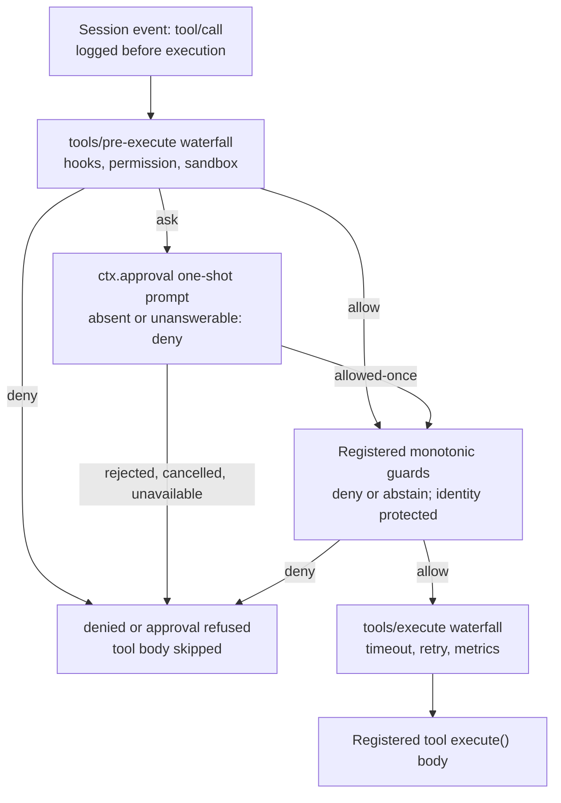

## Two seams and one bundle, not three seams

`packages/interaction/` holds four small packages where a human, not another plugin or a policy fold, decides something the model cannot decide for itself. It is tempting to read all four as one undifferentiated "interaction plane," but the project's own generated classification in `docs/capability-seams.md` draws a sharp line through them:

| `ctx` key | Package | Generated `Role` | What it actually is |
|---|---|---|---|
| `ctx.approval` | [`user-approval`](../../../packages/interaction/user-approval/README.md) | `seam` | One-shot permission decisions over a waterfall of answerers |
| `ctx.userQuestions` | [`user-questions`](../../../packages/interaction/user-questions/README.md) | `seam` | Provider-neutral human question/answer vocabulary |
| `ctx.permissionPresets` | [`permission-presets`](../../../packages/interaction/permission-presets/README.md) | `core` | A named-preset bundle over the other two knobs |
| — | [`tool-ask-user`](../../../packages/interaction/tool-ask-user/README.md) | (Consumer, no own `ctx` key) | Model-facing `ask_user_question` tool |

Two of these are genuine [capability seams](../s07-capability-seams-primer/README.md) in the sense that chapter defines precisely: a Service Definition owning a `ctx.<key>`, one or more Service Providers, and one or more Consumers, each free to evolve independently. The third, `ctx.permissionPresets`, is classified `core` — one fixed owner, not a swappable capability — and this is not a technicality to skip past. It bundles two *other* seams' knobs into a friendlier user-facing selector, and it never becomes a third source of truth about what actually executes. Calling it a seam would be exactly the terminology mistake [the glossary](../../../docs/glossary.md#capability-seam) warns against: reserving "seam" for the complete three-role capability, never for a composition point sitting on top of two of them.

## `ctx.approval`: the seam, precisely

The approval seam answers exactly one question — *may this specific action proceed?* — and nothing more. It has no memory of past answers, no persisted grant, no notion of "always allow this kind of thing." Every `ApprovalOutcome` is one of four closed values:

```ts
type ApprovalOutcome = 'allowed-once' | 'rejected' | 'cancelled' | 'unavailable'
```

`allowed-once` is the only grant, authorizing exactly the action described in the request — nothing wider, nothing later. The other three are all denials from the caller's point of view: an explicit human rejection, a withdrawn request (the caller's `AbortSignal` fired), or an answerer that could not produce a decision at all. A missing answerer, a throwing answerer, and an answerer returning something outside the closed vocabulary all normalize to `unavailable` rather than silently becoming a grant. There is no code path where "nobody answered" turns into "proceed."

### The three roles, concretely

- **Service Definition** — `ApprovalService` (`packages/interaction/user-approval`), a Cordis `Service` owning `ctx.approval`, the `ApprovalOutcome`/`ApprovalRequest`/`ApprovalPolicy` vocabulary, and the `approval/asked`/`approval/decided`/`approval/policy` session-event schemas. It contains the mechanism — turn-boundary validation, waterfall dispatch, abort racing, audit discipline — and nothing about who answers.
- **Service Provider — atypical shape.** Unlike `dsh-bash-local` implementing `ShellExecutor`, no package implements a distinct "approval backend" class. The provider role here is filled by any plugin that registers a listener on the `approval/request` waterfall event: the reference implementation is the ACP automation bridge (`packages/acp/acp`), registered directly against `Events['approval/request']`. **No built-in answerer ships at all** — a headless deployment that composes `dsh-user-approval` alone gets a working, fully audited seam that fails closed on every single ask, because the chain's terminal default with zero listeners is `'unavailable'`.
- **Consumers** — `ctx.tools`' pipeline (`packages/core/tools`) and the sandbox escalation gate (`packages/sandbox/sandbox`) both resolve a pending decision through `ctx.approval.request()` and map the four outcomes to their own model-facing text.

### The request omits arguments on purpose

```ts
interface ApprovalRequest {
  readonly agent: Agent
  readonly toolName: string
  readonly callId?: CallId
  readonly reason?: string
  readonly signal?: AbortSignal
}
```

Tool arguments are missing deliberately. The request identifies *which* tool call is being decided through `callId` — a UI answerer attaches its prompt to the tool call it already streamed to the user rather than rendering a second copy of arguments that could drift from what actually executed. `agent` routes the question (an answerer only answers for agents it owns) and determines which session receives the audit trail.

### Dispatch: policy first, then the waterfall

`ApprovalService.request(req)` first requires the requesting session to be inside an open turn — the audit pair below must sit inside a `turn/start`/`turn/end` boundary, since an event appended between turns is indistinguishable from a crash tail on reload and would be silently dropped; an idle-session ask throws before touching the log at all. It then appends `approval/asked` (log-only, never in the model transcript), decides an outcome, appends the matching `approval/decided`, and returns:

```ts filename="packages/interaction/user-approval/src/index.ts"
async request(req: ApprovalRequest): Promise<ApprovalOutcome> {
  const session = req.agent.session
  if (!hasOpenTurn(session.events)) {
    throw new Error('approval.request() outside an open turn: …')
  }
  const id = ApprovalRequestId(randomUUID())
  session.append('approval/asked', { id, toolName: req.toolName, /* … */ })
  const outcome = await this.decide(req, session)
  session.append('approval/decided', { id, outcome })
  return outcome
}
```

Inside `decide()`: an already-aborted `req.signal` resolves `cancelled` immediately; otherwise the service checks the session's effective `ApprovalPolicy` *before any waterfall dispatch* — `'never'` resolves `rejected` deterministically right here, so a listener registered with `prepend: true` cannot get in front of this check and override it. Under `'ask'`, the service dispatches the `approval/request` waterfall to composed answerers, racing the result against `req.signal` so a late abort still wins. A failure that prevents either audit event from committing rejects the whole call rather than returning an unlogged decision — the asked/decided pair is a hard invariant, never a best-effort log line.

### The ACP bridge as reference answerer

An answerer either returns a closed `ApprovalOutcome` to claim the decision, or calls `next()` to delegate further down the chain. `@deepseek-ai/dsh-scope` filters dispatch so an agent-scoped listener only sees requests for the agents it owns — a deployment composes one terminal answerer, because sibling listener order is not meant to function as a priority mechanism.

```ts
ctx.on('approval/request', (request, next) => {
  const record = ownedRecord(request.agent)
  if (record === undefined || request.callId === undefined) return next()
  return conn.requestPermission({
    sessionId: record.agent.session.id,
    toolCall: { toolCallId: request.callId },
    options: [
      { optionId: 'allow-once', name: 'Allow once', kind: 'allow_once' },
      { optionId: 'reject-once', name: 'Reject', kind: 'reject_once' },
    ],
  }).then(({ outcome }) => {
    if (outcome.outcome === 'cancelled') return 'cancelled'
    return outcome.optionId === 'allow-once' ? 'allowed-once' : 'rejected'
  })
})
```

It offers exactly two one-shot options through `conn.requestPermission()`, tagged to the exact `callId` being decided, and maps the client's choice straight onto `ApprovalOutcome` — never inferring a durable grant from an unrecognized response.

### Two consumers share one fail-closed vocabulary

`ctx.tools`' pipeline resolves an `ask` decision through `ctx.approval` opportunistically (`ctx.get('approval')`, not a hard injection — a deployment without the plugin degrades to deny), then maps each outcome to its own model-facing denial text so the model can tell "the user said no" from "nobody was there to ask":

```ts
switch (outcome) {
  case 'allowed-once': return { decision: { kind: 'allow' }, approvalCancelled: false }
  case 'rejected': return { decision: { kind: 'deny', reason: `the user rejected tool "${exec.name}"` }, approvalCancelled: false }
  case 'cancelled': return { decision: { kind: 'deny', reason: `approval for tool "${exec.name}" was cancelled` }, approvalCancelled: true }
  case 'unavailable': return { decision: { kind: 'deny', reason: `tool "${exec.name}" requires approval, but no approval channel is available` }, approvalCancelled: false }
}
```

The sandbox escalation gate (`packages/sandbox/sandbox/src/escalation.ts`) is the second consumer, and it proves the seam is genuinely shared mechanism rather than tool-specific glue: when a bash or filesystem call asks to widen its `sandbox_permissions` beyond its current mode, `approveEscalation()` first checks strict widening against the call's effective mode (an execution-time check, not a schema constraint), then routes through the *identical* `approval.request()` call with a self-describing reason (`escalate sandbox to ${mode}: ${justification}`), and maps the same four outcomes to distinct thrown errors. Two unrelated families — the generic tool pipeline and the sandbox escalation retry — share one vocabulary, one audit format, and one fail-closed guarantee because both close over `ctx.approval` rather than reinventing it.

### Per-session policy, and the delegation special case

```ts
type ApprovalPolicy = 'ask' | 'never'
```

`'ask'` is the default: delegate to the composed answerer waterfall. `'never'` is the deterministic headless stance (CI, unattended runs) — every ask resolves `rejected` without dispatching any answerer at all. The effective policy is the last `approval/policy` event in the session log, falling back to the plugin's configured default; `setApprovalPolicy(session, policy)` is the single write path, so replaying the log reconstructs the override with no separate catch-up state. Both policy values contribute their complete current meaning to the runtime-context snapshot appended after retained history, so a policy switch never invalidates the KV cache built up before it.

A delegated subagent is a special case worth naming: its approval policy is always pinned to `'never'` regardless of the parent's own policy, recorded as `approval/policy { policy: 'never', source: 'delegation' }`. A child that asked for approval would have no answerer watching it — subagent sessions have no interactive surface of their own — so instead of a silently stuck child, its whole permission story is fixed by its inherited sandbox scope at delegation time, and any widening decision belongs to the parent.

## `ctx.permissionPresets`: explicitly not a seam

Approval policy is one of two independent knobs that decide how much an agent may do without asking; the other is [sandbox mode](../s10-sandbox/README.md) (`SandboxMode`: `read-only` | `workspace-write` | `danger-full-access`, owned by `dsh-sandbox-policy`'s `sandbox/mode` event). Exposing both separately to a user is exact but unfriendly. `PermissionPresetService` (`ctx.permissionPresets`) is the thin layer that bundles them into named presets a client renders as one selector.

The generated classification is unambiguous about what this is: `docs/capability-seams.md` lists `ctx.permissionPresets` with `Role = core` — one fixed owner, no alternate Service Providers, no swap story — right next to `ctx.approval`'s `Role = seam` on the adjacent line. This is not an oversight to work around; it is the honest shape of the mechanism. There is exactly one `PermissionPresetService` implementation, it has no Consumer package of its own analogous to `dsh-tool-bash`, and its entire job is writing through *other* services' canonical setters:

```ts
interface PresetSpec {
  sandbox: SandboxMode
  approval: ApprovalPolicy
  name?: string
  description?: string
}
```

The default table ships two entries — `workspace-write` (`workspace-write` + `ask`: write inside the workspace and permitted temp directories, wider retries require approval) and `danger-full-access` (`danger-full-access` + `never`: full file access without approval prompts). The name `custom` is reserved and cannot appear in the configured table — the plugin throws at load if it does, because `custom` names a *derived* state, never a configured one. The service also requires a confining `ctx.shell` executor: composing it over an executor with no `sandboxMode` capability fact throws at load, since a preset that bundles a sandbox mode is meaningless without one.

### Deriving the current preset, and when it becomes `custom`

`current(events)` does not read its own event in isolation — it folds the session's effective sandbox mode and effective approval policy first, then asks which table entry that *combination* matches:

```ts
private derive(state: KnobState): string {
  const sandbox = state.sandbox ?? this.ctx.shell.sandboxMode
  const approval = state.approval ?? this.ctx.approval.config.policy ?? 'ask'
  const matches = (spec: PresetSpec): boolean => spec.sandbox === sandbox && spec.approval === approval
  if (state.preset !== null) {
    const spec = this.presets[state.preset]
    if (spec !== undefined && matches(spec)) return state.preset
  }
  for (const [name, spec] of Object.entries(this.presets)) {
    if (matches(spec)) return name
  }
  return CUSTOM_PRESET
}
```

A still-matching last recorded selection wins ties when two presets happen to share a bundle; otherwise the first table match in declaration order wins; and if the live knobs match nothing in the table at all, the answer is `CUSTOM_PRESET` (`'custom'`) — a client may display it, but it is never a switch target, and it never appears as an event payload.

### Switching writes through the other seam's own setters

`set()` resolves the preset (an unknown name throws), appends a log-only `permission/preset` event only when the preset actually changes, then writes each knob through its *own* canonical setter — `setSandboxMode` and `setApprovalPolicy` — and only for the knob whose effective value would actually change:

```ts
private apply(session: Session, name: string, setApproval: (policy: ApprovalPolicy) => void): void {
  const spec = this.resolve(name)
  if (this.current(session.events) !== name) {
    session.append('permission/preset', { preset: name })
  }
  const events = session.events
  if (spec.sandbox !== (effectiveSandboxMode(events) ?? this.ctx.shell.sandboxMode)) {
    setSandboxMode(session, spec.sandbox)
  }
  if (spec.approval !== (effectiveApprovalPolicy(events) ?? this.ctx.approval.config.policy ?? 'ask')) {
    setApproval(spec.approval)
  }
}
```

`permission/preset` never enters the model transcript; the knob events it triggers own all model-visible consequences through their own consumers — the approval-policy sentence in the runtime-context snapshot, the sandbox mode's own runtime-context contribution. The preset event's only job is preserving *which* preset the user picked, for the case where two presets happen to bundle the same sandbox/approval pair and `current()` needs a tiebreaker. This is the whole reason it cannot be called a third seam: it never enforces anything, never answers anything, and owns no execution-time decision — every model-visible or execution-time fact still originates from `ctx.approval` or `ctx.sandboxPolicy`, exactly as it would if the preset selector did not exist. Two optional children ship over the same service — a `permissions` session-projection unit and a `/permission` command — activating only when their registry is composed.

## `ctx.userQuestions`: the second true seam

Where approval answers a yes/no about one pending action, `UserQuestionService` is the general seam for a tool or permission plugin that needs the human to make a richer decision — pick one of several options, type free text, or both — before the agent can continue.

```ts
interface UserQuestionProvider {
  ask(request: AskUserQuestionRequest): Promise<AskUserQuestionAnswer>
}
```

- **Service Definition** — `UserQuestionService` (`packages/interaction/user-questions`), owning `ctx.userQuestions`, the request/answer vocabulary, and the intent-validation rules below.
- **Service Provider** — the Web host runtime. `packages/host/apiproxy/src/api-proxy.ts` calls `ctx.userQuestions.registerProvider({...})`, wiring the `ask()` promise to a `question/requested` wire message and resolving it when the browser client answers over `question/resolved`. Exactly one provider may be active in a context; `registerProvider()` is effect-bound, so disposal (HMR, unmount) cleanly removes the active UI, and a second registration throws `DUPLICATE_PROVIDER` rather than silently replacing the first. With none registered, `ask()` throws `NO_PROVIDER`.
- **Consumer** — `dsh-tool-ask-user`, covered below.

### The request and answer shapes

```ts
interface AskUserQuestionItem {
  id: string
  question: string
  detail?: string
  header?: string
  options?: AskUserQuestionOption[]
  multiSelect?: boolean
  intent?: AskUserQuestionIntent
}

interface AskUserQuestionRequest {
  questions: AskUserQuestionItem[]
  agent?: Agent
  signal?: AbortSignal
}
```

`questions` is an array so a single request can batch several related prompts while each keeps a caller-supplied, stable `id` that comes back attached to its answer. `detail` is supporting text a provider renders alongside the question without turning it into a selectable option — this matters for the one built-in presentation `intent`, `plan-review`, which names an `approve` option label and requires `detail` to carry the plan text being reviewed. `ask()` validates both intent assertions no type system can express — an `approve` naming none of the question's own options, or an intent on a question with no `detail` — and throws `BAD_INTENT` rather than letting an inconsistent request reach a UI that would render nonsense.

For a single-select question, `custom` (free text) overrides the selected choice and `selected` is empty; for multi-select, `custom` may supplement labels already in `selected`. A UI may also answer with empty `selected` and no `custom` to record a deliberately skipped question while preserving the rest of a batch.

### Runtime ownership, not durable lineage, decides who may ask

When a caller supplies an agent, `ask()` first checks that it is the exact live instance the registry currently tracks (`CALLER_NOT_LIVE` otherwise — stale references are rejected, not silently routed), then checks that it is a runtime root, not an owned child (`DELEGATED_CALLER` otherwise):

```ts
if (agents === undefined || agents.get(agent.id) !== agent) {
  throw new UserQuestionError('human interaction requires the exact live calling agent when an agent is supplied', 'CALLER_NOT_LIVE')
}
if (!agents.roots().includes(agent)) {
  throw new UserQuestionError(
    "human interaction is unavailable while the calling agent is owned by another live agent; "
    + "include the unresolved question or decision in the child agent's final result",
    'DELEGATED_CALLER')
}
```

A delegated subagent has no human answerer of its own and would block forever waiting for one; the fix is architectural, not a timeout — a child must report the unresolved question or decision in its final result instead. This is about *runtime* ownership at the moment of the call, not durable session lineage: a session with historical delegation depth that gets resumed later as a fresh runtime root may ask normally, while a live child owned by another agent is rejected even if its durable lineage depth happens to be zero.

## `ask_user_question`: the Consumer that puts the question in front of the model

`dsh-tool-ask-user` turns `ctx.userQuestions` into a model-visible tool. It registers exactly one tool, `ask_user_question`, whose `execute` translates model arguments into an `AskUserQuestionRequest` and translates the human's `AskUserQuestionAnswer` back into the tool's canonical `{ answers: [...] }` return value — nothing more:

```ts
async execute(args, exec) {
  const result = await ctx.userQuestions.ask({
    questions: args.questions.map(question => ({ id: question.id, question: question.question, /* … */ })),
    ...exec.agent !== undefined ? { agent: exec.agent } : {},
    signal: exec.signal,
  })
  return { answers: result.answers.map(answer => ({ id: answer.id, selected: [...answer.selected], /* … */ })) }
}
```

It does not render UI and does not know how input is collected; that is entirely the registered provider's job. Because `execute` passes `exec.agent` and `exec.signal` straight through, the tool call inherits every rule described above for free: a delegated subagent's call fails with `DELEGATED_CALLER`, an aborted turn resolves `ASK_ABORTED`, and a missing provider resolves `NO_PROVIDER` — all surfaced to the model as ordinary tool errors it can read and react to.

## How a tool call becomes a human decision, end to end

The diagram below is the `ctx.approval` slice of the harness's own generated [tool execution pipeline](../../../docs/tool-execution-pipeline.md), reproduced verbatim — `tools/pre-execute` is where the `ask` decision originates, and everything downstream of `approval` is the same guarded pipeline every other tool call passes through. `ctx.permissionPresets` never appears in this diagram at all: it has nothing to add at execution time, because by the time a call reaches the pipeline, the sandbox mode and approval policy it wrote are the only facts that matter.



Concretely, tracing an actual sandbox-escalation approval from the [approval-seam Agent Note](../../../.agents/notes/implemented/feature/2026-07-06-approval-seam.md): the model calls `bash` with `sandbox_permissions: "workspace-write"` and a `justification`; the escalation gate resolves through `ctx.approval.request()`, which logs `approval/asked`, dispatches the waterfall to the ACP bridge, which sends `session/request_permission` to the client with the exact `callId` and two one-shot options. The user picks "Allow once"; the bridge returns `allowed-once`; the service logs `approval/decided`; the call runs under the wider mode; and the grant dies with it — the next call at the same or a wider mode asks again. Reject instead, and nothing executes: the model's tool result carries the asker's exact fail-closed text, `the user rejected escalating this command to "workspace-write"`.

## Why the boundary matters

None of these four packages changes `agent-loop`. Both true seams — `ctx.approval` and `ctx.userQuestions` — never render anything themselves; a human-facing consumer (a UI, the ACP bridge) plugs in on one side, and a model-facing or policy-facing consumer (`ctx.tools`, the sandbox escalation gate, `ask_user_question`) plugs in on the other, with the seam itself owning only the shared vocabulary, the audit/log discipline, and the fail-closed default. `ctx.permissionPresets` never enforces anything itself — it only writes through the setters `ctx.approval` and `dsh-sandbox-policy` already own, which is exactly why the generated graph classifies it `core` rather than `seam`: there is nothing here to swap, no second implementation waiting to compose in its place, and no execution-time consumer reading it at all. Every one of the two true seams is optional: a headless deployment that composes neither `dsh-user-approval`'s answerers nor `dsh-user-questions`' provider gets deterministic, auditable denial (`unavailable`, `NO_PROVIDER`) rather than a hang or a silent bypass, because "no answerer" and "no provider" are first-class states in each closed vocabulary, not implicit gaps.
