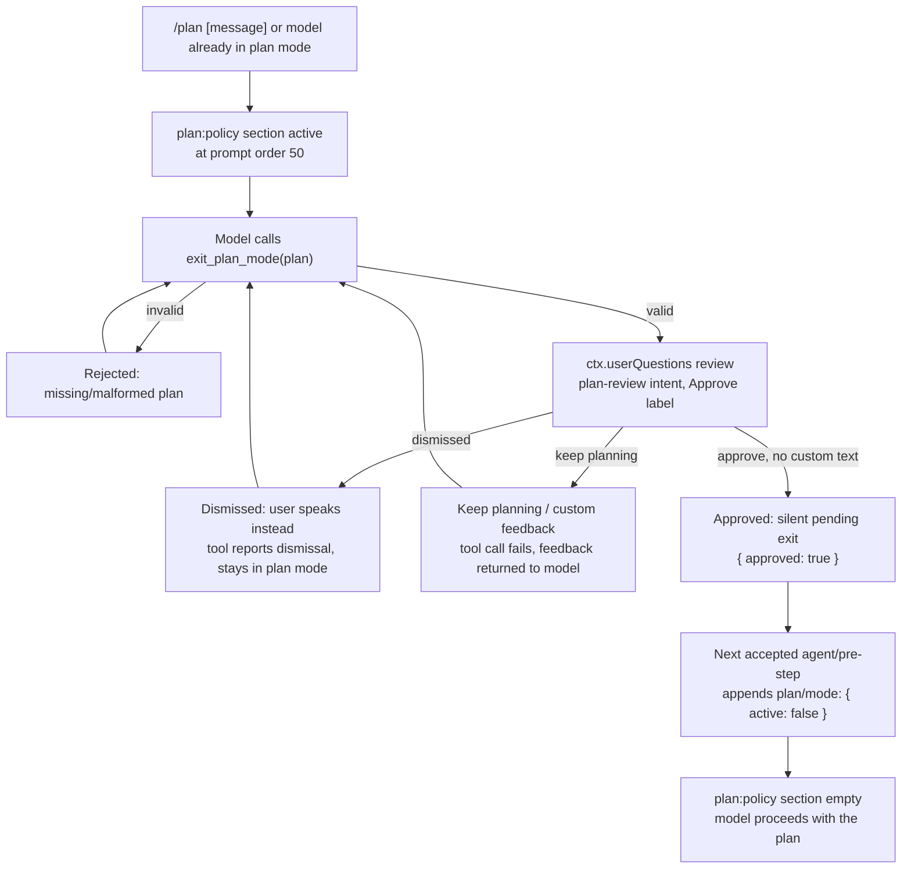

## Not a capability seam — and that's the point

Every mechanism in the last few chapters was a true capability seam: a Service Definition owning a `ctx.<key>`, one or more Service Providers implementing it, and a Consumer injecting it — `ctx.approval` and `ctx.userQuestions` from [Approval and Questions](../s13-approval-and-questions/README.md) are both classified `seam` in the generated `docs/capability-seams.md` graph. `todo_write` and plan mode are not built that way, and the generated graph says so directly: `ctx.planMode` is classified `core`, with no Service Provider column at all, and `todo_write` does not register a `ctx.<key>` service in the first place — it is a plain tool package with a projection-unit registration, nothing more. There is exactly one implementation of each, no second backend waiting to compose in its place, and no deployment-time choice to make about which provider handles it.

What both mechanisms *are* built from is three primitives every earlier chapter already established: a `SessionEventMap` member (`todo/write`, `plan/mode`), whole-value-replace folding over that member (last write wins, exactly the pattern from [The Session Log](../s03-event-sourced-session/README.md)), and a `ctx.systemPrompt` section (for plan mode only — `todo_write` needs none). Plan mode additionally calls through `ctx.userQuestions`, the one true seam it depends on, borrowed as a Consumer rather than owned. No new loop machinery, no new registry, and no third role appear anywhere in either package.

Neither tool has an external side effect the model couldn't produce with words in a text response. What they buy instead is **visible, durable, structured state that a human or a UI can watch alongside the conversation** — a task list that persists as a strip in the interface, and a mode flag that changes what the model is instructed to do before it acts. Reading them together also makes an instructive contrast: `todo_write` is a single small tool package with one job — log a snapshot. Plan mode is a whole collaboration protocol — a prompt section, an entry command, an exit tool, and a reviewed human decision gating the transition. Together they show the two ends of what "collaboration state" can mean in this harness without ever needing a fourth role.

## `todo_write`: the model's task list as an event snapshot

`@deepseek-ai/dsh-tool-todo` registers exactly one tool, `todo_write(todos: [{ content, status }])`, on `ctx.tools`. The defining rule is **whole-list replacement**: every call sends the complete list, and it replaces whatever was there before. There is no per-item edit, no id, no delta protocol.

```ts
export interface Config {
  allowParallelInProgress: boolean
}
```

`status` is one of `pending`, `in_progress`, or `completed`. Beyond the schema's type/enum checks, `toTodoList()` (`packages/todo/tool-todo/src/index.ts:91-111`) rejects empty or duplicate `content`, and enforces at most one `in_progress` item unless the deployment set `allowParallelInProgress: true`:

```ts
function toTodoList(raw: { content: string; status: string }[], allowParallel: boolean): TodoItem[] {
  const todos: TodoItem[] = []
  const seen = new Set<string>()
  let active = 0
  for (const item of raw) {
    const content = item.content.trim()
    if (content.length === 0) throw new Error('invalid todo: `content` must be a non-empty string')
    if (seen.has(content)) throw new Error(`invalid todos: duplicate content ${JSON.stringify(content)}`)
    seen.add(content)
    if (item.status === 'in_progress') active++
    todos.push({ content, status: item.status as TodoItem['status'] })
  }
  if (!allowParallel && active > 1) {
    throw new Error(`invalid todos: at most one task may be in_progress (got ${active})`)
  }
  return todos
}
```

`allowParallelInProgress` is required with no default — the README calls this out explicitly as a deployment choice, not a fixed rule, because whether concurrent active tasks are legitimate depends on runtime concurrency (parallel subagents, background jobs) the tool itself cannot observe. The flag changes two things together: the model-facing description (`DESCRIPTION_PARALLEL` vs. `DESCRIPTION_SINGLE` in `index.ts`) and the accepted input. It does *not* change the durable-log invariant — `packages/todo/tool-todo/src/invariant.ts` deliberately stays silent on the active count, because a log written while parallel work was allowed must still replay after a later deployment tightens the policy.

### Event, not surface

`execute()` (`packages/todo/tool-todo/src/index.ts:206-223`) does the entire job in three lines once the list is validated:

```ts filename="packages/todo/tool-todo/src/index.ts"
execute(args, exec) {
  const todos = toTodoList(args.todos, allowParallel)
  if (!exec.agent) {
    // The list is per-agent-session state; a non-agent caller (no owning
    // session) has nowhere to write it. Reject rather than silently no-op.
    throw new Error('todo_write requires an owning agent session')
  }
  exec.agent.session.append('todo/write', { todos })
  const count = (status: TodoItem['status']): number => todos.filter(t => t.status === status).length
  return Promise.resolve({
    todos: todos.map(todo => ({ content: todo.content, status: todo.status })),
    counts: {
      pending: count('pending'),
      inProgress: count('in_progress'),
      completed: count('completed'),
    },
  })
},
```

A non-agent caller — no `exec.agent`, so no session to own the list — is rejected outright rather than silently no-op'd. This is the "single owner" design: the list belongs to the one agent session that called the tool, with no subagent, shared, or swarm scope. The [`todo_write` Agent Note](../../../.agents/notes/implemented/feature/2026-06-29-todo-write-tool.md) explains the cut explicitly: claude-code's later versions grew ids, dependencies, and per-item ownership, but only to support disk-backed, lock-guarded agent *swarms* — out of scope here, so the item stays at the deliberate minimum of `{ content, status }`.

Crucially, `todo/write` is **excluded from `SurfaceEventType`**. The surface is the event subset that `deriveMessages()` folds into the LLM's own conversation history; a todo write produces no message there. The model sees only its own tool call and the tool's small acknowledgement result — never a second copy of the list injected as conversation. The full snapshot lives on the session log purely as durable UI state, read by whoever renders it.

### Result text vs. logged state

The tool's canonical result is `{ todos, counts: { pending, inProgress, completed } }`; its rendered text is a compact acknowledgement:

```
Updated todo list: 2 pending, 1 in progress, 3 completed.
```

That's everything the model gets back in its own transcript. The full list — the thing a UI actually displays — lives entirely in the `todo/write` event, which the model never re-reads. This split matters for the token story: the *call arguments* (the whole list the model sent) remain in history until compaction and grow with every write, but the *result* stays small and fixed-shape regardless of list length.

### Standing plan: cleared at the next turn

When the composition mounts `ctx.sessionProjections`, `tool-todo` registers a `todos` projection unit (`packages/todo/tool-todo/src/index.ts:128-148`):

```ts
projectionCtx.sessionProjections.register<'todos', TodoItem[] | null>({
  key: 'todos',
  schema: todosProjectionSchema,
  init: () => null,
  apply: (state, event) => {
    if (event.type === 'todo/write') return event.data.todos
    if (event.type === 'turn/start') return null
    return state
  },
  view: state => state,
  stateVersion: 2,
})
```

The fold is exactly two rules: take the whole list on `todo/write` (last write wins, per the whole-value-replace pattern), and reset to `null` on the next `turn/start`. Everything else — including `turn/end` — passes the state through unchanged. This is a deliberate lifetime decision, recorded in the [Todo plan strip clears on the next turn Agent Note](../../../.agents/notes/implemented/feature/2026-07-28-todo-plan-clears-on-next-turn.md): clearing on `turn/end` would hide the checklist while the user is still reading the just-finished answer, so the finished list stays visible through the end of the turn and disappears only once a new turn actually begins. UIs — the web client's `TodoPanel`, mounted through the conversation input dock — subscribe to this projection and render the "standing plan" themselves; the tool package never renders anything.

Note that `ctx.sessionProjections` itself is also classified `core`, not `seam`, in the generated capability graph: it is a single fold-unit registry with no alternate backend, not a swappable capability. `tool-todo` and `plan-mode` are both *consumers* of that core registry, exactly as they are consumers of `ctx.systemPrompt` and `ctx.tools` — using core infrastructure does not make either package a seam itself.

## Plan mode: propose, review, exit

Where `todo_write` is a small, single-purpose snapshot, `@deepseek-ai/dsh-plan-mode` is a complete collaboration protocol built from the same primitives. It is **soft guidance, not enforcement**: sandbox mode and approval policy — the mechanisms from [Approval and Questions](../s13-approval-and-questions/README.md) — restrict what a tool call may actually do, entirely independently; plan mode neither reads nor writes either of them. What plan mode owns is a single durable fact, one prompt section, and a reviewed transition.

### The durable fact

```ts
declare module '@deepseek-ai/dsh-session/types' {
  interface SessionEventMap {
    'plan/mode': { active: boolean }
  }
}
```

`plan/mode` is log-only, whole-value-replace, never in the model transcript — the same shape as `todo/write`. `foldPlanMode(events)` (`packages/plan/plan-mode/src/index.ts:129-138`) returns the last logged value, or `false` when the log has none, so resume, fork, and compaction all recover the current stance with no live mirror to rehydrate.

### Entering: the `/plan` command

When `ctx.commands` is composed, the plugin registers `/plan [off|message]`. Bare `/plan` selects active; the exact argument `off` selects inactive directly; any other non-empty text selects plan mode first and then submits the trimmed text through `agent.steer()`, so the message becomes an ordinary logged user message under plan guidance rather than a second parallel channel. This is a human entry path with no model tool call involved at all.

### While active: the `plan:policy` prompt section

```ts
ctx.systemPrompt.section({
  name: 'plan:policy',
  order: 50,
  text: (context) => {
    if (context.agent === undefined) return ''
    const pending = this.pendingIntents.get(context.agent.session)
    return (pending?.active ?? foldPlanMode(context.agent.session.events)) ? this.section : ''
  },
})
```

The deployment supplies `section` — free text such as *"You are in plan mode. Explore and design before presenting the complete plan through exit_plan_mode."* — and that exact text renders at [system prompt](../s06-tool-pipeline-and-prompt/README.md) order 50 while plan mode is active, contributing nothing when inactive. This is the entire mechanism by which plan mode changes model behavior: an instruction in the prompt, not a tool filter or sandbox cap. A model that ignores the guidance can still call any tool it always could — `exit_plan_mode` stays registered in both states precisely so the request's tool catalog never changes shape across the transition, keeping catalog structure stable across a mode flip.

### Committing a selection: idle vs. mid-turn

`ctx.planMode.set(agent, active)` (`packages/plan/plan-mode/src/index.ts:425-445`) is where the mechanism gets interesting. A selection cannot simply append `plan/mode` at any moment, because the harness's own invariants require every session event to sit inside a turn boundary. So `set()` branches on whether a turn is currently open:

```ts
set(agent: Agent, active: boolean): 'committed' | 'queued' | 'cancelled' | 'noop' {
  const session = agent.session
  const pending = this.pendingIntents.get(session)
  const target = pending?.active ?? foldPlanMode(session.events)
  if (active === target) return 'noop'
  if (hasOpenTurn(session.events)) {
    this.pendingIntents.set(session, { active, narrate: true })
    return foldPlanMode(session.events) === active ? 'cancelled' : 'queued'
  }
  session.append('plan/mode', { active })
  this.pendingIntents.delete(session)
  const narration = this.narration(session, active)
  if (narration !== undefined) agent.inject(narration)
  return 'committed'
}
```

- **Idle (no open turn):** commit immediately — there is no in-turn pre-step that will run before the next prompt starts a new turn, so waiting would just lose the selection.
- **Mid-turn:** hold it as a `pendingIntents` selection instead. A `WeakMap<Session, { active, narrate }>` tracks one outstanding selection per session; a same-target repeat is a no-op, an opposite-of-pending selection is `cancelled`.

The actual append for a mid-turn selection happens from a prepended `agent/pre-step` listener registered in the constructor (`packages/plan/plan-mode/src/index.ts:184-233`):

```ts
ctx.on('agent/pre-step', async ({ agent, signal }, next): Promise<PreStepDecision> => {
  const decision = await next()
  const pending = this.pendingIntents.get(agent.session)
  if (decision.kind === 'reject' || signal.aborted || pending === undefined) return decision
  const narration = this.narration(agent.session, pending.active)
  try {
    this.onBoundary(agent.session)
  } catch (error) {
    ctx.logger.warn('dsh-plan-mode: failed to append selected plan mode at step start: %o', error)
    return decision
  }
  return !pending.narrate || narration === undefined
    ? decision
    : { ...decision, messages: [...decision.messages, narration] }
})
```

It calls `next()` first — letting every other pre-step listener run and potentially reject the step — and appends `plan/mode` only once the step is actually accepted. A rejected step, an aborted signal, or an append failure all leave the selection pending for a later accepted pre-step rather than forcing it through or dropping it silently. This is the same "append only after downstream accepts" discipline the [agent loop](../s04-agent-loop/README.md) uses elsewhere for step commitment.

### Narration: telling the model exactly when, never redundantly

A user-driven transition also needs to tell the model its situation changed, but only when the model would otherwise be confused:

```ts
private narration(session: Session, target: boolean): UserMessage | undefined {
  const told = planModeAtLastHeader(session.events)
  if (told === undefined || told === target) return
  const text = target
    ? 'The user switched this session to plan mode.'
    : 'The user switched this session back to the default mode.'
  return createUserMessage({ /* … */ })
}
```

`planModeAtLastHeader()` folds the log only up to the most recent `request/header` — the plan state the model was actually told about last time. If that already matches the new target, no notice is added: the transition is invisible to the model because nothing it saw is now stale. Only a genuine mismatch between "what the model was last told" and "what's true now" produces one plugin-sourced `user/message`.

### Exiting through review: `exit_plan_mode`

The human path (`/plan off`) is a direct exit with no review. The model path is different: `exit_plan_mode` requires the model to submit a complete plan and puts a human decision in the way before the transition takes effect. Its `execute()` (`packages/plan/plan-mode/src/index.ts:321-380`) does four things in sequence:

1. Reject the call outright if plan mode isn't active, or the submitted `plan` doesn't start with a markdown `#` heading.
2. Ask through `ctx.userQuestions` — the exact seam described in [Approval and Questions](../s13-approval-and-questions/README.md) — with the plan text as `detail` and a `plan-review` presentation `intent` naming `Approve` as the label that consents:

```ts
const answer = await interaction.ask({
  questions: [{
    id: REVIEW_ID,
    header: 'Plan review',
    question: 'Approve this plan and leave plan mode?',
    detail: args.plan,
    options: [
      { label: APPROVE_LABEL, description: 'Leave plan mode; the plan is carried out from the next step.' },
      { label: KEEP_PLANNING_LABEL, description: 'Stay in plan mode; feedback goes back to the model.' },
    ],
    intent: { kind: 'plan-review', approve: APPROVE_LABEL },
  }],
  agent,
  signal: exec.signal,
})
```

3. Distinguish a **dismissed** review (the user closed the request to say something else) from every other outcome — a dismissal is reported to the model as such, telling it to stay in plan mode and wait for the coming message, rather than as a generic tool failure.
4. On an exact, uncustomized `Approve`: record a **silent** pending exit (`narrate: false`, unlike the narrated `/plan off`) and return `{ approved: true }`. Anything else — `Keep planning`, or `Approve` with custom text attached — throws, carrying the user's free-text feedback back to the model so it can revise and call the tool again.

```ts
this.pendingIntents.set(agent.session, { active: false, narrate: false })
return { approved: true }
```

The exit is silent because the tool's own result already announces the transition — `Plan approved — plan mode exited; carry out the plan starting with your next step.` — so a second injected notice would be redundant. Because it's still a *pending* selection rather than an immediate append, plan guidance stays active for the rest of the assistant's current tool batch and clears only at the next accepted pre-step, before the next request is assembled.

### The propose → review → exit → implement cycle



The direct `/plan off` path skips the review box entirely and goes straight to `set(agent, false)`, following the same idle-vs-mid-turn commit branch described above.

### Session projection: `{ active, pending }`

Like `todo_write`, plan mode registers a session-projection unit when `ctx.sessionProjections` is composed. It folds two event kinds — a `command/run` record named `plan` sets the *wanted* target, and `plan/mode` commits the logged state and clears the want:

```ts
apply: (state, event) => {
  if (event.type === 'command/run' && event.data.name === 'plan') {
    if (event.data.args === undefined) return state
    const wanted = event.data.args.trim() !== 'off'
    return wanted === state.wanted ? state : { active: state.active, wanted }
  }
  if (event.type === 'plan/mode') return { active: event.data.active, wanted: null }
  return state
},
view: state => ({
  active: state.active,
  pending: state.wanted !== null && state.wanted !== state.active,
}),
```

`pending` is a pure replay quantity — true only while a logged `/plan` selection targets a state the logged `plan/mode` hasn't caught up to yet — so a host restart, another browser tab, or a cold read all recover it from the log alone, with no separate live state to lose.

## Why this design, not a generic mode registry

The [plan-specific collaboration state Agent Note](../../../.agents/notes/implemented/simplification/2026-07-22-plan-specific-collaboration-state.md) records that the first implementation took the opposite approach: a generic named-mode registry (`ModeConfig.modes`, `ctx.modes.list()`, retired-definition fallback) even though the product shipped exactly one mode, `plan`. The rewrite deleted all of it in favor of a plan-specific product package, for reasons that generalize past this one feature:

- **One vocabulary, one shipped feature.** The unused name/config machinery would still need maintaining and testing without a second production consumer to justify it — the same "require a current owner and need" principle this codebase applies everywhere.
- **"Mode" already means something else here.** Sandbox mode is an *enforcing* policy owned by `ctx.sandboxPolicy` and logged as `sandbox/mode`; plan mode is a *collaboration stance* that contributes guidance and a reviewed exit. Folding both into one generic named-mode abstraction would obscure that they have entirely independent owners and lifecycle semantics.
- **A human-facing transport is not evidence of a generic domain.** The note explicitly rejects "let one presentation transport own plan state" — TUI, web, resume, fork, prompt assembly, and the exit tool all need the *same* logged fact independently of any one transport, so the fact belongs to a service, not a UI's own vocabulary.
- **Filtering tools by an allowlist was also rejected.** Mutability is a property of each individual tool (including future and MCP tools), not a list every plan deployment must hand-maintain; plan mode is deliberately guidance, not a security boundary, and enforcement stays where it already lived — sandbox mode and approval policy.

The consequence: adding a second collaboration stance in the future is an explicit design decision, not a config entry in an existing registry — and automation clients (the ACP bridge) do not acquire human mode controls through this package at all, because ACP is automation-only and mounts neither plan mode nor a mode-selection protocol. Notably, even a second collaboration stance would not automatically make either package a capability seam: a seam requires more than one alternate implementation of the same Service Definition, and nothing about "another mode" implies "another backend for this one."

## Comparing the two mechanisms

| | `todo_write` | Plan mode |
|---|---|---|
| Durable fact | `todo/write: { todos }` | `plan/mode: { active }` |
| Fold rule | last write wins, cleared on `turn/start` | last write wins, no clearing |
| Model surface | one tool, no gating | one tool (`exit_plan_mode`) plus a prompt section |
| Human entry | none — model-only | `/plan [message]`, `/plan off` |
| Exit gate | none — every call just replaces the list | reviewed through `ctx.userQuestions`, or direct via `/plan off` |
| Enforcement | validation only (schema, dedupe, active-count policy) | none — guidance only; sandbox/approval enforce separately |
| Package shape | one small tool package | a `core`-classified service (`PlanModeController`) plus tool, command, and prompt-section registrations |
| `ctx` key role | none (no service registered) | `core` — one implementation, no Provider column |

Both mechanisms confirm the same architectural point from a different angle: **visible collaboration state is modeled as ordinary session events, folded by ordinary projection units, surfaced through ordinary prompt sections and tool registrations.** Neither needed a new capability seam, a new loop hook, or any change to `agent-loop` itself — the todo list and the plan stance are both just facts on the log that happen to matter to a human watching the session, rather than facts that change what a tool call is permitted to do, and rather than facilities with more than one implementation to swap between.

## Known limitations worth carrying forward

- `todo_write` is single-owner only: a delegated subagent has no list of its own, and there is no shared or swarm scope (deliberately deferred, not accidentally missing).
- A plan-mode selection made after a turn's last accepted pre-step is lost if the process exits before another accepted pre-step runs — the UI is expected to reapply it.
- Forked agents inherit logged plan state; newly spawned agents always begin inactive, with no creation-time plan option.
- A live child agent owned by another agent cannot open the `exit_plan_mode` review at all — the failed call tells it to fold the unresolved decision into its own final result instead, mirroring the same `DELEGATED_CALLER` rule `ctx.userQuestions` applies everywhere.
