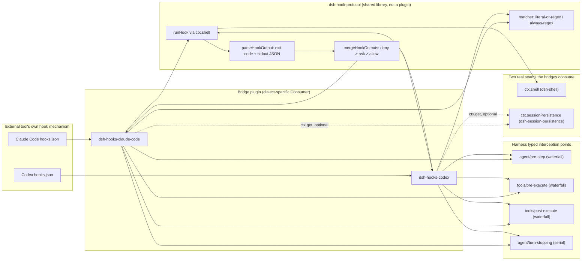

## The short version

The `hooks/` package group is **not** a capability seam — there is no `ctx.hooks` service and no Service Definition anywhere in it. It is two *bridge plugins* (`dsh-hooks-claude-code`, `dsh-hooks-codex`) that each consume two unrelated seams — `ctx.shell` to run a command, `ctx.sessionPersistence` to locate the session log — plus one *shared library* (`dsh-hook-protocol`) that owns the dialect-neutral matcher/codec/merge/runner primitives. Their whole job is compatibility: run a `hooks.json` a user already wrote for Claude Code or Codex, faithfully, by translating it onto the harness's typed interception points. Read on for why this dual identity is the correct shape, not a gap.

## At a glance

The hooks family is two kinds of thing at once — a shared library and two ordinary Consumers — plus the neutral shapes they hand back and forth. Four terms carry the chapter:

:::concept{term="Hooks bridge (Consumer)"}
An ordinary plugin that reads an *existing* CC or Codex `hooks.json`, spawns each configured shell command at the matching extension point via `ctx.shell`, and translates the exit-code/stdout protocol into typed decisions. Owns no service.
:::

:::concept{term="dsh-hook-protocol (shared library)"}
A library, not a plugin — registers nothing with Cordis, injects nothing. Owns exactly the dialect-neutral primitives: `matcher`, `runHook`, `parseHookOutput`, `mergeHookOutputs`, the `hook/*` appenders, and `createDetachedRuns`.
:::

:::concept{term="HookOutput"}
The single dialect-neutral outcome shape every hook funnels into — block, allow, ask, add context, warn, halt — decoded from a process's exit code, stdout, and stderr. "Faithful but degraded."
:::

:::concept{term="hook/* session events"}
`hook/invoked` / `hook/result`, a log-only audit pair declaration-merged into `SessionEventMap`. Not a `SurfaceEventType` — they exist for replay and audit, never for UI.
:::

## Not a seam — a Consumer of two seams, plus a shared library

The `hooks/` package group looks, at first glance, like it should be its own capability seam: it has a shared library and two interchangeable-looking bridge plugins, the same shape as the shell trio from the [capability seams primer](../s07-capability-seams-primer/README.md). It is not. `docs/capability-seams.md`'s generated graph confirms it: `hooks-claude-code` and `hooks-codex` never appear as an Owner or an Implementation in any row — they appear only in the **Direct consumers** column of two entirely different seams:

- `ctx.shell` (`seam`, owned by `dsh-shell`, implemented by `dsh-bash-local`/`dsh-bash-sandbox`/`dsh-pwsh-local`) lists `hooks-claude-code` and `hooks-codex` alongside `tool-bash`/`tool-pwsh` as direct consumers — confirmed at `docs/capability-seams.md:448`.
- `ctx.sessionPersistence` (`seam`, owned by `dsh-session-persistence`, implemented by the JSONL/SQLite backends) lists the same two bridges alongside `agent-loop`/`tool-bash`/`session-query`/`message-feedback` — confirmed at `docs/capability-seams.md:422`.

Both bridges declare this in source, not just in the generated graph: `export const inject = ['shell']` is the only mandatory injection each plugin's `apply()` receives (`hooks-claude-code/src/index.ts:39-42`, mirrored in `hooks-codex/src/index.ts`). `sessionPersistence` is read opportunistically through `ctx.get('sessionPersistence')` rather than injected — a hook still runs without a persistence backend loaded, just with an empty `transcript_path`/`session_id` locator field, exactly the optional-service pattern the rest of the harness uses for a service that must not become a hard dependency of an otherwise-independent plugin.

So the hooks family has a **dual identity**: `dsh-hook-protocol` is a shared library (no Cordis registration, no injection, nothing to be a Consumer of), and the two bridge plugins are ordinary Consumers layered *on top of* two unrelated seams — one for running a command (`ctx.shell`), one for locating the session's durable log path to stamp into a hook's stdin payload (`ctx.sessionPersistence`). Neither bridge owns a Service Definition of its own, and nothing in the harness is meant to swap "the hooks bridge" for a different implementation the way a sandboxed executor swaps for a local one. The rest of this chapter is why that's the correct shape, not a gap.

## What a "hook" means here

`hooks.json` is not a deepseek-harness invention. It is the on-disk config format Claude Code and Codex already use to let a user run their own shell commands at fixed points in an agent's lifecycle — before a prompt is accepted, before or after a tool runs, when a session starts, when the agent wants to stop. Users arrive at deepseek-harness with these files already written. The harness's job is not to invent a third hook format; it is to run those existing files **faithfully**, without asking anyone to rewrite them.

> [!WHY]
> A "native hook" is not a package at all. The harness's real extension surface is a set of typed Cordis events — `agent/session-start`, `agent/pre-step`, `tools/pre-execute`, `tools/post-execute`, `agent/turn-stopping`, `subagent/start`, `subagent/end` — and any ordinary plugin can subscribe to them with full `ctx` access and typed return values. A plugin author writing fresh code should use these directly; nothing about shell hooks is required. (Spelled out in [the interception extension-points Agent Note](https://github.com/deepseek-ai/deepseek-harness/blob/47f943859bef60e4160492346772ded9b24f765a/.agents/notes/implemented/feature/2026-06-30-interception-extension-points.md).)

What `packages/hooks/*` adds is a **bridge**: a plugin that reads an *existing* CC or Codex `hooks.json`, spawns each configured shell command at the matching extension point via `ctx.shell`, and translates the command's stdout/exit-code protocol into the same typed decisions a native plugin would return. Anything a bridge does — deny a tool, inject context, force another step — a native plugin can do more powerfully, with no serialization boundary and no subprocess. The bridge exists purely as a **compatibility path** for hook configs a user already has.



## One hook invocation, end to end

The mermaid above shows who talks to whom; this is the ordered lifecycle a single configured hook passes through, and the sections after it expand each stage:

:::timeline
- match — at an extension point, `matchesMatcher` selects the configured hooks for it (dialect `mode`: literal-or-regex vs always-regex)
- run — `runHook` serializes the stdin payload, sets env, and executes through `ctx.shell` with timeout and cancellation; it never throws
- decode — `parseHookOutput` folds exit code + stdout + stderr into one neutral `HookOutput` (exit `2` = block)
- merge — `mergeHookOutputs` folds the N matched hooks into a single `MergedHookOutcome`, precedence **deny > ask > allow**
- decide — the bridge maps the outcome onto its extension-point's typed Decision (`PreToolDecision`, a pre-step `enter`, …)
- record — `appendHookInvoked` / `appendHookResult` write the log-only `hook/*` audit pair
:::

## Why a shared library instead of two independent bridges

The reference implementations of both tools' hook engines share a striking amount of structure. Codex's own source names its hook engine after Claude's and comments where it "intentionally diverges" — it reuses the same `hooks.json` matcher-group shape, the same exit-code/structured-stdout output contract, and the same command-hook execution model. Given that, writing two bridge plugins from scratch would mean copy-pasting the majority of the protocol and letting the copies drift.

`@deepseek-ai/dsh-hook-protocol` is the fix: a **library**, not a plugin — it registers nothing with Cordis and injects nothing ([`packages/hooks/hook-protocol/README.md`](https://github.com/deepseek-ai/deepseek-harness/blob/47f943859bef60e4160492346772ded9b24f765a/packages/hooks/hook-protocol/README.md)). Both bridge packages import it as an ordinary dependency. It owns exactly the primitives that are genuinely dialect-neutral, and nothing else:

| Concern | Owned by `dsh-hook-protocol` | Owned by each bridge |
|---|---|---|
| Matcher validation + matching | `matcherDiagnostic` / `matchesMatcher`, parameterized by `mode` | picks its `mode` (`claude-code` = literal-or-regex, `codex` = always-regex) |
| Running a hook | `runHook(bash, hook, opts, now)` — stdin serialization, `ctx.shell` execution, timeout, decode | builds the per-event stdin payload and the dialect's env vars |
| Decoding output | `parseHookOutput(exit, stdout, stderr)` → neutral `HookOutput` | maps `HookOutput` onto its extension-point-specific typed Decision |
| Merging N matched hooks | `mergeHookOutputs(outputs)` → most-restrictive `MergedHookOutcome` | — |
| Durable record | `appendHookInvoked` / `appendHookResult` | calls them around each invocation |
| Detached-run shutdown | `createDetachedRuns()` | passes its `signal` into `runHook`, registers `drain` as its dispose effect |

The single axis the two dialects actually differ on for matching is folded into one `mode` parameter rather than two functions — see [`matcher.ts:37-65`](https://github.com/deepseek-ai/deepseek-harness/blob/47f943859bef60e4160492346772ded9b24f765a/packages/hooks/hook-protocol/src/matcher.ts#L37-L65). Claude Code treats a pure `[A-Za-z0-9_|]+` pattern as a literal (`|` meaning exact-match alternation) and anything else as a regex; Codex is always an unanchored regex. `matcherDiagnostic` validates a configured pattern at parse time so a bad regex fails the whole config load with a stable message; `matchesMatcher` is the runtime predicate, which never throws — an invalid regex it somehow still sees just returns `false`, so a direct library caller can never crash the agent loop over a matcher string.

:::decision
Whichever package **declares** a durable event's shape should also own the derivation logic that fills it in. This split was not accidental from day one and was tightened once: [the tighten-hook-protocol-contract Agent Note](https://github.com/deepseek-ai/deepseek-harness/blob/47f943859bef60e4160492346772ded9b24f765a/.agents/notes/implemented/simplification/2026-07-04-tighten-hook-protocol-contract.md) records that the `hook/result` stderr-truncation rule and the `decision ?? (continue === false ? 'stop' : 'pass')` derivation were originally byte-identical copies in both bridges. Because the library *declared* `hook/result` but did not *own* its semantics, the copies could silently drift. The fix moved both rules into `appendHookResult` in the library ([`events.ts:92-104`](https://github.com/deepseek-ai/deepseek-harness/blob/47f943859bef60e4160492346772ded9b24f765a/packages/hooks/hook-protocol/src/events.ts#L92-L104)), alongside `DEFAULT_STDERR_SUMMARY_MAX_CHARS` — not left duplicated in every producer.
:::

## The dialect-neutral outcome: `HookOutput`

Everything a hook can say — block, allow, ask, add context, warn, halt the run — funnels through one shape, [`HookOutput`](https://github.com/deepseek-ai/deepseek-harness/blob/47f943859bef60e4160492346772ded9b24f765a/packages/hooks/hook-protocol/src/types.ts#L89-L137), decoded by `parseHookOutput` from a hook process's exit code, stdout, and stderr:

```ts filename="packages/hooks/hook-protocol/src/types.ts"
export interface HookOutput {
  exitCode: number | undefined
  stderr: string
  stdout: string
  continue?: boolean
  stopReason?: string
  decision?: 'approve' | 'allow' | 'block' | 'deny' | 'ask'
  reason?: string
  hookEventName?: string
  additionalContext?: string
  systemMessage?: string
  updatedInput?: Record<string, unknown>
}
```

> [!NOTE]
> Every field is optional because a real hook exercises only a subset, and a bridge honors only the subset meaningful for its own dialect and hook point — "faithful but degraded," in the library's own words.

The decode logic in [`codec.ts:59-89`](https://github.com/deepseek-ai/deepseek-harness/blob/47f943859bef60e4160492346772ded9b24f765a/packages/hooks/hook-protocol/src/codec.ts#L59-L89) treats exit code `2` as a block with `stderr` as the reason (both CC and Codex share this convention), any other nonzero or missing exit as a non-blocking error, and a clean exit's stdout as either plain text or, when it starts with `{`, lenient JSON. It also normalizes a subtlety both reference schemas share but keep apart: the legacy top-level `decision` field is only ever `approve`/`block`, while `allow`/`deny`/`ask` are reserved for a nested `hookSpecificOutput.permissionDecision`. `HookOutput.decision` folds both channels into one enum, with the nested `permissionDecision` overriding the legacy field when both are present.

`mergeHookOutputs` then folds every hook that matched one extension point into a single `MergedHookOutcome`, using the precedence **deny > ask > allow** ([`merge.ts:34-52`](https://github.com/deepseek-ai/deepseek-harness/blob/47f943859bef60e4160492346772ded9b24f765a/packages/hooks/hook-protocol/src/merge.ts#L34-L52)): a `deny` from any one of several matched hooks wins over an `allow` from the rest, `continue: false` is sticky on the first hook that raises it, and multiple block reasons are joined with a blank line. Both bridges run their matched hooks **serially, in config order** rather than concurrently like the reference engines do — deliberate, because it keeps each hook's `hook/invoked`/`hook/result` pair adjacent in the session log, and the fold is order-independent for the final decision anyway.

## Execution: `runHook` rides on `ctx.shell`

A hook is, at bottom, a shell command that needs to run with a JSON payload on stdin, some environment variables, a working directory, a timeout, and cancellation. `runHook` ([`runner.ts:67-106`](https://github.com/deepseek-ai/deepseek-harness/blob/47f943859bef60e4160492346772ded9b24f765a/packages/hooks/hook-protocol/src/runner.ts#L67-L106)) does not spawn a process itself — it calls through `dsh-shell`'s `ShellExecutor`, the same capability every other subprocess-running plugin in the harness uses. That gets the bridge the executor's credential scrub, process-group kill semantics, and timeout machinery for free, using `dsh-shell`'s `stdin`/`env` fields (added specifically to support this trusted-plugin use). `runHook` never throws: an executor rejection (a bad working directory, a missing shell) becomes a non-blocking `HookOutput` with `exitCode: undefined`, so a broken hook config degrades to "nothing happened" rather than crashing the turn.

This is the seam relationship stated in the opening section made concrete: `dsh-shell`'s Service Providers (`dsh-bash-local`, `dsh-bash-sandbox`, `dsh-pwsh-local`) are exactly the same executors `dsh-tool-bash`/`dsh-tool-pwsh` use for model-facing tool calls. Swap a local executor for a sandboxed one at the `ctx.shell` seam, and every hook a user configured runs sandboxed too, with zero changes to either bridge — the same swap transparency the seam pattern promises any Consumer.

:::fold[Detached runs: how a fire-and-forget hook shuts down cleanly]
Every emit-shaped hook point (`SessionStart`, `SubagentStart`, `SubagentStop`) runs **detached** — no extension point awaits these hooks, since they are pure notifications with no return value to fold into a decision. A detached hook that outlives its session would leak a process and could still fire a late injection into a disposed context. `createDetachedRuns()` ([`detached.ts:43-62`](https://github.com/deepseek-ai/deepseek-harness/blob/47f943859bef60e4160492346772ded9b24f765a/packages/hooks/hook-protocol/src/detached.ts#L43-L62)) is the fix: each bridge tracks the full run chain (the hook process plus its continuation — an `agent.inject()` call, a warning log) in a `Set`, hands the tracker's `AbortSignal` into every `runHook` call, and registers `drain()` as its Cordis dispose effect. Disposing the bridge fires the abort signal — killing any still-running hook process rather than waiting out its timeout — then resolves once every tracked chain has settled. `fiber.dispose()` resolving therefore genuinely means no detached hook work can fire into an already-disposed context, which is exactly the "dispose reaches quiescence, not just requests it" defensive pattern the rest of the harness follows.
:::

## The `hook/*` session events are log-only

Every hook invocation and its outcome are recorded durably: `hook/invoked` before the process runs, `hook/result` after, paired by a `handlerId`. These are declaration-merged into `SessionEventMap` from `dsh-hook-protocol`'s own `types.ts`, exactly like `compaction/*` — **not** a `SurfaceEventType`, carrying no `surfaceOp`, because they exist purely for audit and replay, not for UI presentation. `appendHookResult` derives the durable `decision` string as the hook's own parsed decision, falling back to `'stop'` on `continue: false`, else `'pass'`; `stderrSummary` is trimmed and capped at a bridge-configured character count (`stderrSummaryMaxChars`, reference default `500`).

> [!NOTE]
> A hook record must sit inside an open turn — the mid-turn points (`UserPromptSubmit`, `PreToolUse`, `PostToolUse`, `Stop`) satisfy that by construction, since they only ever fire once a turn is open. `SessionStart` runs before turn 1 exists at all, so it gets no `hook/*` record; its injected context sits in the session's inbox until the first turn opens and picks it up.

The design decision behind keeping this event pair in the library rather than the extension-point Service Definition is explicit in [the interception extension-points Agent Note](https://github.com/deepseek-ai/deepseek-harness/blob/47f943859bef60e4160492346772ded9b24f765a/.agents/notes/implemented/feature/2026-06-30-interception-extension-points.md): a native plugin using the typed decisions directly needs no external hook log at all, so `hook/*` belongs to the bridge protocol, not to the canonical surface every plugin shares.

## Where `ctx.sessionPersistence` comes in

Both bridges' agent-scoped stdin payloads carry `session_id` and a `transcript_path`-shaped field, since that is what real CC/Codex hook scripts commonly read to locate the transcript on disk. Neither bridge injects `sessionPersistence`; each resolves it opportunistically through `ctx.get('sessionPersistence')?.locate(agent.session.header)?.path`, falling back to `''` (CC) or `null` (Codex, preserving its `string | null` wire shape) when no persistence backend is loaded. `locate()` does not create or flush the artifact, so the returned path can be absent before the first turn-end checkpoint, or can omit the currently open turn's not-yet-persisted content. This is the second seam the dual-identity framing points at: the bridges consume `ctx.sessionPersistence` exactly as `session-query`/`message-feedback` do, read-only and best-effort, never as an owner of the service.

## Dialect-specific: what each bridge owns alone

Both bridges are ordinary function/namespace plugins — `name`/`inject`/`Config`/`apply` as named exports, `inject = ['shell']` — that parse a `configPath` **once at load** (a relative path resolves against the process launch cwd, so today one config applies to the whole process; per-session discovery is an open `TODO(per-session-hook-config)` in both READMEs). A parse or read failure is contained: the bridge logs a warning and registers nothing rather than taking the agent down over a typo'd path. Within that shared skeleton, each bridge owns its dialect alone:

| | `dsh-hooks-claude-code` | `dsh-hooks-codex` |
|---|---|---|
| Hook points supported | 7 of CC's — `SessionStart`, `UserPromptSubmit`, `PreToolUse`, `PostToolUse`, `Stop`, `SubagentStart`, `SubagentStop` (23 of CC's 30 events dropped at parse) | 5 of Codex's 10 — `SessionStart`, `UserPromptSubmit`, `PreToolUse`, `PostToolUse`, `Stop` |
| Matcher mode | literal-or-regex | always regex, no literal fast path |
| stdin payload | CC-shaped, **with** trailing newline | snake_case with `turn_id`/`model` extras, **no** trailing newline |
| Command/env handling | `${CLAUDE_PLUGIN_ROOT}`/`${CLAUDE_PROJECT_DIR}` substitution at parse (see `substituteCommand` in `hooks-claude-code/src/config.ts`); exports `CLAUDE_PROJECT_DIR`, defaulting to the session workspace when `projectDir` is omitted | no plugin-env injection, no placeholder substitution |
| `PreToolUse` decisions | `deny`/`ask` → `PreToolDecision`; `ask` resolves through the optional approval seam, not a terminal bridge decision | only `block` honored → `PreToolDecision.deny` |

Both READMEs carry a `Known Limitations and Deferred Work` section enumerating exactly which hook fields are parsed-but-ignored today: `updatedInput` (tool-input rewrite) is logged and warned but never applied, `systemMessage` is logged and warned but never surfaced to the model, and the Stop-hook consecutive-block loop guard both reference tools implement is not yet tracked (`TODO(stop-loop-guard)`), so an unconditionally blocking `Stop` hook force-continues every step until it self-limits.

## Context source is always attributed to the plugin

Every message a bridge injects — `SessionStart` context, `additionalContext` folded into a downstream `agent/pre-step` decision, a `Stop` hook's steering reason — carries an explicit `{ kind: 'plugin', plugin: 'hooks-claude-code' }` or `'hooks-codex'` source. This is a small but deliberate guard: without it, hook-provided text could be mistaken in the log or in a later prompt-reconstruction pass for something the *user* actually typed. Both bridge test suites pin this source on the resulting `user/message` event.

:::fold[A related but distinct footgun: default exports and the Loader]
The [hook bridges Agent Note](https://github.com/deepseek-ai/deepseek-harness/blob/47f943859bef60e4160492346772ded9b24f765a/.agents/notes/implemented/feature/2026-06-30-hook-bridges.md) is explicit that both bridge plugins export `name`/`inject`/`Config`/`apply` as separate named exports with **no default export**, and cites [postmortem 0001](https://github.com/deepseek-ai/deepseek-harness/blob/47f943859bef60e4160492346772ded9b24f765a/docs/postmortem/0001-acp-default-export-drops-inject.md) as the reason. That postmortem's actual incident was in a different package (`@deepseek-ai/dsh-acp`, the ACP bridge), not in the hooks family — its root cause was a stray `export default apply` line that made Cordis's `Loader.unwrapExports` prefer the bare function over the module namespace, silently discarding `inject` and crashing the plugin the instant it tried to read an injected service. The lesson generalizes directly to every namespace plugin in the repo, hooks bridges included: **a namespace plugin and a default export are mutually exclusive under the Cordis Loader.** Both `hooks-claude-code/src/index.ts` and `hooks-codex/src/index.ts` follow the rule the postmortem produced — `export const name`, `export const inject`, `export const Config`, `export function apply` — precisely because getting this wrong would silently zero out `inject = ['shell']` and take down the entire bridge at load time, the same way it took down `session/new` in the ACP incident. Re-checking both bridges' current source confirms the rule still holds: neither file contains a `default` export anywhere.
:::

## Known limitations worth carrying forward

Beyond the per-field gaps already listed in each bridge README, three structural gaps are shared by both dialects: **input rewrite** (`updatedInput`) is deferred as its own consistency-design problem, because tool-call audit, assistant-message history, and UI presentation all read the sealed pre-execution arguments before a hook could rewrite them; **per-session config discovery** does not exist yet, so today's single process-level `configPath` cannot vary by project; and **hard-halt via `continue: false`** is recorded in the durable log but has no effect on the run, because the interception points currently express only per-call decisions (block, deny, steer), not "stop the whole agent."
