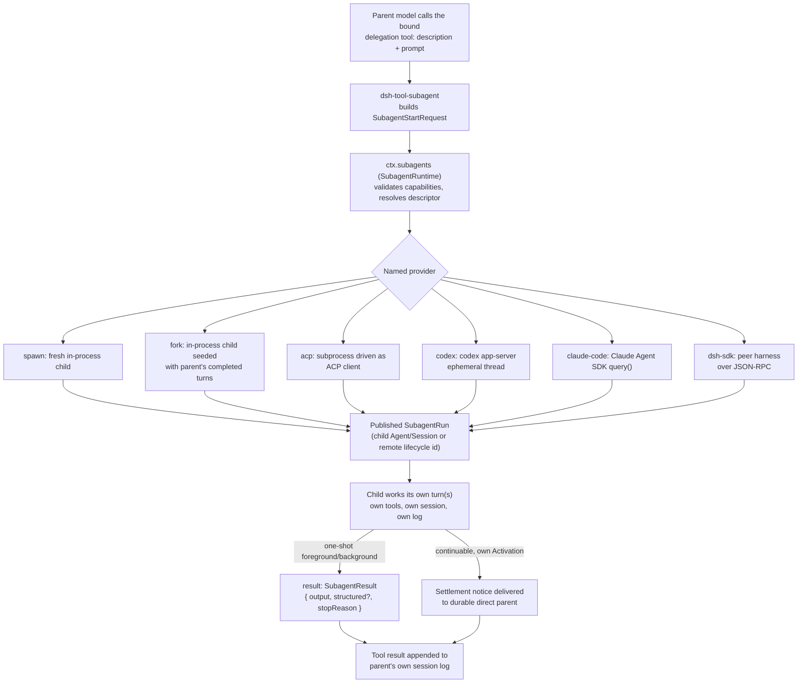

## The short version

A subagent lets one tool call hand a task to a *different* agent — one running in the same process with a blank or partially-shared history, one in a different process, or one inside a completely different product — and the parent's turn either waits for that child or moves on while it keeps working in the background and reports back later. This is not a special case bolted onto the tool pipeline: it is a capability seam with the same three roles as bash — a Service Definition (`dsh-subagent`) that owns a **named-provider registry**, six Service Providers that each run a child one way, and Consumers that turn a chosen provider into one model-facing tool. The core primitive is a one-shot `start() → SubagentRun`; an optional continuable path lets a child own its own turns across messages. Read on for why this seam is a registry rather than bash's one-executor rule, and for what each provider trades off.

## At a glance

:::concept{term="ctx.subagents / SubagentRuntime"}
The Service Definition: a Cordis `Service` that is a **named-provider registry**, not a single fixed executor. Providers register side by side; the delegation tool picks one by name and calls `start(name, request)`.
:::

:::concept{term="SubagentProvider"}
The provider contract: a `name`, a static `capabilities` descriptor, a descriptive `inheritsParentContext` flag, a required `start(request)`, and an optional `prepareContinuable(request)`. One provider = one transport.
:::

:::concept{term="SubagentRun"}
The handle to a **published**, running child: `{ id, localAgent, result, dispose() }`. `result` never rejects on a child-level failure — it resolves a non-`completed` `stopReason`; `dispose()` is idempotent and must run on every path.
:::

:::concept{term="SubagentCapabilities"}
Four static flags — `outputSchema`, `depthLimit`, `toolFilter`, `persona` — checked **before** a run exists, the only point where "reject, don't create the child" is even representable.
:::

:::concept{term="prepareContinuable"}
The optional method that gates continuable-child creation. TypeScript's own narrowing is the discovery mechanism — no separate boolean can drift out of sync with whether the method actually exists.
:::

:::concept{term="inheritsParentContext"}
A purely descriptive field: whether the child sees the parent's completed conversation (true only for `fork`). It promises nothing about inherited tools, services, or authority.
:::

## The Service Definition: `ctx.subagents`

`SubagentRuntime` (`packages/subagent/subagent/src/index.ts:171`) is the Cordis service that claims `ctx.subagents`:

```ts
// packages/subagent/subagent/src/index.ts:362-402
registerProvider(provider: SubagentProvider): () => void { /* ... */ }
getProvider(name: string): SubagentProvider | undefined { /* ... */ }
list(): string[] { /* ... */ }
```

This registry shape deliberately mirrors the LLM adapter registry (`LlmRuntime.registerAdapter`) rather than the bash seam's one-executor-per-context rule, because coexistence is the actual requirement here: a session can load several delegation tools, each bound to a different provider name, and the model sees them as distinctly named tools it can pick between.

The service also owns two things beyond plain registration: the durable `subagent/descriptor` session-event vocabulary that identifies every session-backed child on disk, and — when `ctx.agents` is injected — a **continuation manager** for children whose conversation can be resumed across multiple turns rather than run once and discarded (`packages/subagent/subagent/src/index.ts:183-201`). Both are covered below; the one-shot path is the one worth understanding first.

## The one-shot primitive: `start → SubagentRun`

The core operation is `SubagentRuntime.start(name, request): Promise<SubagentRun>` (`packages/subagent/subagent/src/index.ts:414-426`). It validates the request's capability requirements against the named provider, resolves a durable descriptor, and delegates to `provider.start()`. Fulfillment means the child has been **published** — an ordinary child Agent and Session exist and are running — and ownership of that running child transfers to the caller as a `SubagentRun`:

```ts
// packages/subagent/subagent/src/types.ts:249-275
interface SubagentRun {
  readonly id: SessionId
  readonly localAgent: Agent | undefined
  readonly result: Promise<SubagentResult>
  dispose(): Promise<void>
}
```

`result` resolves to `{ output, structured?, stopReason }` and never rejects on a child-level failure: a model refusal, a token ceiling, or a cancelled child all resolve with a non-`completed` `stopReason` so the consuming tool can map it to an `isError` result rather than mistaking partial output for success. Only an infrastructure fault the seam has no vocabulary for can reject. `dispose()` is idempotent and must always be called — it is what reaches child quiescence and releases resources, independent of whether `result` already settled.

A request that fails **before** publication rejects `start()` outright, after the provider has cleaned up anything partial; nothing is left half-created and no lifecycle event fires. A request that fails **after** publication settles normally through `result`, and the service still emits the paired `subagent/start` / `subagent/end` lifecycle events so an observer can watch delegation happen without owning the run itself.

## Two kinds of optional capability, discovered two different ways

A `SubagentStartRequest` can additionally ask for a JSON-schema-validated structured output, an absolute delegation-depth cap, a scoped tool-filter for the child, or a per-child persona (`packages/subagent/subagent/src/types.ts:100-149`). None of these are universal — an out-of-process Claude Code child cannot have its depth capped by this process, for instance — so the seam needs a way to reject an unsupported request loudly rather than silently ignore the option.

> [!WHY]
> Two different discovery mechanisms, deliberately. The four `SubagentCapabilities` flags are a static descriptor the service checks **before** a run exists — the only point at which "reject, don't create the child" is even representable. Continuable-child creation, by contrast, is gated by the mere *presence* of `prepareContinuable`, so TypeScript's own narrowing is the check and no separate boolean flag can drift out of sync with whether the method exists.

```ts
// packages/subagent/subagent/src/types.ts:86-91
interface SubagentCapabilities {
  readonly outputSchema: boolean
  readonly depthLimit: boolean
  readonly toolFilter: boolean
  readonly persona: boolean
}
```

```ts
// packages/subagent/subagent/src/types.ts:285-323
interface SubagentProvider {
  readonly name: string
  readonly capabilities: SubagentCapabilities
  readonly inheritsParentContext: boolean
  start(request: ResolvedSubagentStartRequest): Promise<SubagentRun>
  prepareContinuable?(request: ContinuableCreateRequest): Promise<ContinuableCreateSpec>
}
```

A provider that lacks `prepareContinuable` is rejected before the continuation manager reserves any child identity; a provider that has it may still serve ordinary one-shot delegations alongside continuable ones. `inheritsParentContext` is a third, purely descriptive field: it says whether the child sees the parent's completed conversation (true only for `fork`), so the delegation tool can generate accurate wording about what the child will and will not know — it makes no promise about inherited tools, services, or authority.

## Fork and spawn: two providers, not one flag with an option

:::decision
"Fresh child" versus "child seeded with parent history" is **two separate providers**, not a boolean on one — the Agent Note is explicit about this. `dsh-subagent-spawn-in-process` and `dsh-subagent-fork-in-process` share all of their run mechanics through `dsh-subagent-in-process-driver` and differ only in the session seed.
:::

Spawn creates a completely fresh child Agent: new session, empty conversation, inherited cwd, model, and provider by default. Fork instead computes a seed:

> The parent's current tool-calling turn is still open when a subagent starts: its log contains the assistant tool call but not the matching tool result or `turn/end`. Fork therefore computes the contiguous prefix ending at the last `turn/end`. The child sees all completed parent turns and none of the in-flight turn.

That boundary matters mechanically, not just semantically — copying the raw in-flight turn would hand the child an unbalanced, unreplayable session log. If the parent has not completed a single turn yet, the fork seed is empty and the child behaves exactly like a fresh spawn. In both cases the child still gets a brand-new flat registration scope: neither provider imports the parent's tool restrictions or authority, only (for fork) its completed conversation text.

Both providers advertise the full capability set — `{ outputSchema: true, depthLimit: true, toolFilter: true, persona: true }` — because both control the child's creation window directly and can enforce all four. The shared driver (`dsh-subagent-in-process-driver`) is where that enforcement actually lives: it validates depth, calls `parent.ctx.agents.create()`, installs the requested persona/tool-filter/structured-output runtime during the child's unpublished setup window, publishes the child, drives one `followup()` + `whenIdle()` cycle, and reads back the child's own final assistant output.

## Out-of-process transports: driving a real product as a child

The remaining providers are where "subagent" stops meaning "another instance of this same loop" and starts meaning "delegate to whatever agent understands the task best." Each is a one-shot provider — none currently supports `prepareContinuable` — and each advertises no optional start-time capabilities, because none of these processes lets the parent enforce a depth cap, tool filter, persona, or structured-output contract inside another product's runtime:

- **`dsh-subagent-acp`** drives a fresh subprocess as an Agent Client Protocol client: `spawn` → ACP `initialize` → `newSession` → prompt → collect `agent_message_chunk` text. The child can be another instance of the harness itself, or any other ACP-speaking agent. Permission requests are auto-answered (`allow` or `reject`, configured, never surfaced to a human) since no interactive channel exists.
- **`dsh-subagent-codex`** starts the official `codex app-server --stdio`, creates one ephemeral thread, submits one turn, and reads back the `agentMessage` with `phase: "final_answer"`. Approval and permission requests get a non-approval decision or a hard-coded decline; there is no human in the loop.
- **`dsh-subagent-claude-code`** invokes the official Claude Agent SDK's `query()`, resolving the native `claude` executable through the shared subprocess service, and accepts only a `result` message with `subtype: "success"` and non-blank output as its answer.
- **`dsh-subagent-dsh-sdk`** spawns an entire second DeepSeek Harness runtime as a subprocess — its own `cordis.yml`, its own composition, its own model route — and drives it over stdio JSON-RPC through the TypeScript SDK client. This is the seam's second out-of-process backend, differing from ACP in the wire protocol and in what's on the other end: ACP drives *any* ACP agent, this backend drives specifically a peer harness.

Every one of these providers reports `inheritsParentContext: false`, and every one collects only the child's committed final text — reasoning, intermediate tool calls, and stderr stay entirely on the far side of the process boundary. The parent's log records only the one delegation `tool/call` and its `tool/result`; nothing about how the child got there ever enters the parent's session. This is the same "child isolation" rule that applies to in-process children too, just enforced by a process boundary instead of a scope boundary.

## Why this is a capability seam and not a special-cased mechanism

Put the pieces next to each other and the three-role shape from [Chapter 7](../s07-capability-seams-primer/README.md) is exact:

| Role | Package(s) | Owns |
|---|---|---|
| Service Definition | `dsh-subagent` | `ctx.subagents`, `SubagentProvider`, `SubagentRun`, capability/request/result vocabulary, `subagent/*` events, the durable descriptor format |
| Service Provider | `dsh-subagent-spawn-in-process`, `-fork-in-process`, `-acp`, `-codex`, `-claude-code`, `-dsh-sdk` | One transport each: how a child actually gets run |
| Consumer | `dsh-tool-subagent` (delegation), `dsh-tool-subagent-control` (follow-up/interrupt/list), `dsh-tool-subagent-report` (child-to-parent report) | What the model sees and calls |

`docs/capability-seams.md` classifies `ctx.subagents` explicitly as a `seam` row with six known providers and three consumers feeding it. `docs/architecture.md` states the payoff directly: "[Subagent providers] vary just as widely behind one interface, from a fresh child agent to a delegated turn in another product." A deployment can load `dsh-tool-subagent` twice — once bound to `provider: fork` as `toolName: subagent`, once bound to `provider: claude-code` as `toolName: subagent_claude_code` — and the model sees two independently-schema'd tools, neither of which reveals what runs underneath it. Swap the fork provider for a sandboxed variant later, and `dsh-tool-subagent`'s own source does not change at all; it never imports a provider type, only the `SubagentProvider` interface it was handed by the registry.

:::decision
The rejected alternative is the bash seam's shape — one executor per context, a second load throws. That is correct when there is exactly one way to run a command on a machine; it is wrong here because coexistence — an in-process child for a scoped subtask *and* a Claude Code child for a task that needs a different product's judgment, in the very same session — is not a hypothetical future requirement but the actual reason the registry exists.
:::

## The delegation tool: one provider, one schema, per instance

`dsh-tool-subagent` is deliberately narrow: each loaded instance binds to exactly one `provider` name and exposes exactly one `toolName`. The model never sees a provider selector in the tool's arguments — `{ description, prompt }` (plus optional `run_in_background`) is the entire schema. To expose a second transport, a deployment loads a second instance of the same tool plugin with a different `provider` and a distinct `toolName`; the tool registry itself rejects a duplicate name, so this can never silently collide.

```yaml
- id: tool-subagent
  name: '@deepseek-ai/dsh-tool-subagent'
  config: { provider: fork, toolName: subagent }

- id: tool-subagent-claude-code
  name: '@deepseek-ai/dsh-tool-subagent'
  config:
    provider: claude-code
    toolName: subagent_claude_code
    enableRunInBackground: false
    maxDepth: provider-managed
```

A foreground call passes the tool's own execution signal through to `start()`, awaits `run.result`, and always disposes the run before returning — a `completed` result becomes the child's final text, and everything else (`aborted`, `error`, `max-tokens`, `refusal`) becomes an errored tool result that still appends whatever partial output the child produced, so a truncated answer is reported honestly rather than either silently as success or silently dropped.

`maxDepth` defaults to `3` and is enforced by the in-process driver reading the persisted, monotone `SessionHeader.delegationDepth` — a resumed child can never be re-counted as shallower than it actually is.

> [!PITFALL]
> A numeric cap requires the bound provider to advertise `depthLimit`. Configure one against a provider that cannot enforce it — every out-of-process provider — and the plugin fails **at mount time**, not on the first delegation. Those deployments instead set `maxDepth: 'provider-managed'`, handing the recursion budget to the child process's own harness.

## Background delegation: one-shot Tasks vs. continuable children

A synchronous, foreground `start()` call blocks the parent's current step for the child's entire run. `dsh-tool-subagent`'s `backgroundMode` config selects one of two very different ways to avoid that:

- **`one-shot`** (the default) registers a plain `ctx.jobs` Task when the model sets `run_in_background: true`. The generic `job_output`/`job_kill` tools own everything that happens after that: status, final-output collection, cancellation. The subagent seam itself stays task-agnostic here — it's the same background mechanism background bash already uses.
- **`continuable`** calls `ctx.subagents.startContinuable()` instead, which requires the bound provider's `prepareContinuable` capability. This returns only `{ childId, messageId }` the moment the child's inbox accepts the initial prompt — no Task, no result promise, because the child now owns its own turns from that point on. The optional `send_message` tool (from `dsh-tool-subagent-control`) delivers later turns to the same child conversation; the optional `report` tool (`dsh-tool-subagent-report`), installed *inside* continuable children, lets the child proactively push partial findings back before it's asked. Independently of either, when the child's resident Activation eventually settles, the continuation manager delivers one unconditional settlement notice to the parent — "finished and will do no further work unless you send it more," plus its closing message or the lack of one — regardless of whether the child ever called `report`.

Only the in-process fork and spawn providers currently ship `prepareContinuable` in production composition. The out-of-process product providers are one-shot only: an ACP or Codex child has no local Session for the continuation manager's Activation and ownership graph to track.

:::fold[Why fork's continuable mode has no shipped caller]
Fork's `prepareContinuable` is implemented but has no shipped continuable-mode caller: a continuable child's prompt differs from a one-shot child's by the presence of the `report` tool, which would invalidate the fork's whole inherited KV-cache prefix.
:::

## One delegation, start to settlement

The delegation lifecycle is provider-independent — the same spine no matter which transport serves:

:::timeline
- model call — the parent model calls the bound delegation tool with `description` + `prompt`
- build request — `dsh-tool-subagent` builds a `SubagentStartRequest`
- validate + resolve — `ctx.subagents` checks capabilities against the named provider and resolves a durable descriptor
- start + publish — the named provider's `start()` publishes the child: a child Agent/Session (or a remote lifecycle id) exists and is running
- child works — the child runs its own turn(s) with its own tools, session, and log
- settle — one-shot: `result` resolves to `{ output, structured?, stopReason }`; continuable: a settlement notice goes to the durable direct parent
- record — the tool result is appended to the parent's own session log
:::

The full picture, with the provider fan-out and both settlement paths:



The last edge is deliberately asymmetric: a one-shot result comes back as the *tool call's own result*, while a continuable child's settlement arrives as an independent later parent message the tool call never sees, because the tool call already returned as soon as the child's inbox accepted its first prompt.

## Recursion, isolation, and delegated policy

Nothing stops an in-process child from seeing the very same delegation tool and recursing — that is exactly why `maxDepth` and `toolFilter` exist as start-time capabilities rather than afterthoughts. Beyond depth, every in-process child's permission scope is fixed at the moment it's created: `captureDelegatedPolicyOverrides()` snapshots the parent's explicit sandbox override and pins the child's approval policy to `'never'` whenever approval is composed, regardless of what the parent's own policy is.

> [!NOTE]
> A child that hits a wall requiring wider access cannot ask — a fixed runtime-context statement tells it to report the limitation in its reply instead of retrying. Enforced identically whether the child came from `spawn` or `fork`, this is what makes a delegated child a genuinely bounded blast radius rather than a second copy of the parent's full authority.

## Known limits worth carrying forward

A few limits are structural rather than incidental, and they explain design choices you'll see reused elsewhere in the harness:

- **Only committed, final child output crosses the process or scope boundary.** No provider streams intermediate child reasoning or tool activity into the parent; this is what keeps the parent's own context bounded regardless of how much work a child does.
- **Out-of-process providers cannot be depth-capped, tool-filtered, given a persona, or forced into structured output by this process** — those all require the child's own composition to do the enforcing, which is why every product provider ships with `maxDepth: 'provider-managed'` in its example configuration.
- **A continuable child's Activation is process-local.** The inbox and ownership graph coordinating a resident child's turns do not span two harness processes; a durable mailbox and cross-process lease protocol would be required before that residency could move.
- **Fork's seed is a one-time snapshot**, not live context sharing — the child never sees anything the parent logs after the fork point.

These constraints are exactly why the seam has a registry instead of a single blessed transport: each provider trades a different set of these limits for a different set of guarantees, and the model-facing schema stays identical no matter which trade a given deployment picked.
