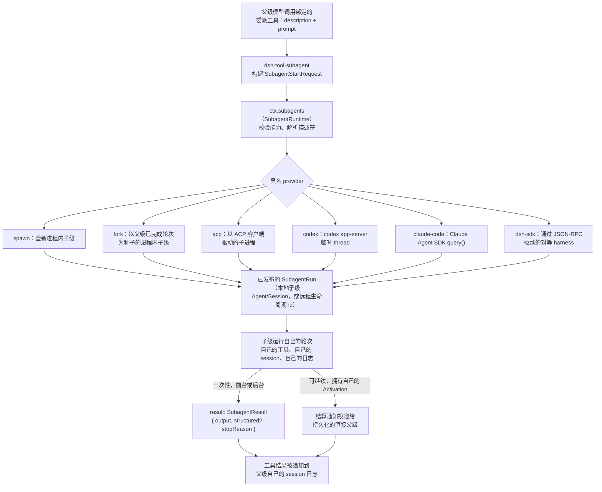

## 一句话版本

Subagent 让一次工具调用可以把任务交给**另一个** agent——它可能运行在同一进程里、带着一份空白或部分共享的历史；也可能运行在另一个进程里；甚至可能运行在完全不同的产品内部——父级的当前轮次要么等待这个子级完成，要么继续往前走，让子级在后台干活、稍后再汇报结果。这不是在工具流水线上打的一个补丁，而是一个能力 seam，拥有和 bash 相同的三个角色：一个拥有**具名 provider 注册表**的 Service Definition（`dsh-subagent`）、六个各自以一种方式运行子级的 Service Provider，以及把所选 provider 收敛成一次模型可见工具调用的 Consumer。核心原语是一次性的 `start() → SubagentRun`；一条可选的可继续路径让子级跨多条消息拥有自己的轮次。下文讲清为什么这个 seam 用的是注册表、而不是 bash 那种「一个执行器」的规则，以及每个 provider 各自做了什么取舍。

## 速览

:::concept{term="ctx.subagents / SubagentRuntime"}
Service Definition：一个 Cordis `Service`，是**具名 provider 注册表**，而不是单一固定的执行器。多个 provider 并存注册；委派工具按名字挑一个，调用 `start(name, request)`。
:::

:::concept{term="SubagentProvider"}
Provider 契约：一个 `name`、一份静态的 `capabilities` 描述符、一个纯描述性的 `inheritsParentContext` 标志、一个必需的 `start(request)`，以及一个可选的 `prepareContinuable(request)`。一个 provider 对应一种传输方式。
:::

:::concept{term="SubagentRun"}
指向一个**已发布**、正在运行的子级的句柄：`{ id, localAgent, result, dispose() }`。`result` 绝不会因子级层面的失败而拒绝——它以非 `completed` 的 `stopReason` 兑现；`dispose()` 幂等，且必须在每条路径上调用。
:::

:::concept{term="SubagentCapabilities"}
四个静态标志——`outputSchema`、`depthLimit`、`toolFilter`、`persona`——在一次运行**存在之前**就被检查，那是「拒绝，而不是创建子级」唯一能表达的时间点。
:::

:::concept{term="prepareContinuable"}
把控可继续子级创建的可选方法。TypeScript 自身的类型收窄就是发现机制——不存在另一个可能与「方法是否真的实现了」脱节的独立布尔标志。
:::

:::concept{term="inheritsParentContext"}
一个纯描述性字段：子级是否能看到父级已完成的对话（只有 `fork` 为真）。它对是否继承工具、服务或权限不做任何承诺。
:::

## Service Definition：`ctx.subagents`

`SubagentRuntime`（`packages/subagent/subagent/src/index.ts:171`）是占用 `ctx.subagents` 的 Cordis 服务：

```ts
// packages/subagent/subagent/src/index.ts:362-402
registerProvider(provider: SubagentProvider): () => void { /* ... */ }
getProvider(name: string): SubagentProvider | undefined { /* ... */ }
list(): string[] { /* ... */ }
```

这种注册表形态是刻意仿照 LLM 适配器注册表（`LlmRuntime.registerAdapter`）设计的，而不是 bash seam 那种「每个上下文一个执行器」的规则，因为这里真正的需求就是共存：一个 session 可以同时加载好几个委派工具，各自绑定不同的 provider 名字，模型看到的是几个名字不同的工具，可以自行挑选。

除了单纯的注册之外，这个服务还拥有另外两样东西：一是持久化的 `subagent/descriptor` 会话事件词汇，用来标识磁盘上每一个由会话支撑的子级；二是——当 `ctx.agents` 被注入时——一个**继续执行管理器**，用于那些对话可以跨多个轮次恢复、而不是只运行一次就丢弃的子级（`packages/subagent/subagent/src/index.ts:183-201`）。这两者后文都会展开；值得先弄懂的是一次性路径。

## 一次性原语：`start → SubagentRun`

核心操作是 `SubagentRuntime.start(name, request): Promise<SubagentRun>`（`packages/subagent/subagent/src/index.ts:414-426`）。它先校验请求所需能力是否被该具名 provider 支持，解析出一份持久化描述符，再委托给 `provider.start()`。兑现意味着子级已经**发布**——一个普通的子级 Agent 和 Session 已经存在并在运行——并且这个正在运行的子级的所有权转移给调用方，形式是一个 `SubagentRun`：

```ts
// packages/subagent/subagent/src/types.ts:249-275
interface SubagentRun {
  readonly id: SessionId
  readonly localAgent: Agent | undefined
  readonly result: Promise<SubagentResult>
  dispose(): Promise<void>
}
```

`result` 兑现为 `{ output, structured?, stopReason }`，且绝不会因为子级层面的失败而拒绝：模型拒答、达到 token 上限，或者子级被取消，都会以非 `completed` 的 `stopReason` 兑现，这样调用方工具就能把它映射成 `isError` 结果，而不会把部分输出误当成成功。只有 seam 无法表示的基础设施故障才会导致拒绝。`dispose()` 是幂等的，且必须在每条路径上都被调用——它才是真正让子级完全停稳、释放资源的操作，与 `result` 是否已经结算无关。

在发布**之前**失败的请求会让 `start()` 直接拒绝，此时 provider 已经清理了所有半成品资源；不会留下任何半创建的状态，也不会触发任何生命周期事件。在发布**之后**失败则正常通过 `result` 结算，服务仍会发出配对的 `subagent/start` / `subagent/end` 生命周期事件，让观察者可以旁观整个委派过程，而不需要拥有这次运行本身。

## 两类可选能力，两种发现方式

一个 `SubagentStartRequest` 还可以额外要求一份经 JSON schema 校验的结构化输出、一个绝对的委派深度上限、一份对子级的工具范围限制，或者一个子级专属的 persona（`packages/subagent/subagent/src/types.ts:100-149`）。这些都不是普适能力——比如一个进程外的 Claude Code 子级就无法被这个进程限制深度——因此 seam 需要一种方式，在不支持时明确拒绝，而不是悄悄忽略这个选项。

> [!WHY]
> 刻意使用两种不同的发现机制。四个 `SubagentCapabilities` 标志是一份静态描述符，服务会在一次运行**存在之前**就检查它们——那是「拒绝，而不是创建子级」唯一能表达的时间点。相比之下，可继续子级的创建能力，靠 `prepareContinuable` 这个可选方法**是否存在**来把关，于是 TypeScript 自身的类型收窄就是检查手段，不存在另一个可能与「方法是否真的实现了」脱节的独立布尔标志。

```ts
// packages/subagent/subagent/src/types.ts:86-91
interface SubagentCapabilities {
  readonly outputSchema: boolean
  readonly depthLimit: boolean
  readonly toolFilter: boolean
  readonly persona: boolean
}
```

```ts
// packages/subagent/subagent/src/types.ts:285-323
interface SubagentProvider {
  readonly name: string
  readonly capabilities: SubagentCapabilities
  readonly inheritsParentContext: boolean
  start(request: ResolvedSubagentStartRequest): Promise<SubagentRun>
  prepareContinuable?(request: ContinuableCreateRequest): Promise<ContinuableCreateSpec>
}
```

没有 `prepareContinuable` 的 provider，会在继续执行管理器预留任何子级身份之前就被拒绝；具备这个方法的 provider，仍然可以照常服务普通的一次性委派。`inheritsParentContext` 是第三个纯描述性字段：它说明子级是否能看到父级已完成的对话（只有 `fork` 为真），这样委派工具就能生成准确的措辞，说明子级将会知道什么、不会知道什么——它对是否继承工具、服务或权限不做任何承诺。

## Fork 与 spawn：是两个 provider，不是一个带选项的标志位

:::decision
「全新子级」和「用父级历史作为种子的子级」，是**两个独立的 provider**，而不是一个 provider 上的布尔选项——Agent Note 对此写得很明确。`dsh-subagent-spawn-in-process` 与 `dsh-subagent-fork-in-process` 通过 `dsh-subagent-in-process-driver` 共享全部运行机制，唯一的区别是会话初始内容（seed）。
:::

Spawn 创建一个完全全新的子级 Agent：新会话、空对话，默认继承 cwd、模型和 provider。Fork 则计算一份种子：

> subagent 启动时，父级当前的工具调用轮次仍未结束：其日志包含 assistant 的工具调用，但还没有匹配的工具结果或 `turn/end`。因此 fork 会计算截至最后一个 `turn/end` 的连续前缀。子级能看到父级所有已完成的轮次，看不到进行中的那一轮。

这个边界不只是语义上的讲究，也是机制上的必要——直接复制那个进行中的轮次会给子级一份不平衡、无法重放的会话日志。如果父级此前一个轮次都还没完成，fork 的种子就是空的，子级的行为和全新 spawn 完全一样。两种情况下子级都会拿到一个全新的扁平注册作用域：两个 provider 都不导入父级的工具限制或权限，fork 唯一多传递的只是已完成的对话文本。

两个 provider 都声明了完整的能力集合——`{ outputSchema: true, depthLimit: true, toolFilter: true, persona: true }`——因为它们都直接控制子级的创建窗口，能够强制执行全部四项能力。真正实现这些强制约束的是共享驱动器（`dsh-subagent-in-process-driver`）：它校验深度、调用 `parent.ctx.agents.create()`、在子级尚未发布的设置窗口内安装所请求的 persona／工具限制／结构化输出运行时、发布子级、驱动一次 `followup()` + `whenIdle()` 循环，并读回子级自己最终的 assistant 输出。

## 进程外传输：把一个真实产品当子级来驱动

剩下的几个 provider，是「subagent」这个词从「这条 loop 的另一个实例」变成「把任务委派给最懂它的那个 agent」的地方。它们都是一次性 provider——目前都不支持 `prepareContinuable`——也都不声明任何可选的启动时能力，因为这些进程都不允许当前进程在另一个产品的运行时内部强制执行深度上限、工具限制、persona 或结构化输出约定：

- **`dsh-subagent-acp`** 把一个全新子进程当作 Agent Client Protocol 客户端来驱动：`spawn` → ACP `initialize` → `newSession` → 提交提示词 → 收集 `agent_message_chunk` 文本。子级可以是 harness 自身的另一个实例，也可以是任何其他会说 ACP 的 agent。权限请求会被自动应答（配置为 `allow` 或 `reject`，绝不会展示给人类），因为不存在交互通道。
- **`dsh-subagent-codex`** 启动官方的 `codex app-server --stdio`，创建一个临时 thread，提交一个轮次，读回 `phase: "final_answer"` 的 `agentMessage`。审批和权限请求会得到一个非批准的决定，或者硬编码的拒绝；这里没有人类参与决策。
- **`dsh-subagent-claude-code`** 调用官方 Claude Agent SDK 的 `query()`，通过共享子进程服务解析原生 `claude` 可执行文件，只把 `subtype: "success"` 且内容非空的 `result` 消息当作答案接受。
- **`dsh-subagent-dsh-sdk`** 把一整个第二份 DeepSeek Harness 运行时作为子进程启动——有它自己的 `cordis.yml`、自己的组合方式、自己的模型路由——并通过 TypeScript SDK 客户端以 stdio JSON-RPC 驱动它。这是 seam 的第二个进程外后端，与 ACP 的区别在于线协议和另一端到底是什么：ACP 可以驱动**任何**会说 ACP 的 agent，这个后端专门驱动一个对等的 harness。

这些 provider 无一例外都报告 `inheritsParentContext: false`，也无一例外只收集子级已提交的最终文本——推理过程、中间工具调用和 stderr 都留在进程边界的另一侧。父级的日志只记录那一次委派的 `tool/call` 及其 `tool/result`；子级是怎么得到这个结果的，完全不会进入父级的 session。这与进程内子级遵循的「子级隔离」规则完全一致，只是这里由进程边界而非作用域边界来强制执行。

## 为什么这是一个能力 seam，而不是特例机制

把这些拼在一起看，[第 7 章](../s07-capability-seams-primer/README.zh.md)的三角色形态严丝合缝：

| 角色 | 包 | 拥有什么 |
|---|---|---|
| Service Definition | `dsh-subagent` | `ctx.subagents`、`SubagentProvider`、`SubagentRun`、能力／请求／结果词汇、`subagent/*` 事件、持久化描述符格式 |
| Service Provider | `dsh-subagent-spawn-in-process`、`-fork-in-process`、`-acp`、`-codex`、`-claude-code`、`-dsh-sdk` | 各自一种传输方式：子级究竟怎样被真正跑起来 |
| Consumer | `dsh-tool-subagent`（委派）、`dsh-tool-subagent-control`（后续消息／中断／列举）、`dsh-tool-subagent-report`（子级到父级的上报） | 模型能看到什么、能调用什么 |

`docs/capability-seams.md` 明确把 `ctx.subagents` 分类为 `seam` 一行，标注了六个已知 provider 和三个 consumer。`docs/architecture.md` 直接点出了这样做的回报：「Subagent provider 在同一接口背后同样千差万别，从全新的子级 agent 到另一个产品里的一次委派轮次。」一个部署可以把 `dsh-tool-subagent` 加载两次——一次绑定 `provider: fork`、命名为 `toolName: subagent`，另一次绑定 `provider: claude-code`、命名为 `toolName: subagent_claude_code`——模型会看到两个 schema 各不相同的工具，谁都看不出底下运行的是什么。以后把 fork provider 换成一个沙箱化版本，`dsh-tool-subagent` 自己的源码完全不用改；它从不导入某个具体 provider 的类型，只导入注册表交给它的 `SubagentProvider` 接口。

:::decision
被否定的替代方案是 bash seam 的形态——每个上下文一个执行器，第二次加载就抛错。在一台机器上跑命令只有一种方式的场景下，这样做是对的；但在这里是错的，因为共存——同一个 session 里，既要有一个进程内子级处理有限范围的子任务，又要有一个 Claude Code 子级处理需要另一个产品判断力的任务——从来不是一个假设性的未来需求，而正是这个注册表存在的现实原因。
:::

## 委派工具：每个实例一个 provider、一份 schema

`dsh-tool-subagent` 被刻意设计得很窄：每个已加载的实例只绑定一个 `provider` 名字，只暴露一个 `toolName`。模型的调用参数里从来看不到 provider 选择器——`{ description, prompt }`（外加可选的 `run_in_background`）就是完整的 schema。要暴露第二种传输方式，部署方需要再加载一个这个工具插件的实例，配上不同的 `provider` 和不重复的 `toolName`；工具注册表本身会拒绝重复的名字，所以这里绝不可能悄悄冲突。

```yaml
- id: tool-subagent
  name: '@deepseek-ai/dsh-tool-subagent'
  config: { provider: fork, toolName: subagent }

- id: tool-subagent-claude-code
  name: '@deepseek-ai/dsh-tool-subagent'
  config:
    provider: claude-code
    toolName: subagent_claude_code
    enableRunInBackground: false
    maxDepth: provider-managed
```

前台调用会把工具自身的执行信号一路传给 `start()`，等待 `run.result`，并且在返回前总是 dispose 这次运行——`completed` 结果会变成子级的最终文本，其余情况（`aborted`、`error`、`max-tokens`、`refusal`）都会变成一个带错误的工具结果，并且仍然附上子级产出的部分输出，这样一个被截断的答案会被诚实地报告出来，而不是被静默当成成功，也不是被静默丢弃。

`maxDepth` 默认是 `3`，由进程内驱动器读取持久化、单调递增的 `SessionHeader.delegationDepth` 来强制执行——一个恢复后的子级绝不会被重新计成比它实际更浅的深度。

> [!PITFALL]
> 设置数值上限要求所绑定的 provider 声明 `depthLimit`。如果对一个无法强制执行深度的 provider——也就是所有进程外 provider——配置了数值上限，插件会在**挂载时**就失败，而不是等到第一次委派才失败。那些部署应改用 `maxDepth: 'provider-managed'`，把递归预算交给子进程自己的 harness 去管理。

## 后台委派：一次性 Task 与可继续子级

一次同步、前台的 `start()` 调用会阻塞父级当前的 step，直到子级整个运行结束。`dsh-tool-subagent` 的 `backgroundMode` 配置提供了两种截然不同的方式来避免这一点：

- **`one-shot`**（默认）：当模型设置 `run_in_background: true` 时，注册一个普通的 `ctx.jobs` Task。之后的一切——状态、最终输出收集、取消——都归通用的 `job_output`／`job_kill` 工具管理。subagent seam 本身在这里保持与 Task 无关，用的是后台 bash 已经在用的同一套后台机制。
- **`continuable`**：改为调用 `ctx.subagents.startContinuable()`，这要求所绑定的 provider 具备 `prepareContinuable` 能力。它只在子级的 inbox 一接受初始提示词时就兑现为 `{ childId, messageId }`——没有 Task，也没有结果 promise，因为从这一刻起子级就拥有自己的轮次了。可选的 `send_message` 工具（来自 `dsh-tool-subagent-control`）负责把之后的轮次投递给同一个子级会话；可选的 `report` 工具（`dsh-tool-subagent-report`）安装在**可继续子级内部**，让子级可以在被问到之前主动把中间发现推送回去。与两者都独立地，当子级驻留的 Activation 最终结算时，继续执行管理器会向父级发出一条无条件的结算通知——「已完成，除非你再发消息否则不会再做任何事」，附上它的收尾消息，或者说明它没有留下收尾消息——无论子级是否调用过 `report`。

目前只有进程内的 fork 和 spawn 两个 provider 在生产组合中实际提供了 `prepareContinuable`。进程外的产品 provider 都只支持一次性模式：一个 ACP 或 Codex 子级没有本地 Session，继续执行管理器的 Activation 与所有权图也就无从追踪。

:::fold[为什么 fork 的可继续模式没有已上线的调用方]
fork 的 `prepareContinuable` 实现是存在的，但没有任何已上线的可继续模式调用方：可继续子级的提示词与一次性子级的差异就在于多了 `report` 这个工具，这会让 fork 原本可以继承的整段 KV 缓存前缀失效。
:::

## 一次委派，从启动到结算

委派的生命周期与 provider 无关——无论底下是哪种传输方式，主干都一样：

:::timeline
- 模型调用 —— 父级模型用 `description` + `prompt` 调用绑定的委派工具
- 构建请求 —— `dsh-tool-subagent` 构建一个 `SubagentStartRequest`
- 校验 + 解析 —— `ctx.subagents` 对照具名 provider 校验能力，并解析出一份持久化描述符
- 启动 + 发布 —— 具名 provider 的 `start()` 发布子级：一个子级 Agent/Session（或一个远程生命周期 id）已经存在并在运行
- 子级工作 —— 子级运行自己的轮次，用自己的工具、自己的 session、自己的日志
- 结算 —— 一次性：`result` 兑现为 `{ output, structured?, stopReason }`；可继续：一条结算通知发往持久化的直接父级
- 记录 —— 工具结果被追加到父级自己的 session 日志
:::

完整的图景，含 provider 的扇出与两条结算路径：



最后一条边是刻意不对称的：一次性结果作为**工具调用自己的结果**返回；而可继续子级的结算，是一条工具调用永远看不到的、独立的后续父级消息——因为工具调用早在子级 inbox 接受第一条提示词时就已经返回了。

## 递归、隔离与被委派的策略

没有任何机制阻止一个进程内子级看到同一个委派工具并递归调用它——这正是 `maxDepth` 和 `toolFilter` 要作为启动时能力存在、而不是事后补丁的原因。除了深度之外，每个进程内子级的权限范围都在创建的那一刻就被固定下来：`captureDelegatedPolicyOverrides()` 会为父会话的显式沙箱覆盖项创建快照，并在审批能力被组合时，无论父级自身采用什么策略，都把子级的审批策略固定为 `'never'`。

> [!NOTE]
> 一个碰到需要更宽访问权限的子级不能去请求——它会通过一条固定的运行时上下文声明被告知：应该在回复中上报这个限制，而不是重试。无论子级来自 `spawn` 还是 `fork`，这条规则的执行方式完全一样，这也是为什么一个被委派的子级真正是一个有界的影响范围，而不是父级全部权限的又一份拷贝。

## 值得记住的已知限制

有几条限制是结构性的，而不是偶然的疏漏，它们也解释了 harness 其他地方会重复用到的一些设计选择：

- **只有已提交的最终子级输出会跨越进程或作用域边界。** 没有任何 provider 会把子级的中间推理或工具活动流式传入父级；这正是无论子级做了多少工作，父级自身上下文都能保持有界的原因。
- **进程外 provider 无法被当前进程限制深度、限制工具、设置 persona，或强制结构化输出**——这些都需要子级自己的组合去执行，这也是为什么每个产品 provider 的示例配置里都写了 `maxDepth: 'provider-managed'`。
- **可继续子级的 Activation 仅限于进程内。** 协调一个驻留子级各轮次的 inbox 和所有权图，并不跨越两个 harness 进程；要让这种驻留状态跨进程迁移，还需要一个持久化邮箱和跨进程租约协议。
- **Fork 的种子是一次性快照**，不是实时的上下文共享——子级永远看不到父级在 fork 那一刻之后记录的任何内容。

这些约束正是这个 seam 需要一个注册表、而不是单一钦定传输方式的原因：每个 provider 都用一组不同的限制换取一组不同的保证，而无论一个部署选择了哪种取舍，面向模型的 schema 都保持完全一致。
