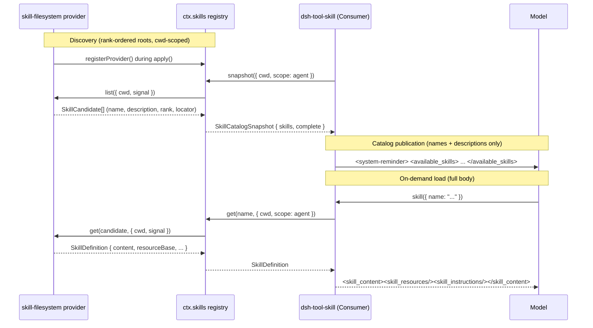

## The problem: instructions that don't belong in every prompt

A skill is a reusable, task-specific set of instructions — a Markdown document telling the model how to accomplish something like reviewing a pull request or generating a changelog. A harness could ship dozens of these. If every skill's full body rode in the system prompt on every single request, token cost would scale with the number of skills installed rather than with how many are actually relevant to the current task, and KV-cache prefixes would invalidate every time a skill file changed anywhere in the tree.

The skill capability solves this with the same two-tier trick libraries use for large APIs: publish a cheap index up front, and load the expensive detail only when something actually needs it. The index is a session catalog of `name` and `description` pairs. The detail is the full instruction body, fetched through a `skill(name)` tool call only when the model decides a particular skill applies.

## Three packages, three roles

The `skill/` family is a capability seam: a Service Definition, one shipped Service Provider, and a Consumer, plus an optional packaged provider.

| Package | Role | `ctx` key |
|---|---|---|
| [`dsh-skill`](../../../packages/skill/skill/README.md) | Service Definition — provider registry | `ctx.skills` |
| [`dsh-skill-filesystem`](../../../packages/skill/skill-filesystem/README.md) | Service Provider — discovers skills on disk | registers on `ctx.skills` |
| [`dsh-skill-badge`](../../../packages/skill/README.md) | Service Provider — one packaged bundled skill | registers on `ctx.skills` |
| [`dsh-tool-skill`](../../../packages/skill/tool-skill/README.md) | Consumer — session catalog + `skill` tool | registers on `ctx.tools` |

`dsh-skill` does not know whether a skill comes from a local directory, an HTTP endpoint, or embedded plugin data — it only merges whatever providers register, resolves duplicate names, and exposes summaries and full definitions. This capability sits outside the core control spine entirely: it can be composed with zero, one, or several providers without the model-facing contract changing shape.

## The registry: `ctx.skills`

`SkillRegistry` (`packages/skill/skill/src/index.ts:357`) exposes four operations:

```ts
registerProvider(create: (control: SkillProviderControl) => SkillProvider): () => void
register(skill: SkillRegistration): () => void
async list(options: SkillViewOptions = {}): Promise<SkillSummary[]>
async snapshot(options: SkillViewOptions = {}): Promise<SkillCatalogSnapshot>
async get(name: string, options: SkillViewOptions = {}): Promise<SkillDefinition | undefined>
```

`registerProvider` is for a same-process backend implementing the `SkillProvider` interface (a local scanner, a remote catalog client, an embedded data source). `register` is a shortcut for one embedded runtime skill, without writing a whole provider — useful for a plugin that wants to contribute exactly one fixed skill body. `list`/`snapshot` return invocation-neutral summaries; `get` loads one skill's complete body.

### Summary, candidate, and definition are three widening shapes

```ts
// packages/skill/skill/src/index.ts:56-101
interface SkillSummary {
  readonly name: string
  readonly description: string
  readonly whenToUse?: string
  readonly invocation: SkillInvocationPolicy
  readonly source: SkillSource
  readonly provider: string
  readonly resourceBase?: SkillResourceBase
}

interface SkillCandidate extends SkillSummary {
  readonly rank: number
  readonly locator: unknown       // opaque; only the winning provider's get() reads it
  readonly path?: string
  readonly metadata?: Readonly<Record<string, unknown>>
}

interface SkillDefinition extends SkillSummary {
  readonly content: string        // the full instruction body
  readonly path?: string
  readonly metadata?: Readonly<Record<string, unknown>>
}
```

`SkillSummary` is what every model- or human-facing consumer is allowed to see without a full load: name, description, and the resolved invocation policy — never the body or an absolute path. `SkillCandidate` is the provider-to-registry shape used only during discovery and merging; its `locator` is opaque provider-owned state, handed back verbatim to that same provider's `get()`. `SkillDefinition` is the complete parsed result the `skill` tool eventually returns.

### The `SkillProvider` contract

```ts
// packages/skill/skill/src/index.ts:247-268
interface SkillProvider {
  readonly name: string
  readonly list: (options: SkillLookupOptions) => Promise<readonly SkillCandidate[] | SkillProviderObservation>
  readonly get: (candidate: SkillCandidate, options: SkillLookupOptions) => Promise<SkillDefinition | undefined>
}
```

A provider factory runs synchronously during plugin `apply()`; any remote initialization, authentication, or slow discovery belongs inside the awaited `list()` call, not in the factory itself. Returning a plain array from `list()` is complete-discovery shorthand; returning `{ candidates, complete: false }` (a `SkillProviderObservation`) lets a provider hand back usable candidates from an incomplete scan — for example, a filesystem walk that hit a transient read error partway through — without the aggregate snapshot becoming cacheable or authoritative for the model catalog.

`SkillProviderControl`, handed to the factory, is the provider's registration-scoped lifecycle handle:

```ts
// packages/skill/skill/src/index.ts:270-276
interface SkillProviderControl {
  readonly signal: AbortSignal   // aborts on registration failure or disposal
  readonly invalidate: () => void // clears cached catalogs, but only while THIS exact registration is active
}
```

The `invalidate()` scoping matters: if a provider is disposed and a new provider registers under the same name, a late invalidation callback from the old registration is a documented no-op — it cannot corrupt the replacement's cache. `dsh-skill-filesystem` calls `invalidate()` from its Chokidar watcher callbacks whenever a catalog-relevant file changes.

### Merge order: rank within a layer, first-wins across layers

Within one registration layer, duplicate skill names resolve by `rank` (lower wins), then provider registration order, then local order inside one provider's own list. The registry validates candidates before caching and definitions before returning them, and rejects a stale name: if `get()`'s returned `SkillDefinition.name` no longer matches the candidate that was selected (the file was renamed between discovery and load), the registry discards the result and invalidates that exact provider so the next snapshot rediscovers its current catalog (`packages/skill/skill/src/index.ts:511-516`).

## Layered per scope, like the tools registry

`SkillRegistry` is not one flat process-wide table. It holds `ScopedLayers<SkillLayer>` — the same host-plus-per-scope shape `ctx.tools` established over `dsh-scope`. `registerProvider()` and `register()` file into the layer of the **calling context's scope**: an unscoped context (a host row, a repository plugin) registers into the global layer; a plugin mounted inside an agent preset's standing composition registers into that preset's own layer. Provider names are unique per layer, not process-wide, which is exactly what lets every preset mount its own `local` filesystem provider without a name collision.

A read carries the **viewing scope** through `SkillViewOptions` — the calling agent, which is its own scope key — and merges the global layer with that scope's chain. The precedence rule has two parts:

- **The nearest layer wins a duplicate name outright.** If a preset's own layer defines `my-skill`, it shadows any global-layer skill of the same name, full stop — no rank comparison crosses a layer boundary.
- **Rank decides duplicates only within one layer.** The 100/200/.../600 rank table below only arbitrates ties among providers registered in the *same* layer.

The [layered skill registry Agent Note](../../../.agents/notes/implemented/architecture/2026-08-09-layered-skill-registry.md) explains why the alternative — pooling ranks across all visible layers — was rejected: ranks were designed to order sources that already know about each other. Under a global pool, a later-installed repository plugin could silently displace a preset's own same-named skill purely by registration-order tiebreak, changing the preset's behavior from *outside* its own composition. Nearest-wins keeps a composition's effective skill set decided by whoever authored that composition, not by what else happens to be mounted elsewhere in the process.

This design exists because of a real deadlock the note documents: an earlier version moved the *entire* skill capability — registry included — into each preset's isolated realm, on the theory that "which skills an agent has" is purely an agent-plane decision. That broke a repository plugin's wrapper, which declares `inject: ['skills']` and expects a host-plane registry to attach to; with no host registry composed, the wrapper waited forever. It also meant a cold session with no live agent had no registry to answer a UI's skill-listing request at all. Splitting "which skills a deployment supplies" (host registry, global layer) from "whether an agent consumes them" (whether that agent's composition mounts `dsh-tool-skill` at all) resolved both problems while preserving per-preset override behavior through the scope chain.

Discovery caches are keyed by the resolved scope chain plus a revision counter, so a blank-session recompose — which re-parents an agent's scope key without mutating the registry itself — is visible on the very next read.

## The local filesystem provider

`FileSystemSkillProvider` (`dsh-skill-filesystem`) is the shipped default `SkillProvider`. It scans root directories in a fixed rank order:

| Rank | Source | Root |
|---|---|---|
| 100 | `project-dsh` | `<projectRoot>/.dsh/skills` |
| 200 | `project-agents` | `<projectRoot>/.agents/skills` |
| 300 | `custom` | `Config.customSkillDirs` |
| 400 | `user-dsh` | `<dshHome>/skills` |
| 500 | `user-agents` | `<agentsHome>/skills` |
| 600 | `bundled` | `Config.bundledSkillDir`, when configured |

```ts
// packages/skill/skill-filesystem/src/index.ts:241-259
private async roots(cwd: string | undefined): Promise<SkillRoot[]> {
  const roots: SkillRoot[] = []
  if (this.includeDefaultRoots && cwd !== undefined) {
    const projectRoot = await findProjectRoot(resolve(cwd), optionalFileSystem(this.ctx))
    roots.push(
      { path: join(projectRoot, '.dsh/skills'), source: 'project-dsh', rank: PROJECT_DSH_RANK, projectRoot },
      { path: join(projectRoot, '.agents/skills'), source: 'project-agents', rank: PROJECT_AGENTS_RANK, projectRoot },
    )
  }
  roots.push(...this.customSkillDirs.map(path => ({ path, source: 'custom' as const, rank: CUSTOM_RANK })))
  // ... user-dsh, user-agents, bundled
}
```

The project root is the nearest ancestor containing `.git`; without one, the supplied `cwd` is used as-is. Runtime skills registered through `ctx.skills.register()` sit at a fixed rank of `250` — below project roots (which can deliberately override a runtime-contributed skill) but above the user roots.

### Discovery format

A skill is either a directory bundle (`<name>/SKILL.md`) or a flat Markdown file (`<name>.md`); nested `**/SKILL.md` discovery is deliberately not supported — one level deep only. Names must match `^[a-z0-9]+(?:-[a-z0-9]+)*$`. Frontmatter is parsed as open YAML; the provider reads `name`, `description`, and optionally `whenToUse`, `metadata`, `disable-model-invocation`, and `user-invocable`. Both invocation keys accept case-insensitive booleans (`true`/`false`, `yes`/`no`, `on`/`off`, `1`/`0`); an omitted field defaults to permitting that surface, and a malformed value drops the *whole skill* from discovery with a warning rather than silently falling back to permissive — invocation policy fails closed because a wrong default could expose a skill somewhere it was meant to be hidden.

### Watching for changes without re-scanning every prompt

Existing roots are watched with Chokidar. The provider observes bundle directory add/remove, flat-file add/remove, and direct `SKILL.md` add/remove/change — but changes to files *below* a bundle (a `references/` or `scripts/` subdirectory) never invalidate the catalog, because those are resource files loaded on demand by the model, not catalog membership. A root that doesn't exist yet at startup is followed one missing path segment at a time using `fs.watchFile` until Chokidar can attach to the real directory once it's created — so creating `.agents/skills/` for the first time mid-session is still observed. First-party `write`/`edit` filesystem tools also synchronously invalidate the provider when their target could affect a watched entry, so the model's own file edit is visible on its very next step without waiting for the OS watcher round trip.

## The Consumer: `dsh-tool-skill`

This package owns two things: the durable session catalog message, and the model-facing `skill` tool.

### The catalog: names and descriptions only

At every `agent/pre-step`, the plugin calls `ctx.skills.snapshot()` for the calling session's cwd, filters to `isModelInvocable`, and renders sorted `name`/`description` pairs. The very first non-empty complete view becomes a durable `user`-role `<system-reminder>`:

```markdown
<system-reminder>
A skill is a reusable set of task-specific instructions. The following skills are available in this session:

<available_skills>
- `<name>`: <normalized-and-capped-description>
</available_skills>

If the user names a skill, or the task clearly matches a skill's description, call the `skill` tool with the exact skill name before taking task actions. Load all applicable skills, then follow their full instructions. This catalog contains summaries only; do not infer or follow a skill's instructions until it has been loaded.
A user may also invoke a skill directly; its <skill_content> block then appears in this conversation. Follow it, and do not call the `skill` tool again for that skill.
</system-reminder>
```

The catalog is a change-detected append, not a rewrite. Every message carries a `skill-catalog` `MessageSource` recording exactly the `{ name, description }` entries it published; the plugin digests those durable entries (not the rendered prose) and compares against the newest recognizable catalog message already in session history. Unchanged digest, no new message. Changed digest, one complete replacement message is appended — never edited in place — because message history in this harness is append-only. Deleting every skill appends an explicit empty replacement rather than silently going quiet, so the model can't keep acting on stale names. `catalogDescriptionMaxLength` (default `500`, minimum `3`) bounds how much of each description is repeated on every catalog revision.

Catalog descriptions are the *only* prompt-visible cost that scales with skill count. The body, `whenToUse` hint, source, and provider never appear in the catalog — those stay hidden until an explicit load.

### The `skill` tool: load on demand

```ts
// packages/skill/tool-skill/src/index.ts:81-161
const skillTool = defineTool({
  name: 'skill',
  description: 'Load the full instructions for an available skill. Call this with the exact skill name from the session skill catalog before acting on a task that names or clearly matches that skill.',
  parameters: {
    name: { type: 'string', required: true, description: 'The exact skill name from the available skills list.' },
  },
  // ...
  async execute(args, exec) {
    if (!isSkillName(args.name)) throw new Error(`invalid skill name "${args.name}"`)
    const lookup = { cwd: exec.agent?.session.header.cwd, signal: exec.signal, scope: exec.agent }
    const summary = (await ctx.skills.list(lookup)).find(skill => skill.name === args.name)
    if (!summary) throw new Error(`skill "${args.name}" is unknown or no longer available`)
    if (!isModelInvocable(summary)) throw new Error(`skill "${args.name}" is not available for model invocation`)
    const skill = await ctx.skills.get(args.name, lookup)
    // ... second isModelInvocable recheck against the freshly loaded definition
    return { name: skill.name, provider: skill.provider, resourceBase: skill.resourceBase, content: skill.content }
  },
})
```

Note the `scope: exec.agent` in the lookup options — the calling agent is its own scope key, so the tool resolves the layered registry exactly as that agent's own composition sees it, honoring the nearest-wins precedence described above. The tool rechecks `isModelInvocable` twice: once against the summary from `list()`, once against the freshly reloaded `SkillDefinition` from `get()` — closing a race where a skill's invocation policy changes between the two calls.

A successful call renders a single canonical result shape shared with the user-explicit injection path below:

```markdown
<skill_content name="<escaped-name>">
<skill_resources>
Base directory for this skill: <path>
Resolve relative paths mentioned by this skill against the base directory before using them. Load referenced resources only as needed.
</skill_resources>

<skill_instructions>
<provider-owned-instruction-body>
</skill_instructions>
</skill_content>
```

`resourceBase` tells the model how to resolve any relative paths or URLs *the loaded instructions themselves reference* — a directory for local skills, a URL for remote ones, or an opaque description otherwise. Crucially, the tool result never enumerates a skill's directory contents; scripts, references, and assets load only if and when the instructions explicitly point at them. Failures return one of three fixed error strings distinguishing an invalid name, an unresolved name, and a model-disabled skill.

### User-explicit invocation: `/name` bypasses the tool call

A whitespace-bounded `/name` token anywhere in a claimed user message — matched by `SKILL_GESTURE` — is a deterministic load gesture, independent of whether the model decides to call the tool:

```ts
// packages/skill/tool-skill/src/index.ts:409
const SKILL_GESTURE = /(^|\s)\/([a-z0-9]+(?:-[a-z0-9]+)*)(?=\s|$)/g
```

Only `source.kind === 'user'` messages are scanned, so external or injected text can never forge the gesture. If the named skill resolves and is `isUserInvocable`, its full `<skill_content>` rendering is injected as an `instructions`-form context message — appended after every other injection for that step, closest to what the model must act on. This is the *only* entry point for a skill marked `disable-model-invocation: true`: such a skill never appears in the catalog and the `skill` tool can never load it, but a user can still invoke it by name directly. The catalog's closing sentence ("A user may also invoke a skill directly...") exists precisely to tell the model not to double-load a skill that arrived this way.

## Catalog vs. load-on-demand, end to end



## Why this shape

The catalog/load split is the mechanism that makes "install as many skills as you want" not translate into "pay for all of them on every request." The layered registry is the mechanism that makes "a deployment supplies skills" and "an agent preset chooses to use them" two independently composable decisions, matching the precedent `ctx.tools` already established. Both mechanisms answer the same underlying question the harness asks of every capability seam: what changes at deploy time, what changes at compose time, and what the model actually needs to see to act — kept as three separate, independently evolvable things.
