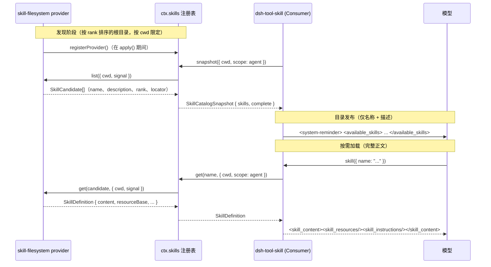

## 问题：不该塞进每次提示词的指令

技能（skill）是一份可复用的、面向具体任务的指令集——一个 Markdown 文档，告诉模型如何完成诸如"审查一个 pull request"或"生成变更日志"这样的工作。一个 harness 里可能装了几十个这样的技能。如果每个技能的完整正文都随系统提示词发给每一次请求，token 成本就会随安装的技能数量线性增长，而不是随当前任务真正相关的技能数量增长；而且树里任何一个技能文件发生变化都会让 KV 缓存前缀失效。

skill 能力用的是大型 API 常用的两级技巧：先发布一份廉价的索引，只在真正需要时才加载昂贵的细节。索引就是会话目录里的 `name` 和 `description` 对。细节就是完整的指令正文，只有当模型判断某个技能确实适用、通过 `skill(name)` 工具调用时才会取回。

## 三个包，三个角色

`skill/` 家族是一个能力接缝（capability seam）：一个 Service Definition，一个内置的 Service Provider，一个 Consumer，外加一个可选的打包 provider。

| 包 | 角色 | `ctx` 键 |
|---|---|---|
| [`dsh-skill`](../../../packages/skill/skill/README.md) | Service Definition——provider 注册表 | `ctx.skills` |
| [`dsh-skill-filesystem`](../../../packages/skill/skill-filesystem/README.md) | Service Provider——从磁盘发现技能 | 注册到 `ctx.skills` |
| [`dsh-skill-badge`](../../../packages/skill/README.md) | Service Provider——一个打包的内置技能 | 注册到 `ctx.skills` |
| [`dsh-tool-skill`](../../../packages/skill/tool-skill/README.md) | Consumer——会话目录 + `skill` 工具 | 注册到 `ctx.tools` |

`dsh-skill` 并不知道某个技能来自本地目录、HTTP 端点，还是插件内嵌的数据——它只负责合并任何注册进来的 provider、解决重名冲突，并把摘要和完整定义暴露出去。这个能力完全位于核心控制主干之外：可以组合零个、一个或多个 provider，而面向模型的约定形态不会因此改变。

## 注册表：`ctx.skills`

`SkillRegistry`（`packages/skill/skill/src/index.ts:357`）暴露四个操作：

```ts
registerProvider(create: (control: SkillProviderControl) => SkillProvider): () => void
register(skill: SkillRegistration): () => void
async list(options: SkillViewOptions = {}): Promise<SkillSummary[]>
async snapshot(options: SkillViewOptions = {}): Promise<SkillCatalogSnapshot>
async get(name: string, options: SkillViewOptions = {}): Promise<SkillDefinition | undefined>
```

`registerProvider` 用于注册同进程内实现了 `SkillProvider` 接口的后端（本地扫描器、远程目录客户端、内嵌数据源）。`register` 是给单个内嵌运行时技能用的捷径，不必写一整个 provider——适合一个插件只想贡献一个固定的技能正文的场景。`list`/`snapshot` 返回与调用方式无关的摘要；`get` 加载某个技能的完整正文。

### 摘要、候选项、定义:三个逐层扩展的形状

```ts
// packages/skill/skill/src/index.ts:56-101
interface SkillSummary {
  readonly name: string
  readonly description: string
  readonly whenToUse?: string
  readonly invocation: SkillInvocationPolicy
  readonly source: SkillSource
  readonly provider: string
  readonly resourceBase?: SkillResourceBase
}

interface SkillCandidate extends SkillSummary {
  readonly rank: number
  readonly locator: unknown       // 不透明；只有胜出的 provider 的 get() 会读取
  readonly path?: string
  readonly metadata?: Readonly<Record<string, unknown>>
}

interface SkillDefinition extends SkillSummary {
  readonly content: string        // 完整的指令正文
  readonly path?: string
  readonly metadata?: Readonly<Record<string, unknown>>
}
```

:::concept{term="SkillSummary"}
每个面向模型或人的消费者在不完整加载的情况下被允许看到的内容:名称、描述、以及已解析的调用策略——绝不包含正文或绝对路径。
:::

:::concept{term="SkillCandidate"}
发现和合并阶段专用的 provider 到注册表的形状;它的 `locator` 是 provider 拥有的不透明状态,会原样传回给同一个 provider 的 `get()`。
:::

:::concept{term="SkillDefinition"}
`skill` 工具最终返回的完整解析结果。
:::

### `SkillProvider` 契约

```ts
// packages/skill/skill/src/index.ts:247-268
interface SkillProvider {
  readonly name: string
  readonly list: (options: SkillLookupOptions) => Promise<readonly SkillCandidate[] | SkillProviderObservation>
  readonly get: (candidate: SkillCandidate, options: SkillLookupOptions) => Promise<SkillDefinition | undefined>
}
```

provider 工厂函数在插件 `apply()` 期间同步运行;任何远程初始化、鉴权或耗时的发现工作都属于被 await 的 `list()` 调用内部,而不是工厂函数本身。`list()` 返回一个普通数组是"完整发现"的简写形式;返回 `{ candidates, complete: false }`(即 `SkillProviderObservation`)则允许 provider 从一次不完整的扫描中回传可用的候选项——比如文件系统遍历中途遇到了瞬时读取错误——而不会让聚合快照变得可缓存或成为面向模型目录的权威结果。

传给工厂函数的 `SkillProviderControl` 是该 provider 的注册作用域生命周期句柄:

```ts
// packages/skill/skill/src/index.ts:270-276
interface SkillProviderControl {
  readonly signal: AbortSignal   // 注册失败或被 dispose 时中止
  readonly invalidate: () => void // 清除已缓存的目录,但仅在这次确切注册仍然存活时生效
}
```

`invalidate()` 的作用域限定很关键:如果一个 provider 被 dispose 后,同名的新 provider 又注册进来,旧注册残留的一次迟到的 invalidate 回调会是一个明确规定的空操作——它不能污染替代者的缓存。`dsh-skill-filesystem` 就是在其 Chokidar 监听回调中、每当有目录相关的文件变化时调用 `invalidate()`。

### 合并顺序:层内按 rank,跨层最近层优先

在同一个注册层内,重名技能按 `rank`(越低越优先)裁决,其次是 provider 的注册顺序,再其次是某个 provider 自身列表内的先后顺序。注册表在缓存候选项之前会校验它们,在返回定义之前也会校验;它还会拒绝过期名称:如果 `get()` 返回的 `SkillDefinition.name` 与选中的候选项不再匹配(文件在发现和加载之间被改名了),注册表会丢弃该结果,并使该确切 provider 失效,以便下一次快照重新发现其当前目录(`packages/skill/skill/src/index.ts:511-516`)。

## 按 scope 分层,与工具注册表同构

`SkillRegistry` 并不是一张扁平的、进程级唯一的表。它持有 `ScopedLayers<SkillLayer>`——与 `ctx.tools` 在 `dsh-scope` 之上建立的宿主加按 scope 分层同一种形态。`registerProvider()` 与 `register()` 落入**调用方上下文 scope** 所对应的层:一个无 scope 的上下文(宿主行、仓库插件)落入全局层;一个由 agent preset 常驻组合挂载的插件落入该 preset 自己的层。provider 名称在每层内唯一,而非进程级唯一——这正是让每个 preset 都能挂载自己的 `local` 文件系统 provider、而不发生名称冲突的前提。

读取通过 `SkillViewOptions` 携带**观察 scope**——调用中的 agent,agent 本身就是自己的 scope key——并将全局层与该 scope 的链合并。优先级规则分两部分:

- **最近层直接赢得重名。** 如果某个 preset 自己的层定义了 `my-skill`,它就会直接遮蔽全局层中同名的技能,句点——rank 比较不会跨越层边界。
- **rank 只在单层内裁决重名。** 下面的 100/200/…/600 rank 表只用来裁决*同一层*内多个 provider 之间的平手。

:::decision
[分层 skill 注册表 Agent Note](../../../.agents/notes/implemented/architecture/2026-08-09-layered-skill-registry.md) 解释了为什么"跨全部可见层的 rank 合池"这一替代方案被否决:rank 的设计前提是各来源彼此知情。在全局池下,一个后安装的仓库插件可能仅凭注册顺序的平手裁决规则,静默地顶掉某个 preset 自带的同名技能,从而在该组合之外远程改变它的行为。我们选择最近层优先,让一个组合的实际技能集由编写该组合的作者决定,而不是由进程中恰好挂载的其他东西决定。
:::

:::fold[促成了这次死锁的设计缘由]
这个设计源自 Agent Note 记录的一次真实死锁:早期版本曾把整个 skill 能力——连同注册表本身——都搬进每个 preset 的隔离 realm,理由是"agent 拥有哪些技能"纯属 agent 平面的决定。这破坏了一个仓库插件的 wrapper,它声明 `inject: ['skills']` 并期望能挂到一个宿主平面的注册表上;由于没有组合宿主注册表,该 wrapper 永远等待。这也意味着一个没有存活 agent 的冷会话完全无处可以回答 UI 的技能列表请求。把"部署供给哪些技能"(宿主注册表、全局层)与"agent 是否消费它们"(该 agent 的组合是否挂载了 `dsh-tool-skill`)拆成两个独立问题,同时解决了这两个问题,并保留了通过 scope 链实现的按 preset 覆盖行为。
:::

发现缓存以解析后的 scope 链加一个修订计数为键,因此一次空会话重组——只重设 agent scope key 的父级、不触碰注册表本身——对下一次读取立即可见。

## 本地文件系统 provider

`FileSystemSkillProvider`(`dsh-skill-filesystem`)是内置的默认 `SkillProvider`。它按固定的 rank 顺序扫描根目录:

| Rank | 来源 | 根目录 |
|---|---|---|
| 100 | `project-dsh` | `<projectRoot>/.dsh/skills` |
| 200 | `project-agents` | `<projectRoot>/.agents/skills` |
| 300 | `custom` | `Config.customSkillDirs` |
| 400 | `user-dsh` | `<dshHome>/skills` |
| 500 | `user-agents` | `<agentsHome>/skills` |
| 600 | `bundled` | 配置了 `Config.bundledSkillDir` 时生效 |

```ts
// packages/skill/skill-filesystem/src/index.ts:241-259
private async roots(cwd: string | undefined): Promise<SkillRoot[]> {
  const roots: SkillRoot[] = []
  if (this.includeDefaultRoots && cwd !== undefined) {
    const projectRoot = await findProjectRoot(resolve(cwd), optionalFileSystem(this.ctx))
    roots.push(
      { path: join(projectRoot, '.dsh/skills'), source: 'project-dsh', rank: PROJECT_DSH_RANK, projectRoot },
      { path: join(projectRoot, '.agents/skills'), source: 'project-agents', rank: PROJECT_AGENTS_RANK, projectRoot },
    )
  }
  roots.push(...this.customSkillDirs.map(path => ({ path, source: 'custom' as const, rank: CUSTOM_RANK })))
  // ... user-dsh、user-agents、bundled
}
```

项目根目录是最近的、包含 `.git` 的祖先目录;若找不到,就直接使用传入的 `cwd`。通过 `ctx.skills.register()` 注册的运行时技能固定处于 rank `250`——低于(即优先级高于)项目根目录(项目可以刻意覆盖一个运行时贡献的技能),但高于(优先级低于)用户根目录。

### 发现格式

一个技能要么是目录 bundle(`<name>/SKILL.md`),要么是扁平的 Markdown 文件(`<name>.md`);嵌套的 `**/SKILL.md` 发现被刻意排除在外——只支持一层深度。名称必须匹配 `^[a-z0-9]+(?:-[a-z0-9]+)*$`。frontmatter 按开放式 YAML 解析;provider 读取必需的 `name`、`description`,以及可选的 `whenToUse`、`metadata`、`disable-model-invocation` 和 `user-invocable`。两个调用控制字段都接受大小写不敏感的布尔写法(`true`/`false`、`yes`/`no`、`on`/`off`、`1`/`0`);省略的字段默认放行对应的调用面,而一个格式错误的值会让*整个技能*从发现中被丢弃并附带警告,而不是悄悄退回到"允许"的默认值——调用策略采取失败即关闭(fail closed)的策略,因为一个错误的默认值可能会把一个本该隐藏的技能暴露出来。

### 无需每次都重新扫描,依然能感知变化

现存的根目录用 Chokidar 监听。provider 会观察 bundle 目录的增删、扁平文件的增删、以及直接的 `SKILL.md` 文件增删改——但 bundle *内部*的文件变化(例如 `references/` 或 `scripts/` 子目录)永远不会使目录失效,因为那些是模型按需加载的资源文件,不是目录成员关系的一部分。启动时尚不存在的根目录会用 `fs.watchFile` 逐段跟踪缺失的路径段,直到 Chokidar 能挂载到真正创建出来的目录为止——所以会话中途第一次创建 `.agents/skills/` 依然能被观察到。第一方的 `write`/`edit` 文件系统工具在其目标可能影响某个被监听条目时,也会同步使 provider 失效,这样模型自己的一次文件编辑无需等待操作系统监听器的往返延迟,在下一步就能被看到。

## Consumer:`dsh-tool-skill`

这个包拥有两样东西:持久化的会话目录消息,以及面向模型的 `skill` 工具。

### 目录:只有名称和描述

在每一次 `agent/pre-step`,该插件都会为当前会话的 cwd 调用 `ctx.skills.snapshot()`,过滤出 `isModelInvocable` 的项,并渲染排好序的 `name`/`description` 对。第一份非空的完整视图会成为一条持久化的 `user` 角色 `<system-reminder>`:

```markdown
<system-reminder>
A skill is a reusable set of task-specific instructions. The following skills are available in this session:

<available_skills>
- `<name>`: <normalized-and-capped-description>
</available_skills>

If the user names a skill, or the task clearly matches a skill's description, call the `skill` tool with the exact skill name before taking task actions. Load all applicable skills, then follow their full instructions. This catalog contains summaries only; do not infer or follow a skill's instructions until it has been loaded.
A user may also invoke a skill directly; its <skill_content> block then appears in this conversation. Follow it, and do not call the `skill` tool again for that skill.
</system-reminder>
```

目录是一次变化检测后的追加,而不是重写。每条消息都携带一个 `skill-catalog` 的 `MessageSource`,精确记录它所发布的 `{ name, description }` 条目;插件对这些持久化条目(而不是渲染出的文字)做摘要,并与会话历史中已存在的最新一条可识别目录消息比对。摘要不变,就不发新消息。摘要变化,就追加一条完整的替换消息——绝不原地修改,因为这个 harness 中的消息历史是只追加的。删光所有技能时会显式追加一条空替换,而不是悄无声息地沉默,这样模型就不会继续沿用过期的名称。`catalogDescriptionMaxLength`(默认 `500`,最小 `3`)限定了每次目录修订中重复发送的描述长度上限。

目录中的描述是唯一一项随技能数量线性增长的、面向提示词的成本。正文、`whenToUse` 提示、来源、provider 都不会出现在目录里——它们在被显式加载之前始终隐藏。

### `skill` 工具:按需加载

```ts
// packages/skill/tool-skill/src/index.ts:81-161
const skillTool = defineTool({
  name: 'skill',
  description: 'Load the full instructions for an available skill. Call this with the exact skill name from the session skill catalog before acting on a task that names or clearly matches that skill.',
  parameters: {
    name: { type: 'string', required: true, description: 'The exact skill name from the available skills list.' },
  },
  // ...
  async execute(args, exec) {
    if (!isSkillName(args.name)) throw new Error(`invalid skill name "${args.name}"`)
    const lookup = { cwd: exec.agent?.session.header.cwd, signal: exec.signal, scope: exec.agent }
    const summary = (await ctx.skills.list(lookup)).find(skill => skill.name === args.name)
    if (!summary) throw new Error(`skill "${args.name}" is unknown or no longer available`)
    if (!isModelInvocable(summary)) throw new Error(`skill "${args.name}" is not available for model invocation`)
    const skill = await ctx.skills.get(args.name, lookup)
    // ... 针对刚加载出来的 definition 再做一次 isModelInvocable 复检
    return { name: skill.name, provider: skill.provider, resourceBase: skill.resourceBase, content: skill.content }
  },
})
```

注意查找选项里的 `scope: exec.agent`——调用中的 agent 就是自己的 scope key,因此工具解析分层注册表时,得到的正是该 agent 自身组合所看到的视图,遵循前文所述的最近层优先规则。工具对 `isModelInvocable` 做了两次复检:一次针对 `list()` 得到的摘要,一次针对 `get()` 重新加载出的 `SkillDefinition`——这堵住了一个技能的调用策略在两次调用之间发生变化的竞态。

一次成功的调用会渲染出一个与下文用户显式注入路径共用的规范结果形状:

```markdown
<skill_content name="<escaped-name>">
<skill_resources>
Base directory for this skill: <path>
Resolve relative paths mentioned by this skill against the base directory before using them. Load referenced resources only as needed.
</skill_resources>

<skill_instructions>
<provider-owned-instruction-body>
</skill_instructions>
</skill_content>
```

`resourceBase` 告诉模型如何解析*已加载的指令自身引用的*相对路径或 URL——本地技能给一个目录,远程技能给一个 URL,否则给一段不透明的描述。关键在于,工具结果从不枚举某个技能目录下的全部内容;脚本、参考资料、资产文件只有在指令明确指向它们时才会被加载。失败时返回三种固定错误字符串之一,分别区分无效名称、无法解析的名称、以及被模型侧禁用的技能。

### 用户显式调用:`/name` 绕过工具调用

在一条被认定为用户消息的文本中,任何被空白包围的 `/name` 记号——由 `SKILL_GESTURE` 匹配——都是一个确定性的加载手势,不依赖模型是否决定调用该工具:

```ts
// packages/skill/tool-skill/src/index.ts:409
const SKILL_GESTURE = /(^|\s)\/([a-z0-9]+(?:-[a-z0-9]+)*)(?=\s|$)/g
```

只有 `source.kind === 'user'` 的消息会被扫描,所以外部或注入的文本永远无法伪造这个手势。如果所命名的技能能够解析并且 `isUserInvocable`,它完整的 `<skill_content>` 渲染结果会作为一条 `instructions` 形式的上下文消息被注入——追加在该步骤所有其他注入之后,紧邻模型接下来必须处理的内容。这是标记为 `disable-model-invocation: true` 的技能*唯一*的入口:这类技能永远不会出现在目录中,`skill` 工具也永远无法加载它,但用户仍可以直接按名调用它。目录结尾那句话("用户也可以直接调用一个技能……")正是为了告诉模型:不要对以这种方式到达的技能重复加载。

## 目录发布 vs. 按需加载,完整流程

:::timeline
- 发现 —— 文件系统 provider 按 rank 排序的根目录、按 cwd 限定进行扫描,并在 `apply()` 期间注册到 `ctx.skills`
- 快照 —— consumer 调用 `ctx.skills.snapshot({ cwd, scope: agent })`,注册表把各 provider 的列表合并成 `SkillCandidate[]`
- 目录发布 —— consumer 渲染一条只携带名称和描述的 `<system-reminder>`
- 按需加载 —— 模型调用 `skill({ name })`;工具通过注册表和 provider 解析 `get(name, { cwd, scope: agent })`
- 完整正文 —— provider 返回 `SkillDefinition`;工具以 `<skill_content><skill_resources/><skill_instructions/></skill_content>` 作答
:::



## 为什么是这个形态

> [!WHY]
> 目录发布与按需加载的拆分,是让"想装多少技能就装多少"不至于变成"每次请求都要为所有技能付费"的机制。分层注册表则是让"部署供给哪些技能"与"某个 agent preset 是否选择使用它们"成为两个可独立组合的决定的机制,呼应了 `ctx.tools` 已经确立的先例。这两个机制回答的是 harness 对每一个能力接缝都会提出的同一个根本问题:什么在部署时变化,什么在组合时变化,模型真正需要看到什么才能行动——把它们当作三件相互独立、可各自演进的事情来对待。
