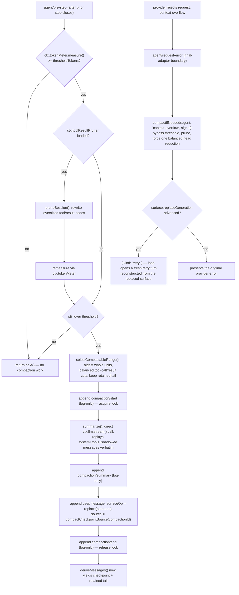

## What compaction protects against

A `Session` is an append-only log of `SessionEvent`s (see [s03](../s03-event-sourced-session/README.md)), and `deriveMessages()` projects the model's conversation history from it. Nothing bounds that history's growth on its own — a long-running agent conversation, especially a tool-heavy ReAct loop, keeps appending `assistant/message` and `tool/result` events until the derived history approaches the provider's context window. Left unchecked, the model eventually truncates mid-response or the provider rejects the request outright.

**Compaction** is the mitigation: replace a run of older history with one concise summary while keeping recent context intact. The mechanism it builds on already exists in the session surface — `surfaceOp: { op: 'replace', start, end }` was purpose-built to shadow a range of surface entries and insert a replacement, citing every source event it removes through `sourceEventSeqs` so replay can validate the substitution. What compaction adds is the policy layer: deciding *when* history is too large and *what* to summarize.

## The seam: Service Definition, Service Provider, companion, Consumer

Compaction ships as a [capability seam](../s07-capability-seams-primer/README.md) — four packages, each owning one role, composing through `ctx.compaction`:

| Package | Role | ctx key |
|---|---|---|
| `@deepseek-ai/dsh-compaction` | Service Definition — abstract `CompactionEngine`, `compaction/*` events, `CompactionResult`, checkpoint-source constructor, tool-pairing boundary helpers | `ctx.compaction` |
| `@deepseek-ai/dsh-compaction-basic` | Service Provider — token-pressure policy, retention, `ctx.llm.stream()` summarization | registers `ctx.compaction` |
| `@deepseek-ai/dsh-compaction-tool-result-pruner` | Optional model-free companion — deterministic head/tail pruning of oversized tool results | `ctx.toolResultPruner` |
| `@deepseek-ai/dsh-command-compact` | Human Consumer — the `/compact` command over `ctx.commands` | registers on `ctx.commands` |

This is the same three-plus-one shape the bash seam uses (`dsh-shell` / `dsh-bash-local` / `dsh-tool-bash`), but with one deliberate deviation: the Service Definition depends on `dsh-session` and `dsh-llm`. The [capability-seam Agent Note](../../../../deepseek-harness/.agents/notes/implemented/feature/2026-06-18-compaction-capability-seam.md) states why this is not a coupling smell — the contract's verbs act on an agent-owned `Session` (`compactRegion(start, end, agent)`) and its output is `ContentBlock[]` vocabulary from `dsh-llm`. There is no way to state "summarize older history into a session-surface node" without naming those two packages. `dsh-session` and `dsh-llm` are themselves interface/vocabulary packages, not implementations, so the seam's real invariant — implementations and consumers evolve independently behind an abstract service — still holds.

### The abstract `CompactionEngine`

`ctx.compaction` is a `Service` (never a bare interface) with three abstract operations, from `packages/compaction/compaction/src/index.ts:96-170`:

```ts
export abstract class CompactionEngine extends Service {
  constructor(ctx: Context) {
    super(ctx, 'compaction')
  }

  abstract compactIfNeeded(
    agent: CompactionAgentContext,
    trigger: CompactionTrigger,
    signal: AbortSignal,
  ): Promise<CompactionResult | null>

  abstract compactNow(
    agent: ManualCompactAgentContext,
    signal: AbortSignal,
    sourceCommandId?: CommandId,
  ): Promise<CompactionResult | null>

  abstract compactRegion(
    start: number,
    end: number,
    agent: CompactionAgentContext,
    signal?: AbortSignal,
  ): Promise<CompactionResult>
}
```

All three are abstract — the interface states *what* compaction does, never *how*. Putting the retention walk, token-summing, and summarization concretely on the base class would recouple every backend to one strategy; a backend that wants different retention or a different event sequence would have to fight inherited code. `compactIfNeeded` is the automatic policy entry point, `compactNow` is the idle-session "compact something useful even below pressure" entry point (what `/compact` calls), and `compactRegion` is the forced explicit-range primitive both of the others build on. Reusable token measurement is deliberately not part of this interface — that's `ctx.tokenMeter`, a separate LLM-family service shared by every pressure-sensitive plugin.

`CompactionTrigger` is a closed union naming *why* automatic policy is asking:

```ts
type CompactionTrigger = 'pressure' | 'context-overflow'
```

`'pressure'` is proactive — the backend measured the current envelope and it crossed a configured threshold. `'context-overflow'` is reactive — the provider has already rejected a request for exceeding its context window, so the backend bypasses normal threshold/retention policy and forces one useful reduction regardless of scalar pressure.

## Compaction is logged, not silent mutation

`SurfaceEventType` is a closed union: only `user/message`, `assistant/message`, and `tool/result` may carry `surfaceOp`. A bespoke `compaction/*` event therefore **cannot** itself join the surface — the compiler and the session's append validation reject `surfaceOp` on anything else. Compaction instead extends `SessionEventMap` with three **log-only** event types via declaration merging (`packages/compaction/compaction/src/types.ts:16-90`), and performs its one surface mutation through an ordinary `user/message`:

| Event | Payload | Role |
|---|---|---|
| `compaction/start` | `{ compactionId, sourceCommandId?, turn }` | log-only — acquires the durable lock; a numeric `turn` identifies the open automatic turn, `null` identifies a standalone manual attempt |
| `compaction/summary` | `{ compactionId, summary, rawOutput?, llmStreamCall?, shadowedRange, shadowedSeqs, shadowedTokenCount, provider, model, maxTokens?, usage? }` | log-only — the safe text summary, optional complete provider output, the shadowed surface-position span and seqs, the estimated token count, and the exact call envelope |
| `compaction/end` | `{ compactionId, turn, error? }` | log-only — releases the lock with the same owner; `error` records an unsuccessful attempt without a separate `compaction/error` event |

A successful compaction lands five events in order:

```
compaction/start    → log-only. Acquires the lock.
[summarize older range through the backend]
compaction/summary  → log-only. Records the raw summary, range, shadowed seqs, token count.
user/message        → THE surface mutation: source = compactCheckpointSource(compactionId),
                       surfaceOp = { op: 'replace', start, end }, content = framed summary.
compaction/end       → log-only. Releases the lock.
```

Two things follow directly from "model-visible means logged" (the harness's core session-log invariant): the summary text itself lives on `compaction/summary` for full-fidelity replay, and the *only* thing the model ever actually sees is the replacement `user/message` — a summary genuinely is user-role context, so reusing `user/message` rather than inventing a fifth event type is deliberate honesty about what the checkpoint is, not a workaround. `deriveMessages()` renders it exactly like any other surface node; the shadowed raw events remain in the log underneath, so replay is deterministic and a human transcript reading append-origin events can still show what actually happened.

The surface mutation sits **inside** the lock bracket — `compaction/end` is the last event appended, not the first. This ordering converts a crash mid-summarization from silent corruption into a *detectable orphan*: a `compaction/start` with no matching `compaction/end`. A live unmatched start (one after the newest `session/end-seed`) blocks every compaction entry point; an unmatched start from before that boundary is stale evidence from a prior process lifecycle and does not block a resumed or forked session.



## `compaction-basic`: the token-pressure backend

`BasicCompactionEngine` (`packages/compaction/compaction-basic/src/index.ts:103-431`) is the concrete `CompactionEngine` implementation shipped by default. It injects `['llm', 'tokenMeter', 'sessions']` and owns every policy decision the abstract interface deliberately left open: measurement, routed policy, model-free pruning, retention, convergence, summarization, framing, lifecycle, and overflow recovery.

### Measurement and routed policy

Pressure checking asks the singleton `ctx.tokenMeter` to price "the canonical logged envelope and current surface at one consumed-log revision" — the same replay-based accounting every pressure-sensitive plugin shares, so compaction never invents its own token model. Automatic pressure resolves capacity from the adapter that owns the *latest durable routed request* — a headerless session (no completed routed request yet) produces no pressure work at all; `compaction-basic` deliberately does not fall back to `AgentOptions.model` for this decision, because automatic policy must describe a completed logged request, not a speculative one.

### When pressure fires: after a call, not before it

Pressure runs at `agent/pre-step` — a serial waterfall extension point that fires after the *previous* step's assistant output, tool results, buffered context, and steering are already durable, and before the *next* request is derived. The [after-call recovery Agent Note](../../../../deepseek-harness/.agents/notes/implemented/architecture/2026-07-10-after-call-compaction-pressure-and-overflow-recovery.md) explains why this boundary and not an earlier one: `agent/pre-step` observes a completed successful call, while an earlier hook like `agent/request` still sees a provisional request whose routing and tool schemas haven't been frozen yet. Checking after every successful step — not once per turn — is load-bearing for a tool-heavy ReAct turn: such a turn appends an `assistant/message` + `tool/result` pair per step, so the surface grows *within* one turn, and the next pre-step check can compact early closed tool pairs before continuation opens another step.

```ts
// packages/compaction/compaction-basic/src/index.ts:147-165
ctx.on('agent/pre-step', async ({ agent, signal }, next): Promise<PreStepDecision> => {
  if (!signal.aborted) {
    try {
      const result = await this.compactIfNeeded(agent, 'pressure', signal)
      if (result !== null) logResult(result, 'step pressure')
    } catch (error: unknown) {
      // TargetPressureConfigError warns once per target and continues;
      // other operational failures also warn and continue the turn.
    }
  }
  return next()
})
```

Note the failure posture: an operational pressure failure warns and calls `next()` — it never rejects the step. Compaction is maintenance, not a gate the conversation must pass.

### Context overflow: the reactive backstop

A provider can reject a request for exceeding its context window *before* it returns usage, so successful-call pressure alone is not a complete story. `agent/request-error` — a waterfall firing only for terminal failures at the final adapter boundary, after the failed step has already closed — is where `compaction-basic` handles `CONTEXT_WINDOW_EXCEEDED_CODE`:

```ts
// packages/compaction/compaction-basic/src/index.ts:179-223 (abridged)
ctx.on('agent/request-error', async ({ agent, failure, signal }, next) => {
  if (failure.code !== CONTEXT_WINDOW_EXCEEDED_CODE || signal.aborted) return next()
  const generation = agent.session.surface.replaceGeneration
  const result = await this.compactIfNeeded(agent, 'context-overflow', signal)
  if (agent.session.surface.replaceGeneration <= generation) return next()
  return { kind: 'retry' }
})
```

Retry is authorized only by `session.surface.replaceGeneration` actually advancing — never by `compactIfNeeded` merely returning non-null. A custom backend could report success without changing model-visible state; the generation counter is the one thing that can't lie about whether the surface actually shrank. This holds even when the optional pruner alone advances the generation and later summarization work throws — that durable prune progress is still sufficient proof to retry. Cancellation always wins regardless. With no later recovery, the loop reports the *original* provider error object and code, unmodified.

### Retention: turn-agnostic, tool-pairing balanced

`selectCompactableRange()` (`packages/compaction/compaction-basic/src/region.ts:98-134`) walks the priced surface from the tail backward, accumulating tokens until it reaches the configured retained-tail budget, then walks forward from that cut point until `toolPairingBalancedBefore()` confirms the boundary doesn't split an assistant tool call from its result:

```ts
// packages/compaction/compaction-basic/src/region.ts:112-133 (abridged)
let accumulated = 0
let keepFromIdx = pricedNodes.length
for (let index = pricedNodes.length - 1; index >= 0; index -= 1) {
  accumulated += pricedNodes[index]!.tokens
  keepFromIdx = index
  if (accumulated >= retainTokens) break
}
while (keepFromIdx > 0) {
  if (toolPairingBalancedBefore(session, surfaceNodes[keepFromIdx]!)) break
  keepFromIdx -= 1
}
return { start: surfaceNodes[0]!, end: surfaceNodes[keepFromIdx - 1]! }
```

A "unit" here is a complete closed step or one no-step message — never a whole turn. Turn boundaries do not protect old steps inside a runaway turn from compaction; only tool-call/result pairing is a hard structural guard. `toolPairingBalancedBefore`/`After` are exported from the Service Definition package precisely so both `compaction-basic` and any future backend share one edge-checking implementation rather than each reimplementing it. An indivisible open tail step (tool calls with no results yet) makes selection return `null` — compaction declines and retries once that step closes.

### Summarization: a genuine prefix of the last request, not a side quest

`summarize()` is the **sole subclass hook** — everything else on `BasicCompactionEngine` is fixed so every pricing decision routes through the same token meter. The default implementation, `summarizeWithLlm()` (`packages/compaction/compaction-basic/src/summarizer.ts:121-182`), makes a direct one-shot `ctx.llm.stream()` call — not a loop step, not `agent/request` — that replays the shadowed region's own system prompt, tool schemas, and messages verbatim, then appends the compaction instruction as the trailing user message:

```ts
// packages/compaction/compaction-basic/src/summarizer.ts:145-164 (abridged)
const messages: Message[] = [
  ...input.messages,
  createUserMessage({ content: [{ type: 'text', text: COMPACTION_INSTRUCTION }], ... }),
]
const options: GenerateOptions = {
  provider: target.provider, model: target.model, messages,
  ...input.system, ...input.tools,
  maxTokens: config.maxTokens,
  sessionId: agent.session.id,
  purpose: 'compaction',
}
for await (const chunk of ctx.llm.stream(options)) assembler.push(chunk)
```

Replaying the conversation's own prefix rather than composing a fresh minimal prompt is deliberate: it makes the auxiliary call a genuine prefix of the last routed request, so the provider's warm KV-cache prefix is reused instead of invalidated — only the trailing instruction and the summary output are new tokens on the wire. `GenerateOptions.purpose: 'compaction'` is a provider-neutral discriminant adapters may map to transport metadata (the DeepSeek adapter sends `x-deepseek-harness-compact: 1`) without it touching the model-visible request body. Only returned *text* enters the checkpoint — reasoning and tool calls are excluded so the summarizer can't leak private reasoning or fabricate an orphaned tool call, and image output fails closed with `UNSUPPORTED_CONTENT` rather than silently disappearing.

The result carries `llmStreamCall: true` only when it consumed exactly one call through *this* context's `ctx.llm.stream()` — a subclass overriding `summarize()` with a template or remote summarizer must not set that marker, since unmarked `rawOutput` doesn't identify the call path the same way.

### Framing and the shared transaction

The replacement `user/message` wraps the raw summary in `<compacted-summary>` tags with a preamble telling the model to treat it as established background without acknowledging it. The raw, unframed summary stays on `compaction/summary` for inspection; framing is backend policy, not part of the seam's contract.

Every entry point — automatic pressure, overflow recovery, and `compactRegion` — funnels through one shared transaction, `compactSurfaceRegion()` (`packages/compaction/compaction-basic/src/region.ts:152-254`): validate the range and the durable lock, append `compaction/start` synchronously *before* any async work, prepare and await summarization, revalidate stability, commit `compaction/summary` plus the replacement, and make exactly one closing attempt. Manual calls (`compactNow`, behind `/compact`) reserve idle admission first, use `turn: null`, only require the *selected span* to remain stable (append-only context injected elsewhere during the wait is fine), and flush every closed attempt — successful or not — before releasing admission.

### Configuration

`BasicCompactionConfig` — every field optional, validated at plugin load:

| Key | Default | Meaning |
|---|---|---|
| `thresholdRatio` | `0.8` | Compact at `floor(routedContextWindow × ratio)`. |
| `retainRatio` | `0.16` | Recent tail kept verbatim, as a fraction of the window; mutually exclusive with `retainTokens`. |
| `retainTokens` | — | Absolute recent-tail budget; must be below the resolved threshold. |
| `summarizationProvider` / `summarizationModel` | `''` / `''` | Explicit summarizer target; empty resolves to the latest logged route, then `AgentOptions`. |
| `maxTokens` | `8192` | Provider generation cap for the summarization call. |
| `compactionRetries` | `1` | Extra head-checkpoint attempts if pressure remains above threshold. |
| `maxOverflowRetries` | `1` | Cap on overflow-recovery retries; `0` disables recovery only. |
| `modelPolicies` | `[]` | Exact `{ provider, model, ...partialPolicy }` overrides. |
| `auto` | `true` | Register the pressure and overflow listeners at all. |

## The optional pruner: cheaper relief before summarization

`ctx.toolResultPruner` (`dsh-compaction-tool-result-pruner`) is a concrete, independently composable companion — not a second `CompactionEngine` implementation. `compaction-basic` reads it through optional `ctx.get('toolResultPruner')`, so either package works without the other. Once pressure or overflow qualifies, `compaction-basic` calls `pruneSession()` *before* selecting a summary range: it rewrites every over-budget `tool/result` surface node to a bounded head, a fixed omission marker, and a bounded tail, replacing content only — `turn`, `step`, `callId`, and error fields are all preserved on the replacement. Each replacement is a single-node `surfaceOp: { op: 'replace' }`, identical in kind to the summary replacement, just with a different scope (one tool result instead of a whole range). If pruning alone brings the remeasured pressure back under threshold, `compaction-basic` skips the summarization call entirely — real token savings with zero model calls.

## The human path: `/compact`

`dsh-command-compact` registers one argument-free `/compact` command through `ctx.commands`, calling the backend-independent `compactNow(agent, signal)`. It maps the closed `ManualCompactionErrorCode` set (`busy | changed | summary | commit | persistence`, plus separate `cancelled`) to stable direct results — for example `busy` becomes "Compaction is unavailable because this process has an active compaction, or the agent is not idle." The command lifecycle itself (`command/run` / `command/done`) is log-only and never enters model history; only an *accepted* compaction's checkpoint reaches the model. `command/done.sourceEventSeq` names the transaction's `compaction/summary` event so a UI can fold the command result into the checkpoint presentation without parsing text.

Because `compactNow` requires the agent to be idle, `/compact` intentionally reports `busy` rather than queuing itself — a prompt already accepted before the command keeps right of way, and a prompt submitted *during* compaction keeps its own FIFO identity and starts only after compaction's durability checkpoint lands.

## Model Experience summary

**What the model sees**: nothing changes about a normal request until a checkpoint lands. After that, an older span is gone from derived history, replaced by one user-role `<compacted-summary>` message, followed by the retained recent tail.

**Token effect**: pruning alone can avoid the auxiliary summarization call entirely. When summarization does run, it costs one separate request (replayed prefix + fixed instruction, `maxTokens`-capped output) that can be paid more than once under `compactionRetries`. The net effect on *future* requests is a large reduction — many retained history tokens traded for one summary.

**KV-cache effect**: a landed replacement invalidates provider cache reuse from the first shadowed history token onward — this is unavoidable, since the whole point is that the shadowed content is gone. The summarization call itself is designed to *reuse* cache up to its own trailing instruction, by replaying the conversation's exact prefix rather than composing a fresh prompt.

## Known limits

Some overflow is structurally out of compaction's reach: a single indivisible unit (a huge pasted `user/message`, or a tool unit whose non-prunable remainder alone exceeds the window) cannot be split by balanced summary compaction, and an envelope that alone approaches the window — the system prompt, tool schemas, or session prefix — is never something surface compaction touches; only derived history shrinks. `/compact` exposes no range or policy arguments; explicit ranges remain the programmatic `compactRegion()` path. There is no model-facing compaction tool — compaction is either automatic policy or direct human command, never something the model can request as a task action.
