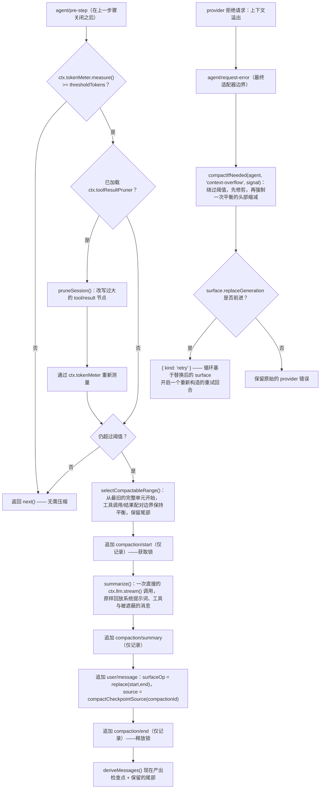

## 压缩要防止什么

`Session` 是一条只追加的 `SessionEvent` 日志（参见 [s03](../s03-event-sourced-session/README.zh.md)），`deriveMessages()` 从中投影出模型的对话历史。这条历史的增长没有任何天然上限——一次长时间运行的 agent 对话，尤其是工具密集的 ReAct 循环，会不断追加 `assistant/message` 和 `tool/result` 事件，直到派生出的历史逼近 provider 的上下文窗口。如果放任不管，模型最终会在响应中途被截断，或者 provider 直接拒绝这次请求。

**压缩（compaction）**就是应对这个问题的机制：用一段简洁的摘要替换较早的一段历史,同时保留近期上下文不变。它所依赖的底层机制早已存在于 session surface 之中——`surfaceOp: { op: 'replace', start, end }` 正是为了遮蔽一段 surface 条目并插入替换内容而设计的，它通过 `sourceEventSeqs` 引用每一个被移除的源事件，使重放能够校验这次替换的合法性。压缩真正新增的是策略层：判断*何时*历史过大，以及*该摘要什么*。

## 这个 seam：Service Definition、Service Provider、配套组件、Consumer

压缩以[能力 seam](../s07-capability-seams-primer/README.zh.md)的形式发布——四个包，各自承担一个角色，通过 `ctx.compaction` 组合在一起：

| 包 | 角色 | ctx key |
|---|---|---|
| `@deepseek-ai/dsh-compaction` | Service Definition —— 抽象的 `CompactionEngine`、`compaction/*` 事件、`CompactionResult`、检查点来源构造函数、工具配对边界辅助函数 | `ctx.compaction` |
| `@deepseek-ai/dsh-compaction-basic` | Service Provider —— token 压力策略、保留策略、`ctx.llm.stream()` 摘要 | 注册 `ctx.compaction` |
| `@deepseek-ai/dsh-compaction-tool-result-pruner` | 可选的无模型配套组件 —— 对过大工具结果做确定性的首尾修剪 | `ctx.toolResultPruner` |
| `@deepseek-ai/dsh-command-compact` | 用户 Consumer —— `ctx.commands` 上的 `/compact` 命令 | 注册到 `ctx.commands` |

这与 bash seam（`dsh-shell` / `dsh-bash-local` / `dsh-tool-bash`）使用的三加一结构相同，但有一处刻意的偏离：这个 Service Definition 依赖 `dsh-session` 和 `dsh-llm`。[压缩能力 seam Agent Note](../../../../deepseek-harness/.agents/notes/implemented/feature/2026-06-18-compaction-capability-seam.md) 解释了这为何不是耦合上的问题——这份契约的动词作用于一个由 agent 拥有的 `Session`（`compactRegion(start, end, agent)`），其输出是来自 `dsh-llm` 的 `ContentBlock[]` 词汇。不命名这两个包，就无法表述"把较早的历史摘要为一个 session surface 节点"这件事。`dsh-session` 和 `dsh-llm` 本身是接口/词汇包，而非具体实现，所以这个 seam 真正的不变式——实现方与消费方各自独立演进——依然成立。

### 抽象的 `CompactionEngine`

`ctx.compaction` 是一个 `Service`（绝不是裸接口），有三个抽象操作，出自 `packages/compaction/compaction/src/index.ts:96-170`：

```ts
export abstract class CompactionEngine extends Service {
  constructor(ctx: Context) {
    super(ctx, 'compaction')
  }

  abstract compactIfNeeded(
    agent: CompactionAgentContext,
    trigger: CompactionTrigger,
    signal: AbortSignal,
  ): Promise<CompactionResult | null>

  abstract compactNow(
    agent: ManualCompactAgentContext,
    signal: AbortSignal,
    sourceCommandId?: CommandId,
  ): Promise<CompactionResult | null>

  abstract compactRegion(
    start: number,
    end: number,
    agent: CompactionAgentContext,
    signal?: AbortSignal,
  ): Promise<CompactionResult>
}
```

三个操作全是抽象的——接口只陈述压缩做*什么*，绝不规定*怎么做*。如果把保留区间的选取、token 累加、摘要生成具体写在基类上，就会把每个后端都绑死在同一种策略上；一个想要不同保留策略或不同事件顺序的后端，将不得不与继承下来的具体代码搏斗。`compactIfNeeded` 是自动策略的入口，`compactNow` 是"即使还未达到压力阈值,也主动压缩点有用的东西"这一空闲会话入口（`/compact` 调用的就是它），`compactRegion` 则是前两者都建立在其上的、强制指定范围的原语。可复用的 token 测量被刻意排除在这个接口之外——那是 `ctx.tokenMeter`，一个由所有压力敏感插件共享的独立 LLM 家族服务。

`CompactionTrigger` 是一个封闭联合类型，说明自动策略*为何*在询问：

```ts
type CompactionTrigger = 'pressure' | 'context-overflow'
```

`'pressure'` 是主动式的——后端测量了当前的信封大小，发现它越过了配置的阈值。`'context-overflow'` 是被动式的——provider 已经因超出其上下文窗口而拒绝了一次请求，因此后端绕过正常的阈值/保留策略，强制执行一次有效的缩减，不再考虑标量压力。

## 压缩是被记录的，而不是静默的变更

`SurfaceEventType` 是一个封闭联合：只有 `user/message`、`assistant/message` 和 `tool/result` 可以携带 `surfaceOp`。因此一个专属的 `compaction/*` 事件**不能**自己加入 surface——编译器和 session 的追加校验会拒绝在其他任何事件上出现 `surfaceOp`。压缩转而通过声明合并给 `SessionEventMap` 扩展了三个**仅记录（log-only）**的事件类型（`packages/compaction/compaction/src/types.ts:16-90`），并用一条普通的 `user/message` 来完成它唯一的一次 surface 变更：

| 事件 | 载荷 | 作用 |
|---|---|---|
| `compaction/start` | `{ compactionId, sourceCommandId?, turn }` | 仅记录——获取持久锁；数字 `turn` 标识当前开启的自动化回合，`null` 标识一次独立的手动尝试 |
| `compaction/summary` | `{ compactionId, summary, rawOutput?, llmStreamCall?, shadowedRange, shadowedSeqs, shadowedTokenCount, provider, model, maxTokens?, usage? }` | 仅记录——安全的文本摘要、可选的完整 provider 输出、被遮蔽的 surface 位置区间与 seq 列表、估算的 token 数，以及确切的调用信封 |
| `compaction/end` | `{ compactionId, turn, error? }` | 仅记录——用同一个 owner 释放锁；`error` 记录一次失败的尝试，无需单独的 `compaction/error` 事件 |

一次成功的压缩会依次落下五个事件：

```
compaction/start    → 仅记录。获取锁。
[通过后端摘要较早的范围]
compaction/summary  → 仅记录。记录原始摘要、范围、被遮蔽的 seq、token 数。
user/message        → 唯一的 surface 变更：source = compactCheckpointSource(compactionId)，
                       surfaceOp = { op: 'replace', start, end }，content = 经过包装的摘要。
compaction/end       → 仅记录。释放锁。
```

这里有两点直接来自 harness 的核心 session 日志不变式"模型可见即已记录"：摘要文本本身留在 `compaction/summary` 上以支持完整重放，而模型*实际唯一*能看到的是那条替换用的 `user/message`——一段摘要本质上就是 user 角色的上下文，所以复用 `user/message` 而不是发明第五种事件类型，是对检查点本质的坦诚表述，而不是一种变通做法。`deriveMessages()` 会像渲染其他任何 surface 节点一样渲染它；被遮蔽的原始事件仍留在底层日志中，因此重放是确定性的，读取 append-origin 事件的人类可读事务日志仍能还原实际发生的一切。

这次 surface 变更位于锁的括号**内部**——`compaction/end` 是最后追加的事件，而不是第一个。这个顺序把一次摘要过程中的崩溃从静默损坏变成了一个*可检测的孤儿*：一个没有对应 `compaction/end` 的 `compaction/start`。一个存活的未匹配 start（出现在最新的 `session/end-seed` 之后）会阻塞每一个压缩入口点；一个出现在该边界之前的未匹配 start 则是上一个进程生命周期遗留的陈旧证据，不会阻塞一个恢复或 fork 出的会话。



## `compaction-basic`：token 压力后端

`BasicCompactionEngine`（`packages/compaction/compaction-basic/src/index.ts:103-431`）是默认发布的具体 `CompactionEngine` 实现。它注入 `['llm', 'tokenMeter', 'sessions']`，并拥有抽象接口刻意留白的每一项策略决定：测量、路由策略、无模型修剪、保留策略、收敛、摘要、包装、生命周期,以及溢出恢复。

### 测量与路由策略

压力检查向单例 `ctx.tokenMeter` 请求"在一次已消费的日志版本上，对当前的信封与 surface 进行定价"——这是每个压力敏感插件共享的同一套基于重放的计量方式，压缩自己不会另造一套 token 模型。自动压力从*最新的持久化路由请求*所属的 adapter 那里解析容量——一个无请求头的 session（尚无已完成的路由请求）不会产生任何压力检查工作；`compaction-basic` 刻意不为这个决定回退到 `AgentOptions.model`，因为自动策略必须描述一个已完成的、被记录的请求，而不是一个推测性的请求。

### 压力何时触发：调用之后，而非之前

压力检查运行在 `agent/pre-step`——这是一个串行瀑布式扩展点，在*上一步*的助手输出、工具结果、缓冲上下文与引导信息都已持久化之后，*下一次*请求被构造之前触发。[调用后恢复 Agent Note](../../../../deepseek-harness/.agents/notes/implemented/architecture/2026-07-10-after-call-compaction-pressure-and-overflow-recovery.md) 解释了为什么选在这个边界而非更早的位置：`agent/pre-step` 观察到的是一次已完成的成功调用,而像 `agent/request` 这样更早的钩子看到的仍是一个尚未冻结路由与工具 schema 的临时请求。在*每一次*成功的步骤之后检查，而不是每个回合检查一次，这一点对失控回合的存活能力至关重要：一个工具密集的 ReAct 回合会在每一步追加一对 `assistant/message` + `tool/result`，因此 surface 会在*同一个回合内*不断增长，下一次 pre-step 检查就能在继续开启新的一步之前压缩早期已经关闭的工具配对。

```ts
// packages/compaction/compaction-basic/src/index.ts:147-165
ctx.on('agent/pre-step', async ({ agent, signal }, next): Promise<PreStepDecision> => {
  if (!signal.aborted) {
    try {
      const result = await this.compactIfNeeded(agent, 'pressure', signal)
      if (result !== null) logResult(result, 'step pressure')
    } catch (error: unknown) {
      // TargetPressureConfigError 对每个 target 只警告一次并继续；
      // 其他操作性失败同样警告后继续。
    }
  }
  return next()
})
```

注意这里的失败姿态：一次操作性的压力检查失败只会警告并调用 `next()`——它永远不会拒绝这一步。压缩是维护性工作，而不是对话必须通过的关卡。

### 上下文溢出：被动兜底

Provider 可能在返回 usage 之*前*就因超出其上下文窗口而拒绝一次请求，所以仅靠成功调用后的压力检查并不完整。`agent/request-error`——一个只在最终适配器边界的终止性失败、且失败步骤已经关闭之后才触发的瀑布式钩子——正是 `compaction-basic` 处理 `CONTEXT_WINDOW_EXCEEDED_CODE` 的地方：

```ts
// packages/compaction/compaction-basic/src/index.ts:179-223（节选）
ctx.on('agent/request-error', async ({ agent, failure, signal }, next) => {
  if (failure.code !== CONTEXT_WINDOW_EXCEEDED_CODE || signal.aborted) return next()
  const generation = agent.session.surface.replaceGeneration
  const result = await this.compactIfNeeded(agent, 'context-overflow', signal)
  if (agent.session.surface.replaceGeneration <= generation) return next()
  return { kind: 'retry' }
})
```

重试的授权只依据 `session.surface.replaceGeneration` 是否*实际前进*——绝不依据 `compactIfNeeded` 是否返回了非空结果。一个自定义后端可能在模型可见状态未发生变化的情况下报告成功；这个世代计数器是唯一不会在"surface 是否真的缩小了"这件事上撒谎的凭据。即使仅仅是可选的修剪器让世代前进、而后续的摘要工作抛出了异常，这份持久的修剪进展依然是足够的重试凭证。取消操作永远优先。如果没有后续的恢复，循环会原样报告*最初*的 provider 错误对象与错误码。

### 保留策略：与回合无关，工具配对是唯一的结构性约束

`selectCompactableRange()`（`packages/compaction/compaction-basic/src/region.ts:98-134`）从尾部向前遍历已定价的 surface，累加 token 直到达到配置的保留尾部预算，然后从这个切点向前走，直到 `toolPairingBalancedBefore()` 确认这个边界不会把一次助手工具调用与它的结果拆开：

```ts
// packages/compaction/compaction-basic/src/region.ts:112-133（节选）
let accumulated = 0
let keepFromIdx = pricedNodes.length
for (let index = pricedNodes.length - 1; index >= 0; index -= 1) {
  accumulated += pricedNodes[index]!.tokens
  keepFromIdx = index
  if (accumulated >= retainTokens) break
}
while (keepFromIdx > 0) {
  if (toolPairingBalancedBefore(session, surfaceNodes[keepFromIdx]!)) break
  keepFromIdx -= 1
}
return { start: surfaceNodes[0]!, end: surfaceNodes[keepFromIdx - 1]! }
```

这里的"单元"是一个完整的已关闭步骤,或者一条无步骤消息——绝不是整个回合。回合边界并不能保护一个失控回合内部的旧步骤不被压缩；只有工具调用/结果配对是一条硬性的结构约束。`toolPairingBalancedBefore`/`After` 之所以从 Service Definition 包中导出，正是为了让 `compaction-basic` 与未来任何后端共享同一份边界检查实现，而不必各自重新实现一遍。一个不可分割的、仍处于开启状态的尾部步骤（工具调用尚无结果）会让选择结果返回 `null`——压缩就此放弃，等到那一步关闭后再重试。

### 摘要：这是上一次请求的真实前缀，而不是一次独立支线

`summarize()` 是**唯一的子类钩子**——`BasicCompactionEngine` 上其余的一切都是固定的，使每一个定价决策都经由同一个 token 计量器。默认实现 `summarizeWithLlm()`（`packages/compaction/compaction-basic/src/summarizer.ts:121-182`）发起一次直接的一次性 `ctx.llm.stream()` 调用——不是循环中的一步，也不是 `agent/request`——它原样回放被遮蔽区域自己的系统提示词、工具 schema 与消息,然后把压缩指令作为最后一条 user 消息追加进去：

```ts
// packages/compaction/compaction-basic/src/summarizer.ts:145-164（节选）
const messages: Message[] = [
  ...input.messages,
  createUserMessage({ content: [{ type: 'text', text: COMPACTION_INSTRUCTION }], ... }),
]
const options: GenerateOptions = {
  provider: target.provider, model: target.model, messages,
  ...input.system, ...input.tools,
  maxTokens: config.maxTokens,
  sessionId: agent.session.id,
  purpose: 'compaction',
}
for await (const chunk of ctx.llm.stream(options)) assembler.push(chunk)
```

回放对话自己的前缀,而不是重新组装一份最小化的新提示词，是刻意的设计：这让这次辅助调用成为上一次路由请求的真实前缀，使 provider 温热的 KV Cache 前缀得以复用而不是失效——网络上真正新增的只有末尾的指令和摘要输出。`GenerateOptions.purpose: 'compaction'` 是一个 provider 中立的判别字段,adapter 可以把它映射为传输层元数据（DeepSeek adapter 会发送 `x-deepseek-harness-compact: 1`），而不触碰模型可见的请求体。只有返回的*文本*会进入检查点——推理内容和工具调用被排除在外，这样摘要器就不会泄露私有推理内容,也不会伪造一个孤立的工具调用；图像输出则会以 `UNSUPPORTED_CONTENT` 明确失败，而不是被悄悄丢弃。

只有当结果确实经由*这个* context 的 `ctx.llm.stream()` 恰好消费了一次调用时，返回结果才会携带 `llmStreamCall: true`——如果子类用模板或远程摘要器覆盖 `summarize()`，就不应设置这个标记，因为未标记的 `rawOutput` 无法以同样的方式确认调用路径。

### 包装与共享事务

替换用的 `user/message` 会用 `<compacted-summary>` 标签包装原始摘要，并附带一段前言,告诉模型把它当作已确立的背景信息、无需再提及它。未经包装的原始摘要仍留在 `compaction/summary` 上供检查；包装是后端策略，不属于这个 seam 的契约本身。

每一个入口点——自动压力、溢出恢复、以及 `compactRegion`——都汇入同一个共享事务，`compactSurfaceRegion()`（`packages/compaction/compaction-basic/src/region.ts:152-254`）：校验范围与持久锁、在任何异步工作*之前*同步追加 `compaction/start`、准备并等待摘要完成、重新校验稳定性、提交 `compaction/summary` 及替换内容，并且只进行一次关闭尝试。手动调用（`compactNow`，也就是 `/compact` 背后的实现）先预留空闲准入权、使用 `turn: null`、只要求*被选中的范围*保持稳定（在等待期间被注入到别处的追加式上下文不受影响），并在释放准入权之前刷新每一次已关闭的尝试——无论成功与否。

### 配置项

`BasicCompactionConfig`——每个字段都是可选的，在插件加载时完成校验：

| Key | 默认值 | 含义 |
|---|---|---|
| `thresholdRatio` | `0.8` | 在 `floor(routedContextWindow × ratio)` 处触发压缩。 |
| `retainRatio` | `0.16` | 原样保留的近期尾部,占窗口大小的比例；与 `retainTokens` 互斥。 |
| `retainTokens` | — | 绝对值的近期尾部预算；必须小于解析出的阈值。 |
| `summarizationProvider` / `summarizationModel` | `''` / `''` | 显式摘要目标；为空时依次回退到最新已记录的路由，再回退到 `AgentOptions`。 |
| `maxTokens` | `8192` | 摘要调用的 provider 生成上限。 |
| `compactionRetries` | `1` | 压力仍高于阈值时,额外的头部检查点尝试次数。 |
| `maxOverflowRetries` | `1` | 溢出恢复重试次数上限；`0` 仅禁用恢复。 |
| `modelPolicies` | `[]` | 针对确切 `{ provider, model, ...partialPolicy }` 的覆盖项。 |
| `auto` | `true` | 是否注册压力与溢出监听器。 |

## 可选的修剪器：在摘要之前提供更廉价的缓解

`ctx.toolResultPruner`（`dsh-compaction-tool-result-pruner`）是一个具体的、可独立组合的配套组件——不是第二个 `CompactionEngine` 实现。`compaction-basic` 通过可选的 `ctx.get('toolResultPruner')` 读取它，因此这两个包互不依赖对方也能各自工作。一旦压力或溢出条件满足，`compaction-basic` 会在选取摘要范围*之前*调用 `pruneSession()`：它把每一个超出预算的 `tool/result` surface 节点改写为一段有限长度的开头、一个固定的省略标记，以及一段有限长度的结尾，只替换 content 本身——`turn`、`step`、`callId` 与错误字段都会保留在替换节点上。每次替换都是一次单节点的 `surfaceOp: { op: 'replace' }`，与摘要替换在种类上完全相同，只是作用范围不同（单个工具结果,而非一整段范围）。如果单靠修剪就能让重新测量的压力回落到阈值以下，`compaction-basic` 会完全跳过摘要调用——零模型调用即可换来真实的 token 节省。

## 人工路径：`/compact`

`dsh-command-compact` 通过 `ctx.commands` 注册一个无参数的 `/compact` 命令，调用与后端无关的 `compactNow(agent, signal)`。它把封闭的 `ManualCompactionErrorCode` 集合（`busy | changed | summary | commit | persistence`，外加单独的 `cancelled`）映射为稳定的直接结果——例如 `busy` 会变成"Compaction is unavailable because this process has an active compaction, or the agent is not idle."。命令自身的生命周期（`command/run` / `command/done`）是仅记录的，永远不会进入模型历史；只有一次*被接受*的压缩产生的检查点才会到达模型。`command/done.sourceEventSeq` 指名了这次事务的 `compaction/summary` 事件，使 UI 能够把命令结果折叠进检查点的呈现中，而无需解析文本。

由于 `compactNow` 要求 agent 处于空闲状态，`/compact` 会刻意报告 `busy` 而不是把自己排队——一个在命令之前已被接受的提示词保有优先权，而一个在压缩*进行期间*提交的提示词会保留自己的 FIFO 身份，只有等压缩的持久化检查点落地之后才会开始。

## Model Experience 摘要

**模型看到什么**：在检查点落地之前，一次普通请求什么都不会改变。落地之后，一段较早的历史从派生历史中消失，替换为一条 user 角色的 `<compacted-summary>` 消息，随后是被保留的近期尾部。

**Token 影响**：单靠修剪就可能完全避免辅助摘要调用。当摘要确实运行时，它会花费一次独立的请求（回放的前缀 + 固定指令,输出上限为 `maxTokens`），在 `compactionRetries` 机制下可能被多次支付。对*未来*请求而言，净效应是大幅缩减——用大量保留的历史 token 换取一份摘要。

**KV Cache 影响**：一次落地的替换会使 provider 的缓存复用从第一个被遮蔽的历史 token 开始失效——这是无法避免的，因为压缩的全部意义就在于让被遮蔽的内容消失。摘要调用本身则被设计为通过原样回放对话的确切前缀,来在它自己的末尾指令之前复用缓存。

## 已知局限

有一些溢出情形结构性地超出了压缩的能力范围：一个不可分割的单元（一条巨大的粘贴 `user/message`，或者一个非可修剪剩余部分本身就超出窗口的工具单元）无法被平衡的摘要压缩拆分，而一个仅靠自身就逼近窗口大小的信封——系统提示词、工具 schema 或 session 前缀——从来都不是 surface 压缩会触及的对象；只有派生历史会被缩减。`/compact` 不暴露任何范围或策略参数；显式范围仍然只能通过编程方式的 `compactRegion()` 路径实现。没有面向模型的压缩工具——压缩要么是自动策略，要么是直接的人工命令，模型永远无法把它作为一个任务动作来请求。
