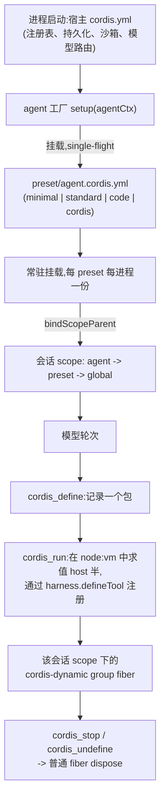

## 两个问题，一个机制

本章要回答两个听上去互不相干、却用同一个技巧解决的问题。

1. **一个 `dsh` 进程如何同时运行多个工具集、人设都不同的 agent（智能体）**，而不必为每个 agent 起一个进程？答案在 `packages/preset`。
2. **agent 如何检查并修改它自己正运行于其中的那棵插件树**，而且是在运行时、不重启地完成？答案在 `packages/extensions`。

两个答案都归结到[按会话组装 preset 的 Agent Note](../../../.agents/notes/implemented/architecture/2026-08-03-per-session-agent-presets.zh.md)直接点明的一个事实:`dsh-tools` 与 `dsh-system-prompt` 本就把每一次注册归档进**调用方上下文的 scope 分层**,而 agent 本身就是一个注册 scope。loader 不需要任何改动就能让一个 agent 拥有自己的工具——缺的只是一种把整份 `cordis.yml` 指向某个 agent scope 上下文的办法,以及一种让模型在运行过程中自己往某个 scope 里增删行的办法。preset 是前者。自我引用工具集是后者,只不过作用对象从「会话启动」换成了「模型的某一轮」。

## 第一部分:Agent Preset——一个进程,多份组装

### 组装的划分:宿主平面 vs. agent 平面

一个 `dsh` 进程引导一份 `cordis.yml`,组装出**宿主组装**——loader 在任何会话存在之前就一次性挂载的插件集合。过去,每个会话都跑在这同一份固定集合之下。preset 把这份集合中面向模型可见的那一半,按会话拆分了出来:

| 平面 | 实例数 | 内容 |
|---|---|---|
| 宿主 | 每进程一份 | 注册表本身(`tools`、`systemPrompt`、`agents`、`agent-loop`、`sessions`)、跨会话设施(持久化、查询、投影、存储、设置、凭据、遥测)、subagent provider、web 宿主 |
| agent | 每会话一份 | 单个 agent 对这些注册表的贡献:工具插件、人设与提示词段落、压缩策略 |

**preset** 是一个目录,其中放置一份 `agent.cordis.yml`。agent 工厂的 `setup(agentCtx)` 钩子把这份文件作为 Cordis `include` 子树,直接挂载到该 agent 自己的 scope 上下文之下——这是唯一受支持的调用点,因为 `setup` 在 agent 发布之前运行,一次被拒绝的挂载会让整个 `ctx.agents.create()` 调用回滚,而不会留下一个组装到一半的会话。entry 上下文沿原型链连到子树被挂载时所在的上下文,因此 preset 内部的每一行插件都注册进**该 agent 自己**的 scope 分层,并在 agent 被拆除时整体卸载。没有任何注册表因此多出一个分层——本就存在的 agent scope,只是恰好成了整份文件落地的地方。

模型路由被刻意排除在外。`installAgentLlmTarget` 才是 provider、model、reasoning effort 的按 agent 替换点;挂在 preset 内部的 LLM 适配器永远不会被 `agent-loop` 解析到,因为后者位于宿主平面。

### 随部署交付的清单

部署在 `apps/cli/config/agent-presets/` 下交付四个 preset,那份目录列表本身就是清单——设计上刻意避免另抄一份可能过时的名单:

- **`minimal`**——双工具编码 agent。它的人设是 `complete: true`,因此会成为**整个**系统提示词:没有 harness 身份开场白,没有工具指引,没有运行时上下文快照。模型拿到的恰好是持久化的 `bash` 与 `str_replace_editor`,本地文件系统与 PTY 服务只对这一个 preset 隔离生效。
- **`standard`**——功能完整的编码 agent:文件编辑、shell、文件与网页检索、skills、计划模式、目标、子代理、工作流。
- **`code`**——`standard` 的全部能力,再加一行:`tool-presentation` 配置为 `mode: code`(Code Mode)——模型不再是一次工具调用对应一个动作,而是针对生成的 SDK 写一段 TypeScript 程序,由 `run_code` 执行。
- **`cordis`**——`standard` 的全部能力,再加上第二部分要讲的自我修改工具集、一份解释两平面划分的人设,以及一个教授组装创作方法的 skill。

`code` 与 `cordis` 各自是 `standard` 的一份**完整拷贝**外加一处增量,而不是补丁格式。[preset Agent Note](../../../.agents/notes/implemented/architecture/2026-08-03-per-session-agent-presets.zh.md)的「已知限制」直接点出了这项代价:"a copy is a snapshot that drifts"(拷贝是会漂移的快照)——这一层没有补丁语义(那属于 `dsh-bundle` 的 `cordis.patch.yml` 机制),因此升级部署不会传播进已有的拷贝;随部署交付的这套 preset 自己也接受这项代价,换来的是每份 preset 都能读一个文件就看懂全貌。

### 隔离是默认值,而且是被实测过的

preset 子树的挂载默认按会话进行:在最初的按会话设计里,一份十二行组装每会话大约耗费 3ms、约 600KB。这个数字之所以重要,是因为它支撑了一项设计决策——隔离足够便宜,便宜到可以把它定为默认值而非要 preset 显式选择,于是一份由用户或 agent 写出的 preset 天然获得尽可能小的影响面。

真正拥有某个昂贵或进程级资源的 preset,可以用 Cordis 自身的 `isolate` 词汇主动选择共享。具名 label 是进程级全局的 realm——两棵子树写同一个 label 就解析到同一个实例;而 `isolate: <name>: true` 则让每个挂载它的会话各自拿到该名字的私有实例。`code` preset 的注释把服务行的规则写得很直白:它"必须放在带 `isolate` realm 的 group 里面。没有的话就会发布进根 realm,变成进程级全局而非按会话的,第二个挂载这份 preset 的会话就会与第一个相撞"——`dsh-agent-presets` 在挂载时直接拒绝这种情况,而不是让相撞悄无声息地在后面才暴露出来。

### 挂载会拒绝什么

`mount()` 需要自证组装可用,因为一棵直接挂接的子树从不关联 Loader 的 `Entry`,因此在 `ctx.loader.entries()` 里不可见,常规启动审计也看不到它。三种情况会被拒绝:

- **无 scope 的挂载目标。** 挂到一个不带 agent scope 的上下文,会把 preset 的行注册成全进程全局,对进程里的每个 agent 都生效。
- **一直没能可用的行**——某一行仍在等待一个组装中根本没有提供的服务。
- **把服务发布进根 realm 的行**——这类服务是进程级全局的,第二个挂载它的 preset 会与第一个相撞。包级运行时不变量会在每次服务通知时复查这一条,因为从定时器或异步续体中发布的行会绕过一次性审计。

### 常驻挂载:每进程一份组装,而非每会话一份

后来的一次改进,在不改变 preset 文件写法的前提下,改变了 preset 子树**存在的份数**。最初的按会话设计为每个会话挂载一个全新的 Entry。[常驻挂载 Agent Note](../../../.agents/notes/implemented/architecture/2026-08-08-per-preset-standing-mounts.zh.md)解释了这为什么会拖垮三个原本假设注册表表面是静态的宿主读取方:冷读的 `session.history` 找不到 presenter(每张卡片都退化成通用渲染器);投影(projections)块丢掉了 preset 注册的键(客户端把缺失的键当作能力缺失,直接清空对应行);Typert 网关在宿主根上解析 `goals`,得到 `service-unavailable`。

修复方式是让每个 preset 在**每个进程**里只保留一份组装,一次性挂载到一个合成的常驻 scope 之下;每个会话通过把自己 agent 的 scope key 绑定为该常驻 scope 的**子节点**(`bindScopeParent`)来加入。剩下的都由 `dsh-scope` 的两条机制承担:注册视图沿父链 `agent → preset → global` 走(越近越能遮蔽越远的);带 scope 的事件派发只放行携带承载键祖先标签的监听器——只向上,因此兄弟 preset 的监听器对彼此的 agent 保持失聪。这也是为什么有状态的 preset 插件(`plan-mode`、`token-meter`、`compaction-basic`)本就按 Session/Agent 而非 fiber 身份分键存状态——让同一 preset 上的多个会话共享一份常驻实例,是回归它们本来的设计,而非重写。

### 一个会话运行的是哪个 preset,以及为什么只看 header 不够

会话的持久化 header 记录的是它**创建时**所用的 preset。这是一项创建事实,固定不变。如果一个仍处于空白状态的会话之后切换了 preset(`recompose`),这次切换会以一条独立的 `agent-preset/selected` 会话事件记录下来,追加在切换提交之后——这是"模型可见 ⟺ 已记录日志"规则的要求,因为 preset 决定了模型能看到的每一个工具 schema 与提示词段落。因此,每一条重建路径(恢复、fork、冷读记录的 presenter、选择器的摘要)实际调用的都是 `resolveSessionPreset(session)`:它解析的是 header 加事件的组合,从不单看 header。只读 header 会把一个已切换的会话,按它**创建时**的那份组装重建出来,用新工具集根本没法执行的历史工具调用去回放。

只有在会话**仍是空白**时才允许切换——一旦跑过任何一轮,那段历史就是在当前 preset 的具体工具下产生的,替换会留下新组装无法执行的已记录工具调用。一旦有过一轮,`agentPreset.select` 就返回 `agent-preset-locked`。切换本身是"先卸后装":它先解析新 preset,再拆除旧的,新组装挂载失败时恢复原来那份——因为两份组装绝不能共存(它们会在同一分层里争夺相同的工具名)。

### `persona`:改变身份、而不止改变工具的那一行

工具只是「agent 是什么」的一半。[`dsh-persona`](../../../packages/preset/persona/README.zh.md)是让 preset 能改变另一半——agent 身份——的那一行,因为[`dsh-system-prompt`](../../../packages/core/system-prompt/README.zh.md)本身无条件地拥有部署级人设,并且在全进程只注册一次。没有一行属于自己 scope 的行,preset 就只能换掉 agent 的工具,却动不了它声明的身份。

`dsh-persona` 被刻意设计为**仅限 scope 内使用**:把它挂到 agent scope 之外,会与注册表自身的 `deployment:persona` 注册正面相撞,直接失败。这不是一个需要绕开的粗糙之处——这一行存在的全部意义就是为某一个 agent **遮蔽**部署人设,而部署人设本来就已经有主人了。

它的配置里有两个值得记牢的字段:

- `text`(必填)——人设正文,渲染为 order 0 的 `deployment:persona` 段落。它是一份模板:`{{model}}`、`{{cwd}}` 等提示词变量在**渲染时**、而不是组装时严格解析。
- `complete`(默认 `false`)——为 `true` 时,组装阶段仍会照常解析上下文、工具、变量与协作型监听器,但之后提示词注册表会把这份人设原样恢复为**唯一**的系统提示词段落。没有任何身份文本、工具指引或监听器贡献能再追加内容。`minimal` 正是靠这个字段实现它那份固定的、只含两个工具的提示词。
- `includeRuntimeContext`(默认 `true`)是第三个开关:设为 `false` 会抑制这个 agent scope 的一切动态运行时上下文快照(沙箱策略、审批策略、委派状态……),但不会关闭本会产生这些内容的服务本身——`minimal` 把它与 `complete: true` 一起设为 `false`,让自己的提示词真正做到固定不变。

### 读一份真实的 preset 文件

`minimal` preset 短到可以完整读完。它的人设行:

```yaml
- id: persona
  name: '@deepseek-ai/dsh-persona'
  config:
    text: You are a helpful software engineer assistant.
    complete: true
    includeRuntimeContext: false
```

以及它的文件系统行——用隔离让裸的本地 provider **只在这一个 preset 里**遮蔽宿主的沙箱化 provider:

```yaml
- id: filesystem
  name: cordis:group
  group: true
  isolate:
    fs: true
  config:
    - id: fs-local
      name: '@deepseek-ai/dsh-fs-local'
      config:
        cwd: !!js process.env.DSH_CWD ?? process.cwd()
    - id: str-replace-editor
      name: '@deepseek-ai/dsh-tool-str-replace-editor'
      config:
        maxOutputChars: 16000
```

对比一下 `standard` 与 `code` 大得多的文件——它们加上了 skills、计划模式、目标、子代理、工作流,以及(`code` 特有的)把整个工具调用协议切换成 Code Mode 的 `tool-presentation` 行。每新增一项能力,始终不过是多写一行插件——机制本身不会随着清单变长而改变。

### 创作只能靠拷贝,写操作是特权操作

模型或人都无法通过名单服务直接提交原始的 preset 文本。`ctx.agentPresets.copy(from, id, name?)` 是**唯一**的创作写操作:它把一份已有 preset 的整个目录——组装、元数据、skill 目录、资源文件——原样拷贝进第一个 `user` 信任级别的根目录,把权限重新收紧为仅所有者可读写,解引用符号链接,并重写 `preset.yml`——保留源的 `description`,但丢弃它的 `name` 与清单里的 `order`。没有任何调用方能直接提供组装文本,因此一次拷贝授予不出名单本来就没有的任何东西,而且拷贝出来的东西与源一样能加载(也一样可能损坏)。

`copy()` 在任何东西落地前会拒绝三种情况:id 不满足 `[a-z0-9][a-z0-9-]*`(约束是 id 本身的性质,在它成为目录名**之前**就检查——`../escape`、`a/b`、绝对路径全都作为非法 id 直接拒绝,而不是事后清洗路径);id 已被任一根目录占用;来源未知。`remove()` 同样拒绝任何随部署交付的 preset,因为随部署交付的那一份,正是用来对照一份可能已损坏的本地 preset 的已知良好基准。

`read`、`write`、`remove` 是**固定在环回地址**的 RPC。Agent Note 直言原因:"组装指明了一个会话所运行的插件,因此读取它是侦察,写入它是任意能力。"`list` 与 `select` 则保持为普通的、可远程调用的方法——局域网客户端的选择器确实需要它们;只锁死"切换"、却把 `session.create` 的 `agentPreset` 字段留在外面,不过是把同一份能力挪到隔壁一个方法上而已。这里值得注意一个框架性事实:被限制的这份能力**并不是 preset 授予的**——部署自带的默认 preset 本就带着 `bash` 与文件系统工具,因此任何被允许开启会话的调用方,早已能以本进程的身份执行命令。设立这道特权门槛,是因为编辑一份组装与在菜单里挑一个选项在性质上截然不同,而不是因为某个 preset 把信任级别拔高到了开启会话本身已经隐含的水平之上。

## 第二部分:自我引用的 Cordis 工具集——agent 编辑自己的运行时

### 这套工具集要解决什么问题

这套 harness 里的一切都是 Cordis 插件——但在这套工具集出现之前,运行在那套插件运行时**内部**的 agent 完全无法看见或触碰它:它无法枚举周围的服务与事件,无法在会话中途为自己扩展一个新工具,也无法即兴组合出自己发明的能力。[自我引用工具集 Agent Note](../../../.agents/notes/implemented/feature/2026-07-08-self-referential-cordis-toolset.zh.md)把这个设计问题精确地表述成"让模型运行代码"必然捆绑而来的三个正确性难题:

1. **模型写出的注册必须在发生的当下就被校验**——一个畸形的工具 schema 必须在注册那一刻就失败,而不是悄悄污染之后某次提示词组装。
2. **模型写出的代码要调用它从未见过源码的服务 API。** 猜测的方法签名——更糟的是猜测的返回值形状——要付出许多步盲目试探的代价。
3. **模型挂载的一切都必须能被完全释放**——无论是模型主动要求,还是宿主重载时走常规插件生命周期——否则长会话会不断积累孤儿监听器和孤儿工具。

### 这个包组

| 包 | 角色 | ctx 键 |
|---|---|---|
| [`tool-cordis`](../../../packages/extensions/tool-cordis/README.zh.md) | 面向模型的工具:`cordis_inspect`、`cordis_define`、`cordis_run`、`cordis_stop`、`cordis_undefine` | 注册到 `ctx.tools` |
| [`cordis-host-runner`](../../../packages/extensions/cordis-host-runner/README.zh.md) | 定义注册表、host 半的 `node:vm` 沙箱,以及 request-run 往返 | 提供 `ctx.dynamicCordisRunner` |
| `cordis-client-runner` | 双半包的浏览器半 | client 面 |
| `ui-cordis` | 操作全部定义的全局面板 | client 面 |

`tool-cordis` 与 `cordis-host-runner` 的拆分完全遵循 harness 里随处可见的能力 seam 模式:runner 拥有沙箱、vm 生命周期与跨会话记账;工具包只拥有面向模型的动词与 schema。两者缺一不可——一份只装了 `tool-cordis`、没装 runner 的组装,永远无法激活这些工具。

### 五个动词

这套工具面从早期的三动词设计(`cordis_inspect` / `cordis_mount` / `cordis_unmount`)演进成了今天的五个,把"定义"从"运行"中拆了出来,好让一份定义能先被记录、以对话卡片的形式交给用户审阅,再择机启动——甚至永远不启动:

| 工具 | 作用 |
|---|---|
| `cordis_inspect` | 对当前进程的只读报告:服务、所有存活的插件 fiber、已注册工具、本会话的动态包、反射支撑的 `api`/`events` 参考,以及浏览器半可以贡献 UI 进去的编译期 `client` slot 表面 |
| `cordis_define` | 在对两个半区做语法检查后,记录一个包(`name`、`purpose`、host 半 `code` 与/或浏览器半 `client`)。此时什么都不会运行——用户看到的是一张带启动控件的卡片 |
| `cordis_run` | 在沙箱里求值 host 半,并把浏览器半下发给每一个打开的网页 |
| `cordis_stop` | 把 host 半 dispose 到静默,撤下浏览器半;定义本身保留,可以再次运行 |
| `cordis_undefine` | 视需要先停止该包,再遗忘这份定义 |

每个动词都是**按会话限定**的:一个包只在定义它的那个会话里可见、可控——尽管它实际运行在共享的 DSH 进程内,一旦运行起来也可能影响到其他会话。动态包只存在于进程内存里——它们不会产生任何插件文件,不安装任何东西,不改动任何 `cordis.yml` 或个人配置,不会在 `dsh` 重启后存活,也不会被自动提升为正式能力。想保留一次实验,就得让 agent 通过常规开发流程,把它实现成一个正规的插件或 bundle——这套工具集明确是为探测而生,不是为交付而生。

### 为什么问题一、二的答案是一份生成出来的目录,而不是手写的

`cordis_inspect what:"api"` 与 `what:"events"` 读取的并不是一张手工维护的参考表——早期版本恰恰试过这么做,Agent Note 记录了它被替换的原因:"手写表一旦签名有变就会漂移,而没有任何东西会拦下这种漂移。"取而代之的是 `src/api-catalog.ts`,由生成 `docs/subsystems/*.md` 的同一套 AST 遍历所生成——本章引用的 extensions 子系统自身 Cordis API 文档,正是同一份产物。`pnpm run gen-cordis-api` 负责重新生成,`pnpm run verify-cordis-api` 在 `doc-sync` 里守住它的新鲜度,因此工作区任何地方对公开签名或 JSDoc 的改动,都不可能在模型所读的目录跟着更新之前先合入。

运行时,`cordis_inspect` 把这份静态目录与**存活**的服务存储做交集:什么在运行,来自存储;每个服务**能做什么**,来自目录;一个目录没覆盖的存活服务(例如某个已挂载的动态包自己提供的服务)依然会被报告为可达,只是没有签名,而不会被悄悄省略。报告代码里还有两处判断,是刻意做在渲染逻辑里、而非直接来自原始反射数据的:只展示**可调用的方法**(不展示状态,也不展示插件之间那些包外观本就够不到的、以 symbol 为键的内部接缝);以及只点名一个已挂载的 host 半**真正能做到**的 `ctx.<key>` 读取——一套 `injectable` / `not-a-service` / `other-face` 的分类被固定并纳入门禁,防止一个新声明的键悄悄邀请模型去 `inject` 一个永远不会到来的东西。

### 沙箱语义:为正确性而设的容器,不是安全边界

动态包的 host 半以异步函数体的形式,运行在一个全新的 `node:vm` realm 里。沙箱全局对象刻意精简:一个带标签、透传写入的 `console`;`harness.defineTool` / `harness.registerTool` 这对注册接口;一个全新 vm 上下文原本缺失的编码原语(`btoa`/`atob`、`TextEncoder`/`TextDecoder`);以及对被扣下的 Node API(`require`、定时器家族、`fetch`)设置的可调用陷阱——调用即抛出一条指名对应 Cordis 替代方案的消息。只有函数形态的全局对象会被设陷阱——`process` 与 `Buffer` 保持 `undefined`,因此一次 `typeof` 特性探测只会得到不存在,而不会触发一个抛错的访问器。

被挂载的插件体拿到的是一个**白名单式的 context façade**,绝非原始的框架 `Context`:框架内部管线与返回值中的 context 对象一律被拒绝;服务读取必须有声明过的 `inject`(保留 Cordis 常规的激活与卸载语义);`ctx.tools.get` 只暴露 schema 视图,使挂载的代码无法绕过 `ToolRuntime.execute`、直接调用一个工具定义。

以上这些都不是安全边界,两份 README 都刻意用同一句话说明了这一点:"把这套工具集当作 bash 访问权限来对待。"[Agent Note](../../../.agents/notes/implemented/feature/2026-07-08-self-referential-cordis-toolset.zh.md)明确指出,这些陷阱与外观存在是为了**正确性**——把模型写的代码引导到 Cordis 服务上、远离它本会猜错的、容易泄漏的 Node 内建对象——而不是为了容器化:

> "外观所暴露的能力(`ctx.shell`、`ctx.fs`、`ctx.web`)本身就能触达真实运行时,所以这不是一道安全边界。一道真正的边界(独立进程、权限弹窗)超出了一个开发用、需主动选用的工具集的范围,而且会与整个设计初衷——把活的运行时交给模型——直接冲突。"

沙箱全局对象上的 host-realm 辅助函数依然可达,因此包代码原则上仍能绕过陷阱触及 Node。一个被挂载的插件可以用 host 执行器本身的权限调用 `ctx.shell`,触达真实的文件系统与网络服务。这套工具集的加载,与加一行 `bash` 工具同样审慎——是一项需要主动选用的开发能力,而非硬化过的默认项——这正是为什么只有 `cordis` preset 携带它,`standard` 从不携带。

### 真正划定影响范围边界的,是什么

既然沙箱不是安全边界,真正承担容纳工作的,是三个更窄、也更真实的机制:

- **普通的 Cordis fiber 生命周期,而非专门造的清理路径。** 每个被挂载的插件都是工具插件之下一个内部 group 的子节点,因此常规的 fiber dispose——拆除任何插件子树所用的那套机制——同时处理手动的 `cordis_stop`/`cordis_undefine`,以及工具集卸载或进程重启。`cordis_run` 会等待完全落定;启动失败会在返回错误前先 dispose 掉这个 fiber,而不是留下一个半注册的插件活着。
- **每个动词都做会话限定。** 另一个会话创建的定义,对不拥有它的会话而言读作**不存在**,而非**被禁止**——工具面本身不会跨会话泄漏任何东西,一个包(一旦运行起来)产生的效果,才是唯一可能跨会话的通道,检查与定义这两个动作本身不是。
- **规范的工具输出约定,在跨越边界的那一刻被强制执行。** `harness.defineTool` 在**宿主** realm 里重建输出 schema 与 projector,并在注册表放行之前,把返回值本体快照成宿主拥有的 JSON——一个被挂载的工具无法把一个存活的 vm-realm 对象原样递出去、冒充成结果。

这些都不能让任意代码变得安全。它们做到的是:让这里的机制与 harness 别处的机制**是同一套**——Cordis 注册、fiber dispose、会话限定、工具输出约定——而不是专为动态代码另造一套更弱的平行版本。这里的自我修改是有界的,界限体现在:一个被挂载的插件注册不出任何 loader 自身注册表不会为普通插件校验的东西,也活不过自己的 fiber。但它明确地**不**限制一个已经合法注册的插件之后在运行时能做什么——那份权限,等同于挂载它的那个会话背后的服务本来就已经赋予它的一切。

### 跨挂载组合:不过是普通的 `provide`/`inject`

因为一个被挂载的插件本质上就是一个普通的 Cordis 插件,两个各自独立定义的动态包之间靠框架自身的服务语义组合,而不是一套专门造的 API:挂载 A 调用 `ctx.provide('foo', value)`;挂载 B 声明 `inject: ['foo']`,`foo` 一出现就立刻激活。先挂 B 也没关系——它会停在 pending 状态,在自己的检查报告里点名缺失的服务,直到 A 提供它。卸载 A 会让 B 回到 pending(它自己的注册随之撤销),之后再一次 provide,会通过一个全新的沙箱外观重新跑一遍 B 的 `apply`。重复 provide 会响亮地失败,并点名已经拥有它的那个 fiber——这与一次普通的双插件组合会撞到的规则完全一致。

### `cordis` preset 把两个部分接到了一起

`cordis` preset 正是第一部分与第二部分具体交汇的地方:它是 `standard` 加上自我修改工具集,因此**正是这一个 preset**,让部署可以把自我修改能力交给某一个会话,而不必交给所有会话。它自己的文件头注释直接写明了信任框架:

```yaml
# TRUST: `cordis_mount` evaluates model-written JavaScript against the live
# runtime, and a composition this agent writes becomes a preset other sessions
# mount. Treat a session on this preset as shell access — the toolset's own
# documentation makes the same statement.
```

它在 `standard` 之上恰好新增三行:`tool-cordis` 本身;以及配置为加载一份随附 skill——`editing-cordis-compositions`——的 `skill-filesystem`/`tool-skill`,这份 skill 来自随 preset 一起走的目录(`customSkillDirs` 相对 preset 自己的 `baseUrl` 解析,而非用户的 skill 根目录)——因为这份 skill 教的正是**这套部署**具体的两平面划分,而 preset 正是被拷贝、被编辑的那个单元。

这个 preset 的人设也是重新写过的,而不只是继承自 `standard`,目的是让 agent 意识到自己正运行在什么机制之下:

```yaml
text: |-
  You are a coding agent powered by the {{model}} model, running on the DeepSeek Harness. Your working directory is {{cwd}}.

  You can read and modify the harness you run on. Its composition is Cordis: every capability is a plugin row in a `cordis.yml`, and an agent preset is one such file mounted for a single session.

  Two planes decide where an edit belongs. The HOST composition holds the registries and anything shared across sessions [...]. An AGENT PRESET holds what one session contributes to those registries [...].

  Presets you author live one directory per preset under `${DSH_HOME:-$HOME/.dsh}/.agent-presets/<id>/` [...]. NEVER edit or delete the shipped preset install [...]: an upgrade overwrites it, and corrupting the `cordis` preset would disable this very mode.
```

最后一句值得细品:人设明确警告 agent,损坏随部署交付的 `cordis` preset,会关闭**正在组装这个 agent 自己**的那个 preset。这份 preset 携带的 `editing-cordis-compositions` skill,又用机制把同一条规则强加给任何加载它的 agent——"绝不编辑、删除或覆盖随部署交付的 preset",拷贝之后再编辑是修改一份随部署交付的 preset 行为的唯一受认可路径。这是一种带着硬性下限的自我修改:agent 可以扩展、重塑**它自己会话**的组装,也可以创作全新的 preset,但让 preset 对未来会话可用这件事本身所依赖的机制,恰恰对这套本可以触及它的工具集设了禁区。

## 贯穿两者的共同思路

本章的两套机制,都是靠复用 `dsh-scope` 本就提供的同一个 scope 注册原语,来回答「一个 agent 如何拿到与其他 agent 不同的运行时」这个问题,而不是另造一套平行的配置系统或插件系统:

- **preset** 在 agent 启动**之前**,把整份 `cordis.yml` 指向它的 scope,而(在常驻挂载设计下)被挂载的子树为整个进程存活,由每一个把自己 scope 绑定为它子节点的会话共享。
- **`cordis_define`/`cordis_run`** 让模型在一轮对话**期间**,通过 `cordis.yml` 一行插件所用的那套完全相同的 Cordis `apply`/`inject`/`provide` 词汇,给自己会话的注册表面添加**单独一行**插件——只不过是在 `node:vm` 沙箱里求值,而不是从包文件里导入;拆除时走的也是任何插件卸载都会走的同一条 fiber dispose 路径。

两套机制都不构成一种新的权限类型。preset 拥有的权限恰好等于它所命名的那些插件——`AgentPreset` 上的 `trust` 字段存在的意义是让界面**展示**这一事实,而不是在此之上强制任何额外约束;`cordis_run` 挂载的动态包所拥有的权限,也恰好等于挂载它的会话所用的那份 preset 本就已经向它暴露的那些服务。两者真正添加的,是比"用另一份 `cordis.yml` 重启进程"更细的组合粒度:preset 这一层是按会话的粒度,自我修改这一层是按轮次的粒度。


