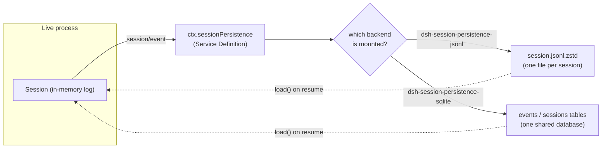
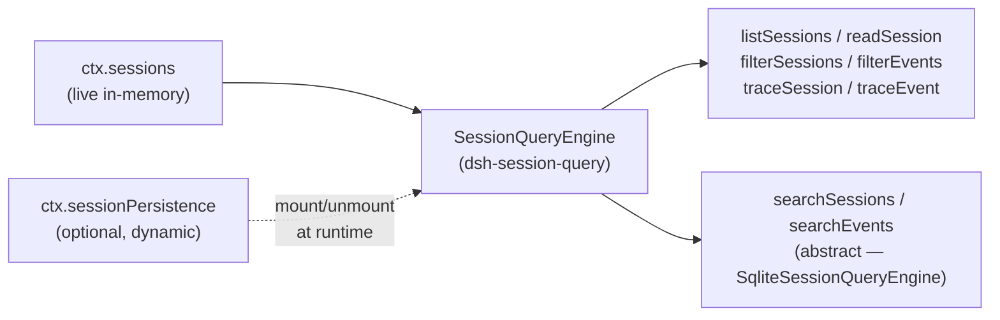

## From log to durable store

[Chapter s03](../s03-event-sourced-session/README.md) established that a `Session` is an append-only log of typed `SessionEvent`s, and that everything else — the LLM message history, the human transcript, a durable storage row — is a projection computed from that log. This chapter picks up exactly where that one stopped: given that the log is the single source of truth, how does it survive a process restart, and how does something outside the live process find a past session again?

Two capability seams answer these questions, and they are deliberately independent of each other:

- **`ctx.sessionPersistence`** (`dsh-session-persistence`) makes one session's log durable — create it, append to it, reload it after a crash.
- **`ctx.sessionQuery`** (`dsh-session-query`) reads *across* sessions — list, filter, full-text search, and trace relationships between them, over whichever sessions happen to be live plus whatever persistence backend happens to be mounted.

A third, much smaller pair of services rounds out the "memory" story: **session projection** turns the log into whole, log-derived read models for UI carriers, and **session title** derives a short human-readable label for a session from the same log. Neither of these needs its own storage backend — they ride on persistence or read the log directly.

## The persistence seam: Service Definition, Provider, Consumer

`dsh-session-persistence` follows the same three-role split chapter s08 introduced for `dsh-shell`: this package owns only the abstract `SessionPersistence extends Service` class and its shared write-coordination machinery; two sibling packages, `dsh-session-persistence-jsonl` and `dsh-session-persistence-sqlite`, are interchangeable Service Providers; everything that resumes a session, powers `session-query`, or drives the projection cache is a Consumer that injects `ctx.sessionPersistence` and never imports a provider-specific type.

The persisted unit **is** the existing `SessionEvent` — there is no parallel "persisted message" shape to keep in sync with the live one. What travels separately is `SessionHeader`: format version, `id`, `createdAt`, `cwd`, lineage (`parentSession`, `seedLength`, `origin`, `delegationDepth`), and `agentPreset`. None of this is replayable conversation state, so it stays out of `SessionEventMap` and is attached to a `Session` as `session.header` rather than logged as an event.



### The Service API

The abstract class (`packages/session/session-persistence/src/index.ts:84-228`) defines the full read/write surface a backend must implement:

| Method | Contract |
|---|---|
| `locate(meta)` | Resolve an absolute per-session artifact path synchronously, no I/O. Backends without one independent artifact per session (SQLite) return `undefined`. |
| `supportsRawArtifacts` | Declares whether `readRaw` returns anything; `false` is not the same as session absence. |
| `create(meta)` | Register a new session's header. May defer the physical write to the first `append` — lazy materialization. |
| `append(id, events)` | Durably persist a contiguous batch; the first event's `seq` must equal the stored next-seq; resolves only after durability. |
| `load(id)` | Return an immutable, balanced logical log, committing any crash recovery. |
| `inspect(id, signal?)` | Same validated view as `load`, but without committing recovery or publishing a live `Session` — used for read-only history access. |
| `readFrom(id, fromSeq, signal?)` | Physical suffix read from a watermark, for consumers like the projection cache that only need the tail. |
| `list(signal?)` / `listSnapshots(signal?)` | Lightweight metadata listing, no full-log parse; `listSnapshots` adds an opaque per-log revision token for change detection. |

Every backend honors the same invariants regardless of storage medium: **append-only** (a crash never truncates — it closes the orphaned turn instead), **contiguous seq** (no gaps, ever), and **durability on return** (`append` doesn't resolve until the batch is on disk).

### Crash recovery closes, never truncates

If a process crashes mid-turn, the reload finds an open `turn/start` with no matching `turn/end`. Because a single turn can hold a large amount of durably-appended work (many tool calls, large outputs), the backend does not discard it. Instead `load()` synthesizes closing events — a risk-classified error `tool/result` for each assistant call that never got an answer, then `step/end?` and `turn/end { reason: { kind: 'interrupted' } }` — to make the log balanced again. `interrupted` is the one `TurnEndReason` no live loop ever emits itself; it exists purely as this repair marker. Only a genuinely torn tail fragment — bytes that were never fully written — is dropped. Everything durably committed survives, repaired or not.

Repair only ever touches *cold* sessions. If the id is still bound to a live `Session` object in the current process, `load(id)` waits for the authoritative in-memory snapshot to become durable and returns it once balanced; an open live turn rejects outright rather than getting a synthetic close grafted onto still-active state. `inspect(id)` goes further: it never commits repair or publishes a `Session` at all, so history-reading code (session-query, a title provider, the projection cache) can safely observe a cold interrupted session without racing a live turn or mutating storage.

### The shared write coordinator

Both first-party backends compose the same `PersistenceCoordinator`, implementing only a small `PersistenceBackend<TornMarker>` storage-hook interface (`loadStored`, `readStoredRevision`, `appendBatch`, `commitRepair`, `list`, optional `close`). The coordinator owns everything that is backend-agnostic: per-id write serialization, lazy materialization, crash-tail repair sequencing, bounded write batching, and quiescent disposal. This is why JSONL and SQLite share identical lifecycle correctness — same-id write races, same recovery ordering, same disposal draining — while differing only in what a row of storage physically looks like.

Write batching is a fixed coalescing window, not an event-loop or backend-latency bound. `SessionWriteBehind` (`packages/session/session-persistence/src/write-behind.ts:18-52`) copies each live event into a per-session queue; the *first* pending event starts a timer at the configured `writeBatchMaxDelayMs` (default `200`), and later events joining before expiry do not reset that deadline. When the timer fires, one durable write starts; events admitted while that write is in flight form a new, separately-bounded follow-up batch. `session/flush` cancels the wait outright and is the shared quiescence barrier the agent loop uses as its ordering and error-observation checkpoint before starting the next turn — this is the same flush point chapter s03 mentioned as the boundary between "logged" and "still buffered."

## Two backends, one contract

### JSONL: one file per session

`dsh-session-persistence-jsonl` stores each session as one append-only logical JSONL log, physically laid out as `<root>/--<normalized-cwd>--/<encoded-id>/session.jsonl.zstd` by default (`session.jsonl` when compression is disabled). The first logical line is the immutable `SessionHeader`; every following line is one `SessionEvent`, or — when `packChunks` is enabled (the default) — a packed run of ≥3 consecutive same-block `assistant/chunk` deltas collapsed into a single row, measured at roughly 60% smaller logical logs on a real coding session. Reading is layout-blind: `load()` always decodes rows the same way regardless of whether they were packed, so this is purely a write-side space optimization.

`locate()` (`packages/session/session-persistence-jsonl/src/index.ts:172-174`) is a pure path computation with no filesystem access:

```ts
locate(meta: SessionHeader): SessionLocation {
  return { kind: 'jsonl', path: logPath(this.root, meta.cwd, meta.id, this.compression) }
}
```

The default physical encoding is a concatenation of independent Zstandard frames — one checksummed frame for the header, one per durable append batch — so listing can validate and read only the header frame without decompressing the whole file. Lazy materialization means `create()` writes nothing; the first `append()` writes and `fsync`s a temporary file, then publishes it without overwrite (a POSIX hard link, or `MOVEFILE_WRITE_THROUGH` on Windows) so two processes racing to create the same session id fail instead of silently overwriting each other's log.

### SQLite: one database, many sessions

`dsh-session-persistence-sqlite` satisfies the exact same `SessionPersistence` contract over `node:sqlite` rows instead of file bytes. `locate()` always returns `undefined` — with one shared database there is no independent per-session artifact to point at. The schema (`packages/session/session-persistence-sqlite/src/schema.ts:117-145`) is deliberately close to the event shape itself:

```sql
CREATE TABLE IF NOT EXISTS sessions (
  id TEXT PRIMARY KEY, version INTEGER NOT NULL, created_at INTEGER NOT NULL,
  cwd TEXT, parent_session TEXT, seed_length INTEGER, origin TEXT,
  delegation_depth INTEGER, agent_preset TEXT,
  incarnation TEXT NOT NULL, revision INTEGER NOT NULL
) STRICT;

CREATE TABLE IF NOT EXISTS events (
  session_id TEXT NOT NULL REFERENCES sessions(id) ON DELETE CASCADE,
  seq INTEGER NOT NULL, type TEXT NOT NULL, time INTEGER NOT NULL, data TEXT NOT NULL,
  source_event_seqs TEXT, surface_op TEXT, ignorable INTEGER,
  PRIMARY KEY (session_id, seq)
) STRICT
```

Each `SessionEvent` maps 1:1 onto an `events` row — `data` holds the event payload as JSON text, so the row shape is the event verbatim, chunk events included. A `sessions` row is written only by the first `append` (the same lazy-materialization rule as JSONL, expressed as "no row" instead of "no file"), and `append` wraps the whole batch in one `BEGIN`/`COMMIT` transaction, so a mid-batch `UNIQUE` violation on a duplicated `seq` rolls back cleanly. Because SQLite can seek directly by `seq`, this backend implements the optional `loadStoredFrom` hook (`WHERE seq >= ?`) so `readFrom()` reads only the requested suffix instead of parsing the whole log — a property JSONL's sequential-file medium cannot offer, which is why `readFrom` documents both access patterns as valid.

Both backends are equally correct implementations of one contract; the choice between them is an operational one (single file per session vs. one queryable database), not a functional one. The SQLite package's own README flags a durable TODO: it talks to `node:sqlite` directly today, and would route through a cordis database service instead if one is ever adopted — without changing the `SessionPersistence` contract surface at all.

## Session query: searching across sessions

Persistence answers "how do I get this one session's log back." `dsh-session-query` answers a different question: "which sessions, and which events inside them, match some criterion." It is a **combined** service — the abstract `SessionQueryEngine` in `dsh-session-query` implements every read, filter, and lineage-trace method directly against live `ctx.sessions` plus optional dynamically-mounted `ctx.sessionPersistence`, and leaves only the two full-text methods (`searchSessions`, `searchEvents`) abstract for a concrete backend to implement.



Matching ids across the two sources produce one merged record: live state wins over stale persisted state, and each result reports both `live` and `persisted` availability so a caller can tell which source actually served it. Persistence is optional and can mount or unmount at runtime without breaking reads that only need live sessions — cross-corpus operations (listing across everything, lineage tracing) fail loudly with a distinct error code (`SESSION_QUERY_PERSISTENCE_FAILED`) only while persistence is mounted but unreadable, rather than silently degrading to a partial answer.

The provider-independent surface includes structural filtering (`filterSessions` by cwd/created-at/parent/availability, `filterEvents` by seq/time/type/surface) and relationship tracing (`traceSession` for ancestor/descendant lineage, `traceEvent` for positional-replacement and cited-source chains — the same replacement links that let a compaction event in chapter s14's sense point back at what it replaced). None of this needs a search index; it operates directly on the logical corpus.

### `dsh-session-query-sqlite`: the concrete full-text backend

`SqliteSessionQueryEngine` is the first (and currently only) concrete provider, implementing `searchSessions`/`searchEvents` with SQLite FTS5. It maintains its own **dedicated derived index database** — never the persistence database itself — reconciled incrementally against lightweight durable-snapshot revisions so an unchanged session costs nothing on a repeat search. Live sessions get connection-local TEMP rows that shadow the durable base for the same id, so a session's current state is searchable even before it's flushed to persistence.

Two details worth internalizing about how search actually behaves:

- **Queries are literal phrases, not FTS5 syntax.** Quotes, `OR`, `NEAR`, `*` are treated as data to search for, not as executable MATCH operators — this is deliberate, not a missing feature, so a model or user typing a literal search term never accidentally triggers boolean query syntax.
- **The tokenizer is `unicode61`.** This gives token/phrase recall, not arbitrary substring recall — `AI` will not match inside `BRAID`. For a literal whitespace-flexible substring scan, `filterEvents()`'s regex-based text clause is the intended tool instead.

`openAt` controls when the SQLite handle actually opens: `startup` (default, fails fast before the service activates), `first-search` (defers the import and handle open until the first query, useful for clean startup output), or `never` (full-text search is off entirely — `searchSessions`/`searchEvents` reject with `SESSION_QUERY_SEARCH_DISABLED`, while every inherited exact read/filter/trace keeps working unaffected).

### The model-facing tool layer

`dsh-tool-session-query` is the opt-in Consumer that exposes `ctx.sessionQuery` to the model itself, as five tools: `session_search`, `session_event_search`, `session_trace`, `session_event_trace`, `session_event_read`. It is not mounted by default in shipped host compositions — a deployment opts in explicitly. Its job is entirely authorization and boundary-sanitization on top of the trusted query service underneath: cross-session access requires exact `cwd` equality between the caller's session and the target, a session without a `cwd` can only search itself, and unauthorized lineage boundaries are replaced with markers that reveal no hidden session id. The tool layer also strips away everything that would leak provider internals to the model — no cursors, no offsets, no page sizes, no model-controlled result limit — because `SessionQueryEngine` itself is designed model-agnostic; every model-visible constraint is enforced again at this boundary rather than assumed from the schema alone.

## Projection: whole-log read models, briefly

Persistence answers "get the log back"; `ctx.sessionProjections` (`dsh-session-projection`) answers a smaller, UI-facing question: "give me one consistent, whole, log-derived value right now," for something like a token meter or a todo-list snapshot. A projection unit is three pure synchronous functions (`init`, `apply`, `view`) plus a schema and a `stateVersion`; the registry itself owns the only subscription to `session/event` and drives every registered unit's `apply` on each committed event. Two invariants make this cheap by construction: `apply` must return the same state reference when an event doesn't concern a given unit (so unrelated events cost one reference check and nothing more), and a state-carrying event must always carry the complete post-change state, never a delta — so a unit registered late, or a projection folded from a persisted tail, can always catch up by replaying from `init()` with no missing intermediate steps. `dsh-session-projection-cache` persists projection checkpoints (keyed by `sessionId`, `key`, `stateVersion`, `seq`, value) so a restart doesn't have to re-fold an entire log from event zero — it's the one point where projection leans on `readFrom()` from the persistence seam.

## Session titles: a log event, not a separate store

`dsh-session-title` derives a short human-readable label for a session, and it is a useful small case study in "everything model-visible or user-visible is a session event" because the title mechanism produces exactly one durable artifact: a `session/title` event (`docs/persistence-catalog.md:639-651`), marked log-only — it never enters `deriveMessages()` or the model surface. There's no separate "titles table"; a title is retrieved by folding the log for the latest `session/title` event, the same way any other derived value comes from replay.

The default path is a deterministic fallback: the first eligible human `user/message` (text-only, non-empty) schedules a title from its first words, bounded by configured word/byte limits, with whitespace normalized and control sequences stripped. A deployment may additionally register exactly one asynchronous model-backed provider (`dsh-session-title-first-prompt-llm` or `dsh-session-title-all-prompts-llm`, both built on shared logic in `dsh-session-title-llm`) — its own pre-dispatch request is separately logged as `session/title-llm-request` (`docs/persistence-catalog.md:655-664`) before the result comes back, so a title-generation request is itself replayable and auditable even if it never completes. An explicit user-issued rename pins the session: later automatic messages no longer schedule an automatic revision until an explicit `refresh` deliberately unpins it. None of this touches the main agent request's tokens or KV-cache prefix — title generation is a side channel entirely separate from the conversation the model is having.

## What this seam does not do

Every package in this family is explicit about the same boundary: **there is no deletion or retention API anywhere in this stack.** `dsh-session-persistence` states it directly — pruning stored sessions is out-of-band backend maintenance, not something the seam does for you. `list()` on both backends is unpaginated and unfiltered, fine for a local development store, an explicit non-goal at any larger scale. `dsh-session-query` likewise ships no caller-authorization of its own (that's `dsh-tool-session-query`'s entire job) and no extractor/search-provider registry beyond the one SQLite implementation. None of this is oversight — each README names it under "Known Limitations and Deferred Work" as a boundary a future package would need to own, not a gap this one silently papers over.
