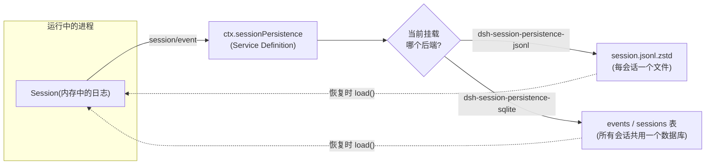
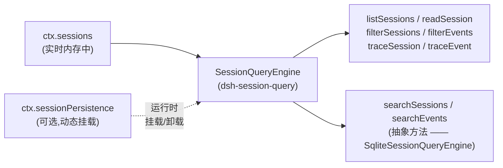

## 日志之后:落盘与找回

[第 3 章](../s03-event-sourced-session/README.zh.md)确立了一个事实:`Session` 是一份仅追加的、由类型化 `SessionEvent` 组成的日志,而其余一切——LLM 消息历史、人类可读的转录、持久化存储中的一行记录——都是从这份日志计算出来的投影。本章正是从这里继续:既然日志是唯一真相之源,它如何在进程重启后存活下来?又如何让进程之外的东西重新找到某个历史会话?

两个能力 seam 分别回答这两个问题,而且它们彼此刻意保持独立:

- **`ctx.sessionPersistence`**(`dsh-session-persistence`)让单个会话的日志变得持久——创建它、追加写入它、在崩溃后把它重新加载回来。
- **`ctx.sessionQuery`**(`dsh-session-query`)跨会话读取——对当前存活的会话加上任何挂载的持久化后端,做列表、过滤、全文检索,以及会话间关系的追溯。

还有一对小得多的服务补全了"记忆"这个主题:**会话投影(session projection)**把日志转成面向 UI 载体的、整值形式的日志派生读模型;**会话标题(session title)**从同一份日志派生出一个人类可读的短标题。两者都不需要自己的存储后端——它们要么依附于持久化,要么直接读日志。

## 持久化 seam:Service Definition、Provider、Consumer

`dsh-session-persistence` 遵循第 7 章围绕 `dsh-shell` 讲过的同一套三角色划分:本包只拥有抽象的 `SessionPersistence extends Service` 类以及共享的写入协调机制;两个同级包 `dsh-session-persistence-jsonl` 与 `dsh-session-persistence-sqlite` 是可互换的 Service Provider;而任何恢复会话、驱动 `session-query`、或驱动投影缓存的代码都是注入 `ctx.sessionPersistence` 的 Consumer,从不导入某个具体后端的类型。

被持久化的单元**就是**已有的 `SessionEvent`——不存在一份需要和实时事件保持同步的"持久化消息"平行类型。单独传递的是 `SessionHeader`:格式版本、`id`、`createdAt`、`cwd`,以及血缘信息(`parentSession`、`seedLength`、`origin`、`delegationDepth`)和 `agentPreset`。这些都不是可重放的对话状态,因此不进入 `SessionEventMap`,而是作为 `session.header` 挂在 `Session` 上,不作为事件写入日志。



### Service API

这个抽象类(`packages/session/session-persistence/src/index.ts:84-228`)定义了后端必须实现的完整读写接口:

| 方法 | 契约 |
|---|---|
| `locate(meta)` | 同步、无 I/O 地解析出一个绝对路径的每会话产物位置。没有独立每会话产物的后端(SQLite)返回 `undefined`。 |
| `supportsRawArtifacts` | 声明 `readRaw` 是否会返回内容;`false` 不等于会话不存在。 |
| `create(meta)` | 登记新会话的 header。可以把物理写入推迟到第一次 `append`——即惰性实体化。 |
| `append(id, events)` | 持久写入一批连续事件;首个事件的 `seq` 必须等于已存储的下一个 seq;只有落盘后才 resolve。 |
| `load(id)` | 返回一份不可变、已配平的逻辑日志,同时提交任何需要的崩溃恢复。 |
| `inspect(id, signal?)` | 与 `load` 相同的已验证视图,但不提交恢复、也不发布实时 `Session`——用于只读的历史访问。 |
| `readFrom(id, fromSeq, signal?)` | 从某个水位线开始的物理后缀读取,供只需要日志尾部的消费者(如投影缓存)使用。 |
| `list(signal?)` / `listSnapshots(signal?)` | 轻量的元数据列表,不解析完整日志;`listSnapshots` 额外附带一个不透明的、按日志计的修订号用于变更检测。 |

无论存储介质是什么,每个后端都遵守同一组不变式:**仅追加**(崩溃从不截断——而是把孤立的轮次关闭)、**seq 连续**(绝不允许出现空洞)、**返回即持久**(`append` 在批次落盘之前不会 resolve)。

### 崩溃恢复:关闭,而不是截断

如果进程在某个轮次执行到一半时崩溃,重新加载时会发现一个已打开的 `turn/start` 却没有对应的 `turn/end`。因为单个轮次可能已经持久写入了大量工作(许多工具调用、庞大的输出),后端不会丢弃它。相反,`load()` 会合成收尾事件——为每个没有得到答复的 assistant 调用生成一个按风险分类的错误 `tool/result`,然后是 `step/end?` 与 `turn/end { reason: { kind: 'interrupted' } }`——以此让日志重新配平。`interrupted` 是唯一一个从不由正常运行中的循环自己产生的 `TurnEndReason`,它的存在纯粹是为了标记这种修复。只有真正被撕裂的尾部片段——从未完整写入的字节——才会被丢弃。凡是已经持久提交的内容,不论是否需要修复,都会存活下来。

修复只针对**冷**会话生效。如果这个 id 仍然绑定着当前进程里一个存活的 `Session` 对象,`load(id)` 会等待权威的内存快照变为持久状态,并只在其配平后才返回;一个仍处于打开状态的实时轮次会直接拒绝,而不会被强行嫁接一个合成的收尾。`inspect(id)` 走得更远:它从不提交恢复,也从不发布 `Session`,因此读历史的代码(session-query、标题提供方、投影缓存)可以安全地观察一个冷的、被中断的会话,既不会与实时轮次竞态,也不会修改存储。

### 共享的写入协调器

两个官方后端都组合了同一个 `PersistenceCoordinator`,各自只需实现一个很小的 `PersistenceBackend<TornMarker>` 存储钩子接口(`loadStored`、`readStoredRevision`、`appendBatch`、`commitRepair`、`list`,以及可选的 `close`)。协调器拥有一切与后端无关的部分:按 id 的写入串行化、惰性实体化、崩溃尾部修复的时序、有界写入批处理、以及静默(quiescent)析构。这正是为什么 JSONL 与 SQLite 共享完全相同的生命周期正确性——同 id 写入竞态的处理方式相同、恢复顺序相同、析构排空的方式相同——两者的差异仅仅在于一行存储物理上长什么样。

写入批处理是一个固定的合并窗口,而不是受事件循环或后端延迟约束的东西。`SessionWriteBehind`(`packages/session/session-persistence/src/write-behind.ts:18-52`)把每个实时事件拷贝进一个按会话划分的队列;**第一个**待处理事件会以配置的 `writeBatchMaxDelayMs`(默认 `200`)启动一个计时器,之后在到期前加入的事件不会重置这个截止时间。计时器触发时,启动一次持久写入;写入进行期间被接纳的事件会组成一个新的、单独有界的后续批次。`session/flush` 会直接取消等待,并且是共享的静默屏障——agent loop 用它作为排序与错误观察的检查点,然后才开始下一轮——这与第 3 章提到的"已记录"与"仍在缓冲"之间的那条边界是同一个 flush 点。

## 两个后端,同一份契约

### JSONL:每个会话一个文件

`dsh-session-persistence-jsonl` 把每个会话存成一份仅追加的逻辑 JSONL 日志,默认物理布局为 `<root>/--<规范化的 cwd>--/<编码后的 id>/session.jsonl.zstd`(禁用压缩时为 `session.jsonl`)。第一条逻辑行是不可变的 `SessionHeader`;之后每一行是一个 `SessionEvent`,或者——当 `packChunks` 启用时(默认启用)——是一段被打包的行,把 ≥3 个连续的、同一 block 的 `assistant/chunk` 增量折叠成一行,在真实编码会话上测得逻辑日志体积可缩小约 60%。读取对布局无感知:`load()` 总是以同样的方式解码行,无论它们当初是否被打包过,所以这纯粹是一个写入侧的空间优化,不影响读取语义。

`locate()`(`packages/session/session-persistence-jsonl/src/index.ts:172-174`)是一次纯粹的路径计算,不涉及任何文件系统访问:

```ts
locate(meta: SessionHeader): SessionLocation {
  return { kind: 'jsonl', path: logPath(this.root, meta.cwd, meta.id, this.compression) }
}
```

默认的物理编码是一串独立 Zstandard 帧的拼接——一个带校验和的帧只包含 header,之后每次持久追加批次对应一个带校验和的帧——因此列出会话时只需校验并读取 header 帧,不必解压整个文件。惰性实体化意味着 `create()` 什么都不写;第一次 `append()` 才会写入并 `fsync` 一个临时文件,然后以不可覆盖的方式发布它(POSIX 上用硬链接,Windows 上用 `MOVEFILE_WRITE_THROUGH`),这样两个进程竞相创建同一个会话 id 时会失败,而不是悄悄覆盖彼此的日志。

### SQLite:一个数据库,多个会话

`dsh-session-persistence-sqlite` 满足与 JSONL 完全相同的 `SessionPersistence` 契约,只是把存储介质从文件字节换成了 `node:sqlite` 的行。`locate()` 永远返回 `undefined`——所有会话共用一个数据库,不存在独立的每会话产物可以指向。其 schema(`packages/session/session-persistence-sqlite/src/schema.ts:117-145`)刻意贴近事件本身的形状:

```sql
CREATE TABLE IF NOT EXISTS sessions (
  id TEXT PRIMARY KEY, version INTEGER NOT NULL, created_at INTEGER NOT NULL,
  cwd TEXT, parent_session TEXT, seed_length INTEGER, origin TEXT,
  delegation_depth INTEGER, agent_preset TEXT,
  incarnation TEXT NOT NULL, revision INTEGER NOT NULL
) STRICT;

CREATE TABLE IF NOT EXISTS events (
  session_id TEXT NOT NULL REFERENCES sessions(id) ON DELETE CASCADE,
  seq INTEGER NOT NULL, type TEXT NOT NULL, time INTEGER NOT NULL, data TEXT NOT NULL,
  source_event_seqs TEXT, surface_op TEXT, ignorable INTEGER,
  PRIMARY KEY (session_id, seq)
) STRICT
```

每个 `SessionEvent` 一一映射为一行 `events` 记录——`data` 列以 JSON 文本形式保存事件负载,所以这一行的形状就是事件本身的逐字呈现,连 chunk 事件也不例外。`sessions` 行只在第一次 `append` 时才会写入(与 JSONL 相同的惰性实体化规则,只是把"没有文件"换成了"没有行"),而 `append` 把整个批次包在一个 `BEGIN`/`COMMIT` 事务里,因此一个因重复 `seq` 触发的 `UNIQUE` 冲突会让整批干净地回滚。由于 SQLite 可以直接按 `seq` 定位,这个后端实现了可选的 `loadStoredFrom` 钩子(`WHERE seq >= ?`),让 `readFrom()` 只读取所需的后缀而不必解析整份日志——这是 JSONL 这种顺序文件介质无法提供的特性,也是为什么 `readFrom` 的文档同时承认了两种合法的访问模式。

两个后端同样正确地实现了同一份契约;在它们之间做选择是一个运维层面的决定(单会话单文件,还是一个可查询的数据库),而不是功能层面的决定。SQLite 包自己的 README 也留下了一条明确的待办:它目前直接对接 `node:sqlite`,如果将来引入某个 cordis 数据库服务,会转而经由那个服务——而不改变 `SessionPersistence` 这个契约本身。

## 会话检索:跨会话查找

持久化回答的是"如何把某一个会话的日志找回来"。`dsh-session-query` 回答的是另一个问题:"哪些会话、哪些事件符合某个条件"。它是一个**组合式**服务——`dsh-session-query` 中抽象的 `SessionQueryEngine` 直接针对存活的 `ctx.sessions` 加上可选的、可动态挂载的 `ctx.sessionPersistence` 实现了几乎全部的读取、过滤与血缘追溯方法,只把两个全文检索方法(`searchSessions`、`searchEvents`)留给具体后端去实现。



两个来源中匹配的 id 会合并成一条记录:实时状态优先于过期的持久化状态,并且每条结果都会报告 `live` 与 `persisted` 两种来源的可用性,这样调用方就能知道结果实际是从哪里来的。持久化是可选的,可以在运行时挂载或卸载而不影响只依赖实时会话的读取——只有在持久化已挂载却不可读时,跨语料库的操作(跨全体列表、血缘追溯)才会以一个明确的错误码(`SESSION_QUERY_PERSISTENCE_FAILED`)大声失败,而不是悄悄退化成一个不完整的答案。

与提供方无关的接口部分包括结构化过滤(`filterSessions` 按 cwd/创建时间/父会话/可用性过滤,`filterEvents` 按 seq/时间/事件类型/surface 过滤)以及关系追溯(`traceSession` 用于祖先/后代血缘,`traceEvent` 用于定位替换与被引用来源的链条——这与第 14 章语境中压缩事件回指其所替换内容所用的是同一套替换链接)。这些都不需要检索索引,直接作用在逻辑语料库之上。

### `dsh-session-query-sqlite`:具体的全文检索后端

`SqliteSessionQueryEngine` 是目前唯一的具体提供方,用 SQLite FTS5 实现了 `searchSessions`/`searchEvents`。它维护自己**专用的派生索引数据库**——绝不是持久化数据库本身——并针对轻量的持久快照修订号做增量对账,因此对一个未变化的会话重复检索几乎零开销。实时会话会获得连接本地的 TEMP 行,遮蔽同一 id 在持久化基底中的记录,所以一个会话即使还没有 flush 到持久化,其当前状态也是可检索的。

关于检索的实际行为,有两个值得牢记的细节:

- **查询是字面短语,不是 FTS5 语法。**引号、`OR`、`NEAR`、`*` 都会被当作要搜索的数据本身,而不是可执行的 MATCH 运算符——这是刻意为之,而不是功能缺失,目的是让模型或用户输入一个字面搜索词时,不会意外触发布尔查询语法。
- **分词器是 `unicode61`。**这提供的是词元/短语级别的召回,而不是任意子串召回——`AI` 不会匹配到 `BRAID` 内部。需要不区分空白的字面子串扫描时,应使用 `filterEvents()` 基于正则的文本子句。

`openAt` 控制 SQLite 句柄何时真正打开:`startup`(默认,在服务激活前就快速失败)、`first-search`(把模块导入和句柄打开推迟到第一次查询,便于获得干净的启动输出)、或 `never`(彻底关闭全文检索——`searchSessions`/`searchEvents` 会以 `SESSION_QUERY_SEARCH_DISABLED` 拒绝,而继承下来的精确读取/过滤/追溯功能不受影响,照常可用)。

### 面向模型的工具层

`dsh-tool-session-query` 是把 `ctx.sessionQuery` 暴露给模型本身的可选 Consumer,提供五个工具:`session_search`、`session_event_search`、`session_trace`、`session_event_trace`、`session_event_read`。它默认不会出现在官方发行的宿主组合中——需要部署方显式选择挂载。它的职责完全是在底层受信任的检索服务之上做鉴权与边界脱敏:跨会话访问要求调用方会话与目标会话的 `cwd` 精确相等,没有 `cwd` 的会话只能检索自己,未授权的血缘边界会被替换成不携带任何隐藏会话 id 的占位标记。这个工具层还剥离了一切可能向模型泄漏提供方内部细节的信息——没有游标、没有偏移量、没有分页大小、也没有模型可控的结果数量上限——因为 `SessionQueryEngine` 本身在设计上是与模型无关的;每一个面向模型的约束都在这一层重新强制执行,而不是假定 schema 本身已经足够。

## 投影:整值的日志派生读模型,简述

持久化回答的是"把日志找回来";`ctx.sessionProjections`(`dsh-session-projection`)回答的是一个更小、面向 UI 的问题:"现在立刻给我一个一致的、完整的、由日志派生的值",比如一个 token 计量器或一份 todo 列表快照。一个投影单元由三个纯同步函数(`init`、`apply`、`view`)加上一个 schema 与一个 `stateVersion` 组成;注册表本身拥有对 `session/event` 唯一的订阅,并在每个已提交事件上驱动每个已注册单元的 `apply`。两条不变式让这一切天生廉价:`apply` 在事件与某个单元无关时必须返回同一个状态引用(这样无关事件的成本只是一次引用比较,不多不少);而携带状态的事件必须始终携带变化后的完整状态,绝不是增量——这样一个后注册的单元,或是从持久化尾部折叠恢复的投影,总能从 `init()` 开始重放追上进度,不会遗漏任何中间步骤。`dsh-session-projection-cache` 持久化投影检查点(以 `sessionId`、`key`、`stateVersion`、`seq`、值为键),这样重启后不必从事件零开始重新折叠整份日志——这也是投影这一层唯一依赖持久化 seam 的 `readFrom()` 的地方。

## 会话标题:一个日志事件,而非独立存储

`dsh-session-title` 为一个会话派生出一个简短的、人类可读的标签,它也是"一切面向模型或面向用户的内容都对应一个会话事件"这条原则的一个很好的小例子——标题机制只产出一种持久化产物:一个 `session/title` 事件(`docs/persistence-catalog.md:639-651`),标记为 log-only——它从不进入 `deriveMessages()` 或模型 surface。这里没有单独的"标题表";取标题就是折叠日志、取最新的 `session/title` 事件,和取任何其他派生值的方式完全一样。

默认路径是一个确定性的兜底逻辑:第一条符合条件的人类 `user/message`(纯文本、非空)会以其前若干词作为标题触发生成,受配置的词数/字节数上限约束,空白被规范化,控制序列被剥离。部署方还可以额外注册**恰好一个**异步的、模型驱动的提供方(`dsh-session-title-first-prompt-llm` 或 `dsh-session-title-all-prompts-llm`,两者都构建在 `dsh-session-title-llm` 的共享逻辑之上)——它自己发起的请求会先被单独记录为一个 `session/title-llm-request` 事件(`docs/persistence-catalog.md:655-664`),然后结果才会返回,这样一次标题生成请求本身也是可重放、可审计的,即便它最终未能完成。用户显式重命名会把会话"钉住":之后的自动消息不再触发自动修订,直到一次显式的 `refresh` 主动取消钉住。这一切都不影响主 agent 请求的 token 用量或 KV 缓存前缀——标题生成是完全独立于模型正在进行的对话的一条旁路。

## 这个 seam 不做什么

这个家族里的每个包都明确划出了同一条边界:**这整套体系里没有任何删除或保留期(retention)接口。**`dsh-session-persistence` 直接声明:清理已存储的会话是后端外部的运维工作,不是这个 seam 会替你做的事。两个后端的 `list()` 都不分页、不过滤,对本地开发场景够用,在更大规模下则是一个明确的非目标。`dsh-session-query` 同样不自带调用方鉴权(那完全是 `dsh-tool-session-query` 的职责),除了那一个 SQLite 实现之外也没有抽取器或检索提供方注册表。这些都不是疏漏——每个包的 README 都把它们列在"Known Limitations and Deferred Work"之下,标明这是留给未来某个包去承担的边界,而不是本包悄悄掩盖的缺口。
