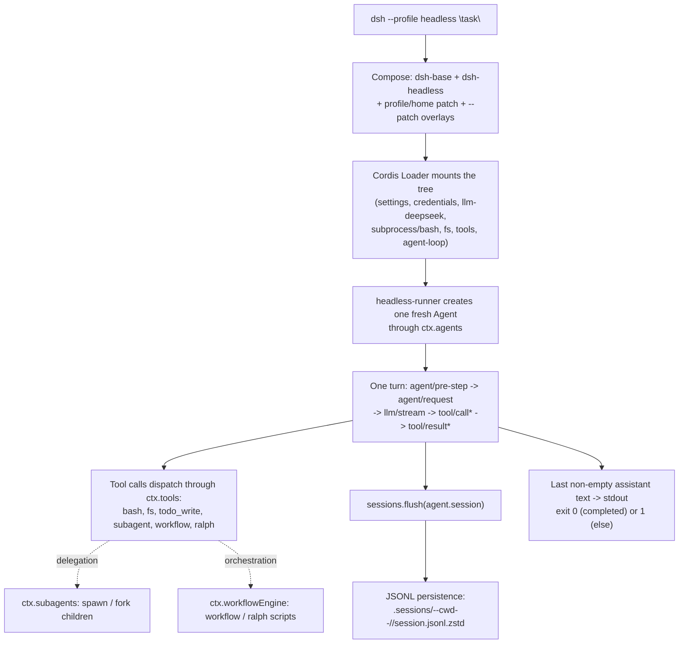

## What one invocation actually boots

```sh
# repo root .env (gitignored) or exported env:
#   DEEPSEEK_API_KEY=sk-…
#   DEEPSEEK_BASE_URL=https://…   # optional; defaults to the public API
pnpm dsh --profile headless "fix the failing test in this workspace"
```

Nothing about this command is a special code path. It resolves the `headless` profile — `dsh-base` stacked with `dsh-headless` — composes it the same way any profile composes (Chapter s02), and drives exactly one turn through the same `ReactLoopAgent` every surface uses (Chapter s04). This chapter walks that one invocation end to end, using the actual test/demo composition at `examples/headless-agent/cordis.yml` as the concrete reference — it mounts the same rows the shipped `headless` profile does, minus the app-argument parsing glue, so its explanatory comments double as documentation for what the real profile boots.



## Composing the profile (back to s02)

`dsh --profile headless "task"` resolves `$DSH_HOME/profiles/headless`, whose manifest names two bundles in order: `@deepseek-ai/dsh-base`, then `@deepseek-ai/dsh-headless`. The tree composes over an empty root exactly as Chapter s02 described — each bundle's patch in list order, then the profile's own `cordis.patch.yml`, then the home-level one, then any `--patch` overlays — and you can always inspect the result before booting anything:

```sh
dsh --profile headless --dump-config
```

`dsh-base`'s patch inserts roughly seventy rows in one block over the empty root: model adapters, the session log and its JSONL persistence backend, sandbox and approval policy, `dsh-tools`/`dsh-agent-loop`/`dsh-system-prompt`, the full tool roster (bash, filesystem, skills, subagents, workflow, todo, goal, web), and telemetry. `dsh-headless` then rides directly over that base and does the three things a patch can do, in under forty lines (`packages/bundle/headless/cordis.patch.yml`): it overrides `system-prompt`'s `persona` row with a coding-agent persona naming `{{model}}` and `{{cwd}}`, it disables `hmr` (a one-shot process has nothing to hot-reload), and it inserts three new rows — `code-runtime` (Code Mode's worker-thread execution capability), `headless-startup` (the provider that reads the positional task argument through `ctx.cmdlineArgs`), and `headless-runner` itself, injected with `headlessStartup` and configured with `task: !!js ctx.headlessStartup.task`.

That `!!js` expression is the same command-line-to-config wiring pattern from the CLI behavior reference: a row's config reads a service the launcher's provider resolved, so `dsh --profile headless "run the tests"` genuinely threads its positional argument through Cordis's own dependency graph rather than through any headless-specific argv parsing inside `apps/cli`. The shipped bundle mounts no Host, HTTP server, Web runtime, or browser plugin at all — this is a direct Agent driver, not a second product entry point wearing a different UI.

The `examples/headless-agent/cordis.yml` composition used through the rest of this chapter mounts the equivalent rows directly (no `include` of the bundle patches), so its ids match one-to-one with what `--dump-config` would print for the real profile: `settings`, `credentials`, `llm-deepseek`, `subprocess`, `bash`, `agent-spine` (a demo stand-in for `dsh-agent`/`agent-default-model`/`headless-runner`), `persistence`, `checkpoint-policy`, `token-meter`, `compaction-basic`, `session-projection`, the subagent/workflow/todo rows, and the filesystem stack. The generated diagram at `examples/headless-agent/composition.md` renders this same list as a flowchart with every plugin id and package name — worth opening once to see the whole tree at a glance rather than reading it row by row here.

## One real turn (back to s04)

Once the tree settles, `headless-runner`'s `run()` function (`packages/bundle/headless/src/index.ts:90-130`) does exactly five things, and every one of them is a call into a service Chapter s04 or s05 already introduced, not new headless-specific machinery:

1. Awaits `ctx.get('loader')?.await()` so every sibling plugin (tool registrations, adapters) is fully composed before an Agent is created against a half-built tree.
2. Calls `ctx.agents.create({ sessionId, meta: { cwd: process.cwd() }, agentOptions: { provider, model }, setup })` — the same `Agent` creation primitive every other surface uses, seeded from `ctx.agentDefaultModel.currentSelection()`.
3. Calls `agent.followup(createUserMessage({ content: [...], source: { kind: 'user' } }))` — the identical `followup()` alias over `Agent.send()` that Chapter s04 traced as the entry point into a fresh turn's `next-turn` FIFO.
4. Awaits `agent.whenIdle()` twice — once to confirm the freshly created agent starts idle, once to wait out the whole turn/step/tool-call sequence to quiescence.
5. Calls `sessions.flush(agent.session)`, then reads back `agent.session.events` from the recorded `firstSeq` onward to find the last non-empty `assistant/message` text and the closing `turn/end` reason.

Nothing in this sequence bypasses the turn/step lifecycle: `agent.followup()` opens exactly the turn machinery described in Chapter s04's `turn()`/`step()`/`preStep()` walkthrough — `turn/start`, one or more `step/start`/`step/end` pairs interleaved with tool dispatch, and a `turn/end` whose `reason.kind` (`completed`, `error`, `max-tokens`, `blocked`, `aborted`) is exactly what `headless-runner` reads to decide its own process exit code. A `completed` reason exits `0`; anything else exits `1`, and an `error` reason additionally writes its code and message to stderr — a successful run's stderr stays empty.

The snapshot test fixture in `examples/headless-agent/tests/fixtures/headless-driver.ts` makes this literal: it boots the same kind of composition, drives one fixture turn, and streams every `SessionEvent` as JSONL to stdout before a final result record — that JSONL stream is test-only infrastructure, never a supported CLI output format, but it is the fastest way to actually see a full turn's event sequence (`turn/start`, `agent/inbox/spliced`, `step/start`, `user/message`, the runtime-context snapshot, `assistant/message`, `tool/call`/`tool/result` pairs, `step/end`, `turn/end`) laid out one JSON object per line.

## Which tools are on the table, and why (back to s06/s08)

Every tool call inside that turn — `bash`, a filesystem read or edit, `todo_write`, a subagent delegation, a workflow script — dispatches through the one shared `ctx.tools` pipeline Chapter s06 covered: `tool/call` logged before execution, `tools/pre-execute` (policy/permission), registered guards, `tools/execute` (around-dispatch), the tool body, `tools/post-execute`, `finalizeContent`, then `tool/result`. Headless does not get a lighter or different pipeline because it has no UI — the same guarded execution, the same session-event logging, the same replay guarantee applies whether the turn is driven from a terminal one-shot command or a browser session.

What differs between deployments is which capability seams (Chapter s08) are actually composed, and `examples/headless-agent/cordis.yml`'s comments spell out the dependency chains plainly:

- `subprocess` (`dsh-subprocess-local`) plus `bash` (`dsh-bash-local`, `timeoutMs: 60000`) give the bash executor its spawn/kill/output plumbing — the local Service Provider for the shell seam.
- `fs-local` mounted *before* `fs-observation-policy` and `tool-fs` is deliberate ordering: the observation policy requires writes and edits to target a file the agent has actually read first, so it has to be composed ahead of the model-facing tool that could otherwise skip straight to a write.
- `session-projection` is a hard dependency of the subagent catalog, not decoration: the durable subagent identity (mode/label) folds through registered projection units, and `list_agents` fails loud without that capability mounted — a direct illustration of the "misconfiguration fails loud" rule rather than a silent missing feature.
- `token-meter` and `compaction-basic` (`thresholdRatio: 0.8`, `retainRatio: 0.16`) are what actually keeps a long headless run inside its context window — the same compaction seam Chapter s14 covers, mounted here with concrete numbers rather than left abstract.

Because this is all ordinary Cordis composition, the named overlay files sitting beside `cordis.yml` in `examples/headless-agent/` are worth treating as a menu, not a monolith. Each one takes the base composition and inserts, overrides, or disables exactly the rows needed to demonstrate one feature in isolation:

| Overlay | What it turns on |
|---|---|
| `goal.cordis.yml` | Inserts `dsh-goal` + `tool-goal` — same-session persistent objectives, independent of subagent/workflow delegation |
| `advanced.cordis.yml` | Repoints the agent at `deepseek-v4-pro`, sets `tools.mode: both`, and inserts `dsh-code-runtime-worker-thread` + `dsh-cordis-host-runner` + `dsh-tool-cordis` — Code Mode plus the self-modification tool from Chapter s18 |
| `e2b.cordis.yml` | Layers over `advanced.cordis.yml`, disabling the local subprocess/filesystem providers and inserting E2B-backed FS, subprocess, PTY, and LSP — one sandbox substrate swap, same model-facing tools |
| `pty.cordis.snapshot.yml` | Inserts `dsh-terminal` + `dsh-tool-terminal` under `danger-full-access` — the persistent terminal seam from Chapter s17, off by default |
| `subagent-inheritance.cordis.snapshot.yml` | A red/green anchor proving a parent's session-scoped `read-only` override actually confines a delegated child, even though the deployment default is `workspace-write` |
| `retry.cordis.snapshot.yml`, `compaction.cordis.snapshot.yml`, `credentials.cordis.snapshot.yml`, `semantic-checkpoint.cordis.snapshot.yml`, `workspace-context-resume.cordis.snapshot.yml`, `subagent-diagnostic.cordis.snapshot.yml`, `subagent-settlement.cordis.snapshot.yml` | Keyless replay-driven compositions isolating provider retry, context-overflow compaction, missing-credential UX, interrupted-session resume, workspace-instruction reconciliation, and subagent catalog/settlement edge cases |

None of these need a live model key to inspect — most disable `llm-deepseek` and insert `dsh-llm-replay` or a fixture backend instead, which is exactly how the snapshot suite proves each isolated feature deterministically. Running `pnpm dsh --profile headless --patch <path-to-one-of-these>.cordis.yml "task"` against the real `headless` profile is the fastest way to see one feature's wiring without reading the whole base composition.

## Subagents and workflows in this profile (back to s12/s17)

The composition mounts both delegation surfaces from the subagent seam (Chapter s12) side by side. `subagent-spawn-in-process` and `subagent-fork-in-process` register the two in-process backends behind `ctx.subagents`; `tool-subagent` (`provider: spawn`, `toolName: subagent`, `backgroundMode: continuable`, `maxDepth: 1`) exposes ordinary fresh-child delegation to the model, while a second `tool-subagent` registration (`provider: fork`, `toolName: subagent_fork`, `backgroundMode: one-shot`, `enableRunInBackground: false`) exposes completed-prefix forking under a different tool name. The comment on that second row is worth internalizing: fork stays one-shot in this composition because a continuable child's `report` tool and prompt section would have to precede the inherited history a fork already reuses, and this example mounts no task service for `run_in_background` to depend on — both are composition-specific choices, not seam limitations.

`workflow-worker-thread` plus `tool-workflow` give the model a `workflow` tool: a JavaScript orchestration script whose `agent()` calls fan out through the same `spawn` backend, letting one script coordinate several children with phases and structured results rather than one delegation call at a time. `tool-ralph` sits beside it as a second, independently loaded consumer of the same `ctx.workflowEngine` — it demonstrates a fixed, specialized orchestration policy (immutable objective, fresh child per round, shared workspace as the only cross-round memory) as an ordinary plugin, proving that Ralph-style iteration required no changes to `agent-loop`, the workflow engine, or the same-session goal domain to add.

All of this delegation still respects the delegated-policy rule from the subagent README: an in-process child's approval policy is pinned to `never` at the delegation boundary regardless of the parent's own policy, and its sandbox scope is captured from the parent at delegation time — a child asking for wider access is rejected deterministically rather than left waiting on an approval prompt nothing is watching.

## Where persistence actually writes (back to s15)

`persistence` (`dsh-session-persistence-jsonl`, `root: './.sessions'`) is the durable backend behind every session created in this composition, including the top-level headless run and any subagent's own session. Every session gets one append-only logical JSONL log, laid out as:

```text
.sessions/
  --<normalized-cwd>--/
    <encoded-session-id>/
      session.jsonl.zstd       # default: checksummed header frame + append frames
      session.jsonl             # only when compression: 'none'
```

The composition's `compression` value is itself conditional — `!!js "process.env.DSH_SNAPSHOT === undefined ? 'zstd' : 'none'"` — so a real run compresses with Zstandard while the snapshot test harness writes raw, line-readable JSONL it can diff directly. The header line is written once and is immutable (`{ type: 'session', version, id, cwd?, createdAt, parentSession?, delegationDepth, agentPreset? }`); every later logical line is either a `SessionEvent` verbatim or, when three or more consecutive same-block `assistant/chunk` deltas qualify, one packed chunk row that reconstructs every member's `seq`/`time` losslessly. Materialization is lazy — `create()` writes nothing, and only the first `append` actually publishes a file — which is why a headless run that fails before any tool call or assistant message can leave nothing on disk at all. `checkpoint-policy` (`dsh-session-checkpoint-policy`) sits beside persistence to decide when a session is safe to treat as a resumable checkpoint versus mid-flight.

The `flush()` call inside `headless-runner` is the point where the run's own final quiescence becomes durable: `sessions.flush(agent.session)` drains any pending write batch before the runner reads back events to decide its stdout text and exit code, so a completed headless run's transcript is guaranteed on disk by the time the process actually exits — not merely queued.

## The sibling automation surface (back to s19)

`examples/acp-agent/` is the other runnable example in the same neighborhood, and it is worth knowing what it changes relative to headless rather than treating it as unrelated. Where headless is a one-shot process that submits one task and exits, `@deepseek-ai/dsh-acp-demo` is a long-lived JSON-RPC stdio server implementing the [Agent Client Protocol](https://agentclientprotocol.com): it creates one fresh agent per `session/new`, persists sessions to JSONL exactly as headless does, and keeps stdout protocol-pure — no logger writes there, only newline-delimited ACP JSON-RPC, with diagnostics on stderr instead. It is meant for parent agents, subagent providers, and other programmatic clients, not for a human at a terminal.

```sh
pnpm run demo:acp             # needs DEEPSEEK_API_KEY
```

The two examples share the same DeepSeek adapter, the same sandboxed bash/filesystem stacks, the same compaction and subagent/workflow machinery — what differs is the entry shape (one task versus a session-oriented RPC protocol) and the permission surface (ACP resolves `workspace-write` per session `cwd`, escalating through `session/request_permission` on a model retry, rather than headless's single fixed process-wide sandbox scope).

## Recap: the same six seams, wired differently each time

Running `pnpm dsh --profile headless "task"` exercises the identical set of concepts every other surface in this course exercises — Cordis composition, the turn/step loop, the guarded tool pipeline, capability seams, subagent/workflow delegation, JSONL persistence — with one deliberate constraint: no Host, no HTTP server, no browser client, one task in and one printed answer out. That constraint is what makes it the cleanest place to actually watch a complete turn happen, and the overlay files in `examples/headless-agent/` are the fastest way to isolate any one of those seams for closer inspection without wading through the whole composition at once.
