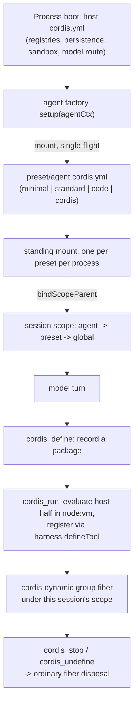

## Two composition mechanisms, neither a capability seam

This chapter covers two mechanisms that let one Cordis process run differently for different sessions and different moments in a session. Neither is a capability seam in this course's sense — a Service Definition plus one or more Service Providers plus a Consumer, swappable without touching the others. The generated [`docs/capability-seams.md`](https://github.com/deepseek-ai/deepseek-harness/blob/47f943859bef60e4160492346772ded9b24f765a/docs/capability-seams.md) classifies every `ctx.<key>` row's `Role`, and it settles the question directly: `ctx.agentPresets`, `ctx.dynamicCordisRunner`, and `ctx.cordisInspect` are all tagged `core`, never `seam`.

That classification is not an oversight to work around. Neither mechanism has a family of interchangeable backends behind one interface:

1. **Agent presets** (`packages/preset`) are not "how a preset composes" behind a swappable Definition/Provider trio — there is one `AgentPresets` service, one mounting algorithm, and no second implementation a deployment might swap in. What varies is the *content* of the `cordis.yml` a preset points at, not the mounting mechanism itself.
2. **The self-referential Cordis toolset** (`packages/extensions`) is not a pluggable sandbox family either — there is one `node:vm` realm shape, one guard, one registry. What varies is the model-written code a session mounts into it.

Both are built directly on primitives Cordis and `dsh-scope` already provide — registration scope layering, the `Include`/`group` loader vocabulary, fiber lifecycle — rather than on a seam of their own. A preset is a composition point that *uses* those primitives to give one session a different tool set; the toolset is an introspection and mounting point that uses the identical primitives to let a turn extend that same session's tool set live. Understanding both, then, is mostly a matter of seeing what was already there and asking what minimal new capability makes it reachable from a whole `cordis.yml` (Part 1) or from a single model turn (Part 2).

## Part 1: Agent presets — one process, many compositions

### The composition split: host plane vs. agent plane

A `dsh` process boots one `cordis.yml` that assembles the **host composition** — plugins the loader mounts once, before any session exists. Historically, every session ran under that fixed set. Presets fork the model-visible half of that set out per session:

| Plane | Instances | Contents |
|---|---|---|
| Host | one per process | The registries themselves (`tools`, `systemPrompt`, `agents`, `agent-loop`, `sessions`), cross-session facilities (persistence, query, projections, storage, settings, credentials, telemetry), subagent providers, the web host |
| Agent | one per session | What a single agent contributes to those registries: tool plugins, persona and prompt sections, compaction policy |

A **preset** is a directory holding one `agent.cordis.yml`. The agent factory's `setup(agentCtx)` hook mounts that file as a Cordis `include` subtree plugged directly into the agent's own scope context — the one supported call site, because `setup` runs before the agent is published, so a rejected mount rolls the whole `ctx.agents.create()` call back rather than leaving a half-composed session. Entry contexts chain to the context a subtree was plugged into, so every plugin row inside the preset registers into *that agent's* scope layer and unwinds entirely when the agent is torn down. No registry gained a new tier; the agent scope that already existed is simply where the whole file lands.

Model routing deliberately stays out of this. `installAgentLlmTarget` is the per-agent seam for provider, model, and reasoning effort; an LLM adapter mounted inside a preset would never be resolved by `agent-loop`, because the loop lives on the host plane.

### The shipped roster

The deployment ships four presets under `apps/cli/config/agent-presets/`, and that directory listing *is* the roster — the design deliberately avoids a second list that could drift from it:

- **`minimal`** — a two-tool coding agent. Its persona is `complete: true`, so it becomes the *entire* system prompt: no harness identity opener, no tool guidance, no runtime-context snapshot. The model gets exactly `bash` (persistent) and `str_replace_editor`, with local filesystem and PTY services isolated to this preset alone.
- **`standard`** — the full coding agent: file editing, shell, filesystem/web search, skills, plan mode, goals, subagents, and workflows.
- **`code`** — everything in `standard`, plus one added row, `tool-presentation` configured for `mode: code` (Code Mode): instead of one tool call per action, the model writes a TypeScript program against a generated SDK and `run_code` executes it.
- **`cordis`** — everything in `standard`, plus the self-modification toolset covered in Part 2, a persona that explains the two-plane split, and a skill that teaches composition authoring.

`code` and `cordis` are each a *full copy* of `standard` with one addition layered on top, not a diff format. The `dsh-agent-presets` package's Known Limitations name this cost directly: "a copy is a snapshot that drifts" — there is no patch semantics at this layer (that belongs to the `dsh-bundle` `cordis.patch.yml` mechanism), so upgrading the deployment does not propagate into copies, and the shipped set accepts that cost itself so the whole assembly stays readable in one file per preset.

### Isolation is the default, and it is measured

Mounting a preset subtree is per-session by default: a twelve-row composition costs roughly 3ms and 600KB per session, per the [per-session preset Agent Note](https://github.com/deepseek-ai/deepseek-harness/blob/47f943859bef60e4160492346772ded9b24f765a/.agents/notes/implemented/architecture/2026-08-03-per-session-agent-presets.md). That number matters for a design decision — isolation is cheap enough to make it the default rather than something a preset has to opt into, so a preset authored by a user or by an agent gets the smallest possible blast radius automatically.

A preset that genuinely owns something expensive or process-scoped opts *into* sharing with Cordis's own `isolate` vocabulary. A named label is a process-global realm — two subtrees naming the same label resolve to the same instance — while `isolate: <name>: true` gives each mounting session its own private instance of that name. The `code` preset's header comment spells out the rule for a service row directly:

```yaml
# A service row here MUST sit inside a group carrying an `isolate` realm.
# Without one it publishes into the root realm, where it is process-global
# rather than per-session and the second session mounting this preset collides
# with the first; `dsh-agent-presets` rejects that at mount. `true` means an
# entry-local realm — one private instance per mounted session, which is the
# default this deployment wants. A shared label would instead pool one instance
# across every session naming it.
```

`dsh-agent-presets` rejects a bare, unrealmed service row at mount time rather than letting the collision surface as a silent, unobserved rejection later.

### What a mount rejects

`mount()` proves the composition usable itself, because a directly-plugged subtree never links to a Loader `Entry` and so is invisible to `ctx.loader.entries()` and the ordinary boot audit. Three things fail it:

- **An unscoped target.** Mounting into a context carrying no agent scope would register the preset's rows globally, for every agent in the process.
- **A row that never became usable** — a row still waiting for a service the composition never supplies.
- **A row that published a service into the root realm** — process-global, so the second preset mounting it collides with the first. The package invariant re-checks this on every service notification, because a row publishing from a timer or an async continuation would otherwise escape a one-shot audit.

### Standing mounts: one composition per process, not per session

A later refinement changed *how many times* a preset's subtree exists without changing what a preset file looks like. The original per-session design mounted one fresh Entry per session. The [standing-mounts Agent Note](https://github.com/deepseek-ai/deepseek-harness/blob/47f943859bef60e4160492346772ded9b24f765a/.agents/notes/implemented/architecture/2026-08-08-per-preset-standing-mounts.md) explains why that broke three host readers that assumed the registry surface was static: a cold `session.history` read found no presenters (every card degraded to a generic renderer), the projections block dropped preset-registered keys (a client treats an omitted key as capability absence and clears the row), and the Typert gateway resolved `goals` on the host root and got `service-unavailable`.

The fix keeps one composition per preset **per process**, mounted once under a synthetic standing scope; each session joins by binding its own agent scope key as a *child* of that standing scope (`bindScopeParent`). Two `dsh-scope` mechanisms carry the rest: registration views walk the parent chain `agent → preset → global` (nearest shadowing farthest), and scoped event dispatch admits listeners tagged with an ancestor of the carrier key — upward only, so a sibling preset's listeners stay deaf to another preset's agents. This is why the stateful preset plugins (`plan-mode`, `token-meter`, `compaction-basic`) already key their state by Session/Agent rather than by fiber identity — sharing one standing instance across sessions on the same preset is a return to their original design, not a rewrite.

### Which preset a session runs, and why the header alone is not enough

A session's durable header names the preset it was **created** with. That is a creation fact and stays frozen. If a still-blank session later switches presets (`recompose`), that switch is logged as a distinct `agent-preset/selected` session event appended after the swap commits — required by the model-visible ⟺ logged rule, because the preset decides every tool schema and prompt section the model can see. `resolveSessionPreset(session)` is therefore the function every reconstruction path (resume, fork, a cold transcript's presenters, a picker's summary) actually calls: it resolves header-plus-events, never the header alone. Reading only the header would rebuild a switched session under the composition it was *created* with, replaying tool-call history the new tool set cannot act on.

Switching is allowed **only while a session is blank** — once any turn has run, that history was produced under the current preset's exact tools, and swapping would strand logged tool calls the new composition cannot make. `agentPreset.select` returns `agent-preset-locked` once a turn exists. A switch itself is unmount-then-mount: it resolves the new preset before tearing anything down, and restores the previous composition if the new mount fails, because two compositions can never coexist (they'd fight over the same tool names in one layer).

### `persona`: the row that changes identity, not just tools

Tools are only half of "what an agent is." [`dsh-persona`](https://github.com/deepseek-ai/deepseek-harness/blob/47f943859bef60e4160492346772ded9b24f765a/packages/preset/persona/README.md) is the row that lets a preset change the other half — the agent's identity — because [`dsh-system-prompt`](https://github.com/deepseek-ai/deepseek-harness/blob/47f943859bef60e4160492346772ded9b24f765a/packages/core/system-prompt/README.md) owns the deployment persona as its own config field and registers that section once, process-wide. Without a scoped row of its own, a preset could swap an agent's tools but never its stated identity.

`dsh-persona` is deliberately **scope-only**: mounting it outside an agent scope collides head-on with the registry's own `deployment:persona` registration and fails loud. That is not a rough edge — the whole point of the row is to *shadow* the deployment persona for one agent, and the deployment persona already has an owner.

Its config has two fields worth internalizing:

- `text` (required) — persona prose, rendered as the `deployment:persona` section at order 0. It is a template: `{{model}}`, `{{cwd}}`, and other prompt variables resolve strictly at render time, not at assembly time.
- `complete` (default `false`) — when `true`, the prompt registry restores this exact persona as the *sole* system-prompt section after assembly still resolves contexts, tools, variables, and cooperative listeners. No identity text, tool guidance, or listener contribution can append anything. This is exactly how `minimal` achieves its fixed, two-tool-only prompt.

`includeRuntimeContext` (default `true`) is the third knob: `false` suppresses every dynamic runtime-context snapshot (sandbox policy, approval policy, delegation state, …) for this agent scope without disabling the services that would have produced them — `minimal` sets this to `false` alongside `complete: true` to keep its prompt genuinely fixed.

### Reading a real preset file

The `minimal` preset is short enough to read end to end. Its persona row:

```yaml
- id: persona
  name: '@deepseek-ai/dsh-persona'
  config:
    text: You are a helpful software engineer assistant.
    complete: true
    includeRuntimeContext: false
```

and its filesystem row, isolated so the bare local provider shadows the host's sandboxed one **only for this preset**:

```yaml
- id: filesystem
  name: cordis:group
  group: true
  isolate:
    fs: true
  config:
    - id: fs-local
      name: '@deepseek-ai/dsh-fs-local'
      config:
        cwd: !!js process.env.DSH_CWD ?? process.cwd()
    - id: str-replace-editor
      name: '@deepseek-ai/dsh-tool-str-replace-editor'
      config:
        maxOutputChars: 16000
```

Compare this to `standard`'s and `code`'s far larger files, which add skills, plan mode, goals, subagents, and workflows, plus (for `code`) the `tool-presentation` row that switches the whole tool-call protocol to Code Mode. Every added capability is still exactly one more plugin row — nothing about the mechanism changes as the roster grows.

### Authoring is copy-only, and writes are privileged

A model or a person cannot submit raw preset text through the roster service. `ctx.agentPresets.copy(from, id, name?)` is the *only* authoring write: it copies a whole existing preset directory — composition, metadata, skill directories, assets — into the first `user`-trust root, re-tightens permissions to owner-only, dereferences symlinks, and rewrites `preset.yml` to keep the source's `description` while dropping its `name` and roster `order`. No caller ever supplies composition text directly, so a copy grants nothing the roster did not already carry, and a copy is exactly as loadable as its source.

`copy()` refuses three things before anything lands on disk: an id that fails `[a-z0-9][a-z0-9-]*` (containment is a property of the id itself, checked before it becomes a directory name — `../escape`, `a/b`, and an absolute path are all rejected as ids, not sanitized), an id already taken by any root, and an unknown source. `remove()` similarly refuses any preset that ships with the deployment, because the shipped copy is the known-good baseline a broken local preset gets compared against.

`read`, `write`, and `remove` are **loopback-pinned** RPCs. The Agent Note is direct about why: "a composition names the plugins a session runs, so reading one is reconnaissance and writing one is arbitrary capability." `list` and `select` stay ordinary, reachable methods — a LAN client's picker genuinely needs them, and pinning only the *switch* while leaving `session.create`'s `agentPreset` field open would just move the same capability one method over. Note the framing here: the capability being gated is not something the preset *grants* — the deployment's own default preset already carries `bash` and filesystem tools, so any caller allowed to start a session at all can already run commands as this process. The privilege gate exists because editing a composition is qualitatively different from choosing one off a menu, not because a preset elevates trust beyond what session creation already implies.

## Part 2: The self-referential Cordis toolset — the agent edits its own runtime

### The problem this solves

Everything in this harness is a Cordis plugin — but until this toolset existed, the agent running *inside* that plugin runtime had no way to see or touch it. It could not enumerate the services and events around it, extend itself with a new tool mid-session, or compose capabilities it invented on the spot. The [self-referential toolset Agent Note](https://github.com/deepseek-ai/deepseek-harness/blob/47f943859bef60e4160492346772ded9b24f765a/.agents/notes/implemented/feature/2026-07-08-self-referential-cordis-toolset.md) frames the design problem precisely as three correctness hazards that come bundled with "let the model run code":

1. **Model-written registration must be validated where it happens** — a malformed tool schema must fail at registration time, not silently corrupt a later prompt assembly.
2. **Model-written code must call service APIs whose source it has never seen.** Guessed method signatures — and worse, guessed return-value shapes — cost many steps of blind probing.
3. **Everything the model mounts must be fully disposable**, both on model demand and via ordinary plugin lifecycle when the host reloads, or a long session accretes orphaned listeners and tools.

### The package group

| Package | Role | ctx key |
|---|---|---|
| [`tool-cordis`](https://github.com/deepseek-ai/deepseek-harness/blob/47f943859bef60e4160492346772ded9b24f765a/packages/extensions/tool-cordis/README.md) | Model-facing tools registering on `ctx.tools` | `ctx.tools` |
| [`cordis-host-runner`](https://github.com/deepseek-ai/deepseek-harness/blob/47f943859bef60e4160492346772ded9b24f765a/packages/extensions/cordis-host-runner/README.md) | The definition registry, the `node:vm` sandbox for host halves, and the request-run round trip | `ctx.dynamicCordisRunner`, `ctx.cordisInspect` |
| `cordis-client-runner` | The browser half of a dual-half dynamic package | client face |
| `ui-cordis` | The frame-wide panel that operates every definition | client face |

`tool-cordis` and `cordis-host-runner` split along the same reusable pattern the rest of the harness follows: the runner owns the sandbox, the vm lifecycle, and cross-session bookkeeping; the tool package owns only the model-facing verbs and schemas. Neither package is useful without the other — a composition with `tool-cordis` but no runner never activates its tools.

### The seven verbs the model sees today

The toolset's design predates the code presently shipping. The `2026-07-08` Agent Note above still documents an earlier three-tool shape (`cordis_inspect` / `cordis_mount` / `cordis_unmount`) that has since been superseded in the actual `tool-cordis` source without the note being rewritten to match — the note's design rationale (sandbox semantics, the trust stance, the generated-catalog argument) remains current, but its tool table does not. The code the model actually calls today registers seven tools, confirmed directly in `tool-cordis/src/index.ts`:

| Tool | What it does |
|---|---|
| `cordis_inspect_list` | Lists every Cordis Inspect Provider the Host currently knows, Host-local and the latest manifests synchronized from a Client page — platform, purpose, methods, and input/output schemas for each |
| `cordis_inspect_query` | Runs one read-only query an Inspect Provider explicitly declared, by exact `platform`/`provider`/`method` from `cordis_inspect_list` |
| `cordis_inspect_self` | Read-only report over dynamic Cordis objects the current session owns: Plugin summaries, then (given a `pluginId`) version pointers and Package summaries, then (given `pluginId` + `packageId`) exact source and runtime diagnostics |
| `cordis_define` | Records an immutable Package (`name`, `purpose`, a host half `code` and/or a browser half `client`) after syntax-checking both halves. Nothing runs yet — the user sees a card with a start control |
| `cordis_run` | Activates one exact Package: `mode: "run"` for first activation, restart, or rollback; `mode: "update"` to switch from the current Package to a different one |
| `cordis_stop` | Tears down the current Run while retaining the Plugin, every Package, and version pointers, so it can run or update again later |
| `cordis_undefine` | Stops the Plugin if needed, then permanently deletes it and every Package, grant, and version pointer |

`cordis_inspect_list`/`_query` replaced an earlier hand-maintained inspect design; `cordis_define`/`cordis_run` split what used to be one mount call into record-then-activate, so a definition can be reviewed as a conversation card before anything executes. Every verb is **session-scoped**: a package is visible and controllable only in the session that defined it, even though it runs in the shared DSH process and can affect other sessions once running. Dynamic packages live only in process memory — they create no plugin file, install nothing, change no `cordis.yml` or personal configuration, and do not survive a `dsh` restart or get promoted automatically. Keeping an experiment means asking the agent to implement it as a normal plugin or bundle through the ordinary development workflow — the toolset is explicitly for probing, not shipping.

### Why the API and event catalogs are generated, not hand-written

`cordis_inspect_query` against the `Service`/`Event` providers doesn't read from a hand-maintained reference table — an early version tried exactly that, and the Agent Note records why it was replaced: "a hand table drifts from the JSDoc the moment a signature changes and nothing gates the drift." Instead, `tool-cordis/src/api-catalog.ts` is generated by the same AST walk that produces `docs/subsystems/*.md` — the very page this chapter cites for the extensions subsystem's own Cordis API. `pnpm run gen-cordis-api` regenerates it and `pnpm run verify-cordis-api` gates its freshness in `doc-sync`, so a public-signature or JSDoc edit anywhere in the workspace cannot ship without the catalog the model reads staying in sync.

At runtime, the query intersects that static catalog with the *live* service store: what is running comes from the store, what each service *can do* comes from the catalog, and a live service the catalog doesn't cover (for example, one a mounted dynamic package itself provided) is still reported as reachable, just with no signatures, rather than being silently omitted. Two judgment calls live in the reporting code rather than in the raw reflection data: only *callable methods* are shown (not state, and not symbol-keyed internal seams between plugins that a package façade cannot reach anyway), and only `ctx.<key>` reads a mounted host half can actually make are named — a classification of `injectable` / `not-a-service` / `other-face` pinned and gated so a newly declared key can't silently invite the model to `inject` something that will never arrive.

### Sandbox semantics: containment for correctness, not a security boundary

The host half of a dynamic package runs as an async-function body in a fresh `node:vm` realm. Sandbox globals are deliberately sparse:

```ts filename="packages/extensions/cordis-host-runner/src/sandbox.ts"
export function createSandbox(id: string, harnessExtras: Record<string, unknown> = {}): object {
  const sandbox = {
    ...nodeApiTraps(),
    console: taggedConsole(id),
    harness: { defineTool: sandboxDefineTool, registerTool: sandboxRegisterTool, ...harnessExtras },
    // Web APIs absent from fresh vm contexts — made available so the model
    // can encode/decode base64 without Buffer (which is also absent). Host
    // closures over Buffer, never Buffer itself.
    btoa: (s: string) => Buffer.from(s, 'utf-8').toString('base64'),
    atob: (s: string) => Buffer.from(s, 'base64').toString('utf-8'),
    TextEncoder,
    TextDecoder,
  }
  createContext(sandbox)
  patchDualRealmInstanceof(sandbox)
  return sandbox
}
```

A tagged write-through `console`, the `harness.defineTool` / `harness.registerTool` registration pair, encoding primitives a fresh vm context otherwise lacks, and callable traps over withheld Node APIs (`require`, the timer family, `fetch`) that throw a message naming the Cordis alternative to use instead. Only function-shaped globals are trapped — `process` and `Buffer` stay `undefined`, so a `typeof` feature probe stays inert instead of detonating a throwing accessor.

The mounted plugin body receives a **whitelist context façade**, never the raw framework `Context`: framework plumbing and context-valued returns are rejected outright, service reads require a declared `inject` (preserving ordinary Cordis activation and unload semantics), and `ctx.tools.get` exposes only the schema view so mounted code cannot bypass `ToolRuntime.execute` by calling a tool definition directly.

None of this is a security boundary, and the Agent Note is explicit that the traps and façade are there for **correctness** — steering model-written code onto Cordis services and away from leak-prone Node built-ins it would otherwise guess wrong about — not for containment:

> "the capabilities the façade exposes (`ctx.shell`, `ctx.fs`, `ctx.web`) reach the real runtime, so it is not a security boundary. A real one (separate process, permission prompts) was out of scope for a dev/opt-in toolset and would fight the entire point — handing the model the live runtime."

Both package READMEs make the same statement in nearly identical words: the `tool-cordis` README says to "treat this toolset like bash access," and the `cordis-host-runner` README says to "treat a dynamic package like bash access." Host-realm helpers on the sandbox global remain reachable, so package code can, in principle, reach Node despite the traps. A mounted plugin can call an injected service with the host executor's own privileges and reach the real filesystem and web services. This toolset is loaded exactly as deliberately as a `bash` tool row — an opt-in development capability, not a hardened default — and that is why only the `cordis` preset carries it, never `standard`.

### What actually bounds the blast radius, precisely

Given that the sandbox is not a security boundary, three narrower, real mechanisms do the actual containment work:

- **Ordinary Cordis fiber lifecycle, not a bespoke cleanup path.** Every mounted host half runs as a child fiber of one internal `cordis-dynamic` group beneath the runner, so ordinary fiber disposal — the same mechanism that tears down any plugin subtree — handles both a manual `cordis_stop`/`cordis_undefine` and toolset unload or process restart. `startHostHalf` awaits the child fiber's full settlement before returning; a startup failure disposes the fiber and rethrows before `cordis_run` ever reports success, rather than leaving a half-registered plugin live.
- **Session scoping on every verb.** A definition another session created reads as *absent*, not *forbidden*, to a session that doesn't own it — nothing leaks across sessions through the tool surface, and a package's effects (once running) are the only channel that can cross sessions, not the inspection or definition surface.
- **The canonical tool-output contract, enforced at the boundary crossing.** `harness.defineTool` rebuilds the output schema and projectors in the *host* realm and snapshots the body value as host-owned JSON before the registry lets it through — a mounted tool cannot hand back a live vm-realm object and call it a result.

None of these make arbitrary code safe. They make the mechanism the *same* mechanism as everywhere else in the harness — Cordis registration, fiber disposal, session scoping, the tool-output contract — rather than a parallel, weaker copy of it built just for dynamic code. Self-modification here is bounded specifically in the sense that a mounted plugin cannot register anything the loader's own registries wouldn't validate for an ordinary plugin, and cannot outlive its fiber. It is explicitly **not** bounded in the sense of restricting what a *validly registered* plugin's code can subsequently do at runtime — that authority equals whatever the mounting session's underlying services already permit.

### Cross-mount composition: it's just `provide`/`inject`

Because a mounted plugin is an ordinary Cordis plugin under the hood, two independently defined dynamic packages compose through the framework's own service semantics, not a bespoke API: mount A calls `ctx.provide('foo', value)`; mount B declares `inject: ['foo']` and activates the instant `foo` exists. Mount B first is fine too — it stays pending, naming the missing service in its own inspect report, until A provides it. Unmounting A sends B back to pending (its own registrations unwind), and a later re-provide re-runs B's `apply` through a fresh sandbox façade. A duplicate provide fails loud, naming the fiber that already owns it — the identical rule an ordinary two-plugin composition would hit.

### The `cordis` preset ties both halves together

The `cordis` preset is where Part 1 and Part 2 meet concretely: it is `standard` plus the self-modification toolset, so *this specific preset* is how a deployment offers self-modification to one session without granting it to every session. Its own header comment states the trust framing directly:

```yaml
# TRUST: `cordis_mount` evaluates model-written JavaScript against the live
# runtime, and a composition this agent writes becomes a preset other sessions
# mount. Treat a session on this preset as shell access — the toolset's own
# documentation makes the same statement.
```

(That comment still says `cordis_mount` — the composition's own header comment, like the Agent Note, has not been updated to name the current `cordis_define`/`cordis_run` verbs; the trust statement it makes is exactly as true of the current tool names.)

It adds exactly three rows beyond `standard`: `tool-cordis` itself, plus `skill-filesystem`/`tool-skill` configured to load a bundled skill, `editing-cordis-compositions`, from a directory that travels with the preset (`customSkillDirs` resolved against the preset's own `baseUrl`, not the user's skill root) — because that skill teaches *this deployment's* two-plane split specifically, and a preset is the unit that gets copied and edited.

The preset's persona is also rewritten, not merely inherited from `standard`, to make the agent aware of the very mechanism it's running under:

```yaml
text: |-
  You are a coding agent powered by the {{model}} model, running on the DeepSeek Harness. Your working directory is {{cwd}}.

  You can read and modify the harness you run on. Its composition is Cordis: every capability is a plugin row in a `cordis.yml`, and an agent preset is one such file mounted for a single session.

  Two planes decide where an edit belongs. The HOST composition holds the registries and anything shared across sessions [...]. An AGENT PRESET holds what one session contributes to those registries [...].

  Presets you author live one directory per preset under `${DSH_HOME:-$HOME/.dsh}/.agent-presets/<id>/` [...]. NEVER edit or delete the shipped preset install [...]: an upgrade overwrites it, and corrupting the `cordis` preset would disable this very mode.
```

That last sentence is worth sitting with: the persona explicitly warns the agent that damaging the shipped `cordis` preset would disable the preset *currently composing this very agent*. The `editing-cordis-compositions` skill this preset ships enforces the same rule mechanically for any agent that loads it — "Never edit, delete, or overwrite a preset that ships with the deployment," with copy-then-edit as the only sanctioned path to changing what a shipped preset does. This is self-modification with a hard-coded floor: the agent can extend and reshape its *own* session's composition and can author whole new presets, but the mechanism that makes presets available to future sessions at all is off-limits to the very toolset that could otherwise reach it.

## The common thread

Both mechanisms in this chapter answer "how does one agent get a different runtime than its siblings" by reusing the same scope-registration primitive `dsh-scope` already provides, rather than inventing a parallel configuration or plugin system:

- A **preset** points a whole `cordis.yml` at one agent's scope *before* the agent starts, and the mounted subtree lives (in the standing-mount design) for the process, shared by every session that binds its scope as a child of it.
- **`cordis_define`/`cordis_run`** let the model add *individual* plugin rows to its own session's registration surface *during* a turn, through the identical Cordis `apply`/`inject`/`provide` vocabulary a `cordis.yml` row uses — just evaluated in a `node:vm` sandbox instead of imported from a package file, and torn down through the identical fiber-disposal path any plugin unmount uses.

Neither mechanism is a new kind of authority. A preset is exactly as privileged as the plugins it names — the `trust` field on `AgentPreset` exists to let a UI *display* that fact, not to enforce anything beyond it — and a dynamic package mounted by `cordis_run` is exactly as privileged as the services the mounting session's preset already exposed to it. What both add is composability at a finer grain than "restart the process with a different `cordis.yml`": per-session at the preset layer, and per-turn at the self-modification layer. And per the [`docs/architecture.md` extension-point table](https://github.com/deepseek-ai/deepseek-harness/blob/47f943859bef60e4160492346772ded9b24f765a/docs/architecture.md#where-new-behavior-goes), "give one session a different capability set" is documented as exactly one row — "compose an agent preset; a service row there needs an `isolate` realm" — alongside every other extension point in the harness, seam or not.


