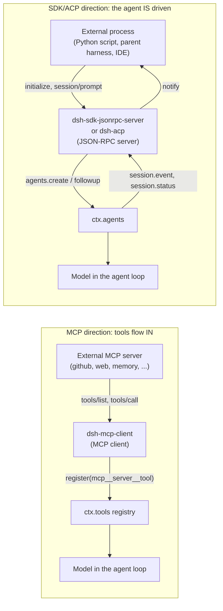

## Two directions of connecting to the outside world

Everything in the harness so far has been about one running agent: how it maintains a session, calls tools, asks a human for approval, compacts its context. This chapter covers the two places where the harness's process boundary itself becomes the subject — where the agent either reaches *out* to another program's tools, or *is itself* the thing another program drives.

These are opposite directions, and the codebase keeps them in unrelated package groups because the roles do not overlap:

- **`packages/mcp/mcp-client`** makes the harness a Model Context Protocol *client*. It connects to an external MCP server (a third-party process or HTTP endpoint) and republishes that server's tools on `ctx.tools`, so the model sees them as native tools it can call — the same way it sees `bash` or `read`.
- **`packages/sdk`** and **`packages/acp`** make the harness a *server* for another process. `dsh-sdk-jsonrpc-server` and `dsh-acp` each open a JSON-RPC channel over stdio; an external program — a Python script, a parent harness, an IDE integration — speaks that protocol to create sessions, send prompts, and collect results. The harness is the thing being automated, not the thing doing the automating.



In the MCP direction, the harness process is the client and the model-facing surface grows: a new tool appears in `ctx.tools`. In the SDK/ACP direction, the harness process is the server and nothing about the model's own tool surface changes — the caller only gets to create sessions and post user messages, exactly like a human typing into a CLI would, just over a wire protocol instead of a terminal.

## `dsh-mcp-client` is not a capability seam — say this plainly

Before going further into what `dsh-mcp-client` does, name what it structurally is, because the shape invites the wrong pattern-match. A capability seam, as [Chapter 7](../s07-capability-seams-primer/README.md) established, is exactly three roles working together: a **Service Definition** that owns `ctx.<key>` and the vocabulary, one or more **Service Providers** that implement it, and one or more **Consumers** that inject it by name. MCP looks, at a glance, like it should be one — it is, after all, an entire *protocol* for pluggable tool servers, and "pluggable" is the word that usually means "seam."

It is not. Check the actual claim against the generated graph rather than the intuition: [`docs/capability-seams.md`](https://github.com/deepseek-ai/deepseek-harness/blob/47f943859bef60e4160492346772ded9b24f765a/docs/capability-seams.md) classifies every `ctx.<key>` service's `Role` as `seam`, `core`, or `bundle`. The row for `ctx.tools` — the service `dsh-mcp-client` actually registers into — reads `core`, owned solely by [`dsh-tools`](https://github.com/deepseek-ai/deepseek-harness/blob/47f943859bef60e4160492346772ded9b24f765a/packages/core/tools/README.md), with no Service Provider column at all, because `dsh-tools` has exactly one implementation. `dsh-mcp-client` does not even appear as an owner or provider anywhere in that table — it shows up only as a **Consumer edge** in the module dependency graph (`pkg_mcp_client --> pkg_tools`), the same relationship any tool-registering plugin has with the tool registry.

Walk the three-role test against `dsh-mcp-client` directly and every leg fails:

- **No Service Definition of its own.** It does not own a `ctx.<key>`. Its module doc says exactly what it is: "MCP client bridge plugin: connects to an external MCP server and registers its tools on `ctx.tools`." The service it talks to belongs to someone else.
- **No sibling Service Providers.** There is no second package that implements "being an MCP client" a different way — no sandboxed MCP client, no remote MCP client. One plugin, one mechanism.
- **Not itself swappable.** A `cordis.yml` entry is one connection to one external server. Configuring three MCP servers means loading `dsh-mcp-client` three times, once per `serverName` — that is a configuration cardinality, the same way three PowerShell scripts are three separate `bash -c` invocations, not three providers of the same seam.

What `dsh-mcp-client` actually is: a plain **Consumer** of `ctx.tools`, exactly like `dsh-tool-fs` or `dsh-tool-web` are Consumers of their respective services — except that instead of hand-writing one `ToolDefinition` per tool at compile time, it discovers an arbitrary number of them at runtime from whatever the connected server advertises, and registers each one through the ordinary `ctx.tools.register()` call every other tool-registering plugin uses. The protocol richness lives entirely on the wire between the harness and the external server; from `ctx.tools`'s point of view, an MCP-discovered tool and a hand-written one are indistinguishable `ToolDefinition` values. **One MCP server config is one plugin instance, not a role split.** The reason `dsh-mcp-client` needs its own chapter is not that it is a seam with unusual shape — it is that it is a clean example of a mechanism that looks pluggable from the protocol's own vocabulary but sits entirely on one side of an existing seam (`ctx.tools`) as an ordinary Consumer, contributing nothing to the roles the seam pattern describes.

This distinction has a real payoff for how you read the rest of the chapter: nothing below asks "what implements the MCP client role, and what could replace it?" — there is one implementation, and the question doesn't arise. Instead, the interesting design work in `dsh-mcp-client` is entirely about correctness at a process boundary it doesn't own: naming, atomic registration, and reconnection budgets, covered next.

## MCP client: bringing tools in

[`@deepseek-ai/dsh-mcp-client`](https://github.com/deepseek-ai/deepseek-harness/blob/47f943859bef60e4160492346772ded9b24f765a/packages/mcp/mcp-client/README.md) is a namespace plugin — one instance per external MCP server, configured directly in `cordis.yml`:

```yaml
- id: mcp-github
  name: '@deepseek-ai/dsh-mcp-client'
  config:
    serverName: github
    transport: stdio
    command: npx
    args: ['-y', '@modelcontextprotocol/server-github']
    env:
      GITHUB_TOKEN: !!js process.env.GITHUB_TOKEN
```

`inject = ['tools']` is the plugin's only declared dependency; `apply()` reserves the `serverName` namespace, starts a supervised connection, and awaits the connection's `ready` promise before the plugin fiber is considered active — so by the time the surrounding composition starts its first turn, every tool this server advertises is already registered, not racing to appear mid-turn.

### Naming: two names per tool, one direction of translation

Every MCP tool has a raw name from the server (`create_issue`) and a public name the model actually sees (`mcp__github__create_issue`). [`publicToolName`](https://github.com/deepseek-ai/deepseek-harness/blob/47f943859bef60e4160492346772ded9b24f765a/packages/mcp/mcp-client/src/tools.ts#L82-L102) is a pure function of `(serverName, rawName)`:

```ts filename="packages/mcp/mcp-client/src/tools.ts"
export function publicToolName(serverName: string, rawName: string): string {
  const joined = `mcp__${serverName}__${rawName}`
  const normalized = joined.replace(INVALID_NAME_CHARS, '_')
  if (normalized === joined && normalized.length <= MAX_PUBLIC_NAME_LENGTH) return normalized
  const hash = createHash('sha256').update(`${serverName}\0${rawName}`).digest('hex').slice(0, HASH_LENGTH)
  return `${normalized.slice(0, MAX_PUBLIC_NAME_LENGTH - HASH_LENGTH - 1)}_${hash}`
}
```

The clean case is verbatim concatenation. When character replacement or 64-character truncation (DeepSeek's function-name limit) would change the name, a 12-hex-char SHA-256 hash of the identity is appended so two different raw names that both normalize to the same string never collapse into one public tool. Two servers can each expose a tool called `search` and both coexist, because the namespace prefix disambiguates them — this is the same server-qualified shape Claude Code and Codex use for their own MCP integrations. The raw name is what actually crosses the wire in `tools/call`; the public name is never parsed back to recover it, and connection order or re-syncs never rename an existing tool.

### Registration is a fetch-then-swap, never a partial state

[`syncTools`](https://github.com/deepseek-ai/deepseek-harness/blob/47f943859bef60e4160492346772ded9b24f765a/packages/mcp/mcp-client/src/tools.ts#L104-L174) runs in two phases on every initial connect and every `notifications/tools/list_changed` re-sync:

1. **Fetch** — drain paginated `tools/list` into a full new generation of `ToolDefinition`s, keyed by public name. A duplicate raw name within one server's own list, or a network failure, rejects and leaves the *previous* generation registered, untouched.
2. **Swap** — dispose the previous generation's disposers, then register every entry of the new generation via `ctx.tools.register()`. If registration collides with a foreign registration already squatting on this server's `mcp__<serverName>__` namespace, the whole attempted generation rolls back — the model sees either the complete new tool set from this server or none of it, never a partial one.

This atomicity matters because a half-registered generation would be a worse failure mode than no tools at all: the model could see three of five tools from a server and have no way to know two are missing.

### Reconnection has a budget, not infinite patience

The connection supervisor in [`connection.ts`](https://github.com/deepseek-ai/deepseek-harness/blob/47f943859bef60e4160492346772ded9b24f765a/packages/mcp/mcp-client/src/connection.ts#L1-L16) restarts a dropped stdio child or HTTP connection with exponential backoff (`initialDelayMs` doubling to `maxDelayMs`, defaults 500 ms and 30 s). Consecutive failures share one budget capped at `maxAttempts` (default 10); a connection that survives past `maxDelayMs` of uptime resets that budget. The asymmetry is deliberate: an occasionally-flaky server that reconnects and then stays up recovers indefinitely, while a server that crash-loops — even one whose individual connects briefly succeed — still exhausts the cap and stops trying, unregistering its tools rather than leaving stale ones the model would call into a dead transport.

### What the model actually sees and doesn't

The canonical execution result is `{ content: JsonValue[], structuredContent? }` — the full JSON MCP result survives for programmatic callers (Code Mode). Native/model-facing rendering is lossier by design: text blocks join with newlines into one string, while image, audio, resource, and unsupported blocks become short placeholders like `[image: image/png, content discarded]`. This is a real, documented limitation, not an oversight — richer multimedia projection into model context is deferred work. Resources and Prompts, the other two MCP capability types, have no harness consumer at all; only Tools is bridged. That narrowing is consistent with the "plain Consumer" framing above: `dsh-mcp-client` consumes exactly the one MCP capability that maps onto `ctx.tools`'s existing vocabulary, and does not grow a second registry for the other two.

The [`mcp-memory` example](https://github.com/deepseek-ai/deepseek-harness/blob/47f943859bef60e4160492346772ded9b24f765a/examples/mcp-memory/README.md) makes this concrete: three default-off overlays each wire one third-party memory MCP server (Memorix, the MCP reference memory server, Engram) through the exact same `dsh-mcp-client` config shape, differing only in `serverName`, `command`, and `env`. None of them are DeepSeek-authored — the harness's job is limited to spawning the configured process (or connecting to the configured URL), discovering its tools, and exposing them under `mcp__<serverName>__<tool>`; database initialization, embeddings, and storage remain entirely the third-party server's concern. Three overlays, three separate plugin instances — not three providers behind one seam.

## SDK and ACP: being driven, not doing the driving

Where `dsh-mcp-client` is a Cordis plugin that runs *inside* a harness composition, `packages/sdk` and `packages/acp` sit on the opposite side of the process boundary from a comparable idea: exposing the harness's own agents to a caller that lives in a different process, over the same newline-delimited JSON-RPC shape MCP itself uses, but with unrelated methods, because the harness is being driven as an *agent*, not consumed as a *tool provider*.

### The protocol layer: `dsh-sdk-protocol`

[`@deepseek-ai/dsh-sdk-protocol`](https://github.com/deepseek-ai/deepseek-harness/blob/47f943859bef60e4160492346772ded9b24f765a/packages/sdk/protocol/README.md) is a pure library — no plugin, no `Config`, no registration — that both wire ends import. `JsonRpcLineTransport` frames JSON-RPC 2.0 over any caller-owned byte stream, one compact JSON object per newline-terminated line: a frame with both `id` and `method` is a request, `id` alone is a response, `method` alone is a notification, and malformed lines are silently ignored rather than crashing the channel.

The named methods it defines, from [`types.ts`](https://github.com/deepseek-ai/deepseek-harness/blob/47f943859bef60e4160492346772ded9b24f765a/packages/sdk/protocol/src/types.ts#L100-L105):

| Direction | Method | Shape |
|---|---|---|
| client→server | `initialize` | `InitializeParams` (cwd, provider, model, optional `maxTokens`) → `InitializeResult` |
| client→server | `session/prompt` | `SessionPromptParams` (sessionId, contentBlocks) → `SessionPromptResult` (`{ messageId }`) |
| client→server | `shutdown` | no params → `{}` |

And the notifications the server pushes unprompted, from [`types.ts:92-98`](https://github.com/deepseek-ai/deepseek-harness/blob/47f943859bef60e4160492346772ded9b24f765a/packages/sdk/protocol/src/types.ts#L92-L98):

| Method | Fires when |
|---|---|
| `session.event` | Any session in the runtime records a durable session-log event — the full envelope, unfiltered |
| `session.status` | An agent's whole-agent state flips `idle` ↔ `running` |
| `subagent.started` | A new child session is created (from a `parentSession` header) |
| `subagent.finished` | An in-process subagent run ends (remote subagent runs are not reported) |

`SessionPromptResult.messageId` is deliberately narrow: it identifies that the user message was durably queued, nothing more. It is not a promise about which assistant message will answer it, whether the turn will end, or what the eventual result is — steering, injected context, and other queued work can all land before the caller sees an `idle` transition. A client that wants a request/response feel has to build it itself by combining `session.event` and `session.status`; the protocol only gives the primitives.

### The server plugin: `dsh-sdk-jsonrpc-server`

[`HarnessSdkJsonRpcServer`](https://github.com/deepseek-ai/deepseek-harness/blob/47f943859bef60e4160492346772ded9b24f765a/packages/sdk/server/src/server.ts) is the plugin that actually answers these methods, `inject: ['agents']`. Its constructor subscribes to four Cordis events (`session/event`, `agent/status`, `session/created`, `subagent/end`) and forwards each as the matching wire notification. `initialize()` records the requested provider/model/cwd and, when the route is the unowned `deepseek-official` default, mounts `dsh-llm-deepseek` itself — any other unrecognized provider fails initialization outright rather than silently falling back. `prompt()` gets-or-creates one agent per `sessionId` (lazy, so a client never has to pre-declare sessions) and calls `agent.followup()` with the content blocks, returning only `{ messageId }`. `handleRequest()` is the plain three-way dispatch that ties the wire methods to those handlers:

```ts filename="packages/sdk/server/src/server.ts"
async handleRequest(method: string, params: Record<string, unknown> | undefined): Promise<unknown> {
  switch (method) {
    case 'initialize':
      return this.initialize(params as unknown as InitializeParams)
    case 'session/prompt':
      return this.prompt(params as unknown as SessionPromptParams)
    case 'shutdown':
      return this.shutdown()
    default:
      throw new Error(`unknown DeepSeek Harness SDK runtime method: ${method}`)
  }
}
```

A hard rule shapes this whole package: **stdout carries only JSON-RPC frames.** A deployment must not compose a stdout logger alongside this plugin — diagnostics belong on stderr, because the wire protocol and human-readable logs cannot share one stream. `shutdown()` answers the request, flushes the response, then disposes the root context so every SDK-owned agent, subscription, and persistence handle reaches quiescence before the process exits with code 0; the app bin owns EOF and signal-triggered exits separately.

### The client SDK: `dsh-sdk-client`

[`@deepseek-ai/dsh-sdk-client`](https://github.com/deepseek-ai/deepseek-harness/blob/47f943859bef60e4160492346772ded9b24f765a/packages/sdk/client/README.md) is the TypeScript consumer of that protocol — a pure library with no Cordis registration of its own, spawning the runtime as a subprocess and speaking `dsh-sdk-protocol` over its stdio:

```ts
import { DeepSeekHarness } from '@deepseek-ai/dsh-sdk-client'

await using harness = new DeepSeekHarness({
  launch: { command: 'node', args: ['lib/bin.js', 'cordis.yml'] },
  provider: 'deepseek-official',
  model: 'deepseek-v4-flash',
  maxTokens: 49_152,
})
const result = await harness.run('say hi')
console.log(result.finalResponse)
```

`DeepSeekHarness` is the high-level owned-run API; `run()` queues the prompt, waits for the `messageId` to appear in a durable inbox receipt, then collects everything up to the next whole-agent `idle`, returning `finalResponse`, `events` (root-session only), and `notifications` (root plus any descendants discovered via `subagent.started`). `HarnessClient` sits underneath as the lower-level protocol client for callers that want raw `prompt()`/`request()`/`subscribe()` access without the receipt-to-idle bookkeeping. Because this client runs entirely outside any harness Cordis context, it cannot ride the `dsh-subprocess` service the rest of the harness uses for spawning — it is the one documented exception, spawning directly via `node:child_process` and tearing the child down through its own private stdin-EOF → SIGTERM → SIGKILL ladder.

The Python SDK (`python/`) is the design twin of this package: same protocol, same layering (`DeepSeekHarness` / `HarnessClient`), same runtime peer — the two mirror each other's shapes but do not share code. [`examples/jsonrpc-agent`](https://github.com/deepseek-ai/deepseek-harness/blob/47f943859bef60e4160492346772ded9b24f765a/examples/jsonrpc-agent/README.md) is the composition the Python SDK's bundled runtime actually launches: an unattended coding agent with `bash`, `read`/`write`/`edit`, `subagent`, and `todo_write` as its only model-facing tools, deliberately loading no terminal UI, console logger, or approval UI, because stdout belongs to the SDK protocol and turns are driven by the SDK rather than a human.

### ACP: the interoperability-transport twin

[`@deepseek-ai/dsh-acp`](https://github.com/deepseek-ai/deepseek-harness/blob/47f943859bef60e4160492346772ded9b24f765a/packages/acp/acp/README.md) answers the same "drive the harness from outside" need through a different, pre-existing wire protocol: the [Agent Client Protocol](https://agentclientprotocol.com), also newline-delimited JSON-RPC over stdio, but with ACP's own method names (`session/new`, `session/prompt`, `session/cancel`, `session/update`, `session/request_permission`) rather than the SDK's bespoke ones. It is explicitly "a transport adapter, not a UI integration or a capability seam" — advertising no editor navigation, transcript replay, commands, modes, elicitation, or tool presentation. `session/new` creates one fresh agent per call with an absolute `cwd`; a non-empty `additionalDirectories` or `mcpServers` in the request rejects, since this bridge composes exactly one workspace and never forwards MCP server config from an ACP client.

The one place ACP genuinely needs a human-shaped decision, it routes back over the wire instead of resolving it locally. [`packages/acp/acp/src/index.ts:212-229`](https://github.com/deepseek-ai/deepseek-harness/blob/47f943859bef60e4160492346772ded9b24f765a/packages/acp/acp/src/index.ts#L212-L229) subscribes to the harness's own `approval/request` waterfall event and turns it into an ACP `session/request_permission` call:

```ts
ctx.on('approval/request', (request, next) => {
  const record = ownedRecord(request.agent)
  if (record === undefined || request.callId === undefined) return next()
  return conn.requestPermission({
    sessionId: record.agent.session.id,
    toolCall: { toolCallId: request.callId },
    options: [
      { optionId: 'allow-once', name: 'Allow once', kind: 'allow_once' },
      { optionId: 'reject-once', name: 'Reject', kind: 'reject_once' },
    ],
  }).then(({ outcome }) => {
    if (outcome.outcome === 'cancelled') return 'cancelled'
    return outcome.optionId === 'allow-once' ? 'allowed-once' : 'rejected'
  })
})
```

This is the automation seam meeting the collaboration plane from an earlier chapter: the ACP client — commonly [`dsh-subagent-acp`](https://github.com/deepseek-ai/deepseek-harness/blob/47f943859bef60e4160492346772ded9b24f765a/packages/subagent/subagent-acp/README.md), a parent harness spawning a child harness as an ACP subprocess — answers with a one-shot allow/reject, and the choice is never remembered as a durable grant.

`session/update` streams `agent_message_chunk` notifications, but only for **committed** assistant messages, one chunk per non-empty text block — raw provider deltas and non-message events are intentionally omitted. This is a deliberate trade documented in the README: "Committed-message output intentionally trades token-by-token latency for a clean automation result." A programmatic client gets whole, stable text, never a partial sentence it has to reassemble or discard.

[`examples/acp-agent`](https://github.com/deepseek-ai/deepseek-harness/blob/47f943859bef60e4160492346772ded9b24f765a/examples/acp-agent/README.md) is the runnable composition (`pnpm run demo:acp`), loading the ACP app, DeepSeek adapter, sandboxed bash and filesystem, one-shot approval policy, compaction, subagents, workflows, and JSONL persistence — one fresh agent per `session/new`, stdout kept protocol-pure exactly like the SDK server.

## Why the two automation packages exist separately

`dsh-sdk-protocol`/`client`/`server` and `dsh-acp` solve the identical problem — expose harness agents to an out-of-process caller — with genuinely different wire protocols and different client populations. The SDK protocol is a DeepSeek-original, minimal surface (three methods, four notifications) built for the Python and TypeScript SDKs and their bundled-runtime consumers. ACP is an existing third-party protocol the harness *implements* so that ACP-speaking tooling — including its own in-repository subagent provider, `dsh-subagent-acp` — can drive a harness agent without knowing anything is DeepSeek-specific underneath. Neither is a strict subset of the other: the SDK protocol's `session.event` gives a caller the full session-log stream, something ACP has no equivalent for; ACP's `session/request_permission` gives an interactive-shaped one-shot decision point the SDK protocol does not define at all. A consumer picks based on which wire shape and which capability set it actually needs.

Neither `sdk` nor `acp` is a capability seam by the same three-role test applied above to MCP — but for a different reason than `dsh-mcp-client`'s. Here, `ctx.agents` (the [`dsh-agent`](../s05-agent-interface/README.md) service both packages inject) *is* a seam elsewhere in the harness, with `dsh-agent-loop` as its concrete driver. `dsh-sdk-jsonrpc-server` and `dsh-acp` are Consumers of that existing seam, not Providers of a new one: each is one fixed wire-protocol adapter over the same `ctx.agents` surface a UI or hook plugin would use, and there is exactly one implementation of each protocol, not a swappable family.

## What connects to what

`dsh-mcp-client` depends on `dsh-tools` (for `ctx.tools.register`), `dsh-llm` (for `JsonValue`/schema types), `dsh-subprocess`, and `dsh-timeout` — it never touches `dsh-agent` or `dsh-session`, because from the harness's perspective an MCP tool is just another `ToolDefinition`, indistinguishable in kind from a locally-implemented one. The SDK and ACP packages are the mirror image: `dsh-sdk-jsonrpc-server` and `dsh-acp` both inject `agents` and depend on `dsh-session`, because their entire job is agent lifecycle and session-log plumbing, not tool registration. `dsh-sdk-protocol` additionally depends on `dsh-llm` (for `ContentBlock`) and `dsh-subagent` (for `SubagentStopReason`), since its notification payloads stream real session vocabulary rather than an abstracted wire-only shape — the [module dependency graph](https://github.com/deepseek-ai/deepseek-harness/blob/47f943859bef60e4160492346772ded9b24f765a/docs/module-graph.md) traces every one of these edges directly from each package's declared `peerDependencies`.

## Known limits worth carrying forward

Both directions share a family of deliberate, documented gaps rather than accidental ones:

- **MCP client**: only Tools is bridged (Resources and Prompts are deferred); startup timeout is inherited from the MCP SDK's 60-second default, with no harness-level override yet; non-text content becomes lossy placeholders in model-visible text even though the canonical JSON survives for programmatic callers.
- **SDK protocol/server/client**: no protocol-version negotiation beyond an unvalidated `serverInfo.version`; no mid-turn cancel on the wire — abandoning a turn means closing the runtime process; server→client requests are a dead capability today, reserved for future approval flows the Python SDK's responder surface already anticipates.
- **ACP**: fresh sessions only (no load/list/resume/fork); baseline prompts only (no image, audio, or embedded-context content); one connection owns the lifetime of all its sessions, with no per-session close.

None of these are silent — every one is called out in its package's own `Known Limitations and Deferred Work` section, which is exactly where a future consumer needs to look before building against the gap.
