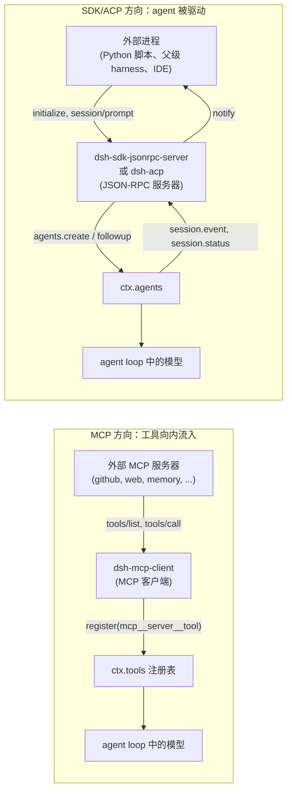

## 一句话版本

本章之前讨论的都是单个运行中的 agent。本章讨论的是 harness *进程边界本身*成为主题的两处地方——而且两者方向相反。作为 **MCP 客户端**，`dsh-mcp-client` 向*外*伸手：把第三方服务器的工具拉到 `ctx.tools` 上，模型像调原生工具一样调它们。作为 **SDK/ACP 服务器**，`dsh-sdk-*` 与 `dsh-acp` 让外部进程通过 JSON-RPC *向内*驱动一个 harness agent。二者都不是 capability seam——它们都是已有 seam（`ctx.tools`、`ctx.agents`）的普通 Consumer。真正的设计工作是在 harness 并不拥有的边界上保证正确性：命名、原子化注册、重连预算与协议纯净。

## 速览

两个方向搭起整章的骨架；其余都是每个方向各自造出的词汇。

:::concept{term="MCP 方向——harness 是客户端"}
`dsh-mcp-client` 连接外部 MCP 服务器（第三方进程或 HTTP 端点），把它的工具重新发布到 `ctx.tools` 上。工具向内流入；模型可见的工具面按服务器声明的能力逐一多出带命名空间的工具。
:::

:::concept{term="SDK/ACP 方向——harness 是服务器"}
`dsh-sdk-jsonrpc-server` 与 `dsh-acp` 在 stdio 上打开一条 JSON-RPC 通道，让外部进程（Python 脚本、父级 harness、IDE）创建 session、投递 prompt。此时 agent 是被驱动的对象；模型自身的工具面不变。
:::

:::concept{term="普通 Consumer，不是 capability seam"}
两类包都不拥有自己的 `ctx.<key>`，没有并列的 Service Provider，也不可替换。每一个都是消费既有 seam（`ctx.tools` / `ctx.agents`）的一种固定机制——只有一份实现，不是一族角色。
:::

:::concept{term="mcp__<serverName>__<tool>"}
模型实际看到的公开名字：服务器命名空间前缀加原始名字；仅当规范化或 64 字符上限会让两个原始名字相撞时才追加 hash 后缀。真正跨越 `tools/call` 协议边界的，是原始名字。
:::

:::concept{term="先拉取再替换的一代（fetch-then-swap）"}
`syncTools` 原子化地注册一个服务器的工具集：先把分页的 `tools/list` 完整拉成一个待定的"世代"，再整体换入。模型看到的要么是完整的新集合，要么什么都没有——绝不会是部分集合。
:::

:::concept{term="换行分隔的 JSON-RPC"}
两个自动化方向共用的协议外壳：每行一个紧凑 JSON 对象。同时带 `id` 与 `method` 是请求，只带 `id` 是响应，只带 `method` 是通知；格式错误的行被忽略而不是致命。
:::

## 对外连接的两个方向

这是两个相反的方向，代码库把它们放在互不相关的包分组里，因为两者的角色完全不重叠：



在 MCP 方向上，harness 进程是客户端，模型可见的工具面在扩大：`ctx.tools` 里多了一个新工具。在 SDK/ACP 方向上，harness 进程是服务器，模型自身的工具面完全不变——调用方能做的只是创建 session、投递 user message，就像一个人类在终端里打字一样，只不过换成了一个协议通道而不是终端。

## `dsh-mcp-client` 不是 capability seam——把这句话说清楚

在深入 `dsh-mcp-client` 具体做什么之前，先说清楚它在结构上*是什么*，因为它的外形很容易让人套错模式。正如[第 7 章](../s07-capability-seams-primer/README.zh.md)所建立的，一个 capability seam 就是恰好三个角色协同工作：一个拥有 `ctx.<key>` 与词汇表的 **Service Definition**，一个或多个实现它的 **Service Provider**，以及一个或多个按名字注入它的 **Consumer**。MCP 乍一看就应该是这样——它本身毕竟是一整套关于"可插拔工具服务器"的*协议*，而"可插拔"通常正是"seam"的同义词。

但它不是。与其凭直觉，不如去核对生成出来的图：[`docs/capability-seams.md`](https://github.com/deepseek-ai/deepseek-harness/blob/47f943859bef60e4160492346772ded9b24f765a/docs/capability-seams.md) 把每一个 `ctx.<key>` 服务的 `Role` 分类成 `seam`、`core` 或 `bundle` 三者之一。`dsh-mcp-client` 实际注册进去的服务——`ctx.tools`——那一行写的是 `core`，唯一所有者是 [`dsh-tools`](https://github.com/deepseek-ai/deepseek-harness/blob/47f943859bef60e4160492346772ded9b24f765a/packages/core/tools/README.md)，根本没有 Service Provider 这一列，因为 `dsh-tools` 只有一份实现。`dsh-mcp-client` 在那张表里根本没有作为所有者或 provider 出现过——它只在模块依赖图里以一条**Consumer 边**（`pkg_mcp_client --> pkg_tools`）的身份出现，与任何一个向工具注册表注册工具的插件毫无区别。

把三角色测试直接套在 `dsh-mcp-client` 上，每一条都不成立：

- **它没有属于自己的 Service Definition。** 它不拥有任何 `ctx.<key>`。它的模块文档说得很直白："MCP client bridge plugin: connects to an external MCP server and registers its tools on `ctx.tools`"（MCP 客户端桥接插件：连接外部 MCP 服务器，把它的工具注册到 `ctx.tools` 上）。它对话的那个服务属于别人。
- **它没有并列的 Service Provider。** 不存在第二个包用不同方式实现"作为一个 MCP 客户端"这件事——没有沙箱化的 MCP 客户端，也没有远程 MCP 客户端。一个插件，一种机制。
- **它自身并不是可替换的。** 一条 `cordis.yml` 配置项对应到外部一个服务器的一条连接。配置三个 MCP 服务器，意味着加载三次 `dsh-mcp-client`，每次一个不同的 `serverName`——这是配置数量上的多份实例，就像三个 PowerShell 脚本是三次独立的 `bash -c` 调用，而不是同一个 seam 背后的三个 provider。

`dsh-mcp-client` 实际上是什么：一个普通的 `ctx.tools` **Consumer**，与 `dsh-tool-fs` 或 `dsh-tool-web` 分别是各自服务的 Consumer 完全一样——只不过它不是在编译期手写每个工具对应的一条 `ToolDefinition`，而是在运行时从所连接的服务器广播出来的任意数量工具中动态发现它们，并通过每一个注册工具的插件都会用的那个普通的 `ctx.tools.register()` 调用逐一注册。协议本身的丰富性完全存在于 harness 与外部服务器之间的这根线上；站在 `ctx.tools` 的视角看，一个由 MCP 发现的工具和一个手写的工具是完全无法区分的同一种 `ToolDefinition` 值。

:::decision
**一份 MCP 服务器配置对应一个插件实例，而不是一次角色拆分。** `dsh-mcp-client` 之所以值得单独一章，不是因为它是一个形状特殊的 seam——而是因为它是一个干净的教学案例：一个从协议自身词汇看起来很"可插拔"的机制，实际上完全站在一个已有 seam（`ctx.tools`）的一侧，以一个普通 Consumer 的身份存在，对 seam 模式所描述的那些角色没有任何贡献。
:::

这个区分对你读接下来的内容有实际意义：下文不会去问"谁实现了 MCP 客户端这个角色，什么可以替换它？"——因为只有一份实现，这个问题根本不成立。相反，`dsh-mcp-client` 里真正有意思的设计工作，全都集中在它并不拥有的那条进程边界上的正确性问题：命名、原子化注册、以及重连预算，下面依次展开。

## MCP 客户端：把工具引进来

[`@deepseek-ai/dsh-mcp-client`](https://github.com/deepseek-ai/deepseek-harness/blob/47f943859bef60e4160492346772ded9b24f765a/packages/mcp/mcp-client/README.md) 是一个 namespace 插件——每个外部 MCP 服务器对应一个实例，直接在 `cordis.yml` 中配置：

```yaml
- id: mcp-github
  name: '@deepseek-ai/dsh-mcp-client'
  config:
    serverName: github
    transport: stdio
    command: npx
    args: ['-y', '@modelcontextprotocol/server-github']
    env:
      GITHUB_TOKEN: !!js process.env.GITHUB_TOKEN
```

`inject = ['tools']` 是这个插件声明的唯一依赖；`apply()` 会先占用 `serverName` 命名空间，再启动一个受监督的连接，并等待该连接的 `ready` promise 落定，插件 fiber 才算激活——因此当外层组合开始第一个 turn 时，该服务器所声明的每个工具都已经注册完毕，不会出现在 turn 进行中才姗姗来迟的情况。

### 命名：每个工具两个名字，只有一个方向的转换

每个 MCP 工具都有一个来自服务器的原始名字（`create_issue`）和一个模型实际看到的公开名字（`mcp__github__create_issue`）。[`publicToolName`](https://github.com/deepseek-ai/deepseek-harness/blob/47f943859bef60e4160492346772ded9b24f765a/packages/mcp/mcp-client/src/tools.ts#L82-L102) 是 `(serverName, rawName)` 的纯函数：

```ts filename="packages/mcp/mcp-client/src/tools.ts"
export function publicToolName(serverName: string, rawName: string): string {
  const joined = `mcp__${serverName}__${rawName}`
  const normalized = joined.replace(INVALID_NAME_CHARS, '_')
  if (normalized === joined && normalized.length <= MAX_PUBLIC_NAME_LENGTH) return normalized
  const hash = createHash('sha256').update(`${serverName}\0${rawName}`).digest('hex').slice(0, HASH_LENGTH)
  return `${normalized.slice(0, MAX_PUBLIC_NAME_LENGTH - HASH_LENGTH - 1)}_${hash}`
}
```

干净情况下就是原样拼接。当字符替换或 64 字符截断（DeepSeek 函数名限制）会改变名字时，就会追加一个基于身份信息计算的 12 位十六进制 SHA-256 hash，确保两个不同的原始名字即使规范化后变成同一字符串，也绝不会折叠成同一个公开工具。两个服务器可以各自暴露一个叫 `search` 的工具而互不冲突，因为 namespace 前缀把它们区分开了——这与 Claude Code 和 Codex 自身 MCP 集成使用的服务器限定形状完全一致。原始名字才是真正在 `tools/call` 中跨越协议边界的东西；公开名字从不会被反向解析出原始名字，连接顺序或重新同步也从不会给已有工具改名。

### 注册是"先拉取再替换"，绝不留下部分状态

[`syncTools`](https://github.com/deepseek-ai/deepseek-harness/blob/47f943859bef60e4160492346772ded9b24f765a/packages/mcp/mcp-client/src/tools.ts#L104-L174) 在每次初始连接和每次 `notifications/tools/list_changed` 重新同步时都会执行两个阶段：

:::timeline
- 拉取（Fetch）——遍历分页的 `tools/list`，构建出以公开名字为键的完整下一代 `ToolDefinition` 集合。服务器自己列表中出现重复的原始名字，或者网络失败，都会导致本次拉取被拒绝，并让*上一代*注册保持原样、不受影响。
- 替换（Swap）——先释放上一代的所有 disposer，再通过 `ctx.tools.register()` 逐个注册新一代的条目。如果注册过程与某个占据了本服务器 `mcp__<serverName>__` 命名空间的外部注册发生冲突，整个尝试中的世代都会回滚——模型看到的要么是这个服务器完整的新工具集合，要么什么都没有，绝不会是部分集合。
:::

> [!WHY]
> 这种原子性很重要，因为半注册的世代是比"没有工具"更糟糕的失败模式：模型可能看到某个服务器五个工具中的三个，却完全无从得知另外两个已经缺失。

### 重连有预算，不是无限耐心

[`connection.ts`](https://github.com/deepseek-ai/deepseek-harness/blob/47f943859bef60e4160492346772ded9b24f765a/packages/mcp/mcp-client/src/connection.ts#L1-L16) 中的连接 supervisor 会以指数退避（`initialDelayMs` 逐次翻倍直到 `maxDelayMs`，默认分别为 500 毫秒和 30 秒）重启掉线的 stdio 子进程或 HTTP 连接。连续失败共享一个上限为 `maxAttempts`（默认 10）的预算；连接一旦存活超过 `maxDelayMs` 的运行时长，这个预算就会重置。

> [!WHY]
> 这种不对称是有意为之的：偶尔掉线又能重新稳定运行的服务器可以无限次恢复，而不断崩溃循环的服务器——即便它每次连接都能短暂成功——仍然会耗尽预算并停止重试，注销其工具，而不是留着过期的工具让模型调用一个已经死掉的连接。

### 模型实际能看到什么、看不到什么

规范的执行结果是 `{ content: JsonValue[], structuredContent? }`——完整的 JSON MCP 结果会为编程调用方（Code Mode）保留下来。而 Native/模型可见的渲染则有意做得更"有损"：文本块以换行符连接成一个字符串，图片、音频、资源和不受支持的块则变成简短的占位符，例如 `[image: image/png, content discarded]`。

> [!LIMITATION]
> 模型可见渲染的"有损"是一个真实的、有文档记录的限制，而不是疏漏——更丰富的多媒体投影进入模型上下文属于暂缓事项。MCP 另外两种能力类型——资源（Resources）和提示词（Prompts）——完全没有 harness 消费方；只有工具（Tools）被桥接。

这种收窄与上文"普通 Consumer"的定性是一致的：`dsh-mcp-client` 只消费了 MCP 里恰好能映射到 `ctx.tools` 既有词汇表上的那一种能力，不会为另外两种能力再长出第二个注册表。

[`mcp-memory` 示例](https://github.com/deepseek-ai/deepseek-harness/blob/47f943859bef60e4160492346772ded9b24f765a/examples/mcp-memory/README.md) 把这一点具象化了：三个默认关闭的 overlay 分别通过完全相同的 `dsh-mcp-client` 配置形状接入一个第三方记忆类 MCP 服务器（Memorix、MCP 参考记忆服务器、Engram），仅在 `serverName`、`command` 和 `env` 上有差异。这些都不是 DeepSeek 自己开发的——harness 的职责仅限于启动配置的进程（或连接配置的 URL）、发现其工具、并将其暴露为 `mcp__<serverName>__<tool>`；数据库初始化、向量嵌入和存储完全是第三方服务器自己的事。三份 overlay，就是三个各自独立的插件实例——而不是同一个 seam 背后的三个 provider。

## SDK 与 ACP：被驱动，而不是驱动别人

`dsh-mcp-client` 是运行在 harness 组合*内部*的 Cordis 插件，而 `packages/sdk` 和 `packages/acp` 站在进程边界的另一侧，处理一个方向相反但形态相似的问题：把 harness 自身的 agent 暴露给活在另一个进程里的调用方，走的是与 MCP 本身相同的换行分隔 JSON-RPC 外壳，但方法名完全不同，因为此时 harness 是被当作*一个 agent*来驱动，而不是被当作*一个工具提供方*来消费。

### 协议层：`dsh-sdk-protocol`

[`@deepseek-ai/dsh-sdk-protocol`](https://github.com/deepseek-ai/deepseek-harness/blob/47f943859bef60e4160492346772ded9b24f765a/packages/sdk/protocol/README.md) 是一个纯库——没有插件、没有 `Config`、不做任何注册——协议的两端都会导入它。`JsonRpcLineTransport` 在任意调用方持有的字节流上打包 JSON-RPC 2.0，每个以换行符结尾的紧凑 JSON 对象为一帧：同时带 `id` 和 `method` 的帧是请求，只带 `id` 的是响应，只带 `method` 的是通知；格式错误的行会被静默忽略，而不是让整条通道崩溃。

它定义的具名方法，来自 [`types.ts`](https://github.com/deepseek-ai/deepseek-harness/blob/47f943859bef60e4160492346772ded9b24f765a/packages/sdk/protocol/src/types.ts#L100-L105)：

| 方向 | 方法 | 形状 |
|---|---|---|
| 客户端→服务端 | `initialize` | `InitializeParams`（cwd、provider、model、可选的 `maxTokens`）→ `InitializeResult` |
| 客户端→服务端 | `session/prompt` | `SessionPromptParams`（sessionId、contentBlocks）→ `SessionPromptResult`（`{ messageId }`） |
| 客户端→服务端 | `shutdown` | 无参数 → `{}` |

以及服务端主动推送的通知，来自 [`types.ts:92-98`](https://github.com/deepseek-ai/deepseek-harness/blob/47f943859bef60e4160492346772ded9b24f765a/packages/sdk/protocol/src/types.ts#L92-L98)：

| 方法 | 触发时机 |
|---|---|
| `session.event` | 运行时中任意 session 记录了一条持久化 session-log 事件——完整信封（envelope），不做过滤 |
| `session.status` | 某个 agent 的整体状态在 `idle` 与 `running` 之间切换 |
| `subagent.started` | 创建了一个新的子 session（来自 `parentSession` header） |
| `subagent.finished` | 某个进程内子 agent 运行结束（远程子 agent 运行不会被上报） |

> [!NOTE]
> `SessionPromptResult.messageId` 的语义故意收得很窄：它只表明这条 user message 已被持久化入队，仅此而已。它不承诺哪条 assistant message 会应答它、turn 是否会结束、或者最终结果是什么——在调用方看到 `idle` 转变之前，转向指令（steering）、注入的上下文以及其他排队工作都可能先落地。想要"请求/响应"式体验的客户端得自己组合 `session.event` 和 `session.status` 来实现；协议本身只提供这些原语。

### 服务端插件：`dsh-sdk-jsonrpc-server`

[`HarnessSdkJsonRpcServer`](https://github.com/deepseek-ai/deepseek-harness/blob/47f943859bef60e4160492346772ded9b24f765a/packages/sdk/server/src/server.ts) 是真正应答这些方法的插件，`inject: ['agents']`。它的构造函数订阅了四个 Cordis 事件（`session/event`、`agent/status`、`session/created`、`subagent/end`），并把每一个转发为对应的协议通知。`initialize()` 记录请求中的 provider/model/cwd，当路由是未被占用的默认值 `deepseek-official` 时会自行挂载 `dsh-llm-deepseek`；任何其他无法识别的 provider 都会让初始化直接失败，而不是悄悄回退。`prompt()` 按 `sessionId` 惰性地获取或创建一个 agent（客户端无需预先声明 session），并携带 content blocks 调用 `agent.followup()`，只返回 `{ messageId }`。`handleRequest()` 就是把三个协议方法接到这些处理函数上的普通三路分发：

```ts filename="packages/sdk/server/src/server.ts"
async handleRequest(method: string, params: Record<string, unknown> | undefined): Promise<unknown> {
  switch (method) {
    case 'initialize':
      return this.initialize(params as unknown as InitializeParams)
    case 'session/prompt':
      return this.prompt(params as unknown as SessionPromptParams)
    case 'shutdown':
      return this.shutdown()
    default:
      throw new Error(`unknown DeepSeek Harness SDK runtime method: ${method}`)
  }
}
```

> [!PITFALL]
> 一条硬性规则塑造了整个包：**stdout 上只能有 JSON-RPC 帧。** 部署方不能在这个插件旁边再挂一个 stdout logger——诊断信息属于 stderr，因为协议通道与人类可读日志无法共享同一个流。

`shutdown()` 会先应答请求、把响应刷出去，然后释放根 context，让每个 SDK 拥有的 agent、订阅和持久化句柄都归于静默，之后进程才以退出码 0 结束；EOF 和信号触发的退出则由应用 bin 单独负责。

### 客户端 SDK：`dsh-sdk-client`

[`@deepseek-ai/dsh-sdk-client`](https://github.com/deepseek-ai/deepseek-harness/blob/47f943859bef60e4160492346772ded9b24f765a/packages/sdk/client/README.md) 是该协议在 TypeScript 一侧的消费方——一个不做任何 Cordis 注册的纯库，负责把运行时作为子进程启动，并在其 stdio 上讲 `dsh-sdk-protocol`：

```ts
import { DeepSeekHarness } from '@deepseek-ai/dsh-sdk-client'

await using harness = new DeepSeekHarness({
  launch: { command: 'node', args: ['lib/bin.js', 'cordis.yml'] },
  provider: 'deepseek-official',
  model: 'deepseek-v4-flash',
  maxTokens: 49_152,
})
const result = await harness.run('say hi')
console.log(result.finalResponse)
```

`DeepSeekHarness` 是高层的、自持一次运行的 API；`run()` 会把 prompt 入队，等待其 `messageId` 出现在一条持久化的收件箱回执中，然后收集直到下一次整体 `idle`，返回 `finalResponse`、`events`（仅限根 session）和 `notifications`（根 session 加上通过 `subagent.started` 发现的所有子孙）。`HarnessClient` 位于其下，是更底层的协议客户端，供想要直接使用原始 `prompt()`/`request()`/`subscribe()`、不需要"回执到 idle"这套记账逻辑的调用方使用。由于这个客户端完全运行在任何 harness Cordis context 之外，它无法搭乘 harness 其余部分用于启动子进程的 `dsh-subprocess` 服务——这是唯一有文档记录的例外，它直接通过 `node:child_process` 启动子进程，并通过自己私有的 stdin-EOF → SIGTERM → SIGKILL 阶梯来收尾子进程。

Python SDK（`python/`）是这个包在设计上的孪生兄弟：相同的协议、相同的分层（`DeepSeekHarness` / `HarnessClient`）、相同的运行时对端——两者的形状互相映照，但不共享代码。[`examples/jsonrpc-agent`](https://github.com/deepseek-ai/deepseek-harness/blob/47f943859bef60e4160492346772ded9b24f765a/examples/jsonrpc-agent/README.md) 正是 Python SDK 内置运行时实际启动的组合：一个无人值守的编码 agent，模型可见工具仅有 `bash`、`read`/`write`/`edit`、`subagent` 和 `todo_write`，刻意不加载任何终端 UI、控制台 logger 或批准 UI，因为 stdout 属于 SDK 协议，turn 由 SDK 驱动而不是由人类驱动。

### ACP：互操作传输层的孪生兄弟

[`@deepseek-ai/dsh-acp`](https://github.com/deepseek-ai/deepseek-harness/blob/47f943859bef60e4160492346772ded9b24f765a/packages/acp/acp/README.md) 通过另一个已经存在的协议——[Agent Client Protocol](https://agentclientprotocol.com)——来回答同一个"从外部驱动 harness"的需求。它同样是换行分隔的 stdio JSON-RPC，但用的是 ACP 自己的方法名（`session/new`、`session/prompt`、`session/cancel`、`session/update`、`session/request_permission`），而不是 SDK 那套自定义方法。它自己说得很明确："a transport adapter, not a UI integration or a capability seam"（是一个传输适配器，而不是 UI 集成，也不是一个 capability seam）——不声明任何编辑器导航、事务重放、命令、模式、征询（elicitation）或工具呈现能力。`session/new` 每次调用都创建一个全新的 agent，带一个绝对路径 `cwd`；请求中的非空 `additionalDirectories` 或 `mcpServers` 会被拒绝，因为这个桥接只组合唯一一个工作区，也从不把 ACP 客户端的 MCP 服务器配置转发下去。

:::decision
ACP 真正需要一个人类式决策的地方，它选择把决定权回传到协议通道上，而不是在本地解决：一次 harness 内部的 `approval/request` 会被转成一次 ACP `session/request_permission` 调用，而应答是一次性的允许/拒绝，从不会被记成一条持久化的授权。
:::

[`packages/acp/acp/src/index.ts:212-229`](https://github.com/deepseek-ai/deepseek-harness/blob/47f943859bef60e4160492346772ded9b24f765a/packages/acp/acp/src/index.ts#L212-L229) 订阅了 harness 自身的 `approval/request` waterfall 事件，把它转换成一次 ACP `session/request_permission` 调用：

```ts
ctx.on('approval/request', (request, next) => {
  const record = ownedRecord(request.agent)
  if (record === undefined || request.callId === undefined) return next()
  return conn.requestPermission({
    sessionId: record.agent.session.id,
    toolCall: { toolCallId: request.callId },
    options: [
      { optionId: 'allow-once', name: 'Allow once', kind: 'allow_once' },
      { optionId: 'reject-once', name: 'Reject', kind: 'reject_once' },
    ],
  }).then(({ outcome }) => {
    if (outcome.outcome === 'cancelled') return 'cancelled'
    return outcome.optionId === 'allow-once' ? 'allowed-once' : 'rejected'
  })
})
```

这正是自动化这条线与之前章节讲过的协作平面（collaboration plane）的交汇点：ACP 客户端——常见的例子是 [`dsh-subagent-acp`](https://github.com/deepseek-ai/deepseek-harness/blob/47f943859bef60e4160492346772ded9b24f765a/packages/subagent/subagent-acp/README.md)，即一个父级 harness 把子 harness 当作 ACP 子进程来启动——用一次性的允许/拒绝来应答，这个选择从不会被记成一条持久化的授权。

> [!NOTE]
> `session/update` 会推送 `agent_message_chunk` 通知，但只针对**已提交**的 assistant message，每个非空文本块对应一个 chunk——原始的 provider 增量输出和非 message 类事件被有意省略。"已提交消息的输出有意用逐 token 的实时性去换取干净的自动化结果。"程序化客户端得到的是完整、稳定的文本，永远不需要自己去拼接或丢弃一句还没说完的话。

[`examples/acp-agent`](https://github.com/deepseek-ai/deepseek-harness/blob/47f943859bef60e4160492346772ded9b24f765a/examples/acp-agent/README.md) 是可直接运行的组合（`pnpm run demo:acp`），加载了 ACP 应用、DeepSeek 适配器、沙箱化的 bash 与文件系统、一次性批准策略、压缩、subagent、workflow 以及 JSONL 持久化——每次 `session/new` 对应一个全新 agent，stdout 与 SDK 服务器一样保持协议纯净。

## 为什么这两个自动化包要分开存在

`dsh-sdk-protocol`/`client`/`server` 和 `dsh-acp` 解决的是同一个问题——把 harness 的 agent 暴露给进程外的调用方——但用的是两套截然不同的协议和不同的客户端群体。SDK 协议是 DeepSeek 自研的极简接口，是为 Python 和 TypeScript SDK 及其内置运行时消费方量身定制的。ACP 是一个已经存在的第三方协议，harness *实现*它是为了让讲 ACP 语言的工具——包括它自己仓库内的子 agent provider `dsh-subagent-acp`——能够驱动一个 harness agent，而完全不需要知道底层是 DeepSeek 特有的实现。

| | `dsh-sdk-protocol` / client / server | `dsh-acp` |
|---|---|---|
| 协议来源 | DeepSeek 自研、极简 | 已有的第三方协议（Agent Client Protocol） |
| 接口面 | 3 个方法、4 种通知 | ACP 自己的方法名（`session/new`、`session/prompt`……） |
| 独有能力 | `session.event` 完整 session-log 事件流 | `session/request_permission` 一次性决策点 |
| 客户端群体 | Python + TypeScript SDK、内置运行时消费方 | 讲 ACP 语言的工具，含 `dsh-subagent-acp` |

:::decision
二者互不包含：SDK 协议的 `session.event` 给调用方提供了完整的 session-log 事件流，这是 ACP 完全没有对应物的能力；ACP 的 `session/request_permission` 提供了一个交互式的一次性决策点，这是 SDK 协议完全没有定义的东西。调用方该选哪一个，取决于它实际需要哪种协议形状和哪一组能力。
:::

用上文套在 MCP 上的同一个三角色测试来检查 `sdk` 和 `acp`，二者也都不是 capability seam——但原因和 `dsh-mcp-client` 不一样。这里，两个包都注入的 `ctx.agents`（即[第 5 章](../s05-agent-interface/README.zh.md)讲过的 `dsh-agent` 服务）*本身*就是 harness 别处的一个 seam，`dsh-agent-loop` 是它的具体驱动实现。`dsh-sdk-jsonrpc-server` 和 `dsh-acp` 都是这个既有 seam 的 Consumer，而不是新 seam 的 Provider：二者各自是覆盖在同一个 `ctx.agents` 表面上的一种固定的协议适配器——和一个 UI 或 hook 插件会用的是同一个表面——每种协议都只有唯一一份实现，不是一族可互换的实现。

:::fold[依赖关系一览：谁依赖谁]
`dsh-mcp-client` 依赖 `dsh-tools`（用于 `ctx.tools.register`）、`dsh-llm`（用于 `JsonValue`/schema 类型）、`dsh-subprocess` 和 `dsh-timeout`——它完全不触碰 `dsh-agent` 或 `dsh-session`，因为从 harness 的视角看，一个 MCP 工具不过是另一个 `ToolDefinition`，与本地实现的工具在种类上没有区别。SDK 和 ACP 两个包则正相反：`dsh-sdk-jsonrpc-server` 和 `dsh-acp` 都注入了 `agents` 并依赖 `dsh-session`，因为它们的全部工作就是 agent 生命周期与 session-log 的管理，而不是工具注册。`dsh-sdk-protocol` 还额外依赖 `dsh-llm`（用于 `ContentBlock`）和 `dsh-subagent`（用于 `SubagentStopReason`），因为它的通知负载流转的是真实的 session 词汇表，而不是一套抽象化的、只在协议层面存在的形状——[模块依赖关系图](https://github.com/deepseek-ai/deepseek-harness/blob/47f943859bef60e4160492346772ded9b24f765a/docs/module-graph.md) 把这里提到的每一条边都直接从各个包声明的 `peerDependencies` 中追溯出来。
:::

## 值得记住的已知限制

两个方向都共享一类有意为之、有文档记录的缺口，而不是意外的疏漏：

- **MCP 客户端**：只桥接了工具（Tools），资源（Resources）和提示词（Prompts）暂缓实现；启动超时继承自 MCP SDK 的 60 秒默认值，harness 层面尚未提供覆盖手段；非文本内容会在模型可见文本中变成有损占位符，尽管规范的 JSON 会为编程调用方完整保留。
- **SDK 协议/服务端/客户端**：除了一个未经校验的 `serverInfo.version` 外没有任何协议版本协商；协议上没有 turn 中途取消——放弃一个 turn 意味着关闭整个运行时进程；服务端到客户端的请求今天是一个死能力，是为将来的批准流程预留的，Python SDK 的应答方接口已经为此做好了准备。
- **ACP**：只支持全新 session（不支持加载/列出/恢复/派生）；只支持基线 prompt（不支持图片、音频或内嵌上下文）；一个连接拥有其全部 session 的生命周期，没有单独关闭某个 session 的能力。

> [!LIMITATION]
> 这些都不是悄悄藏起来的——每一条都写在对应包自己的 `Known Limitations and Deferred Work` 一节里，未来的使用方在动手之前，正应该去那里查看。
