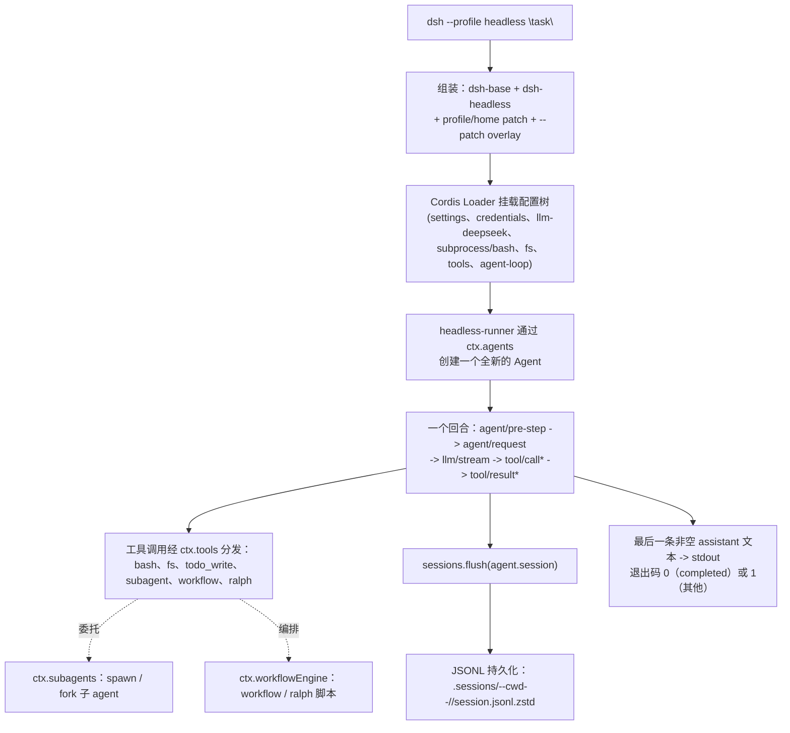

## 一句话版本

本章把一条命令——`pnpm dsh --profile headless "task"`——从头跑到尾，并用这一次运行把前面每一章串起来。我们会追踪 `headless` profile 如何组装、一个真实回合究竟做了什么、挂载了哪些工具与委托入口、会话最终落在哪。沿途还会把这次运行启动的内容分清哪些是真正的能力接缝、哪些是非接缝机件——正是本课程对每一章都用过的那同一把尺子。

## 速览

四个词撑起整章。前两个是这一次运行的操作词汇，后两个是它用来清点挂载内容的分析视角。

:::concept{term="headless profile"}
`headless` profile 是 `dsh-base` 叠加 `dsh-headless`：一个不挂 Host、HTTP 服务器或浏览器客户端的一次性 Agent 驱动器——一个任务进去，一段打印出来的答案出来。
:::

:::concept{term="overlay"}
overlay 是与基础组合并列的具名 `*.cordis.yml`，只插入、覆盖或禁用演示某一特性所需的那几行——大多数 overlay 换个 replay/fixture 后端就能在无密钥下运行。
:::

:::concept{term="能力接缝"}
能力接缝（capability seam）是一条挂载出来的、带有兄弟级可替换 Provider 的 Definition——本次运行指 `ctx.shell`、`ctx.fs`、`ctx.subagents`、`ctx.workflowEngine`、`ctx.compaction`、`ctx.sessionPersistence`。换一个 Provider（E2B 文件系统、另一种持久化后端）之后，工具与 `headless-runner` 完全不需要改动。
:::

:::concept{term="非接缝机制"}
非接缝机制（non-seam mechanism）是不存在第二种可替换实现的机件：事件溯源的会话日志（每个 agent 一份 `Session`）、单一的 `ctx.tools` 注册表，以及 `todo_write`——它只是架在接缝之上的 Consumer，而非自成一条接缝。
:::

## 一条命令，到底启动了什么

```sh
# 仓库根目录的 .env（已加入 .gitignore）或导出的环境变量：
#   DEEPSEEK_API_KEY=sk-…
#   DEEPSEEK_BASE_URL=https://…   # 可选；默认使用公开 API
pnpm dsh --profile headless "fix the failing test in this workspace"
```

这条命令没有走任何特殊代码路径。它解析出 `headless` profile——`dsh-base` 叠加 `dsh-headless`——按第 2 章讲过的同一套规则完成组合，然后用与所有产品入口相同的 `ReactLoopAgent` 驱动恰好一个回合（第 4 章）。本章沿着这一条调用链走一遍，并以 `examples/headless-agent/cordis.yml` 这份实际的测试/演示组合配置作为具体参照——它挂载的配置行与随附 `headless` profile 一致，只是省去了应用参数解析的胶水代码，因此它的注释同时也是对真实 profile 启动内容的说明。



这张流程图一眼看全这次调用；下面是同一条有序路径的分步拆解：

:::timeline
- 组装 —— 解析 `headless` = dsh-base + dsh-headless，再叠加 profile/home patch 与 `--patch` overlay
- 挂载 —— Cordis Loader 挂载配置树（settings、credentials、llm-deepseek、subprocess/bash、fs、tools、agent-loop）
- 创建 —— headless-runner 通过 `ctx.agents` 创建一个全新的 Agent
- 回合 —— 一个回合：agent/pre-step → agent/request → llm/stream → tool/call* → tool/result*
- 分发 —— 工具调用经 `ctx.tools` 出去：bash、fs、todo_write、subagent、workflow、ralph
- 排空 —— `sessions.flush(agent.session)` 排空待写入的批次
- 落盘 —— JSONL 落到 `.sessions/--cwd--/<id>/session.jsonl.zstd`
- 输出 —— 打印最后一条非空 assistant 文本；退出码 0（completed）或 1（其他）
:::

## 组装 profile（回顾第 2 章）

`dsh --profile headless "task"` 会解析 `$DSH_HOME/profiles/headless`，其 manifest（元数据清单）按顺序列出两个组合包：`@deepseek-ai/dsh-base`，然后是 `@deepseek-ai/dsh-headless`。配置树的组装方式与第 2 章描述的完全一致——从空根开始，依次叠加各组合包 patch（按 `bundles` 列表顺序）、profile 自己的 `cordis.patch.yml`、home 级的那一份，最后是任意 `--patch` overlay——你随时可以在真正启动之前查看组装结果：

```sh
dsh --profile headless --dump-config
```

`dsh-base` 的 patch 在空根之上一次性插入约七十行配置：模型适配器、会话日志及其 JSONL 持久化后端、沙箱与审批策略、`dsh-tools`/`dsh-agent-loop`/`dsh-system-prompt`，以及完整的工具清单（bash、文件系统、skill、subagent、workflow、todo、goal、web），外加遥测。`dsh-headless` 随后直接叠加在这之上，用不到四十行（`packages/bundle/headless/cordis.patch.yml`）做了 patch 能做的三件事：覆盖 `system-prompt` 的 `persona` 配置行，换成一段引用 `{{model}}` 与 `{{cwd}}` 的编码助手人设；禁用 `hmr`（一次性进程没有什么需要热重载）；再插入三行新配置——`code-runtime`（Code Mode 的 worker-thread 执行能力）、`headless-startup`（通过 `ctx.cmdlineArgs` 读取位置任务参数的 provider），以及 `headless-runner` 本身，它注入 `headlessStartup` 并配置 `task: !!js ctx.headlessStartup.task`。

这个 `!!js` 表达式正是 CLI 行为参考文档里讲过的那种"命令行参数接入配置"手法：某一配置行的 `config` 读取启动器 provider 解析出的服务，因此 `dsh --profile headless "run the tests"` 是真的把位置参数穿过了 Cordis 自身的依赖图,而不是靠 `apps/cli` 内部专为 headless 写的 argv 解析逻辑。

:::decision
位置任务参数经由 Cordis 依赖图到达 runner——通过一个 `headless-startup` provider 配置行加上 `task: !!js ctx.headlessStartup.task` 配置——而不是靠 `apps/cli` 里专为 headless 写的 argv 解析。我们之所以选择配置行接线而不用专门的 CLI 解析，是因为它复用了启动器本就支持的"命令行参数接入配置"模式，因此 headless 组合包不引入任何特殊代码路径。
:::

这个随附组合包完全不挂载 Host、HTTP 服务器、Web 运行时或浏览器插件——这是一个直接的 Agent 驱动器,不是套了另一层 UI 的第二产品入口。

:::fold[示例组合如何对应真实 profile]
本章后文使用的 `examples/headless-agent/cordis.yml` 直接挂载了等价的配置行(没有通过 `include` 引用组合包的 patch),因此它的 id 与真实 profile `--dump-config` 打印出的内容一一对应:`settings`、`credentials`、`llm-deepseek`、`subprocess`、`bash`、`agent-spine`(在演示中替代了 `dsh-agent`/`agent-default-model`/`headless-runner`)、`persistence`、`checkpoint-policy`、`token-meter`、`compaction-basic`、`session-projection`,以及 subagent/workflow/todo 相关配置行和文件系统栈。`examples/headless-agent/composition.md` 里的生成图把这同一份清单渲染成了带有每个插件 id 和包名的流程图——值得先整体打开看一眼,而不是在这里逐行细读。
:::

## 一次真实回合(回顾第 4 章)

配置树稳定之后,`headless-runner` 的 `run()` 函数(`packages/bundle/headless/src/index.ts:90-130`)恰好做了五件事,而这五件事全都是在调用第 4 章或第 5 章已经介绍过的服务,没有引入任何专属于 headless 的新机制:

1. 等待 `ctx.get('loader')?.await()`,确保每个兄弟插件(工具注册、适配器)都已完整组装完毕,才在配置树上创建 Agent——避免针对一棵组装了一半的树创建 Agent。
2. 调用 `ctx.agents.create({ sessionId, meta: { cwd: process.cwd() }, agentOptions: { provider, model }, setup })`——与其他任何入口完全相同的 `Agent` 创建原语,种子值来自 `ctx.agentDefaultModel.currentSelection()`。
3. 调用 `agent.followup(createUserMessage({ content: [...], source: { kind: 'user' } }))`——与第 4 章追踪过的 `Agent.send()` 之上那个开启新回合 `next-turn` FIFO 队列的 `followup()` 别名完全一致。
4. 两次等待 `agent.whenIdle()`——第一次确认刚创建的 agent 处于空闲状态,第二次等待整段 turn/step/工具调用序列跑到静默。
5. 调用 `sessions.flush(agent.session)`,再从记录下来的 `firstSeq` 开始回读 `agent.session.events`,找出最后一条非空的 `assistant/message` 文本以及收尾的 `turn/end` 原因。

这个序列没有任何一步绕过 turn/step 生命周期:`agent.followup()` 开启的正是第 4 章 `turn()`/`step()`/`preStep()` 讲解过的那套机制——`turn/start`,一个或多个与工具分发交织的 `step/start`/`step/end` 配对,以及一个 `turn/end`,其 `reason.kind`(`completed`、`error`、`max-tokens`、`blocked`、`aborted`)正是 `headless-runner` 用来决定自身进程退出码的依据。`completed` 原因退出码为 `0`;其余情况退出码为 `1`,`error` 原因还会额外把错误码和消息写到 stderr——一次成功的运行,stderr 应当保持为空。

:::fold[把一个完整回合看成 JSONL 流]
`examples/headless-agent/tests/fixtures/headless-driver.ts` 里的快照测试驱动把这一点做得很具体:它启动一套同类型的组合配置,驱动一个 fixture 回合,并把每一条 `SessionEvent` 都以 JSONL 形式流式输出到 stdout,最后再加一条结果记录——这条 JSONL 流只是测试基础设施,从来不是受支持的 CLI 输出格式,但它是实际观察一个完整回合事件序列(`turn/start`、`agent/inbox/spliced`、`step/start`、`user/message`、运行时上下文快照、`assistant/message`、`tool/call`/`tool/result` 配对、`step/end`、`turn/end`)——每行一个 JSON 对象——最快的办法。
:::

## 台面上有哪些工具,为什么(回顾第 6/7 章)

这个回合里的每一次工具调用——`bash`、文件系统读写、`todo_write`、subagent 委托、workflow 脚本——都会经过第 6 章讲过的那同一条共享 `ctx.tools` 流水线:`tool/call` 在执行前先落日志,`tools/pre-execute`(策略/权限)、注册的 guard、`tools/execute`(围绕分发)、工具体本身、`tools/post-execute`、`finalizeContent`,最后是 `tool/result`。headless 不会因为没有 UI 就走一条更轻量或不同的流水线——不论回合是从终端一次性命令触发,还是从浏览器会话触发,守卫式执行、会话事件日志记录、可回放保证都完全一样。

不同部署之间真正的差异,在于实际组合了哪些能力接缝(第 7 章),`examples/headless-agent/cordis.yml` 的注释把这条依赖链说得很直白:

- `subprocess`(`dsh-subprocess-local`)加上 `bash`(`dsh-bash-local`,`timeoutMs: 60000`)为 bash 执行器提供了 spawn/kill/输出管道——shell 接缝的本地 Service Provider。
- `fs-local` 之所以要挂载在 `fs-observation-policy` 和 `tool-fs` 之前是刻意为之的顺序:观察策略要求写入和编辑必须针对 agent 已经读过的文件,因此它必须先于那个原本可能直接跳到写入的面向模型工具组装完成。
- `session-projection` 是 subagent 目录的硬依赖,而非点缀:持久化的 subagent 身份(mode/label)要通过注册的 projection 单元折算出来,`list_agents` 在缺少这项能力时会直接失败报错——这正好体现了"配置错误要在能感知的地方响亮失败"这条规则,而不是悄悄少一个功能。
- `token-meter` 和 `compaction-basic`(`thresholdRatio: 0.8`,`retainRatio: 0.16`)才是真正让一次长时间的 headless 运行留在上下文窗口以内的关键——就是第 18 章讲过的那条压缩接缝,只不过这里给出了具体数字而不是停留在抽象层面。

> [!WHY]
> 上面的顺序并非巧合。`fs-local` 先于 `fs-observation-policy` 和 `tool-fs` 组装，观察策略才能对那个面向模型的工具执行"先读后写"的规则；若颠倒顺序，策略就没有东西可约束。

因为这一切都只是普通的 Cordis 组合,`examples/headless-agent/` 里与 `cordis.yml` 并列的那些具名 overlay 文件值得当成一份菜单来用,而不是一整块整体。每一个 overlay 都在基础组合上做插入、覆盖或禁用,恰好用来独立演示一个特性:

| Overlay | 打开了什么 |
|---|---|
| `goal.cordis.yml` | 插入 `dsh-goal` + `tool-goal`——同会话内的持久目标,与 subagent/workflow 委托相互独立 |
| `advanced.cordis.yml` | 把 agent 换成 `deepseek-v4-pro`,设置 `tools.mode: both`,并插入 `dsh-code-runtime-worker-thread` + `dsh-cordis-host-runner` + `dsh-tool-cordis`——Code Mode 加上第 21 章的自我修改工具 |
| `e2b.cordis.yml` | 叠加在 `advanced.cordis.yml` 之上,禁用本地 subprocess/文件系统 provider,插入 E2B 支撑的 FS、subprocess、PTY、LSP——只换了沙箱执行底座,面向模型的工具集不变 |
| `pty.cordis.snapshot.yml` | 在 `danger-full-access` 下插入 `dsh-terminal` + `dsh-tool-terminal`——第 9 章讲过的持久终端接缝,默认关闭 |
| `subagent-inheritance.cordis.snapshot.yml` | 一份红/绿基准测试,证明父会话内针对会话范围设置的 `read-only` 覆盖确实能收窄被委托子 agent 的权限,即便部署默认是 `workspace-write` |
| `retry.cordis.snapshot.yml`、`compaction.cordis.snapshot.yml`、`credentials.cordis.snapshot.yml`、`semantic-checkpoint.cordis.snapshot.yml`、`workspace-context-resume.cordis.snapshot.yml`、`subagent-diagnostic.cordis.snapshot.yml`、`subagent-settlement.cordis.snapshot.yml` | 一组无需密钥、由 replay 驱动的组合,分别隔离展示 provider 重试、上下文溢出压缩、缺失凭据时的提示体验、中断会话恢复、workspace 指令的对账重建,以及 subagent 目录/结算的边界情形 |

以上大多数 overlay 都不需要真实模型密钥就能查看——大部分禁用了 `llm-deepseek`,换成 `dsh-llm-replay` 或某个 fixture 后端,这也正是快照测试套件能够确定性地验证每个独立特性的方式。对着真实的 `headless` profile 运行 `pnpm dsh --profile headless --patch <上述某个>.cordis.yml "task"`,是不读完整套基础组合、快速看清某一特性接线方式的最快途径。

## 这个 profile 里的 subagent 与 workflow(回顾第 16/20 章)

这份组合把 subagent 接缝(第 16 章)的两种委托方式并排挂载了出来。`subagent-spawn-in-process` 和 `subagent-fork-in-process` 在 `ctx.subagents` 之下注册了两个进程内后端;`tool-subagent`(`provider: spawn`、`toolName: subagent`、`backgroundMode: continuable`、`maxDepth: 1`)向模型暴露普通的全新子 agent 委托,而第二处 `tool-subagent` 注册(`provider: fork`、`toolName: subagent_fork`、`backgroundMode: one-shot`、`enableRunInBackground: false`)则用另一个工具名暴露了基于已完成会话前缀的 fork 委托。这条第二处注册行上的注释值得记住：

:::decision
在这份组合里 fork 之所以保持一次性，是因为一个可续接子 agent 的 `report` 工具和提示词片段本应排在 fork 已经复用的继承历史之前，而这个示例又没有挂载 `run_in_background` 所依赖的任务服务。这两条都是这份具体组合的选择，不是接缝本身的局限——一个挂载了任务服务的部署完全可以启用可续接的 fork。
:::

`workflow-worker-thread` 加上 `tool-workflow` 给模型提供了一个 `workflow` 工具:一段 JavaScript 编排脚本,其中的 `agent()` 调用通过同一个 `spawn` 后端扇出,让一段脚本可以按阶段协调多个子 agent 并得到结构化结果,而不必逐次委托。`tool-ralph` 作为另一个独立加载的 `ctx.workflowEngine` 消费者与它并列——它把一套固定的、专门化的编排策略(不可变目标、每轮全新子 agent、共享 workspace 作为跨轮次唯一记忆)做成了一个普通插件,证明加入 Ralph 式迭代无需对 `agent-loop`、workflow 引擎或同会话 goal 域做任何改动。

所有这些委托都仍然遵守 subagent README 里那条委托策略规则:进程内子 agent 的审批策略在委托边界处被固定为 `never`,无论父 agent 自身的策略是什么;它的沙箱作用域也是在委托那一刻从父 agent 捕获的——子 agent 请求更大权限时会被确定性地拒绝,而不是挂在一个没有人会响应的审批提示上等待。

## 持久化究竟落在哪里(回顾第 19 章)

`persistence`(`dsh-session-persistence-jsonl`,`root: './.sessions'`)是这份组合中每一个会话的持久化后端,包括顶层的 headless 运行本身,也包括任何 subagent 自己的会话。每个会话都对应一份只追加的逻辑 JSONL 日志,布局如下:

```text
.sessions/
  --<规范化后的 cwd>--/
    <编码后的会话 id>/
      session.jsonl.zstd       # 默认:带校验和的头帧 + 追加帧
      session.jsonl             # 仅当 compression: 'none' 时
```

这份组合里的 `compression` 取值本身就是条件表达式——`!!js "process.env.DSH_SNAPSHOT === undefined ? 'zstd' : 'none'"`——因此一次真实运行会用 Zstandard 压缩,而快照测试的驱动进程则写出原始的、可直接按行读取的 JSONL,方便直接做差异比对。头部那一行只写一次且不可变(`{ type: 'session', version, id, cwd?, createdAt, parentSession?, delegationDepth, agentPreset? }`);之后的每一条逻辑行要么是原样的 `SessionEvent`,要么——当有三条及以上连续的同一 block 的 `assistant/chunk` 增量满足条件时——是一行打包后的 chunk 记录,能够无损地还原每个成员的 `seq`/`time`。落盘是惰性的——`create()` 本身不写任何东西,只有第一次 `append` 才会真正发布出文件——这就是为什么一次在任何工具调用或 assistant 消息之前就失败的 headless 运行,可能在磁盘上什么痕迹都不留。`checkpoint-policy`(`dsh-session-checkpoint-policy`)与 persistence 并排挂载,用来判断一个会话何时可以被安全地当作可续接的检查点。

`headless-runner` 内部那次 `flush()` 调用,正是这次运行的最终静默状态变为持久化事实的那一刻:`sessions.flush(agent.session)` 会先排空任何待写入的批次,然后 runner 才回读事件来决定 stdout 文本和退出码——因此一次成功完成的 headless 运行,其记录在进程真正退出之前就已经保证落盘,而不只是排在队列里。

## 隔壁的自动化入口(回顾第 22 章)

:::fold[ACP 姊妹入口]
`examples/acp-agent/` 是同一个目录层级下的另一个可运行示例,值得弄清楚它相对 headless 改变了什么,而不是当成毫不相关的东西一带而过。headless 是一个提交一个任务就退出的一次性进程,而 `@deepseek-ai/dsh-acp-demo` 是一个长期运行、基于 JSON-RPC stdio 的服务器,实现了 [Agent Client Protocol](https://agentclientprotocol.com):它为每次 `session/new` 创建一个全新 agent,像 headless 一样把会话持久化为 JSONL,并保持 stdout 只承载协议内容——那里不安装任何 logger,只有换行分隔的 ACP JSON-RPC,诊断信息全部走 stderr。它面向的是父 agent、subagent provider 以及其他程序化客户端,而不是终端前的人类用户。

```sh
pnpm run demo:acp             # 需要 DEEPSEEK_API_KEY
```

这两个示例共享同一个 DeepSeek 适配器、同一套沙箱化 bash/文件系统栈、同一套压缩与 subagent/workflow 机制——真正不同的是入口形态(一次性任务 vs. 面向会话的 RPC 协议)以及权限面(ACP 按每个会话的 `cwd` 解析 `workspace-write`,在模型重试时通过 `session/request_permission` 升级权限;而 headless 则是单一固定的、进程级别的沙箱作用域)。
:::

## 究竟挂载了什么:接缝与非接缝

用本课程通篇沿用的接缝/非接缝词汇,把这次组合里的各行对上号,能让"清单"这件事变得具体,而不是停留在抽象层面。这一次 `headless` 运行挂载的是真正的能力接缝——`ctx.shell`(`dsh-bash-local` 作为 Service Provider)、`ctx.subprocess`(`dsh-subprocess-local`)、`ctx.fs`(`dsh-fs-local`)、`ctx.subagents`(`dsh-subagent-spawn-in-process` 与 `dsh-subagent-fork-in-process` 并存)、`ctx.workflowEngine`(`dsh-workflow-worker-thread`)、`ctx.compaction`(`dsh-compaction-basic`)、以及 `ctx.sessionPersistence`(`dsh-session-persistence-jsonl`)——每一个都可以换成另一个 Provider(沙箱化的 bash、E2B 文件系统、另一种持久化后端),而 `dsh-tool-bash`、`dsh-tool-fs`、`dsh-tool-subagent`、`dsh-tool-workflow` 乃至 `headless-runner` 本身完全不需要变动——`e2b.cordis.yml` overlay 一次性演示的正是其中三个接缝的这种替换。

同样具体的是,这次运行也依赖着本课程刻意没有当作接缝来讲的机制:会话日志本身(每个 agent 一份 `Session`,事件溯源,没有另一种可替换的"会话实现");受控的工具流水线(`ctx.tools` 是单一注册表,不是带有兄弟 Provider 的 Definition);以及 `todo_write`——它和这次组合里其余的模型可见工具一样,是架在这些接缝之上的 Consumer,而不是它自己的一条接缝。区分这两者不是咬文嚼字:这正是本课程贯穿始终用来检验每一章的同一个标准——是否真的存在且要紧的第二种、可替换的实现——只是一次 `dsh --profile headless` 运行恰好把两种情况都摆在了一起。

## 小结:同样的几条接缝,每次接法不同

运行 `pnpm dsh --profile headless "task"` 所调用的,正是本课程其他所有入口都在调用的同一套概念——Cordis 组合、turn/step 循环、守卫式工具流水线、能力接缝、subagent/workflow 委托、JSONL 持久化——只是刻意加了一个约束:没有 Host,没有 HTTP 服务器,没有浏览器客户端,一个任务进去,一段打印出来的答案出来。正是这个约束让它成为观察一个完整回合最干净的地方,而 `examples/headless-agent/` 里的那些 overlay 文件,则是不必蹚过整套组合就能单独审视其中任意一条接缝的最快方式。
